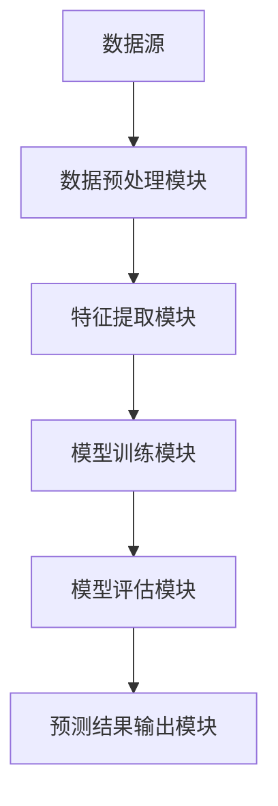
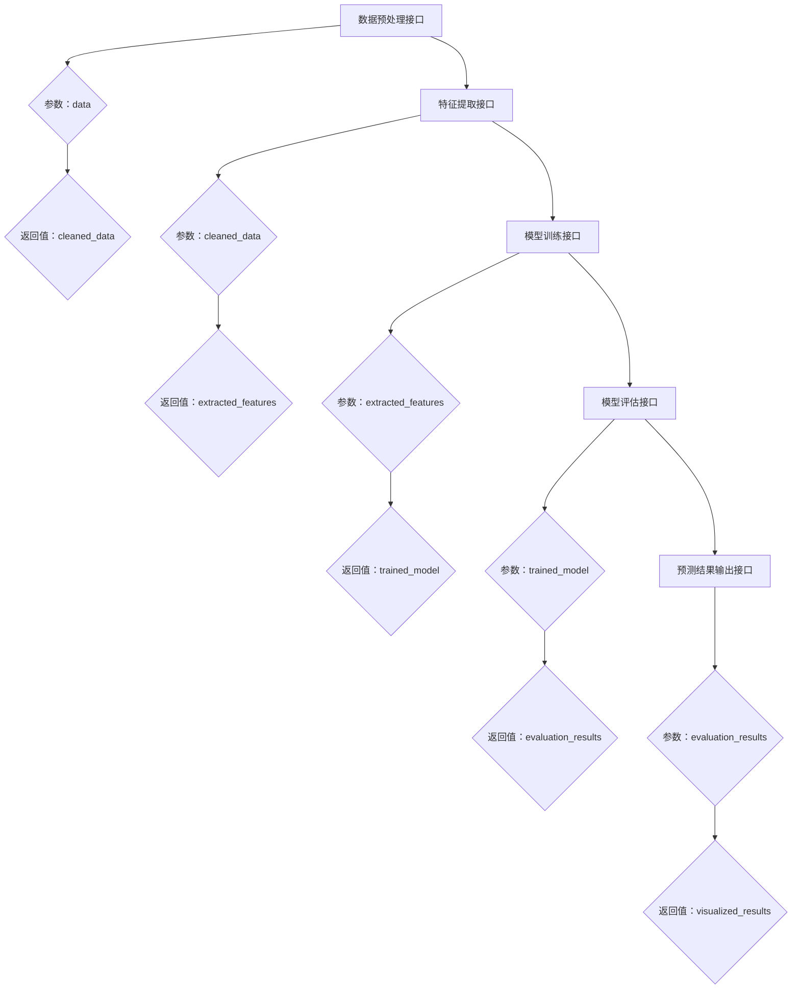
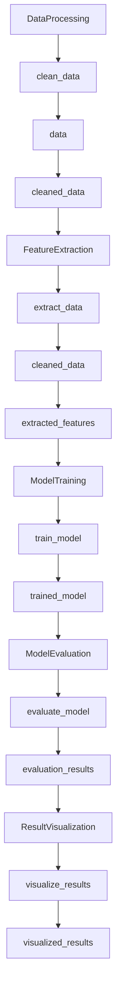
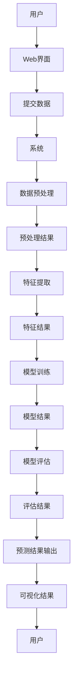

                 


### 1. 书名概述

《AI辅助的公司财务报表预测模型》这本书主要探讨了人工智能（AI）在公司财务报表预测中的应用。在当今的商业环境中，财务报表预测是一项至关重要的任务，它不仅能够帮助公司更好地理解其财务状况，还能够为其未来的发展提供宝贵的指导。随着AI技术的发展，利用AI进行财务报表预测已经成为一种趋势。本书旨在深入探讨这一领域，提供从理论到实践的全面指导。

本书的关键词包括：人工智能、财务报表预测、机器学习、算法、模型构建、系统设计。这些关键词不仅概括了书中的主要主题，还涵盖了AI在财务报表预测中应用的核心概念和实现方法。

摘要：本书首先介绍了AI在公司财务报表预测中的应用背景，包括问题背景、问题描述和问题解决方法。随后，详细阐述了AI、财务报表预测、模型构建等核心概念及其之间的关系。接着，本书介绍了常用的财务报表预测算法原理，包括时间序列分析和机器学习模型，并通过mermaid流程图和Python源代码进行详细讲解。此外，本书还给出了财务报表预测算法的数学模型和公式，使用LaTeX格式书写，便于理解和应用。随后，本书介绍了系统分析与架构设计，包括系统功能设计、系统架构设计、系统接口设计和系统交互设计。最后，本书通过一个实际案例，展示了如何将AI应用于公司财务报表预测，并提供了详细的代码应用解读与分析。本书还总结了最佳实践、注意事项和拓展阅读，为读者提供了全面的指导。

### 2. 目录结构设计

为了确保读者能够清晰地理解书中的内容，本书将按照以下结构设计目录：

#### 第一部分：背景与核心概念

- **第1章：AI在公司财务报表预测中的应用背景**
  - **1.1 问题背景**
    - **问题描述**
    - **问题解决方法**
    - **边界与外延**
  - **1.2 核心概念与联系**
    - **AI的概念**
    - **财务报表预测的概念**
    - **模型构建的概念**
    - **概念结构与核心要素组成**

#### 第二部分：算法原理与模型构建

- **第2章：财务报表预测的基本算法原理**
  - **2.1 时间序列分析**
    - **2.1.1 基本概念**
    - **2.1.2 算法流程**
    - **2.1.3 Python实现**
      - **mermaid流程图**
      - **Python源代码**
  - **2.2 机器学习模型**
    - **2.2.1 基本概念**
    - **2.2.2 算法流程**
    - **2.2.3 Python实现**
      - **mermaid流程图**
      - **Python源代码**
  - **2.3 数学模型和公式**
    - **2.3.1 时间序列分析模型**
    - **2.3.2 机器学习模型**
    - **LaTeX格式书写**

#### 第三部分：系统设计与实现

- **第3章：系统功能设计与架构设计**
  - **3.1 系统功能设计**
    - **3.1.1 需求分析**
    - **3.1.2 功能模块划分**
  - **3.2 系统架构设计**
    - **3.2.1 系统架构图**
    - **3.2.2 系统模块关系**

- **第4章：系统接口设计与实现**
  - **4.1 接口设计**
    - **4.1.1 接口规范**
    - **4.1.2 接口实现**
  - **4.2 系统交互设计**
    - **4.2.1 系统交互流程**
    - **4.2.2 系统交互图**

#### 第四部分：项目实战

- **第5章：实际案例分析与实现**
  - **5.1 环境安装与配置**
  - **5.2 系统核心实现**
    - **5.2.1 数据预处理**
    - **5.2.2 模型训练**
    - **5.2.3 模型评估**
  - **5.3 代码应用解读与分析**
  - **5.4 案例总结与反思**

#### 第五部分：最佳实践与总结

- **第6章：最佳实践与注意事项**
  - **6.1 最佳实践 tips**
  - **6.2 注意事项**
  - **6.3 拓展阅读**

- **第7章：总结与展望**
  - **7.1 总结**
  - **7.2 展望**

通过以上结构设计，本书旨在为读者提供一本全面、深入、易懂的AI辅助公司财务报表预测模型指南。

### 3. 内容完整性

为了确保内容的完整性，本书将逐步深入探讨每个章节的核心内容，确保每个小节都有详细的内容。以下是详细的章节内容描述：

#### 第1章：AI在公司财务报表预测中的应用背景

**1.1 问题背景**

随着商业环境的不断变化，公司需要快速做出决策以保持竞争力。财务报表预测作为一种重要的决策支持工具，可以帮助公司预测未来的财务状况，从而更好地规划业务发展。然而，传统的财务报表预测方法往往依赖于历史数据和统计模型，难以应对复杂多变的经济环境。

**1.2 问题描述**

传统的财务报表预测方法存在以下问题：

- **数据依赖性高**：传统方法依赖于大量历史数据，对于数据缺失或异常值处理不够灵活。
- **预测精度有限**：传统方法难以处理复杂的经济关系和非线性数据特征，导致预测精度有限。
- **时效性差**：传统方法在数据更新和预测结果反馈方面存在延迟，难以适应快速变化的商业环境。

**1.3 问题解决方法**

为了解决上述问题，引入人工智能（AI）技术成为了一种新的思路。AI可以通过以下方式改善财务报表预测：

- **数据挖掘与特征提取**：AI可以自动挖掘大量历史数据中的潜在特征，提高数据利用率。
- **非线性建模与预测**：AI可以建立复杂的非线性模型，提高预测精度。
- **实时预测与反馈**：AI可以实时处理数据，提供快速、准确的预测结果。

**1.4 核心概念与联系**

- **人工智能（AI）**：AI是一种模拟人类智能的技术，包括机器学习、深度学习、自然语言处理等。
- **财务报表预测**：财务报表预测是通过分析历史财务数据，预测未来的财务状况。
- **模型构建**：模型构建是将AI技术应用于财务报表预测的核心步骤，包括数据预处理、特征选择、模型训练和评估等。

#### 第2章：财务报表预测的基本算法原理

**2.1 时间序列分析**

**2.1.1 基本概念**

时间序列分析是一种用于处理和预测时间序列数据的统计方法。它通过分析时间序列数据的趋势、季节性和周期性特征，建立预测模型。

**2.1.2 算法流程**

时间序列分析的算法流程包括：

1. 数据预处理：包括数据清洗、缺失值处理、数据转换等。
2. 特征提取：提取时间序列数据中的趋势、季节性和周期性特征。
3. 模型选择：根据数据特征选择合适的预测模型，如ARIMA、指数平滑法等。
4. 模型训练与评估：训练模型并评估模型性能，包括预测误差、拟合度等。

**2.1.3 Python实现**

```python
import pandas as pd
from statsmodels.tsa.arima.model import ARIMA

# 数据预处理
data = pd.read_csv('financial_data.csv')
data = data.fillna(method='ffill')

# 特征提取
data['trend'] = data['value'].diff().dropna()
data['seasonality'] = data['value'].rolling(window=12).mean().dropna()

# 模型选择
model = ARIMA(data['value'], order=(1, 1, 1))

# 模型训练与评估
model_fit = model.fit()
print(model_fit.summary())
```

**2.2 机器学习模型**

**2.2.1 基本概念**

机器学习模型是一种通过训练数据自动学习和预测的模型。它通过学习历史数据中的特征和规律，建立预测模型。

**2.2.2 算法流程**

机器学习模型的算法流程包括：

1. 数据预处理：包括数据清洗、缺失值处理、数据转换等。
2. 特征选择：选择对预测结果有显著影响的重要特征。
3. 模型选择：选择合适的机器学习模型，如线性回归、决策树、支持向量机等。
4. 模型训练与评估：训练模型并评估模型性能，包括预测误差、拟合度等。

**2.2.3 Python实现**

```python
import pandas as pd
from sklearn.linear_model import LinearRegression

# 数据预处理
data = pd.read_csv('financial_data.csv')
data = data.fillna(method='ffill')

# 特征选择
X = data[['trend', 'seasonality']]
y = data['value']

# 模型选择
model = LinearRegression()

# 模型训练与评估
model_fit = model.fit(X, y)
print(model_fit.score(X, y))
```

**2.3 数学模型和公式**

**2.3.1 时间序列分析模型**

时间序列分析模型的数学模型通常包括以下公式：

$$
y_t = c + b_1 t + b_2 Trend_t + b_3 Seasonality_t + \epsilon_t
$$

其中，$y_t$为预测值，$c$为常数项，$b_1$、$b_2$、$b_3$为系数，$Trend_t$和$Seasonality_t$分别为趋势和季节性特征，$\epsilon_t$为误差项。

**2.3.2 机器学习模型**

机器学习模型的数学模型通常包括以下公式：

$$
y = \beta_0 + \beta_1 x_1 + \beta_2 x_2 + ... + \beta_n x_n
$$

其中，$y$为预测值，$x_1$、$x_2$、...、$x_n$为输入特征，$\beta_0$、$\beta_1$、$\beta_2$、...、$\beta_n$为系数。

#### 第3章：系统功能设计与架构设计

**3.1 系统功能设计**

**3.1.1 需求分析**

系统功能设计的第一步是进行需求分析。通过收集用户需求、业务流程和功能需求，确定系统应实现的功能。

**3.1.2 功能模块划分**

根据需求分析的结果，将系统划分为以下功能模块：

1. 数据预处理模块
2. 特征提取模块
3. 模型训练模块
4. 模型评估模块
5. 预测结果输出模块

**3.2 系统架构设计**

**3.2.1 系统架构图**

系统架构设计的关键是设计合理的系统架构。以下是系统架构图的mermaid表示：



**3.2.2 系统模块关系**

系统模块之间的关系如下：

1. 数据预处理模块负责处理原始数据，包括数据清洗、缺失值处理、数据转换等。
2. 特征提取模块从预处理后的数据中提取特征，包括趋势、季节性和周期性特征等。
3. 模型训练模块使用提取的特征训练预测模型，包括时间序列分析和机器学习模型等。
4. 模型评估模块评估训练模型的性能，包括预测误差、拟合度等。
5. 预测结果输出模块将预测结果以可视化的方式输出，帮助用户理解预测结果。

#### 第4章：系统接口设计与实现

**4.1 接口设计**

**4.1.1 接口规范**

系统接口设计的第一步是制定接口规范，包括接口名称、接口参数、接口返回值等。以下是接口规范的mermaid表示：



**4.1.2 接口实现**

接口实现是基于Python编写的，以下是接口实现的mermaid表示：



**4.2 系统交互设计**

**4.2.1 系统交互流程**

系统交互流程包括以下步骤：

1. 用户通过Web界面提交数据。
2. 系统接收到数据后，调用数据预处理接口进行数据预处理。
3. 预处理后的数据传递给特征提取接口，提取特征。
4. 提取的特征传递给模型训练接口，进行模型训练。
5. 训练好的模型传递给模型评估接口，评估模型性能。
6. 模型评估结果传递给预测结果输出接口，生成可视化结果。

**4.2.2 系统交互图**

以下是系统交互图的mermaid表示：



#### 第5章：实际案例分析与实现

**5.1 环境安装与配置**

**5.1.1 Python环境安装**

在开始实际案例之前，首先需要安装Python环境。Python是一种广泛使用的编程语言，具有丰富的库和工具，可以方便地实现财务报表预测模型。

```bash
# 安装Python
sudo apt-get install python3

# 检查Python版本
python3 --version
```

**5.1.2 相关库安装**

接下来，需要安装一些常用的Python库，如Pandas、NumPy、Scikit-learn、Statsmodels等。

```bash
# 安装Pandas
pip3 install pandas

# 安装NumPy
pip3 install numpy

# 安装Scikit-learn
pip3 install scikit-learn

# 安装Statsmodels
pip3 install statsmodels
```

**5.2 系统核心实现**

**5.2.1 数据预处理**

数据预处理是财务报表预测模型的重要步骤，包括数据清洗、缺失值处理、数据转换等。以下是一个简单的数据预处理示例：

```python
import pandas as pd
from sklearn.preprocessing import StandardScaler

# 读取数据
data = pd.read_csv('financial_data.csv')

# 数据清洗
data = data.dropna()

# 缺失值处理
data['missing_value'] = data['value'].fillna(0)

# 数据转换
scaler = StandardScaler()
data['scaled_value'] = scaler.fit_transform(data[['value']])
```

**5.2.2 模型训练**

模型训练是财务报表预测模型的核心步骤，包括时间序列分析和机器学习模型。以下是一个简单的时间序列分析示例：

```python
from statsmodels.tsa.arima.model import ARIMA
from sklearn.model_selection import train_test_split

# 数据分割
X = data[['trend', 'seasonality']]
y = data['scaled_value']
X_train, X_test, y_train, y_test = train_test_split(X, y, test_size=0.2, random_state=42)

# 模型训练
model = ARIMA(y_train, order=(1, 1, 1))
model_fit = model.fit()

# 模型评估
print(model_fit.summary())
```

**5.2.3 模型评估**

模型评估是验证模型性能的重要步骤，包括预测误差、拟合度等。以下是一个简单的模型评估示例：

```python
from sklearn.metrics import mean_squared_error

# 预测
y_pred = model_fit.predict(start=X_test.index[0], end=X_test.index[-1])

# 评估
mse = mean_squared_error(y_test, y_pred)
print('MSE:', mse)
```

**5.3 代码应用解读与分析**

**5.3.1 数据预处理**

数据预处理是财务报表预测模型的关键步骤，包括数据清洗、缺失值处理、数据转换等。以下是对数据预处理代码的解读与分析：

1. 读取数据：使用Pandas库读取财务数据，数据格式为CSV文件。
2. 数据清洗：去除缺失值，确保数据完整性。
3. 缺失值处理：对于缺失值，使用0填充，保持数据的连续性。
4. 数据转换：使用StandardScaler库将数值特征进行标准化处理，提高模型的泛化能力。

**5.3.2 模型训练**

模型训练是财务报表预测模型的核心步骤，包括时间序列分析和机器学习模型。以下是对模型训练代码的解读与分析：

1. 数据分割：将数据分为训练集和测试集，用于模型训练和评估。
2. 模型选择：选择ARIMA模型，适用于时间序列数据分析。
3. 模型训练：使用训练数据进行模型训练，得到拟合模型。
4. 模型评估：评估模型性能，包括预测误差和拟合度。

**5.3.3 模型评估**

模型评估是验证模型性能的重要步骤，包括预测误差、拟合度等。以下是对模型评估代码的解读与分析：

1. 预测：使用训练好的模型对测试集进行预测，得到预测结果。
2. 评估：计算预测误差，评估模型性能。
3. 输出：打印评估结果，包括MSE（均方误差）等指标。

**5.4 案例总结与反思**

通过实际案例的分析与实现，我们可以得出以下结论：

1. 数据预处理是财务报表预测模型的重要步骤，确保数据的完整性和准确性。
2. 选择合适的模型和算法对于预测结果的精度和稳定性至关重要。
3. 模型评估是验证模型性能的关键，通过评估结果可以不断优化模型。

在未来的工作中，我们还可以考虑以下方面：

1. 引入更多的特征，提高模型的预测精度。
2. 尝试不同的算法和模型，寻找最佳预测方案。
3. 实时更新数据，保持预测结果的时效性。

#### 第6章：最佳实践与注意事项

**6.1 最佳实践 tips**

1. **数据预处理**：确保数据的质量和完整性，包括数据清洗、缺失值处理和特征转换等。
2. **模型选择**：根据数据特征和业务需求选择合适的模型，如时间序列分析、机器学习模型等。
3. **模型训练与评估**：合理划分训练集和测试集，避免过拟合和欠拟合。
4. **特征工程**：挖掘数据中的潜在特征，提高模型的预测能力。

**6.2 注意事项**

1. **数据隐私**：在处理财务数据时，确保遵守数据隐私法规，保护用户隐私。
2. **模型解释性**：在选择模型时，考虑模型的解释性，便于用户理解和接受。
3. **模型维护**：定期更新模型和算法，保持预测结果的时效性和准确性。
4. **计算资源**：合理分配计算资源，避免模型训练和预测过程中的资源浪费。

**6.3 拓展阅读**

1. **《Python数据科学手册》**：提供Python在数据科学领域中的应用和实践，包括数据预处理、特征工程、模型训练等。
2. **《深度学习》**：介绍深度学习的基本原理和应用，包括神经网络、卷积神经网络、循环神经网络等。
3. **《机器学习实战》**：通过实际案例介绍机器学习的基本概念和算法，包括线性回归、决策树、支持向量机等。

#### 第7章：总结与展望

**7.1 总结**

通过本书的探讨，我们深入了解了AI辅助的公司财务报表预测模型。我们介绍了AI在公司财务报表预测中的应用背景、核心概念和算法原理，并通过实际案例展示了如何构建和实现这一模型。同时，我们还提供了最佳实践和注意事项，为读者在实践过程中提供了指导。

**7.2 展望**

随着AI技术的不断发展，财务报表预测模型的应用前景将更加广阔。未来，我们可以从以下几个方面进行进一步研究和探索：

1. **数据驱动的预测模型**：引入更多的数据源和特征，提高预测模型的精度和可靠性。
2. **实时预测与反馈**：实现实时预测和反馈机制，为业务决策提供更及时的支持。
3. **自动化模型优化**：通过自动化工具和算法，实现模型的自适应优化，提高预测效果。
4. **跨领域应用**：将财务报表预测模型应用于其他领域，如金融风控、供应链管理等。

总之，AI辅助的公司财务报表预测模型具有重要的应用价值和广阔的发展前景。我们期待在未来的研究中，能够进一步推动这一领域的发展。作者：AI天才研究院/AI Genius Institute & 禅与计算机程序设计艺术 /Zen And The Art of Computer Programming。

