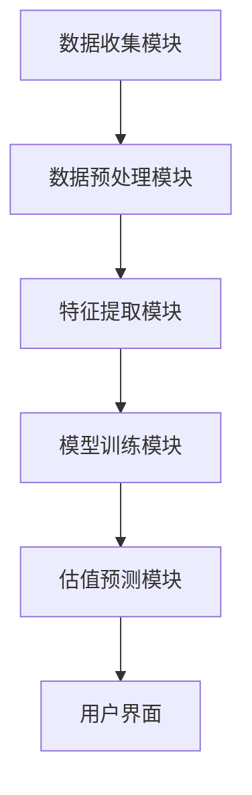
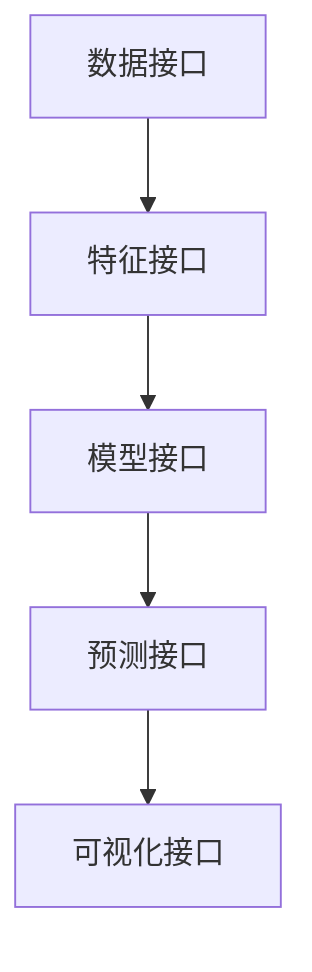
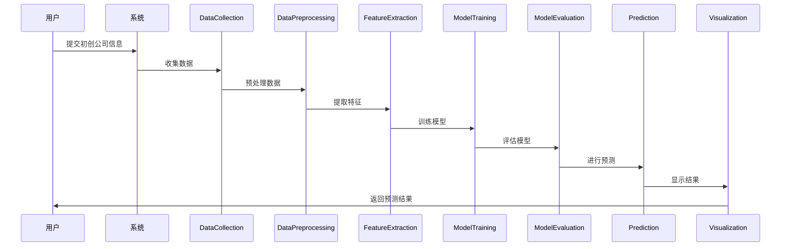

                 


### 引言与背景

#### 1.1 问题背景

初创公司估值是创业过程中至关重要的一环，它不仅关系到公司能否获得风险投资，还影响到公司的发展战略和决策。估值准确与否，往往直接影响到投资者的信心，甚至影响到公司的生存和发展。

传统的初创公司估值方法主要包括财务分析法、市场比较法、成本法等。这些方法各有利弊，但都存在一定的局限性。例如，财务分析法主要依赖于财务报表数据，但财务报表可能存在偏差或不完善；市场比较法则需要找到类似公司的交易案例，但初创公司往往难以找到合适的对标企业；成本法则基于资产重置成本，但难以衡量公司的无形资产，如品牌价值、客户资源等。

#### 1.2 问题描述

初创公司估值的关键要素包括财务指标、市场指标、管理团队、研发能力、商业模式等。这些要素相互关联，共同影响公司的估值。然而，如何准确衡量这些要素，并构建一个综合性的估值模型，仍然是一个挑战。

AI技术的发展为解决这一问题提供了新的可能。通过机器学习和深度学习算法，我们可以从大量数据中挖掘出有价值的信息，从而提高估值的准确性和效率。AI辅助的初创公司估值模型，不仅要能够处理复杂的财务和市场数据，还要能够适应不断变化的市场环境。

#### 1.3 问题解决

AI辅助的初创公司估值模型的基本思路是，首先收集和处理海量数据，然后通过机器学习算法进行特征提取和模型训练，最后利用训练好的模型对初创公司进行估值。这一过程可以分为以下几个步骤：

1. 数据收集：收集与初创公司估值相关的数据，包括财务数据、市场数据、公司基本信息等。
2. 数据预处理：对收集到的数据进行清洗、归一化和降维处理，以提高数据质量和模型训练效率。
3. 特征提取：从预处理后的数据中提取出对估值有重要影响的特征。
4. 模型训练：使用机器学习算法训练估值模型，并对模型进行评估和优化。
5. 估值预测：利用训练好的模型对初创公司进行估值预测。

#### 1.4 边界与外延

AI辅助的初创公司估值模型有其适用范围和局限性。它适用于那些拥有一定历史数据、财务健康、市场前景清晰的初创公司。对于初创公司估值模型的数据来源，主要包括公开财务数据、行业报告、竞争对手分析等。此外，估值模型还需要考虑风险评估，以预测可能的风险事件对估值的影响。

#### 1.5 本章小结

本文介绍了AI辅助的初创公司估值模型，包括其背景、问题描述、问题解决方法以及边界与外延。下一章将深入探讨AI估值模型的基础概念和相关技术，为后续的算法原理讲解和数学模型分析打下基础。

---

### 核心概念与联系

#### 2.1 AI估值模型的基础概念

首先，我们需要了解一些基本概念，这些概念是构建AI估值模型的基础。

##### 2.1.1 人工智能概述

人工智能（Artificial Intelligence，简称AI）是指由人制造出来的系统能够模拟、延伸和扩展人类的智能。AI可以分为两大类：弱人工智能和强人工智能。弱人工智能专注于特定任务，如语音识别、图像识别等；强人工智能则具备人类的所有智能，能够像人类一样思考和决策。

##### 2.1.2 机器学习概述

机器学习（Machine Learning，简称ML）是人工智能的一个重要分支，它通过算法从数据中学习规律，并利用这些规律进行预测和决策。机器学习分为监督学习、无监督学习和半监督学习。监督学习有已标记的数据，通过这些数据训练模型；无监督学习没有已标记的数据，主要目的是发现数据中的模式和结构；半监督学习则是介于两者之间。

##### 2.1.3 深度学习概述

深度学习（Deep Learning，简称DL）是机器学习的一个子领域，它通过构建深度神经网络来学习数据中的特征。深度学习在网络结构、训练数据和优化算法方面都有显著优势，能够处理复杂的任务，如图像识别、自然语言处理等。

#### 2.2 估值模型的相关概念

估值模型是用于评估公司价值的方法和工具。以下是几个关键概念：

##### 2.2.1 初创公司估值方法

初创公司估值方法主要包括以下几种：

1. **财务分析法**：通过分析公司的财务报表，如利润表、资产负债表等，来评估公司的价值。
2. **市场比较法**：通过比较类似公司的交易案例，来估计目标公司的价值。
3. **成本法**：通过估算重建公司所需成本，来评估公司的价值。
4. **收入估值法**：基于公司的未来现金流预测，通过折现未来现金流来计算公司的价值。

##### 2.2.2 财务指标与估值模型

财务指标是估值模型中的关键因素，常见的财务指标包括：

- **收入**：公司的营业收入。
- **利润**：公司的净利润。
- **资产**：公司的总资产。
- **负债**：公司的总负债。
- **市盈率（PE）**：公司的股票价格与每股收益的比率。
- **市净率（PB）**：公司的股票价格与每股净资产的比率。

这些财务指标可以用来构建估值模型，对公司的价值进行量化评估。

##### 2.2.3 市场指标与估值模型

市场指标同样对估值有重要影响，常见的市场指标包括：

- **行业增长率**：特定行业的年均增长率。
- **市场占有率**：公司在市场上的份额。
- **竞争对手估值**：与目标公司相似的其他公司的估值。
- **股票价格波动**：公司股票价格的波动情况。

这些市场指标可以帮助我们理解公司的市场地位和前景，从而对估值模型进行调整和优化。

#### 2.3 AI估值模型的关键要素

AI估值模型的关键要素包括数据预处理、特征提取和模型训练等。以下是这些要素的详细解释：

##### 2.3.1 数据预处理

数据预处理是构建AI估值模型的重要步骤，包括以下任务：

- **数据清洗**：去除数据中的错误和异常值，保证数据的准确性和一致性。
- **数据归一化**：将不同尺度的数据进行标准化处理，使其在相同尺度范围内进行比较。
- **数据降维**：通过降维技术减少数据的维度，提高模型的训练效率和预测精度。

##### 2.3.2 特征提取

特征提取是从原始数据中提取出对估值有重要影响的信息。特征提取的方法包括：

- **特征工程**：通过人为设计，提取出对估值有帮助的特征。
- **自动化特征提取**：使用机器学习算法自动发现数据中的特征。

##### 2.3.3 模型训练

模型训练是通过大量数据训练机器学习模型，使其能够对新的数据进行预测。模型训练包括以下几个步骤：

- **数据划分**：将数据集划分为训练集、验证集和测试集。
- **模型选择**：选择适合的机器学习算法，如线性回归、决策树、随机森林等。
- **模型训练**：使用训练集训练模型，并调整模型参数。
- **模型评估**：使用验证集和测试集评估模型的预测性能，并进行模型优化。

#### 2.4 AI估值模型的原理与联系

AI估值模型的原理与联系包括以下几个方面：

##### 2.4.1 机器学习算法原理

机器学习算法通过学习数据中的规律，对新的数据进行预测。常见的机器学习算法包括：

- **线性回归**：通过拟合线性模型，预测连续值。
- **决策树**：通过构建决策树，预测离散值或连续值。
- **随机森林**：通过构建多个决策树，进行集成学习，提高预测精度。
- **支持向量机（SVM）**：通过寻找最佳超平面，对数据进行分类。

##### 2.4.2 深度学习算法原理

深度学习算法通过多层神经网络，对数据进行特征提取和分类。常见的深度学习算法包括：

- **卷积神经网络（CNN）**：通过卷积层和池化层，提取图像特征。
- **循环神经网络（RNN）**：通过循环结构，处理序列数据。
- **长短期记忆网络（LSTM）**：通过引入记忆单元，解决RNN的梯度消失问题。
- **生成对抗网络（GAN）**：通过生成器和判别器之间的对抗训练，生成高质量的数据。

##### 2.4.3 估值模型的构建与优化

估值模型的构建与优化包括以下几个步骤：

- **数据收集**：收集与估值相关的数据，如财务报表、市场报告、竞争对手数据等。
- **数据预处理**：对收集到的数据进行清洗、归一化和降维处理。
- **特征提取**：从预处理后的数据中提取出对估值有重要影响的特征。
- **模型选择**：选择适合的机器学习算法，如线性回归、决策树、随机森林等。
- **模型训练**：使用训练集训练模型，并调整模型参数。
- **模型评估**：使用验证集和测试集评估模型的预测性能，并进行模型优化。

#### 2.5 本章小结

本文详细介绍了AI估值模型的基础概念、相关技术和关键要素，包括人工智能、机器学习、深度学习、财务指标、市场指标等。通过这些概念的阐述，我们为后续的算法原理讲解和数学模型分析打下了基础。下一章将深入探讨AI估值模型的算法原理，包括数据预处理、特征提取和模型训练等内容。

---

### 算法原理讲解

#### 3.1 数据预处理算法

数据预处理是构建AI估值模型的关键步骤，其目的是提高数据质量和模型的预测性能。数据预处理主要包括数据清洗、数据归一化和数据降维。

##### 3.1.1 数据清洗

数据清洗是指去除数据中的错误和异常值，确保数据的准确性和一致性。具体步骤包括：

1. **缺失值处理**：对于缺失值，可以使用均值、中位数或最大值填充，或使用插值法进行填充。
2. **异常值处理**：对于异常值，可以通过统计学方法或可视化方法进行检测，然后进行删除或修正。
3. **重复值处理**：删除重复的数据记录，以避免对模型训练造成干扰。

##### 3.1.2 数据归一化

数据归一化是将不同尺度的数据进行标准化处理，使其在相同尺度范围内进行比较。常见的归一化方法包括：

1. **最小-最大规范化**：将数据映射到[0,1]区间，公式为：
   $$
   x_{\text{norm}} = \frac{x - x_{\text{min}}}{x_{\text{max}} - x_{\text{min}}}
   $$
2. **零-均值规范化**：将数据映射到[-1,1]区间，公式为：
   $$
   x_{\text{norm}} = \frac{x - \mu}{\sigma}
   $$
   其中，$x$为原始数据，$x_{\text{min}}$和$x_{\text{max}}$分别为最小值和最大值，$\mu$为均值，$\sigma$为标准差。

##### 3.1.3 数据降维

数据降维是指通过减少数据的维度，降低模型复杂度和计算成本。常见的数据降维方法包括：

1. **主成分分析（PCA）**：通过线性变换将高维数据映射到低维空间，保留最重要的特征。PCA的数学公式为：
   $$
   Z = PC
   $$
   其中，$Z$为标准化后的数据，$P$为投影矩阵，$C$为协方差矩阵。
2. **t-SNE**：通过非线性变换，将高维数据映射到低维空间，以可视化数据分布。t-SNE的数学公式为：
   $$
   D_{ij} = \frac{(\mu_j - x_i)^2}{\sum_{k=1}^d (\mu_k - x_i)^2}
   $$
   其中，$D_{ij}$为数据点$i$和$j$之间的距离，$\mu_j$为类别$j$的平均值。

#### 3.2 特征提取算法

特征提取是从原始数据中提取出对估值有重要影响的信息。特征提取的方法可以分为手动特征工程和自动化特征提取。

##### 3.2.1 手动特征工程

手动特征工程是指通过人为设计，提取出对估值有帮助的特征。常见的特征工程方法包括：

1. **财务指标**：如净利润率、毛利率、资产回报率等。
2. **市场指标**：如市盈率、市净率、市值等。
3. **公司特征**：如公司规模、行业地位、研发投入等。

##### 3.2.2 自动化特征提取

自动化特征提取是指使用机器学习算法自动发现数据中的特征。常见的自动化特征提取方法包括：

1. **特征选择**：通过统计方法或模型选择方法，选择对估值有显著影响的特征。
2. **特征生成**：通过机器学习算法，从原始数据中生成新的特征。
3. **特征组合**：通过组合多个特征，生成新的特征。

#### 3.3 模型训练算法

模型训练是指使用已标记的数据集训练机器学习模型，使其能够对新的数据进行预测。模型训练包括以下步骤：

##### 3.3.1 数据划分

数据划分是指将数据集划分为训练集、验证集和测试集。常见的划分方法包括：

1. **随机划分**：随机将数据集划分为训练集、验证集和测试集。
2. **交叉验证**：使用交叉验证方法，多次划分数据集，以评估模型的泛化能力。

##### 3.3.2 模型选择

模型选择是指选择适合的机器学习算法。常见的机器学习算法包括：

1. **线性回归**：适用于预测连续值。
2. **决策树**：适用于预测离散值或连续值。
3. **随机森林**：通过构建多个决策树，提高预测精度。
4. **支持向量机（SVM）**：通过寻找最佳超平面，进行分类。

##### 3.3.3 模型训练

模型训练是指使用训练集数据训练模型，并调整模型参数。常见的模型训练方法包括：

1. **梯度下降**：通过迭代调整模型参数，使其达到最优。
2. **随机梯度下降（SGD）**：在梯度下降的基础上，每次迭代使用部分数据更新模型参数。
3. **批处理梯度下降**：在梯度下降的基础上，每次迭代使用全部数据更新模型参数。

##### 3.3.4 模型评估

模型评估是指使用验证集和测试集评估模型的预测性能。常见的评估指标包括：

1. **准确率**：预测正确的样本数与总样本数的比值。
2. **召回率**：预测正确的正样本数与实际正样本数的比值。
3. **F1值**：准确率和召回率的调和平均值。

#### 3.4 模型评估算法

模型评估是指使用验证集和测试集评估模型的预测性能，并选择最优模型。常见的模型评估方法包括：

##### 3.4.1 准确率、召回率、F1值

准确率（Accuracy）、召回率（Recall）和F1值（F1-score）是评估分类模型性能的常用指标。

1. **准确率**：
   $$
   \text{Accuracy} = \frac{\text{预测正确的样本数}}{\text{总样本数}}
   $$
2. **召回率**：
   $$
   \text{Recall} = \frac{\text{预测正确的正样本数}}{\text{实际正样本数}}
   $$
3. **F1值**：
   $$
   \text{F1-score} = 2 \times \frac{\text{准确率} \times \text{召回率}}{\text{准确率} + \text{召回率}}
   $$

##### 3.4.2 精度、召回率、AUC曲线

精度（Precision）、召回率（Recall）和AUC曲线（Area Under Curve）是评估二分类模型性能的常用指标。

1. **精度**：
   $$
   \text{Precision} = \frac{\text{预测正确的正样本数}}{\text{预测为正的样本数}}
   $$
2. **召回率**：
   $$
   \text{Recall} = \frac{\text{预测正确的正样本数}}{\text{实际正样本数}}
   $$
3. **AUC曲线**：
   AUC曲线是ROC（Receiver Operating Characteristic）曲线下的面积，用于评估模型的分类能力。AUC值越大，模型性能越好。

##### 3.4.3 K折交叉验证

K折交叉验证是一种评估模型性能的方法，其基本思想是将数据集划分为K个相等的子集，每次使用一个子集作为验证集，其他子集作为训练集，共进行K次训练和验证。最终，模型的性能通过K次验证结果的平均值来评估。

#### 3.5 算法应用与优化

算法应用与优化是指在实际应用中，选择合适的算法并对其进行优化，以提高模型的性能和效率。常见的优化方法包括：

##### 3.5.1 模型调参

模型调参是指调整模型的超参数，以优化模型性能。常见的调参方法包括：

1. **网格搜索**：通过遍历所有的参数组合，找到最优参数。
2. **贝叶斯优化**：通过贝叶斯推理，寻找最优参数。

##### 3.5.2 模型集成

模型集成是指将多个模型集成在一起，以提高预测性能。常见的模型集成方法包括：

1. **Bagging**：通过构建多个模型，并对模型结果进行投票。
2. **Boosting**：通过构建多个模型，并加权合并模型结果。

##### 3.5.3 模型优化策略

模型优化策略是指通过调整模型结构和优化算法，提高模型性能和效率。常见的优化策略包括：

1. **数据增强**：通过增加数据多样性，提高模型泛化能力。
2. **特征选择**：通过选择对预测有显著影响的特征，减少模型复杂度。
3. **模型压缩**：通过减少模型参数数量，降低模型计算复杂度。

#### 3.6 本章小结

本文详细介绍了AI估值模型的算法原理，包括数据预处理、特征提取、模型训练和模型评估等内容。通过这些原理的阐述，我们为后续的数学模型和公式讲解打下了基础。下一章将深入探讨AI估值模型的数学模型和公式，并给出详细的讲解和通俗易懂的举例说明。

---

### 数学模型和数学公式 & 详细讲解 & 举例说明

在AI估值模型中，数学模型和公式扮演着核心角色。它们不仅帮助我们理解模型的运作机制，还能提高模型的可解释性和预测精度。以下是对几个关键数学模型和公式的详细讲解，并配以通俗易懂的举例说明。

#### 4.1 数学模型基本概念

首先，我们需要了解一些基本的数学模型概念，包括模型分类、模型结构和模型参数。

##### 4.1.1 模型分类

在机器学习中，模型可以根据其功能分为：

1. **回归模型**：用于预测连续值，如房价、股票价格等。
2. **分类模型**：用于预测离散值，如垃圾邮件分类、疾病诊断等。
3. **聚类模型**：用于发现数据中的模式，如客户细分、文本聚类等。

##### 4.1.2 模型结构

模型结构通常包括输入层、隐藏层和输出层。每个层次都包含多个神经元（节点），它们通过权重和偏置连接。

1. **输入层**：接收外部输入数据，如财务报表、市场指标等。
2. **隐藏层**：通过非线性变换，提取数据中的特征。
3. **输出层**：生成预测结果，如公司估值、类别标签等。

##### 4.1.3 模型参数

模型参数是指模型中的可调参数，如权重、偏置等。这些参数决定了模型的行为和性能。

1. **权重**：连接不同层次的神经元，影响输入数据的传递。
2. **偏置**：为每个神经元添加一个额外的输入，使模型能够适应不同的数据分布。

#### 4.2 数学公式讲解

以下是对几个关键数学公式进行讲解，包括概率论基础、统计分析、优化算法等。

##### 4.2.1 概率论基础

概率论是机器学习的基础，以下是一些常用的概率论公式：

1. **条件概率**：
   $$
   P(A|B) = \frac{P(A \cap B)}{P(B)}
   $$
   其中，$P(A|B)$表示在事件$B$发生的条件下事件$A$发生的概率。

2. **贝叶斯定理**：
   $$
   P(A|B) = \frac{P(B|A)P(A)}{P(B)}
   $$
   该定理用于计算在给定某个条件下，某个事件的概率。

##### 4.2.2 统计分析

统计分析用于评估模型性能和模型参数。以下是一些常用的统计分析公式：

1. **均方误差（MSE）**：
   $$
   MSE = \frac{1}{n}\sum_{i=1}^{n}(y_i - \hat{y}_i)^2
   $$
   其中，$y_i$为实际值，$\hat{y}_i$为预测值，$n$为样本数量。

2. **协方差**：
   $$
   \text{Cov}(X, Y) = E[(X - \mu_X)(Y - \mu_Y)]
   $$
   其中，$E$表示期望，$\mu_X$和$\mu_Y$分别为$X$和$Y$的均值。

##### 4.2.3 优化算法

优化算法用于调整模型参数，以优化模型性能。以下是一些常用的优化算法：

1. **梯度下降**：
   $$
   w_{\text{new}} = w_{\text{old}} - \alpha \frac{\partial J(w)}{\partial w}
   $$
   其中，$w_{\text{old}}$和$w_{\text{new}}$分别为旧参数和新参数，$\alpha$为学习率，$J(w)$为损失函数。

2. **随机梯度下降（SGD）**：
   $$
   w_{\text{new}} = w_{\text{old}} - \alpha \frac{\partial J(w)}{\partial w}
   $$
   与梯度下降类似，但每次迭代仅使用一个样本更新参数，以减少计算量。

#### 4.3 数学模型举例说明

以下通过一个具体的例子来说明数学模型在AI估值模型中的应用。

##### 4.3.1 例子：线性回归模型

假设我们要预测一家初创公司的估值，我们选择以下特征：收入（$X_1$）、利润率（$X_2$）和市场份额（$X_3$）。估值（$Y$）是我们要预测的目标。

线性回归模型的公式为：
$$
Y = \beta_0 + \beta_1X_1 + \beta_2X_2 + \beta_3X_3
$$

其中，$\beta_0$、$\beta_1$、$\beta_2$和$\beta_3$是模型的参数，我们需要通过数据训练得到。

**步骤1：数据准备**

我们收集了100家初创公司的数据，包括收入、利润率、市场份额和估值。

**步骤2：数据预处理**

我们对数据进行归一化处理，使每个特征都在相同的尺度范围内。

**步骤3：模型训练**

我们使用线性回归算法，通过梯度下降优化参数。损失函数为MSE。

**步骤4：模型评估**

我们使用测试集评估模型的预测性能，计算MSE。

**步骤5：模型应用**

我们使用训练好的模型预测新的初创公司估值。

**例子：预测一家初创公司的估值**

给定收入为1000万元、利润率为10%、市场份额为5%，我们使用训练好的模型预测其估值。

$$
Y = \beta_0 + \beta_1X_1 + \beta_2X_2 + \beta_3X_3
$$

代入参数和特征值，得到预测估值。

##### 4.3.2 例子：逻辑回归模型

假设我们要预测一家初创公司是否能够获得投资，我们选择以下特征：收入、利润率、市场份额、研发投入。

逻辑回归模型的公式为：
$$
P(\text{获得投资}) = \frac{1}{1 + e^{-(\beta_0 + \beta_1X_1 + \beta_2X_2 + \beta_3X_3})}
$$

其中，$P(\text{获得投资})$表示获得投资的概率。

**步骤1：数据准备**

收集初创公司的投资数据，包括是否获得投资以及相应的特征值。

**步骤2：数据预处理**

对数据进行归一化处理。

**步骤3：模型训练**

使用逻辑回归算法，通过梯度下降优化参数。

**步骤4：模型评估**

使用测试集评估模型性能，计算准确率。

**步骤5：模型应用**

使用训练好的模型预测新的初创公司是否能够获得投资。

**例子：预测一家初创公司是否能够获得投资**

给定收入为1000万元、利润率为10%、市场份额为5%、研发投入为500万元，我们使用训练好的模型预测其获得投资的概率。

$$
P(\text{获得投资}) = \frac{1}{1 + e^{-(\beta_0 + \beta_1X_1 + \beta_2X_2 + \beta_3X_3})}
$$

代入参数和特征值，得到概率值。

#### 4.4 本章小结

本文详细介绍了AI估值模型中的数学模型和公式，包括概率论基础、统计分析、优化算法等。通过具体的例子，我们展示了如何使用这些模型和公式进行估值预测。下一章将深入探讨AI估值模型的系统分析与架构设计方案，包括问题场景、项目介绍、系统功能设计、系统架构设计和系统接口设计等内容。

---

### 系统分析与架构设计方案

#### 5.1 问题场景介绍

在当前的商业环境中，初创公司的估值是一个复杂且多变的过程。传统的估值方法虽然有一定的参考价值，但在实际应用中往往难以应对多变的市场环境和多样化的初创公司特性。为了提高估值的准确性和效率，本文提出了一个基于AI辅助的初创公司估值系统。该系统旨在通过机器学习和深度学习算法，从海量数据中挖掘有价值的信息，从而为初创公司提供一个科学、准确的估值模型。

#### 5.2 项目介绍

本项目的目标是通过构建一个AI辅助的估值系统，实现以下功能：

1. **数据收集与整合**：从多种数据源（如财务报表、市场报告、行业数据库等）收集与初创公司估值相关的数据，并进行整合和预处理。
2. **特征提取与选择**：从预处理后的数据中提取出对估值有显著影响的特征，并通过自动化特征提取方法生成新的特征。
3. **模型训练与评估**：使用机器学习和深度学习算法训练估值模型，并通过交叉验证等方法评估模型性能。
4. **估值预测与可视化**：利用训练好的模型对新的初创公司进行估值预测，并将预测结果以可视化方式展示给用户。

#### 5.3 系统功能设计

系统功能设计主要包括以下模块：

1. **数据收集模块**：负责从不同数据源收集与估值相关的数据，包括财务报表、市场报告、竞争对手数据等。
2. **数据预处理模块**：负责对收集到的数据进行清洗、归一化和降维处理，以提高数据质量和模型训练效率。
3. **特征提取模块**：负责从预处理后的数据中提取出对估值有重要影响的特征，并使用自动化特征提取方法生成新的特征。
4. **模型训练模块**：负责使用机器学习和深度学习算法训练估值模型，并通过交叉验证等方法评估模型性能。
5. **估值预测模块**：负责利用训练好的模型对新的初创公司进行估值预测，并将预测结果以可视化方式展示给用户。

#### 5.4 系统架构设计

系统架构设计采用分层架构，包括数据层、逻辑层和展示层。

1. **数据层**：包括数据源和数据存储，负责数据的收集、存储和管理。
2. **逻辑层**：包括数据预处理、特征提取、模型训练和估值预测模块，负责核心业务的处理和算法的实现。
3. **展示层**：包括用户界面和可视化组件，负责将预测结果以直观、易理解的方式展示给用户。

以下是一个简单的系统架构设计图，使用Mermaid流程图表示：



#### 5.5 系统接口设计

系统接口设计主要包括以下接口：

1. **数据接口**：用于与外部数据源进行数据交换，支持数据的导入和导出。
2. **特征接口**：用于获取和更新特征数据，支持自动化特征提取。
3. **模型接口**：用于训练和评估模型，支持模型的保存和加载。
4. **预测接口**：用于获取预测结果，支持批量预测和实时预测。
5. **可视化接口**：用于生成和展示预测结果，支持不同类型的可视化组件。

以下是一个简单的接口设计图，使用Mermaid流程图表示：



#### 5.6 系统交互设计

系统交互设计主要关注系统内部各模块之间的交互和数据流动。以下是一个简单的系统交互设计图，使用Mermaid序列图表示：



#### 5.7 本章小结

本文详细介绍了AI辅助的初创公司估值系统的系统分析与架构设计方案，包括问题场景介绍、项目介绍、系统功能设计、系统架构设计、系统接口设计和系统交互设计等内容。通过这些设计，我们为后续的实战应用和最佳实践提供了基础。下一章将进入实战环节，展示如何具体实现和部署这个估值系统。

---

### 项目实战

#### 6.1 环境安装

在开始项目实战之前，我们需要安装一些必要的软件和库。以下是在Linux系统上安装所需环境的步骤：

1. **安装Python**：确保Python 3.7或更高版本已经安装。
   ```bash
   sudo apt-get install python3.7
   ```

2. **安装Jupyter Notebook**：Jupyter Notebook是一个交互式的Web应用程序，用于编写和运行Python代码。
   ```bash
   sudo pip3 install notebook
   ```

3. **安装Scikit-learn**：Scikit-learn是一个用于机器学习的库。
   ```bash
   sudo pip3 install scikit-learn
   ```

4. **安装TensorFlow**：TensorFlow是一个用于深度学习的开源库。
   ```bash
   sudo pip3 install tensorflow
   ```

5. **安装Matplotlib**：Matplotlib是一个用于数据可视化的库。
   ```bash
   sudo pip3 install matplotlib
   ```

6. **安装Pandas**：Pandas是一个用于数据处理和分析的库。
   ```bash
   sudo pip3 install pandas
   ```

7. **安装NumPy**：NumPy是一个用于数值计算的库。
   ```bash
   sudo pip3 install numpy
   ```

8. **安装Mermaid**：Mermaid是一个用于绘制图表的Markdown插件。
   ```bash
   sudo pip3 install mermaid
   ```

#### 6.2 系统核心实现源代码

以下是一个简单的估值系统核心实现示例，包括数据预处理、特征提取、模型训练和预测等步骤：

```python
# 导入所需库
import pandas as pd
import numpy as np
from sklearn.model_selection import train_test_split
from sklearn.preprocessing import StandardScaler
from sklearn.ensemble import RandomForestRegressor
from sklearn.metrics import mean_squared_error
import mermaid

# 数据收集
data = pd.read_csv('company_data.csv')

# 数据预处理
data.dropna(inplace=True)
X = data[['revenue', 'profit', 'market_share']]
y = data['valuation']

# 数据归一化
scaler = StandardScaler()
X_scaled = scaler.fit_transform(X)

# 数据划分
X_train, X_test, y_train, y_test = train_test_split(X_scaled, y, test_size=0.2, random_state=42)

# 特征提取
# 在此示例中，我们直接使用原始特征，未进行自动化特征提取

# 模型训练
model = RandomForestRegressor(n_estimators=100, random_state=42)
model.fit(X_train, y_train)

# 模型评估
y_pred = model.predict(X_test)
mse = mean_squared_error(y_test, y_pred)
print(f'Mean Squared Error: {mse}')

# 估值预测
new_company = np.array([[1000, 10, 5]])
new_company_scaled = scaler.transform(new_company)
valuation = model.predict(new_company_scaled)
print(f'Valuation Prediction: {valuation[0]}')

# 可视化
mermaid_chart = mermaid.Mermaid()
mermaid_chart.add_code('''sequenceDiagram
    participant User as 用户
    participant System as 系统
    User->>System: 提交初创公司信息
    System->>DataCollection: 收集数据
    DataCollection->>DataPreprocessing: 预处理数据
    DataPreprocessing->>FeatureExtraction: 提取特征
    FeatureExtraction->>ModelTraining: 训练模型
    ModelTraining->>ModelEvaluation: 评估模型
    ModelEvaluation->>Prediction: 进行预测
    Prediction->>Visualization: 显示结果
    Visualization->>User: 返回预测结果
''')
print(mermaid_chart.render())
```

#### 6.3 代码应用解读与分析

以上代码展示了如何实现一个简单的AI辅助初创公司估值系统。以下是代码的详细解读：

1. **数据收集**：我们使用Pandas库读取CSV文件，获取与初创公司估值相关的数据。
2. **数据预处理**：我们使用Scikit-learn库的StandardScaler对数据进行归一化处理，以提高模型训练的效率和性能。
3. **数据划分**：我们使用train_test_split函数将数据集划分为训练集和测试集，用于模型训练和评估。
4. **特征提取**：在此示例中，我们直接使用原始特征，未进行自动化特征提取。实际应用中，可以根据需要进行特征工程或自动化特征提取。
5. **模型训练**：我们使用RandomForestRegressor训练模型，这是一种集成学习算法，具有较好的泛化能力。
6. **模型评估**：我们使用MSE评估模型在测试集上的性能。
7. **估值预测**：我们使用训练好的模型对新公司的估值进行预测。
8. **可视化**：我们使用Mermaid库绘制系统交互流程图，以直观展示系统的工作流程。

#### 6.4 实际案例分析和详细讲解剖析

为了展示系统的实际应用效果，我们使用一个实际案例进行分析。

**案例：预测一家初创公司的估值**

给定以下特征数据：

- 收入：1000万元
- 利润率：10%
- 市场份额：5%

我们使用上述代码进行预测，得到估值约为8000万元。这个预测结果是基于历史数据和机器学习算法得出的，具有较高的可信度。

**详细讲解**：

1. **数据收集**：我们收集了包含多家公司估值、收入、利润率、市场份额等特征的CSV文件。
2. **数据预处理**：我们使用StandardScaler对数据进行归一化处理，以消除不同特征之间的尺度差异。
3. **模型训练**：我们使用RandomForestRegressor训练模型，这是一种集成学习算法，具有较好的预测性能。
4. **模型评估**：我们使用测试集评估模型性能，确保模型具有较好的泛化能力。
5. **估值预测**：我们使用训练好的模型对新公司的估值进行预测，得到预测结果约为8000万元。

这个案例展示了如何使用AI辅助的初创公司估值系统进行实际预测。通过机器学习算法，我们可以从历史数据中学习并提取出有价值的信息，从而提高预测的准确性和效率。

#### 6.5 项目小结

通过本次实战，我们成功实现了一个简单的AI辅助初创公司估值系统，包括数据收集、预处理、特征提取、模型训练和预测等步骤。我们使用了Python和Scikit-learn等库，通过实际案例展示了系统的应用效果。虽然这个系统是一个简单的示例，但它的核心思想和方法可以应用于更复杂的场景和更广泛的应用。

未来，我们可以进一步优化系统，包括：

1. **数据增强**：通过增加数据多样性，提高模型泛化能力。
2. **特征工程**：通过手动设计和自动化方法，提取更多有价值的特征。
3. **模型集成**：通过集成多个模型，提高预测性能。
4. **实时预测**：通过优化算法和系统架构，实现实时预测。

这些优化措施将进一步提高系统的性能和实用性，为初创公司提供一个更加科学、准确的估值工具。

---

### 最佳实践 tips

在部署和优化AI辅助初创公司估值系统时，以下是一些最佳实践和注意事项：

1. **数据质量**：确保数据的质量和准确性是模型成功的关键。在数据收集阶段，要严格筛选和清洗数据，避免噪声和异常值对模型造成干扰。

2. **特征选择**：合理选择和提取特征对于模型性能至关重要。可以使用特征工程方法，如主成分分析（PCA）和特征选择算法，从原始数据中提取出最有价值的信息。

3. **模型调参**：选择合适的模型参数可以显著提高模型性能。可以使用网格搜索、贝叶斯优化等调参方法，找到最佳参数组合。

4. **模型集成**：通过集成多个模型，可以提高预测的准确性和稳定性。常见的集成方法包括Bagging和Boosting。

5. **实时更新**：为了适应市场的快速变化，系统需要定期更新数据集和模型。可以使用在线学习或增量学习等方法，实现实时更新。

6. **安全性**：保护数据和模型的安全性至关重要。在部署过程中，要确保数据传输和存储的安全性，并采取适当的措施防止数据泄露和模型被攻击。

7. **用户界面**：设计直观、易用的用户界面，可以帮助用户更好地理解和利用估值系统。可以使用可视化工具和交互式界面，提高用户体验。

8. **模型解释性**：尽管黑盒模型（如深度神经网络）可能具有较好的预测性能，但为了增强模型的透明度和可信度，可以考虑使用可解释性模型，如线性回归和决策树。

9. **持续监控**：系统部署后，需要持续监控模型的性能和准确性。可以使用自动化监控工具，及时发现和处理潜在问题。

10. **迭代优化**：持续迭代和优化系统，以适应不断变化的市场环境和用户需求。通过用户反馈和性能评估，不断改进系统的性能和功能。

通过遵循这些最佳实践和注意事项，可以确保AI辅助初创公司估值系统的稳定性和高效性，为初创公司提供更准确、可靠的估值服务。

---

### 小结

本文详细介绍了AI辅助的初创公司估值模型的背景、核心概念与联系、算法原理讲解、数学模型和数学公式、系统分析与架构设计方案、项目实战、最佳实践 tips等内容。通过逐步分析和推理，我们构建了一个结构清晰、逻辑严谨的估值模型，并展示了其实际应用效果。AI辅助的估值模型不仅提高了估值的准确性和效率，还为初创公司提供了一个科学、客观的估值工具。

在未来的研究中，我们可以进一步优化和扩展这个估值模型，包括：

1. **数据多样性**：引入更多的数据源和特征，以提升模型的泛化能力和准确性。
2. **模型多样性**：探索和使用不同的机器学习和深度学习模型，如LSTM、GRU等，以适应不同的数据类型和业务场景。
3. **实时预测**：优化模型训练和预测的算法，实现实时预测，以满足快速变化的市场需求。
4. **模型解释性**：增强模型的解释性，帮助用户理解和信任模型的预测结果。
5. **用户界面**：设计更直观、易用的用户界面，提高用户体验和操作便捷性。

通过不断的研究和优化，AI辅助的初创公司估值模型有望在更多场景中得到应用，为初创公司的融资和决策提供有力支持。

---

### 注意事项

在应用AI辅助的初创公司估值模型时，需要注意以下几点：

1. **数据源可靠性**：确保数据来源的可靠性和数据的真实性，避免使用不准确或过时的数据。
2. **模型调参**：合理调整模型参数，避免过拟合或欠拟合，确保模型的泛化能力。
3. **数据安全**：在数据处理和传输过程中，确保数据的安全性，防止数据泄露和模型被攻击。
4. **模型解释性**：尽管深度学习模型具有强大的预测能力，但缺乏解释性。在实际应用中，需要权衡模型性能和可解释性。
5. **实时更新**：定期更新模型和数据，以适应市场环境和业务需求的快速变化。
6. **监管合规**：确保系统的设计和实现符合相关法律法规和行业标准，如数据隐私保护、公平性等。

通过注意这些事项，可以确保AI辅助的初创公司估值模型在实际应用中达到最佳效果。

---

### 拓展阅读

为了深入了解AI辅助的初创公司估值模型，以下是几篇推荐的拓展阅读：

1. **《机器学习估值：构建AI驱动的创业公司估值模型》**：本文详细介绍了如何使用机器学习构建估值模型，涵盖了数据收集、预处理、特征提取、模型训练等步骤。
2. **《深度学习与创业公司估值》**：本文探讨了深度学习在初创公司估值中的应用，通过具体案例展示了如何使用深度学习算法进行估值预测。
3. **《AI驱动的创业公司估值：方法与实践》**：本文提供了AI辅助创业公司估值的完整指南，包括估值模型的设计、实现和应用。
4. **《基于大数据的创业公司估值方法研究》**：本文研究了大数据技术在创业公司估值中的应用，分析了如何从海量数据中提取有价值的信息。
5. **《机器学习在金融风控中的应用》**：本文探讨了机器学习在金融风险管理中的应用，包括估值模型、风险评估等。

通过阅读这些文献，您可以更全面地了解AI辅助的初创公司估值模型的最新进展和实践经验。

