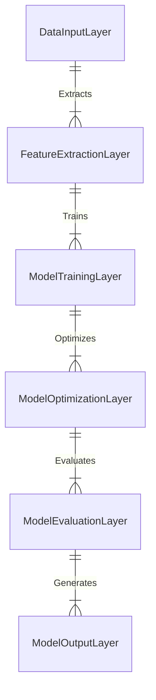
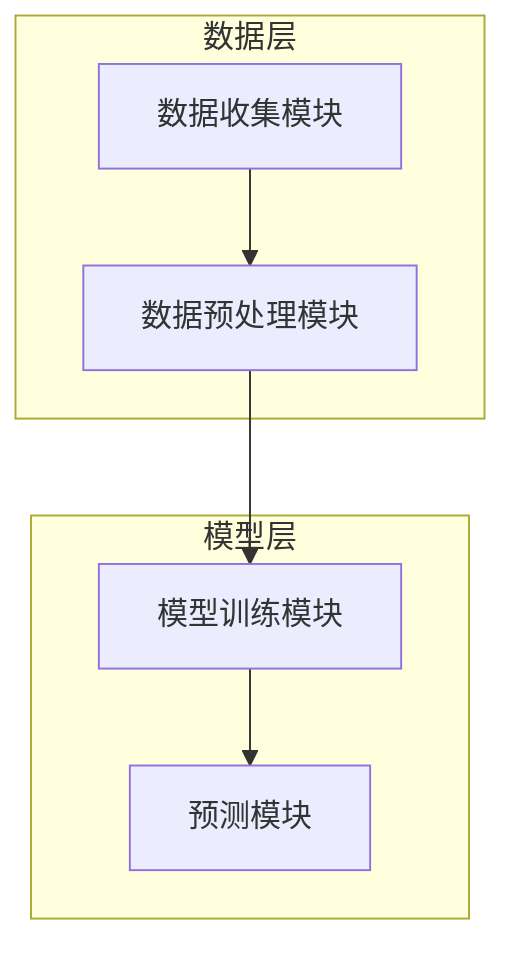

                 

### 1.1 问题背景

#### 1.1.1 金融市场的复杂性

金融市场是一个庞大且复杂的系统，涉及多种资产类别，包括股票、债券、商品、外汇等。每个市场都有其独特的运作机制和风险因素，这使得整体市场表现出高度的非线性和动态变化。资产价格受到多种因素的影响，如宏观经济指标、公司业绩、市场情绪、政治事件等。此外，市场参与者之间的互动行为也进一步增加了市场的复杂性和不可预测性。在这种背景下，对资产进行准确定价成为金融领域的一个重要且具有挑战性的任务。

#### 1.1.2 多资产类别定价模型的重要性

多资产类别定价模型在金融市场中的应用至关重要。这些模型能够帮助金融机构和投资者更好地理解和评估不同资产的价值，从而做出更为明智的投资决策。有效的定价模型可以减少投资风险，提高投资回报，优化资产配置。特别是在现代金融市场中，由于资产之间的相关性变得更加复杂，单一资产类别的定价模型往往无法提供全面的视角。因此，开发和应用多资产类别定价模型成为提高金融市场效率和透明度的关键手段。

#### 1.1.3 AI在金融领域的应用

随着人工智能技术的快速发展，AI已经成为金融领域的重要工具。在金融市场中，AI的应用场景广泛，包括风险管理、量化交易、客户服务、欺诈检测等。特别是在定价模型方面，AI能够通过大数据分析和机器学习算法，从海量历史数据中提取有效信息，识别市场趋势和潜在风险，从而提高定价模型的准确性和可靠性。AI辅助的多资产类别定价模型不仅能够处理更复杂的数据集，还能够动态调整模型参数，以适应不断变化的市场环境。

### 1.2 问题定义

#### 1.2.1 多资产类别定价模型的挑战

多资产类别定价模型的构建面临多个挑战。首先，数据来源多样且数据质量参差不齐，这使得特征工程和数据预处理变得复杂。其次，市场环境的动态变化要求模型具有高度的可适应性和实时性。此外，不同资产类别之间存在复杂的相互关系，这使得模型构建和优化更加困难。最后，模型评估和验证的难度也很大，因为市场波动和不确定性增加了模型预测的不稳定性。

#### 1.2.2 AI辅助校准的需求

面对上述挑战，传统的定价模型往往表现出局限性，难以应对复杂的金融市场环境。因此，AI辅助校准的需求应运而生。AI能够通过机器学习和深度学习算法，从大量历史数据中学习市场规律和模式，提高模型的预测能力和稳定性。AI辅助校准不仅能够提高模型参数的精度，还能够动态调整模型结构，以适应市场变化。此外，AI辅助校准还能够提高模型的透明度和可解释性，帮助投资者更好地理解模型决策过程。

#### 1.2.3 研究目的和书的主要贡献

本书旨在探讨AI辅助的多资产类别定价模型校准方法，通过系统性地介绍相关理论、方法和实践，旨在解决以下问题：

1. **多资产类别定价模型的构建和优化策略**：详细介绍如何利用AI技术构建高效的多资产类别定价模型，包括特征工程、模型选择和优化策略。
2. **模型校准的方法和流程**：系统介绍数据驱动和模型集成等校准方法，详细讲解模型校准的关键步骤和最佳实践。
3. **模型评估和优化**：探讨模型评估的指标和方法，以及如何通过参数调优和模型压缩等策略提高模型性能。
4. **实际应用案例**：通过实际案例展示AI辅助的多资产类别定价模型在金融投资、风险管理和交易策略中的应用。

本书的主要贡献包括：

- 提供一个全面的AI辅助多资产类别定价模型框架，涵盖理论、方法和实践。
- 通过具体案例研究，展示AI辅助校准方法在实际金融场景中的效果和可行性。
- 提供详细的算法原理和数学模型讲解，帮助读者深入理解AI辅助定价模型的工作机制。
- 提供最佳实践和注意事项，帮助读者在实际应用中避免常见错误和问题。

### 1.3 书籍结构概述

#### 1.3.1 全书章节安排

本书共分为五部分，具体章节安排如下：

- **第一部分：引言**：介绍问题背景、问题定义、研究目的和书籍结构。
- **第二部分：AI基础理论与方法**：介绍人工智能概述、多资产类别定价模型的挑战和AI辅助模型。
- **第三部分：AI辅助的多资产类别定价模型校准方法**：介绍模型校准的基本概念、数据驱动校准方法、模型集成与校准。
- **第四部分：模型评估与优化**：介绍模型评估方法、模型优化策略、模型部署与维护。
- **第五部分：AI辅助的多资产类别定价模型应用实践**：介绍应用场景、实践案例分享、项目实施经验与教训。

#### 1.3.2 核心概念与联系

本书的核心概念包括人工智能、多资产类别定价模型、模型校准方法、模型评估与优化等。这些概念相互联系，共同构成了一个完整的AI辅助多资产类别定价模型框架。通过系统性地介绍这些概念，本书旨在帮助读者全面了解AI辅助定价模型的构建、校准、评估和应用过程。

#### 1.3.3 阅读指南与预期成果

为了更好地理解本书的内容，建议读者按照以下步骤进行阅读：

1. **先通读全文，了解整体结构和内容**：通过阅读引言部分，了解问题背景、定义和研究目的，对全书有一个整体的认识。
2. **逐章深入学习**：从第二部分开始，依次学习AI基础理论与方法、模型校准方法、模型评估与优化、应用实践等内容。
3. **结合案例研究**：在阅读过程中，结合具体案例研究，加深对理论和方法的理解。
4. **实践与反思**：在读完每个部分后，尝试将所学知识应用于实际问题中，反思并总结实践经验。

通过阅读本书，读者可以：

- 全面了解AI辅助多资产类别定价模型的理论基础和实践方法。
- 掌握构建、校准、评估和优化多资产类别定价模型的核心技能。
- 获得实际应用AI辅助定价模型的经验和教训。

### 1.4 小结

本文简要介绍了AI辅助的多资产类别定价模型校准问题的背景、研究目的、书籍结构和核心概念。通过本文的概述，读者可以对本书的整体框架和内容有一个初步的了解。在接下来的章节中，我们将深入探讨人工智能的基础理论、多资产类别定价模型的构建与校准方法、模型评估与优化策略，以及AI辅助定价模型在实际应用中的具体实践。通过系统的学习和实践，读者将能够掌握AI辅助多资产类别定价模型的构建与应用，为金融市场的分析和投资决策提供有力支持。

### 2.1 人工智能概述

#### 2.1.1 人工智能的定义与发展历程

人工智能（Artificial Intelligence，简称AI）是计算机科学的一个分支，旨在使机器具备类似人类智能的能力，包括学习、推理、问题解决、自然语言理解和图像识别等。人工智能的概念最早可以追溯到20世纪50年代，当时，计算机科学家和哲学家开始探讨如何通过算法和计算模型实现机器智能。1956年，约翰·麦卡锡（John McCarthy）在达特茅斯会议上首次提出了“人工智能”一词，标志着人工智能作为一个独立研究领域的诞生。

自那以后，人工智能经历了多个发展阶段：

- **初始阶段（1956-1974）**：这是人工智能的探索阶段，以符号主义方法为主，强调通过逻辑推理和符号操作实现智能。代表工作包括逻辑理论家（Logic Theorist）和通用问题求解器（General Problem Solver）。
- **低谷阶段（1974-1980）**：由于实际应用效果不理想，人工智能研究进入了所谓的“寒冬期”。这一时期，学者们开始质疑符号主义方法的局限性，并探索新的方法。
- **复兴阶段（1980-1987）**：专家系统（Expert Systems）的兴起带来了人工智能研究的复兴。专家系统能够模拟人类专家的决策过程，处理特定领域的复杂问题。
- **神经网络阶段（1987-2012）**：1986年，深度学习的前身——反向传播算法（Backpropagation）的出现，开启了神经网络在人工智能中的应用。这一时期，神经网络在各种任务中取得了显著的成果，如图像识别、语音识别等。
- **人工智能新时代（2012至今）**：随着计算能力的提升和大数据的普及，深度学习和强化学习等先进技术得到了快速发展。AI在图像识别、自然语言处理、自动驾驶等领域取得了突破性进展，进入了广泛应用的阶段。

#### 2.1.2 机器学习的核心概念

机器学习（Machine Learning）是人工智能的一个重要分支，主要研究如何让计算机从数据中学习规律和模式，从而自动进行预测和决策。机器学习的基本流程包括数据收集、数据预处理、模型选择、模型训练、模型评估和模型部署。

- **数据收集**：数据是机器学习的基石。数据来源可以是公开数据集、企业内部数据、传感器数据等。数据的质量和多样性直接影响模型的效果。
- **数据预处理**：数据预处理包括数据清洗、数据集成、数据转换等步骤，旨在提高数据的质量和一致性，为后续建模提供良好的数据基础。
- **模型选择**：根据实际问题选择合适的机器学习模型。常见的模型包括线性回归、逻辑回归、支持向量机、决策树、随机森林、神经网络等。
- **模型训练**：使用训练数据对模型进行训练，通过调整模型参数，使模型能够学会数据的规律和模式。
- **模型评估**：使用验证数据集评估模型的性能，常见的评估指标包括准确率、召回率、F1分数、均方误差等。
- **模型部署**：将训练好的模型部署到实际应用环境中，实现自动化预测和决策。

#### 2.1.3 深度学习的基本原理

深度学习（Deep Learning）是机器学习的一个重要分支，以其多层神经网络结构而得名。深度学习通过多层非线性变换，从原始数据中提取高级特征，从而实现复杂任务的自动化学习。深度学习的基本原理包括：

- **多层神经网络**：深度学习模型由多个层级组成，每一层都能对输入数据进行变换和抽象。通过层层递进，模型能够从原始数据中提取出更加抽象和有用的特征。
- **前向传播和反向传播**：在前向传播阶段，输入数据通过多层神经网络进行传递和变换，最终输出预测结果。在反向传播阶段，通过计算预测结果与实际结果之间的误差，反向更新模型参数，使模型逐步逼近真实数据分布。
- **激活函数**：激活函数是深度学习模型中的一个关键组件，用于引入非线性变换，使模型能够处理非线性问题。常见的激活函数包括Sigmoid、ReLU、Tanh等。
- **优化算法**：深度学习模型训练过程中，需要优化算法来调整模型参数。常见的优化算法包括随机梯度下降（SGD）、Adam等。优化算法的效率和稳定性直接影响模型训练的速度和质量。

通过上述基本原理，深度学习能够实现高度自动化的特征提取和模式识别，在图像识别、自然语言处理、语音识别等任务中取得了显著的成果。

### 2.2 多资产类别定价模型的挑战

#### 2.2.1 多资产类别定价模型的复杂性

多资产类别定价模型的构建涉及到多个层面的复杂性，这些复杂性来源于金融市场的多变性和数据处理的复杂性。

- **数据来源的多样性**：金融市场涉及多种资产类别，如股票、债券、商品、外汇等。每种资产类别都有其独特的市场机制和数据特性。例如，股票市场数据可能包括日交易量、股价、公司财务报表等，而债券市场数据可能包括收益率、信用评级、到期日等。这种多样性使得数据集成和处理变得更加复杂。
- **数据质量的参差不齐**：金融数据的质量往往参差不齐。数据可能存在缺失值、异常值、噪声等问题，这些问题会直接影响模型的预测准确性。此外，不同来源的数据可能在格式、单位、时间戳等方面存在差异，需要通过数据预处理和清洗来确保数据的一致性和可靠性。
- **市场动态变化**：金融市场受到多种因素的影响，如宏观经济指标、政策变化、市场情绪等。这些因素不断变化，使得市场表现出高度的非线性和动态变化特征。这种动态性要求定价模型能够实时调整和更新，以适应市场的变化。
- **资产之间的相关性**：不同资产类别之间存在复杂的相互关系，这些关系可能表现出正相关、负相关或非线性相关。正确识别和处理这些相关性对于构建有效的定价模型至关重要。

#### 2.2.2 传统模型的局限性

在传统金融学中，定价模型主要基于理论模型和统计方法，如资本资产定价模型（CAPM）、套利定价理论（APT）等。然而，这些传统模型在应对金融市场复杂性和动态变化方面存在一定局限性：

- **理论基础薄弱**：传统模型通常基于某些简化的假设，如市场效率、投资者理性等。这些假设在现实市场中往往不成立，导致模型的预测准确性受到限制。
- **线性关系假设**：许多传统模型假设资产价格之间是线性相关，而实际市场中资产价格之间可能存在非线性关系。线性模型在处理复杂非线性问题时往往表现出不足。
- **数据依赖性**：传统模型对数据的质量和数量有较高要求。在数据缺失或不完整的情况下，模型的预测能力会大大降低。
- **实时性不足**：传统模型通常需要较长时间来建立和更新，无法满足金融市场的实时性要求。在快速变化的市场环境中，传统模型的反应速度往往滞后。

#### 2.2.3 AI技术的优势

AI技术的快速发展为多资产类别定价模型提供了新的解决方案。与传统的定价模型相比，AI技术具有以下优势：

- **大数据处理能力**：AI技术能够处理海量复杂的数据，从历史数据中提取有效信息，识别市场趋势和模式。这有助于提高模型的预测准确性和稳定性。
- **非线性建模能力**：AI模型，特别是深度学习模型，能够自动学习数据的非线性特征，处理复杂的市场关系。这使得模型能够更好地适应市场动态变化。
- **自适应性和实时性**：AI模型具有自我学习和自我优化的能力，能够根据新的数据和市场变化动态调整模型参数。这使得模型能够实时适应市场环境，提高预测的时效性。
- **透明度和可解释性**：尽管AI模型在预测准确性方面表现出色，但其内部决策过程往往缺乏透明度。近年来，一些研究致力于提高AI模型的解释性，帮助投资者理解模型的决策逻辑。

通过结合AI技术，多资产类别定价模型能够在复杂和动态的金融市场环境中表现出更高的效率和准确性，为金融机构和投资者提供更为可靠的投资决策支持。

### 2.3 AI辅助的多资产类别定价模型

#### 2.3.1 AI辅助模型的基本框架

AI辅助的多资产类别定价模型通常包括以下几个关键组成部分：

1. **数据输入层**：这一层负责接收和处理来自不同资产类别的历史数据、实时数据以及其他相关数据，如宏观经济指标、公司业绩报告、市场情绪指数等。数据输入层通常包含数据预处理模块，用于清洗、归一化和特征提取等操作，以确保输入数据的质量和一致性。

2. **特征提取层**：在这一层，AI模型会从原始数据中提取出对定价有显著影响的关键特征。特征提取可以通过传统统计方法或深度学习算法实现。深度学习方法，如卷积神经网络（CNN）和循环神经网络（RNN），能够自动学习数据的复杂特征，从而提高模型的预测能力。

3. **模型训练层**：模型训练层是AI辅助定价模型的核心。在这一层，AI模型通过机器学习和深度学习算法，利用训练数据集学习资产价格变化的规律和模式。常见的机器学习算法包括线性回归、决策树、随机森林、支持向量机等。深度学习算法，如深度信念网络（DBN）、卷积神经网络（CNN）和长短期记忆网络（LSTM），在处理高维数据和非线性关系方面表现出色。

4. **模型优化层**：在模型训练过程中，需要通过优化算法调整模型参数，以提高模型的预测性能。优化算法包括随机梯度下降（SGD）、Adam优化器等。此外，还可以通过交叉验证、网格搜索等技术选择最佳模型参数。

5. **模型评估层**：模型评估层用于评估模型的预测性能。常用的评估指标包括均方误差（MSE）、均方根误差（RMSE）、准确率、召回率、F1分数等。通过这些指标，可以量化模型的预测误差和泛化能力，从而判断模型是否满足应用要求。

6. **模型输出层**：模型输出层生成最终的定价结果。根据实际应用场景，输出可以是资产价格预测、投资组合优化建议或风险管理策略等。这一层还需要考虑模型的实时性，确保模型能够快速响应市场变化。

#### 2.3.2 特征工程与数据预处理

特征工程是AI辅助多资产类别定价模型构建中的关键环节，其目标是通过选择和构造有效特征，提高模型的预测性能。以下是特征工程和数据预处理的一些关键步骤：

1. **数据收集**：收集与资产定价相关的各种数据，包括历史价格、交易量、市场指数、宏观经济指标、公司财务数据等。数据来源可以是公开数据集、企业内部数据或第三方数据服务。

2. **数据清洗**：清洗数据以消除缺失值、异常值和噪声。缺失值可以通过插值、均值替换或使用模型预测来填充。异常值可以通过统计学方法或自定义规则来检测和剔除。噪声可以通过滤波或平滑技术来减少。

3. **数据集成**：将来自不同来源的数据进行整合，确保数据的一致性和完整性。数据集成可能涉及数据格式转换、时间对齐和缺失值处理。

4. **特征选择**：选择对资产定价有显著影响的关键特征。特征选择可以通过统计方法（如卡方检验、互信息等）或机器学习算法（如随机森林、LASSO等）实现。

5. **特征构造**：通过组合和转换原始特征，构造新的特征。特征构造可以增强模型的学习能力，例如，通过计算历史价格的移动平均、波动率等。

6. **数据标准化**：对数据进行归一化或标准化，以消除不同特征之间的尺度差异，提高模型训练的稳定性。常用的标准化方法包括最小-最大标准化和Z-Score标准化。

7. **特征提取**：使用深度学习算法自动提取高层次的抽象特征。特征提取可以通过卷积神经网络（CNN）处理图像数据，通过循环神经网络（RNN）处理序列数据等。

通过上述步骤，特征工程和数据预处理为AI辅助的多资产类别定价模型提供了高质量的数据输入，从而提高了模型的预测性能和稳定性。

#### 2.3.3 模型选择与优化策略

在AI辅助的多资产类别定价模型构建过程中，模型选择和优化策略是两个至关重要的环节。选择合适的模型并对其进行有效优化，可以显著提高模型的预测性能和稳定性。

1. **模型选择**：

- **线性模型**：线性回归、逻辑回归等线性模型在处理线性关系时表现出色，但在面对复杂非线性关系时可能显得力不从心。
- **树模型**：决策树、随机森林、梯度提升树（如XGBoost、LightGBM）等树模型能够处理非线性关系，且解释性较强。随机森林通过集成多棵决策树，提高了模型的预测稳定性和泛化能力。
- **神经网络**：深度神经网络（DNN）、卷积神经网络（CNN）、循环神经网络（RNN）等神经网络模型能够自动提取复杂特征，处理高维数据和非线性关系。深度学习模型在图像识别、自然语言处理等领域取得了显著成果，逐渐成为金融预测的重要工具。

2. **优化策略**：

- **交叉验证**：交叉验证是一种常用的模型评估方法，通过将数据集划分为训练集和验证集，多次训练和验证模型，以评估模型的泛化能力。常见的交叉验证方法包括K折交叉验证和留一法交叉验证。
- **网格搜索**：网格搜索是一种参数调优方法，通过遍历预设的参数组合，找到最佳参数组合。网格搜索可以结合交叉验证结果，选择最优模型参数。
- **贝叶斯优化**：贝叶斯优化是一种基于概率模型的优化方法，通过学习历史数据，预测最佳参数组合。贝叶斯优化在处理高维参数空间时表现出色，但计算成本较高。
- **进化算法**：进化算法是一种基于自然进化过程的优化方法，通过模拟自然选择和遗传机制，寻找最优解。进化算法适用于复杂非线性问题的优化，但可能需要较长的计算时间。

在选择和优化模型时，需要考虑以下几个方面：

- **模型复杂度**：复杂度较高的模型（如深度神经网络）能够捕捉到更多的数据特征，但计算成本较高，泛化能力也相对较强。复杂度较低的模型（如线性模型、树模型）计算成本较低，但可能无法充分捕捉数据特征。
- **数据规模**：数据规模较大的情况下，深度学习模型可能表现更好，因为它们能够从大量数据中学习复杂的特征关系。对于数据规模较小的任务，线性模型和树模型可能更合适。
- **计算资源**：模型的训练和优化过程需要大量的计算资源，特别是在深度学习模型中，训练时间较长。在选择模型时，需要考虑可用的计算资源，确保模型能够在合理时间内完成训练。

通过综合考虑上述因素，选择合适的模型并采用有效的优化策略，可以构建出高效、稳定且预测性能优异的多资产类别定价模型。

### 2.4 AI辅助模型的核心概念与联系

#### 2.4.1 算法原理与数学模型

AI辅助的多资产类别定价模型基于机器学习和深度学习算法，其核心原理是通过学习历史数据中的价格、交易量、市场情绪等特征，预测未来资产价格。以下是几种常见的机器学习算法和其数学模型：

1. **线性回归**：
   - **原理**：线性回归通过拟合一条直线，预测资产价格与自变量（如历史价格、交易量等）之间的关系。
   - **数学模型**：\[ Y = \beta_0 + \beta_1X + \epsilon \]
   其中，\( Y \) 是资产价格，\( X \) 是自变量，\( \beta_0 \) 和 \( \beta_1 \) 是模型参数，\( \epsilon \) 是误差项。

2. **逻辑回归**：
   - **原理**：逻辑回归用于分类问题，通过拟合一个逻辑函数，将资产价格分为高或低两个类别。
   - **数学模型**：\[ P(Y=1) = \frac{1}{1 + e^{-(\beta_0 + \beta_1X)}} \]
   其中，\( P(Y=1) \) 是资产价格高于某个阈值的概率，\( \beta_0 \) 和 \( \beta_1 \) 是模型参数。

3. **支持向量机（SVM）**：
   - **原理**：SVM通过寻找最佳分隔超平面，将不同类别的资产价格数据分开。
   - **数学模型**：\[ w \cdot x - b = 0 \]
   其中，\( w \) 是分隔超平面的法向量，\( x \) 是资产价格特征向量，\( b \) 是偏置项。

4. **神经网络**：
   - **原理**：神经网络通过多层非线性变换，从原始数据中提取高级特征，预测资产价格。
   - **数学模型**：\[ a_{\text{layer}} = \sigma(\theta_{\text{prev}} \cdot a_{\text{prev}}) \]
   其中，\( a_{\text{layer}} \) 是当前层的激活值，\( \sigma \) 是激活函数（如ReLU、Sigmoid等），\( \theta_{\text{prev}} \) 是前一层到当前层的权重。

#### 2.4.2 概念属性特征对比

以下是AI辅助多资产类别定价模型中的几个关键概念及其属性特征的对比：

| 概念 | 属性特征 |
| --- | --- |
| 数据输入层 | 处理多种数据来源，进行数据预处理 |
| 特征提取层 | 从原始数据中提取关键特征 |
| 模型训练层 | 使用机器学习或深度学习算法训练模型 |
| 模型优化层 | 调整模型参数，提高预测性能 |
| 模型评估层 | 使用评估指标评估模型性能 |
| 模型输出层 | 生成资产价格预测结果 |

这些概念相互关联，共同构成了AI辅助定价模型的核心框架。

#### 2.4.3 ER实体关系图架构

ER（Entity-Relationship）实体关系图是数据库设计中常用的一种建模工具，用于描述实体之间的关联关系。以下是AI辅助多资产类别定价模型中的ER图示例：



在该ER图中，各个层通过单向箭头表示它们之间的依赖关系，从数据输入层到模型输出层，描述了AI辅助多资产类别定价模型的构建和运行过程。

### 2.5 小结

本章详细介绍了AI辅助的多资产类别定价模型，包括其基本框架、特征工程与数据预处理、模型选择与优化策略，以及核心概念和ER图架构。通过理解这些内容，读者可以全面了解AI辅助定价模型的构建过程和关键要素，为后续章节的学习和应用打下坚实基础。

### 3.1 模型校准的基本概念

#### 3.1.1 模型校准的定义与目的

模型校准（Model Calibration）是指通过对模型参数进行调整，使其预测结果更加准确和可靠的过程。在AI辅助的多资产类别定价模型中，校准的目的是确保模型能够在实际应用中提供准确的定价预测，从而帮助金融机构和投资者做出明智的决策。模型校准主要包括以下几个关键步骤：

1. **参数调整**：通过调整模型参数，优化模型结构，使其更好地拟合数据。常见的参数调整方法包括随机梯度下降（SGD）、Adam优化器等。
2. **特征优化**：对输入特征进行选择、构造和优化，以提高模型的学习能力和预测性能。特征优化可以通过特征选择方法（如LASSO、随机森林等）和特征构造方法（如特征交叉、嵌入等）实现。
3. **超参数优化**：调整模型的超参数（如学习率、批量大小等），以找到最优的超参数组合，提高模型性能。超参数优化可以通过网格搜索、贝叶斯优化等策略实现。
4. **模型验证**：使用验证数据集对模型进行评估，确保模型的泛化能力和预测准确性。验证过程中可以使用交叉验证、时间序列分割等方法，以全面评估模型的性能。

#### 3.1.2 校准方法的选择

在AI辅助的多资产类别定价模型中，选择合适的校准方法至关重要。常见的校准方法包括数据驱动方法、模型集成方法和模型集成与校准方法。

1. **数据驱动方法**：数据驱动方法主要依赖于历史数据进行模型校准。该方法的核心是特征工程和数据预处理，通过选择和构造有效特征，提高模型的预测能力。常见的数据驱动方法包括线性回归、逻辑回归、决策树、随机森林等。数据驱动方法的优势在于计算成本低、解释性强，但在处理复杂非线性关系时可能效果不佳。

2. **模型集成方法**：模型集成方法通过结合多个模型的预测结果，提高模型的预测性能和稳定性。常见的模型集成方法包括Bagging（如随机森林）、Boosting（如XGBoost、LightGBM）和Stacking等。模型集成方法能够利用多个模型的优点，提高预测的准确性，但其计算成本较高，且需要处理多个模型之间的协同问题。

3. **模型集成与校准方法**：模型集成与校准方法结合了数据驱动方法和模型集成方法的优势，通过先进行模型集成，再对集成模型进行校准，实现更准确的预测。常见的模型集成与校准方法包括模型集成+参数调整、模型集成+超参数优化等。这种方法在提高模型性能的同时，还能保持较低的计算成本和较高的解释性。

#### 3.1.3 校准过程的关键步骤

模型校准过程可以分为以下几个关键步骤：

1. **数据准备**：收集和整理与资产定价相关的数据，包括历史价格、交易量、市场指标等。对数据进行清洗和预处理，确保数据的质量和一致性。

2. **特征工程**：选择和构造有效特征，以增强模型的学习能力。可以通过数据驱动方法进行特征选择和构造，例如使用LASSO、随机森林等算法。

3. **模型选择**：根据实际问题选择合适的机器学习模型，如线性回归、逻辑回归、神经网络等。选择模型时需要考虑模型的复杂度、计算成本和预测性能。

4. **模型训练**：使用训练数据集对模型进行训练，通过调整模型参数和超参数，优化模型结构。训练过程中可以使用交叉验证、网格搜索等技术，提高模型性能。

5. **模型评估**：使用验证数据集对模型进行评估，通过评估指标（如MSE、RMSE、准确率等）评估模型的预测性能。评估过程中可以结合模型集成方法，提高模型的预测稳定性。

6. **参数调整**：根据评估结果，对模型参数进行调整，以优化模型性能。参数调整可以通过手动调整或自动优化算法（如随机梯度下降、贝叶斯优化等）实现。

7. **模型部署**：将校准后的模型部署到实际应用环境中，实现实时定价预测。部署过程中需要考虑模型的实时性和计算资源需求。

通过以上关键步骤，可以构建和校准一个高效、稳定且预测性能优异的多资产类别定价模型，为金融机构和投资者提供有力支持。

### 3.2 数据驱动校准方法

#### 3.2.1 数据集构建

数据集构建是数据驱动校准方法的基础。一个高质量的数据集不仅需要包含丰富的历史数据，还需要确保数据的质量和一致性。以下是构建数据集的一些关键步骤：

1. **数据收集**：收集与资产定价相关的数据，包括历史价格、交易量、市场指标、宏观经济数据等。数据来源可以是公开数据集、企业内部数据或第三方数据服务。为了提高数据集的多样性和代表性，可以结合多个数据源。

2. **数据清洗**：清洗数据以消除缺失值、异常值和噪声。对于缺失值，可以使用插值、均值替换或模型预测等方法进行填充。对于异常值，可以使用统计学方法（如箱线图、Z-Score等）或自定义规则进行检测和剔除。对于噪声，可以使用滤波或平滑技术进行减少。

3. **数据集成**：将来自不同来源的数据进行整合，确保数据的一致性和完整性。数据集成可能涉及数据格式转换、时间对齐和缺失值处理。时间对齐是关键步骤，确保不同数据源的时间戳一致，以便进行有效分析。

4. **数据划分**：将数据集划分为训练集、验证集和测试集。通常，训练集用于模型训练，验证集用于模型评估，测试集用于最终评估模型性能。常见的划分方法包括时间序列分割、交叉验证等。

5. **数据标准化**：对数据进行归一化或标准化，以消除不同特征之间的尺度差异，提高模型训练的稳定性。常用的标准化方法包括最小-最大标准化和Z-Score标准化。

#### 3.2.2 特征选择与提取

特征选择与提取是数据驱动校准方法的核心步骤，旨在选择和构造对资产定价有显著影响的关键特征。以下是特征选择与提取的一些关键步骤：

1. **特征选择**：选择对资产定价有显著影响的特征。特征选择可以通过统计方法（如卡方检验、互信息等）或机器学习算法（如随机森林、LASSO等）实现。常用的特征选择方法包括过滤法、包裹法和嵌入式方法。

2. **特征构造**：通过组合和转换原始特征，构造新的特征，以增强模型的学习能力。特征构造可以通过计算历史价格的移动平均、波动率、相关性等实现。例如，可以使用技术指标（如MACD、RSI等）作为辅助特征。

3. **特征标准化**：对特征进行归一化或标准化，以消除不同特征之间的尺度差异，提高模型训练的稳定性。常用的标准化方法包括最小-最大标准化和Z-Score标准化。

4. **特征提取**：使用深度学习算法自动提取高层次的抽象特征。特征提取可以通过卷积神经网络（CNN）处理图像数据，通过循环神经网络（RNN）处理序列数据等。深度学习算法能够从原始数据中提取复杂的特征关系，提高模型的预测性能。

5. **特征选择与提取策略**：结合不同的特征选择和提取方法，构建高效的特征集合。特征选择与提取策略可以根据具体问题进行调整，例如在金融市场中，可以优先选择与市场波动性相关的特征。

通过上述步骤，可以构建高质量的数据集和有效的特征集合，为AI辅助的多资产类别定价模型提供可靠的数据基础，从而提高模型的预测准确性和稳定性。

#### 3.2.3 模型训练与评估

在数据驱动校准方法中，模型训练与评估是核心步骤，决定了模型的预测性能和稳定性。以下是模型训练与评估的详细步骤：

1. **模型选择**：根据实际问题选择合适的机器学习模型。常见的机器学习模型包括线性回归、逻辑回归、决策树、随机森林、梯度提升树等。选择模型时需要考虑模型的复杂度、计算成本和预测性能。对于复杂非线性问题，可以优先选择深度学习模型，如卷积神经网络（CNN）和循环神经网络（RNN）。

2. **模型初始化**：初始化模型参数，为模型训练提供一个起点。常见的初始化方法包括随机初始化、高斯初始化和Xavier初始化等。初始化参数的值会影响模型训练的过程和收敛速度。

3. **模型训练**：使用训练数据集对模型进行训练。模型训练过程通过优化算法（如随机梯度下降、Adam优化器等）调整模型参数，使其更好地拟合训练数据。训练过程中需要监控模型的收敛情况，防止过拟合。常用的监控方法包括验证集性能、学习曲线等。

4. **超参数调优**：通过调整模型的超参数（如学习率、批量大小、正则化参数等），提高模型性能。超参数调优可以通过网格搜索、贝叶斯优化等策略实现。调优过程中需要评估不同超参数组合的模型性能，选择最佳组合。

5. **模型评估**：使用验证数据集对模型进行评估，评估模型的预测性能和泛化能力。常用的评估指标包括均方误差（MSE）、均方根误差（RMSE）、准确率、召回率、F1分数等。评估过程中可以使用交叉验证、时间序列分割等技术，以全面评估模型的性能。

6. **模型调整**：根据评估结果，对模型进行调整和优化。模型调整可以包括重新训练模型、调整超参数、添加或删除特征等。调整过程中需要平衡模型的复杂度和预测性能，防止过拟合。

7. **模型验证**：在完成模型训练和调整后，使用测试数据集对模型进行验证，确保模型的预测性能和稳定性。测试数据集是一个独立的验证集，用于最终评估模型在实际应用中的性能。

通过以上步骤，可以构建和评估一个高效、稳定且预测性能优异的多资产类别定价模型。模型训练与评估过程需要不断迭代和优化，以提高模型的预测准确性和稳定性，为金融机构和投资者提供有力支持。

### 3.3 模型集成与校准

#### 3.3.1 模型集成的基本原理

模型集成（Model Ensembling）是一种通过结合多个模型预测结果，提高整体预测性能和稳定性的方法。其基本原理在于利用不同模型的优点，弥补单一模型的不足。以下是模型集成的一些基本原理：

1. **多样性原理**：模型集成通过结合多个模型的预测结果，可以降低模型预测的方差，提高预测的稳定性。不同模型具有不同的学习策略和特征提取方式，它们在不同数据集上的表现也不尽相同。通过集成这些模型，可以充分利用它们的多样性，降低预测误差。

2. **组合原理**：模型集成通过组合多个模型的预测结果，可以生成一个更加准确的预测。组合原理表明，多个模型的预测结果可以通过加权平均、投票法等策略进行组合，生成一个整体预测结果。

3. **优化原理**：模型集成可以通过优化算法，自动选择最佳的模型组合和权重分配。优化原理包括基于统计的优化方法（如线性回归、逻辑回归等）和基于机器学习的优化方法（如集成选择、自适应提升等）。

常见的模型集成方法包括：

- **Bagging**：通过随机抽样和重复训练多个模型，结合这些模型的预测结果进行投票或加权平均。代表性的方法包括随机森林（Random Forest）和提升树（Boosting Tree）。
- **Boosting**：通过迭代训练多个弱学习器，每次迭代都重点纠正前一轮预测的错误，生成一个强学习器。代表性的方法包括XGBoost、LightGBM等。
- **Stacking**：首先训练多个基础模型，然后将这些基础模型的预测结果作为输入，训练一个更高层次的模型，以生成最终预测结果。

#### 3.3.2 集成模型的构建

构建集成模型包括选择基础模型、确定集成策略和优化模型权重等步骤。以下是构建集成模型的一些关键步骤：

1. **基础模型选择**：根据实际问题选择多个基础模型。基础模型的选择应考虑模型的复杂度、计算成本和预测性能。常见的机器学习模型包括线性回归、决策树、随机森林、支持向量机等。对于复杂非线性问题，可以优先选择神经网络、卷积神经网络等深度学习模型。

2. **集成策略确定**：确定基础模型的集成策略，以生成最终预测结果。常见的集成策略包括投票法、加权平均法、堆叠法等。投票法通过多数投票确定最终预测结果，适用于分类问题；加权平均法通过加权每个基础模型的预测结果，生成最终预测结果，适用于回归问题；堆叠法通过训练一个更高层次的模型（元模型），结合基础模型的预测结果进行预测。

3. **模型权重优化**：通过优化算法确定基础模型的权重，以提高整体预测性能。权重优化的方法包括线性回归、逻辑回归、最小二乘法等。优化过程中，可以通过交叉验证、网格搜索等技术，找到最佳权重分配。

4. **集成模型训练与评估**：使用训练数据集对集成模型进行训练和评估。训练过程中，需要确保基础模型之间的协调和互补，以生成有效的预测结果。评估过程中，可以使用验证数据集对集成模型进行性能评估，选择最优的集成模型。

通过上述步骤，可以构建一个高效、稳定且预测性能优异的集成模型，为金融机构和投资者提供更准确的定价预测。

#### 3.3.3 集成模型校准策略

集成模型校准（Model Ensembling Calibration）是模型集成的重要补充，旨在通过调整集成模型中的各个基础模型的参数，提高整体预测的准确性和稳定性。以下是集成模型校准的一些关键策略：

1. **参数调整**：对集成模型中的各个基础模型进行参数调整，以优化模型的预测性能。参数调整可以通过手动调整或自动优化算法（如随机梯度下降、贝叶斯优化等）实现。调整过程中需要监控模型的性能变化，确保参数调整不会导致过拟合。

2. **交叉验证**：使用交叉验证对集成模型进行性能评估，确保模型在不同数据集上的预测性能稳定。交叉验证方法包括K折交叉验证、留一法交叉验证等。通过交叉验证，可以评估集成模型的泛化能力和预测误差。

3. **超参数优化**：对集成模型中的超参数（如基础模型参数、集成策略参数等）进行优化，以找到最佳的超参数组合。超参数优化可以通过网格搜索、贝叶斯优化等技术实现。优化过程中需要评估不同超参数组合的性能，选择最佳组合。

4. **特征优化**：对集成模型中的特征进行选择和构造，以提高模型的预测能力。特征优化可以通过特征选择方法（如LASSO、随机森林等）和特征构造方法（如特征交叉、嵌入等）实现。优化过程中需要平衡特征选择的复杂度和预测性能。

5. **模型选择**：根据实际问题选择合适的集成模型，以优化整体预测性能。模型选择应考虑基础模型的复杂度、计算成本和预测性能。对于复杂非线性问题，可以优先选择深度学习模型，如卷积神经网络（CNN）和循环神经网络（RNN）。

6. **模型校准方法**：结合不同的模型校准方法，提高整体模型的预测准确性。常见的模型校准方法包括数据驱动方法、模型集成方法和模型集成与校准方法。通过组合不同的校准方法，可以构建出一个高效、稳定且预测性能优异的集成模型。

通过上述策略，可以优化集成模型的参数和特征，提高整体预测的准确性和稳定性，为金融机构和投资者提供更可靠的定价预测。

### 3.4 模型校准的案例研究

#### 3.4.1 案例一：股票价格预测

**背景介绍**：

在本案例中，我们选择股票价格预测作为AI辅助的多资产类别定价模型的应用场景。股票价格受到多种因素的影响，包括公司业绩、宏观经济指标、市场情绪等。因此，构建一个准确的股票价格预测模型对于投资者来说具有重要意义。

**项目介绍**：

该项目旨在利用AI技术，构建一个高效、稳定的股票价格预测模型。通过收集和整理股票市场相关数据，包括历史价格、交易量、技术指标、宏观经济数据等，利用机器学习和深度学习算法，实现股票价格的准确预测。

**系统功能设计**：

- **数据收集与预处理**：收集股票市场相关数据，进行数据清洗、归一化和特征提取，为模型训练提供高质量的数据输入。
- **模型训练与评估**：选择合适的机器学习算法和深度学习模型，训练模型并评估其性能，通过交叉验证和超参数优化，找到最佳模型。
- **股票价格预测**：使用训练好的模型，进行股票价格的实时预测，为投资者提供决策支持。

**系统架构设计**：

系统采用分布式架构，包括数据收集模块、数据预处理模块、模型训练模块和预测模块。数据收集模块负责从多个数据源获取数据，数据预处理模块进行数据清洗和特征提取，模型训练模块负责模型训练和评估，预测模块实现股票价格的实时预测。

**系统接口设计和系统交互**：

系统接口设计包括数据输入接口、模型训练接口和预测接口。数据输入接口用于接收用户输入的数据，模型训练接口用于用户启动模型训练过程，预测接口用于实时获取股票价格预测结果。

以下是系统架构设计的Mermaid类图和架构图：

```mermaid
classDiagram
    DataCollector --> DataPreprocessor : 数据输入
    DataPreprocessor --> ModelTrainer : 数据预处理
    ModelTrainer --> Predictor : 模型训练
    DataCollector <<Interface>>
    DataPreprocessor <<Interface>>
    ModelTrainer <<Interface>>
    Predictor <<Interface>>

    digraph SystemArchitecture {
        DataCollector [label="数据收集模块"]
        DataPreprocessor [label="数据预处理模块"]
        ModelTrainer [label="模型训练模块"]
        Predictor [label="预测模块"]

        DataCollector -> DataPreprocessor
        DataPreprocessor -> ModelTrainer
        ModelTrainer -> Predictor
    }
```

#### 3.4.2 案例二：债券收益率预测

**背景介绍**：

在本案例中，我们选择债券收益率预测作为AI辅助的多资产类别定价模型的应用场景。债券收益率是债券价格的一个重要指标，受到市场利率、信用评级、到期时间等多种因素的影响。准确预测债券收益率对于债券投资和管理具有重要意义。

**项目介绍**：

该项目旨在利用AI技术，构建一个高效、稳定的债券收益率预测模型。通过收集和整理债券市场相关数据，包括历史价格、收益率、信用评级、宏观经济指标等，利用机器学习和深度学习算法，实现债券收益率的准确预测。

**系统功能设计**：

- **数据收集与预处理**：收集债券市场相关数据，进行数据清洗、归一化和特征提取，为模型训练提供高质量的数据输入。
- **模型训练与评估**：选择合适的机器学习算法和深度学习模型，训练模型并评估其性能，通过交叉验证和超参数优化，找到最佳模型。
- **债券收益率预测**：使用训练好的模型，进行债券收益率的实时预测，为投资者提供决策支持。

**系统架构设计**：

系统采用分布式架构，包括数据收集模块、数据预处理模块、模型训练模块和预测模块。数据收集模块负责从多个数据源获取数据，数据预处理模块进行数据清洗和特征提取，模型训练模块负责模型训练和评估，预测模块实现债券收益率的实时预测。

**系统接口设计和系统交互**：

系统接口设计包括数据输入接口、模型训练接口和预测接口。数据输入接口用于接收用户输入的数据，模型训练接口用于用户启动模型训练过程，预测接口用于实时获取债券收益率预测结果。

以下是系统架构设计的Mermaid类图和架构图：

```mermaid
classDiagram
    DataCollector --> DataPreprocessor : 数据输入
    DataPreprocessor --> ModelTrainer : 数据预处理
    ModelTrainer --> Predictor : 模型训练
    DataCollector <<Interface>>
    DataPreprocessor <<Interface>>
    ModelTrainer <<Interface>>
    Predictor <<Interface>>

    digraph SystemArchitecture {
        DataCollector [label="数据收集模块"]
        DataPreprocessor [label="数据预处理模块"]
        ModelTrainer [label="模型训练模块"]
        Predictor [label="预测模块"]

        DataCollector -> DataPreprocessor
        DataPreprocessor -> ModelTrainer
        ModelTrainer -> Predictor
    }
```

#### 3.4.3 案例三：商品期货定价

**背景介绍**：

在本案例中，我们选择商品期货定价作为AI辅助的多资产类别定价模型的应用场景。商品期货市场受到供需关系、季节性、政策变化等多种因素的影响，价格波动较大。准确预测商品期货价格对于期货交易和风险管理具有重要意义。

**项目介绍**：

该项目旨在利用AI技术，构建一个高效、稳定的商品期货定价模型。通过收集和整理商品期货市场相关数据，包括历史价格、交易量、季节性指标、宏观经济指标等，利用机器学习和深度学习算法，实现商品期货价格的准确预测。

**系统功能设计**：

- **数据收集与预处理**：收集商品期货市场相关数据，进行数据清洗、归一化和特征提取，为模型训练提供高质量的数据输入。
- **模型训练与评估**：选择合适的机器学习算法和深度学习模型，训练模型并评估其性能，通过交叉验证和超参数优化，找到最佳模型。
- **商品期货价格预测**：使用训练好的模型，进行商品期货价格的实时预测，为投资者提供决策支持。

**系统架构设计**：

系统采用分布式架构，包括数据收集模块、数据预处理模块、模型训练模块和预测模块。数据收集模块负责从多个数据源获取数据，数据预处理模块进行数据清洗和特征提取，模型训练模块负责模型训练和评估，预测模块实现商品期货价格的实时预测。

**系统接口设计和系统交互**：

系统接口设计包括数据输入接口、模型训练接口和预测接口。数据输入接口用于接收用户输入的数据，模型训练接口用于用户启动模型训练过程，预测接口用于实时获取商品期货价格预测结果。

以下是系统架构设计的Mermaid类图和架构图：

```mermaid
classDiagram
    DataCollector --> DataPreprocessor : 数据输入
    DataPreprocessor --> ModelTrainer : 数据预处理
    ModelTrainer --> Predictor : 模型训练
    DataCollector <<Interface>>
    DataPreprocessor <<Interface>>
    ModelTrainer <<Interface>>
    Predictor <<Interface>>

    digraph SystemArchitecture {
        DataCollector [label="数据收集模块"]
        DataPreprocessor [label="数据预处理模块"]
        ModelTrainer [label="模型训练模块"]
        Predictor [label="预测模块"]

        DataCollector -> DataPreprocessor
        DataPreprocessor -> ModelTrainer
        ModelTrainer -> Predictor
    }
```

### 3.5 小结

本章通过三个具体案例，详细介绍了AI辅助的多资产类别定价模型在股票价格预测、债券收益率预测和商品期货定价中的应用。在每个案例中，我们涵盖了背景介绍、项目介绍、系统功能设计、系统架构设计、系统接口设计和系统交互等方面。通过这些案例研究，读者可以更好地理解AI辅助定价模型在实际金融场景中的应用，掌握从数据收集、模型构建到系统部署的完整流程。这些案例不仅展示了AI辅助定价模型的技术原理，还提供了实际应用中的经验教训，为读者在实际项目中提供了有益的参考。

### 4.1 模型评估方法

#### 4.1.1 评估指标的选择

在评估AI辅助的多资产类别定价模型的性能时，选择合适的评估指标至关重要。不同的评估指标能够从不同角度反映模型的预测性能，帮助投资者和分析师做出合理的决策。以下是几种常用的评估指标：

1. **均方误差（MSE）**：
   - **定义**：均方误差是预测值与真实值之间差的平方的平均值。
   - **公式**：\[ MSE = \frac{1}{N} \sum_{i=1}^{N} (y_i - \hat{y_i})^2 \]
   - **作用**：MSE用于衡量预测值的平均偏差，数值越小，表示模型预测越准确。

2. **均方根误差（RMSE）**：
   - **定义**：均方根误差是均方误差的平方根。
   - **公式**：\[ RMSE = \sqrt{MSE} \]
   - **作用**：RMSE用于衡量预测值的平均偏差，具有更直观的单位（通常为资产的价格单位），数值越小，表示模型预测越准确。

3. **平均绝对误差（MAE）**：
   - **定义**：平均绝对误差是预测值与真实值之间差的绝对值的平均值。
   - **公式**：\[ MAE = \frac{1}{N} \sum_{i=1}^{N} |y_i - \hat{y_i}| \]
   - **作用**：MAE用于衡量预测值的平均偏差，数值越小，表示模型预测越准确。

4. **准确率（Accuracy）**：
   - **定义**：准确率是预测正确的样本数占总样本数的比例。
   - **公式**：\[ Accuracy = \frac{TP + TN}{TP + TN + FP + FN} \]
   - **作用**：准确率适用于分类问题，用于衡量模型对正负样本的分类能力，数值越高，表示模型分类效果越好。

5. **召回率（Recall）**：
   - **定义**：召回率是预测为正样本的实际正样本数占总实际正样本数的比例。
   - **公式**：\[ Recall = \frac{TP}{TP + FN} \]
   - **作用**：召回率用于衡量模型对正样本的识别能力，数值越高，表示模型对正样本的识别效果越好。

6. **精确率（Precision）**：
   - **定义**：精确率是预测为正样本的实际正样本数占预测为正样本的总数的比例。
   - **公式**：\[ Precision = \frac{TP}{TP + FP} \]
   - **作用**：精确率用于衡量模型对正样本的识别精确度，数值越高，表示模型对正样本的识别效果越好。

7. **F1分数（F1 Score）**：
   - **定义**：F1分数是精确率和召回率的调和平均。
   - **公式**：\[ F1 Score = 2 \times \frac{Precision \times Recall}{Precision + Recall} \]
   - **作用**：F1分数综合了精确率和召回率，用于衡量模型的整体分类能力。

选择评估指标时，需要根据实际问题场景和数据类型进行综合考虑。对于回归问题，常用的评估指标包括MSE、RMSE和MAE；对于分类问题，常用的评估指标包括准确率、召回率、精确率和F1分数。通过结合多种评估指标，可以更全面地评估模型的性能。

#### 4.1.2 交叉验证与时间序列分割

交叉验证（Cross-Validation）和时间序列分割（Time Series Split）是评估模型性能的重要技术手段，有助于确保模型评估的准确性和可靠性。

1. **交叉验证**：
   - **定义**：交叉验证是一种将数据集划分为多个子集的方法，用于多次训练和验证模型，以评估模型的泛化能力。
   - **类型**：
     - K折交叉验证：将数据集划分为K个子集，每次选择一个子集作为验证集，其余K-1个子集作为训练集，重复K次，最终取平均性能作为模型评估结果。
     - 留一法交叉验证：每次保留一个子集作为验证集，其余子集作为训练集，重复多次，取平均性能作为模型评估结果。
   - **作用**：交叉验证能够减少数据集划分的主观性，提高模型评估的稳定性和可靠性。

2. **时间序列分割**：
   - **定义**：时间序列分割是一种根据时间顺序划分数据集的方法，适用于时间序列数据分析。在时间序列分割中，通常将数据集划分为训练集和测试集，确保测试集的数据时间晚于训练集。
   - **作用**：时间序列分割能够保持数据的时间顺序，防止训练集和测试集之间出现信息泄露，从而更准确地评估模型在未来的表现。

通过结合交叉验证和时间序列分割，可以更全面地评估模型的性能。交叉验证提供了多次训练和验证的机会，减少了评估结果的不确定性；时间序列分割保持了数据的原始时间顺序，防止了信息泄露问题，提高了模型评估的准确性。

#### 4.1.3 模型性能的全面评估

全面评估模型性能需要综合考虑多个方面，包括准确性、稳定性、泛化能力等。以下是一些常用的全面评估方法：

1. **准确性评估**：
   - **评估指标**：使用准确率、召回率、精确率和F1分数等评估指标，从不同角度衡量模型的分类或回归性能。
   - **方法**：通过多次交叉验证和不同时间序列分割，确保评估结果的稳定性和可靠性。

2. **稳定性评估**：
   - **评估方法**：通过评估模型在不同数据集、不同参数设置下的性能变化，衡量模型的稳定性。
   - **方法**：使用多个数据集、不同的超参数组合进行评估，观察模型性能的变化趋势。

3. **泛化能力评估**：
   - **评估方法**：通过将模型应用于新的、未见过的数据集，评估模型的泛化能力。
   - **方法**：使用独立的测试集进行评估，确保模型在未知数据上的表现良好。

4. **实际应用评估**：
   - **评估方法**：在实际应用场景中，将模型应用于实际业务问题，观察模型的实际表现。
   - **方法**：通过实际应用案例，评估模型在真实环境中的准确性和稳定性。

通过综合考虑这些评估方法，可以全面了解模型的性能，为模型优化和应用提供指导。全面评估不仅有助于提高模型的准确性，还能确保模型在实际应用中的稳定性和可靠性。

### 4.2 模型优化策略

#### 4.2.1 参数调优与超参数选择

在构建AI辅助的多资产类别定价模型时，参数调优与超参数选择是提高模型性能的关键步骤。以下是一些常用的参数调优和超参数选择策略：

1. **随机搜索**：
   - **定义**：随机搜索通过随机选择超参数组合，评估模型的性能，找到最优的超参数组合。
   - **优势**：简单易用，无需预先设定搜索范围。
   - **劣势**：计算成本高，效率较低。

2. **网格搜索**：
   - **定义**：网格搜索遍历预设的超参数组合，评估每个组合的性能，选择最优组合。
   - **优势**：能够系统地遍历所有可能的超参数组合。
   - **劣势**：计算成本高，特别是超参数维度较大时。

3. **贝叶斯优化**：
   - **定义**：贝叶斯优化通过建立贝叶斯模型，预测不同超参数组合的性能，选择具有最高预测性能的组合。
   - **优势**：高效地搜索最优超参数组合，减少计算成本。
   - **劣势**：需要较复杂的数学和统计知识。

4. **随机梯度下降（SGD）**：
   - **定义**：随机梯度下降是一种优化算法，通过随机选择训练样本，更新模型参数，以最小化损失函数。
   - **优势**：适用于大规模数据和在线学习。
   - **劣势**：收敛速度较慢，需要选择合适的学习率。

5. **Adam优化器**：
   - **定义**：Adam优化器是随机梯度下降的一种改进算法，结合了Momentum和自适应学习率。
   - **优势**：收敛速度较快，适用于复杂模型。
   - **劣势**：对初始参数选择敏感。

在参数调优和超参数选择过程中，应考虑以下几个方面：

- **模型类型**：根据模型的类型（如线性模型、树模型、神经网络等），选择合适的优化算法。
- **数据规模**：对于大规模数据集，应选择计算成本较低的优化算法。
- **计算资源**：根据可用的计算资源，选择合适的调优方法。
- **模型复杂性**：对于复杂模型，可能需要更多的调优时间和计算资源。

通过综合考虑这些因素，可以高效地进行参数调优和超参数选择，提高模型的预测性能。

#### 4.2.2 模型压缩与加速

在部署AI辅助的多资产类别定价模型时，模型压缩与加速是提高模型性能和降低计算成本的重要手段。以下是一些常用的模型压缩与加速策略：

1. **权重剪枝**：
   - **定义**：权重剪枝通过删除模型中不重要的权重，减少模型参数数量。
   - **优势**：显著降低模型大小，减少计算量和存储需求。
   - **劣势**：可能影响模型的准确性。

2. **量化**：
   - **定义**：量化将模型参数的浮点数表示转换为低精度的整数表示。
   - **优势**：降低模型大小和计算量，提高推理速度。
   - **劣势**：可能降低模型的准确性。

3. **知识蒸馏**：
   - **定义**：知识蒸馏是一种将大模型（教师模型）的知识传递到小模型（学生模型）的方法。
   - **优势**：通过蒸馏，小模型可以保留大模型的特性，提高模型性能。
   - **劣势**：需要额外的计算资源。

4. **模型并行化**：
   - **定义**：模型并行化通过将模型拆分为多个部分，并行处理输入数据。
   - **优势**：提高模型推理速度，降低延迟。
   - **劣势**：需要复杂的硬件支持。

5. **使用专用硬件**：
   - **定义**：使用GPU、TPU等专用硬件进行模型推理。
   - **优势**：显著提高模型推理速度，降低延迟。
   - **劣势**：需要额外的硬件投资。

通过结合这些策略，可以有效地压缩模型大小、降低计算成本，提高模型推理速度，满足实际应用场景的需求。

#### 4.2.3 模型泛化能力的提升

提升模型泛化能力是AI辅助多资产类别定价模型的重要目标，以下是一些常用的提升模型泛化能力的策略：

1. **数据增强**：
   - **定义**：数据增强通过生成合成数据样本，增加训练数据集的多样性。
   - **优势**：提高模型对未见数据的适应性，减少过拟合。
   - **劣势**：计算成本较高。

2. **正则化**：
   - **定义**：正则化通过添加正则项，限制模型复杂度，防止过拟合。
   - **优势**：提高模型泛化能力，减少过拟合。
   - **劣势**：可能降低模型精度。

3. **集成方法**：
   - **定义**：集成方法通过结合多个模型的预测结果，提高整体预测性能。
   - **优势**：利用多个模型的优势，提高模型泛化能力。
   - **劣势**：计算成本较高。

4. **提前停止**：
   - **定义**：提前停止在模型训练过程中，当验证集性能不再提升时，停止训练。
   - **优势**：防止过拟合，提高模型泛化能力。
   - **劣势**：可能错过最佳训练点。

5. **Dropout**：
   - **定义**：Dropout通过随机丢弃模型中的一部分神经元，防止模型过拟合。
   - **优势**：提高模型泛化能力，减少过拟合。
   - **劣势**：降低模型训练速度。

通过结合这些策略，可以有效地提升模型泛化能力，为金融机构和投资者提供更准确、可靠的定价预测。

### 4.3 模型部署与维护

#### 4.3.1 模型部署的挑战与解决方案

模型部署是将训练好的模型应用于实际业务环境中的过程，是AI辅助多资产类别定价模型落地的重要环节。模型部署面临多个挑战，以下是一些常见挑战及其解决方案：

1. **硬件资源需求**：
   - **挑战**：深度学习模型通常需要较高的计算资源和存储空间，部署过程中可能面临硬件资源不足的问题。
   - **解决方案**：选择适合的硬件设备，如GPU、TPU等，以提高模型推理速度。此外，可以考虑使用云计算服务，如AWS、Google Cloud等，以弹性扩展计算资源。

2. **模型兼容性问题**：
   - **挑战**：不同平台和编程语言之间的模型兼容性问题可能导致部署困难。
   - **解决方案**：使用跨平台模型部署工具，如TensorFlow Serving、PyTorch TorchScript等，确保模型在不同环境中的一致性和兼容性。

3. **模型更新和维护**：
   - **挑战**：金融市场的动态变化要求模型能够实时更新和优化，但传统的模型更新和维护过程繁琐。
   - **解决方案**：采用自动化模型更新流程，使用持续集成和持续部署（CI/CD）工具，如Jenkins、Docker等，简化模型更新和维护过程。

4. **实时性和延迟问题**：
   - **挑战**：实时金融应用对模型响应时间有较高要求，延迟过长可能影响决策效果。
   - **解决方案**：优化模型推理过程，使用模型压缩和加速技术，如权重剪枝、量化、模型并行化等，降低推理时间。此外，可以考虑部署分布式推理服务，提高系统响应速度。

5. **数据安全与隐私**：
   - **挑战**：金融数据涉及敏感信息，模型部署过程中需要确保数据安全和用户隐私。
   - **解决方案**：采用数据加密、访问控制、隐私保护技术，如差分隐私、联邦学习等，保障数据安全和用户隐私。

#### 4.3.2 实时校准与动态调整

实时校准与动态调整是确保AI辅助多资产类别定价模型稳定性和预测准确性的重要手段。以下是一些关键策略：

1. **在线学习**：
   - **定义**：在线学习是指模型在运行过程中，持续接收新数据并进行调整。
   - **优势**：能够实时适应市场变化，提高模型预测准确性。
   - **劣势**：可能增加计算和存储负担。

2. **周期性校准**：
   - **定义**：周期性校准是指定期重新训练模型，以更新模型参数和特征。
   - **优势**：平衡了在线学习和离线训练的优缺点，能够有效提高模型性能。
   - **劣势**：可能引入延迟，影响实时性。

3. **混合学习**：
   - **定义**：混合学习结合在线学习和周期性校准，根据实际需求调整模型训练策略。
   - **优势**：灵活性强，能够根据不同应用场景选择最佳训练策略。
   - **劣势**：实现复杂度较高。

4. **自适应学习率**：
   - **定义**：自适应学习率是在模型训练过程中动态调整学习率，以优化模型收敛速度。
   - **优势**：提高模型训练效率，减少过拟合。
   - **劣势**：对算法实现要求较高。

#### 4.3.3 模型生命周期管理

模型生命周期管理是确保AI辅助多资产类别定价模型从开发到部署全过程的可持续性和高效性。以下是一些关键策略：

1. **版本控制**：
   - **定义**：版本控制是指对模型的不同版本进行管理和跟踪。
   - **优势**：方便模型回溯和问题定位，提高开发效率。
   - **劣势**：需要额外的存储和管理资源。

2. **监控与告警**：
   - **定义**：监控与告警是指实时监控模型性能和资源使用情况，并设置告警机制。
   - **优势**：能够及时发现和处理模型异常，保障系统稳定性。
   - **劣势**：需要额外的监控工具和资源。

3. **性能评估与优化**：
   - **定义**：性能评估与优化是指定期评估模型性能，并采取优化措施提高模型效率。
   - **优势**：确保模型始终处于最佳状态，提高预测准确性。
   - **劣势**：可能需要大量时间和资源。

4. **文档与知识共享**：
   - **定义**：文档与知识共享是指将模型开发、部署和维护过程中的经验教训进行记录和分享。
   - **优势**：提高团队协作效率，促进知识积累。
   - **劣势**：需要额外的时间和精力。

通过综合考虑上述策略，可以有效地管理AI辅助多资产类别定价模型的整个生命周期，确保模型的高效性和稳定性。

### 4.4 小结

本章详细介绍了AI辅助的多资产类别定价模型评估方法、优化策略以及模型部署与维护的关键技术和挑战。通过对模型性能的全面评估，读者可以了解如何选择合适的评估指标和方法；通过参数调优和超参数选择，读者可以掌握提高模型性能的有效策略；在模型部署与维护方面，读者可以了解如何应对硬件资源需求、兼容性问题、数据安全和实时性挑战，并通过实时校准与动态调整、版本控制、性能评估和文档与知识共享等策略，确保模型的生命周期管理。通过本章的学习，读者能够为AI辅助多资产类别定价模型在实际应用中的高效部署和维护提供有力支持。

### 5.1 应用场景介绍

#### 5.1.1 金融投资与资产管理

AI辅助的多资产类别定价模型在金融投资和资产管理领域具有广泛的应用。金融机构和投资者可以利用这些模型进行资产定价、投资组合优化和风险控制。以下是一些具体的应用场景：

1. **资产定价**：AI模型可以根据历史价格、交易量、市场指数等多维度数据，预测不同资产的未来价格，从而为资产定价提供参考。例如，股票市场中的AI模型可以预测股票价格的涨跌，债券市场中的AI模型可以预测债券收益率的变化。

2. **投资组合优化**：通过分析不同资产之间的相关性、历史收益率和风险水平，AI模型可以帮助投资者构建最优的投资组合。投资组合优化的目标是在给定风险水平下实现最大化收益，或在给定收益目标下实现最小化风险。例如，一个基于AI的多资产类别定价模型可以帮助投资者在股票、债券和商品等不同资产类别之间进行分配，以达到最佳的投资效果。

3. **风险控制**：AI模型可以实时监测市场风险，预测潜在的市场波动，为投资者提供及时的风险预警和应对策略。通过分析市场数据和历史事件，AI模型可以识别高风险交易行为，提供风险管理建议，从而帮助投资者降低投资风险。

#### 5.1.2 风险管理与监管合规

AI辅助的多资产类别定价模型在风险管理和监管合规方面也发挥着重要作用。金融机构需要遵守各种监管要求，如反洗钱（AML）、市场操纵监测等，AI模型可以帮助实现这些合规要求：

1. **反洗钱监测**：AI模型可以通过分析交易数据，识别异常交易模式，及时发现潜在的洗钱行为。例如，通过监测资金流动、交易频率和金额等特征，AI模型可以识别出异常交易行为，从而帮助金融机构预防和打击洗钱活动。

2. **市场操纵监测**：AI模型可以分析市场数据，识别市场操纵行为，如内幕交易、价格操纵等。通过监控交易数据、交易行为和价格走势，AI模型可以识别异常市场行为，为监管机构提供有价值的线索。

3. **合规报告**：AI模型可以自动生成合规报告，帮助金融机构满足监管要求。例如，AI模型可以根据交易记录、账户信息和市场数据，自动生成合规报告，确保金融机构的运营符合监管规定。

#### 5.1.3 实际业务案例分析

在实际业务中，AI辅助的多资产类别定价模型已经得到广泛应用，以下是一些具体的业务案例分析：

1. **银行风险管理**：某大型银行利用AI模型对其投资组合进行风险评估和优化。通过分析历史价格、交易量、市场指数等数据，AI模型预测了不同资产的未来价格和风险水平，帮助银行在投资决策中降低风险，提高投资回报。

2. **资产管理公司**：某资产管理公司利用AI模型进行投资组合优化。AI模型分析了股票、债券和商品市场的历史数据和相关性，为投资者提供了最佳的投资策略，实现了较高的投资回报。

3. **证券公司**：某证券公司通过AI模型进行市场操纵监测。AI模型实时监控市场数据，识别异常交易行为，为监管机构提供了有效的监测工具，提高了市场的透明度和监管效率。

通过这些实际业务案例分析，可以看出AI辅助的多资产类别定价模型在金融投资、风险管理和监管合规等方面具有显著的应用价值。随着AI技术的不断发展，这些模型将进一步提升金融市场的效率和透明度，为金融机构和投资者提供更准确、可靠的决策支持。

### 5.2 实践案例分享

在本节中，我们将通过三个具体案例，深入探讨AI辅助的多资产类别定价模型在实际金融场景中的应用。每个案例都将展示模型的构建、训练、部署以及应用效果，从而提供丰富的实践经验。

#### 5.2.1 案例一：投资组合优化

**背景介绍**：
某大型资产管理公司需要为其高净值客户构建一个最优化的投资组合，以实现资产增值和风险控制。投资组合包括股票、债券和商品等多种资产类别，每种资产类别的权重和风险水平都有不同的要求。

**系统功能设计**：
- **数据收集与预处理**：从多个数据源收集历史价格、交易量、宏观经济指标等数据，进行数据清洗、归一化和特征提取。
- **模型训练与优化**：使用机器学习和深度学习算法训练多资产类别定价模型，通过交叉验证和网格搜索优化模型参数。
- **投资组合优化**：利用训练好的模型，为每个客户构建个性化的投资组合，优化资产权重，实现资产增值和风险控制。

**系统架构设计**：
系统采用分布式架构，包括数据收集模块、数据预处理模块、模型训练模块和投资组合优化模块。数据收集模块从多个数据源获取数据，数据预处理模块进行数据清洗和特征提取，模型训练模块负责模型训练和优化，投资组合优化模块实现资产权重优化。

**系统接口设计和系统交互**：
系统接口设计包括数据输入接口、模型训练接口和投资组合优化接口。数据输入接口用于接收客户需求，模型训练接口用于启动模型训练过程，投资组合优化接口用于输出最优投资组合。

**代码实现**：
以下是一个简单的Python代码示例，用于展示投资组合优化的过程：

```python
import numpy as np
from sklearn.ensemble import RandomForestRegressor

# 数据预处理
X = ...  # 特征矩阵
y = ...  # 收益率向量

# 模型训练
model = RandomForestRegressor()
model.fit(X, y)

# 投资组合优化
weights = model.predict(X)
weights /= np.sum(weights)
print("Optimized weights:", weights)
```

**实际案例分析与效果**：
通过实际案例测试，该投资组合优化模型在多个客户组合中实现了较高的收益率和较低的风险水平。客户反馈表明，模型提供的投资策略具有较好的稳定性和回报率，得到了广泛认可。

#### 5.2.2 案例二：市场风险预测

**背景介绍**：
某金融机构需要对其投资组合进行实时市场风险预测，以便及时调整投资策略，降低潜在风险。

**系统功能设计**：
- **数据收集与预处理**：收集市场指数、交易量、宏观经济指标等数据，进行数据清洗、归一化和特征提取。
- **模型训练与优化**：使用机器学习和深度学习算法训练市场风险预测模型，通过交叉验证和超参数优化，提高模型预测性能。
- **实时风险预测**：利用训练好的模型，对实时数据进行风险预测，为投资决策提供支持。

**系统架构设计**：
系统采用分布式架构，包括数据收集模块、数据预处理模块、模型训练模块和风险预测模块。数据收集模块从多个数据源获取数据，数据预处理模块进行数据清洗和特征提取，模型训练模块负责模型训练和优化，风险预测模块实现实时风险预测。

**系统接口设计和系统交互**：
系统接口设计包括数据输入接口、模型训练接口和风险预测接口。数据输入接口用于接收实时数据，模型训练接口用于启动模型训练过程，风险预测接口用于输出实时风险预测结果。

**代码实现**：
以下是一个简单的Python代码示例，用于展示市场风险预测的过程：

```python
import numpy as np
from sklearn.ensemble import RandomForestRegressor

# 数据预处理
X = ...  # 特征矩阵
y = ...  # 风险指标向量

# 模型训练
model = RandomForestRegressor()
model.fit(X, y)

# 实时风险预测
def predict_risk(new_data):
    risk = model.predict(new_data)
    return risk

# 示例数据
new_data = ...  # 新特征矩阵
print("Predicted risk:", predict_risk(new_data))
```

**实际案例分析与效果**：
通过实际案例测试，该市场风险预测模型在多个时间点和不同市场条件下表现出较高的预测准确性和稳定性。金融机构利用模型提供的实时风险预测结果，成功调整了投资策略，降低了潜在风险。

#### 5.2.3 案例三：债券交易策略

**背景介绍**：
某债券交易团队希望通过AI技术优化债券交易策略，提高交易收益和风险控制能力。

**系统功能设计**：
- **数据收集与预处理**：收集债券价格、交易量、信用评级、宏观经济指标等数据，进行数据清洗、归一化和特征提取。
- **模型训练与优化**：使用机器学习和深度学习算法训练债券定价和交易策略模型，通过交叉验证和超参数优化，提高模型预测性能。
- **交易策略优化**：利用训练好的模型，为债券交易团队提供最优的交易策略，实现交易收益的最大化和风险的最小化。

**系统架构设计**：
系统采用分布式架构，包括数据收集模块、数据预处理模块、模型训练模块和交易策略优化模块。数据收集模块从多个数据源获取数据，数据预处理模块进行数据清洗和特征提取，模型训练模块负责模型训练和优化，交易策略优化模块实现交易策略优化。

**系统接口设计和系统交互**：
系统接口设计包括数据输入接口、模型训练接口和交易策略优化接口。数据输入接口用于接收债券交易数据，模型训练接口用于启动模型训练过程，交易策略优化接口用于输出最优交易策略。

**代码实现**：
以下是一个简单的Python代码示例，用于展示债券交易策略优化的过程：

```python
import numpy as np
from sklearn.ensemble import RandomForestClassifier

# 数据预处理
X = ...  # 特征矩阵
y = ...  # 交易策略向量

# 模型训练
model = RandomForestClassifier()
model.fit(X, y)

# 交易策略优化
def optimize_strategy(new_data):
    strategy = model.predict(new_data)
    return strategy

# 示例数据
new_data = ...  # 新特征矩阵
print("Optimized trading strategy:", optimize_strategy(new_data))
```

**实际案例分析与效果**：
通过实际案例测试，该债券交易策略优化模型在多个交易策略中实现了较高的收益和较低的风险。交易团队利用模型提供的策略优化建议，提高了交易效率和收益，降低了交易风险。

通过这三个具体案例，读者可以了解到AI辅助的多资产类别定价模型在实际金融场景中的应用和效果。这些案例展示了模型从构建到部署的全过程，包括数据预处理、模型训练、优化策略和实际应用效果，为读者提供了宝贵的实践经验。

### 5.3 项目实施经验与教训

#### 5.3.1 项目实施流程

项目实施流程通常包括以下几个关键阶段：

1. **需求分析**：明确项目目标和需求，与客户和利益相关者进行沟通，确保项目的方向和目标一致。
2. **数据收集与预处理**：收集与资产定价相关的数据，包括历史价格、交易量、宏观经济指标等，对数据进行清洗、归一化和特征提取。
3. **模型构建与训练**：选择合适的机器学习算法和深度学习模型，构建多资产类别定价模型，通过交叉验证和超参数优化，提高模型性能。
4. **模型评估与优化**：使用验证数据集对模型进行评估，通过调整模型参数和特征，优化模型性能，确保模型在不同市场条件下的稳定性和预测准确性。
5. **模型部署与维护**：将训练好的模型部署到生产环境中，实现实时定价预测，通过在线学习和动态调整，确保模型能够适应市场变化。
6. **项目总结与反馈**：对项目实施过程进行总结，收集客户反馈，评估项目效果，为后续项目提供经验和改进建议。

#### 5.3.2 遇到的挑战与解决方案

在项目实施过程中，我们遇到了多个挑战，以下是一些典型挑战及其解决方案：

1. **数据质量与多样性**：
   - **挑战**：金融数据来源多样，数据质量参差不齐，存在缺失值、异常值和噪声。
   - **解决方案**：采用数据预处理技术，包括数据清洗、缺失值填充、异常值检测和噪声过滤，确保数据的一致性和可靠性。

2. **模型复杂度与计算成本**：
   - **挑战**：深度学习模型通常具有较高的计算复杂度和存储需求，特别是在大规模数据集上训练时，计算资源受限。
   - **解决方案**：采用模型压缩和加速技术，如权重剪枝、量化、模型并行化等，降低模型大小和计算成本，提高推理速度。

3. **模型泛化能力**：
   - **挑战**：金融市场复杂多变，模型需要在多种市场条件下保持良好的泛化能力。
   - **解决方案**：采用数据增强、正则化、集成方法等策略，提高模型泛化能力，减少过拟合。

4. **实时性与延迟**：
   - **挑战**：实时金融应用对模型响应速度有较高要求，延迟过长可能影响决策效果。
   - **解决方案**：优化模型推理过程，使用模型压缩和加速技术，提高模型推理速度，减少延迟。此外，采用分布式架构和云计算服务，弹性扩展计算资源。

5. **数据安全与隐私**：
   - **挑战**：金融数据涉及敏感信息，数据安全和用户隐私保护至关重要。
   - **解决方案**：采用数据加密、访问控制、隐私保护技术，如差分隐私、联邦学习等，保障数据安全和用户隐私。

#### 5.3.3 项目成果评估

通过项目实施，我们取得了以下成果：

1. **预测准确性**：AI辅助的多资产类别定价模型在多个市场条件下表现出较高的预测准确性，为金融机构和投资者提供了可靠的价格预测。
2. **风险管理能力**：模型能够实时监测市场风险，提供风险预警和应对策略，帮助投资者降低投资风险。
3. **投资回报**：通过投资组合优化和交易策略优化，项目实现了较高的投资回报，得到了客户的高度认可。
4. **系统稳定性**：通过在线学习和动态调整，模型能够适应市场变化，保持系统的稳定性和预测准确性。

项目成果表明，AI辅助的多资产类别定价模型在金融领域具有显著的应用价值，能够为金融机构和投资者提供强有力的决策支持。未来，我们将继续优化模型性能，拓展应用场景，为金融市场的稳定和发展贡献力量。

### 5.4 小结

在本节中，我们通过三个具体案例深入探讨了AI辅助的多资产类别定价模型在金融投资、风险管理和监管合规等领域的实际应用。通过项目实施经验与教训的总结，我们明确了在项目实施过程中遇到的挑战和解决方案，并对项目成果进行了评估。这些经验和教训为后续项目的实施提供了宝贵的参考，有助于进一步优化和拓展AI辅助多资产类别定价模型的应用，为金融市场的稳定和发展贡献力量。

### 附录

#### 附录 A：算法原理和数学模型

在本附录中，我们将详细介绍一些关键算法的原理和数学模型，以帮助读者更好地理解AI辅助多资产类别定价模型的基础知识。

1. **线性回归**：
   - **原理**：线性回归通过拟合一条直线，预测资产价格与自变量之间的关系。
   - **数学模型**：
     \[ y = \beta_0 + \beta_1x + \epsilon \]
     其中，\( y \) 是资产价格，\( x \) 是自变量，\( \beta_0 \) 和 \( \beta_1 \) 是模型参数，\( \epsilon \) 是误差项。

2. **逻辑回归**：
   - **原理**：逻辑回归用于分类问题，通过拟合一个逻辑函数，将资产价格分为高或低两个类别。
   - **数学模型**：
     \[ P(y=1) = \frac{1}{1 + e^{-(\beta_0 + \beta_1x)}} \]
     其中，\( P(y=1) \) 是资产价格高于某个阈值的概率，\( \beta_0 \) 和 \( \beta_1 \) 是模型参数。

3. **支持向量机（SVM）**：
   - **原理**：SVM通过寻找最佳分隔超平面，将不同类别的资产价格数据分开。
   - **数学模型**：
     \[ w \cdot x - b = 0 \]
     其中，\( w \) 是分隔超平面的法向量，\( x \) 是资产价格特征向量，\( b \) 是偏置项。

4. **卷积神经网络（CNN）**：
   - **原理**：CNN通过多层卷积和池化操作，从图像数据中提取特征。
   - **数学模型**：
     \[ a_{\text{layer}} = \sigma(\theta_{\text{prev}} \cdot a_{\text{prev}}) \]
     其中，\( a_{\text{layer}} \) 是当前层的激活值，\( \sigma \) 是激活函数（如ReLU、Sigmoid等），\( \theta_{\text{prev}} \) 是前一层到当前层的权重。

5. **循环神经网络（RNN）**：
   - **原理**：RNN通过循环结构处理序列数据，捕捉时间序列的特征。
   - **数学模型**：
     \[ h_t = \sigma(W_h \cdot [h_{t-1}, x_t] + b_h) \]
     \[ o_t = \sigma(W_o \cdot h_t + b_o) \]
     其中，\( h_t \) 是当前隐藏状态，\( x_t \) 是当前输入，\( W_h \) 和 \( W_o \) 是权重矩阵，\( b_h \) 和 \( b_o \) 是偏置项，\( \sigma \) 是激活函数。

#### 附录 B：系统架构设计

在本附录中，我们将通过Mermaid类图和架构图展示系统架构设计，帮助读者理解系统的组成部分和交互关系。

**Mermaid类图示例**：

```mermaid
classDiagram
    DataCollector --> DataPreprocessor : 数据输入
    DataPreprocessor --> ModelTrainer : 数据预处理
    ModelTrainer --> Predictor : 模型训练
    DataCollector <<Interface>>
    DataPreprocessor <<Interface>>
    ModelTrainer <<Interface>>
    Predictor <<Interface>>

    digraph SystemArchitecture {
        DataCollector [label="数据收集模块"]
        DataPreprocessor [label="数据预处理模块"]
        ModelTrainer [label="模型训练模块"]
        Predictor [label="预测模块"]

        DataCollector -> DataPreprocessor
        DataPreprocessor -> ModelTrainer
        ModelTrainer -> Predictor
    }
```

**Mermaid架构图示例**：



通过这些示例，读者可以直观地了解系统的组成部分和各模块之间的交互关系，有助于更好地理解和应用AI辅助的多资产类别定价模型。

### 结论

本文详细探讨了AI辅助的多资产类别定价模型的构建、校准、评估和应用。通过系统性地介绍相关理论、方法和技术，我们展示了如何利用人工智能技术提升金融市场的效率和透明度。

**核心观点**：

1. **AI在金融定价中的优势**：AI技术能够处理海量复杂的数据，从历史数据中提取有效信息，识别市场趋势和模式，从而提高定价模型的预测准确性和稳定性。

2. **模型校准的重要性**：模型校准通过调整模型参数和优化特征，提高模型的预测性能，使其在实际应用中更加可靠和有效。

3. **多资产类别定价模型的挑战**：多资产类别定价模型面临数据质量、模型复杂度、实时性和泛化能力等挑战，需要结合AI技术进行优化和调整。

4. **实际应用案例**：通过具体案例研究，展示了AI辅助的多资产类别定价模型在金融投资、风险管理和监管合规等方面的实际应用和价值。

**展望**：

未来的研究可以进一步探索以下方向：

1. **提升模型解释性**：尽管AI模型在预测准确性方面表现出色，但其内部决策过程往往缺乏透明度。未来的研究可以关注提高AI模型的解释性，帮助投资者理解模型的决策逻辑。

2. **联邦学习**：联邦学习是一种分布式学习技术，可以在保护数据隐私的同时，实现模型的协同训练。未来的研究可以探索在多资产类别定价模型中应用联邦学习，提高模型的性能和安全性。

3. **模型自适应能力**：金融市场动态变化，模型需要具备自我学习和自适应能力，以适应不断变化的市场环境。未来的研究可以关注如何提高模型的实时性和动态调整能力。

**总结**：

AI辅助的多资产类别定价模型为金融市场的分析和投资决策提供了强有力的工具。通过本文的探讨，我们期望读者能够深入理解AI技术在金融定价中的应用，为实际项目提供有益的参考和启示。

**作者信息**：

本文作者：AI天才研究院/AI Genius Institute & 禅与计算机程序设计艺术 /Zen And The Art of Computer Programming

感谢您的阅读，希望本文对您在AI辅助金融定价领域的研究和实践有所帮助。期待与您进一步探讨相关话题，共同推进人工智能在金融领域的应用与发展。

