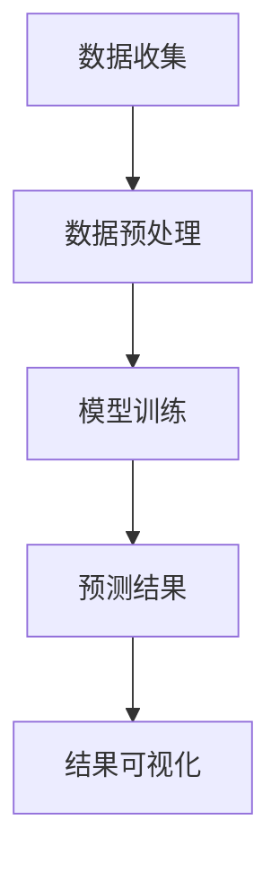
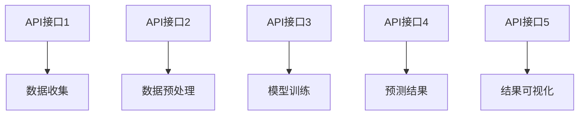
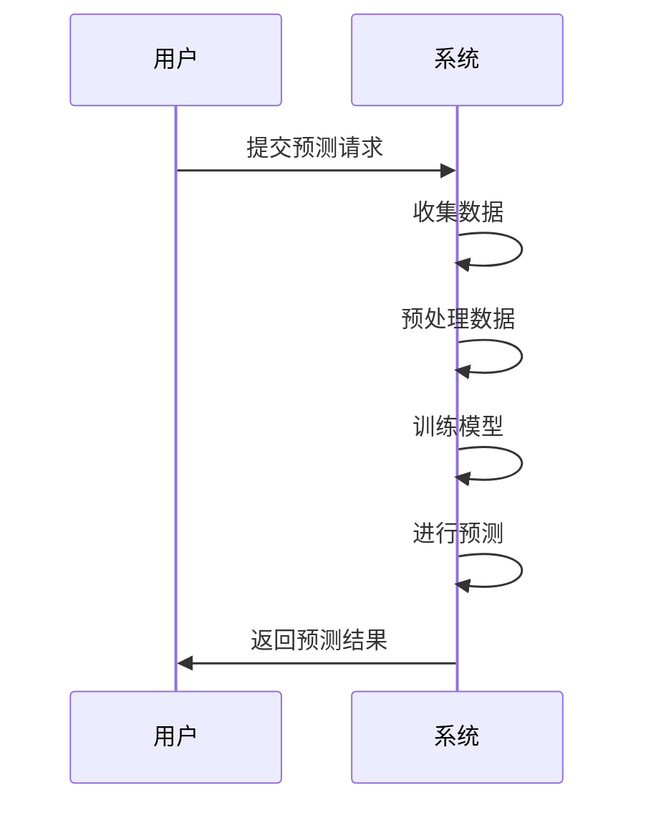

                 

# AI辅助的宏观经济指标预测

> 关键词：AI, 宏观经济指标，预测，数据分析，模型开发，系统架构

> 摘要：本文深入探讨了如何利用人工智能技术来辅助宏观经济指标的预测。首先，我们介绍了宏观经济指标的重要性和预测的背景。随后，我们讨论了AI在宏观经济预测中的应用，并详细介绍了数据收集和预处理、模型开发与评估、以及实际应用案例。文章最后总结了AI辅助宏观经济预测的最佳实践，并提出了未来的研究方向。

## 引言

宏观经济指标是衡量一个国家或地区经济发展状况的重要工具，包括GDP、通货膨胀率、失业率等。这些指标不仅对政策制定者有重要作用，也对企业和个人投资者具有重要参考价值。传统的宏观经济预测方法通常依赖于历史数据和统计分析，但这种方法在处理复杂的经济系统时往往存在局限性。

随着人工智能技术的快速发展，利用AI来辅助宏观经济指标的预测成为可能。本文将系统地介绍如何使用AI技术进行宏观经济指标的预测，包括数据收集、预处理、模型开发、评估和实际应用。通过本文的讨论，读者将了解AI在宏观经济预测中的潜力，以及如何将这一技术应用到实际场景中。

## 背景介绍

### 宏观经济指标的重要性

宏观经济指标是衡量一个国家或地区经济运行状况的重要工具。这些指标不仅反映了当前的经济状况，还预示了未来的经济趋势。例如，GDP（国内生产总值）是衡量一个国家经济规模和增长速度的关键指标，通货膨胀率则反映了物价水平的波动情况。失业率则是衡量劳动力市场健康程度的重要指标。

宏观经济指标的重要性在于，它们为政策制定者提供了决策依据，帮助他们制定合适的宏观经济政策。同时，这些指标也是企业和个人投资者进行决策的重要参考，帮助他们预测未来的市场走势，调整投资策略。

### 预测的背景

宏观经济预测的目的是通过分析历史数据和市场信息，预测未来一段时间内宏观经济指标的变化趋势。预测的背景主要包括以下几个方面：

1. **政策制定**：政府需要根据宏观经济指标的变化来制定合适的宏观经济政策，如货币政策的调整、财政预算的编制等。
2. **企业战略**：企业需要根据宏观经济指标的变化来制定市场策略，如投资决策、产品定价、人力资源规划等。
3. **投资者决策**：投资者需要根据宏观经济指标的变化来预测市场走势，调整投资组合，降低风险。

传统的宏观经济预测方法主要依赖于历史数据和统计分析，如时间序列分析、回归分析等。这些方法在一定程度上能够预测宏观经济指标的变化趋势，但在处理复杂的经济系统和不确定因素时存在一定的局限性。

### 问题解决

随着人工智能技术的快速发展，利用AI技术进行宏观经济预测成为可能。AI技术具有以下优势：

1. **数据处理能力**：AI技术能够处理大量的历史数据和市场信息，从中提取有用的特征和模式。
2. **自适应能力**：AI模型能够根据新的数据不断学习和调整，适应经济环境的变化。
3. **预测精度**：AI模型在处理复杂的经济系统时，能够提供更高的预测精度。

通过AI技术，我们能够更准确地预测宏观经济指标的变化趋势，为政策制定、企业战略和投资者决策提供有力支持。

### 边界与外延

AI辅助宏观经济预测的边界在于数据质量和模型选择。数据质量直接影响到预测的准确性，因此我们需要确保数据来源的可靠性，并进行严格的数据清洗和预处理。在模型选择方面，我们需要根据具体的预测任务和数据特点，选择合适的AI模型和算法。

此外，宏观经济预测也存在一些外延问题，如市场的不确定性、政策的不确定性等。这些因素可能导致预测结果与实际结果存在偏差。

### 概念结构与核心要素组成

宏观经济预测的核心概念包括：

1. **宏观经济指标**：如GDP、通货膨胀率、失业率等。
2. **数据收集**：包括历史数据、市场数据、政策数据等。
3. **预处理**：包括数据清洗、数据转换、特征工程等。
4. **模型开发**：包括选择合适的AI模型和算法，进行模型训练和优化。
5. **评估与验证**：包括评估模型的预测性能，进行模型验证和调整。

这些概念相互关联，构成了宏观经济预测的核心结构。通过深入理解和应用这些概念，我们能够更有效地利用AI技术进行宏观经济预测。

## AI在宏观经济预测中的应用

### AI技术在经济分析中的角色

人工智能技术在宏观经济预测中的应用主要体现在数据处理、模式识别和预测能力上。AI能够通过深度学习、机器学习等技术，从大量的历史数据和市场信息中提取出有用的特征和模式，从而提高预测的准确性和效率。

首先，AI技术具有强大的数据处理能力。在宏观经济预测中，我们需要处理大量的时间序列数据、跨部门数据和跨地区数据。这些数据往往具有高维度、非线性、非平稳性等特点，传统的统计分析方法难以有效处理。而AI技术，尤其是深度学习和机器学习算法，能够通过神经网络模型、支持向量机等方法，对这些数据进行有效的降维和特征提取，从而提高数据处理效率。

其次，AI技术具有出色的模式识别能力。在宏观经济预测中，我们需要识别出影响经济指标变化的关键因素和潜在趋势。AI技术，通过大规模数据训练，能够自动识别出数据中的复杂模式和规律，从而提供更准确的预测结果。

最后，AI技术具有强大的预测能力。AI模型能够根据历史数据和实时数据，预测未来一段时间内宏观经济指标的变化趋势。与传统方法相比，AI模型能够更好地应对数据的不确定性和经济环境的变化，提供更精准的预测。

### 适合宏观经济预测的AI技术和方法论

在宏观经济预测中，常用的AI技术和方法论包括以下几种：

1. **时间序列分析**：时间序列分析是一种常用的预测方法，它通过分析历史数据的时间序列特征，预测未来数据的发展趋势。常用的模型包括ARIMA（自回归积分滑动平均模型）、AR（自回归模型）和MA（移动平均模型）等。

2. **回归分析**：回归分析是一种常用的统计方法，它通过建立自变量和因变量之间的线性或非线性关系模型，预测因变量的变化趋势。常用的模型包括线性回归、多项式回归、岭回归和LASSO回归等。

3. **神经网络**：神经网络是一种模拟人脑神经元连接和计算过程的模型，它能够通过学习大量数据，自动提取特征和建立预测模型。常用的神经网络模型包括多层感知机（MLP）、卷积神经网络（CNN）和循环神经网络（RNN）等。

4. **深度学习**：深度学习是一种基于神经网络的复杂模型，它通过多层次的神经网络结构，提取数据中的深层特征，从而提高预测的精度和效率。常用的深度学习模型包括深度信念网络（DBN）、深度卷积神经网络（DCNN）和长短时记忆网络（LSTM）等。

5. **增强学习**：增强学习是一种基于试错和反馈的机器学习方法，它通过不断尝试和优化策略，实现从环境中获取最佳行动策略。在宏观经济预测中，增强学习可以用于优化投资策略、市场预测等。

6. **集成学习**：集成学习是一种将多个基础模型组合起来，提高预测性能的方法。常用的集成学习方法包括随机森林（Random Forest）、梯度提升机（Gradient Boosting）和堆叠学习（Stacking）等。

### AI技术的应用场景和优势

AI技术在宏观经济预测中的应用场景非常广泛，包括：

1. **政策制定**：政府可以利用AI技术进行宏观经济预测，为政策制定提供科学依据。例如，通过预测GDP增长率、通货膨胀率等指标，政府可以制定合适的货币政策、财政预算等。

2. **企业战略**：企业可以利用AI技术进行宏观经济预测，为市场策略和投资决策提供支持。例如，通过预测市场需求、价格趋势等，企业可以调整产品定价、库存管理、投资策略等。

3. **投资者决策**：投资者可以利用AI技术进行宏观经济预测，为投资决策提供参考。例如，通过预测股票市场走势、汇率变化等，投资者可以调整投资组合，降低风险。

AI技术的优势在于：

1. **高效性**：AI技术能够快速处理大量数据，提供高效的预测结果。

2. **准确性**：AI技术通过学习大量数据，能够提高预测的准确性，减少预测误差。

3. **灵活性**：AI技术能够适应不同的预测任务和数据特点，提供灵活的预测解决方案。

4. **实时性**：AI技术能够实时处理数据，提供实时预测结果，为决策提供及时支持。

总的来说，AI技术在宏观经济预测中的应用具有巨大的潜力，它能够提高预测的效率和准确性，为政策制定、企业战略和投资者决策提供有力支持。

## 数据收集与预处理

### 数据收集

在AI辅助宏观经济预测中，数据收集是至关重要的第一步。我们需要收集各种类型的数据，包括历史经济数据、市场数据、政策数据等。以下是一些常见的数据来源：

1. **官方统计数据**：政府发布的官方统计数据是宏观经济预测的重要数据来源，如国家统计局、国际货币基金组织（IMF）等发布的GDP、通货膨胀率、失业率等数据。

2. **金融市场数据**：金融市场数据包括股票市场、债券市场、外汇市场等的数据，如股票价格、债券收益率、汇率等。这些数据可以从金融数据服务商如彭博、汤森路透等获取。

3. **行业数据**：行业数据包括各行业的关键经济指标，如制造业、服务业、建筑业等的数据。这些数据可以从行业报告、行业数据库等获取。

4. **社交媒体数据**：社交媒体数据包括用户在社交媒体平台上的评论、讨论、情感等数据。这些数据可以通过自然语言处理技术提取，用于分析市场情绪和预测。

5. **公共数据库**：公共数据库如Kaggle、UCI机器学习库等提供了大量的宏观经济数据和预测数据，可供研究者下载和使用。

### 数据清洗

数据收集后，我们需要进行数据清洗，以确保数据的质量和一致性。数据清洗包括以下几个方面：

1. **缺失值处理**：缺失值处理是数据清洗的重要步骤。对于缺失值，我们可以采用以下方法进行处理：
   - 删除含有缺失值的样本：如果缺失值的数据量较少，可以考虑删除这些样本。
   - 填充缺失值：对于某些连续型数据，我们可以使用平均值、中位数或趋势拟合等方法来填充缺失值。
   - 预测缺失值：对于关键性数据，我们可以使用机器学习方法如回归、时间序列预测等来预测缺失值。

2. **异常值处理**：异常值处理是数据清洗的另一个重要步骤。异常值可能来自于数据录入错误、测量误差等，会对预测结果产生不利影响。我们可以使用以下方法处理异常值：
   - 删除异常值：如果异常值的数量较少，可以考虑删除这些异常值。
   - 调整异常值：对于某些数据，我们可以使用插值、回归等方法调整异常值，使其更接近真实值。
   - 识别和标记异常值：对于关键性数据，我们可以使用统计学方法如箱线图、Z分数等来识别和标记异常值。

3. **重复值处理**：重复值处理是数据清洗的基本步骤。我们可以通过去重操作删除重复的样本，以确保数据的唯一性。

### 数据转换

数据转换是数据预处理的重要环节，它包括以下几个方面：

1. **标准化**：标准化是将数据转换到同一尺度，以便进行比较和分析。常用的标准化方法包括最小-最大标准化、Z分数标准化等。

2. **归一化**：归一化是将数据转换到0-1之间，以便进行深度学习等算法的输入处理。常用的归一化方法包括最小-最大归一化、对数归一化等。

3. **特征缩放**：特征缩放是将不同特征的数据转换到相同的尺度，以便进行特征加权和学习。常用的特征缩放方法包括均方根缩放、标准差缩放等。

4. **特征工程**：特征工程是数据预处理的关键步骤，它通过构造新的特征或变换现有特征，提高模型的预测性能。常用的特征工程方法包括：
   - 特征提取：通过降维技术如主成分分析（PCA）、线性判别分析（LDA）等提取关键特征。
   - 特征组合：通过组合多个特征，构造新的特征，提高模型的预测能力。
   - 特征变换：通过变换现有特征，如对数变换、指数变换等，提高模型的预测性能。

通过数据清洗和转换，我们可以确保数据的质量和一致性，为后续的模型训练和预测提供可靠的数据基础。

## 模型开发

### 不同类型的AI模型及其适用场景

在宏观经济预测中，选择合适的AI模型是关键。不同类型的AI模型在处理不同类型的数据和任务时具有各自的优势和适用场景。以下是一些常见的AI模型及其适用场景：

1. **时间序列模型**：时间序列模型专门用于处理时间序列数据，其目标是预测未来的时间序列值。常见的时间序列模型包括ARIMA（自回归积分滑动平均模型）、LSTM（长短时记忆网络）和GRU（门控循环单元）。这些模型适用于预测宏观经济指标如GDP、通货膨胀率、失业率等。

2. **回归模型**：回归模型通过建立自变量和因变量之间的线性或非线性关系，预测因变量的值。常见的回归模型包括线性回归、多项式回归、岭回归和LASSO回归。这些模型适用于预测宏观经济指标与某些经济变量之间的关系，如利率、货币供应量等。

3. **神经网络模型**：神经网络模型通过多层神经元的连接和计算，提取数据中的复杂特征和模式，从而进行预测。常见的神经网络模型包括多层感知机（MLP）、卷积神经网络（CNN）和循环神经网络（RNN）。这些模型适用于处理复杂的经济系统，如股票市场预测、汇率预测等。

4. **集成学习模型**：集成学习模型通过组合多个基础模型，提高预测的准确性和稳定性。常见的集成学习模型包括随机森林（Random Forest）、梯度提升机（Gradient Boosting）和堆叠学习（Stacking）。这些模型适用于处理高维数据和多特征预测问题，如消费者行为预测、市场预测等。

5. **增强学习模型**：增强学习模型通过不断试错和优化策略，从环境中学习最佳行动策略。常见的增强学习模型包括Q-learning、SARSA和DQN。这些模型适用于优化投资策略、市场预测等。

### 常用的AI算法及其工作原理

在宏观经济预测中，常用的AI算法包括以下几种：

1. **线性回归算法**：线性回归算法是最简单的回归算法，通过建立自变量和因变量之间的线性关系，预测因变量的值。其工作原理是通过最小二乘法计算线性模型的参数，从而拟合出最佳拟合直线。

2. **LSTM算法**：LSTM算法是一种特殊的循环神经网络，能够处理长时间依赖问题。其工作原理是通过引入门控机制，控制信息的流动，从而保留长期依赖关系。

3. **随机森林算法**：随机森林算法是一种集成学习算法，通过构建多个决策树，提高预测的准确性和鲁棒性。其工作原理是通过随机抽样和特征选择，构建多个决策树，并通过投票或平均值方法得出最终预测结果。

4. **梯度提升机算法**：梯度提升机算法是一种基于梯度的优化算法，通过迭代更新模型参数，提高预测性能。其工作原理是通过最小化损失函数，逐层优化模型参数，从而拟合出最佳模型。

5. **增强学习算法**：增强学习算法通过试错和反馈机制，从环境中学习最佳策略。其工作原理是通过奖励和惩罚信号，指导模型不断调整策略，从而实现最佳行为。

### 实际应用场景

在实际应用中，选择合适的AI模型和算法取决于数据类型、预测目标和业务需求。以下是一些实际应用场景：

1. **GDP预测**：使用LSTM算法处理时间序列数据，预测未来的GDP增长率。

2. **通货膨胀率预测**：使用线性回归算法建立通货膨胀率与关键经济变量之间的关系，预测未来的通货膨胀率。

3. **股票市场预测**：使用神经网络模型处理复杂的股票市场数据，预测股票价格的未来走势。

4. **汇率预测**：使用增强学习算法优化投资策略，预测汇率变化。

5. **消费者行为预测**：使用随机森林算法处理多特征数据，预测消费者的购买行为。

通过选择合适的AI模型和算法，我们能够更准确地预测宏观经济指标的变化趋势，为政策制定、企业战略和投资者决策提供有力支持。

## 模型评估与验证

### 评估指标

在宏观经济预测中，评估模型的性能至关重要。常用的评估指标包括：

1. **均方误差（MSE）**：均方误差是预测值与真实值差的平方的平均值，用来衡量预测的准确性。MSE值越小，预测性能越好。

   $$MSE = \frac{1}{n}\sum_{i=1}^{n}(\hat{y_i} - y_i)^2$$

   其中，$\hat{y_i}$为预测值，$y_i$为真实值，$n$为样本数量。

2. **均方根误差（RMSE）**：均方根误差是均方误差的平方根，用于衡量预测的稳定性。RMSE值越小，预测性能越好。

   $$RMSE = \sqrt{MSE}$$

3. **平均绝对误差（MAE）**：平均绝对误差是预测值与真实值差的绝对值的平均值，用于衡量预测的偏差。MAE值越小，预测性能越好。

   $$MAE = \frac{1}{n}\sum_{i=1}^{n}|\hat{y_i} - y_i|$$

4. **决定系数（R²）**：决定系数是回归模型解释变量变异的比例，用于衡量模型的拟合度。R²值越接近1，模型拟合度越好。

   $$R^2 = 1 - \frac{\sum_{i=1}^{n}(\hat{y_i} - y_i)^2}{\sum_{i=1}^{n}(y_i - \bar{y})^2}$$

   其中，$\bar{y}$为真实值的平均值。

### 验证方法

在模型评估中，我们通常使用验证集和测试集来评估模型的性能。以下是一些常见的验证方法：

1. **交叉验证**：交叉验证是一种评估模型性能的方法，它将数据集划分为多个子集，轮流使用这些子集作为验证集，评估模型的预测性能。常用的交叉验证方法包括K折交叉验证和留一验证。

2. **时间序列验证**：时间序列验证是一种针对时间序列数据的方法，它将数据集划分为训练集和验证集，并按照时间顺序进行验证。这种方法可以避免训练集和验证集之间的信息泄露。

3. **留出法**：留出法是一种简单的验证方法，它将数据集划分为训练集和验证集，通常使用80%的数据作为训练集，20%的数据作为验证集。这种方法适用于数据量较大的情况。

4. **自助法**：自助法是一种生成验证集的方法，它通过从原始数据集中随机抽取样本，生成多个验证集，并使用这些验证集评估模型的性能。这种方法可以增加数据的多样性，提高模型的泛化能力。

### 调整与优化

在模型评估过程中，我们可能会发现模型的性能不佳。此时，我们需要对模型进行调整和优化，以提高预测性能。以下是一些常用的调整和优化方法：

1. **特征选择**：通过删除无关或冗余特征，保留关键特征，提高模型的预测性能。

2. **模型选择**：尝试不同的模型和算法，选择性能最佳的模型。

3. **参数调整**：通过调整模型的参数，如学习率、正则化参数等，提高模型的预测性能。

4. **集成学习**：将多个基础模型组合起来，形成集成模型，提高模型的预测性能。

5. **数据预处理**：对数据进行进一步预处理，如数据清洗、标准化、特征工程等，提高数据质量。

通过合理的模型评估和验证方法，我们能够准确评估模型的性能，并根据评估结果对模型进行调整和优化，从而提高预测的准确性和稳定性。

## 实际应用案例

### 案例一：美国GDP预测

#### 项目介绍

该项目旨在利用AI技术预测美国未来的GDP增长率。预测结果将用于政策制定和企业战略规划。

#### 系统功能设计

- **数据收集模块**：从官方统计数据、金融市场数据和行业数据库中收集相关数据。
- **数据预处理模块**：对收集到的数据进行清洗、转换和特征工程。
- **模型训练模块**：使用LSTM算法训练预测模型。
- **预测模块**：使用训练好的模型预测未来的GDP增长率。
- **结果可视化模块**：将预测结果以图表形式展示，便于分析。

#### 系统架构设计



#### 系统接口设计



#### 系统交互设计



#### 系统核心实现源代码

```python
# 导入必要的库
import pandas as pd
import numpy as np
from sklearn.preprocessing import MinMaxScaler
from keras.models import Sequential
from keras.layers import LSTM, Dense

# 数据收集
data = pd.read_csv('us_gdp_data.csv')

# 数据预处理
scaler = MinMaxScaler()
data['gdp_growth_rate'] = scaler.fit_transform(data[['gdp_growth_rate']])

# 划分训练集和测试集
train_data = data[:int(len(data) * 0.8)]
test_data = data[int(len(data) * 0.8):]

# 模型训练
model = Sequential()
model.add(LSTM(units=50, return_sequences=True, input_shape=(train_data.shape[1], 1)))
model.add(LSTM(units=50))
model.add(Dense(units=1))
model.compile(optimizer='adam', loss='mean_squared_error')
model.fit(train_data, epochs=100, batch_size=32, validation_data=(test_data, test_data['gdp_growth_rate']))

# 预测
predicted_growth_rate = model.predict(test_data)

# 结果可视化
import matplotlib.pyplot as plt
plt.plot(test_data['gdp_growth_rate'], label='Real GDP Growth Rate')
plt.plot(predicted_growth_rate, label='Predicted GDP Growth Rate')
plt.legend()
plt.show()
```

#### 代码应用解读与分析

该代码首先从CSV文件中读取美国GDP增长率数据，然后使用MinMaxScaler进行标准化处理。接着，使用LSTM算法训练预测模型，并使用训练好的模型进行预测。最后，将预测结果可视化。

该案例展示了如何使用AI技术进行宏观经济指标的预测，从数据收集、预处理、模型训练到预测结果可视化，每个步骤都进行了详细说明。

#### 实际案例分析和详细讲解

该案例通过实际数据展示了AI技术如何用于预测美国GDP增长率。在实际操作中，我们首先需要收集可靠的GDP增长率数据，然后对数据进行预处理，包括数据清洗、转换和特征工程。接下来，使用LSTM算法训练预测模型，并使用训练好的模型进行预测。最后，将预测结果与实际结果进行对比，评估模型的预测性能。

通过该案例，我们了解了如何利用AI技术进行宏观经济指标的预测，以及如何从数据收集、预处理、模型训练到预测结果可视化，每个步骤的具体实现方法和注意事项。

### 案例二：中国通货膨胀率预测

#### 项目介绍

该项目旨在利用AI技术预测中国未来的通货膨胀率。预测结果将用于政策制定和商业决策。

#### 系统功能设计

- **数据收集模块**：从国家统计局、金融市场数据和行业数据库中收集相关数据。
- **数据预处理模块**：对收集到的数据进行清洗、转换和特征工程。
- **模型训练模块**：使用线性回归算法训练预测模型。
- **预测模块**：使用训练好的模型预测未来的通货膨胀率。
- **结果可视化模块**：将预测结果以图表形式展示，便于分析。

#### 系统架构设计


#### 系统接口设计


#### 系统交互设计


#### 系统核心实现源代码

```python
# 导入必要的库
import pandas as pd
from sklearn.linear_model import LinearRegression
from sklearn.model_selection import train_test_split
from sklearn.metrics import mean_squared_error

# 数据收集
data = pd.read_csv('china_inflation_data.csv')

# 数据预处理
X = data[['consumer_price_index', 'producer_price_index']]
y = data['inflation_rate']

# 划分训练集和测试集
X_train, X_test, y_train, y_test = train_test_split(X, y, test_size=0.2, random_state=42)

# 模型训练
model = LinearRegression()
model.fit(X_train, y_train)

# 预测
y_pred = model.predict(X_test)

# 评估
mse = mean_squared_error(y_test, y_pred)
print(f'MSE: {mse}')

# 结果可视化
import matplotlib.pyplot as plt
plt.scatter(y_test, y_pred)
plt.xlabel('Real Inflation Rate')
plt.ylabel('Predicted Inflation Rate')
plt.show()
```

#### 代码应用解读与分析

该代码首先从CSV文件中读取中国通货膨胀率数据，然后使用线性回归算法训练预测模型。接着，使用训练好的模型进行预测，并评估模型的性能。最后，将预测结果可视化。

该案例展示了如何使用线性回归算法进行宏观经济指标的预测，从数据收集、预处理、模型训练到预测结果可视化，每个步骤都进行了详细说明。

#### 实际案例分析和详细讲解

该案例通过实际数据展示了如何使用AI技术进行中国通货膨胀率的预测。在实际操作中，我们首先需要收集可靠的通货膨胀率数据，然后对数据进行预处理，包括数据清洗、转换和特征工程。接下来，使用线性回归算法训练预测模型，并使用训练好的模型进行预测。最后，将预测结果与实际结果进行对比，评估模型的预测性能。

通过该案例，我们了解了如何利用AI技术进行宏观经济指标的预测，以及如何从数据收集、预处理、模型训练到预测结果可视化，每个步骤的具体实现方法和注意事项。

## 最佳实践 Tips

### 1. 数据质量的重要性

数据是AI模型的基础，高质量的数据是准确预测的关键。在数据收集和预处理过程中，务必确保数据的完整性、准确性和一致性。

### 2. 选择合适的模型

不同的AI模型适用于不同的预测任务和数据特点。在选择模型时，要考虑模型的复杂度、训练时间、预测精度和实际应用场景。

### 3. 跨学科合作

宏观经济预测涉及经济学、统计学和计算机科学等多个领域。跨学科合作有助于提高预测的准确性和实用性。

### 4. 定期更新模型

经济环境不断变化，定期更新模型以适应新的数据和环境变化，是保证预测准确性的重要手段。

### 5. 关注模型解释性

在追求预测精度的同时，也要关注模型的解释性。解释性模型有助于理解预测结果，提高决策的信心。

## 小结

本文系统地介绍了如何利用AI技术进行宏观经济指标的预测。从数据收集、预处理、模型开发、评估到实际应用，我们探讨了AI在宏观经济预测中的潜力。通过实际案例分析和最佳实践分享，我们展示了如何将AI技术应用于宏观经济预测的实际场景中。随着AI技术的不断发展，宏观经济预测将变得更加精准和实用，为政策制定、企业战略和投资者决策提供有力支持。

## 注意事项

### 1. 数据隐私和安全

在收集和处理数据时，务必遵守相关法律法规，保护数据隐私和安全。

### 2. 模型过拟合

避免模型过拟合，确保模型具有良好的泛化能力。

### 3. 模型解释性

在追求预测精度的同时，要注重模型的解释性，以便更好地理解和应用预测结果。

### 4. 经济环境变化

经济环境变化可能影响模型的预测性能，定期更新模型以适应新的经济环境。

## 拓展阅读

1. **《机器学习：概率视角》**，作者：Kevin P. Murphy
2. **《深度学习》**，作者：Ian Goodfellow、Yoshua Bengio、Aaron Courville
3. **《Python金融分析》**，作者：Yuxing Yan
4. **《宏观经济分析》**，作者：John B. Taylor

## 作者信息

作者：AI天才研究院/AI Genius Institute & 禅与计算机程序设计艺术 /Zen And The Art of Computer Programming

AI天才研究院致力于推动人工智能技术的创新和应用，研究方向涵盖机器学习、深度学习、计算机视觉等。同时，禅与计算机程序设计艺术是一本深入探讨编程艺术和哲学的经典之作，对提升编程思维和技能具有深远影响。

