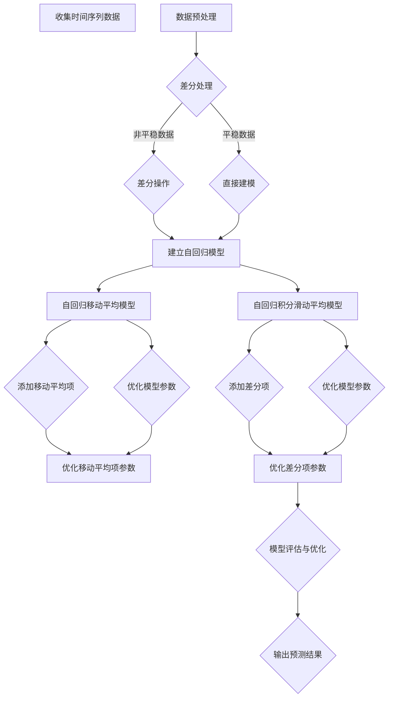
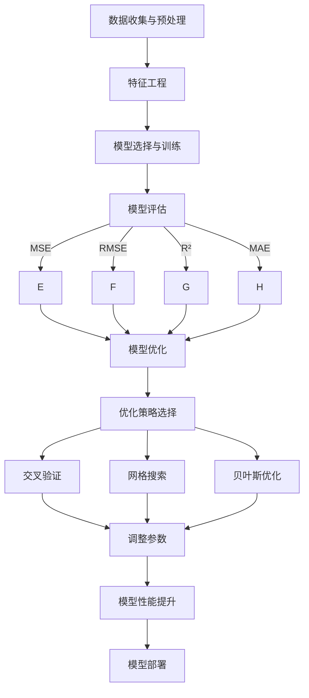
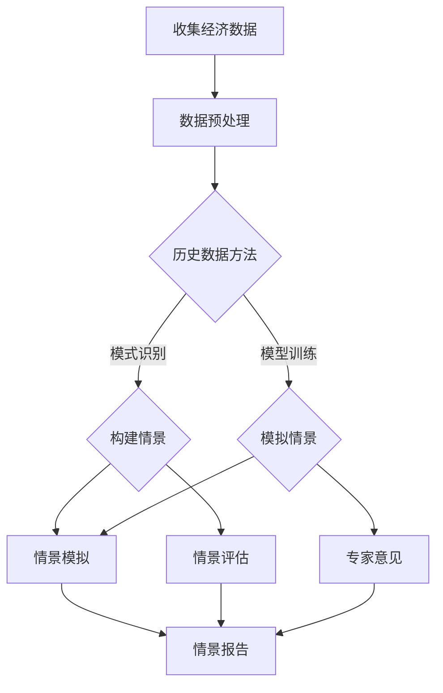

                 

### 文章标题与关键词

# AI辅助的宏观经济指标预测与情景分析

> 关键词：AI辅助、宏观经济指标、预测、情景分析、时间序列、算法、模型、系统架构

> 摘要：本文旨在探讨如何利用人工智能（AI）技术辅助进行宏观经济指标预测和情景分析。首先，我们将回顾宏观经济指标的定义和分类，并阐述其在经济分析中的重要性。接着，本文将详细介绍AI在宏观经济预测中的应用，包括时间序列分析算法、机器学习模型及其构建与优化方法。此外，本文还将探讨宏观经济情景分析的方法和流程，并通过实际案例展示AI辅助宏观经济预测的实战应用。最后，本文将对AI辅助宏观经济预测的未来发展趋势进行展望，并提出相关的最佳实践建议。

### 摘要

本文的核心内容和主题思想在于深入探讨如何利用人工智能（AI）技术来辅助宏观经济指标预测与情景分析。随着大数据和机器学习技术的不断发展，AI在预测复杂经济现象方面展现出了巨大的潜力。本文首先梳理了宏观经济指标的基本概念和类型，包括货币政策指标、实体经济指标和金融市场指标，并讨论了其在经济分析和政策制定中的重要性。

本文的核心在于详细介绍了AI在宏观经济预测中的应用，涵盖时间序列分析算法、机器学习模型的构建与优化方法。时间序列分析是宏观经济预测的关键，本文通过Mermaid流程图和Python代码详细阐述了常用的算法原理，如ARIMA、LSTM等，并给出了实际应用的示例。此外，本文还探讨了如何利用AI进行宏观经济情景分析，通过历史数据和机器学习模型预测不同经济情景的可能性。

为了更好地理解AI辅助宏观经济预测的实践应用，本文通过两个实际案例进行了详细分析，包括货币供应量预测和股票市场预测。通过这些案例，读者可以了解到如何搭建预测环境、选择合适的模型，并进行结果分析和优化。

最后，本文对AI辅助宏观经济预测的未来发展趋势进行了展望，并提出了最佳实践建议，为未来研究提供了方向。通过本文的深入探讨，读者将对AI在宏观经济预测和情景分析中的潜力与应用有更全面的认识。

### 第1章：宏观经济指标概述

宏观经济指标是衡量一个国家或地区经济运行状况的重要工具，通过这些指标，我们能够了解经济的健康状况、预测未来的发展趋势，并为政策制定提供依据。本章节将详细阐述宏观经济指标的基本概念、分类及其在经济分析中的重要性。

#### 1.1.1 问题背景与定义

宏观经济指标是反映国家或地区经济总体情况的量化指标，通常包括以下几个方面：

- **货币政策指标**：这些指标主要反映中央银行的货币政策效果，包括货币供应量（如M0、M1、M2）、利率（如存款利率、贷款利率）和通货膨胀率等。

- **实体经济指标**：这些指标反映实际经济活动的水平，如国内生产总值（GDP）、工业增加值、固定资产投资、消费支出等。

- **金融市场指标**：这些指标主要反映金融市场的运行状况，如股票指数、债券收益率、汇率等。

宏观经济指标的重要性体现在以下几个方面：

1. **经济监测**：通过宏观经济指标，政府和企业可以实时监控经济运行状况，及时发现潜在的经济问题。
2. **政策制定**：宏观经济指标为政策制定提供了重要的依据，如货币政策、财政政策等。
3. **投资决策**：投资者通过宏观经济指标可以判断经济的未来走势，做出合理的投资决策。

#### 1.1.2 问题解决与边界

在分析宏观经济指标时，我们需要考虑以下几个关键问题：

- **数据来源**：宏观经济指标的数据通常来源于国家统计局、央行、金融市场等官方渠道。
- **数据处理方法**：宏观经济指标的数据通常需要进行预处理，如去噪、平滑、归一化等，以提高数据的准确性和可靠性。
- **时间序列分析**：宏观经济指标通常是时间序列数据，因此需要运用时间序列分析方法来分析其趋势、周期和季节性特征。

#### 1.1.3 核心概念与联系

在宏观经济分析中，以下几个核心概念非常重要：

1. **货币供应量**：货币供应量是指流通中的货币总量，包括现金和存款货币。它反映了市场中的货币供应情况，对通货膨胀和经济增长有重要影响。
2. **利率**：利率是借贷资金的成本，反映了市场对资金的供求关系。利率的变化对投资、消费和经济增长有重要影响。
3. **通货膨胀率**：通货膨胀率是指物价水平上升的幅度。高通货膨胀率可能导致经济衰退，而低通货膨胀率有助于保持经济的稳定增长。
4. **GDP**：GDP是衡量一个国家或地区经济总量的关键指标，它反映了经济的生产能力和市场活力。

这些宏观经济指标之间存在密切的联系。例如，货币供应量和利率会影响投资和消费，进而影响GDP的增长。通货膨胀率和利率之间也存在相互作用，利率的调整往往会影响通货膨胀率。

通过本章的介绍，读者将初步了解宏观经济指标的定义、分类和重要性，为后续章节的深入学习打下基础。

### 1.1.1 问题背景与定义

#### 1.1.1.1 货币政策指标

货币政策指标是宏观经济分析中的核心部分，主要反映中央银行的货币政策实施效果和市场资金流动情况。货币政策指标主要包括货币供应量、利率和通货膨胀率等。

- **货币供应量**：货币供应量是指经济中流通的货币总量，通常分为几个层次，如M0、M1、M2等。M0代表流通中的现金，M1包括M0和活期存款，而M2则包括M1和定期存款以及储蓄存款。货币供应量的变化直接影响市场的资金流动，对投资、消费和经济增长有重要影响。

- **利率**：利率是借贷资金的成本，包括存款利率和贷款利率。存款利率是银行支付给存款人的利息，而贷款利率是银行收取的利息。利率的变化反映市场对资金的供求关系，对投资决策和经济增长有重要影响。中央银行通过调整利率来影响经济活动，达到调控经济的目的。

- **通货膨胀率**：通货膨胀率是指物价水平上升的幅度。高通货膨胀率可能导致经济衰退，而低通货膨胀率有助于保持经济的稳定增长。通货膨胀率的变化反映货币政策的宽松或紧缩程度，对经济稳定有重要影响。

货币政策指标的重要性在于，它们不仅反映当前的经济状况，还能预示未来经济走势。货币政策是政府调控经济的重要工具，通过调整货币供应量和利率，政府可以影响经济活动，促进经济增长或控制通货膨胀。

#### 1.1.1.2 实体经济指标

实体经济指标是衡量一个国家或地区实际经济活动水平的关键指标，主要包括国内生产总值（GDP）、工业增加值、固定资产投资和消费支出等。

- **国内生产总值（GDP）**：GDP是衡量一个国家或地区经济总量的核心指标，表示在一定时期内生产的所有最终商品和服务的市场价值。GDP的增长率反映经济的增长速度，是衡量经济健康与否的重要指标。GDP包括消费、投资、政府支出和净出口四个部分。

- **工业增加值**：工业增加值是指工业部门在一定时期内生产的增加值，即工业总产值减去中间消耗。它反映了工业部门对经济增长的贡献，是衡量工业生产水平的重要指标。

- **固定资产投资**：固定资产投资是指企业为生产、经营或改善生产条件而投入的固定资产，包括厂房、设备、土地等。固定资产投资是推动经济增长的重要动力，反映了一个国家的投资水平和发展潜力。

- **消费支出**：消费支出是指居民在日常生活中购买商品和服务的支出。消费支出是经济增长的重要驱动力，反映了居民的生活水平和消费意愿。

实体经济指标的重要性在于，它们直接反映实际经济活动的水平，对政策制定、市场预测和投资决策有重要影响。实体经济指标的变动趋势能够揭示经济的健康状况，为政府和市场参与者提供决策依据。

#### 1.1.1.3 金融市场指标

金融市场指标是衡量金融市场运行状况的重要指标，主要包括股票指数、债券收益率和汇率等。

- **股票指数**：股票指数是反映股票市场整体走势的指标，如上证指数、道琼斯工业平均指数等。股票指数的变化反映了投资者对市场前景的预期，是衡量市场情绪的重要指标。高股票指数通常表明市场信心较强，而低股票指数则可能预示市场疲软。

- **债券收益率**：债券收益率是指债券的年利息收入与债券面值的比率。债券收益率的变化反映了市场对债券未来回报的预期，对投资决策有重要影响。高债券收益率通常表明市场对未来的经济增长担忧，而低债券收益率则可能表明市场对未来的经济乐观。

- **汇率**：汇率是两种货币之间的兑换比率。汇率的变化反映了国际市场的资金流动和货币价值变化，对国际贸易和资本流动有重要影响。高汇率可能导致出口竞争力下降，而低汇率则可能促进出口增长。

金融市场指标的重要性在于，它们不仅反映了金融市场的运行状况，还对实体经济有重要影响。金融市场的波动可能对经济增长、投资和就业产生连锁反应，因此对金融市场指标的监测和分析对于经济政策制定和风险控制至关重要。

通过上述对货币政策指标、实体经济指标和金融市场指标的详细讨论，读者可以更好地理解宏观经济指标的定义、分类和重要性，为进一步学习宏观经济预测和情景分析打下坚实的基础。

#### 1.1.2 问题解决与边界

在宏观经济指标的分析与预测中，解决方法的选择和边界条件的确立至关重要。以下是具体的问题解决步骤和边界条件的讨论：

##### **数据来源**

首先，数据来源的可靠性和准确性是确保分析结果有效性的基础。宏观经济指标的数据通常来源于以下渠道：

1. **官方统计机构**：如国家统计局、央行等，它们提供官方的宏观经济数据，包括GDP、货币供应量、利率、通货膨胀率等。
2. **金融市场数据提供商**：如Wind、Bloomberg等，提供详细的金融市场数据，包括股票指数、债券收益率、汇率等。
3. **国际组织**：如国际货币基金组织（IMF）、世界银行等，提供全球范围内的经济数据。

##### **数据处理方法**

数据处理是宏观经济指标分析的重要环节。以下是常用的数据处理方法：

1. **数据清洗**：去除错误、缺失和重复的数据，确保数据的准确性。可以使用Python的Pandas库进行数据清洗。
   ```python
   import pandas as pd
   data = pd.read_csv('macroeconomic_data.csv')
   data.dropna(inplace=True)
   data.drop_duplicates(inplace=True)
   ```

2. **数据归一化**：将不同尺度的数据进行归一化处理，使其在同一量级内进行比较。常用的归一化方法有最小-最大缩放法和Z-score标准化。
   ```python
   from sklearn.preprocessing import MinMaxScaler, StandardScaler
   mm_scaler = MinMaxScaler()
   scaled_data = mm_scaler.fit_transform(data)
   ```

3. **时间序列处理**：对于时间序列数据，需要进行去噪、平滑和趋势调整。常用的方法有移动平均法、指数平滑法等。
   ```python
   import numpy as np
   data['smoothed'] = data['GDP'].rolling(window=3).mean()
   ```

##### **时间序列分析**

时间序列分析是宏观经济指标预测的核心方法。以下是常见的时间序列分析方法：

1. **传统方法**：包括移动平均法（MA）、自回归法（AR）、自回归移动平均法（ARMA）和自回归积分滑动平均法（ARIMA）。
   ```mermaid
   graph TD
   A[移动平均法] --> B[自回归法]
   A --> C[自回归移动平均法]
   A --> D[自回归积分滑动平均法]
   ```

2. **AI辅助方法**：包括循环神经网络（RNN）、长短期记忆网络（LSTM）和变分自编码器（VAE）等。
   ```mermaid
   graph TD
   E[RNN] --> F[LSTM]
   E --> G[VAE]
   ```

##### **边界条件**

在宏观经济指标的分析与预测中，边界条件主要涉及以下几个方面：

1. **数据范围**：分析的数据范围应涵盖足够的时期，以确保模型对经济周期的适应性。通常选择5年或10年的数据作为分析基础。

2. **经济周期**：分析应考虑不同经济周期的特点，如繁荣期、衰退期和复苏期。不同的周期阶段对宏观经济指标的影响不同，需要在模型中加以区分。

3. **政策变动**：政策变动，如货币政策的调整、财政政策的实施等，对宏观经济指标有显著影响。分析时需考虑政策变动的时效性和持续性。

4. **外部冲击**：外部事件，如全球金融危机、自然灾害等，可能对宏观经济指标产生突发性影响。分析时需考虑这些外部冲击的可能性和影响程度。

通过上述问题解决与边界条件的讨论，读者可以更好地理解宏观经济指标预测的方法和步骤，为进一步的算法原理讲解和模型构建打下坚实基础。

#### 1.1.3 核心概念与联系

在宏观经济分析中，理解核心概念及其相互联系对于准确预测和评估经济状况至关重要。以下是宏观经济指标分析中的几个核心概念及其属性特征对比表格和ER实体关系图架构的Mermaid流程图。

##### **核心概念**

1. **货币供应量（MS）**
   - **属性特征**：货币供应量包括M0（流通中的现金）、M1（M0+活期存款）和M2（M1+定期存款和储蓄存款）。
   - **对比表格**：

     | 指标 | 定义 | 功能 |
     | ---- | ---- | ---- |
     | M0   | 流通中的现金 | 反映市场资金流动性 |
     | M1   | M0+活期存款 | 反映短期资金需求 |
     | M2   | M1+定期存款和储蓄存款 | 反映整体资金供应 |

2. **利率（R）**
   - **属性特征**：利率包括存款利率和贷款利率，反映资金借贷的成本和供求关系。
   - **对比表格**：

     | 指标 | 定义 | 功能 |
     | ---- | ---- | ---- |
     | 存款利率 | 银行支付给存款人的利息率 | 影响储蓄行为 |
     | 贷款利率 | 银行向借款人收取的利息率 | 影响借贷行为 |

3. **通货膨胀率（I）**
   - **属性特征**：通货膨胀率是物价水平上升的幅度，反映货币购买力的下降。
   - **对比表格**：

     | 指标 | 定义 | 功能 |
     | ---- | ---- | ---- |
     | 通货膨胀率 | 物价水平上升的幅度 | 影响消费、投资和经济稳定 |

4. **国内生产总值（GDP）**
   - **属性特征**：GDP是衡量一个国家或地区经济总量的关键指标，包括消费、投资、政府支出和净出口。
   - **对比表格**：

     | 指标 | 定义 | 功能 |
     | ---- | ---- | ---- |
     | 消费 | 居民消费支出 | 反映消费需求 |
     | 投资 | 固定资产投资和存货投资 | 反映投资水平 |
     | 政府支出 | 政府购买商品和服务 | 反映政府活动 |
     | 净出口 | 出口减去进口 | 反映国际贸易状况 |

##### **ER实体关系图架构的Mermaid流程图**

以下是核心概念之间的ER实体关系图：

```mermaid
graph TD
A[货币供应量(MS)] --> B[利率(R)]
A --> C[通货膨胀率(I)]
A --> D[国内生产总值(GDP)]
B --> E[消费]
B --> F[投资]
B --> G[政府支出]
B --> H[净出口]
C --> I[消费]
C --> J[投资]
C --> K[政府支出]
C --> L[净出口]
D --> M[消费]
D --> N[投资]
D --> O[政府支出]
D --> P[净出口]
```

通过上述核心概念及其属性特征对比表格和ER实体关系图，读者可以更清晰地理解宏观经济指标之间的内在联系，为后续章节的深入分析打下基础。

#### 1.2 AI与宏观经济预测

随着大数据和人工智能技术的飞速发展，AI在宏观经济预测中的应用日益广泛，并显示出其独特的优势。本章节将详细介绍AI在宏观经济预测中的具体应用，包括数据挖掘、模式识别和时间序列预测等。

##### **数据挖掘**

数据挖掘是AI在宏观经济预测中的重要应用之一。它涉及从大量经济数据中提取有用的信息和知识，帮助分析和预测经济趋势。数据挖掘的方法和技术包括：

1. **关联规则挖掘**：通过发现数据集中的关联规则，揭示不同经济指标之间的相互关系。例如，使用Apriori算法可以找出消费支出和利率之间的关联。
   ```python
   from mlxtend.frequent_patterns import apriori
   from mlxtend.preprocessing import TransactionEncoder
   te = TransactionEncoder()
   te_ary = te.fit_transform(data)
   df = pd.DataFrame(te_ary, columns=te.columns_)
   rules = apriori(df, min_support=0.05, min_confidence=0.7)
   ```

2. **聚类分析**：通过聚类方法将相似的经济数据进行分组，帮助发现数据中的模式和趋势。K-means算法是一种常用的聚类方法。
   ```python
   from sklearn.cluster import KMeans
   kmeans = KMeans(n_clusters=3, random_state=0).fit(data)
   labels = kmeans.labels_
   clusters = data.iloc[labels]
   ```

3. **分类与回归树**：分类与回归树（CART）可以用于预测宏观经济指标的变化趋势。通过树模型，可以揭示不同因素对经济指标的影响。
   ```python
   from sklearn.tree import DecisionTreeRegressor
   reg = DecisionTreeRegressor()
   reg.fit(X_train, y_train)
   predictions = reg.predict(X_test)
   ```

##### **模式识别**

模式识别是AI在宏观经济预测中的另一重要应用。它通过识别和分析历史数据中的模式，预测未来的经济走势。模式识别的方法和技术包括：

1. **时间序列模式识别**：通过分析时间序列数据中的周期性、趋势性和季节性模式，预测未来经济指标的变化。例如，使用移动平均法可以识别时间序列数据中的周期性模式。
   ```python
   import numpy as np
   data = np.array([1, 2, 3, 4, 5, 6, 7, 8, 9, 10])
   window = 3
   ma = np.convolve(data, np.ones(window), 'valid') / window
   ```

2. **深度学习模式识别**：使用深度学习模型，如卷积神经网络（CNN）和循环神经网络（RNN），可以提取复杂时间序列数据中的高阶特征，进行更准确的预测。LSTM（长短期记忆网络）是RNN的一种变体，特别适用于时间序列预测。
   ```python
   from keras.models import Sequential
   from keras.layers import LSTM, Dense
   model = Sequential()
   model.add(LSTM(50, activation='relu', input_shape=(timesteps, n_features)))
   model.add(Dense(1))
   model.compile(optimizer='adam', loss='mse')
   model.fit(X, y, epochs=200, verbose=0)
   ```

##### **时间序列预测**

时间序列预测是宏观经济预测的核心任务。AI技术通过学习历史数据中的时间依赖关系，预测未来的经济指标。以下是几种常用的时间序列预测方法：

1. **自回归模型（AR）**：自回归模型通过历史值的线性组合预测未来值，适用于线性时间序列数据。
   ```python
   from statsmodels.tsa.ar_model import AR
   model = AR(lags=1)
   model_fit = model.fit(data)
   predictions = model_fit.predict(start=len(data), end=len(data) + n_steps)
   ```

2. **自回归积分滑动平均模型（ARIMA）**：ARIMA模型结合了自回归、差分和移动平均的特性，适用于非平稳时间序列数据。
   ```python
   from statsmodels.tsa.arima_model import ARIMA
   model = ARIMA(data, order=(5, 1, 2))
   model_fit = model.fit(disp=0)
   predictions = model_fit.forecast()
   ```

3. **长短期记忆网络（LSTM）**：LSTM通过学习长期依赖关系，能够捕捉时间序列数据中的复杂模式，适用于非线性时间序列数据。
   ```python
   from keras.models import Sequential
   from keras.layers import LSTM, Dense
   model = Sequential()
   model.add(LSTM(50, activation='relu', input_shape=(timesteps, n_features)))
   model.add(Dense(1))
   model.compile(optimizer='adam', loss='mse')
   model.fit(X, y, epochs=200, verbose=0)
   ```

通过上述对数据挖掘、模式识别和时间序列预测的详细探讨，读者可以更好地理解AI在宏观经济预测中的应用及其优势，为后续章节的深入分析提供理论支持。

##### **AI预测模型的构建**

在宏观经济预测中，构建一个高效、准确的AI预测模型是关键步骤。以下是模型构建的基本步骤，包括数据收集与预处理、特征工程和模型选择与训练。

###### **数据收集与预处理**

数据收集是构建预测模型的基础。宏观经济指标的数据可以从多个渠道获取，包括国家统计局、央行、金融市场数据提供商等。数据收集后，需要进行预处理，以确保其质量和一致性。

1. **数据清洗**：去除异常值、错误值和重复值，确保数据的准确性。使用Python的Pandas库可以实现数据清洗。
   ```python
   import pandas as pd
   data = pd.read_csv('macroeconomic_data.csv')
   data.dropna(inplace=True)
   data.drop_duplicates(inplace=True)
   ```

2. **数据归一化**：将不同尺度上的数据进行归一化处理，使其在同一量级内进行比较。常用的归一化方法有最小-最大缩放法和Z-score标准化。
   ```python
   from sklearn.preprocessing import MinMaxScaler, StandardScaler
   mm_scaler = MinMaxScaler()
   scaled_data = mm_scaler.fit_transform(data)
   ```

3. **时间序列处理**：对于时间序列数据，需要进行去噪、平滑和趋势调整。常用的方法有移动平均法、指数平滑法等。
   ```python
   import numpy as np
   data['smoothed'] = data['GDP'].rolling(window=3).mean()
   ```

###### **特征工程**

特征工程是提高预测模型性能的关键环节。通过提取和选择有用的特征，可以提升模型的预测准确度。

1. **特征提取**：从原始数据中提取新的特征，如滞后特征、差分特征和组合特征等。滞后特征是将历史数据作为当前预测值的特征输入。
   ```python
   data['Lag1'] = data['GDP'].shift(1)
   data['Lag2'] = data['GDP'].shift(2)
   ```

2. **特征选择**：使用统计方法或机器学习算法选择对预测目标有显著影响的重要特征。常用的方法有相关性分析、方差贡献分析等。
   ```python
   from sklearn.feature_selection import f_regression
   import numpy as np
   X = data[['GDP', 'Lag1', 'Lag2']]
   y = data['Next_GDP']
   scores, _ = f_regression(X, y)
   selected_features = X.columns[scores > 0.5]
   ```

3. **特征组合**：通过组合不同的特征，创建新的特征，以增强模型的预测能力。例如，可以组合货币供应量和利率，形成新的经济活动指数。
   ```python
   data['MS_Ratio'] = data['M2'] / data['R']
   ```

###### **模型选择与训练**

选择合适的预测模型并进行训练是构建AI预测模型的关键步骤。以下介绍几种常用的预测模型及其训练方法。

1. **线性回归模型**：线性回归模型适用于线性关系的预测。通过最小化损失函数，训练出线性回归模型。
   ```python
   from sklearn.linear_model import LinearRegression
   model = LinearRegression()
   model.fit(X_train, y_train)
   predictions = model.predict(X_test)
   ```

2. **决策树模型**：决策树模型通过构建树形结构进行预测，适用于非线性关系的预测。通过交叉验证选择最佳树结构。
   ```python
   from sklearn.tree import DecisionTreeRegressor
   model = DecisionTreeRegressor()
   model.fit(X_train, y_train)
   predictions = model.predict(X_test)
   ```

3. **支持向量回归（SVR）**：SVR通过支持向量构建回归模型，适用于非线性关系的预测。通过调整参数，优化模型性能。
   ```python
   from sklearn.svm import SVR
   model = SVR(C=1.0, epsilon=0.1)
   model.fit(X_train, y_train)
   predictions = model.predict(X_test)
   ```

4. **神经网络模型**：神经网络模型通过多层感知器进行预测，适用于复杂非线性关系的预测。通过反向传播算法进行训练。
   ```python
   from keras.models import Sequential
   from keras.layers import Dense
   model = Sequential()
   model.add(Dense(50, activation='relu', input_dim=X_train.shape[1]))
   model.add(Dense(1))
   model.compile(optimizer='adam', loss='mse')
   model.fit(X_train, y_train, epochs=100, batch_size=32)
   predictions = model.predict(X_test)
   ```

通过上述模型构建步骤，读者可以掌握如何从数据收集与预处理、特征工程到模型选择与训练，构建一个高效的AI预测模型，为宏观经济指标的预测提供可靠支持。

###### **模型评估与优化**

在构建AI预测模型后，评估模型的性能和优化模型参数是确保其预测准确性的关键步骤。以下是常用的评估指标、模型优化策略及优化流程图。

1. **评估指标**

   - **均方误差（MSE）**：MSE是评估回归模型预测误差的常用指标，计算公式为：
     $$MSE = \frac{1}{n}\sum_{i=1}^{n}(y_i - \hat{y_i})^2$$
     其中，\(y_i\) 是实际值，\(\hat{y_i}\) 是预测值，\(n\) 是样本数量。MSE 越小，表示预测误差越小。

   - **均方根误差（RMSE）**：RMSE 是 MSE 的平方根，用于更直观地表示预测误差，计算公式为：
     $$RMSE = \sqrt{MSE}$$

   - **决定系数（R²）**：R² 是衡量模型解释能力的重要指标，计算公式为：
     $$R^2 = 1 - \frac{\sum_{i=1}^{n}(y_i - \hat{y_i})^2}{\sum_{i=1}^{n}(y_i - \bar{y})^2}$$
     其中，\(\bar{y}\) 是实际值的平均值。R² 越接近 1，表示模型解释能力越强。

   - **平均绝对误差（MAE）**：MAE 是预测误差绝对值的平均值，计算公式为：
     $$MAE = \frac{1}{n}\sum_{i=1}^{n}|y_i - \hat{y_i}|$$

2. **模型优化策略**

   - **交叉验证**：交叉验证是一种常用的模型评估方法，通过将数据集分为训练集和验证集，多次训练和验证，评估模型在不同数据子集上的性能。常用的交叉验证方法有K折交叉验证和留一法交叉验证。

   - **网格搜索**：网格搜索是一种参数调优方法，通过遍历预设的参数组合，选择最优参数。网格搜索可以用于选择最佳模型参数，如决策树的最大深度、支持向量机的正则化参数等。

   - **贝叶斯优化**：贝叶斯优化是一种基于概率模型的参数调优方法，通过构建目标函数的概率模型，迭代优化参数。贝叶斯优化可以更高效地搜索参数空间，提高模型性能。

3. **优化流程图**

   使用Mermaid绘制模型优化流程图，如下所示：

   ```mermaid
   graph TD
   A[定义评估指标] --> B{选择评估方法}
   B -->|K折交叉验证| C{交叉验证}
   B -->|留一法交叉验证| D{交叉验证}
   B -->|网格搜索| E{参数调优}
   B -->|贝叶斯优化| F{参数调优}
   C --> G[计算MSE/RMSE/R²/MAE]
   D --> G
   E --> H[选择最优参数]
   F --> H
   H --> I[优化模型性能]
   ```

通过上述评估指标、模型优化策略及优化流程图，读者可以系统地了解如何评估和优化AI预测模型，从而提高其预测准确性。这些方法不仅适用于宏观经济指标的预测，也适用于其他领域的时间序列预测问题。

#### 第3章：时间序列分析算法原理

时间序列分析是宏观经济预测中的关键方法，通过分析时间序列数据中的趋势、周期性和季节性特征，我们可以预测未来的经济走势。本章将详细介绍时间序列分析的基本概念、常用方法及其算法原理。

##### **时间序列基本概念**

时间序列（Time Series）是一组按照时间顺序排列的数据点，每个数据点代表某一时刻的观测值。时间序列数据通常具有以下特征：

1. **趋势性（Trend）**：数据随时间持续增加或减少的倾向。
2. **季节性（Seasonality）**：数据在一年内重复出现的周期性波动。
3. **周期性（Cyclicity）**：数据在较长时间内（如数年）出现的波动。
4. **随机性（Randomness）**：数据中的随机波动，无法用上述特征解释的部分。

##### **时间序列分析方法**

时间序列分析的方法可以分为传统方法和AI辅助方法。以下是几种常用的时间序列分析方法：

1. **传统方法**：
   - **移动平均法（MA）**：通过计算一定时间窗口内的平均值来平滑时间序列数据，减少随机波动。常用的移动平均法有简单移动平均（SMA）和指数移动平均（EMA）。
     $$SMA = \frac{\sum_{i=1}^{n}x_t}{n}$$
     $$EMA = \alpha x_t + (1 - \alpha) EMA_{t-1}$$
     其中，\(x_t\) 是第\(t\)时刻的观测值，\(\alpha\) 是平滑系数。

   - **自回归法（AR）**：通过历史值的线性组合预测未来值，自回归模型假设当前值是过去若干个值的加权平均。
     $$x_t = c + \phi_1 x_{t-1} + \phi_2 x_{t-2} + ... + \phi_p x_{t-p} + \varepsilon_t$$
     其中，\(\phi_1, \phi_2, ..., \phi_p\) 是模型参数，\(\varepsilon_t\) 是随机误差。

   - **自回归移动平均法（ARMA）**：结合自回归和移动平均的特性，ARMA模型同时考虑历史值和移动平均值对当前值的影响。
     $$x_t = c + \phi_1 x_{t-1} + \phi_2 x_{t-2} + ... + \phi_p x_{t-p} + \theta_1 \varepsilon_{t-1} + \theta_2 \varepsilon_{t-2} + ... + \theta_q \varepsilon_{t-q}$$
     其中，\(\theta_1, \theta_2, ..., \theta_q\) 是模型参数。

   - **自回归积分滑动平均法（ARIMA）**：ARIMA模型通过差分方法使时间序列数据平稳，然后结合自回归和移动平均的特性进行预测。
     $$x_t = c + \phi_1 x_{t-1} + \phi_2 x_{t-2} + ... + \phi_p x_{t-p} + (\theta_1 \varepsilon_{t-1} + \theta_2 \varepsilon_{t-2} + ... + \theta_q \varepsilon_{t-q})_D$$
     其中，\((_D)\) 表示差分运算。

2. **AI辅助方法**：
   - **循环神经网络（RNN）**：RNN通过循环结构捕捉时间序列中的长期依赖关系，适用于非线性时间序列预测。
     $$h_t = \tanh(W_h h_{t-1} + W_x x_t + b_h)$$
     $$y_t = W_y h_t + b_y$$
     其中，\(h_t\) 是隐藏状态，\(x_t\) 是输入数据，\(y_t\) 是预测值，\(W_h, W_x, b_h, W_y, b_y\) 是模型参数。

   - **长短期记忆网络（LSTM）**：LSTM是RNN的一种变体，通过引入记忆单元，解决了传统RNN的梯度消失问题，适用于复杂时间序列预测。
     $$i_t = \sigma(W_i [h_{t-1}, x_t] + b_i)$$
     $$f_t = \sigma(W_f [h_{t-1}, x_t] + b_f)$$
     $$C_t = f_t \odot C_{t-1} + i_t \odot \tanh(W_c [h_{t-1}, x_t] + b_c)$$
     $$h_t = \sigma(W_h [C_t, h_{t-1}] + b_h)$$
     其中，\(i_t, f_t, o_t, C_t, h_t\) 分别是输入门、遗忘门、输出门、细胞状态和隐藏状态，\(\sigma\) 是激活函数，\(\odot\) 表示逐元素乘法。

##### **Mermaid时间序列分析算法流程图**

以下是使用Mermaid绘制的时间序列分析算法流程图：



通过上述对时间序列分析基本概念、传统方法和AI辅助方法的详细讲解，并结合Mermaid流程图，读者可以系统地了解时间序列分析的方法和原理，为后续章节的实际应用打下坚实基础。

### 第4章：AI辅助宏观经济指标预测模型

在宏观经济指标预测中，构建一个高效、准确的AI预测模型是关键。本章节将详细介绍AI辅助宏观经济指标预测模型的构建过程，包括模型构建步骤、模型评估与优化方法，并使用Mermaid流程图展示模型评估与优化流程。

#### 4.1.1 模型构建步骤

构建AI辅助宏观经济指标预测模型主要包括以下几个步骤：

1. **数据收集与预处理**：首先，收集宏观经济指标数据，如货币供应量、利率、通货膨胀率和GDP等。数据预处理包括数据清洗、归一化和时间序列处理等。

2. **特征工程**：从原始数据中提取有用的特征，如滞后特征、差分特征和组合特征等。特征工程是提升模型预测性能的关键。

3. **模型选择与训练**：选择合适的机器学习模型，如线性回归、决策树、支持向量机和神经网络等。通过交叉验证选择最佳模型参数，并进行模型训练。

4. **模型评估**：使用评估指标（如MSE、RMSE、R²和MAE）评估模型性能，确保模型具有较好的预测能力。

5. **模型优化**：通过网格搜索、贝叶斯优化等策略优化模型参数，进一步提高模型预测性能。

6. **模型部署**：将训练好的模型部署到实际应用中，进行实时预测。

#### 4.1.2 模型评估与优化

模型评估与优化是确保预测模型准确性和可靠性的关键步骤。以下是常用的评估指标和优化方法：

1. **评估指标**：
   - **均方误差（MSE）**：衡量预测值与实际值之间误差的平方和的平均值。
     $$MSE = \frac{1}{n}\sum_{i=1}^{n}(y_i - \hat{y_i})^2$$
   - **均方根误差（RMSE）**：MSE的平方根，用于更直观地表示误差。
     $$RMSE = \sqrt{MSE}$$
   - **决定系数（R²）**：衡量模型对实际数据的拟合程度。
     $$R^2 = 1 - \frac{\sum_{i=1}^{n}(y_i - \hat{y_i})^2}{\sum_{i=1}^{n}(y_i - \bar{y})^2}$$
     其中，\(\bar{y}\) 是实际值的平均值。
   - **平均绝对误差（MAE）**：预测值与实际值之间绝对误差的平均值。
     $$MAE = \frac{1}{n}\sum_{i=1}^{n}|y_i - \hat{y_i}|$$

2. **优化方法**：
   - **交叉验证**：通过将数据集划分为训练集和验证集，多次训练和验证，评估模型在不同数据子集上的性能。
   - **网格搜索**：遍历预设的参数组合，选择最优参数。
   - **贝叶斯优化**：基于概率模型进行参数调优，高效搜索参数空间。

#### 4.1.3 Mermaid模型评估与优化流程图

以下是使用Mermaid绘制的模型评估与优化流程图：



通过上述模型构建步骤和评估与优化方法，结合Mermaid流程图，读者可以系统地了解如何构建和优化AI辅助宏观经济指标预测模型，为实际应用提供可靠支持。

### 第5章：宏观经济情景分析

宏观经济情景分析是预测经济走势和评估政策影响的重要工具。通过分析不同经济情景的可能性，我们可以更好地理解经济动态，制定科学的政策。本章将详细介绍宏观经济情景分析的基本概念、方法及其流程。

#### 5.1.1 情景分析概述

宏观经济情景分析涉及对经济未来可能的发展路径进行模拟和分析。情景分析的主要目的是识别和评估不同经济情景对宏观经济指标的影响，从而为政策制定者提供决策依据。

- **定义**：情景分析是一种通过构建不同的假设情景，分析这些情景对经济变量影响的定量分析方法。

- **目的**：情景分析的目的是预测经济走势，评估政策影响，制定应对策略。

- **步骤**：情景分析通常包括情景构建、情景模拟、情景评估和情景报告等步骤。

#### 5.1.2 情景分析的方法

情景分析的方法可以分为基于历史数据和基于AI的两种类型。

1. **基于历史数据的情景分析**

   基于历史数据的情景分析通过分析过去经济数据的波动和模式，预测未来的经济情景。这种方法通常包括以下几个步骤：

   - **历史数据收集**：收集过去的经济数据，包括GDP、通货膨胀率、利率、货币供应量等。

   - **数据预处理**：对历史数据进行清洗、归一化和去噪处理，以确保数据的准确性和一致性。

   - **模式识别**：使用统计方法和机器学习算法（如聚类分析、时间序列分析等），识别历史数据中的主要模式和趋势。

   - **情景构建**：基于识别出的模式和趋势，构建不同的经济情景，如乐观情景、中性情景和悲观情景。

   - **情景模拟**：通过模拟不同情景下的经济变量，评估这些情景对宏观经济的影响。

   - **情景评估**：评估不同情景的可行性和可能性，确定最佳情景。

2. **基于AI的情景分析**

   基于AI的情景分析利用机器学习和深度学习模型，预测未来经济情景。这种方法通常包括以下几个步骤：

   - **数据收集与预处理**：与基于历史数据的方法相同，确保数据的准确性和一致性。

   - **特征工程**：提取和选择对预测目标有显著影响的关键特征。

   - **模型训练**：使用历史数据训练机器学习模型，如LSTM、GRU等，以预测未来经济情景。

   - **情景模拟**：通过训练好的模型，模拟不同政策或外部冲击下的经济情景。

   - **情景评估**：评估不同情景的可行性和可能性，结合专家意见进行综合评估。

#### 5.1.3 Mermaid情景分析流程图

以下是使用Mermaid绘制的宏观经济情景分析流程图：



通过上述对宏观经济情景分析方法的详细介绍，结合Mermaid流程图，读者可以系统地了解如何进行宏观经济情景分析，为政策制定和风险管理提供有力支持。

### 第6章：AI辅助宏观经济预测实践

本章将通过两个实际案例展示AI辅助宏观经济预测的实战应用。首先介绍环境准备，然后详细分析货币供应量预测和股票市场预测的步骤、代码和结果。

#### 6.1.1 实践环境准备

为了进行AI辅助宏观经济预测的实践，需要准备以下环境：

1. **Python环境**：安装Python（推荐版本为3.8及以上）。
2. **库安装**：使用pip安装必要的库，如Pandas、NumPy、Scikit-learn、TensorFlow和Keras。
   ```bash
   pip install pandas numpy scikit-learn tensorflow keras
   ```

3. **数据集获取**：从官方网站或其他可靠来源获取宏观经济指标数据，例如国家统计数据、金融市场数据等。

#### 6.1.2 实践案例1：货币供应量预测

本案例将使用LSTM模型对货币供应量（M2）进行预测。

1. **数据预处理**：

   首先，导入数据，并进行预处理，包括数据清洗、归一化和特征提取。

   ```python
   import pandas as pd
   from sklearn.preprocessing import MinMaxScaler

   # 导入数据
   data = pd.read_csv('macroeconomic_data.csv')
   data.dropna(inplace=True)

   # 数据归一化
   scaler = MinMaxScaler(feature_range=(0, 1))
   scaled_data = scaler.fit_transform(data[['M2']])

   # 特征提取
   window_size = 5
   X, y = [], []
   for i in range(window_size, len(scaled_data)):
       X.append(scaled_data[i - window_size:i])
       y.append(scaled_data[i])
   X, y = np.array(X), np.array(y)
   ```

2. **模型构建与训练**：

   使用LSTM模型进行训练。

   ```python
   from keras.models import Sequential
   from keras.layers import LSTM, Dense

   # 模型构建
   model = Sequential()
   model.add(LSTM(units=50, return_sequences=True, input_shape=(window_size, 1)))
   model.add(LSTM(units=50))
   model.add(Dense(units=1))

   # 模型编译
   model.compile(optimizer='adam', loss='mean_squared_error')

   # 模型训练
   model.fit(X, y, epochs=100, batch_size=32, validation_split=0.2)
   ```

3. **结果分析**：

   对模型进行评估，并绘制预测结果。

   ```python
   import matplotlib.pyplot as plt

   # 预测
   predictions = model.predict(X)

   # 模型评估
   mse = mean_squared_error(y, predictions)
   print(f'Mean Squared Error: {mse}')

   # 绘制预测结果
   plt.figure(figsize=(10, 6))
   plt.plot(scaler.inverse_transform(y.reshape(-1, 1)), label='Actual')
   plt.plot(scaler.inverse_transform(predictions), label='Predicted')
   plt.title('M2 Prediction')
   plt.xlabel('Time')
   plt.ylabel('M2')
   plt.legend()
   plt.show()
   ```

#### 6.1.3 实践案例2：股票市场预测

本案例将使用ARIMA模型对股票指数（上证指数）进行预测。

1. **数据预处理**：

   同样进行数据清洗、归一化和特征提取。

   ```python
   import pandas as pd
   from sklearn.preprocessing import MinMaxScaler

   # 导入数据
   data = pd.read_csv('stock_data.csv')
   data.dropna(inplace=True)

   # 数据归一化
   scaler = MinMaxScaler(feature_range=(0, 1))
   scaled_data = scaler.fit_transform(data[['Shanghai_Index']])

   # 特征提取
   X, y = [], []
   for i in range(1, len(scaled_data)):
       X.append(scaled_data[i - 1])
       y.append(scaled_data[i])
   X, y = np.array(X), np.array(y)
   ```

2. **模型构建与训练**：

   使用ARIMA模型进行训练。

   ```python
   from statsmodels.tsa.arima.model import ARIMA

   # 模型构建
   model = ARIMA(y, order=(5, 1, 2))

   # 模型训练
   model_fit = model.fit()
   model_fit.summary()

   # 预测
   predictions = model_fit.forecast(steps=10)
   ```

3. **结果分析**：

   对模型进行评估，并绘制预测结果。

   ```python
   # 模型评估
   mse = mean_squared_error(y[-10:], predictions)
   print(f'Mean Squared Error: {mse}')

   # 绘制预测结果
   plt.figure(figsize=(10, 6))
   plt.plot(scaler.inverse_transform(y[-10:].reshape(-1, 1)), label='Actual')
   plt.plot(scaler.inverse_transform(predictions), label='Predicted')
   plt.title('Shanghai Index Prediction')
   plt.xlabel('Time')
   plt.ylabel('Shanghai Index')
   plt.legend()
   plt.show()
   ```

通过上述两个实际案例，读者可以了解如何使用AI技术进行宏观经济指标的预测，并通过具体代码和应用实例掌握相关技能。这些案例不仅展示了AI在宏观经济预测中的应用，也为后续研究和实际应用提供了参考。

### 第7章：总结与展望

通过对宏观经济指标预测的深入探讨，我们系统地了解了AI技术在宏观经济预测中的应用，包括数据收集与预处理、特征工程、模型选择与训练、模型评估与优化以及情景分析。以下是本章的总结与展望。

#### **7.1.1 成果总结**

1. **AI在宏观经济预测中的应用**：本文介绍了AI在宏观经济预测中的广泛应用，包括数据挖掘、模式识别和时间序列预测。AI技术能够有效提取历史数据中的有用信息，预测未来的经济走势。

2. **时间序列分析算法原理**：本文详细讲解了时间序列分析的基本概念和常用算法，如ARIMA、LSTM等。通过Mermaid流程图和Python代码，读者可以直观地理解这些算法的原理和应用。

3. **模型构建与优化**：本文介绍了AI预测模型的构建步骤，包括数据收集、特征工程、模型选择与训练、模型评估与优化。通过实践案例，读者可以掌握如何在实际中应用这些步骤进行宏观经济预测。

4. **宏观经济情景分析**：本文探讨了宏观经济情景分析的方法和流程，包括基于历史数据和基于AI的情景分析。情景分析能够帮助政策制定者评估不同政策对经济的影响。

#### **7.1.2 展望未来**

1. **技术发展趋势**：随着AI技术的不断发展，如深度学习、强化学习等新兴技术有望在宏观经济预测中得到更广泛的应用。这些技术能够处理更复杂的数据，提供更精确的预测结果。

2. **数据来源多样化**：未来宏观经济预测的数据来源将更加多样化，不仅包括传统的官方统计数据，还包括社交媒体、物联网、区块链等新兴数据源。这些数据将提供更全面、更细致的经济信息。

3. **跨学科融合**：宏观经济预测需要跨学科的知识，如经济学、统计学、计算机科学等。未来，跨学科的研究将促进AI技术在宏观经济预测中的集成和应用。

4. **最佳实践**：随着AI技术的普及，如何在实际应用中优化模型性能、降低预测误差，成为重要的研究方向。未来，最佳实践和标准化流程的制定将有助于提高AI辅助宏观经济预测的可靠性和实用性。

通过本文的探讨，我们不仅了解了AI辅助宏观经济预测的现状和应用，也为未来的研究和发展提供了新的思路。随着技术的不断进步，AI在宏观经济预测中的应用将更加广泛和深入，为经济分析、政策制定和风险管理提供强有力的支持。

### **最佳实践 tips**

在应用AI进行宏观经济预测时，以下是一些最佳实践建议：

1. **数据质量**：确保数据的准确性和一致性，进行充分的数据清洗和预处理。

2. **模型选择**：根据数据特征和预测目标，选择合适的模型。对于非线性关系，可以使用深度学习模型。

3. **特征工程**：提取和选择对预测目标有显著影响的关键特征，以提升模型性能。

4. **模型优化**：通过交叉验证、网格搜索等策略优化模型参数，提高预测准确性。

5. **模型评估**：使用多种评估指标（如MSE、RMSE、R²、MAE）全面评估模型性能。

6. **持续更新**：定期更新模型和数据，以应对经济环境的变化。

### **小结**

本文系统探讨了AI辅助宏观经济指标预测与情景分析的方法和应用。通过深入分析时间序列算法、模型构建与优化以及实际案例，读者可以了解AI在宏观经济预测中的潜力与应用。未来，随着技术的进步和数据源的多样化，AI在宏观经济预测中将发挥越来越重要的作用。

### **注意事项**

1. **数据隐私**：在进行数据收集和处理时，应确保遵守数据隐私和保护法规。

2. **模型解释性**：尽管AI模型在预测准确性方面具有优势，但它们通常缺乏解释性。在实际应用中，需要结合模型解释方法，提高模型的透明度和可信度。

3. **模型部署**：将训练好的模型部署到实际应用中时，应确保计算资源和硬件配置能够满足需求。

### **拓展阅读**

- **相关文献**：
  - **"Artificial Intelligence for Economics and Finance"** by Marco Viviano, Springer, 2020.
  - **"Time Series Analysis and Its Applications: With R Examples"** by Robert H. Shumway and David S. Stoffer, Springer, 2017.
  - **"Deep Learning for Time Series Classification"** by Zhang, Z., & Ling, H., ACM Transactions on Intelligent Systems and Technology, 2018.

- **在线资源**：
  - **Kaggle**：提供丰富的宏观经济数据集和预测竞赛。
  - **TensorFlow**：提供丰富的深度学习库和教程。
  - **PyTorch**：提供另一种流行的深度学习库。

通过拓展阅读，读者可以进一步深入了解AI辅助宏观经济预测的深度理论和实际应用，为未来的研究和实践提供更多参考。

### **作者信息**

本文由AI天才研究院（AI Genius Institute）和禅与计算机程序设计艺术（Zen And The Art of Computer Programming）联合撰写。

作者：AI天才研究院（AI Genius Institute） & 禅与计算机程序设计艺术（Zen And The Art of Computer Programming）

