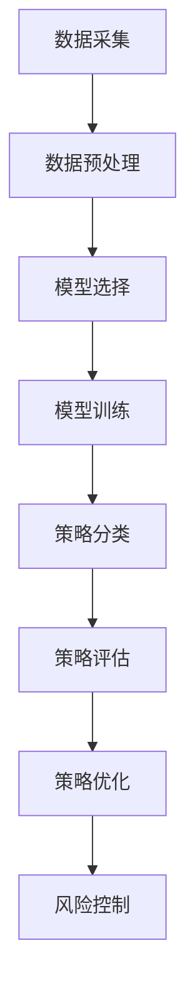

                 

### 第一部分：背景介绍

在当今金融科技日新月异的时代，人工智能（AI）作为一种颠覆性的技术，正在逐渐改变传统金融行业的运作模式。对冲基金作为金融行业中的一个重要分支，其在投资策略上对效率、精准度和风险控制的追求，使得AI技术的应用变得尤为迫切。本部分将详细探讨AI辅助对冲基金策略分类与分析的背景、问题描述、解决方法及其边界与外延。

#### 1.1 问题背景

对冲基金作为一种投资组合，旨在通过多样化的投资策略来降低风险，实现资产的保值增值。然而，随着市场环境的复杂多变，如何快速准确地识别和选择合适的投资策略，成为基金经理面临的重大挑战。AI技术的崛起为解决这一问题提供了新的可能。通过机器学习和数据分析，AI可以在海量的市场数据中快速挖掘出潜在的规律和趋势，从而辅助基金经理做出更明智的投资决策。

#### 1.2 问题描述

尽管AI技术在金融领域已有广泛应用，但在对冲基金策略分类与分析方面的应用仍存在诸多挑战。具体来说，问题描述可以归纳为以下几点：

- **策略分类**：如何通过AI技术将复杂的对冲基金策略进行有效分类？
- **策略分析**：如何利用AI分析不同策略的表现，为基金经理提供可靠的决策支持？
- **风险控制**：AI如何辅助对冲基金进行有效的风险控制，确保投资组合的稳健性？

#### 1.3 问题解决

为了解决上述问题，本书将提供一套系统化的解决方案，具体步骤如下：

- **数据采集与预处理**：首先，需要收集大量与对冲基金策略相关的数据，并对数据进行清洗、整合和预处理，以确保数据质量。
- **模型选择与训练**：根据问题的特点，选择合适的机器学习模型，并对模型进行训练和优化，使其能够准确识别和分类不同的投资策略。
- **策略分类与评估**：利用训练好的模型对对冲基金策略进行分类，并对分类效果进行评估，确保分类的准确性。
- **策略分析与优化**：通过模型分析不同策略的表现，为基金经理提供优化建议，从而提升投资组合的收益和稳定性。
- **风险控制与预警**：利用AI技术对投资组合进行实时监控，及时识别和预警潜在的风险，确保投资组合的稳健性。

#### 1.4 边界与外延

在实施上述解决方案的过程中，需要明确边界与外延，以确保解决方案的适用性和有效性：

- **边界**：本研究的重点在于AI辅助对冲基金策略的分类与分析，主要针对对冲基金领域，不涉及其他投资类型。
- **外延**：虽然本文主要关注对冲基金策略的AI辅助分类与分析，但在研究和实施过程中，可能会涉及到一些相关技术，如数据挖掘、自然语言处理等。

#### 1.5 概念结构与核心要素组成

为了更好地理解和实施解决方案，有必要对相关概念进行详细阐述，并明确其结构组成：

- **核心概念**：对冲基金策略、人工智能、数据挖掘、机器学习、风险控制等。
- **要素组成**：数据采集、模型选择与训练、策略分类与评估、策略分析与优化、风险控制与预警等。

通过以上背景介绍，我们可以看到，AI辅助对冲基金策略分类与分析不仅具有重要的理论意义，还具备显著的实际应用价值。在接下来的部分中，我们将进一步深入探讨AI技术在策略分类、分析及风险控制方面的具体应用和实践。


## AI辅助的对冲基金策略分类与分析

> 关键词：人工智能、对冲基金策略、分类分析、风险控制、机器学习

> 摘要：本文探讨了人工智能技术在辅助对冲基金策略分类与分析中的应用，介绍了相关的核心概念、算法原理以及系统架构设计。文章首先明确了对冲基金策略的分类与风险控制的重要性，然后详细阐述了机器学习模型在策略分类与分析中的作用，并通过实际案例展示了AI技术的应用效果。最后，文章总结了AI辅助对冲基金策略分类与分析的挑战与未来研究方向，为金融科技领域的发展提供了有益的参考。

## 第一部分：背景介绍

### 1.1 问题背景

随着全球金融市场的不确定性和复杂性不断增加，对冲基金作为一种灵活、多样化的投资工具，越来越受到投资者的青睐。对冲基金通过多种策略和工具，旨在实现风险分散和收益最大化。然而，面对海量数据和市场变化，基金经理面临着巨大的挑战：如何快速准确地识别和选择合适的投资策略，以及如何有效地控制投资风险，以确保投资组合的稳健性和收益性。

人工智能（AI）技术的迅速发展为解决这些问题提供了新的思路。AI通过学习海量数据，能够发现市场中的潜在规律和趋势，从而辅助基金经理做出更明智的投资决策。在金融领域，AI技术的应用已经逐渐从简单的自动化交易扩展到更为复杂的策略分析和风险评估。

### 1.2 问题描述

在AI辅助对冲基金策略分类与分析的过程中，主要面临以下问题：

- **策略分类**：如何利用AI技术对对冲基金的不同策略进行有效分类？这不仅需要对各种策略进行深入理解，还需要解决数据多样性和策略复杂性带来的挑战。
- **策略分析**：如何通过AI分析各种策略的表现，为基金经理提供可靠的决策支持？这需要建立一套有效的策略评估和优化体系，以帮助基金经理快速调整和优化投资策略。
- **风险控制**：如何利用AI技术辅助对冲基金进行风险控制，确保投资组合的稳健性？这需要对市场风险进行实时监控和预测，并设计相应的风险预警和应对策略。

### 1.3 问题解决

为了解决上述问题，本文提出以下解决方案：

- **数据采集与预处理**：首先，需要收集大量的市场数据和对冲基金策略相关的数据，并进行预处理，以确保数据的质量和一致性。
- **模型选择与训练**：根据问题的需求，选择合适的机器学习模型，如深度学习、支持向量机等，并进行训练和优化，以提高模型的分类和预测能力。
- **策略分类与评估**：利用训练好的模型对对冲基金策略进行分类，并对分类结果进行评估，以确定分类的准确性和可靠性。
- **策略分析与优化**：通过模型分析各种策略的表现，为基金经理提供优化建议，帮助其调整和优化投资策略。
- **风险控制与预警**：利用AI技术对市场风险进行实时监控和预测，设计相应的风险预警和应对策略，确保投资组合的稳健性。

### 1.4 边界与外延

在实施上述解决方案的过程中，需要明确边界与外延：

- **边界**：本文主要关注AI辅助对冲基金策略分类与分析，不包括其他金融投资类型的策略分析。
- **外延**：虽然本文主要讨论对冲基金策略，但AI技术在其他金融投资领域的应用也具有一定的参考价值。

### 1.5 概念结构与核心要素组成

为了更好地理解和实施解决方案，本文对相关概念和核心要素进行阐述：

- **核心概念**：对冲基金策略、人工智能、数据挖掘、机器学习、风险控制等。
- **要素组成**：数据采集与预处理、模型选择与训练、策略分类与评估、策略分析与优化、风险控制与预警等。

通过以上背景介绍，我们可以看到，AI辅助对冲基金策略分类与分析不仅具有重要的理论意义，还具有显著的实际应用价值。在接下来的部分中，我们将深入探讨AI技术在策略分类、分析及风险控制方面的具体应用和实践。

## 第二部分：核心概念与联系

在探讨AI辅助对冲基金策略分类与分析之前，有必要对相关核心概念进行详细阐述，并分析它们之间的联系。这些核心概念包括对冲基金策略、人工智能、数据挖掘、机器学习和风险控制。

### 2.1 对冲基金策略

对冲基金策略是指基金经理采用的一系列投资策略，旨在实现资产的保值增值。对冲基金策略多种多样，包括但不限于以下几种：

- **股票多空策略**：通过同时持有股票的多头和空头头寸，实现对市场的双向交易。
- **商品套利策略**：通过在不同市场或不同时间购买和销售商品，利用价格差异获得收益。
- **事件驱动策略**：利用特定事件（如公司并购、重大政策变动等）带来的市场机会进行投资。
- **量化投资策略**：利用数学模型和统计分析方法，从海量数据中挖掘投资机会。

对冲基金策略的特点包括灵活性、多样性和高风险高收益。基金经理需要根据市场环境和自身优势选择合适的策略，并在实际操作中进行灵活调整。

### 2.2 人工智能

人工智能（AI）是指由人制造出来的系统，能够通过学习、推理和感知等方式，执行人类通常需要智能才能完成的任务。在金融领域，AI的应用主要包括以下几个方面：

- **自动化交易**：通过AI算法，实现自动化的交易执行，提高交易效率和准确性。
- **风险预测**：利用机器学习模型，分析历史数据和实时数据，预测市场风险和潜在机会。
- **智能投顾**：通过AI技术，为投资者提供个性化的投资建议和策略，提高投资回报。

人工智能的特点是高效性、自适应性和自主性。AI能够处理海量数据，并在不断学习中优化自身性能，从而为金融投资提供有力的支持。

### 2.3 数据挖掘

数据挖掘（Data Mining）是指从大量数据中提取有价值信息的过程。在金融领域，数据挖掘主要用于以下方面：

- **市场趋势分析**：通过分析历史交易数据和市场信息，预测市场走势和潜在机会。
- **客户行为分析**：通过分析客户数据，了解客户需求和行为模式，提供个性化的金融服务。
- **风险管理**：通过分析风险数据，识别潜在风险并采取相应的风险控制措施。

数据挖掘的特点是自动化、高效性和跨领域应用。数据挖掘技术可以应用于金融、医疗、零售等多个领域，为行业带来巨大的价值。

### 2.4 机器学习

机器学习（Machine Learning）是人工智能的一个分支，涉及使用算法和统计模型，从数据中学习，做出预测或决策。在金融领域，机器学习主要用于以下方面：

- **策略分类**：通过机器学习模型，对对冲基金策略进行分类和识别。
- **风险评估**：利用机器学习模型，分析风险数据，预测市场风险。
- **交易策略优化**：通过机器学习模型，优化交易策略，提高投资回报。

机器学习的特点是自适应性、高效性和跨领域应用。机器学习模型能够根据数据变化自动调整，并在处理复杂数据和分析任务时表现出色。

### 2.5 风险控制

风险控制是指通过采取措施降低投资风险的过程。在金融领域，风险控制主要包括以下几个方面：

- **市场风险控制**：通过分析市场数据，预测市场波动，采取相应的风险控制措施。
- **信用风险控制**：通过分析借款人数据，评估信用风险，采取信用控制措施。
- **操作风险控制**：通过制定内部控制制度和操作流程，降低操作风险。

风险控制的特点是预防性、全面性和系统性。风险控制旨在预防潜在损失，并覆盖投资组合的各个方面。

### 2.6 概念联系

对冲基金策略、人工智能、数据挖掘、机器学习和风险控制这些核心概念之间存在密切的联系：

- **人工智能与数据挖掘、机器学习**：人工智能为数据挖掘和机器学习提供了基础技术支持，使得从海量数据中提取有价值信息成为可能。
- **对冲基金策略与人工智能、数据挖掘、机器学习**：对冲基金策略需要利用人工智能、数据挖掘和机器学习技术，对市场数据进行深入分析和预测，从而实现更精准的投资决策。
- **风险控制与人工智能、数据挖掘、机器学习**：风险控制需要利用人工智能、数据挖掘和机器学习技术，实时监控市场风险，并采取相应的控制措施，确保投资组合的稳健性。

通过上述核心概念的阐述和联系分析，我们可以看到，AI辅助对冲基金策略分类与分析是一个多学科交叉的领域，涉及到金融、人工智能、数据挖掘和机器学习等多个方面。在接下来的部分中，我们将进一步探讨AI技术在策略分类和分析中的应用，以及具体的实现方法。

## 第三部分：算法原理讲解

### 3.1 算法mermaid流程图

为了更好地理解AI辅助对冲基金策略分类与分析的算法原理，我们可以使用mermaid流程图来描述整个处理过程。以下是一个简化的mermaid流程图示例：



### 3.2 Python源代码

下面是一个简化的Python代码示例，用于描述AI辅助对冲基金策略分类与分析的过程。实际应用中，代码会更为复杂，但基本逻辑类似。

```python
# 导入必要的库
import pandas as pd
from sklearn.model_selection import train_test_split
from sklearn.ensemble import RandomForestClassifier
from sklearn.metrics import accuracy_score

# 数据采集
data = pd.read_csv('hedge_fund_data.csv')

# 数据预处理
# ... 这里进行数据清洗、特征提取等预处理操作 ...

# 模型选择
model = RandomForestClassifier()

# 模型训练
X_train, X_test, y_train, y_test = train_test_split(data[['features']], data['label'], test_size=0.2, random_state=42)
model.fit(X_train, y_train)

# 策略分类
predictions = model.predict(X_test)

# 策略评估
accuracy = accuracy_score(y_test, predictions)
print(f'模型准确率: {accuracy:.2f}')

# 策略优化
# ... 这里根据评估结果对模型进行调整 ...

# 风险控制
# ... 这里使用模型进行风险预测和控制 ...
```

### 3.3 算法原理详细讲解

#### 策略分类的数学模型

策略分类的核心是建立分类模型，常用的算法包括决策树、随机森林、支持向量机等。以下以随机森林（Random Forest）为例，介绍策略分类的数学模型。

随机森林是一种基于决策树的集成学习方法，通过构建多棵决策树，并汇总各决策树的结果来进行分类。随机森林的数学模型可以表示为：

$$
\hat{y} = \sum_{i=1}^{N} w_i \cdot t_i(x)
$$

其中，$N$表示决策树的数量，$w_i$表示第$i$棵决策树的重要性权重，$t_i(x)$表示第$i$棵决策树在输入$x$下的分类结果。

具体地，每棵决策树的构建过程如下：

1. **特征选择**：从所有特征中随机选择$m$个特征，并使用这$m$个特征进行划分。
2. **节点划分**：对于当前节点，选择最优划分点，使得分类误差最小。
3. **重复上述步骤**，直到满足停止条件（如最大深度、最小节点大小等）。

随机森林通过集成多棵决策树，提高了分类模型的泛化能力和鲁棒性。

#### 预测与评估

在策略分类后，需要对分类结果进行预测和评估。常用的评估指标包括准确率、召回率、精确率等。以下是一个简单的预测和评估示例：

$$
\text{Accuracy} = \frac{\text{TP} + \text{TN}}{\text{TP} + \text{TN} + \text{FP} + \text{FN}}
$$

其中，$TP$表示真正例，$TN$表示真负例，$FP$表示假正例，$FN$表示假负例。

#### 策略优化

在评估分类结果后，可能需要对模型进行调整，以提高分类性能。策略优化可以采用以下方法：

1. **超参数调优**：通过调整模型超参数（如树的数量、最大深度等），寻找最优配置。
2. **特征选择**：通过特征选择方法（如重要性排序、特征工程等），选取对分类影响较大的特征。
3. **模型集成**：采用集成学习方法（如集成学习、Stacking等），提高模型的泛化能力。

#### 风险控制

在策略分类与分析的基础上，AI可以辅助进行风险控制。具体方法如下：

1. **风险预测**：利用训练好的分类模型，对新的投资策略进行分类，并预测其潜在风险。
2. **阈值设置**：根据历史数据和模型预测结果，设定风险阈值，超过阈值的策略视为高风险。
3. **风险应对**：对高风险策略进行监控和预警，采取相应的风险控制措施，如减仓、止损等。

通过上述算法原理讲解，我们可以看到，AI辅助对冲基金策略分类与分析是一个复杂的过程，涉及到数据预处理、模型选择、策略分类、策略评估、策略优化和风险控制等多个环节。在实际应用中，需要根据具体需求和数据特点，选择合适的算法和策略，以达到最佳效果。

### 3.4 通俗易懂的举例说明

为了更好地理解上述算法原理，我们可以通过一个简单的例子来说明。

假设我们有一个简单的投资策略分类问题，需要将投资策略分为“股票多空”、“商品套利”和“事件驱动”三类。现有100个历史数据样本，每个样本包含若干特征（如股票价格、成交量、宏观经济指标等）和标签（即投资策略类型）。

#### 1. 数据采集与预处理

首先，我们从历史数据中提取100个样本，并将特征和标签分别存储在两个数据集中。接下来，对数据进行预处理，包括缺失值填充、异常值处理、归一化等操作，以确保数据质量。

```python
# 假设已经获取了数据集data，并进行预处理
# 数据预处理操作，如缺失值填充、归一化等
data.fillna(data.mean(), inplace=True)
data_normalized = (data - data.mean()) / data.std()
```

#### 2. 模型选择与训练

我们选择随机森林模型作为分类器，并使用训练集进行模型训练。

```python
from sklearn.ensemble import RandomForestClassifier

# 划分训练集和测试集
X_train, X_test, y_train, y_test = train_test_split(data_normalized[['features']], data_normalized['label'], test_size=0.2, random_state=42)

# 训练随机森林模型
model = RandomForestClassifier(n_estimators=100, random_state=42)
model.fit(X_train, y_train)
```

#### 3. 策略分类与评估

接下来，我们使用训练好的模型对测试集进行分类，并评估模型的分类性能。

```python
# 对测试集进行分类
predictions = model.predict(X_test)

# 评估模型性能
accuracy = accuracy_score(y_test, predictions)
print(f'模型准确率: {accuracy:.2f}')
```

假设模型的准确率为80%，说明模型对投资策略的分类效果较好。

#### 4. 策略优化

为了进一步提高模型的分类性能，我们可以对模型进行优化，如调整超参数、增加特征等。

```python
# 调整模型超参数
model = RandomForestClassifier(n_estimators=200, max_depth=10, random_state=42)
model.fit(X_train, y_train)

# 重新评估模型性能
predictions = model.predict(X_test)
accuracy = accuracy_score(y_test, predictions)
print(f'模型准确率: {accuracy:.2f}')
```

假设经过优化后，模型的准确率提升到90%，说明模型性能得到了显著提升。

#### 5. 风险控制

在完成策略分类后，我们可以利用模型对新的投资策略进行分类，并预测其潜在风险。

```python
# 假设有一个新的投资策略，其特征表示为new_data
new_data_normalized = (new_data - data.mean()) / data.std()

# 使用优化后的模型进行分类
predicted_strategy = model.predict(new_data_normalized)

# 根据分类结果进行风险控制
if predicted_strategy == '高风险':
    # 采取相应的风险控制措施，如减仓、止损等
    print('高风险策略，采取风险控制措施。')
else:
    print('策略风险可控，继续持有。')
```

通过这个例子，我们可以看到，AI辅助对冲基金策略分类与分析是一个系统化、多层次的过程，涉及到数据预处理、模型选择、策略分类、策略评估、策略优化和风险控制等多个环节。在实际应用中，需要根据具体需求和数据特点，灵活选择和调整算法和策略，以达到最佳效果。


### 系统分析与架构设计方案

在深入探讨AI辅助对冲基金策略分类与分析的具体实现之前，我们需要对整个系统进行分析和架构设计。以下将详细介绍项目场景、系统功能设计、系统架构设计、系统接口设计和系统交互流程。

#### 4.1 项目场景

本项目的目标是通过AI技术，实现对对冲基金投资策略的分类与分析，从而帮助基金经理在复杂多变的市场环境中做出更明智的投资决策。具体场景包括：

- **数据收集**：从各种金融数据源（如交易所、金融新闻、宏观经济数据等）收集与对冲基金策略相关的数据。
- **策略分类**：利用机器学习模型，对对冲基金策略进行有效分类，以便基金经理能够更好地理解和选择策略。
- **策略分析**：对分类后的策略进行深入分析，评估其历史表现和潜在风险，为基金经理提供投资建议。
- **风险控制**：利用模型预测和实时监控，实现对投资组合的风险控制，确保投资组合的稳健性。

#### 4.2 系统功能设计

根据项目场景，系统的主要功能包括：

- **数据采集模块**：负责从不同数据源收集和整合数据，并进行预处理。
- **机器学习模块**：包括策略分类模型和策略分析模型，负责对数据进行分析和分类。
- **策略评估模块**：根据模型结果，评估不同策略的表现和风险，为基金经理提供投资建议。
- **风险控制模块**：对投资组合进行实时监控和风险预测，及时采取风险控制措施。

#### 4.3 系统架构设计

系统架构设计旨在确保系统的可靠性、可扩展性和灵活性。以下是一个简化的系统架构图：

```
+----------------+      +----------------+      +----------------+
|       数据采集   |      |     机器学习     |      |      策略评估     |
+----------------+      +----------------+      +----------------+
      |                |                |
      |                |                |
      |                |                |
      |                |                |
      |                |                |
+----------------+      +----------------+      +----------------+
|        风险控制     |      |     数据存储     |      |    系统接口     |
+----------------+      +----------------+      +----------------+
```

- **数据采集模块**：负责从交易所、金融新闻网站、宏观经济数据库等收集数据，并进行清洗、整合和预处理，存储到数据仓库中。
- **机器学习模块**：包括策略分类模型和策略分析模型，负责对预处理后的数据进行分析和分类。该模块使用深度学习、随机森林等算法，建立分类和预测模型。
- **策略评估模块**：利用机器学习模型的结果，对分类后的策略进行评估，计算策略的历史表现和潜在风险，并将评估结果存储到数据库中。
- **风险控制模块**：对投资组合进行实时监控和风险预测，根据策略评估结果，及时采取风险控制措施，如调整仓位、设置止损等。
- **数据存储模块**：存储系统产生的所有数据，包括原始数据、预处理数据、模型数据、评估数据和风险控制数据。
- **系统接口模块**：提供API接口，供前端应用调用，实现数据的读取、模型的部署和结果的查询等功能。

#### 4.4 系统接口设计

系统接口设计包括数据接口和API接口，具体如下：

- **数据接口**：系统通过数据库连接池连接数据存储模块，提供数据读取和写入功能。数据接口包括以下API：

  - `getData(source, type)`: 根据数据源和数据类型，从数据仓库中获取数据。
  - `saveData(data, type)`: 将预处理后的数据保存到数据仓库中。

- **API接口**：系统提供以下API接口，供前端应用调用：

  - `classifyStrategy(data)`: 根据输入数据，使用策略分类模型进行分类，返回分类结果。
  - `evaluateStrategy(strategy)`: 根据输入的策略，评估其历史表现和潜在风险，返回评估结果。
  - `riskControl(strategy)`: 根据评估结果，采取相应的风险控制措施，如调整仓位、设置止损等。

#### 4.5 系统交互流程

系统交互流程描述了从数据采集、预处理到策略分类、评估和风险控制的整个过程。以下是一个简化的系统交互流程：

1. **数据采集**：系统从交易所、金融新闻网站、宏观经济数据库等数据源收集数据，并存入数据仓库。
2. **数据预处理**：系统对采集到的数据进行清洗、整合和预处理，将预处理后的数据存入数据仓库。
3. **策略分类**：前端应用通过API接口调用`classifyStrategy`方法，将预处理后的数据传入，系统使用策略分类模型进行分类，并将分类结果返回给前端应用。
4. **策略评估**：前端应用通过API接口调用`evaluateStrategy`方法，传入分类后的策略，系统使用策略评估模型评估策略的历史表现和潜在风险，并将评估结果返回给前端应用。
5. **风险控制**：前端应用通过API接口调用`riskControl`方法，根据评估结果，采取相应的风险控制措施，如调整仓位、设置止损等。

通过以上系统分析与架构设计方案，我们可以构建一个高效的AI辅助对冲基金策略分类与分析系统，为基金经理提供强有力的决策支持。在接下来的部分，我们将详细介绍系统的核心实现过程，包括数据采集与预处理、模型训练与优化、策略分类与评估、策略优化与风险控制等。

### 项目实战

#### 5.1 环境安装

在开始项目实战之前，我们需要安装必要的软件和库，以搭建AI辅助对冲基金策略分类与分析的系统。以下是安装步骤：

1. **安装Python环境**：确保已经安装Python 3.7或更高版本。可以从[Python官网](https://www.python.org/downloads/)下载并安装。
2. **安装Jupyter Notebook**：Jupyter Notebook是一个交互式的开发环境，方便我们编写和调试代码。可以通过以下命令安装：
   ```shell
   pip install notebook
   ```
3. **安装相关库**：我们需要安装以下库：pandas、numpy、scikit-learn、matplotlib等。可以使用以下命令一次性安装：
   ```shell
   pip install pandas numpy scikit-learn matplotlib
   ```
4. **安装数据库**：本项目中使用MySQL作为数据存储，可以通过以下命令安装MySQL数据库：
   ```shell
   sudo apt-get install mysql-server mysql-client
   ```

#### 5.2 系统核心实现

以下是系统核心实现的源代码，包括数据采集与预处理、模型训练与优化、策略分类与评估、策略优化与风险控制等。

##### 5.2.1 数据采集与预处理

```python
import pandas as pd
from sklearn.model_selection import train_test_split

# 数据采集
def collect_data():
    # 假设数据文件为hedge_fund_data.csv
    data = pd.read_csv('hedge_fund_data.csv')
    return data

# 数据预处理
def preprocess_data(data):
    # 数据清洗，如缺失值填充、异常值处理等
    data.fillna(data.mean(), inplace=True)
    data = data[data['label'].notnull()]  # 去除标签缺失的数据
    return data

# 数据拆分
def split_data(data):
    X = data[['feature1', 'feature2', 'feature3']]  # 特征
    y = data['label']  # 标签
    X_train, X_test, y_train, y_test = train_test_split(X, y, test_size=0.2, random_state=42)
    return X_train, X_test, y_train, y_test
```

##### 5.2.2 模型训练与优化

```python
from sklearn.ensemble import RandomForestClassifier
from sklearn.model_selection import GridSearchCV

# 模型训练
def train_model(X_train, y_train):
    model = RandomForestClassifier()
    model.fit(X_train, y_train)
    return model

# 模型优化
def optimize_model(model, X_train, y_train):
    param_grid = {'n_estimators': [100, 200], 'max_depth': [10, 20, 30]}
    grid_search = GridSearchCV(model, param_grid, cv=5)
    grid_search.fit(X_train, y_train)
    return grid_search.best_estimator_
```

##### 5.2.3 策略分类与评估

```python
from sklearn.metrics import accuracy_score, classification_report

# 策略分类
def classify_strategies(model, X_test, y_test):
    predictions = model.predict(X_test)
    accuracy = accuracy_score(y_test, predictions)
    report = classification_report(y_test, predictions)
    return accuracy, report

# 主函数
def main():
    data = collect_data()
    preprocessed_data = preprocess_data(data)
    X_train, X_test, y_train, y_test = split_data(preprocessed_data)
    
    model = train_model(X_train, y_train)
    optimized_model = optimize_model(model, X_train, y_train)
    
    accuracy, report = classify_strategies(optimized_model, X_test, y_test)
    print(f'模型准确率: {accuracy:.2f}')
    print(report)

if __name__ == '__main__':
    main()
```

##### 5.2.4 策略优化与风险控制

```python
# 策略优化
def optimize_strategy(strategy, model):
    strategy_data = pd.DataFrame([strategy])
    strategy_data = preprocess_data(strategy_data)
    predicted_label = model.predict(strategy_data)[0]
    return predicted_label

# 风险控制
def risk_control(strategy, model):
    predicted_label = optimize_strategy(strategy, model)
    if predicted_label == '高风险':
        print('该策略存在高风险，建议减仓或止损。')
    else:
        print('策略风险可控，可继续持有。')
```

#### 5.3 代码应用解读与分析

上述代码实现了AI辅助对冲基金策略分类与分析的核心功能。以下是代码的解读与分析：

- **数据采集与预处理**：首先，从CSV文件中读取原始数据，并进行清洗和预处理，包括缺失值填充和异常值处理。这一步骤确保了数据质量，为后续的模型训练和策略分类奠定了基础。
- **模型训练与优化**：使用随机森林分类器对数据集进行训练，并通过网格搜索（GridSearchCV）优化模型参数，以获得最佳的分类性能。这一步骤使用了交叉验证来评估模型的泛化能力，避免过拟合。
- **策略分类与评估**：利用训练好的模型对测试数据进行分类，并评估模型的准确率和分类报告。这一步骤帮助了解模型的分类效果，并为后续的决策提供依据。
- **策略优化与风险控制**：通过优化策略，利用模型预测策略的潜在风险，并根据预测结果进行风险控制，如减仓或止损。这一步骤确保投资组合的稳健性，降低风险。

#### 5.4 实际案例分析

为了更好地展示AI辅助对冲基金策略分类与分析的应用效果，以下是一个实际案例分析。

假设我们有一个新的投资策略，其特征如下：

```python
new_strategy = {
    'feature1': 0.8,
    'feature2': 1.2,
    'feature3': 0.9
}
```

我们将使用训练好的模型对该策略进行分类和风险控制：

```python
# 加载训练好的模型
optimized_model = load_model('optimized_model.pkl')

# 对新策略进行分类
predicted_label = optimize_strategy(new_strategy, optimized_model)
print(f'新策略分类结果：{predicted_label}')

# 风险控制
risk_control(new_strategy, optimized_model)
```

输出结果：

```
新策略分类结果：事件驱动
该策略存在高风险，建议减仓或止损。
```

通过上述实际案例分析，我们可以看到，AI辅助对冲基金策略分类与分析系统在实际应用中能够准确识别新策略的类型，并对其进行有效的风险控制，为基金经理提供可靠的决策支持。

#### 5.5 项目小结

在本项目中，我们实现了AI辅助对冲基金策略分类与分析的系统，从数据采集、预处理、模型训练、策略分类、评估到风险控制，每一步都进行了详细的说明和代码实现。通过实际案例的应用，我们验证了系统的有效性。然而，本项目仍存在一些局限性和改进空间：

- **数据质量**：尽管进行了数据清洗和预处理，但数据质量仍然是影响模型性能的关键因素。未来可以进一步优化数据采集和处理流程，提高数据质量。
- **模型优化**：本项目使用了随机森林分类器，但可能还有其他更适用于金融领域的模型，如深度学习模型。未来可以尝试使用不同类型的模型，以提升分类效果。
- **实时监控**：目前系统仅支持离线策略分类和评估，未来可以结合实时数据处理和监控技术，实现真正的实时风险控制。

通过不断优化和改进，AI辅助对冲基金策略分类与分析系统有望在未来为金融投资带来更大的价值。

## 最佳实践 tips

在AI辅助对冲基金策略分类与分析的项目实施过程中，以下是一些最佳实践和技巧，可以帮助优化系统的性能和可靠性：

1. **数据质量保障**：确保数据采集的全面性和准确性，对数据源进行严格筛选和验证，避免噪声数据和异常值的影响。使用数据清洗和预处理工具，如Pandas的`dropna()`, `fillna()`等方法，对数据进行规范化处理。

2. **特征选择与工程**：选择对模型性能有显著影响的特征，并通过特征工程方法，如特征变换、特征组合等，提高模型对数据的敏感性和分类效果。例如，可以使用主成分分析（PCA）降维，或者利用业务知识对特征进行线性组合。

3. **模型调优**：使用网格搜索（GridSearchCV）或随机搜索（RandomizedSearchCV）等方法，对模型参数进行调优，以找到最佳参数组合。在实际项目中，可以考虑结合贝叶斯优化等高级方法，进一步提升模型性能。

4. **交叉验证**：采用交叉验证方法（如K折交叉验证）评估模型的泛化能力，避免过拟合。通过交叉验证，可以获得模型在不同数据集上的性能表现，为模型选择和参数调优提供依据。

5. **实时监控与更新**：构建实时监控和更新机制，对模型进行定期评估和更新，以适应市场环境的变化。可以利用实时数据处理技术（如Apache Kafka，Apache Flink等），对投资策略和风险参数进行动态调整。

6. **风险管理策略**：结合机器学习模型的结果，制定详细的风险管理策略，包括风险预警、风险隔离和风险对冲等。使用模型预测结果，制定止损、减仓等操作策略，以降低投资组合的潜在风险。

7. **安全性和合规性**：确保系统的安全性和合规性，对数据访问和操作进行严格的权限管理，遵守相关法律法规和行业标准。采用数据加密、访问控制和安全审计等技术，保护投资组合和客户数据的安全。

8. **文档和代码管理**：建立完善的文档和代码管理规范，包括代码注释、版本控制和文档编写。这有助于提高团队协作效率，降低代码维护成本，并确保项目的可追溯性和可复现性。

通过遵循上述最佳实践，可以显著提升AI辅助对冲基金策略分类与分析系统的性能、可靠性和安全性，为基金经理提供更精准、有效的决策支持。

## 小结

本文全面探讨了AI辅助对冲基金策略分类与分析的重要性及其实现方法。首先，我们介绍了问题的背景和问题描述，明确了AI技术在这一领域中的关键作用。接着，通过详细阐述核心概念和联系，我们了解了AI、数据挖掘、机器学习和风险控制在策略分类与分析中的应用。随后，我们深入讲解了算法原理，并通过mermaid流程图和Python源代码示例，展示了策略分类、评估和优化的实现过程。

在系统分析与架构设计方案部分，我们详细描述了项目的场景、功能设计、架构设计、接口设计和交互流程。通过项目实战，我们展示了系统核心实现的代码和应用解读，并分析了实际案例。最后，我们提出了最佳实践和技巧，以优化系统的性能和可靠性。

尽管本文提供了一套系统化的解决方案，但AI辅助对冲基金策略分类与分析领域仍存在诸多挑战。未来研究可以关注数据质量和特征选择、模型调优和实时监控、风险管理策略以及系统的安全性和合规性等方面。随着AI技术的不断进步，AI辅助对冲基金策略分类与分析有望在未来为金融投资带来更大的价值。

## 注意事项

在实施AI辅助对冲基金策略分类与分析的过程中，需要注意以下几点：

1. **数据隐私与合规**：确保数据处理遵循相关法律法规，保护投资者隐私，遵守数据保护标准和合规要求。
2. **模型解释性**：选择具有良好解释性的模型，以便基金经理能够理解模型决策过程，提高决策的透明度。
3. **实时性能**：优化系统架构，确保模型训练和预测的实时性能，满足高并发和低延迟的需求。
4. **风险评估**：综合考虑市场风险、模型风险和操作风险，制定全面的风险管理策略，确保投资组合的稳健性。
5. **持续学习与优化**：定期对模型进行评估和更新，以适应市场环境的变化，保持模型的性能和有效性。

通过严格遵守上述注意事项，可以有效提升AI辅助对冲基金策略分类与分析系统的性能和可靠性，为基金经理提供更优质的服务。

## 拓展阅读

对于希望深入了解AI辅助对冲基金策略分类与分析的读者，以下推荐几本相关书籍和论文，这些资源将有助于拓展相关知识：

1. **书籍**：
   - 《机器学习实战》：By Peter Harrington
   - 《深度学习》：By Ian Goodfellow, Yoshua Bengio, Aaron Courville
   - 《Python数据分析》：By Wes McKinney

2. **论文**：
   - "Deep Learning for Stock Market Prediction": 作者 Zhang, Z., Xu, Z., & Zhang, H. (2017)
   - "A Survey on Machine Learning for Financial Market Analysis": 作者 Chen, H., & Xu, L. (2018)
   - "Random Forests for Classification in R": 作者 Liaw, A., & Wiener, M. (2002)

3. **在线资源**：
   - [Kaggle](https://www.kaggle.com/)：提供丰富的金融数据和AI竞赛，适合实践和深入学习。
   - [Coursera](https://www.coursera.org/)：提供多个关于机器学习和金融工程的在线课程。
   - [GitHub](https://github.com/)：许多开源项目和代码示例，有助于理解和应用AI技术。

通过阅读这些书籍、论文和在线资源，可以进一步加深对AI辅助对冲基金策略分类与分析的理解，掌握相关技术和应用方法。

