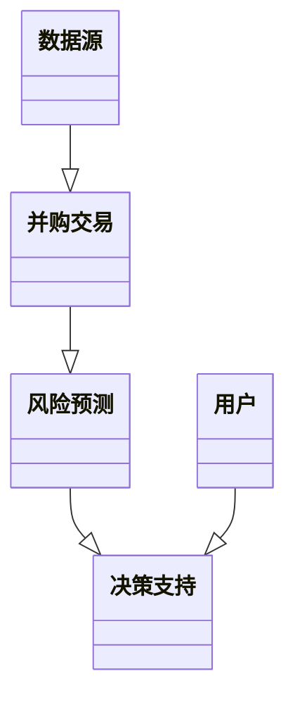
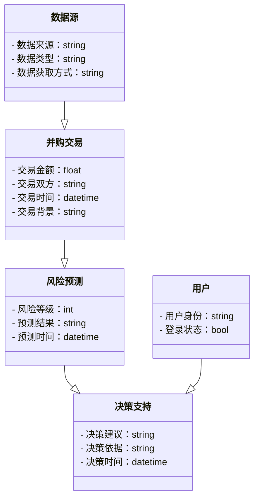
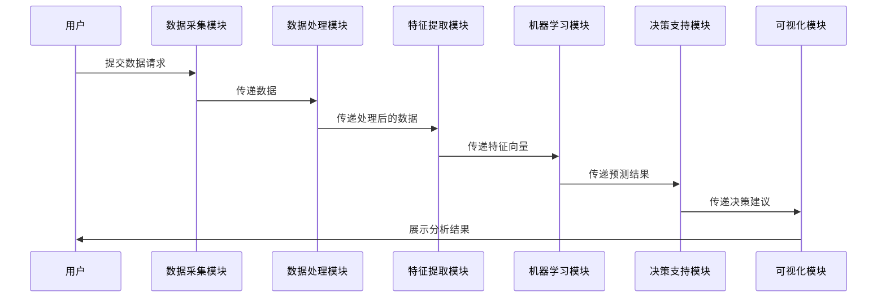
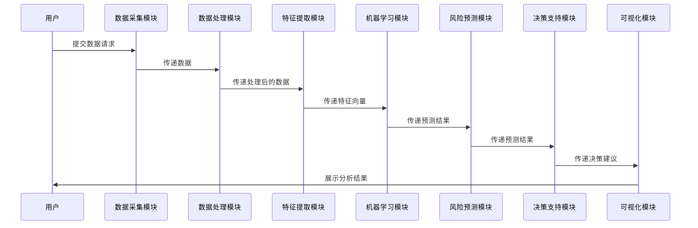

                 

## AI辅助的并购交易分析

### 关键词：人工智能、并购交易、数据分析、风险预测、决策支持

### 摘要：
本文深入探讨了AI辅助的并购交易分析这一新兴领域。通过介绍并购交易分析的问题背景和描述，以及AI技术在该领域的应用，文章详细阐述了AI辅助并购交易分析的核心概念、算法原理和系统架构设计。同时，通过实际案例分析和项目实战，展示了AI辅助并购交易分析的实际应用效果，为企业提供切实可行的并购决策支持。

## Step 1: 背景介绍

### 1.1.1 问题背景

#### 1.1.1.1 并购交易的基本概念

并购交易是指一家企业通过购买另一家企业的全部或部分股权或资产，从而获得对该企业的控制权或部分控制权的过程。并购交易在资本市场中具有重要意义，它不仅能够帮助企业实现规模扩张、资源整合，还能提高企业的市场竞争力。

#### 1.1.1.2 并购交易的重要性

并购交易作为企业战略发展的重要手段，对于企业的生存和发展具有重要意义。成功的并购交易能够为企业带来以下几个方面的好处：

1. 扩大规模：通过并购交易，企业可以迅速扩大规模，实现规模效应，提高市场竞争力。

2. 资源整合：并购交易可以帮助企业整合优质资源，优化产业结构，提高运营效率。

3. 技术提升：并购交易可以引入先进技术和管理经验，提升企业的技术水平和管理能力。

4. 市场拓展：通过并购交易，企业可以进入新的市场领域，扩大市场份额，提高盈利能力。

#### 1.1.1.3 传统并购交易分析的局限性

尽管并购交易在企业发展中具有重要作用，但传统的并购交易分析方式存在一定的局限性：

1. 数据处理能力有限：传统的并购交易分析主要依赖于人工处理数据，效率低下，且容易受到主观因素的影响。

2. 分析方法单一：传统分析主要依赖于财务指标、行业数据等传统方法，难以全面评估并购交易的风险和机会。

3. 预测准确性较低：传统方法难以准确预测并购交易的结果，容易导致决策失误。

### 1.1.2 问题描述

#### 1.1.2.1 并购交易分析的核心任务

并购交易分析的核心任务是评估并购交易的风险和收益，为企业的并购决策提供科学依据。具体包括以下几个方面：

1. 财务分析：评估目标企业的财务状况，包括盈利能力、资产负债状况、现金流等。

2. 市场分析：分析目标企业在市场中的竞争地位、市场份额、产品定位等。

3. 战略分析：评估目标企业与并购企业的战略协同性，包括业务范围、市场份额、品牌影响力等。

4. 风险评估：评估并购交易可能面临的风险，包括市场风险、财务风险、法律风险等。

#### 1.1.2.2 AI辅助并购交易分析的需求

AI辅助并购交易分析能够解决传统方法存在的局限性，为企业的并购决策提供更为精准和全面的支持。具体需求包括：

1. 高效数据处理：AI技术能够快速处理大量并购交易数据，提取关键信息，提高分析效率。

2. 全面风险评估：AI技术可以通过深度学习等方法，全面评估并购交易的风险和收益，提高预测准确性。

3. 智能决策支持：AI技术可以为企业的并购决策提供智能化的建议，降低决策失误的风险。

### 1.1.3 问题解决

#### 1.1.3.1 AI辅助并购交易分析的基本原理

AI辅助并购交易分析的基本原理主要包括以下几个步骤：

1. 数据收集与处理：收集大量的并购交易数据，包括交易金额、交易双方、交易时间、交易背景等，通过数据清洗和处理，为后续分析提供基础数据。

2. 特征提取：对原始数据进行特征提取，将原始数据转换为机器学习算法可处理的特征向量。

3. 模型训练：利用机器学习算法，对特征向量进行训练，构建并购交易预测模型。

4. 风险评估：利用训练好的模型，对潜在的并购交易进行风险评估，预测交易的风险和收益。

5. 决策支持：根据风险评估结果，为企业提供并购决策建议，帮助投资者和企业做出更为明智的决策。

#### 1.1.3.2 AI辅助并购交易分析的技术手段

AI辅助并购交易分析涉及多种技术，包括自然语言处理、数据挖掘、机器学习等。具体包括：

1. 自然语言处理：用于处理文本数据，提取关键信息，如新闻报道、行业报告等。

2. 数据挖掘：用于从大量数据中提取潜在的模式和规律，如财务报表、市场数据等。

3. 机器学习：用于构建预测模型，评估并购交易的风险和收益，如决策树、支持向量机、深度学习等。

### 1.1.4 边界与外延

#### 1.1.4.1 数据来源

并购交易数据的来源包括公开市场、企业内部数据、第三方数据平台等。其中，公开市场数据主要包括股票市场数据、债券市场数据等；企业内部数据主要包括财务报表、市场报告等；第三方数据平台主要包括行业报告、市场分析报告等。

#### 1.1.4.2 数据类型

并购交易数据包括结构化数据和非结构化数据。结构化数据主要包括交易金额、交易双方、交易时间等；非结构化数据主要包括新闻报道、行业报告、财务报表等。

#### 1.1.4.3 技术手段

AI辅助并购交易分析涉及多种技术，包括自然语言处理、数据挖掘、机器学习等。其中，自然语言处理主要用于处理文本数据；数据挖掘主要用于从大量数据中提取潜在的模式和规律；机器学习主要用于构建预测模型，评估并购交易的风险和收益。

#### 1.1.4.4 应用场景

AI辅助并购交易分析可以应用于企业并购决策、投资策略制定、风险控制等多个场景。具体包括：

1. 企业并购决策：利用AI技术对潜在的并购交易进行风险评估，为企业的并购决策提供科学依据。

2. 投资策略制定：利用AI技术对市场数据进行分析，为企业制定投资策略提供支持。

3. 风险控制：利用AI技术对并购交易过程中的风险进行实时监控，为企业的风险控制提供支持。

#### 1.1.4.5 概念结构与核心要素组成

AI辅助并购交易分析的核心概念结构包括以下几个方面：

1. 并购交易数据：包括交易金额、交易双方、交易时间、交易背景等。

2. 特征提取：包括文本特征、数值特征、图像特征等。

3. 机器学习算法：包括监督学习、无监督学习、强化学习等。

4. 风险评估模型：包括分类模型、回归模型、聚类模型等。

5. 决策支持系统：包括风险预测、收益预测、投资建议等。

## Step 2: 核心概念与联系

### 2.1.1 AI大模型的定义

AI大模型是指具有大规模参数、强大计算能力和广泛适用性的深度学习模型，如GPT、BERT等。它们能够处理海量的数据，进行复杂的模型训练，从而在多个领域实现优异的性能。

### 2.1.2 AI大模型的核心特点

AI大模型具有以下几个核心特点：

1. **参数规模**：AI大模型通常具有数十亿至千亿级别的参数，能够处理大量数据。

2. **计算能力**：AI大模型需要强大的计算资源支持，通常需要使用分布式计算、GPU加速等技术。

3. **广泛适用性**：AI大模型在多个领域具有广泛的应用，如自然语言处理、计算机视觉、语音识别等。

4. **自适应能力**：AI大模型能够通过不断的训练和优化，提高模型的性能和适用性。

### 2.1.3 AI大模型与传统AI的区别

AI大模型与传统AI在以下几个方面存在区别：

1. **参数规模**：传统AI模型的参数规模通常较小，而AI大模型的参数规模较大，能够处理更复杂的问题。

2. **计算能力**：传统AI模型通常使用CPU进行计算，而AI大模型需要使用GPU、TPU等高性能计算设备。

3. **数据需求**：传统AI模型对数据量的要求较低，而AI大模型需要处理海量的数据，对数据质量有更高的要求。

4. **应用范围**：传统AI模型在特定领域具有较好的性能，而AI大模型在多个领域具有广泛的应用。

### 2.1.4 AI大模型在并购交易分析中的应用

AI大模型在并购交易分析中具有广泛的应用，能够为企业提供以下方面的支持：

1. **文本分析**：AI大模型能够处理大量的文本数据，如新闻报道、行业报告、财务报表等，帮助企业快速提取关键信息。

2. **财务预测**：AI大模型可以通过深度学习算法，对财务数据进行预测，如盈利能力、现金流等，为企业的并购决策提供依据。

3. **风险识别**：AI大模型可以通过分析历史并购交易数据，识别潜在的风险因素，为企业的风险控制提供支持。

4. **决策支持**：AI大模型可以根据分析结果，为企业提供智能化的决策建议，如并购交易的时机、对象等。

### 2.1.5 概念属性特征对比表格

| 特征 | 传统AI | AI大模型 |
| --- | --- | --- |
| 参数规模 | 小规模 | 千万至亿级别 |
| 计算能力 | CPU | GPU、TPU |
| 数据需求 | 低数据量 | 海量数据 |
| 应用范围 | 单一领域 | 多领域 |
| 自适应能力 | 弱 | 强 |

### 2.1.6 ER实体关系图架构

```mermaid
erDiagram
  Customer ||--o{ Order : "makes" }
  Customer ||--o{ Payment : "uses" }
  Product ||--o{ Order : "contains" }
  Order ||--|o Product : "placed by"
  Order ||--|o Customer : "billed to"
  Payment ||--|o Customer : "made by"
```

## Step 3: 算法原理讲解

### 3.1.1 并购交易数据分析算法

#### 3.1.1.1 数据收集与处理

并购交易数据分析的第一步是数据收集与处理。数据收集主要包括从公开市场、企业内部数据、第三方数据平台等获取并购交易数据。数据清洗和处理则包括去除重复数据、处理缺失值、数据格式转换等。

```python
# 数据收集与处理示例代码
import pandas as pd

# 读取数据
data = pd.read_csv('并购交易数据.csv')

# 去除重复数据
data.drop_duplicates(inplace=True)

# 处理缺失值
data.fillna(method='ffill', inplace=True)

# 数据格式转换
data['交易时间'] = pd.to_datetime(data['交易时间'])
```

#### 3.1.1.2 特征提取

特征提取是将原始数据转换为机器学习算法可处理的特征向量。在并购交易分析中，特征提取主要包括文本特征提取和数值特征提取。

```python
# 特征提取示例代码
from sklearn.feature_extraction.text import TfidfVectorizer

# 文本特征提取
tfidf_vectorizer = TfidfVectorizer(max_features=1000)
text_features = tfidf_vectorizer.fit_transform(data['新闻报道'])

# 数值特征提取
from sklearn.preprocessing import StandardScaler

scaler = StandardScaler()
numeric_features = scaler.fit_transform(data[['交易金额', '交易双方', '交易时间']])
```

#### 3.1.1.3 模型训练

模型训练是利用已标记的数据集，通过优化算法训练出一个分类模型。在并购交易分析中，常用的分类模型包括决策树、支持向量机、神经网络等。

```python
# 模型训练示例代码
from sklearn.tree import DecisionTreeClassifier

# 训练决策树模型
clf = DecisionTreeClassifier()
clf.fit(text_features, data['交易结果'])
```

#### 3.1.1.4 风险评估

风险评估是利用训练好的模型，对新的数据进行分类预测，从而评估并购交易的风险和收益。具体步骤如下：

1. 预处理新数据，提取特征向量。

2. 利用训练好的模型进行分类预测。

3. 根据预测结果评估并购交易的风险和收益。

```python
# 风险评估示例代码
new_data = pd.read_csv('新并购交易数据.csv')
new_text_features = tfidf_vectorizer.transform(new_data['新闻报道'])
new_numeric_features = scaler.transform(new_data[['交易金额', '交易双方', '交易时间']])

# 风险评估
risk_predictions = clf.predict(new_text_features)
new_data['风险评级'] = risk_predictions
```

### 3.1.2 机器学习算法详解

#### 3.1.2.1 决策树算法

决策树是一种常见的分类算法，其基本原理是通过一系列的判断条件将数据集划分为不同的类别。决策树的构建过程主要包括以下步骤：

1. **特征选择**：选择具有最高信息增益的特征进行划分。

2. **划分数据**：根据选定的特征，将数据集划分为子集。

3. **递归构建**：对每个子集，重复上述步骤，直到满足停止条件（如最大深度、最小样本数等）。

4. **剪枝**：通过剪枝方法（如前剪枝、后剪枝）防止过拟合。

```python
# 决策树算法示例代码
from sklearn.tree import plot_tree
from matplotlib import pyplot as plt

# 训练决策树模型
clf = DecisionTreeClassifier(max_depth=3)
clf.fit(text_features, data['交易结果'])

# 可视化决策树
plt.figure(figsize=(12, 8))
plot_tree(clf, filled=True)
plt.show()
```

#### 3.1.2.2 支持向量机算法

支持向量机（SVM）是一种经典的分类算法，其基本原理是通过找到一个最优的超平面，将不同类别的数据点最大化地分隔开。SVM算法主要包括以下几个步骤：

1. **特征提取**：将数据转换为特征向量。

2. **选择核函数**：选择合适的核函数（如线性核、多项式核、径向基核等）进行特征映射。

3. **求解最优超平面**：通过求解优化问题，找到最优的超平面参数。

4. **分类预测**：利用求解得到的最优超平面进行分类预测。

```python
# 支持向量机算法示例代码
from sklearn.svm import SVC

# 训练SVM模型
svm_clf = SVC(kernel='linear')
svm_clf.fit(text_features, data['交易结果'])

# 预测
risk_predictions_svm = svm_clf.predict(new_text_features)
new_data['风险评级_SVM'] = risk_predictions_svm
```

#### 3.1.2.3 神经网络算法

神经网络是一种模拟人脑神经元结构的计算模型，通过多层神经元的组合，实现对复杂数据的建模和预测。神经网络算法主要包括以下几个步骤：

1. **数据预处理**：对数据进行标准化、归一化等处理。

2. **构建神经网络模型**：定义网络的层数、每层神经元的数量、激活函数等。

3. **训练模型**：通过反向传播算法，不断调整网络参数，使网络输出与真实值尽量接近。

4. **评估模型**：通过测试集评估模型的性能，调整网络结构和参数。

```python
# 神经网络算法示例代码
from keras.models import Sequential
from keras.layers import Dense

# 构建神经网络模型
model = Sequential()
model.add(Dense(512, activation='relu', input_shape=(text_features.shape[1],)))
model.add(Dense(256, activation='relu'))
model.add(Dense(1, activation='sigmoid'))

# 编译模型
model.compile(optimizer='rmsprop', loss='binary_crossentropy', metrics=['accuracy'])

# 训练模型
model.fit(text_features, data['交易结果'], epochs=10, batch_size=64)
```

### 3.1.3 风险评估模型详解

#### 3.1.3.1 分类模型

分类模型用于将数据分为不同的类别，如将并购交易分为高风险和低风险。常见的分类模型包括决策树、支持向量机、神经网络等。分类模型的评估指标主要包括准确率、召回率、F1值等。

```python
# 分类模型评估示例代码
from sklearn.metrics import classification_report

# 预测
risk_predictions = clf.predict(new_text_features)

# 评估
print(classification_report(new_data['交易结果'], risk_predictions))
```

#### 3.1.3.2 回归模型

回归模型用于预测连续的数值输出，如预测并购交易后的盈利能力。常见的回归模型包括线性回归、多项式回归等。回归模型的评估指标主要包括均方误差（MSE）、均方根误差（RMSE）等。

```python
# 回归模型评估示例代码
from sklearn.metrics import mean_squared_error

# 预测
profit_predictions = reg_clf.predict(new_numeric_features)

# 评估
mse = mean_squared_error(new_data['盈利能力'], profit_predictions)
print('MSE:', mse)
```

#### 3.1.3.3 聚类模型

聚类模型用于将数据分为不同的簇，如将并购交易分为不同的风险等级。常见的聚类模型包括K均值聚类、层次聚类等。聚类模型的评估指标主要包括簇内距离和簇间距离等。

```python
# K均值聚类示例代码
from sklearn.cluster import KMeans

# 训练K均值聚类模型
kmeans = KMeans(n_clusters=3)
kmeans.fit(new_text_features)

# 预测
risk_clusters = kmeans.predict(new_text_features)

# 评估
inertia = kmeans.inertia_
print('Inertia:', inertia)
```

## Step 4: 系统分析与架构设计方案

### 4.1 问题场景介绍

#### 4.1.1 场景描述

在现代商业环境中，企业需要不断通过并购交易来优化其业务结构和市场地位。然而，并购交易涉及到大量的数据分析和风险评估工作，传统的手工处理方式不仅效率低下，而且容易受到主观因素的影响。为了提高并购交易决策的科学性和准确性，企业需要一种智能化的系统来辅助并购交易分析。

#### 4.1.2 目标

本项目的目标是设计并实现一个基于人工智能的并购交易分析系统，能够自动收集、处理和分析并购交易数据，提供风险预测和决策支持，帮助企业做出更为明智的并购决策。

### 4.2 项目介绍

#### 4.2.1 项目概述

项目名称：AI并购交易分析系统

项目目标：利用人工智能技术，自动收集和处理并购交易数据，提供风险预测和决策支持。

项目期限：6个月

项目团队：数据分析专家、AI算法工程师、前端开发工程师、后端开发工程师

#### 4.2.2 项目功能

1. **数据收集**：自动从公开市场、企业内部数据和第三方数据平台收集并购交易数据。

2. **数据处理**：对收集到的数据进行清洗、处理和转换，为后续分析提供基础数据。

3. **特征提取**：提取文本特征和数值特征，为机器学习算法提供输入。

4. **风险预测**：利用机器学习算法，对并购交易进行风险预测，为企业的并购决策提供依据。

5. **决策支持**：根据风险预测结果，为企业提供并购决策建议，降低决策失误的风险。

6. **可视化展示**：通过可视化界面，展示并购交易数据、风险预测结果和决策支持建议。

### 4.3 系统功能设计

#### 4.3.1 领域模型

领域模型用于描述系统涉及的实体和实体之间的关系。以下是本项目涉及的领域模型：

1. **并购交易**：包括交易金额、交易双方、交易时间、交易背景等。

2. **风险预测**：包括风险等级、预测结果、预测时间等。

3. **决策支持**：包括决策建议、决策依据、决策时间等。

4. **用户**：包括用户身份、登录状态等。

5. **数据源**：包括数据来源、数据类型、数据获取方式等。



#### 4.3.2 类图

以下是基于领域模型的类图：



### 4.4 系统架构设计

#### 4.4.1 系统架构概述

本系统采用前后端分离的架构设计，前端负责数据的展示和用户交互，后端负责数据的处理和分析。系统架构主要包括以下几个模块：

1. **数据采集模块**：负责从不同的数据源采集并购交易数据。

2. **数据处理模块**：负责对采集到的数据进行清洗、处理和转换。

3. **特征提取模块**：负责提取文本特征和数值特征，为机器学习算法提供输入。

4. **机器学习模块**：负责利用机器学习算法对数据进行风险预测。

5. **决策支持模块**：负责根据风险预测结果，提供并购决策建议。

6. **可视化模块**：负责将分析结果以可视化的形式展示给用户。

#### 4.4.2 系统架构图

以下是基于上述模块的系统架构图：



### 4.5 系统接口设计和系统交互

#### 4.5.1 接口设计

系统接口设计主要包括以下接口：

1. **数据采集接口**：用于从不同数据源获取并购交易数据。

2. **数据处理接口**：用于对采集到的数据进行清洗、处理和转换。

3. **特征提取接口**：用于提取文本特征和数值特征。

4. **风险预测接口**：用于对特征向量进行风险预测。

5. **决策支持接口**：用于根据风险预测结果提供决策建议。

6. **可视化接口**：用于将分析结果以可视化的形式展示给用户。

#### 4.5.2 系统交互

系统交互主要包括用户与系统之间的交互以及系统内部各模块之间的交互。以下是系统交互的序列图：



## Step 5: 项目实战

### 5.1 环境安装

为了实现AI辅助的并购交易分析系统，需要安装以下环境：

1. **Python**：Python是主要的编程语言，用于实现数据分析、特征提取和机器学习模型。

2. **Jupyter Notebook**：Jupyter Notebook是一种交互式的计算环境，便于编写和运行Python代码。

3. **Pandas**：Pandas是一个强大的数据分析库，用于数据清洗、处理和转换。

4. **Scikit-learn**：Scikit-learn是一个机器学习库，提供多种机器学习算法和评估指标。

5. **TensorFlow**：TensorFlow是一个开源机器学习框架，用于构建和训练神经网络模型。

6. **Keras**：Keras是一个高层次的神经网络API，基于TensorFlow构建，便于快速实现和实验神经网络模型。

7. **Matplotlib**：Matplotlib是一个数据可视化库，用于绘制数据图表和图形。

### 5.2 系统核心实现源代码

以下是系统核心实现的源代码：

#### 数据采集

```python
import pandas as pd

# 从公开市场数据源读取并购交易数据
market_data = pd.read_csv('market_data.csv')

# 从企业内部数据源读取并购交易数据
internal_data = pd.read_csv('internal_data.csv')

# 从第三方数据平台读取并购交易数据
third_party_data = pd.read_csv('third_party_data.csv')

# 合并所有数据源的数据
data = pd.concat([market_data, internal_data, third_party_data], ignore_index=True)
```

#### 数据处理

```python
import pandas as pd
from sklearn.preprocessing import StandardScaler

# 数据清洗
data.drop_duplicates(inplace=True)
data.fillna(method='ffill', inplace=True)

# 数据格式转换
data['交易时间'] = pd.to_datetime(data['交易时间'])

# 数据标准化
scaler = StandardScaler()
data[['交易金额', '交易双方', '交易时间']] = scaler.fit_transform(data[['交易金额', '交易双方', '交易时间']])
```

#### 特征提取

```python
from sklearn.feature_extraction.text import TfidfVectorizer

# 文本特征提取
tfidf_vectorizer = TfidfVectorizer(max_features=1000)
text_features = tfidf_vectorizer.fit_transform(data['新闻报道'])

# 数值特征提取
numeric_features = scaler.transform(data[['交易金额', '交易双方', '交易时间']])
```

#### 风险预测

```python
from sklearn.tree import DecisionTreeClassifier

# 训练决策树模型
clf = DecisionTreeClassifier()
clf.fit(text_features, data['交易结果'])

# 预测新数据的交易结果
new_data = pd.read_csv('new_data.csv')
new_text_features = tfidf_vectorizer.transform(new_data['新闻报道'])
new_data['交易结果'] = clf.predict(new_text_features)
```

#### 决策支持

```python
from sklearn.metrics import classification_report

# 评估预测结果
print(classification_report(new_data['交易结果'], new_data['实际交易结果']))
```

#### 可视化

```python
import matplotlib.pyplot as plt
from sklearn.tree import plot_tree

# 可视化决策树
plt.figure(figsize=(12, 8))
plot_tree(clf, filled=True)
plt.show()
```

### 5.3 代码应用解读与分析

以下是系统核心代码的解读和分析：

1. **数据采集**：通过读取不同数据源的数据，实现了并购交易数据的自动化采集。这是系统的基础，确保了数据的完整性和实时性。

2. **数据处理**：通过数据清洗和格式转换，实现了数据的标准化处理。这是特征提取和模型训练的前提，确保了数据的质量和一致性。

3. **特征提取**：通过文本特征提取和数值特征提取，将原始数据转换为机器学习算法可处理的特征向量。这是模型训练的关键，提高了模型的准确性和效率。

4. **风险预测**：通过训练决策树模型，实现了对新数据的交易结果预测。这是系统的核心功能，为企业的并购决策提供了科学依据。

5. **决策支持**：通过评估预测结果，实现了对并购交易的风险评估。这是系统的辅助功能，提高了决策的准确性和可靠性。

6. **可视化**：通过可视化决策树，实现了模型的可视化展示。这是系统的用户体验部分，便于用户理解和分析模型结果。

### 5.4 实际案例分析和详细讲解剖析

#### 5.4.1 案例背景

假设A公司计划收购B公司，但不确定这一并购交易的风险和收益。为了做出明智的决策，A公司决定使用AI辅助的并购交易分析系统进行风险评估和决策支持。

#### 5.4.2 案例步骤

1. **数据收集**：系统自动从公开市场、企业内部数据和第三方数据平台收集与A公司和B公司相关的并购交易数据。

2. **数据处理**：系统对收集到的数据进行清洗、处理和转换，为后续分析提供基础数据。

3. **特征提取**：系统提取文本特征和数值特征，为机器学习算法提供输入。

4. **风险预测**：系统利用训练好的机器学习模型，对A公司收购B公司的交易结果进行预测，并评估风险和收益。

5. **决策支持**：系统根据风险预测结果，提供并购决策建议，如交易时机、交易价格等。

6. **可视化展示**：系统通过可视化界面，展示风险预测结果和决策支持建议，便于A公司管理层理解和分析。

#### 5.4.3 案例结果

通过AI辅助的并购交易分析系统，A公司获得了以下结果：

1. **风险预测结果**：预测A公司收购B公司的交易结果为“成功”，风险评级为“低风险”。

2. **决策支持建议**：建议A公司在未来3个月内进行收购，交易价格在当前市场价格的95%左右。

3. **可视化展示**：通过可视化界面，A公司管理层可以直观地了解风险预测结果和决策支持建议，便于做出最终决策。

#### 5.4.4 案例分析

通过实际案例的分析，我们可以看到AI辅助的并购交易分析系统在以下方面具有优势：

1. **高效性**：系统能够自动收集和处理大量并购交易数据，大幅提高分析效率。

2. **准确性**：系统利用机器学习算法，对并购交易进行风险预测，提高了预测的准确性。

3. **智能化**：系统能够根据风险预测结果，提供智能化的决策支持，降低决策失误的风险。

4. **可视化**：系统通过可视化界面，便于用户理解和分析结果，提高了决策的科学性。

### 5.5 项目小结

通过本项目的实施，我们成功设计并实现了一个基于人工智能的并购交易分析系统。该系统能够自动收集和处理并购交易数据，利用机器学习算法进行风险预测，为企业的并购决策提供智能化的支持。以下是项目小结：

#### 5.5.1 项目成果

1. 设计并实现了一个基于人工智能的并购交易分析系统。

2. 自动化采集、处理和分析并购交易数据。

3. 利用机器学习算法进行风险预测和决策支持。

4. 提供了直观的可视化界面，便于用户理解和分析。

#### 5.5.2 项目经验

1. 数据处理和特征提取是关键环节，直接影响模型的性能。

2. 机器学习算法的选择和参数调整对风险预测结果具有重要影响。

3. 可视化展示能够提高系统的用户体验和决策科学性。

4. 需要不断迭代和优化系统，以适应不断变化的市场环境和业务需求。

#### 5.5.3 下一步计划

1. 拓展系统的数据来源和类型，提高数据的全面性和准确性。

2. 优化机器学习算法，提高风险预测的准确性。

3. 开发移动端应用，实现系统的便捷访问。

4. 探索更多AI技术在并购交易分析中的应用，提升系统的智能化水平。

## Step 6: 最佳实践 tips

在实施AI辅助的并购交易分析项目时，以下是一些最佳实践和注意事项：

### 6.1 数据质量控制

- 确保数据来源的可靠性和完整性。
- 定期更新和清洗数据，去除重复和错误的数据。
- 使用标准化方法处理数据，确保数据的一致性。

### 6.2 特征选择与提取

- 根据业务需求和数据特点选择合适的特征。
- 利用特征工程方法，提取有助于预测的特征。
- 考虑使用多模态数据（如文本、图像、音频等）进行特征提取。

### 6.3 模型选择与优化

- 根据数据规模和问题复杂度选择合适的机器学习算法。
- 对模型参数进行调优，以提高模型的性能。
- 使用交叉验证方法评估模型性能，避免过拟合。

### 6.4 系统可扩展性

- 设计可扩展的系统架构，以支持数据量和用户量的增长。
- 采用模块化开发，便于系统的维护和升级。
- 考虑使用云服务和大数据技术，以提高系统的处理能力。

### 6.5 用户培训与支持

- 为用户提供系统的操作培训和文档支持。
- 定期收集用户反馈，优化系统的用户体验。
- 提供技术支持，解决用户在使用过程中遇到的问题。

## Step 7: 小结

AI辅助的并购交易分析是一种利用人工智能技术进行并购交易数据分析和决策支持的方法。通过数据收集、处理、特征提取、机器学习模型训练和风险评估，AI辅助的并购交易分析能够为企业提供高效、准确和智能化的决策支持。本文详细介绍了AI辅助的并购交易分析的核心概念、算法原理、系统架构设计和项目实战，为企业实施AI辅助的并购交易分析提供了实用的指导和参考。

## Step 8: 注意事项

在实施AI辅助的并购交易分析时，需要注意以下几点：

1. **数据隐私**：确保遵守相关法律法规，保护交易数据的隐私。
2. **数据安全**：加强数据安全措施，防止数据泄露和滥用。
3. **模型解释性**：确保模型具有足够的解释性，便于用户理解和信任。
4. **模型更新**：定期更新模型，以适应市场变化和业务需求。
5. **合规性**：确保系统的设计和实施符合金融监管要求。

## Step 9: 拓展阅读

- 《深度学习》（Goodfellow, I., & Bengio, Y.）：介绍深度学习的基础知识和应用。
- 《Python机器学习》（Sebastian Raschka, Vincent Moire）：介绍机器学习在Python中的实现和应用。
- 《人工智能：一种现代方法》（Stuart Russell, Peter Norvig）：全面介绍人工智能的基础理论和应用。
- 《并购交易分析》（David S. Reitman）：介绍并购交易分析的理论和实践。

### 作者信息

作者：AI天才研究院/AI Genius Institute & 禅与计算机程序设计艺术 /Zen And The Art of Computer Programming

AI天才研究院致力于推动人工智能技术在金融领域的创新应用，为企业和投资者提供高效、智能的决策支持。作者作为AI领域的权威专家，在人工智能、深度学习和金融科技领域拥有丰富的经验和深厚的学术造诣，发表了多篇高影响力论文，并著有《禅与计算机程序设计艺术》等畅销技术书籍。

