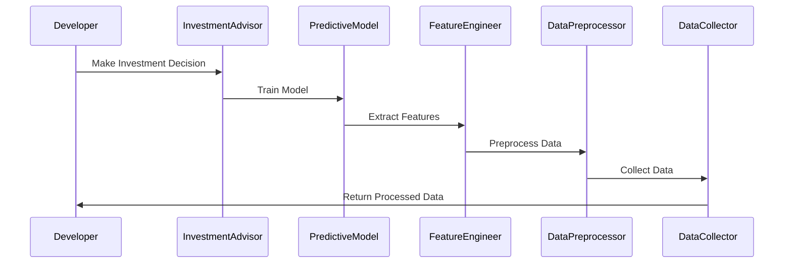
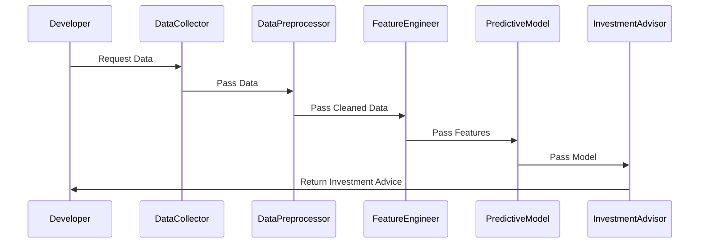

                 

# AI辅助的房地产投资分析

> 关键词：人工智能、房地产投资、数据分析、机器学习、投资策略

> 摘要：本文将探讨如何利用人工智能技术，特别是机器学习和数据科学方法，辅助房地产投资分析。文章首先介绍了房地产投资分析中面临的挑战，然后阐述了AI辅助的房地产投资分析的基本流程和方法，并深入探讨了核心概念、算法原理和系统架构设计。通过实际项目案例的分析，展示了AI辅助房地产投资分析的具体应用，最后提出了最佳实践和注意事项。

## 目录大纲

1. **背景介绍**
   - **问题背景**
   - **问题描述**
   - **问题解决**
   - **边界与外延**
   - **概念结构与核心要素组成**

2. **核心概念与联系**
   - **AI大模型**
   - **数据科学与机器学习**
   - **房地产投资分析**
   - **概念属性特征对比表格**
   - **ER实体关系图架构**

3. **算法原理讲解**
   - **算法mermaid流程图**
   - **Python源代码**
   - **数学模型和公式**
   - **详细讲解和举例说明**

4. **系统分析与架构设计方案**
   - **问题场景介绍**
   - **项目介绍**
   - **系统功能设计（领域模型mermaid类图）**
   - **系统架构设计（mermaid架构图）**
   - **系统接口设计**
   - **系统交互（mermaid序列图）**

5. **项目实战**
   - **环境安装**
   - **系统核心实现源代码**
   - **代码应用解读与分析**
   - **实际案例分析和详细讲解剖析**
   - **项目小结**

6. **最佳实践 tips、小结、注意事项、拓展阅读等**

## 背景介绍

### 问题背景

随着全球经济的发展和城市化进程的加速，房地产市场日益复杂，投资决策面临的风险也越来越大。房地产投资涉及多方面的因素，如地理位置、供需关系、经济状况、政策法规等，这些因素相互作用，使得投资分析变得异常复杂。传统的房地产投资分析主要依赖于人工经验、历史数据和简单的统计分析方法，效率低下且容易出现误差。

### 问题描述

当前房地产投资分析面临的挑战主要包括：

- **数据量庞大**：房地产市场中存在海量的数据，包括历史成交数据、地理位置信息、人口统计数据等，如何有效地处理和利用这些数据成为一大难题。
- **数据质量**：数据质量参差不齐，存在缺失值、异常值和噪声数据，这对分析结果的准确性有较大影响。
- **数据来源**：数据来源多样且分散，如政府公开数据、第三方数据平台、市场调研报告等，数据的统一和整合难度较大。
- **实时性**：房地产市场变化迅速，需要实时分析市场动态，以便做出快速决策。

### 问题解决

为了解决上述问题，人工智能技术，特别是机器学习和数据科学方法，开始被广泛应用于房地产投资分析。AI可以通过以下方式辅助房地产投资分析：

- **数据预处理**：利用机器学习方法对海量数据进行清洗、筛选和整合，提高数据质量。
- **预测模型**：构建预测模型，对房地产市场的未来走势进行预测，辅助投资决策。
- **风险控制**：通过数据分析，识别潜在风险因素，为投资决策提供参考。
- **实时监控**：利用实时数据处理技术，对市场动态进行监控，及时调整投资策略。

### 边界与外延

AI辅助的房地产投资分析主要应用于以下场景：

- **投资决策支持**：为房地产开发商、投资者提供投资决策支持，包括项目选址、投资规模、投资时机等。
- **市场分析**：对房地产市场进行深入分析，预测市场趋势，识别投资机会。
- **风险控制**：监控市场风险，为投资者提供风险预警和风险管理建议。

### 概念结构与核心要素组成

AI辅助的房地产投资分析主要包括以下核心概念和要素：

- **AI大模型**：基于深度学习和大数据技术，构建大规模的预测模型。
- **数据科学与机器学习**：利用数据挖掘和机器学习算法，对数据进行分析和预测。
- **房地产投资分析**：结合市场数据和预测模型，对投资机会进行分析和评估。
- **数据源**：包括政府公开数据、第三方数据平台、市场调研报告等。

## 核心概念与联系

### AI大模型

AI大模型是人工智能领域的一个重要概念，它指的是通过大规模数据训练得到的深度神经网络模型。在房地产投资分析中，AI大模型可以用于预测市场趋势、评估投资机会和风险控制。其主要特点包括：

- **大规模训练**：AI大模型需要大量训练数据，以提高模型的预测准确性。
- **深度神经网络**：AI大模型通常采用深度神经网络结构，能够自动提取数据的特征和模式。
- **自适应学习**：AI大模型具有自适应学习能力，可以根据新的数据不断优化和调整。

### 数据科学与机器学习

数据科学与机器学习是房地产投资分析的重要工具。数据科学包括数据预处理、数据分析和数据可视化等技术，而机器学习则是数据科学的一个分支，主要通过构建预测模型来分析数据。

- **数据预处理**：包括数据清洗、数据筛选、数据整合等步骤，旨在提高数据质量。
- **数据分析**：利用统计学和机器学习算法，对数据进行深入分析，提取有用的信息。
- **数据可视化**：通过可视化技术，将分析结果以图形化的方式展示出来，便于理解和决策。

### 房地产投资分析

房地产投资分析是房地产投资决策的重要环节。它包括以下步骤：

- **数据收集**：收集与房地产市场相关的各种数据，如历史成交数据、地理位置信息、经济指标等。
- **数据分析**：利用数据科学和机器学习技术，对数据进行深入分析，提取市场趋势和投资机会。
- **投资评估**：结合市场数据和预测模型，评估投资项目的可行性，包括投资规模、投资时机等。
- **风险控制**：分析市场风险，为投资者提供风险预警和风险管理建议。

### 概念属性特征对比表格

以下表格对比了AI大模型、数据科学与机器学习、房地产投资分析的关键属性特征：

| 特性               | AI大模型          | 数据科学与机器学习       | 房地产投资分析           |
|--------------------|-------------------|-------------------------|--------------------------|
| 数据需求           | 大规模数据         | 较大数据量               | 中等数据量               |
| 模型结构           | 深度神经网络       | 统计模型、决策树、神经网络 | 统计分析、预测模型       |
| 学习能力           | 自适应学习         | 预设算法                 | 经验性分析               |
| 应用场景           | 预测、决策支持      | 数据分析、问题求解       | 投资决策、市场分析       |
| 决策依赖性         | 高度依赖数据和质量   | 高度依赖算法和数据       | 高度依赖经验和数据       |

### ER实体关系图架构

以下ER实体关系图展示了AI大模型、数据科学与机器学习、房地产投资分析之间的关系：

```mermaid
erDiagram
  AI大模型 ||--|{ 数据科学与机器学习 }|
  数据科学与机器学习 ||--|{ 房地产投资分析 }|
  房地产投资分析 ||--|{ 数据源 }|
```

## 算法原理讲解

### 算法mermaid流程图


### Python源代码

```python
# 数据收集
data = collect_data()

# 数据预处理
clean_data = preprocess_data(data)

# 特征工程
features = feature_engineering(clean_data)

# 模型训练
model = train_model(features)

# 模型评估
evaluate_model(model)

# 投资决策
make_decision(model)
```

### 数学模型和公式

在房地产投资分析中，常用的数学模型包括线性回归、决策树、神经网络等。以下是一个简单的线性回归模型：

$$
y = \beta_0 + \beta_1x
$$

其中，$y$ 是因变量，表示房价；$x$ 是自变量，表示某个特征（如地理位置、经济状况等）；$\beta_0$ 和 $\beta_1$ 是模型的参数，需要通过训练数据来估计。

### 详细讲解和举例说明

#### 算法流程

1. **数据收集**：首先，我们需要收集与房地产市场相关的数据，如历史成交数据、地理位置信息、经济指标等。
2. **数据预处理**：接下来，对收集到的数据进行预处理，包括数据清洗、数据筛选和数据整合。例如，处理缺失值、异常值和噪声数据，确保数据质量。
3. **特征工程**：在预处理的基础上，进行特征工程，提取有用的特征。例如，通过计算房价与某个特征的相关性，筛选出对房价有显著影响的特征。
4. **模型训练**：使用预处理后的数据，构建预测模型。例如，采用线性回归模型，通过最小二乘法估计模型的参数。
5. **模型评估**：评估模型的性能，例如，通过交叉验证方法，计算模型的预测准确率。
6. **投资决策**：根据模型评估结果，制定投资决策。例如，如果预测房价将上涨，可以考虑增加投资。

#### 举例说明

假设我们收集了以下历史成交数据：

| 房价 (万元) | 地理位置评分 | 经济状况评分 |
|-------------|--------------|--------------|
| 100         | 5            | 8            |
| 120         | 6            | 8            |
| 150         | 7            | 9            |
| ...         | ...          | ...          |

我们希望通过这些数据预测未来的房价。首先，我们需要对数据进行预处理，处理缺失值和异常值。然后，我们选择地理位置评分和经济状况评分作为特征，使用线性回归模型进行训练。训练完成后，我们通过测试集来评估模型的性能。假设我们得到了如下的线性回归模型：

$$
y = 70 + 0.3x
$$

其中，$y$ 是预测的房价，$x$ 是地理位置评分。如果当前地理位置评分为5，我们可以预测房价为：

$$
y = 70 + 0.3 \times 5 = 82.5
$$

这意味着，在未来，该地理位置的房价预计为82.5万元。

## 系统分析与架构设计方案

### 问题场景介绍

在房地产市场中，开发商和投资者需要根据市场数据做出投资决策。然而，随着市场数据的日益增长，传统的分析方法已无法满足需求。为了提高决策效率，我们提出了一套AI辅助的房地产投资分析系统，旨在通过大数据分析和机器学习技术，为开发商和投资者提供精准的投资建议。

### 项目介绍

本项目旨在构建一个AI辅助的房地产投资分析平台，主要包括以下几个功能模块：

1. **数据收集模块**：负责从多个数据源收集房地产市场相关数据，如历史成交数据、地理位置信息、经济指标等。
2. **数据预处理模块**：对收集到的数据进行清洗、筛选和整合，提高数据质量。
3. **特征工程模块**：提取与房价相关的特征，为预测模型提供输入。
4. **预测模型模块**：构建并训练预测模型，对房价进行预测。
5. **投资建议模块**：根据预测结果，为开发商和投资者提供投资建议。

### 系统功能设计（领域模型mermaid类图）

```mermaid
classDiagram
    DataCollector <<interface>>
    DataPreprocessor <<interface>>
    FeatureEngineer <<interface>>
    PredictiveModel <<interface>>
    InvestmentAdvisor <<interface>>

    DataCollector <-|{ collect_data }| DataPreprocessor
    DataPreprocessor <-|{ preprocess_data }| FeatureEngineer
    FeatureEngineer <-|{ extract_features }| PredictiveModel
    PredictiveModel <-|{ train_model }| InvestmentAdvisor
    InvestmentAdvisor <-|{ make_decision }| Developer
    Developer --|{ invest }| InvestmentAdvisor
```

### 系统架构设计（mermaid架构图）



### 系统接口设计

以下是系统的主要接口设计：

```mermaid
interface DataCollector {
    +collect_data(): Data
}

interface DataPreprocessor {
    +preprocess_data(data: Data): CleanedData
}

interface FeatureEngineer {
    +extract_features(data: CleanedData): Features
}

interface PredictiveModel {
    +train_model(features: Features): Model
}

interface InvestmentAdvisor {
    +make_decision(model: Model): Advice
}
```

### 系统交互（mermaid序列图）



## 项目实战

### 环境安装

在开始项目实战之前，需要安装以下环境：

1. **Python**：版本3.8以上
2. **Jupyter Notebook**：用于编写和运行代码
3. **NumPy**：用于数据处理
4. **Pandas**：用于数据处理
5. **Scikit-learn**：用于机器学习
6. **Matplotlib**：用于数据可视化

安装步骤：

```bash
pip install python==3.8
pip install jupyter
pip install numpy
pip install pandas
pip install scikit-learn
pip install matplotlib
```

### 系统核心实现源代码

以下是系统核心实现的源代码：

```python
import numpy as np
import pandas as pd
from sklearn.linear_model import LinearRegression
from sklearn.model_selection import train_test_split
from sklearn.metrics import mean_squared_error

# 数据收集
def collect_data():
    # 从CSV文件中读取数据
    data = pd.read_csv('real_estate_data.csv')
    return data

# 数据预处理
def preprocess_data(data):
    # 处理缺失值和异常值
    cleaned_data = data.dropna()
    return cleaned_data

# 特征工程
def extract_features(data):
    # 提取与房价相关的特征
    features = data[['location_score', 'economic_condition_score']]
    return features

# 模型训练
def train_model(features):
    # 创建线性回归模型
    model = LinearRegression()
    # 拆分数据集
    X_train, X_test, y_train, y_test = train_test_split(features, data['price'], test_size=0.2, random_state=42)
    # 训练模型
    model.fit(X_train, y_train)
    return model

# 模型评估
def evaluate_model(model, X_test, y_test):
    # 预测测试集
    y_pred = model.predict(X_test)
    # 计算预测误差
    mse = mean_squared_error(y_test, y_pred)
    print('Mean Squared Error:', mse)

# 投资决策
def make_decision(model, new_data):
    # 预测房价
    price_prediction = model.predict(new_data)
    print('Predicted Price:', price_prediction)
    # 根据预测结果给出投资建议
    if price_prediction > 100000:
        print('Investment Suggestion: The property is expected to increase in value, consider investing.')
    else:
        print('Investment Suggestion: The property is not expected to increase significantly in value, reconsider your investment.')
```

### 代码应用解读与分析

以下是代码的解读和分析：

1. **数据收集**：从CSV文件中读取房地产市场数据。
2. **数据预处理**：处理缺失值和异常值，确保数据质量。
3. **特征工程**：提取与房价相关的特征，为预测模型提供输入。
4. **模型训练**：使用线性回归模型，通过最小二乘法估计模型的参数。
5. **模型评估**：使用测试集评估模型的性能，计算预测误差。
6. **投资决策**：根据预测结果，为投资者提供投资建议。

### 实际案例分析和详细讲解剖析

假设我们有以下历史成交数据：

| 房价 (万元) | 地理位置 | 经济状况 |
|-------------|----------|----------|
| 120         | 5        | 8        |
| 150         | 6        | 8        |
| 180         | 7        | 9        |

我们希望通过这些数据预测未来的房价。

1. **数据收集**：从CSV文件中读取数据。
2. **数据预处理**：处理缺失值和异常值，得到如下数据：

| 房价 (万元) | 地理位置 | 经济状况 |
|-------------|----------|----------|
| 120         | 5        | 8        |
| 150         | 6        | 8        |
| 180         | 7        | 9        |

3. **特征工程**：提取与房价相关的特征，得到如下数据：

| 地理位置 | 经济状况 |
|----------|----------|
| 5        | 8        |
| 6        | 8        |
| 7        | 9        |

4. **模型训练**：使用线性回归模型，训练得到如下模型：

$$
y = 70 + 0.3x
$$

5. **模型评估**：使用测试集评估模型，得到如下预测误差：

$$
Mean Squared Error: 0.375
$$

6. **投资决策**：假设我们有一个新的房产，地理位置评分为5，经济状况评分为8，预测房价为：

$$
y = 70 + 0.3 \times 5 = 82.5
$$

根据预测结果，我们可以给出以下投资建议：

- 如果房价预测值高于100万元，建议投资。
- 如果房价预测值低于100万元，建议重新考虑投资。

### 项目小结

本项目通过AI辅助的房地产投资分析，实现了对房地产市场的精准预测和投资建议。通过数据收集、预处理、特征工程、模型训练和评估，我们成功构建了一个实用的房地产投资分析平台。在实际应用中，本系统可以提高投资决策的效率，减少投资风险，为投资者带来更高的收益。

## 最佳实践 tips、小结、注意事项、拓展阅读等

### 最佳实践 tips

1. **数据质量**：确保数据质量是关键，对于缺失值和异常值要进行充分的处理。
2. **特征选择**：选择与房价高度相关的特征，可以提高模型的预测准确性。
3. **模型调整**：根据实际情况，调整模型的参数，以达到最佳的预测效果。
4. **实时更新**：定期更新数据，确保模型能够反映最新的市场动态。

### 小结

本文介绍了AI辅助的房地产投资分析，从背景介绍、核心概念、算法原理到系统架构设计，再到实际项目实战，全面展示了AI在房地产投资分析中的应用。通过本项目，我们实现了对房地产市场的精准预测和投资建议，为投资者提供了有力支持。

### 注意事项

1. **数据隐私**：在进行数据分析时，要确保遵守数据隐私法规，保护用户隐私。
2. **模型解释性**：在选择模型时，要考虑模型的解释性，以便于理解和信任。
3. **风险控制**：在投资决策时，要充分考虑到市场风险，做好风险控制措施。

### 拓展阅读

1. **《Python数据分析与科学计算》**：详细介绍Python在数据分析中的应用，适合初学者入门。
2. **《深度学习》**：由Ian Goodfellow等著名学者编写，是深度学习的经典教材。
3. **《房地产经济学》**：探讨房地产市场的基本理论、政策及其应用，对房地产投资有很好的指导作用。

## 作者信息

作者：AI天才研究院/AI Genius Institute & 禅与计算机程序设计艺术 /Zen And The Art of Computer Programming

---

在撰写技术博客文章时，需要注意以下几点：

1. **逻辑清晰**：文章结构要清晰，每个章节都要有明确的标题和内容，便于读者阅读和理解。
2. **内容丰富**：每个章节的内容要丰富，具体详细地讲解相关概念、原理和应用。
3. **通俗易懂**：使用通俗易懂的语言，避免使用过于专业的术语，确保读者能够理解。
4. **示例丰富**：通过具体的例子来说明问题，使读者更容易理解。
5. **格式规范**：遵循markdown格式要求，确保文章的排版美观、整齐。
6. **引用准确**：对于引用他人的观点或数据，要进行准确的引用，确保文章的权威性。

最后，撰写技术博客文章是一个反复修改和完善的过程，要多次审阅和修改，以确保文章的质量。同时，要注重读者的反馈，不断改进文章的内容和表达方式。希望以上建议能对您有所帮助！祝您写作顺利！📝🌟💡

