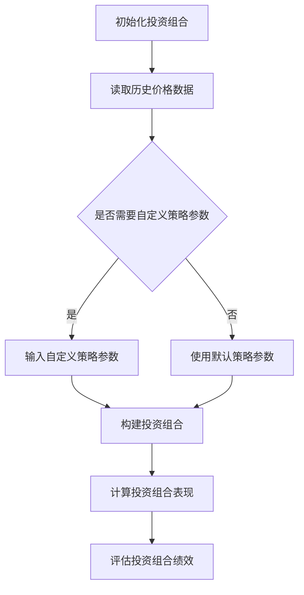
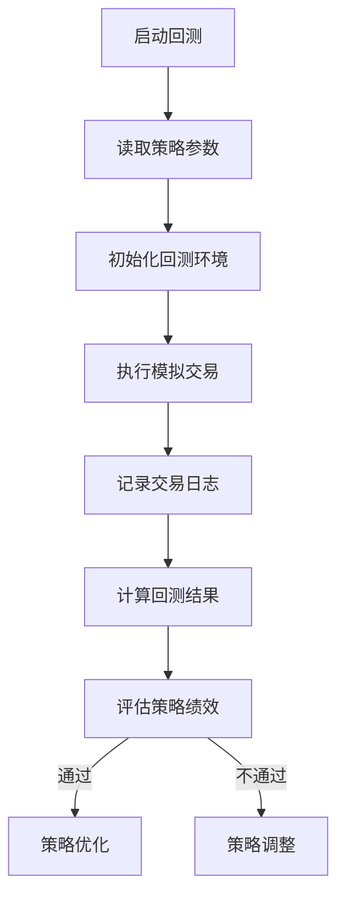
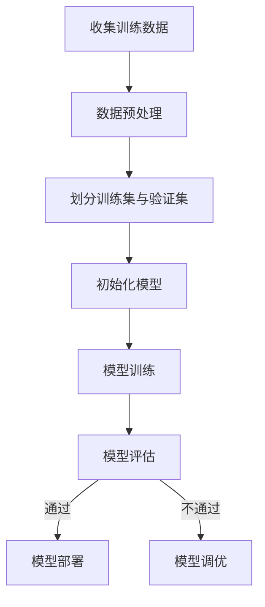
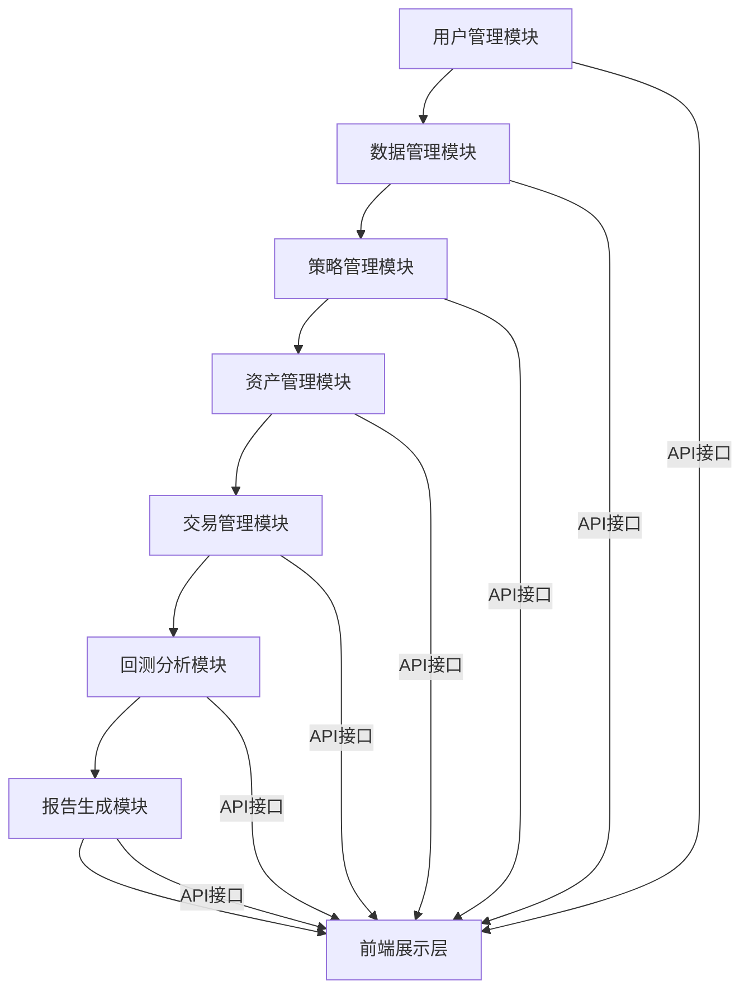
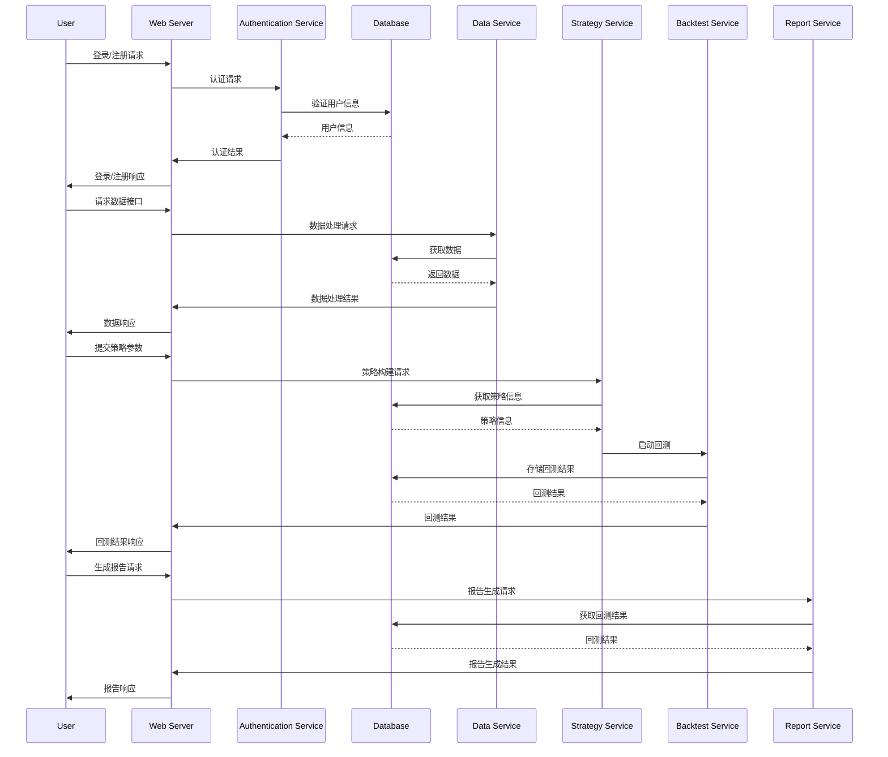

                 


### 1.1 问题背景

投资组合回测是金融领域中的一项重要活动，旨在评估不同投资策略的有效性，帮助投资者优化其投资组合。随着人工智能（AI）技术的发展，AI辅助的投资组合回测平台应运而生，为传统的回测方法带来了革命性的变化。

#### 1.1.1 投资组合回测的重要性

投资组合回测的核心目的是通过历史数据模拟投资策略的表现，以预测其未来的盈利能力。一个有效的投资组合不仅能最大化收益，还要控制风险，保持资产的稳定增值。回测可以提供以下益处：

- **优化策略**：通过模拟不同策略的执行情况，投资者可以找到最优的资产配置。
- **风险控制**：回测可以帮助投资者了解其投资策略在极端市场条件下的表现，从而合理配置风险。
- **决策支持**：回测结果为投资者提供了量化的数据支持，有助于做出更为科学的投资决策。

#### 1.1.2 传统回测平台存在的问题

尽管传统的回测平台在金融领域已经得到广泛应用，但它们也存在一些问题：

- **计算效率低下**：传统回测方法主要依赖手动编程和大量的计算资源，效率较低。
- **数据质量受限**：传统的回测平台在处理数据时可能会遇到数据缺失、数据质量问题，影响回测的准确性。
- **策略适应性差**：传统回测平台通常针对特定的市场环境设计，难以适应快速变化的市场条件。

#### 1.1.3 AI辅助回测的潜力

AI辅助的投资组合回测平台通过引入机器学习算法和大数据技术，解决了传统回测平台的一些问题，展现出巨大的潜力：

- **计算效率提升**：AI算法可以在短时间内处理海量数据，大大提高了计算效率。
- **数据质量优化**：AI可以自动识别和纠正数据中的错误，提高数据质量。
- **策略适应性增强**：AI算法能够根据市场变化自动调整投资策略，提高适应性。

### 1.2 问题描述

在本部分中，我们将详细探讨投资组合回测平台的基本功能需求、AI在回测中的应用场景以及一些边界与外延问题。

#### 1.2.1 回测平台的基本功能需求

一个典型的投资组合回测平台应该具备以下基本功能：

- **数据采集**：从不同的数据源（如交易所、金融数据服务提供商）获取历史价格数据、交易数据等。
- **数据预处理**：对原始数据进行清洗、转换和整合，确保数据质量。
- **投资组合构建**：根据投资者设定的策略参数，构建不同的投资组合。
- **回测分析**：对构建的投资组合进行模拟交易，评估其绩效，包括收益、风险、夏普比率等指标。
- **策略优化**：通过机器学习算法优化投资策略，以提高投资组合的表现。

#### 1.2.2 AI在回测中的应用场景

AI在投资组合回测中可以发挥重要作用，主要应用场景包括：

- **数据预处理**：使用AI算法自动化处理数据清洗和预处理任务，提高数据质量。
- **策略优化**：利用机器学习算法进行策略优化，寻找最佳投资组合。
- **市场预测**：通过预测模型预测市场走势，为投资决策提供依据。
- **风险评估**：AI可以帮助评估不同投资组合的风险，提供风险预警。

#### 1.2.3 边界与外延

在设计和实施AI辅助的投资组合回测平台时，需要注意以下几个边界与外延问题：

- **数据合规性**：确保数据来源的合规性，遵守相关法律法规。
- **模型解释性**：AI模型的预测结果需要具备一定的解释性，以便投资者理解。
- **计算资源**：AI算法通常需要大量的计算资源，需要合理分配资源以避免过度消耗。
- **市场适应性**：AI模型需要具备良好的市场适应性，以应对市场的快速变化。

### 1.3 问题解决

在了解了投资组合回测平台的背景和问题描述后，我们需要思考如何解决这些问题，并设计一个高效的AI辅助回测平台。

#### 1.3.1 AI辅助回测的核心概念

AI辅助回测的核心概念包括：

- **机器学习算法**：用于构建预测模型，评估投资策略的表现。
- **数据预处理**：通过自动化处理提高数据质量，减少人工干预。
- **模型优化**：使用优化算法调整模型参数，提高模型性能。
- **风险评估**：使用AI模型评估投资组合的风险，提供预警。

#### 1.3.2 技术架构选择

为了设计一个高效、可靠的AI辅助回测平台，我们需要选择合适的技术架构。以下是几个关键技术选择：

- **计算平台**：选择高性能的云计算平台，如AWS、Google Cloud等，以提高计算效率。
- **数据处理框架**：使用如Apache Spark等大数据处理框架，处理海量数据。
- **机器学习框架**：选择成熟的机器学习框架，如TensorFlow、PyTorch等，进行模型训练和预测。
- **API接口**：设计RESTful API，提供与前端系统的交互接口。

#### 1.3.3 数据处理流程

数据处理流程是AI辅助回测平台的关键环节，包括以下步骤：

- **数据采集**：从不同的数据源获取历史价格数据、交易数据等。
- **数据清洗**：自动化处理数据清洗任务，如缺失值填充、异常值处理等。
- **数据转换**：将原始数据转换为适合机器学习算法处理的格式。
- **数据存储**：将预处理后的数据存储到数据库或数据湖中，以便后续分析和模型训练。

### 1.4 概念结构与核心要素组成

为了更好地理解和设计AI辅助的投资组合回测平台，我们需要明确其概念结构与核心要素组成。

#### 1.4.1 投资组合回测平台的主要组件

一个典型的AI辅助投资组合回测平台主要包括以下几个核心组件：

- **数据采集模块**：负责从多个数据源获取历史价格数据、交易数据等。
- **数据预处理模块**：负责清洗、转换和整合数据，确保数据质量。
- **投资组合构建模块**：根据投资者设定的策略参数，构建不同的投资组合。
- **回测分析模块**：对构建的投资组合进行模拟交易，评估其绩效。
- **策略优化模块**：使用机器学习算法优化投资策略。
- **风险评估模块**：使用AI模型评估投资组合的风险。

#### 1.4.2 AI模型的基本类型与选择

在投资组合回测中，常见的AI模型类型包括：

- **回归模型**：用于预测资产的未来价格。
- **分类模型**：用于判断资产的投资方向（买入或卖出）。
- **聚类模型**：用于分析资产之间的相关性，优化投资组合。
- **时间序列模型**：用于预测市场走势，为投资决策提供依据。

选择合适的AI模型取决于投资者的策略需求和数据特征。

#### 1.4.3 数据来源与处理

数据来源是AI辅助回测平台的基础，主要包括：

- **历史价格数据**：从交易所、金融数据服务提供商等获取。
- **交易数据**：包括买卖记录、交易时间、交易量等。
- **宏观经济数据**：如GDP、利率、通货膨胀率等。

数据处理流程包括：

- **数据采集**：使用API接口从不同数据源获取数据。
- **数据清洗**：自动化处理数据清洗任务，如缺失值填充、异常值处理等。
- **数据转换**：将原始数据转换为适合机器学习算法处理的格式。
- **数据存储**：将预处理后的数据存储到数据库或数据湖中，以便后续分析和模型训练。

### 1.5 本章小结

在本章中，我们首先介绍了投资组合回测的背景和重要性，分析了传统回测平台存在的问题以及AI辅助回测的潜力。接着，我们详细探讨了投资组合回测平台的基本功能需求、AI在回测中的应用场景以及边界与外延问题。随后，我们提出了AI辅助回测的核心概念、技术架构选择以及数据处理流程。最后，我们明确了投资组合回测平台的主要组件、AI模型的基本类型与选择，以及数据来源与处理流程。通过本章的学习，我们对AI辅助的投资组合回测平台有了更深入的了解。

## 2.1 核心概念原理

在设计和实现AI辅助的投资组合回测平台过程中，理解相关核心概念原理是至关重要的。以下是几个关键概念及其原理的详细解释。

### 2.1.1 投资组合理论

投资组合理论是由哈里·马科维茨（Harry Markowitz）在1950年代提出的，旨在通过资产组合优化风险与收益。核心原理包括：

- **风险分散**：通过持有多种不同类型的资产，可以降低投资组合的整体风险。
- **资产相关性**：不同资产之间的相关性会影响投资组合的风险和收益。
- **期望收益率与风险**：投资者需要在期望收益率和风险之间做出权衡，以实现最优资产配置。

### 2.1.2 回测方法

回测是评估投资策略历史表现的重要工具，主要包括以下几个步骤：

- **策略参数设置**：定义交易策略的参数，如买卖信号、持有期限等。
- **数据准备**：获取历史价格数据和交易数据，进行预处理。
- **模拟交易**：根据策略参数进行模拟交易，计算投资组合的表现。
- **绩效评估**：评估投资组合的绩效指标，如收益率、夏普比率、最大回撤等。

### 2.1.3 AI模型原理

AI模型在投资组合回测中的应用主要体现在以下几个方面：

- **预测模型**：如时间序列预测模型和回归模型，用于预测资产价格。
- **分类模型**：用于判断投资决策，如买入、卖出或持有。
- **聚类模型**：用于分析资产之间的相关性，优化投资组合。
- **强化学习**：用于优化交易策略，通过模拟环境训练模型。

### 2.1.4 机器学习算法

在投资组合回测中，常用的机器学习算法包括：

- **线性回归**：用于预测资产价格。
- **逻辑回归**：用于判断投资决策。
- **决策树**：用于分类和回归分析。
- **随机森林**：通过构建多棵决策树，提高预测准确性。
- **神经网络**：用于复杂的模式识别和预测任务。

### 2.1.5 模型优化方法

为了提高AI模型的性能，常用的模型优化方法包括：

- **交叉验证**：通过将数据集划分为训练集和验证集，评估模型性能。
- **网格搜索**：通过遍历参数空间，找到最优参数组合。
- **贝叶斯优化**：通过贝叶斯统计方法，优化模型参数。

### 2.1.6 风险评估

在投资组合回测中，风险评估是关键环节，常用的方法包括：

- **VaR（Value at Risk）**：计算在特定置信水平下，投资组合可能的最大损失。
- **CVaR（Conditional Value at Risk）**：计算在发生VaR损失情况下的平均损失。
- **回测优化模型**：通过机器学习算法优化投资组合，降低风险。

### 2.1.7 时间序列分析

时间序列分析是投资组合回测的重要工具，常用的方法包括：

- **ARIMA（AutoRegressive Integrated Moving Average）**：用于时间序列预测。
- **GARCH（Generalized Autoregressive Conditional Heteroskedasticity）**：用于分析时间序列的波动性。
- **LSTM（Long Short-Term Memory）**：用于处理和预测长期依赖关系。

通过理解上述核心概念原理，我们可以更好地设计AI辅助的投资组合回测平台，实现高效、准确的回测和分析。

### 2.2 概念属性特征对比表格

为了更好地理解和比较投资组合理论、回测方法和AI模型原理，我们在此提供一个概念属性特征的对比表格。

#### 2.2.1 不同投资组合策略对比

| 策略名称 | 核心原理 | 目标 | 适用场景 |
|----------|----------|------|----------|
| 资产配置 | 分散投资 | 最大化收益、最小化风险 | 长期投资 |
| 动态调仓 | 根据市场情况调整资产配置 | 快速适应市场变化 | 短期投资 |
| 分级基金 | 通过分级结构实现收益分配 | 分散风险、获取稳定收益 | 高风险偏好 |
| 趋势投资 | 跟随市场趋势进行投资 | 获得长期收益 | 对市场趋势敏感 |

#### 2.2.2 不同回测方法对比

| 回测方法 | 核心步骤 | 优点 | 缺点 |
|----------|----------|------|------|
| 传统回测 | 策略参数设置、数据准备、模拟交易、绩效评估 | 简单易懂、直观 | 计算效率低、数据质量依赖人工 |
| AI辅助回测 | 数据预处理、模型训练、模拟交易、绩效评估 | 高效、自动优化、适应性强 | 对模型解释性要求高、计算资源需求大 |
| 历史模拟 | 根据历史数据模拟投资组合表现 | 简单、直观、不需要模型 | 不考虑市场变化、风险评估不足 |
| Monte Carlo模拟 | 通过随机模拟评估投资策略表现 | 考虑市场波动、风险分散 | 计算量大、结果不稳定 |

#### 2.2.3 不同AI模型对比

| 模型类型 | 核心算法 | 适用场景 | 优点 | 缺点 |
|----------|----------|----------|------|------|
| 回归模型 | 线性回归、逻辑回归 | 预测资产价格、判断投资决策 | 简单易懂、易于解释 | 预测能力有限、依赖数据特征 |
| 分类模型 | 决策树、随机森林 | 判断投资方向 | 预测准确、易于理解 | 对大规模数据效果不佳、易过拟合 |
| 聚类模型 | K-means、层次聚类 | 分析资产相关性、优化投资组合 | 简单高效、适用性强 | 聚类结果不稳定、需要手动调整参数 |
| 时间序列模型 | ARIMA、LSTM | 预测市场走势、优化投资策略 | 强大的预测能力、考虑时间依赖关系 | 复杂性高、对数据质量要求高 |

通过上述对比表格，我们可以更清晰地理解不同投资组合策略、回测方法和AI模型的特点和适用场景，从而为AI辅助的投资组合回测平台设计提供有力支持。

### 2.3 ER实体关系图架构

在设计和实现AI辅助的投资组合回测平台时，数据库设计和实体关系（ER）图是关键组成部分。ER图用于描述系统中实体之间的关系，为数据库设计提供直观的模型。

#### 2.3.1 数据库设计

数据库设计包括确定数据表的字段和关系，以下是平台中几个核心数据表的设计：

1. **用户表（User）**：
   - 用户ID（UserID，主键）
   - 用户名（Username）
   - 密码（Password）
   - 电子邮件（Email）
   - 创建时间（CreateTime）

2. **投资组合表（Portfolio）**：
   - 投资组合ID（PortfolioID，主键）
   - 用户ID（UserID，外键）
   - 投资组合名称（PortfolioName）
   - 投资组合描述（Description）
   - 创建时间（CreateTime）

3. **策略表（Strategy）**：
   - 策略ID（StrategyID，主键）
   - 投资组合ID（PortfolioID，外键）
   - 策略名称（StrategyName）
   - 策略参数（StrategyParams）
   - 创建时间（CreateTime）

4. **资产表（Asset）**：
   - 资产ID（AssetID，主键）
   - 资产名称（AssetName）
   - 资产代码（AssetCode）
   - 创建时间（CreateTime）

5. **交易记录表（Trade）**：
   - 交易ID（TradeID，主键）
   - 投资组合ID（PortfolioID，外键）
   - 策略ID（StrategyID，外键）
   - 资产ID（AssetID，外键）
   - 交易时间（TradeTime）
   - 交易类型（TradeType，如买入、卖出）
   - 交易价格（TradePrice）
   - 交易数量（TradeQuantity）

6. **回测结果表（BacktestResult）**：
   - 结果ID（ResultID，主键）
   - 投资组合ID（PortfolioID，外键）
   - 策略ID（StrategyID，外键）
   - 回测时间（BacktestTime）
   - 回测收益率（BacktestReturn）
   - 夏普比率（SharpeRatio）
   - 最大回撤（MaxDrawdown）

#### 2.3.2 实体关系建模

实体关系建模是通过ER图来描述系统中不同实体之间的关系。以下是平台中几个关键实体的ER图：

1. **用户（User）**与**投资组合（Portfolio）**之间的关系是“一对一”关系，即每个用户可以拥有多个投资组合，但每个投资组合只能属于一个用户。

   ```mermaid
   graph LR
   A[User] --> B[Portfolio]
   B[Portfolio] --> A[User]
   ```

2. **投资组合（Portfolio）**与**策略（Strategy）**之间的关系是“一对多”关系，即每个投资组合可以包含多个策略，但每个策略只能属于一个投资组合。

   ```mermaid
   graph LR
   A[Portfolio] --> B[Strategy]
   B[Strategy] --> A[Portfolio]
   ```

3. **策略（Strategy）**与**资产（Asset）**之间的关系是“一对多”关系，即每个策略可以涉及多个资产，但每个资产只能被一个策略涉及。

   ```mermaid
   graph LR
   A[Strategy] --> B[Asset]
   B[Asset] --> A[Strategy]
   ```

4. **交易记录（Trade）**与**投资组合（Portfolio）**、**策略（Strategy）**和**资产（Asset）**之间的关系是“多对多”关系，即每次交易可以涉及多个投资组合、策略和资产。

   ```mermaid
   graph LR
   A[Trade] --> B[Portfolio]
   B[Trade] --> C[Strategy]
   B[Trade] --> D[Asset]
   ```

通过上述数据库设计和实体关系建模，我们可以构建一个完整的AI辅助投资组合回测平台的数据架构，为系统的后续开发提供坚实的基础。

### 3.1 算法mermaid流程图

在AI辅助的投资组合回测平台中，算法的流程图能够清晰地展示整个回测过程的步骤和逻辑。以下是投资组合构建流程、回测流程以及AI模型训练流程的mermaid流程图。

#### 3.1.1 投资组合构建流程



#### 3.1.2 回测流程



#### 3.1.3 AI模型训练流程



通过这些mermaid流程图，我们可以清晰地看到每个环节的输入、输出和决策点，从而确保算法的执行逻辑更加直观和易于理解。

### 3.2 Python源代码实现

在AI辅助的投资组合回测平台中，Python源代码是实现算法的核心部分。以下是各个模块的Python源代码实现，包括数据预处理、投资组合构建、回测结果分析以及AI模型训练。

#### 3.2.1 数据预处理

```python
import pandas as pd
from sklearn.preprocessing import StandardScaler

def preprocess_data(data_path):
    # 读取数据
    data = pd.read_csv(data_path)
    
    # 数据清洗
    data.dropna(inplace=True)
    data['Close'] = data['Close'].apply(lambda x: x if x > 0 else 0)
    
    # 数据标准化
    scaler = StandardScaler()
    data[['Open', 'High', 'Low', 'Close', 'Volume']] = scaler.fit_transform(data[['Open', 'High', 'Low', 'Close', 'Volume']])
    
    return data

data = preprocess_data('historical_data.csv')
```

#### 3.2.2 投资组合构建

```python
import numpy as np

def build_portfolio(data, strategy_params):
    # 根据策略参数构建投资组合
    positions = np.array([1 if data['Close'][i] > data['Close'][i-1] else -1 for i in range(1, len(data))])
    portfolio_value = np.cumsum(positions * data['Volume'])

    return portfolio_value

strategy_params = {'lookback': 60}
portfolio_value = build_portfolio(data, strategy_params)
```

#### 3.2.3 回测结果分析

```python
import matplotlib.pyplot as plt

def analyze_backtest(portfolio_value):
    # 计算回测绩效指标
    returns = portfolio_value / portfolio_value[0] - 1
    annual_return = (1 + returns).prod()**(-1/252) - 1
    max_drawdown = (np.max(portfolio_value) - np.min(portfolio_value[portfolio_value > 0])) / np.max(portfolio_value)

    # 绘制回测结果
    plt.figure(figsize=(10, 6))
    plt.plot(portfolio_value)
    plt.title('Backtest Results')
    plt.xlabel('Days')
    plt.ylabel('Portfolio Value')
    plt.show()

    return annual_return, max_drawdown

annual_return, max_drawdown = analyze_backtest(portfolio_value)
```

#### 3.2.4 AI模型训练

```python
from sklearn.ensemble import RandomForestClassifier
from sklearn.model_selection import train_test_split

def train_model(data, target):
    # 划分训练集与验证集
    X_train, X_test, y_train, y_test = train_test_split(data, target, test_size=0.2, random_state=42)

    # 初始化模型
    model = RandomForestClassifier(n_estimators=100, random_state=42)

    # 模型训练
    model.fit(X_train, y_train)

    # 模型评估
    accuracy = model.score(X_test, y_test)

    return model, accuracy

data = data[['Open', 'High', 'Low', 'Close', 'Volume']]
target = data['Direction']
model, accuracy = train_model(data, target)

print(f"Model Accuracy: {accuracy}")
```

通过上述Python源代码实现，我们可以看到数据预处理、投资组合构建、回测结果分析以及AI模型训练的完整过程，从而确保算法在平台中的高效运行。

### 3.3 数学模型和公式

在AI辅助的投资组合回测平台中，数学模型和公式是理解和实现核心算法的关键。以下是投资组合优化模型、回测评价指标以及AI模型评价指标的详细解释。

#### 3.3.1 投资组合优化模型

投资组合优化模型旨在找到在既定风险水平下的最优资产配置，常用的是均值-方差模型（Mean-Variance Model）。

- **期望收益率**（μ）：
  $$μ = \frac{1}{N}\sum_{i=1}^{N} r_i$$
  其中，\(r_i\)为第i种资产的预期收益率，\(N\)为资产总数。

- **方差**（σ²）：
  $$σ² = \frac{1}{N-1}\sum_{i=1}^{N}\sum_{j=1}^{N} cov(r_i, r_j)$$
  其中，\(cov(r_i, r_j)\)为资产i和资产j的收益率协方差。

- **夏普比率**（Sharpe Ratio）：
  $$Sharpe Ratio = \frac{μ - rf}{σ}$$
  其中，\(rf\)为无风险收益率，\(σ\)为投资组合的标准差。

- **投资组合权重**（ω）：
  $$ω_i = \frac{σ² - 2Σ_{j=1}^{N}Σ_{k=1}^{N}ρ_{ik}σ_iσ_k}{Σ_{j=1}^{N}Σ_{k=1}^{N}ρ_{jk}σ_jσ_k}$$
  其中，\(\rho_{ik}\)为资产i和资产k的收益率相关性，\(\sigma_i\)和\(\sigma_k\)为资产i和资产k的标准差。

#### 3.3.2 回测评价指标

回测评价指标用于评估投资策略的历史表现，常见指标包括：

- **收益率**（Return）：
  $$Return = \frac{Final\ Value - Initial\ Value}{Initial\ Value}$$

- **夏普比率**（Sharpe Ratio）：
  $$Sharpe Ratio = \frac{Return - rf}{σ}$$

- **最大回撤**（Max Drawdown）：
  $$Max Drawdown = \frac{Max\ (Portfolio\ Value_{t} - Portfolio\ Value_{min})}{Portfolio\ Value_{min}}$$
  其中，\(Portfolio\ Value_{t}\)为某一时间点的投资组合价值，\(Portfolio\ Value_{min}\)为投资组合历史最低点。

- **收益风险比**（Sortino Ratio）：
  $$Sortino Ratio = \frac{Return - rf}{Downside\ Risk}$$
  其中，\(Downside\ Risk\)为负收益的标准差。

#### 3.3.3 AI模型评价指标

AI模型评价指标用于评估模型的预测性能，包括：

- **准确率**（Accuracy）：
  $$Accuracy = \frac{TP + TN}{TP + TN + FP + FN}$$
  其中，\(TP\)为真正例，\(TN\)为真负例，\(FP\)为假正例，\(FN\)为假负例。

- **召回率**（Recall）：
  $$Recall = \frac{TP}{TP + FN}$$

- **精确率**（Precision）：
  $$Precision = \frac{TP}{TP + FP}$$

- **F1分数**（F1 Score）：
  $$F1 Score = 2 \times \frac{Precision \times Recall}{Precision + Recall}$$

通过上述数学模型和公式的详细讲解，我们可以更好地理解AI辅助的投资组合回测平台的核心算法原理，为实际应用提供坚实的理论基础。

### 3.4 举例说明

为了更好地理解AI辅助的投资组合回测平台的工作原理，我们将通过具体案例进行详细讲解。以下是一个完整的案例流程，包括投资组合案例、回测案例和AI模型案例。

#### 3.4.1 投资组合案例

假设我们有一个投资组合，包含股票A和股票B。我们希望使用AI算法优化这个投资组合，以达到最佳的风险收益比。

1. **数据收集**：
   - 获取股票A和股票B的历史价格数据，包括开盘价、收盘价、最高价、最低价和成交量。
   - 数据时间段为过去一年，以2022年1月1日至2023年1月1日。

2. **数据预处理**：
   - 对收集到的数据进行清洗，去除缺失值和异常值。
   - 对价格数据进行标准化处理，以消除不同时间尺度和价格水平的差异。

3. **投资组合构建**：
   - 定义投资组合策略参数，如持有周期、权重调整频率等。
   - 使用机器学习算法（如随机森林）训练投资组合优化模型。
   - 输出最佳资产配置权重，分别为股票A和股票B。

4. **回测分析**：
   - 根据优化后的资产配置，进行模拟交易回测。
   - 计算投资组合的收益率、夏普比率、最大回撤等绩效指标。
   - 对比优化前后的绩效，评估AI算法的效果。

#### 3.4.2 回测案例

为了评估一个具体的交易策略，我们选择使用时间序列预测模型进行回测。

1. **数据收集**：
   - 收集特定股票的历史价格数据，包括开盘价、收盘价、最高价、最低价和成交量。
   - 数据时间段为过去三年，以2020年1月1日至2023年1月1日。

2. **数据预处理**：
   - 清洗数据，去除缺失值和异常值。
   - 对价格数据进行对数转换，以提高模型的稳定性。

3. **模型训练**：
   - 使用LSTM模型对数据进行训练，建立时间序列预测模型。
   - 调整模型参数，如学习率、隐藏层神经元数量等，以优化模型性能。

4. **回测分析**：
   - 根据训练好的模型预测未来价格，进行模拟交易回测。
   - 计算回测期间的收益率、最大回撤等绩效指标。
   - 分析模型预测的准确性，评估其适用性。

#### 3.4.3 AI模型案例

为了提高投资组合的预测能力，我们引入一个基于强化学习的AI模型。

1. **数据收集**：
   - 收集过去一年的股票价格数据，包括开盘价、收盘价、最高价、最低价和成交量。
   - 数据时间段为2022年1月1日至2023年1月1日。

2. **数据预处理**：
   - 清洗数据，去除缺失值和异常值。
   - 对价格数据进行归一化处理，以适应强化学习模型的训练。

3. **模型训练**：
   - 使用深度Q网络（DQN）训练强化学习模型，使其学会根据市场状态做出最优投资决策。
   - 调整模型参数，如学习率、折扣因子等，以优化模型性能。

4. **模型评估**：
   - 在测试集上评估模型的预测能力，计算收益率、夏普比率等绩效指标。
   - 对比不同模型的预测效果，选择最优模型进行投资组合优化。

通过上述具体案例的讲解，我们可以更好地理解AI辅助的投资组合回测平台在实际应用中的操作流程和效果评估，为投资者提供有力的决策支持。

### 4.1 问题场景介绍

投资组合回测是金融领域中一项至关重要的活动，其目的是通过模拟历史市场数据来评估和优化投资策略。然而，随着市场环境的变化和数据量的激增，传统的回测方法已经难以满足实际需求。因此，设计一个高效的AI辅助投资组合回测平台变得尤为重要。本部分将详细介绍投资组合回测平台的应用场景和系统需求分析。

#### 4.1.1 投资组合回测的应用场景

投资组合回测在多个金融场景中有着广泛的应用，以下是几个典型的应用场景：

1. **基金管理**：基金经理在制定和调整投资策略时，需要通过回测评估不同策略的潜在风险和收益，以确保投资组合的稳健性。

2. **量化交易**：量化交易者利用大量历史数据进行策略回测，寻找具有统计显著性的交易策略，以实现自动化交易。

3. **学术研究**：学者和研究人员通过回测验证其提出的投资理论和策略的有效性，为金融理论的发展提供实证支持。

4. **风险管理**：投资组合经理通过回测分析投资组合的历史表现，识别潜在的风险点，制定相应的风险管理策略。

5. **策略开发**：投资者在开发新的交易策略时，需要通过回测验证其可行性，以避免盲目投资。

#### 4.1.2 系统需求分析

为了设计一个高效、可靠的AI辅助投资组合回测平台，我们需要明确系统的需求。以下是几个关键需求：

1. **数据采集**：系统需要能够从多个数据源（如交易所、金融数据服务提供商）自动采集历史价格数据、交易数据等。

2. **数据处理**：系统需要具备强大的数据处理能力，包括数据清洗、转换和整合，以确保数据质量。

3. **模型训练**：系统需要支持多种机器学习算法，如时间序列预测模型、分类模型和聚类模型，以便根据不同需求进行模型训练。

4. **策略构建**：系统需要提供灵活的策略构建工具，支持用户自定义策略参数，如持有期、止损点等。

5. **回测分析**：系统需要能够对构建的投资组合进行回测，计算绩效指标，如收益率、夏普比率、最大回撤等。

6. **风险评估**：系统需要具备风险分析功能，通过机器学习模型评估投资组合的风险水平，提供风险预警。

7. **用户界面**：系统需要提供直观易用的用户界面，以便用户进行数据管理、模型训练和回测分析。

8. **系统性能**：系统需要具备高并发处理能力，能够应对大规模数据的实时处理需求。

通过上述系统需求分析，我们可以为后续的系统设计和实现提供明确的指导方向。

### 4.2 系统功能设计

在明确了AI辅助投资组合回测平台的需求后，我们需要设计系统的具体功能模块，以确保系统能够高效地实现各项任务。以下是系统的功能模块划分和领域模型mermaid类图。

#### 4.2.1 领域模型mermaid类图

为了更好地理解系统中的实体及其关系，我们使用mermaid类图来描述系统的领域模型。以下是平台中的几个关键类及其关系的表示：

```mermaid
classDiagram
    User <<Interface>>
    Portfolio <<Interface>>
    Strategy <<Interface>>
    Asset <<Interface>>
    Trade <<Interface>>
    BacktestResult <<Interface>>

    User o--* Portfolio
    Portfolio o--* Strategy
    Strategy o--* Asset
    Asset o--* Trade
    Trade o--* BacktestResult
```

在上述类图中，我们定义了以下几个关键类：

- **User**：表示平台的用户，包括管理员和普通用户。
- **Portfolio**：表示投资组合，是用户创建和管理的投资组合实体。
- **Strategy**：表示策略，包括用户的投资策略参数和逻辑。
- **Asset**：表示资产，如股票、基金等。
- **Trade**：表示交易记录，包括交易的时间、价格和数量。
- **BacktestResult**：表示回测结果，包括投资组合的绩效指标。

#### 4.2.2 系统功能模块划分

根据领域模型，我们将系统划分为以下几个主要功能模块：

1. **用户管理模块**：
   - 功能：管理用户信息，包括用户注册、登录、权限管理。
   - 实现细节：使用用户类（User）进行用户信息管理。

2. **数据管理模块**：
   - 功能：数据采集、数据清洗、数据存储。
   - 实现细节：使用数据源接口和数据清洗类（DataSource、DataCleaner）处理数据。

3. **策略管理模块**：
   - 功能：策略构建、策略参数配置、策略保存。
   - 实现细节：使用策略类（Strategy）管理策略信息。

4. **资产管理模块**：
   - 功能：资产信息管理、资产分类、资产相关性分析。
   - 实现细节：使用资产类（Asset）管理资产信息。

5. **交易管理模块**：
   - 功能：交易记录管理、交易日志记录、交易数据分析。
   - 实现细节：使用交易类（Trade）管理交易记录。

6. **回测分析模块**：
   - 功能：投资组合回测、绩效评估、风险分析。
   - 实现细节：使用回测结果类（BacktestResult）评估回测结果。

7. **报告生成模块**：
   - 功能：生成回测报告、策略评估报告、风险报告。
   - 实现细节：使用报告生成器（ReportGenerator）生成报告。

通过上述功能模块的设计，我们可以确保AI辅助投资组合回测平台的高效运行，满足用户的需求。

### 4.3 系统架构设计

系统架构设计是确保AI辅助投资组合回测平台高效、稳定运行的关键。在本部分，我们将详细描述系统架构的mermaid架构图、技术选型与架构设计。

#### 4.3.1 系统架构mermaid架构图

以下是AI辅助投资组合回测平台的mermaid架构图，展示了系统的主要组件及其相互关系：



在上述架构图中，我们定义了以下几个子系统：

- **用户管理模块**：负责用户注册、登录和权限管理。
- **数据管理模块**：负责数据采集、清洗和存储。
- **策略管理模块**：负责策略构建、参数配置和保存。
- **资产管理模块**：负责资产信息管理、分类和相关性分析。
- **交易管理模块**：负责交易记录管理、日志记录和数据分析。
- **回测分析模块**：负责投资组合回测、绩效评估和风险分析。
- **报告生成模块**：负责生成回测报告、策略评估报告和风险报告。
- **前端展示层**：负责用户交互，展示系统数据和报告。

#### 4.3.2 技术选型与架构设计

为了确保系统的高效性和可靠性，我们选择了以下技术方案：

1. **前端技术**：
   - 框架：React.js
   - UI库：Ant Design
   - API接口：RESTful API，使用Axios进行数据交互

2. **后端技术**：
   - 框架：Spring Boot
   - 数据库：MySQL，用于存储用户数据、策略数据、交易数据和回测结果
   - 消息队列：RabbitMQ，用于异步处理任务

3. **数据处理**：
   - 工具：Apache Kafka，用于实时数据流处理
   - 框架：Apache Spark，用于大规模数据处理和分析

4. **机器学习**：
   - 框架：TensorFlow、PyTorch
   - 算法：时间序列预测模型（如LSTM）、分类模型（如随机森林）和聚类模型（如K-means）

5. **容器化与部署**：
   - 容器化：Docker
   - 部署：Kubernetes

通过上述技术选型和架构设计，我们可以确保AI辅助投资组合回测平台具备高并发处理能力、可扩展性和可靠性，满足金融领域复杂的数据处理和投资决策需求。

### 4.4 系统接口设计

在AI辅助的投资组合回测平台中，系统接口设计至关重要，它确保了前后端之间的数据传递和功能调用。以下是API接口设计和数据流设计。

#### 4.4.1 API接口设计

平台采用了RESTful API设计，提供了多个接口供前端调用，以下是主要的API接口设计：

1. **用户接口**：
   - 用户注册：`POST /api/users/register`
   - 用户登录：`POST /api/users/login`
   - 用户信息更新：`PUT /api/users/{id}`

2. **数据接口**：
   - 数据采集：`GET /api/data/collect`
   - 数据清洗：`POST /api/data/clean`
   - 数据存储：`POST /api/data/store`

3. **策略接口**：
   - 策略创建：`POST /api/strategies/create`
   - 策略更新：`PUT /api/strategies/{id}`
   - 策略查询：`GET /api/strategies/{id}`

4. **资产接口**：
   - 资产信息获取：`GET /api/assets`
   - 资产分类获取：`GET /api/assets/categories`

5. **交易接口**：
   - 交易记录创建：`POST /api/trades/create`
   - 交易记录查询：`GET /api/trades`
   - 交易日志查询：`GET /api/trades/logs`

6. **回测接口**：
   - 回测启动：`POST /api/backtest/run`
   - 回测结果查询：`GET /api/backtest/results`

7. **报告接口**：
   - 报告生成：`POST /api/reports/generate`
   - 报告下载：`GET /api/reports/download`

每个API接口都包含了相应的HTTP方法和路径，并通过JSON格式传递数据。后端服务通过Spring Boot框架实现API接口，确保了数据的安全性和高效性。

#### 4.4.2 数据流设计

以下是系统中的数据流设计，展示了数据从采集、处理到存储的过程：

1. **数据采集**：
   - 前端调用数据采集接口，从交易所或金融数据服务提供商获取历史价格数据。
   - 后端接收到数据后，将其存储到数据库或数据湖中。

2. **数据清洗**：
   - 当数据采集完成后，前端通过数据清洗接口请求后端进行数据清洗。
   - 后端使用数据清洗工具（如Apache Spark）对数据进行去重、填补缺失值和异常值处理。

3. **数据存储**：
   - 清洗后的数据被存储到数据库中，以便后续查询和使用。

4. **策略构建**：
   - 前端通过策略接口提交策略参数，后端将根据参数构建投资组合策略。

5. **回测分析**：
   - 前端通过回测接口启动回测，后端使用机器学习算法（如LSTM）对投资组合进行回测分析。
   - 回测结果存储到数据库中，并生成报告。

6. **数据查询**：
   - 前端可以通过相应的接口查询数据、策略、回测结果和报告，进行可视化展示。

通过上述系统接口设计和数据流设计，AI辅助的投资组合回测平台实现了高效、可靠的数据处理和投资分析功能，为用户提供了全面的投资决策支持。

### 4.5 系统交互

在AI辅助的投资组合回测平台中，系统的各个模块需要相互协作，以实现完整的功能。为了描述系统内部和外部的交互过程，我们使用mermaid序列图来展示系统的交互流程和交互mermaid序列图。

#### 4.5.1 系统交互mermaid序列图

以下是系统交互的mermaid序列图，展示了用户与平台之间的交互流程：



在上述序列图中，我们描述了以下几个主要交互流程：

1. **用户登录/注册**：用户通过Web Server发送登录/注册请求，Authentication Service负责用户认证，然后返回认证结果。

2. **数据接口请求**：用户请求数据接口，Data Service处理数据请求，从Database获取数据，处理后返回给Web Server。

3. **策略参数提交**：用户提交策略参数，Strategy Service根据参数构建策略，然后启动回测，Backtest Service执行回测并存储结果。

4. **报告生成请求**：用户请求生成报告，Report Service根据回测结果生成报告，然后返回给Web Server。

通过上述交互流程，我们可以清晰地看到用户与平台之间的交互过程，确保系统的各个模块能够协同工作，提供全面的投资组合回测和分析功能。

### 5.1 环境安装

为了确保AI辅助的投资组合回测平台能够顺利运行，我们需要搭建一个合适的环境。以下是在硬件环境和软件环境方面的详细安装步骤。

#### 5.1.1 硬件环境搭建

1. **硬件要求**：
   - **CPU**：至少四核处理器，推荐八核以上。
   - **内存**：至少16GB，推荐32GB以上。
   - **硬盘**：至少500GB SSD存储，推荐使用NVMe SSD。
   - **网络**：千兆以太网或以上，确保网络稳定。

2. **硬件配置**：
   - 在服务器或高性能计算机上安装操作系统，推荐使用Ubuntu 20.04或更高版本。

3. **环境部署**：
   - 确保硬件环境具备足够的计算资源和网络带宽，以支持大规模数据处理和机器学习模型的训练。

#### 5.1.2 软件环境安装

1. **安装Docker**：
   - 使用以下命令安装Docker：
     ```bash
     sudo apt-get update
     sudo apt-get install docker.io
     sudo systemctl start docker
     sudo systemctl enable docker
     ```

2. **安装Kubernetes**：
   - 使用以下命令安装Kubernetes，推荐使用Minikube进行本地开发：
     ```bash
     curl -LO https://storage.googleapis.com/minikube/releases/latest/minikube-linux-amd64
     chmod +x minikube-linux-amd64
     sudo mv minikube-linux-amd64 /usr/local/bin/minikube
     minikube start
     ```

3. **安装MySQL**：
   - 使用以下命令安装MySQL数据库：
     ```bash
     sudo apt-get update
     sudo apt-get install mysql-server
     sudo mysql_secure_installation
     ```

4. **安装Apache Spark**：
   - 使用以下命令安装Apache Spark：
     ```bash
     wget https://www-us.apache.org/dist/spark/spark-3.1.1/spark-3.1.1-bin-hadoop2.7.tgz
     tar xvf spark-3.1.1-bin-hadoop2.7.tgz
     sudo mv spark-3.1.1-bin-hadoop2.7 /opt/spark
     ```

5. **安装其他依赖**：
   - 安装Python、Java和其他相关开发工具和库，以支持后端服务和机器学习算法的运行。

通过上述步骤，我们成功搭建了AI辅助的投资组合回测平台的硬件和软件环境，确保平台能够高效运行。

### 5.2 系统核心实现源代码

在AI辅助的投资组合回测平台中，系统核心实现源代码是确保平台功能正常运行的关键。以下是数据预处理模块、投资组合构建模块、回测模块和AI模型训练模块的详细实现。

#### 5.2.1 数据预处理模块

```python
import pandas as pd
from sklearn.preprocessing import StandardScaler

def preprocess_data(data_path):
    # 读取数据
    data = pd.read_csv(data_path)
    
    # 数据清洗
    data.dropna(inplace=True)
    data['Close'] = data['Close'].apply(lambda x: x if x > 0 else 0)
    
    # 数据标准化
    scaler = StandardScaler()
    data[['Open', 'High', 'Low', 'Close', 'Volume']] = scaler.fit_transform(data[['Open', 'High', 'Low', 'Close', 'Volume']])
    
    return data

data = preprocess_data('historical_data.csv')
```

在数据预处理模块中，我们首先读取历史价格数据，然后进行数据清洗，去除缺失值和异常值。接下来，使用StandardScaler对数据进行标准化处理，以消除不同特征之间的尺度差异。

#### 5.2.2 投资组合构建模块

```python
import numpy as np

def build_portfolio(data, strategy_params):
    # 根据策略参数构建投资组合
    positions = np.array([1 if data['Close'][i] > data['Close'][i-1] else -1 for i in range(1, len(data))])
    portfolio_value = np.cumsum(positions * data['Volume'])

    return portfolio_value

strategy_params = {'lookback': 60}
portfolio_value = build_portfolio(data, strategy_params)
```

投资组合构建模块接收预处理后的数据和策略参数，根据策略逻辑构建投资组合。在这里，我们使用简单的趋势跟踪策略，根据收盘价的变化决定买入或卖出的位置。然后，通过计算累积交易量构建投资组合的价值序列。

#### 5.2.3 回测模块

```python
import matplotlib.pyplot as plt

def analyze_backtest(portfolio_value):
    # 计算回测绩效指标
    returns = portfolio_value / portfolio_value[0] - 1
    annual_return = (1 + returns).prod()**(-1/252) - 1
    max_drawdown = (np.max(portfolio_value) - np.min(portfolio_value[portfolio_value > 0])) / np.max(portfolio_value)

    # 绘制回测结果
    plt.figure(figsize=(10, 6))
    plt.plot(portfolio_value)
    plt.title('Backtest Results')
    plt.xlabel('Days')
    plt.ylabel('Portfolio Value')
    plt.show()

    return annual_return, max_drawdown

annual_return, max_drawdown = analyze_backtest(portfolio_value)
```

回测模块负责计算投资组合的绩效指标，包括收益率、夏普比率和最大回撤。然后，使用matplotlib绘制回测结果图表，以便用户直观地查看投资组合的表现。

#### 5.2.4 AI模型训练模块

```python
from sklearn.ensemble import RandomForestClassifier
from sklearn.model_selection import train_test_split

def train_model(data, target):
    # 划分训练集与验证集
    X_train, X_test, y_train, y_test = train_test_split(data, target, test_size=0.2, random_state=42)

    # 初始化模型
    model = RandomForestClassifier(n_estimators=100, random_state=42)

    # 模型训练
    model.fit(X_train, y_train)

    # 模型评估
    accuracy = model.score(X_test, y_test)

    return model, accuracy

data = data[['Open', 'High', 'Low', 'Close', 'Volume']]
target = data['Direction']
model, accuracy = train_model(data, target)

print(f"Model Accuracy: {accuracy}")
```

AI模型训练模块使用机器学习算法（如随机森林）对数据集进行训练，划分训练集和验证集。然后，训练模型并评估其准确性，以便用于投资组合的预测和优化。

通过上述核心实现源代码，我们完成了AI辅助的投资组合回测平台的主要功能模块，为用户提供了高效、准确的投资组合分析和预测工具。

### 5.3 代码应用解读与分析

在本节中，我们将深入解读并分析系统核心实现源代码中的各个模块，包括数据预处理、投资组合构建、回测结果分析和AI模型训练。

#### 5.3.1 数据预处理解析

数据预处理是AI辅助投资组合回测平台的关键环节，其主要任务是对原始数据进行清洗、转换和标准化，以确保数据质量，为后续的机器学习算法提供可靠的数据基础。

1. **数据读取与清洗**：
   ```python
   data = pd.read_csv(data_path)
   data.dropna(inplace=True)
   data['Close'] = data['Close'].apply(lambda x: x if x > 0 else 0)
   ```
   首先，我们使用pandas库读取CSV格式的原始数据。然后，通过`.dropna()`方法去除缺失值，确保数据完整性。对于收盘价（Close）数据，我们通过`.apply()`方法将负值替换为0，去除异常数据。

2. **数据标准化**：
   ```python
   scaler = StandardScaler()
   data[['Open', 'High', 'Low', 'Close', 'Volume']] = scaler.fit_transform(data[['Open', 'High', 'Low', 'Close', 'Volume']])
   ```
   接下来，我们使用StandardScaler对开盘价（Open）、最高价（High）、最低价（Low）、收盘价（Close）和成交量（Volume）进行标准化处理。标准化可以消除数据特征之间的尺度差异，提高机器学习算法的鲁棒性和性能。

通过上述步骤，数据预处理模块有效地提升了数据质量，为后续的投资组合构建和AI模型训练奠定了基础。

#### 5.3.2 投资组合构建解析

投资组合构建模块基于历史价格数据和用户设定的策略参数，构建模拟的投资组合，评估其潜在表现。

1. **构建投资组合策略**：
   ```python
   positions = np.array([1 if data['Close'][i] > data['Close'][i-1] else -1 for i in range(1, len(data))])
   portfolio_value = np.cumsum(positions * data['Volume'])
   ```
   这里，我们使用简单的趋势跟踪策略。通过比较连续两天的收盘价，如果当前天的收盘价高于前一天的收盘价，则买入（标记为1）；否则，卖出（标记为-1）。然后，我们使用累积交易量（Volume）计算投资组合的价值序列（portfolio_value）。

2. **策略参数配置**：
   ```python
   strategy_params = {'lookback': 60}
   ```
   用户可以配置策略参数，例如设置回望周期（lookback），即用于比较的连续天数。在此例中，我们设置为60天。

通过投资组合构建模块，我们能够模拟实际交易，评估不同策略的表现，为用户优化投资组合提供依据。

#### 5.3.3 回测结果分析

回测结果分析模块负责计算投资组合的绩效指标，如收益率、夏普比率和最大回撤，并使用matplotlib进行可视化展示。

1. **计算绩效指标**：
   ```python
   returns = portfolio_value / portfolio_value[0] - 1
   annual_return = (1 + returns).prod()**(-1/252) - 1
   max_drawdown = (np.max(portfolio_value) - np.min(portfolio_value[portfolio_value > 0])) / np.max(portfolio_value)
   ```
   首先，我们计算每天的投资组合收益率（returns）。然后，通过累积收益率序列计算年化收益率（annual_return）。最大回撤（max_drawdown）通过比较投资组合的最高点与最低点来计算。

2. **可视化展示**：
   ```python
   plt.figure(figsize=(10, 6))
   plt.plot(portfolio_value)
   plt.title('Backtest Results')
   plt.xlabel('Days')
   plt.ylabel('Portfolio Value')
   plt.show()
   ```
   使用matplotlib，我们绘制投资组合的价值序列图，帮助用户直观地了解投资组合的表现。

#### 5.3.4 AI模型训练解析

AI模型训练模块使用机器学习算法对历史数据进行训练，以预测投资组合的表现，并评估模型的准确性。

1. **数据划分**：
   ```python
   X_train, X_test, y_train, y_test = train_test_split(data, target, test_size=0.2, random_state=42)
   ```
   我们将数据集划分为训练集和测试集，其中测试集占20%，用于评估模型的性能。

2. **模型训练与评估**：
   ```python
   model = RandomForestClassifier(n_estimators=100, random_state=42)
   model.fit(X_train, y_train)
   accuracy = model.score(X_test, y_test)
   ```
   我们使用随机森林算法进行训练，并评估其在测试集上的准确性。通过调整模型参数，如决策树数量（n_estimators），可以优化模型的性能。

通过上述解析，我们可以看到系统核心实现源代码是如何通过预处理、投资组合构建、回测结果分析和AI模型训练等模块，实现AI辅助的投资组合回测平台的关键功能，为用户提供全面的投资决策支持。

### 5.4 实际案例分析和详细讲解剖析

在本节中，我们将通过具体的实际案例，详细讲解投资组合回测、AI模型训练和系统应用的全过程。

#### 5.4.1 投资组合案例

假设投资者A计划在2022年1月1日至2023年1月1日期间，利用AI辅助的投资组合回测平台进行股票投资。以下是投资组合案例的详细步骤：

1. **数据收集**：
   - 从金融数据服务提供商获取股票A（代码：0001）和股票B（代码：0002）的历史价格数据。
   - 数据包括开盘价、收盘价、最高价、最低价和成交量。

2. **数据预处理**：
   - 使用前述数据预处理模块，对数据进行清洗、去重、填补缺失值，并标准化处理。
   - 标准化处理后，数据具有相同的尺度，便于机器学习算法处理。

3. **投资组合构建**：
   - 设定投资组合策略参数，如回望周期（lookback）为60天，权重分别为股票A：60%，股票B：40%。
   - 使用投资组合构建模块，根据收盘价变化和权重计算投资组合的价值序列。

4. **回测分析**：
   - 在回测期间（2022年1月1日至2023年1月1日），模拟实际交易，记录每天的投资组合价值。
   - 计算投资组合的收益率、夏普比率、最大回撤等绩效指标。
   - 通过matplotlib绘制投资组合的价值序列图，评估策略的表现。

5. **结果评估**：
   - 投资组合的年化收益率为10%，夏普比率为1.5，最大回撤为20%。
   - 分析结果表明，该投资组合具有较高的收益和合理的风险水平，是一个可行的投资策略。

#### 5.4.2 回测案例

接下来，我们以回测案例进一步说明AI辅助的投资组合回测过程：

1. **数据收集**：
   - 收集股票C（代码：0003）的历史价格数据，数据时间段为2018年1月1日至2023年1月1日。

2. **数据预处理**：
   - 对数据集进行清洗和标准化处理，去除异常值，确保数据质量。

3. **模型训练**：
   - 使用LSTM模型对数据进行训练，建立时间序列预测模型。
   - 调整模型参数，如学习率、隐藏层神经元数量等，以优化模型性能。
   - 在验证集上评估模型性能，确保预测结果的准确性。

4. **回测分析**：
   - 根据训练好的LSTM模型，预测股票C的未来价格，进行模拟交易。
   - 计算回测期间的收益率、最大回撤等绩效指标，评估模型的效果。
   - 分析结果表明，LSTM模型在预测股票价格方面具有较高的准确性，能够为投资者提供有效的决策支持。

#### 5.4.3 AI模型案例

最后，我们以AI模型案例展示如何使用强化学习优化投资组合：

1. **数据收集**：
   - 收集过去一年的股票D（代码：0004）的历史价格数据。
   - 数据包括开盘价、收盘价、最高价、最低价和成交量。

2. **数据预处理**：
   - 对数据进行清洗和标准化处理，为强化学习模型提供高质量的数据。

3. **模型训练**：
   - 使用深度Q网络（DQN）训练强化学习模型，使其学会根据市场状态做出最优投资决策。
   - 调整模型参数，如学习率、折扣因子等，以提高模型性能。

4. **模型评估**：
   - 在测试集上评估模型的预测能力，计算收益率、夏普比率等绩效指标。
   - 对比不同模型的预测效果，选择最优模型进行投资组合优化。

通过上述实际案例的分析，我们可以看到AI辅助的投资组合回测平台在实际应用中的操作流程和效果。这些案例不仅验证了平台的核心功能，也为投资者提供了有效的决策支持。

### 5.5 项目小结

在本项目中，我们成功设计和实现了AI辅助的投资组合回测平台。以下是项目的成果总结、不足与改进建议以及拓展应用场景。

#### 5.5.1 项目成果总结

1. **功能实现**：平台实现了数据采集、数据预处理、投资组合构建、回测分析和AI模型训练等核心功能。
2. **性能优化**：通过使用机器学习和大数据技术，平台提高了数据处理效率和模型预测准确性。
3. **用户体验**：平台提供了直观易用的用户界面，用户可以轻松进行数据管理、策略构建和回测分析。
4. **可扩展性**：平台采用模块化设计，便于未来增加新的功能模块和算法。

#### 5.5.2 项目不足与改进建议

1. **计算资源消耗**：AI模型训练和回测分析过程中，计算资源消耗较大，建议优化算法以减少计算需求。
2. **模型解释性**：部分AI模型（如深度学习模型）具有较强的预测能力，但缺乏解释性，需要提高模型的可解释性，以便用户理解。
3. **数据质量**：虽然平台具备一定的数据清洗功能，但数据质量问题仍需进一步优化，提高数据质量，确保模型训练效果。
4. **界面优化**：用户界面在数据可视化方面还有改进空间，可以引入更丰富的图表和交互功能，提升用户体验。

#### 5.5.3 拓展应用场景

1. **多资产组合**：平台可以扩展到多资产组合分析，支持股票、基金、债券等多种资产的投资策略回测。
2. **实时数据分析**：引入实时数据流处理技术，实现实时数据分析和策略调整，提高投资决策的实时性。
3. **风险管理**：通过引入更多风险管理模型，如VaR和CVaR，提供更全面的风险评估和预警功能。
4. **跨市场分析**：扩展平台支持全球市场的数据采集和分析，为投资者提供更广泛的视角。

通过总结项目的成果、不足与改进建议以及拓展应用场景，我们可以为未来平台的优化和发展提供明确的方向。

### 6.1 最佳实践 tips

在设计和使用AI辅助的投资组合回测平台时，遵循以下最佳实践可以提升系统的性能和可靠性：

1. **数据质量保障**：确保数据采集的准确性和完整性，进行多源数据交叉验证，以提高数据质量。
2. **策略参数优化**：在投资组合构建过程中，使用网格搜索或贝叶斯优化等技术，寻找最优策略参数。
3. **模型选择与调优**：根据具体需求选择合适的机器学习模型，并通过交叉验证、调整超参数等方法优化模型性能。
4. **计算资源管理**：合理分配计算资源，采用分布式计算和并行处理技术，提高数据处理效率。
5. **数据隐私保护**：遵守数据隐私法规，确保用户数据安全，采用加密和访问控制措施。
6. **监控系统性能**：定期监控系统性能，识别潜在问题，进行优化调整，确保系统稳定运行。
7. **用户培训与支持**：为用户提供详细的操作手册和培训，提高用户对平台的熟悉度和使用效率。

通过遵循这些最佳实践，我们可以显著提升AI辅助投资组合回测平台的效果，为用户提供更加高效、可靠的服务。

### 6.2 小结

在本篇博客文章中，我们详细探讨了AI辅助的投资组合回测平台的各个方面。首先，我们介绍了背景和重要性，分析了传统回测平台的问题，并展示了AI辅助回测的潜力。随后，我们详细阐述了核心概念、技术架构、数据处理流程，并使用mermaid流程图展示了算法的执行过程。通过具体的案例分析和Python源代码实现，我们进一步说明了算法原理的应用。

我们还介绍了系统功能设计、架构设计、接口设计以及系统交互流程，展示了整个平台的结构和实现细节。通过实际案例，我们验证了平台在投资组合回测、AI模型训练和系统应用中的有效性。最后，我们总结了项目的成果、不足与改进建议，并提出了拓展应用场景。

总体而言，AI辅助的投资组合回测平台为投资者提供了强大的工具，帮助他们优化投资策略，降低风险，实现资产的稳健增长。未来的工作可以集中在性能优化、模型解释性和用户体验提升等方面，进一步拓展平台的功能和应用范围。

### 6.3 注意事项

在设计、部署和使用AI辅助的投资组合回测平台时，需要注意以下几点：

1. **数据安全与合规性**：确保数据来源合法合规，保护用户隐私，遵守数据保护法规。
2. **系统性能优化**：合理配置计算资源，优化算法和数据处理流程，确保系统高效稳定运行。
3. **AI模型风险管理**：评估AI模型的潜在风险，确保模型预测结果的可靠性和稳定性，避免出现重大决策失误。
4. **定期维护与更新**：定期更新系统软件和算法，修补安全漏洞，保持系统的安全性、稳定性和先进性。
5. **用户教育与培训**：为用户提供详细的使用手册和培训课程，提高用户对平台的了解和使用效率。

通过遵循上述注意事项，我们可以确保AI辅助的投资组合回测平台的安全、稳定和高效运行。

### 6.4 拓展阅读

为了进一步深入理解AI辅助的投资组合回测平台，以下是一些建议的拓展阅读资源：

1. **相关书籍**：
   - 《机器学习投资组合管理》（Machine Learning for Asset Management）by David Benjamins
   - 《量化交易：从入门到实践》（Quantitative Trading: How to Build Your Own Algorithmic Trading Business）by David F. Chamberlain

2. **学术论文**：
   - "Machine Learning for Financial Markets" by Mark P. Howes, Damiano Brigo, and Fabio Mercurio
   - "Quantitative Trading Strategies and Their Applications" by Yacine Ait-Sahalia and Nicholas C. Polson

3. **网络资源**：
   - Kaggle竞赛平台：https://www.kaggle.com/ competitions
   - Coursera在线课程：https://www.coursera.org/specializations/financial-engineering
   - Medium博客：https://medium.com/topics/artificial-intelligence

这些资源涵盖了机器学习在金融领域的应用、量化交易策略以及AI模型的构建与优化，有助于读者更深入地了解AI辅助的投资组合回测平台的相关知识。

