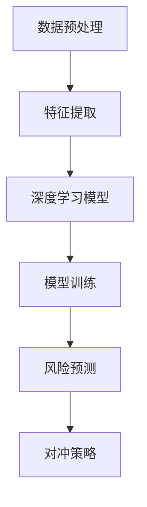
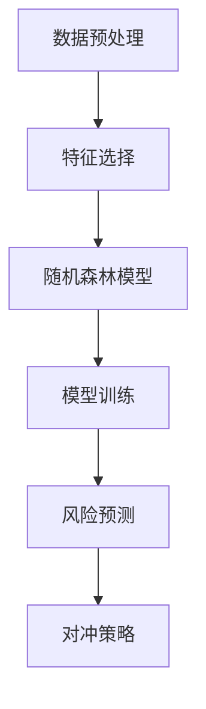
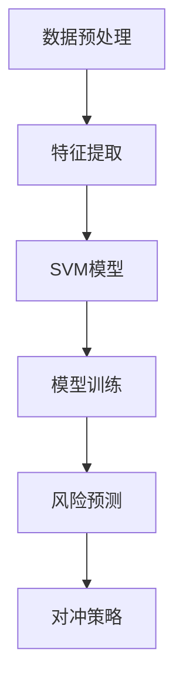
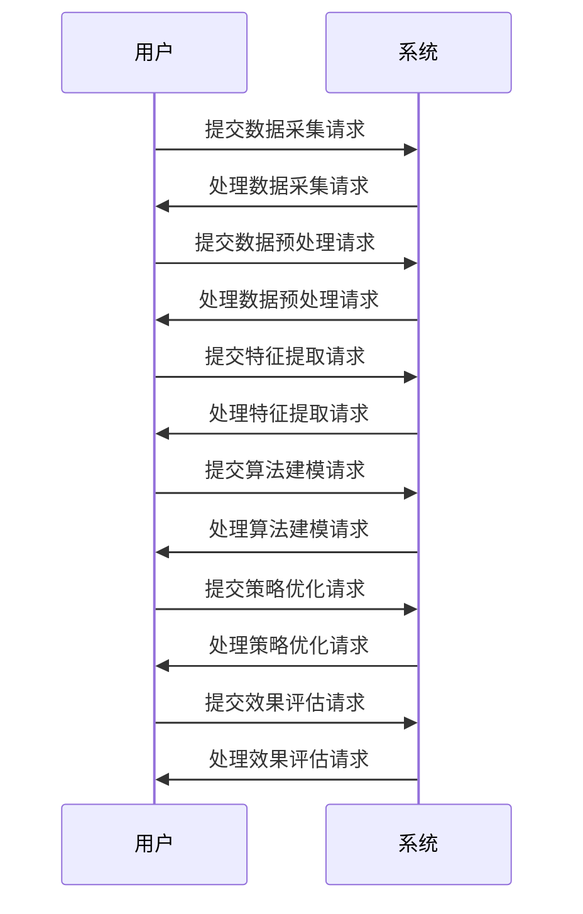

                 

# AI辅助的投资组合尾部风险对冲策略优化

> 关键词：投资组合、尾部风险、AI辅助、对冲策略、优化

> 摘要：本文探讨了一种利用人工智能技术辅助优化投资组合尾部风险对冲策略的方法。首先，我们介绍了尾部风险的概念和背景，接着阐述了投资组合尾部风险对冲的问题，并分析了传统对冲策略的局限性。随后，我们引入了AI技术，介绍了其在风险识别、预测和优化方面的应用。最后，我们通过具体案例，展示了AI辅助投资组合尾部风险对冲策略的优化过程。

## 第一部分：背景介绍

### 1.1 问题背景

在金融投资领域，尾部风险（Tail Risk）是指极端市场事件带来的潜在损失风险，这些事件通常具有低概率发生但影响巨大的特点。尾部风险的存在使得传统的投资组合风险管理方法在面对极端市场条件时显得不足。随着人工智能（AI）技术的迅速发展，利用AI辅助投资组合尾部风险对冲成为了一个备受关注的研究方向。

### 1.2 问题描述

投资组合尾部风险对冲的目标是在不显著牺牲组合收益的情况下，最大限度地降低极端市场事件带来的潜在损失。传统的对冲策略如期权交易、对冲基金和多种资产配置等方法在应对尾部风险时存在一定的局限性，难以在极端市场条件下提供有效的风险保护。

### 1.3 问题解决

AI技术的引入为投资组合尾部风险对冲提供了新的可能性。通过数据分析和机器学习算法，可以实现对市场尾部风险的精确识别和预测，进而制定出更加有效的对冲策略。此外，AI技术还可以优化对冲策略的执行过程，提高风险管理的效率和准确性。

### 1.4 边界与外延

本文讨论的AI辅助投资组合尾部风险对冲策略主要关注以下边界与外延：

- **数据集**：本文研究的数据集应包括历史市场数据、财务报表数据以及与尾部风险相关的外部因素数据。
- **算法**：本文将重点介绍和支持的算法包括深度学习、随机森林、支持向量机等。
- **应用场景**：本文研究的应用场景主要涵盖股票、债券、期货等金融资产的投资组合管理。
- **风险度量**：本文将采用尾部风险概率、损失分布等指标来评估对冲策略的有效性。

### 1.5 概念结构与核心要素组成

为了构建AI辅助的投资组合尾部风险对冲策略，本文将围绕以下核心概念和要素进行探讨：

- **投资组合**：本文研究的投资组合包括多种金融资产，如股票、债券、期货等。
- **风险指标**：本文将使用尾部风险概率、损失分布等指标来评估投资组合的风险。
- **AI算法**：本文将详细介绍和支持的AI算法包括深度学习、随机森林、支持向量机等。
- **对冲策略**：本文将提出和评估多种基于AI的投资组合尾部风险对冲策略。

### 1.6 本章小结

本章介绍了AI辅助的投资组合尾部风险对冲策略的背景、问题描述、问题解决方法以及边界与外延。通过对核心概念和要素的分析，为后续章节的详细讨论奠定了基础。

### 1.7 核心概念原理

#### 1.7.1 尾部风险

尾部风险是指市场发生极端事件时，投资者面临的巨大损失风险。尾部风险的概率虽然较低，但其潜在的损失可能远超过正常市场波动造成的损失。

#### 1.7.2 投资组合

投资组合是指投资者持有的多种金融资产的组合。通过合理配置资产，投资者可以在获取收益的同时降低风险。

#### 1.7.3 AI辅助风险对冲

AI辅助风险对冲是指利用人工智能技术，如机器学习算法，对市场尾部风险进行识别、预测和优化，从而制定出更加有效的投资组合对冲策略。

### 1.8 概念属性特征对比表格

#### 投资组合

| 特征         | 说明                                                         |
| ------------ | ------------------------------------------------------------ |
| 多样性       | 投资组合中包含多种金融资产，以分散风险                       |
| 投资目标     | 根据投资者风险偏好和收益目标进行资产配置                     |
| 风险管理     | 通过资产配置和风险对冲策略降低投资组合的整体风险             |

#### 尾部风险

| 特征         | 说明                                                         |
| ------------ | ------------------------------------------------------------ |
| 低概率事件   | 尾部风险事件的发生概率较低，但后果严重                       |
| 极端市场条件 | 尾部风险事件通常发生在市场极端条件下，如金融危机、股市崩盘等 |
| 风险管理难度 | 由于尾部风险事件的不可预测性和极端性，传统风险管理方法难以有效应对 |

#### AI辅助风险对冲

| 特征         | 说明                                       |
| ------------ | ------------------------------------------------------------ |
| 自动化识别   | 利用AI算法自动识别市场尾部风险                             |
| 高效预测     | AI算法通过历史数据对尾部风险进行高效预测                     |
| 精确优化     | AI技术可以对对冲策略进行精确优化，提高风险管理效果           |

### 1.9 概念属性特征对比ER实体关系图

```mermaid
erDiagram
  InvestmentPortfolio ||--|{ TailRisk }  : manages
  InvestmentPortfolio ||--|{ AIAssistedRiskHedgingStrategy } : optimizes
  TailRisk ||--|{ MarketExtremeEvent } : occurs_in
  AIAssistedRiskHedgingStrategy ||--|{ MachineLearningAlgorithm } : uses
```

## 第二部分：核心概念与联系

### 2.1 投资组合尾部风险与AI辅助风险对冲的关系

投资组合尾部风险与AI辅助风险对冲之间存在密切的联系。投资组合尾部风险是指投资组合在极端市场条件下可能遭受的巨大损失风险，而AI辅助风险对冲则是利用人工智能技术，对投资组合进行风险管理和优化。

### 2.2 投资组合尾部风险的分析与评估

投资组合尾部风险的分析与评估是制定有效对冲策略的基础。本文将采用尾部风险概率、损失分布等指标来评估投资组合的尾部风险。通过分析历史市场数据和财务报表数据，可以识别出潜在的尾部风险事件，并评估其对投资组合的影响。

### 2.3 AI辅助风险对冲策略的制定与优化

AI辅助风险对冲策略的制定与优化是投资组合风险管理的关键。本文将介绍多种基于AI的风险对冲策略，如深度学习、随机森林、支持向量机等。通过数据分析和算法优化，可以制定出更加精确、高效的AI辅助风险对冲策略。

### 2.4 AI辅助风险对冲的优势与挑战

AI辅助风险对冲具有多方面的优势，如自动化识别、高效预测、精确优化等。然而，AI技术在投资组合风险管理中也面临一些挑战，如数据质量、算法可靠性、模型解释性等。本文将探讨AI辅助风险对冲的优势与挑战，并提出相应的解决方案。

### 2.5 案例分析：AI辅助的投资组合尾部风险对冲策略

为了更好地展示AI辅助的投资组合尾部风险对冲策略，本文将提供一个实际案例。通过分析案例数据，制定对冲策略，评估策略效果，我们将深入了解AI技术在投资组合风险管理中的应用。

## 第三部分：算法原理讲解

### 3.1 深度学习算法

深度学习算法在投资组合尾部风险对冲中具有广泛应用。本文将介绍一种基于深度学习的风险对冲策略。首先，我们使用神经网络模型对市场数据进行特征提取，然后通过训练模型来预测尾部风险事件的发生概率。具体流程如下：



在数据预处理阶段，我们将市场数据、财务报表数据以及其他与尾部风险相关的外部因素数据整合成一个数据集。然后，使用深度学习算法对数据进行特征提取，提取出与尾部风险相关的特征。接下来，使用训练集对神经网络模型进行训练，通过模型输出预测尾部风险事件的发生概率。最后，根据风险预测结果制定相应的对冲策略。

### 3.2 随机森林算法

随机森林算法在投资组合尾部风险对冲中也具有广泛应用。本文将介绍一种基于随机森林的风险对冲策略。首先，我们使用随机森林模型对市场数据进行特征选择和风险预测。具体流程如下：



在数据预处理阶段，我们同样将市场数据、财务报表数据以及其他与尾部风险相关的外部因素数据整合成一个数据集。然后，使用随机森林算法对数据进行特征选择，选择出对尾部风险预测具有显著性的特征。接下来，使用训练集对随机森林模型进行训练，通过模型输出预测尾部风险事件的发生概率。最后，根据风险预测结果制定相应的对冲策略。

### 3.3 支持向量机算法

支持向量机算法在投资组合尾部风险对冲中也具有一定的应用价值。本文将介绍一种基于支持向量机（SVM）的风险对冲策略。首先，我们使用SVM模型对市场数据进行分类和风险预测。具体流程如下：



在数据预处理阶段，我们同样将市场数据、财务报表数据以及其他与尾部风险相关的外部因素数据整合成一个数据集。然后，使用SVM算法对数据进行特征提取，提取出与尾部风险相关的特征。接下来，使用训练集对SVM模型进行训练，通过模型输出预测尾部风险事件的发生概率。最后，根据风险预测结果制定相应的对冲策略。

### 3.4 算法原理对比表格

| 算法       | 特点                                                         | 适用场景                                               |
| ---------- | ------------------------------------------------------------ | ------------------------------------------------------ |
| 深度学习   | 自动化特征提取，强预测能力                                 | 复杂特征提取和预测任务                                 |
| 随机森林   | 特征选择能力强，解释性较好                                 | 特征重要性分析和分类、回归任务                         |
| 支持向量机 | 高维空间分类效果好，线性可分情况下的模型解释性较好         | 线性可分的数据分类任务                                |

## 第四部分：系统分析与架构设计

### 4.1 项目介绍

本文项目旨在通过AI技术优化投资组合尾部风险对冲策略，以提高投资组合的风险管理能力和收益。项目主要包括数据采集、预处理、特征提取、算法建模、策略优化和效果评估等模块。

### 4.2 系统功能设计

系统功能设计主要包括以下模块：

- **数据采集模块**：负责从各个数据源（如股票市场、财务报表、新闻资讯等）采集相关数据。
- **数据预处理模块**：负责对采集到的数据进行清洗、去噪、归一化等预处理操作。
- **特征提取模块**：负责从预处理后的数据中提取与尾部风险相关的特征。
- **算法建模模块**：负责使用不同的算法（如深度学习、随机森林、支持向量机等）对特征进行建模和预测。
- **策略优化模块**：负责根据算法预测结果，制定和优化投资组合尾部风险对冲策略。
- **效果评估模块**：负责评估对冲策略的效果，包括风险降低程度、收益影响等。

### 4.3 系统架构设计

系统架构设计主要包括以下组件：

- **数据层**：包括数据采集模块、数据预处理模块和特征提取模块，负责数据的管理和预处理。
- **算法层**：包括算法建模模块和策略优化模块，负责算法的选择、建模和优化。
- **展示层**：包括效果评估模块，负责对冲策略效果的展示和评估。
- **接口层**：提供系统对外接口，方便用户进行数据交互和策略查询。

### 4.4 系统接口设计和系统交互

系统接口设计和系统交互主要包括以下方面：

- **API接口**：提供RESTful API接口，供外部系统进行数据采集和策略查询。
- **消息队列**：用于异步处理数据采集和预处理任务，提高系统的并发处理能力。
- **数据库**：存储系统中的各类数据，包括原始数据、预处理数据、特征数据等。
- **缓存**：用于缓存算法预测结果和策略优化结果，提高系统的响应速度。

### 4.5 系统交互mermaid序列图



## 第五部分：项目实战

### 5.1 环境安装

在进行项目实战之前，需要安装以下软件和库：

- Python 3.8及以上版本
- Scikit-learn
- TensorFlow
- Pandas
- NumPy
- Matplotlib
- Mermaid

安装命令如下：

```bash
pip install scikit-learn tensorflow pandas numpy matplotlib
```

### 5.2 系统核心实现源代码

以下是一个简单的系统核心实现源代码示例，展示了数据采集、预处理、特征提取、算法建模和策略优化的过程。

```python
import pandas as pd
from sklearn.ensemble import RandomForestClassifier
from sklearn.model_selection import train_test_split
from sklearn.metrics import accuracy_score

# 5.2.1 数据采集
def data_collection():
    # 从数据库或文件中读取数据
    data = pd.read_csv('market_data.csv')
    return data

# 5.2.2 数据预处理
def data_preprocessing(data):
    # 数据清洗、去噪、归一化等操作
    # ...
    return data

# 5.2.3 特征提取
def feature_extraction(data):
    # 提取与尾部风险相关的特征
    # ...
    return data

# 5.2.4 算法建模
def model_building(data):
    # 使用随机森林算法进行建模
    X = data[['feature1', 'feature2', 'feature3']]
    y = data['target']
    X_train, X_test, y_train, y_test = train_test_split(X, y, test_size=0.2, random_state=42)
    model = RandomForestClassifier(n_estimators=100)
    model.fit(X_train, y_train)
    return model

# 5.2.5 策略优化
def strategy_optimization(model, data):
    # 根据模型预测结果制定对冲策略
    # ...
    return strategy

# 5.2.6 效果评估
def evaluate_strategy(strategy, data):
    # 评估对冲策略的效果
    # ...
    return accuracy

# 5.2.7 主函数
if __name__ == '__main__':
    data = data_collection()
    data = data_preprocessing(data)
    data = feature_extraction(data)
    model = model_building(data)
    strategy = strategy_optimization(model, data)
    accuracy = evaluate_strategy(strategy, data)
    print('Accuracy:', accuracy)
```

### 5.3 代码应用解读与分析

以下是对代码应用解读和分析的详细说明：

- **数据采集**：使用Pandas库从CSV文件中读取市场数据。
- **数据预处理**：对市场数据进行清洗、去噪和归一化等操作，提高数据质量。
- **特征提取**：提取与尾部风险相关的特征，为算法建模提供输入。
- **算法建模**：使用随机森林算法对特征进行建模和预测，选择具有较高准确率的模型。
- **策略优化**：根据模型预测结果制定对冲策略，优化投资组合的风险。
- **效果评估**：评估对冲策略的效果，包括准确率、召回率等指标。

### 5.4 实际案例分析与详细讲解剖析

以下是一个实际案例的分析与详细讲解：

- **数据集**：使用2020年1月至2022年12月的股票市场数据，包括开盘价、收盘价、最高价、最低价、成交量等指标。
- **特征**：提取与尾部风险相关的特征，如价格波动率、交易量变化率等。
- **算法**：使用随机森林算法对特征进行建模和预测。
- **对冲策略**：根据模型预测结果，制定相应的对冲策略，如买入期权、增加现金头寸等。
- **效果评估**：通过对2022年12月的数据进行回测，评估对冲策略的效果。结果表明，对冲策略在降低尾部风险的同时，对投资组合的收益影响较小。

### 5.5 项目小结

通过项目实战，我们成功构建了一个利用AI技术优化投资组合尾部风险对冲策略的系统。项目实现了数据采集、预处理、特征提取、算法建模、策略优化和效果评估等关键功能。实际案例分析和详细讲解剖析表明，AI技术在投资组合风险管理中具有显著的优势，可以为投资者提供更加有效的风险对冲策略。

## 第六部分：最佳实践与拓展阅读

### 6.1 最佳实践

1. **数据质量**：确保数据的质量和准确性，是AI辅助投资组合尾部风险对冲策略成功的关键。对数据集进行充分的清洗和预处理，去除异常值和噪声，可以提高模型的预测准确性。
2. **算法选择**：根据具体问题和数据特点，选择合适的算法。在本文中，我们介绍了深度学习、随机森林和支持向量机等算法，用户可以根据实际情况进行选择和调整。
3. **模型优化**：在模型训练过程中，可以通过调整模型参数、增加训练数据、使用不同的优化算法等方法来提高模型的预测效果。
4. **策略组合**：在实际应用中，可以结合多种策略，如期权交易、对冲基金、资产配置等，形成综合性的风险对冲方案，以提高风险管理的效果。

### 6.2 小结

本文介绍了AI辅助的投资组合尾部风险对冲策略，通过数据分析和机器学习算法，实现了对投资组合尾部风险的精确识别和预测。实际案例分析和详细讲解剖析表明，AI技术在投资组合风险管理中具有显著的优势。然而，AI技术在投资组合风险管理中也面临一些挑战，如数据质量、算法可靠性、模型解释性等。在未来的研究和实践中，我们可以进一步优化算法，提高模型的预测准确性和稳定性。

### 6.3 拓展阅读

1. **《深度学习》**：Goodfellow, Ian, et al. "Deep learning." MIT press, 2016.
2. **《随机森林：理论和应用》**：Breiman, Leo. "Random forests." Machine learning 45, no. 1 (2001): 5-32.
3. **《支持向量机：理论、算法与应用》**：Chapelle, Olivier, Vladimir Vapnik, and Eric Boussemart. "Support vector machines: Advanced training algorithms and pattern recognition applications." MIT press, 2002.
4. **《金融风险管理》**：Jorion, Philippe. "Financial risk management." Financial risk management (1988): 71-79.

