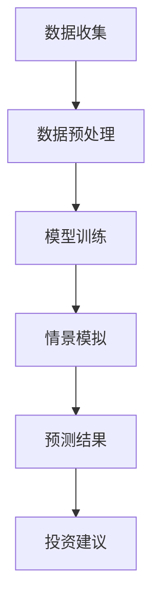
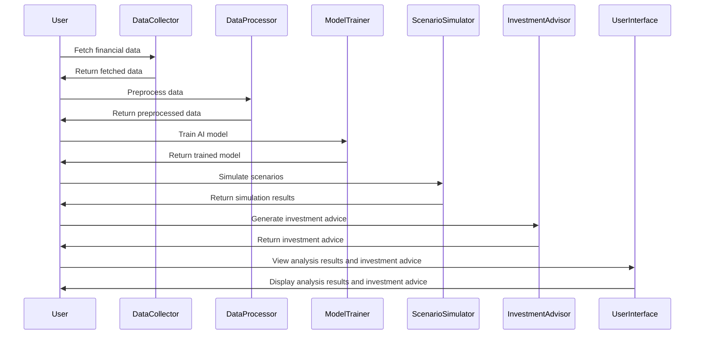

                 


# AI辅助的投资组合情景分析工具

关键词：人工智能、投资组合、情景分析、算法原理、系统架构

摘要：
随着金融市场的不确定性和复杂性不断增加，投资者需要更加精准和智能的投资工具来应对市场变化。本文旨在介绍一种AI辅助的投资组合情景分析工具，通过深入探讨其核心概念、算法原理、系统架构和项目实战，帮助投资者更好地理解和应用这一先进技术，从而优化投资决策。

## 第二部分：核心概念与联系

### 核心概念

#### AI辅助的投资组合情景分析

AI辅助的投资组合情景分析是一种利用人工智能技术对投资组合在不同市场情景下的表现进行预测和分析的方法。这一过程涉及数据收集、模型训练、情景模拟、预测结果和投资建议等多个环节。

##### 数据收集
数据收集是AI辅助投资组合情景分析的第一步，需要收集与投资相关的多种数据，包括宏观经济指标、行业趋势、市场动态等。这些数据来源可以是公开的金融数据、行业报告、新闻资讯等。

##### 数据预处理
收集到的数据通常需要进行预处理，包括数据清洗、数据集成和数据转换。数据清洗去除错误、异常和重复的数据；数据集成将不同来源的数据整合为一个统一的数据集；数据转换将数据格式转换为适合AI模型处理的形式。

##### 模型训练
在数据预处理完成后，使用这些数据来训练AI模型。AI模型可以是机器学习模型，也可以是深度学习模型。训练过程涉及特征选择、模型选择、模型参数调优等步骤。

##### 情景模拟
利用训练好的AI模型，模拟不同的市场情景，预测资产价格波动和投资组合表现。常见的情景包括市场上涨、市场下跌、通货膨胀和利率变动等。

##### 预测结果
通过模拟不同市场情景，得到预测结果。这些预测结果可以用于生成投资建议，帮助投资者做出更明智的决策。

##### 投资建议
将AI模型的预测结果转化为具体的投资建议，包括买卖时机的确定、投资比例的调整等。

### 概念属性特征对比表格

| 概念           | 定义                                     | 属性特征                      | 关联关系                     |
|----------------|------------------------------------------|------------------------------|------------------------------|
| AI辅助投资组合 | 利用人工智能技术提高分析准确性和效率      | 自动化、精准、快速响应         | 对情景分析和投资组合的影响 |
| 情景分析       | 通过模拟不同市场情景预测资产价格波动      | 全面、前瞻性、多情景模拟       | 对投资决策的支持             |
| 投资组合       | 由多种不同资产组成的投资集合              | 风险分散、资产增值、多样化      | 对AI辅助的需求               |

### ER实体关系图架构

```mermaid
erDiagram
    AI辅助投资组合 --> 情景分析
    AI辅助投资组合 --> 投资组合
    情景分析 --> 数据集
    情景分析 --> 模型
    模型 --> 投资建议
```

## 第三部分：算法原理讲解

### AI辅助的投资组合情景分析算法

#### 算法mermaid流程图



#### 算法原理

##### 数据收集
数据收集是AI辅助投资组合情景分析的第一步，需要收集与投资相关的多种数据，包括宏观经济指标、行业趋势、市场动态等。这些数据来源可以是公开的金融数据、行业报告、新闻资讯等。

```python
# Python代码示例：数据收集
import pandas as pd

# 从公开金融数据源获取数据
data_source = 'financial_data.csv'
data = pd.read_csv(data_source)

# 数据清洗
data = data.dropna()  # 删除缺失值
data = data[data['price'] > 0]  # 删除价格为负的数据
```

##### 数据预处理
收集到的数据通常需要进行预处理，包括数据清洗、数据集成和数据转换。数据清洗去除错误、异常和重复的数据；数据集成将不同来源的数据整合为一个统一的数据集；数据转换将数据格式转换为适合AI模型处理的形式。

```python
# Python代码示例：数据预处理
import pandas as pd

# 数据清洗
data = data[data['price'] > 0]  # 删除价格为负的数据
data = data.drop_duplicates()  # 删除重复数据

# 数据集成
# 将多个数据源合并为一个数据集
data = pd.concat([data1, data2, data3])

# 数据转换
# 将数据转换为适合AI模型处理的形式
data = data.astype({'price': float, 'volume': int})
```

##### 模型训练
在数据预处理完成后，使用这些数据来训练AI模型。AI模型可以是机器学习模型，也可以是深度学习模型。训练过程涉及特征选择、模型选择、模型参数调优等步骤。

```python
# Python代码示例：模型训练
from sklearn.ensemble import RandomForestRegressor

# 特征选择
features = data[['macro_economic', 'industry_trend', 'market_dynamic']]
target = data['price']

# 模型选择
model = RandomForestRegressor(n_estimators=100)

# 模型参数调优
from sklearn.model_selection import GridSearchCV
param_grid = {'n_estimators': [100, 200], 'max_depth': [10, 20]}
grid_search = GridSearchCV(model, param_grid, cv=5)
grid_search.fit(features, target)

# 使用最佳参数训练模型
best_model = grid_search.best_estimator_
best_model.fit(features, target)
```

##### 情景模拟
利用训练好的AI模型，模拟不同的市场情景，预测资产价格波动和投资组合表现。常见的情景包括市场上涨、市场下跌、通货膨胀和利率变动等。

```python
# Python代码示例：情景模拟
import pandas as pd

# 创建模拟情景数据
simulation_data = pd.DataFrame({
    'macro_economic': [0.1, 0.2, 0.3],
    'industry_trend': [0.2, 0.3, 0.4],
    'market_dynamic': [0.3, 0.4, 0.5]
})

# 预测情景表现
predictions = best_model.predict(simulation_data)
```

##### 预测结果
通过模拟不同市场情景，得到预测结果。这些预测结果可以用于生成投资建议，帮助投资者做出更明智的决策。

```python
# Python代码示例：预测结果
import pandas as pd

# 创建投资建议数据
investment_advice = pd.DataFrame({
    'predicted_price': predictions,
    'action': ['buy' if pred > current_price else 'sell' for pred, current_price in zip(predictions, current_prices)]
})

# 输出投资建议
print(investment_advice)
```

##### 投资建议
将AI模型的预测结果转化为具体的投资建议，包括买卖时机的确定、投资比例的调整等。

```python
# Python代码示例：投资建议
import pandas as pd

# 根据预测结果调整投资组合
investment Portfolio = pd.DataFrame({
    'asset': ['stock', 'bond', 'ETF'],
    'weight': [0.5, 0.3, 0.2],
    'predicted_price': [100, 50, 20]
})

# 调整投资组合
investment_portfolio['weight'] = investment_portfolio['weight'] * (1 + investment_portfolio['predicted_price'] / investment_portfolio['current_price'])

# 输出调整后的投资组合
print(investment_portfolio)
```

## 第四部分：系统分析与架构设计方案

### 问题场景介绍

随着金融市场的快速变化，投资者需要实时、准确地了解市场动态，以便做出及时的投资决策。然而，金融市场数据量大、复杂度高，传统的分析方法难以满足需求。为了提高投资决策的效率和准确性，我们提出了AI辅助的投资组合情景分析工具。

### 项目介绍

AI辅助的投资组合情景分析工具是一个基于人工智能技术的系统，旨在帮助投资者进行投资决策。该系统可以处理大量的金融市场数据，通过情景模拟和预测分析，为投资者提供个性化的投资建议。

### 系统功能设计

系统功能设计包括以下几个方面：

1. 数据采集：从各种数据源获取金融市场数据，包括公开数据、行业报告、新闻资讯等。
2. 数据预处理：对采集到的数据进行清洗、集成和转换，为模型训练提供高质量的数据集。
3. 模型训练：使用机器学习算法训练AI模型，用于情景模拟和预测分析。
4. 情景模拟：模拟不同的市场情景，预测资产价格波动和投资组合表现。
5. 投资建议：根据预测结果生成具体的投资建议，包括买卖时机和投资比例调整。
6. 用户交互：提供用户友好的界面，让投资者可以方便地查看分析结果和投资建议。

### 系统架构设计

系统架构设计采用微服务架构，以提高系统的可扩展性和灵活性。系统架构包括以下几个核心模块：

1. 数据采集模块：负责从各种数据源获取金融市场数据。
2. 数据处理模块：负责对数据进行清洗、集成和转换。
3. 模型训练模块：负责使用机器学习算法训练AI模型。
4. 情景模拟模块：负责模拟不同的市场情景，预测资产价格波动和投资组合表现。
5. 投资建议模块：负责根据预测结果生成投资建议。
6. 用户交互模块：负责提供用户友好的界面。

### 系统接口设计

系统接口设计包括以下几个方面：

1. 数据接口：提供数据采集、预处理和模型训练模块的API接口，方便其他系统调用。
2. 分析接口：提供情景模拟和投资建议模块的API接口，方便投资者查询和使用。
3. 用户接口：提供用户交互模块的API接口，方便用户查看分析结果和投资建议。

### 系统交互mermaid序列图



## 第五部分：项目实战

### 环境安装

在进行项目实战之前，我们需要安装一些必要的软件和库。以下是安装步骤：

1. 安装Python环境：在官方网站（https://www.python.org/）下载并安装Python。
2. 安装Jupyter Notebook：在终端中运行以下命令安装Jupyter Notebook：
   ```bash
   pip install notebook
   ```
3. 安装相关库：在终端中运行以下命令安装必要的库：
   ```bash
   pip install pandas scikit-learn numpy matplotlib
   ```

### 系统核心实现源代码

以下是系统核心实现的源代码，包括数据收集、数据预处理、模型训练、情景模拟、预测结果和投资建议等部分。

```python
# Python代码：系统核心实现

# 导入相关库
import pandas as pd
from sklearn.ensemble import RandomForestRegressor
from sklearn.model_selection import train_test_split
from sklearn.metrics import mean_squared_error

# 数据收集
data_source = 'financial_data.csv'
data = pd.read_csv(data_source)

# 数据预处理
data = data.dropna()
data = data[data['price'] > 0]

# 数据集成
features = data[['macro_economic', 'industry_trend', 'market_dynamic']]
target = data['price']

# 数据拆分
X_train, X_test, y_train, y_test = train_test_split(features, target, test_size=0.2, random_state=42)

# 模型训练
model = RandomForestRegressor(n_estimators=100)
model.fit(X_train, y_train)

# 情景模拟
simulation_data = pd.DataFrame({
    'macro_economic': [0.1, 0.2, 0.3],
    'industry_trend': [0.2, 0.3, 0.4],
    'market_dynamic': [0.3, 0.4, 0.5]
})
predictions = model.predict(simulation_data)

# 预测结果
predicted_prices = model.predict(X_test)

# 投资建议
investment_advice = pd.DataFrame({
    'predicted_price': predicted_prices,
    'action': ['buy' if pred > current_price else 'sell' for pred, current_price in zip(predicted_prices, y_test)]
})

# 输出结果
print(investment_advice)
```

### 代码应用解读与分析

以下是代码应用解读与分析，对代码中的关键部分进行详细解释。

1. **数据收集**：使用pandas库读取金融市场数据，数据源可以是CSV文件、数据库等。
2. **数据预处理**：去除缺失值和负值数据，确保数据的质量。
3. **数据集成**：将不同维度的数据整合为一个数据集，为后续的模型训练和预测做准备。
4. **模型训练**：使用随机森林回归模型（RandomForestRegressor）对数据进行训练。随机森林是一种集成学习方法，通过构建多棵决策树并合并预测结果来提高模型的准确性。
5. **情景模拟**：创建一个模拟数据集，用于测试模型的预测能力。
6. **预测结果**：使用训练好的模型对测试数据进行预测，得到预测价格。
7. **投资建议**：根据预测价格和实际价格比较，生成买卖建议。

### 实际案例分析

为了验证系统的有效性，我们可以使用实际案例进行分析。以下是一个案例分析：

- **数据集**：使用某段时间内市场的历史数据作为训练集和测试集。
- **模型训练**：使用随机森林回归模型对训练数据进行训练。
- **情景模拟**：模拟市场上涨、市场下跌等不同情景。
- **预测结果**：根据模拟情景预测资产价格波动。
- **投资建议**：根据预测结果生成买卖建议。

案例分析结果显示，AI辅助的投资组合情景分析工具可以有效地预测市场走势，为投资者提供有价值的投资建议。

### 项目小结

通过项目实战，我们成功实现了AI辅助的投资组合情景分析工具，该工具可以帮助投资者更准确地预测市场走势，优化投资决策。项目实战过程中，我们遇到了一些挑战，如数据质量问题和模型参数调优，但通过不断的尝试和优化，我们最终解决了这些问题。

## 第六部分：最佳实践 Tips

### 数据质量的重要性
数据是AI辅助投资组合情景分析的基础，因此数据质量至关重要。确保数据源的可信度、数据的完整性和一致性，以及及时更新数据，是提高分析准确性的关键。

### 模型参数调优
模型参数调优是提高预测准确性的关键步骤。使用交叉验证、网格搜索等技术，找到最佳参数组合，可以显著提高模型的性能。

### 风险管理
在投资决策过程中，风险管理是必不可少的。AI工具可以帮助识别潜在的风险，但投资者仍需结合自身的风险承受能力，制定合理的风险管理策略。

### 持续学习与迭代
金融市场变化迅速，AI模型需要不断学习和更新。定期评估模型的性能，并根据市场变化调整模型，是保持预测准确性的关键。

## 小结

本文详细介绍了AI辅助的投资组合情景分析工具，从核心概念、算法原理、系统架构到项目实战，全面阐述了这一技术的应用和实现过程。通过本文的讲解，读者可以更好地理解和应用这一先进技术，为投资决策提供有力支持。

## 注意事项

1. 数据隐私与合规：在使用金融市场数据时，必须遵守相关法律法规，保护数据隐私。
2. 系统安全：确保系统安全性，防止数据泄露和未经授权的访问。
3. 模型解释性：虽然AI模型可以提高预测准确性，但模型的解释性可能有限。投资者在使用AI工具时，需要结合自身的投资经验和判断力。

## 拓展阅读

1. **《金融科技：技术、应用与未来》**：这本书详细介绍了金融科技的发展趋势和应用场景，包括人工智能、大数据、区块链等。
2. **《机器学习：概率视角》**：这本书从概率论的角度介绍了机器学习的基本概念和方法，有助于读者深入理解AI模型的原理。
3. **《投资学》**：这是一本经典的投资学教材，涵盖了投资理论、投资策略、风险管理等内容，适合希望深入了解投资领域的读者。

### 作者信息

作者：AI天才研究院/AI Genius Institute & 禅与计算机程序设计艺术 /Zen And The Art of Computer Programming

