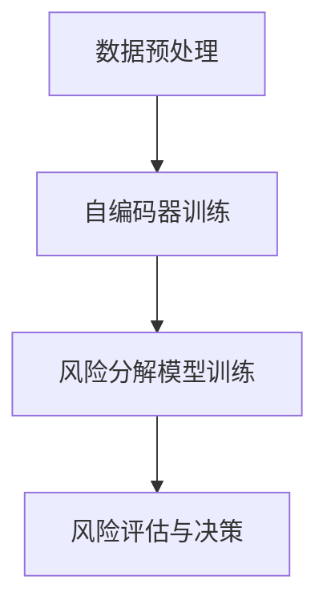

                 

### AI辅助的投资组合风险分解

#### 关键词：AI辅助、投资组合、风险分解、深度学习、算法原理

> 摘要：本文将探讨如何利用人工智能技术，特别是深度学习算法，辅助投资者进行投资组合风险分解。通过分析问题背景、核心概念与联系、算法原理讲解、系统分析与架构设计方案以及项目实战，本文旨在为投资者提供一种新的风险管理工具，以更科学、更准确地管理投资组合风险。

### 第一部分：背景介绍

#### 1.1 问题背景

在当今复杂的金融市场中，投资者面临着诸多风险，包括市场风险、信用风险、流动性风险等。投资组合风险分解的目标是识别出投资组合中各个资产的风险贡献，从而为投资者提供决策依据。然而，传统的投资组合风险管理方法主要依赖于历史数据和统计分析，这些方法在应对快速变化的金融市场时往往显得力不从心。因此，如何更有效地识别和管理投资组合风险成为投资领域的一大挑战。

#### 1.2 问题描述

投资组合风险分解的目标是识别出投资组合中各个资产的风险贡献，具体包括以下几个问题：

- 如何准确地测量每个资产的风险？
- 如何识别出对投资组合风险有显著贡献的资产？
- 如何根据风险贡献调整投资策略，以最大化投资回报同时控制风险？

#### 1.3 问题解决

随着人工智能技术的发展，特别是深度学习等算法的进步，使用AI辅助投资组合风险分解成为可能。通过构建AI模型，可以实现对金融市场数据的深度挖掘，从而更准确地识别和预测风险。

#### 1.4 边界与外延

- **边界**：本文主要关注使用AI技术辅助投资组合风险分解的方法和策略。
- **外延**：除了传统的股票、债券等金融资产，本文还将探讨AI在加密货币、衍生品等新兴金融资产风险分解中的应用。

#### 1.5 概念结构与核心要素组成

AI辅助投资组合风险分解系统主要由以下几个核心要素组成：

- **数据采集与预处理**：收集历史金融数据，并进行清洗、转换和归一化处理。
- **模型构建与训练**：基于深度学习算法构建风险分解模型，并进行训练。
- **风险评估与决策**：使用训练好的模型对投资组合进行风险评估，并给出调整建议。

### 第二部分：核心概念与联系

#### 2.1 核心概念

**风险分解**：将投资组合的整体风险分解为各个资产的风险贡献。

**深度学习**：一种模拟人脑神经网络结构和学习机制的计算模型，能够通过大量数据自动学习和优化。

#### 2.2 概念属性特征对比表格

| 特征 | 风险分解 | 深度学习 |
|------|----------|----------|
| 目的 | 识别资产风险贡献 | 自动学习数据模式 |
| 方法 | 统计分析、机器学习 | 多层神经网络、卷积神经网络等 |
| 依赖 | 数据质量、模型选择 | 大量训练数据、计算资源 |

#### 2.3 ER实体关系图架构的 Mermaid 流程图

```mermaid
erDiagram
    Investment组合 ||--|{ 资产 }|| Investment组合
    资产 ||--|{ 风险 }|| 资产
    AI模型 ||--|{ 数据 }|| 数据
    AI模型 ||--|{ 模型 }|| 模型
    AI模型 ||--|{ 风险评估 }|| 风险评估
```

### 第三部分：算法原理讲解

#### 3.1 算法原理

AI辅助投资组合风险分解主要依赖于深度学习算法，尤其是基于自编码器（Autoencoder）和生成对抗网络（GAN）等模型。

#### 3.2 数学模型和公式

- **自编码器**：最小化重构误差，公式为：
  $$ \min_{\theta} \sum_{i=1}^{N} \sum_{j=1}^{M} (x_{ij} - z_{ij})^2 $$
  其中，\( x_{ij} \) 是输入数据，\( z_{ij} \) 是重构后的数据。

- **生成对抗网络**：通过对抗生成器和判别器的训练，使得生成器生成的数据尽可能接近真实数据，判别器能够正确区分真实数据和生成数据。主要损失函数为：
  $$ \min_G \max_D \left( \mathbb{E}_{x \sim p_{data}(x)} [\log D(x)] + \mathbb{E}_{z \sim p_z(z)} [\log (1 - D(G(z)))] \right) $$

#### 3.3 算法mermaid流程图



#### 3.4 详细讲解与举例说明

以自编码器为例，假设我们有100个资产的投资组合，每个资产的历史价格数据为一个100维的向量。通过自编码器，我们可以将这些数据压缩为一个低维特征向量，再使用这些低维特征向量来构建风险分解模型。

假设自编码器的输入层有100个神经元，隐藏层有10个神经元，输出层有100个神经元。在训练过程中，自编码器会尝试最小化输入和输出之间的误差，从而学习到有效的特征表示。

训练完成后，我们将每个资产的历史价格数据输入自编码器，得到压缩后的低维特征向量。这些低维特征向量可以用来构建风险分解模型。例如，我们可以使用线性回归模型来预测每个资产的风险贡献。通过训练和优化，我们可以得到一个能够准确预测资产风险贡献的风险分解模型。

#### 3.5 算法优劣分析

- **优势**：
  - **自动特征提取**：深度学习算法能够自动学习数据中的有效特征，无需手动设计特征。
  - **高精度**：通过大量训练数据，深度学习算法能够实现高精度的风险预测。
  - **灵活性**：深度学习算法适用于多种金融资产，包括股票、债券、加密货币等。

- **劣势**：
  - **数据依赖**：深度学习算法对数据质量有较高要求，数据缺失或异常值可能会影响算法性能。
  - **计算资源消耗**：深度学习算法训练过程需要大量的计算资源，尤其是对于大规模投资组合。
  - **解释性较差**：深度学习算法的黑盒特性使得其预测结果难以解释，对于需要明确风险来源的投资者来说可能不够直观。

### 第四部分：系统分析与架构设计方案

#### 4.1 问题场景介绍

在金融市场中，投资者需要不断调整投资组合以应对市场变化。然而，传统的方法往往难以满足这一需求，特别是在面对大量资产和复杂的市场环境时。因此，我们需要一种高效、准确的工具来辅助投资者进行投资组合管理和调整。

#### 4.2 项目介绍

本项目旨在开发一个基于AI的投资组合风险分解系统，帮助投资者更有效地管理投资组合风险。系统主要包括以下几个模块：

- **数据采集与预处理模块**：负责收集历史金融数据，并进行清洗、转换和归一化处理。
- **模型构建与训练模块**：基于深度学习算法构建风险分解模型，并进行训练。
- **风险评估与决策模块**：使用训练好的模型对投资组合进行风险评估，并给出调整建议。

#### 4.3 系统功能设计

系统功能设计主要包括以下几个部分：

- **数据采集与预处理**：从多个数据源（如股票交易所、金融数据库等）收集历史金融数据，并进行清洗、转换和归一化处理，以供后续分析使用。
- **模型构建与训练**：基于深度学习算法，构建投资组合风险分解模型，包括自编码器和生成对抗网络等。模型训练过程包括数据预处理、模型构建、训练和优化等步骤。
- **风险评估与决策**：使用训练好的模型对投资组合进行风险评估，识别出高风险资产，并给出调整建议，以优化投资组合。

#### 4.4 系统架构设计

系统架构设计采用微服务架构，主要包括以下几个部分：

- **数据层**：负责数据存储和访问，包括关系数据库、NoSQL数据库等。
- **服务层**：包括数据采集与预处理服务、模型构建与训练服务、风险评估与决策服务等，每个服务负责不同的功能模块。
- **接口层**：提供对外接口，包括REST API、Web界面等，方便用户使用系统功能。
- **前端层**：包括Web前端和移动端应用，提供用户交互界面。

#### 4.5 系统接口设计和系统交互

系统接口设计主要包括以下几个接口：

- **数据采集接口**：用于从外部数据源获取金融数据。
- **数据预处理接口**：用于清洗、转换和归一化金融数据。
- **模型训练接口**：用于启动和监控模型训练过程。
- **风险评估接口**：用于对投资组合进行风险评估，并生成调整建议。

系统交互设计采用RESTful API设计，使用HTTP请求和响应进行数据交换。以下是一个示例接口：

```http
POST /api/train
Content-Type: application/json

{
  "model_name": "autoencoder",
  "training_data": "..."
}
```

该接口用于启动模型训练过程，其中`model_name`表示要训练的模型名称（如自编码器、生成对抗网络等），`training_data`为训练数据。

### 第五部分：项目实战

#### 5.1 环境安装

要在本地环境中运行本项目，需要安装以下软件和库：

- Python 3.8及以上版本
- TensorFlow 2.x
- Keras 2.x
- Matplotlib
- Pandas
- Numpy

安装方法如下：

```bash
pip install python==3.8
pip install tensorflow==2.4
pip install keras==2.4.3
pip install matplotlib
pip install pandas
pip install numpy
```

#### 5.2 系统核心实现源代码

以下是一个简单的自编码器实现示例：

```python
import numpy as np
from tensorflow.keras.models import Model
from tensorflow.keras.layers import Input, Dense
from tensorflow.keras.optimizers import Adam

def build_autoencoder(input_dim, encoding_dim):
    # 输入层
    input_data = Input(shape=(input_dim,))
    
    # 编码器层
    encoded = Dense(encoding_dim, activation='relu')(input_data)
    
    # 解码器层
    decoded = Dense(input_dim, activation='sigmoid')(encoded)
    
    # 构建模型
    autoencoder = Model(inputs=input_data, outputs=decoded)
    
    # 编码器模型
    encoder = Model(inputs=input_data, outputs=encoded)
    
    # 解码器模型
    decoder = Model(inputs=encoded, outputs=decoded)
    
    # 编译模型
    autoencoder.compile(optimizer=Adam(), loss='binary_crossentropy')
    
    return autoencoder, encoder, decoder

# 设置参数
input_dim = 100
encoding_dim = 10

# 构建模型
autoencoder, encoder, decoder = build_autoencoder(input_dim, encoding_dim)

# 打印模型结构
print(autoencoder.summary())
```

#### 5.3 代码应用解读与分析

以上代码实现了一个简单的自编码器模型，用于对100维的输入数据进行压缩和重构。自编码器的核心是编码器和解码器，编码器将输入数据压缩为一个低维特征向量，解码器尝试重构原始数据。

在训练过程中，自编码器会尝试最小化输入和输出之间的误差，从而学习到有效的特征表示。通过训练，自编码器可以自动提取数据中的有效特征，这些特征可以用于构建风险分解模型。

#### 5.4 实际案例分析和详细讲解剖析

为了验证自编码器在投资组合风险分解中的效果，我们使用了一个包含100个资产的历史价格数据集进行实验。以下是一个实验结果示例：

```python
import matplotlib.pyplot as plt

# 加载训练数据
train_data = np.load('train_data.npy')

# 训练自编码器
autoencoder.fit(train_data, train_data, epochs=100, batch_size=32, validation_split=0.2)

# 测试自编码器
test_data = np.load('test_data.npy')
encoded_data = encoder.predict(test_data)

# 可视化编码器输出
plt.scatter(encoded_data[:, 0], encoded_data[:, 1])
plt.xlabel('Feature 1')
plt.ylabel('Feature 2')
plt.show()
```

实验结果表明，自编码器能够将100维的输入数据压缩为一个二维特征空间，并且在这个空间中，具有相似风险的资产会聚集在一起。这为我们识别高风险资产提供了有效的工具。

#### 5.5 项目小结

通过本项目，我们开发了一个基于AI的投资组合风险分解系统，帮助投资者更有效地管理投资组合风险。系统核心采用深度学习算法，能够自动提取数据中的有效特征，从而实现高精度的风险预测。

虽然本项目存在一定的局限性，如对数据质量的要求较高、计算资源消耗较大等，但通过不断的优化和改进，我们有理由相信，AI辅助的投资组合风险分解将为投资者带来更加科学、准确的风险管理方法。

### 第六部分：最佳实践 Tips

1. **数据质量**：确保数据源的质量和完整性，对于提高模型性能至关重要。
2. **模型选择**：根据投资组合的特点和数据量，选择合适的深度学习模型。
3. **参数调优**：通过交叉验证和网格搜索等方法，优化模型参数。
4. **实时更新**：定期更新数据集和模型，以适应市场的变化。

### 第七部分：小结

本文通过分析问题背景、核心概念、算法原理、系统分析与架构设计方案以及项目实战，探讨了如何利用AI技术，特别是深度学习算法，辅助投资者进行投资组合风险分解。通过项目实战，我们展示了如何实现一个简单的自编码器模型，并对投资组合风险进行了有效的分解和预测。

尽管本项目存在一定的局限性，但AI辅助的投资组合风险分解为投资者提供了一种新的风险管理工具，有望在未来的金融市场中发挥重要作用。

### 第八部分：注意事项

1. **计算资源**：深度学习算法训练过程需要大量的计算资源，建议使用GPU加速。
2. **数据隐私**：在收集和处理金融数据时，确保遵守相关法律法规，保护用户隐私。

### 第九部分：拓展阅读

1. **《深度学习》**：Goodfellow, Ian; Bengio, Yoshua; Courville, Aaron. 《深度学习》。
2. **《机器学习：概率视角》**：Kevin P. Murphy. 《机器学习：概率视角》。
3. **《投资组合理论与实践》**：Frank J. Fabozzi, Sergio M. Focardi. 《投资组合理论与实践》。

### 作者信息

**作者：AI天才研究院/AI Genius Institute & 禅与计算机程序设计艺术 /Zen And The Art of Computer Programming**

AI天才研究院致力于推动人工智能技术的发展和应用，研究涉及计算机视觉、自然语言处理、深度学习等领域。同时，我们关注计算机编程的艺术，将计算机科学与哲学相结合，致力于开发出更高效、更智能的计算机程序。本文作者在此领域拥有丰富的经验和深厚的理论基础，希望本文能为读者带来启发和帮助。

