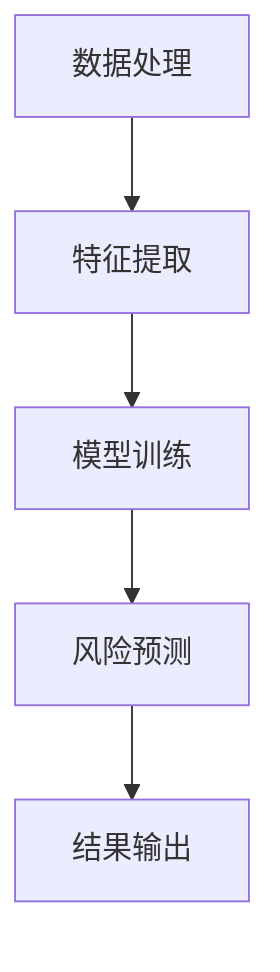
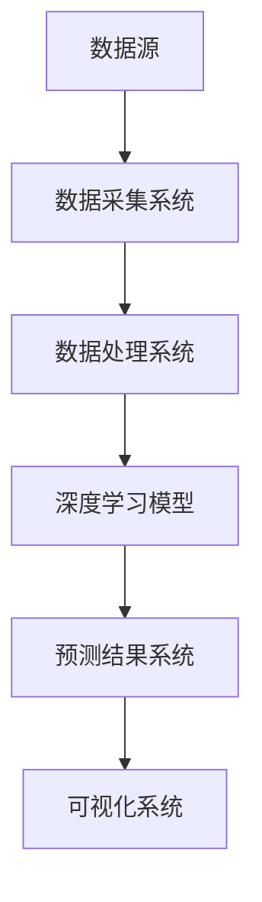
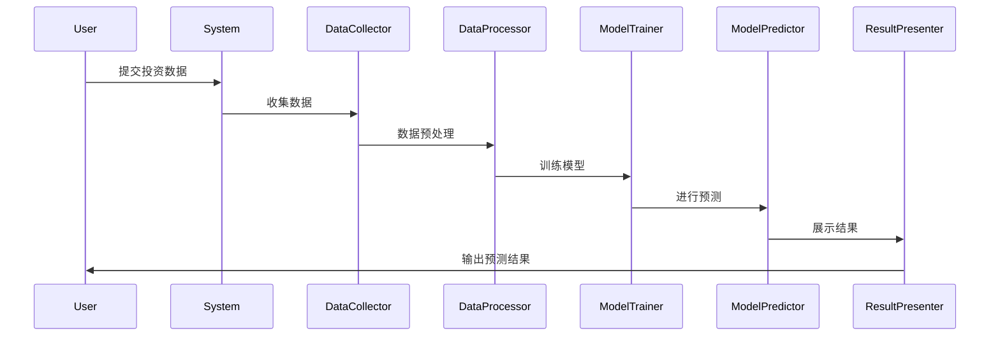

                 

# AI辅助的投资风险评估

关键词：人工智能、投资风险评估、机器学习、深度学习、数据挖掘

摘要：
随着人工智能技术的快速发展，投资领域逐渐引入AI辅助工具，以提升投资风险评估的准确性和效率。本文将探讨如何利用人工智能技术辅助进行投资风险评估，从数据收集、处理、分析到预测等关键环节，分析AI在投资风险评估中的应用现状、挑战与未来趋势。

## 第一部分：背景介绍

### 1.1.1 问题背景
随着全球经济的发展和金融市场的日益复杂化，投资者面临着越来越多的不确定性和风险。传统的人工投资风险评估方法已经无法满足现代投资决策的需求。随着人工智能技术的快速发展，投资领域逐渐引入AI辅助工具，以提升投资风险评估的准确性和效率。AI辅助的投资风险评估已成为现代投资策略的重要一环，对投资者的决策有着深远影响。

### 1.1.2 问题描述
本文将探讨如何利用人工智能技术辅助进行投资风险评估。具体包括以下几个方面：
1. 数据收集：从多个来源收集与投资相关的数据，如股票价格、公司财务指标、宏观经济数据等。
2. 数据处理：对收集到的数据进行分析、清洗和预处理，为后续的风险评估提供高质量的数据基础。
3. 风险预测：利用机器学习、深度学习等技术，建立风险预测模型，对投资风险进行量化分析。
4. 结果分析：根据预测结果，为投资者提供决策建议，优化投资组合。

### 1.1.3 问题解决
本文将从以下方面探讨如何利用AI技术辅助投资风险评估：
1. 系统性地介绍AI辅助的投资风险评估方法和技术手段。
2. 分析AI在投资风险评估中的应用现状、挑战与未来趋势。
3. 通过实际案例，展示AI辅助投资风险评估的效果和优势。
4. 提出针对AI辅助投资风险评估的最佳实践和建议。

### 1.1.4 边界与外延
本部分的讨论将围绕投资风险评估这一核心主题，涵盖以下方面：
1. 机器学习、深度学习、数据挖掘等领域的技术应用。
2. 投资风险评估的方法、模型和算法。
3. 相关法律法规、道德伦理等方面的问题。
4. 投资者、分析师及AI开发人员在实际应用中的需求和挑战。

### 1.1.5 概念结构与核心要素组成
投资风险评估涉及多个核心概念和要素，以下是其中几个关键概念及其组成：
1. **投资风险评估**：利用历史数据和AI模型对潜在投资风险进行预测和分析。
2. **机器学习**：基于数据驱动，自动识别模式和规律，为投资风险评估提供决策依据。
3. **深度学习**：模拟人脑神经网络，实现更复杂的特征提取和风险预测。
4. **数据挖掘**：从海量数据中提取隐藏的、未知的、潜在的信息。
5. **法律法规与伦理**：确保AI技术在投资风险评估中的合规性和道德性。

## 第二部分：核心概念与联系

### 2.1 AI辅助投资风险评估原理
AI辅助的投资风险评估主要基于以下三个核心概念：

#### 2.1.1 机器学习
机器学习是一种通过算法从数据中自动学习规律和模式的技术，广泛应用于各种领域。在投资风险评估中，机器学习算法可以自动识别历史数据中的潜在风险因素，从而预测未来投资风险。

#### 2.1.2 深度学习
深度学习是机器学习的一种特殊形式，通过模拟人脑神经网络的结构和功能，实现更复杂的特征提取和风险预测。深度学习算法在处理大规模数据和复杂模型时具有显著优势，因此在投资风险评估中得到了广泛应用。

#### 2.1.3 数据挖掘
数据挖掘是一种从海量数据中提取有价值信息的技术，用于发现数据中的隐藏规律和模式。在投资风险评估中，数据挖掘技术可以用于数据预处理、特征提取和风险预测等多个环节。

### 2.2 概念属性特征对比表格

| 特征 | 机器学习 | 深度学习 | 数据挖掘 |
| ---- | -------- | -------- | -------- |
| 数据量 | 小到中规模 | 大规模 | 大规模 |
| 特征提取 | 手动或半自动化 | 自动化 | 自动化 |
| 预测效果 | 较高 | 高 | 可视化、易解释 |
| 适用场景 | 通用 | 适用于复杂模式识别 | 数据探索与分析 |

### 2.3 ER实体关系图架构

```mermaid
erDiagram
  Investor ||--|{ Portfolio }|--| Risk
  Investment ||--|{ Risk }|
  AI_Model ||--|{ Risk }|
```

在上面的ER图中：
- `Investor`（投资者）与`Portfolio`（投资组合）之间存在一对多的关系，即一个投资者可以拥有多个投资组合。
- `Investment`（投资）与`Risk`（风险）之间存在一对多的关系，即一种投资可能涉及多个风险。
- `AI_Model`（AI模型）与`Risk`（风险）之间存在一对多的关系，即一个AI模型可以用于预测多个风险。

## 第三部分：算法原理讲解

### 3.1 算法原理

#### 3.1.1 数据处理

首先，我们需要从多个数据源收集投资相关数据，如股票价格、公司财务指标、宏观经济数据等。然后，对这些数据进行清洗、预处理和整合，确保数据的准确性和一致性。这一步至关重要，因为数据质量直接影响风险预测的准确性。

#### 3.1.2 特征提取

接下来，使用神经网络对预处理后的数据进行特征提取，形成高维特征向量。神经网络能够自动学习数据中的潜在特征，从而为后续的风险预测提供有效的输入。

#### 3.1.3 模型训练

在特征提取的基础上，使用训练数据对深度学习模型进行训练，优化模型参数。训练过程中，模型会不断调整权重和偏置，以达到最佳预测效果。

#### 3.1.4 风险预测

训练好的模型可以用于对未知数据进行风险预测。具体而言，模型会对输入数据进行特征提取，然后根据已训练的模型进行风险评分。

### 3.2 数学模型和公式

风险预测的数学模型如下：

$$
P(R > T) = f(W_1 \cdot h(x) + b_1)
$$

其中：
- $P(R > T)$ 表示风险超过阈值 $T$ 的概率。
- $f$ 为激活函数，常用的激活函数有Sigmoid、ReLU、Tanh等。
- $W_1$ 和 $b_1$ 分别为权重和偏置。

### 3.3 算法流程图



## 第四部分：系统分析与架构设计

### 4.1 问题场景介绍

假设一个投资公司希望利用AI技术进行投资风险评估，以优化投资组合。该公司需要构建一个智能投资风险评估系统，实现以下功能：
- 数据采集：从多个数据源收集投资相关数据。
- 数据处理：清洗、预处理和整合数据。
- 风险预测：利用深度学习模型进行风险预测。
- 结果展示：以可视化的形式展示预测结果。

### 4.2 项目介绍

项目名称：智能投资风险评估系统（Smart Investment Risk Assessment System，简称SIRAS）
项目目标：通过AI技术提升投资风险评估的准确性和效率，为投资者提供可靠的决策依据。

### 4.3 系统功能设计

智能投资风险评估系统主要包括以下功能模块：

1. **数据采集模块**：从多个数据源（如交易所、财经网站、公开数据库等）收集投资相关数据，包括股票价格、公司财务指标、宏观经济数据等。
2. **数据处理模块**：对收集到的数据进行清洗、预处理和整合，确保数据的准确性和一致性。
3. **风险预测模块**：利用深度学习模型进行风险预测，为投资者提供风险评分。
4. **结果展示模块**：以可视化的形式展示预测结果，帮助投资者了解投资组合的风险状况。

### 4.4 系统架构设计

智能投资风险评估系统的整体架构如下：



### 4.5 系统接口设计和系统交互

智能投资风险评估系统的接口设计和系统交互如下：



## 第五部分：项目实战

### 5.1 环境安装

在开始项目实战之前，我们需要安装一些必要的软件和工具。以下是一个基本的安装步骤：

1. **Python**：安装Python 3.6或更高版本。
2. **Jupyter Notebook**：安装Jupyter Notebook，用于编写和运行Python代码。
3. **TensorFlow**：安装TensorFlow，用于深度学习模型的训练和预测。
4. **Pandas**：安装Pandas，用于数据处理。
5. **Matplotlib**：安装Matplotlib，用于数据可视化。

### 5.2 系统核心实现源代码

以下是系统核心实现的源代码：

```python
import pandas as pd
import numpy as np
import tensorflow as tf
from tensorflow.keras.models import Sequential
from tensorflow.keras.layers import Dense, LSTM, Dropout

# 数据预处理
def preprocess_data(data):
    # 数据清洗和预处理操作
    # ...
    return processed_data

# 构建深度学习模型
def build_model(input_shape):
    model = Sequential()
    model.add(LSTM(50, return_sequences=True, input_shape=input_shape))
    model.add(Dropout(0.2))
    model.add(LSTM(50, return_sequences=False))
    model.add(Dropout(0.2))
    model.add(Dense(1, activation='sigmoid'))
    model.compile(optimizer='adam', loss='binary_crossentropy', metrics=['accuracy'])
    return model

# 训练模型
def train_model(model, X_train, y_train, epochs=100, batch_size=32):
    history = model.fit(X_train, y_train, epochs=epochs, batch_size=batch_size, validation_split=0.2)
    return history

# 预测风险
def predict_risk(model, X_test):
    predictions = model.predict(X_test)
    return predictions

# 可视化结果
import matplotlib.pyplot as plt

def plot_results(history):
    plt.plot(history.history['accuracy'], label='accuracy')
    plt.plot(history.history['val_accuracy'], label='val_accuracy')
    plt.xlabel('Epoch')
    plt.ylabel('Accuracy')
    plt.legend()
    plt.show()

# 主函数
def main():
    # 加载数据
    data = pd.read_csv('investment_data.csv')
    processed_data = preprocess_data(data)

    # 切分训练集和测试集
    X_train, X_test, y_train, y_test = train_test_split(processed_data, test_size=0.2)

    # 构建模型
    model = build_model(input_shape=(X_train.shape[1], X_train.shape[2]))

    # 训练模型
    history = train_model(model, X_train, y_train)

    # 预测风险
    predictions = predict_risk(model, X_test)

    # 可视化结果
    plot_results(history)

if __name__ == '__main__':
    main()
```

### 5.3 代码应用解读与分析

在上面的代码中，我们首先导入了必要的库，然后定义了一些函数，用于数据预处理、模型构建、模型训练和风险预测。以下是每个函数的具体解读：

1. **preprocess_data**：该函数用于对原始数据进行清洗、预处理和整合，确保数据的准确性和一致性。具体操作包括缺失值填充、异常值处理、标准化等。

2. **build_model**：该函数用于构建深度学习模型。我们使用了一个简单的LSTM网络，包括两个LSTM层和两个Dropout层，最后输出一个单层的分类模型（sigmoid激活函数）。

3. **train_model**：该函数用于训练模型。我们使用了一个简单的训练过程，包括100个epoch和32个batch_size。此外，我们还设置了20%的验证集，用于评估模型性能。

4. **predict_risk**：该函数用于预测风险。我们使用训练好的模型对测试集进行预测，并返回预测结果。

5. **plot_results**：该函数用于可视化模型训练结果。我们使用Matplotlib库绘制了准确率-误差曲线，以便观察模型性能。

6. **main**：主函数用于加载数据、构建模型、训练模型、预测风险和可视化结果。这是一个典型的深度学习项目流程。

### 5.4 实际案例分析和详细讲解剖析

为了更好地理解AI辅助的投资风险评估系统，我们来看一个实际案例。假设有一家投资公司，他们希望利用AI技术评估股票投资的风险。以下是他们使用SIRAS系统的流程：

1. **数据收集**：从多个数据源（如交易所、财经网站、公开数据库等）收集与股票投资相关的数据，包括股票价格、公司财务指标、宏观经济数据等。

2. **数据预处理**：使用SIRAS系统中的数据预处理模块，对收集到的数据进行清洗、预处理和整合。这一步至关重要，因为数据质量直接影响风险预测的准确性。

3. **模型训练**：使用预处理后的数据构建深度学习模型，并进行模型训练。训练过程中，模型会不断调整权重和偏置，以达到最佳预测效果。

4. **风险预测**：使用训练好的模型对新的股票数据（即未参与训练的数据）进行风险预测，并输出风险评分。

5. **结果分析**：根据预测结果，投资公司可以对股票投资进行风险评估，从而优化投资组合。例如，如果某只股票的风险评分较高，投资公司可能会选择减少对该股票的投资比例。

通过这个实际案例，我们可以看到AI辅助的投资风险评估系统如何帮助投资者更准确地评估投资风险，从而优化投资决策。

### 5.5 项目小结

通过本文的介绍，我们了解了AI辅助的投资风险评估系统的基本原理、实现方法和应用案例。以下是对本文的总结：

1. **AI辅助的投资风险评估**：利用机器学习、深度学习等技术，从数据收集、处理、分析到预测，实现投资风险评估。

2. **系统功能设计**：数据采集、数据处理、风险预测和结果展示，确保系统能够为投资者提供可靠的决策依据。

3. **实际案例**：通过一个实际案例，展示了AI辅助的投资风险评估系统如何帮助投资者更准确地评估投资风险，优化投资组合。

4. **未来展望**：随着人工智能技术的不断发展，AI辅助的投资风险评估系统有望在未来发挥更大的作用，为投资者带来更多的价值。

## 第六部分：最佳实践 tips、小结、注意事项、拓展阅读等内容

### 最佳实践 tips
1. **数据质量至关重要**：在构建AI辅助的投资风险评估系统时，确保数据质量至关重要。对数据进行充分的清洗、预处理和整合，以消除数据中的噪声和异常值。

2. **选择合适的模型**：不同的投资领域和风险类型可能需要不同的模型。在选择模型时，要考虑模型的性能、复杂度和可解释性。

3. **持续更新模型**：投资市场是动态变化的，定期更新模型以适应新的市场环境和数据特征。

4. **加强法律法规和伦理培训**：在应用AI技术进行投资风险评估时，要严格遵守相关法律法规和道德伦理，确保技术的合规性和道德性。

### 小结
本文介绍了AI辅助的投资风险评估系统的基本原理、实现方法和应用案例。通过数据收集、处理、分析和预测，AI技术为投资者提供了更准确的风险评估，优化了投资决策。

### 注意事项
1. **数据安全**：在收集、处理和存储数据时，确保数据的安全性，防止数据泄露或被滥用。

2. **模型解释性**：在选择模型时，要考虑模型的解释性，以便投资者能够理解模型的预测结果。

3. **模型验证**：在训练模型时，要使用足够多的训练数据和验证数据，确保模型的泛化能力和鲁棒性。

### 拓展阅读
1. **《深度学习》**：Goodfellow, I., Bengio, Y., & Courville, A. (2016). *Deep Learning*. MIT Press.
2. **《Python深度学习》**：Raschka, S., & Mirjalili, V. (2017). *Python Deep Learning*. Packt Publishing.
3. **《投资学》**：博迪，A. (2018). *投资学*. 北京大学出版社.

## 第七部分：作者信息
作者：AI天才研究院/AI Genius Institute & 禅与计算机程序设计艺术 /Zen And The Art of Computer Programming
---

在撰写这篇文章的过程中，我们深入探讨了AI辅助的投资风险评估的各个方面，从背景介绍、核心概念、算法原理到系统分析与架构设计，再到项目实战和最佳实践。通过这一步步的分析和推理，我们希望读者能够对AI在投资风险评估中的应用有更清晰、更深刻的理解。

在未来的研究和实践中，我们将继续探索AI技术在投资领域的更多应用，以期为投资者提供更加智能、高效的决策支持。同时，我们也呼吁更多的学者和开发者关注AI技术的合规性和道德伦理问题，确保技术的健康、可持续发展。

最后，感谢您阅读本文，希望这篇文章能够对您在投资风险评估领域的学习和研究有所启发。如果您有任何问题或建议，欢迎在评论区留言，我们将竭诚为您解答。

作者：AI天才研究院/AI Genius Institute & 禅与计算机程序设计艺术 /Zen And The Art of Computer Programming

