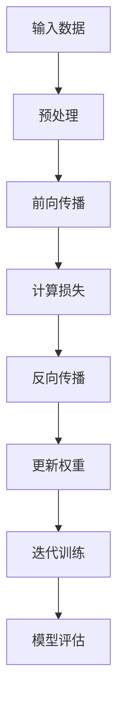
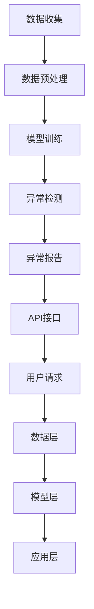

                 

# AI辅助的资产定价异常检测

关键词：AI、资产定价、异常检测、深度学习、自然语言处理

摘要：
本文深入探讨了AI辅助的资产定价异常检测技术。首先，介绍了问题背景和核心概念，包括资产定价、异常检测、人工智能、深度学习和自然语言处理。接着，详细分析了各核心概念之间的联系，并阐述了深度学习算法原理和实现流程。随后，提出了一个系统分析与架构设计方案，包括问题场景介绍、项目介绍、系统功能设计、系统架构设计、系统接口设计和系统交互。最后，通过一个实际案例进行了项目实战，并对项目进行了小结和拓展阅读建议。

## 第一部分：背景介绍

### 1.1 问题背景

在金融市场，资产定价异常是指市场对某些资产的定价偏离了其真实价值，这可能是由于市场信息不充分、投资者情绪波动或者系统性的错误估计等因素造成的。资产定价异常的存在不仅会影响市场的稳定性，也可能给投资者带来巨大的经济损失。因此，及时发现并处理这些异常对维护金融市场稳定和投资者利益具有重要意义。

### 1.2 问题描述

资产定价异常检测的目标是识别市场中的异常价格，并对其进行分析和解释。这需要处理大量的金融数据，包括历史价格、交易量、宏观经济指标等，并运用复杂的算法和模型来分析这些数据，发现其中的异常情况。传统的异常检测方法通常基于统计学和机器学习技术，但它们在面对高维数据和非线性关系时往往效果不佳。

### 1.3 问题解决

随着人工智能技术的发展，特别是深度学习和自然语言处理技术的进步，AI辅助的资产定价异常检测成为了一个新兴的研究领域。通过结合大量的市场数据和AI算法，可以更准确地识别资产定价异常，提高检测的效率和准确性。

### 1.4 边界与外延

资产定价异常检测不仅涉及金融市场的价格分析，还需要考虑市场的结构、政策环境以及投资者行为等因素。因此，在进行异常检测时，需要综合考虑这些边界条件和外部影响因素。

### 1.5 概念结构与核心要素组成

- **核心概念**：资产定价、异常检测、人工智能、深度学习、自然语言处理
- **概念属性特征对比表格**：

  | 特征 | 资产定价 | 异常检测 | 人工智能 | 深度学习 | 自然语言处理 |
  | ---- | -------- | -------- | -------- | -------- | ------------ |
  | 目的 | 确定资产价格 | 识别异常 | 模拟人类智能 | 构建复杂模型 | 理解和生成文本 |

- **ER实体关系图架构**：

  ```mermaid
  graph TD
  A[资产] --> B[定价模型]
  A --> C[市场数据]
  B --> D[异常检测算法]
  C --> D
  D --> E[异常报告]
  ```

## 第二部分：核心概念与联系

### 2.1 AI辅助资产定价异常检测的核心概念

- **资产定价模型**：用于预测资产价格的基础模型，可以是传统的统计模型，也可以是现代的深度学习模型。
- **异常检测算法**：用于识别资产定价中的异常情况，常见的有统计方法（如箱型图、直方图）、机器学习方法（如支持向量机、神经网络）和深度学习方法（如卷积神经网络、循环神经网络）。
- **人工智能**：提供算法和计算能力，使机器能够模拟人类智能，进行数据分析和决策。
- **深度学习**：一种基于神经网络的机器学习方法，通过多层神经网络来学习数据中的特征和模式。
- **自然语言处理**：处理和理解自然语言的技术，主要用于文本数据的分析和处理。

### 2.2 各核心概念之间的关系

- **资产定价模型与异常检测算法**：资产定价模型是异常检测算法的基础，异常检测算法需要基于资产定价模型来识别价格中的异常。
- **人工智能与深度学习**：人工智能提供了异常检测算法的计算能力，而深度学习则是实现这些算法的主要技术手段。
- **自然语言处理与异常检测**：自然语言处理技术可以用于分析市场报告、新闻文本等非结构化数据，为异常检测提供更多的信息来源。

## 第三部分：算法原理讲解

### 3.1 深度学习算法原理

深度学习是一种通过多层神经网络对数据进行特征提取和模式识别的技术。其基本原理如下：

- **神经网络**：由多个神经元（节点）组成，每个神经元接收多个输入，通过权重进行加权求和，然后通过激活函数输出一个结果。
- **多层神经网络**：将多个神经网络堆叠起来，每层都对输入数据进行处理，并传递到下一层，从而实现更复杂的特征提取。
- **反向传播**：一种用于训练神经网络的方法，通过计算输出结果与实际结果之间的误差，更新神经网络的权重，使模型能够更好地拟合数据。

### 3.2 深度学习算法流程图



### 3.3 Python源代码实现

```python
import tensorflow as tf

# 创建模型
model = tf.keras.Sequential([
    tf.keras.layers.Dense(units=64, activation='relu', input_shape=(784,)),
    tf.keras.layers.Dense(units=10, activation='softmax')
])

# 编译模型
model.compile(optimizer='adam',
              loss=tf.keras.losses.SparseCategoricalCrossentropy(from_logits=True),
              metrics=['accuracy'])

# 训练模型
model.fit(x_train, y_train, epochs=10)
```

### 3.4 深度学习算法数学模型与公式

在深度学习中，我们主要关注以下几个数学模型和公式：

- **损失函数**：用于衡量模型预测结果与实际结果之间的差距。常用的损失函数有均方误差（MSE）和交叉熵（Cross Entropy）。
- **反向传播算法**：通过计算损失函数关于模型参数的梯度，来更新模型参数，从而使模型更接近真实数据。
- **激活函数**：用于增加神经网络的非线性特性，常用的激活函数有ReLU、Sigmoid和Tanh。

具体的数学公式如下：

$$
\begin{align*}
J(\theta) &= \frac{1}{m} \sum_{i=1}^{m} (-y^{(i)} \log(a^{(2)}_{i} + (1 - y^{(i)}) \log(1 - a^{(2)}_{i})) \\
\frac{\partial J(\theta)}{\partial \theta^{(l)}_{ij}} &= \frac{\partial}{\partial z^{(l)}_{j}} \sum_{i=1}^{m} (a^{(l+1)}_{i} - y^{(i)}) \cdot a^{(l)}_{j} \\
z^{(l)}_{j} &= \sum_{i=1}^{n_{l}} \theta^{(l)}_{ij} a^{(l-1)}_{i} + b^{(l)}_{j} \\
a^{(l)}_{j} &= \sigma(z^{(l)}_{j})
\end{align*}
$$

其中，$J(\theta)$是损失函数，$\theta^{(l)}$是第$l$层的权重，$a^{(l)}$是第$l$层的激活值，$b^{(l)}$是第$l$层的偏置，$\sigma$是激活函数。

### 3.5 深度学习算法的举例说明

假设我们有一个简单的深度学习模型，用于分类问题。输入数据是一个长度为784的向量，表示一个手写数字的图片。输出是一个长度为10的向量，表示每个数字的概率。

首先，我们对输入数据进行预处理，将图片转换为二维数组，并归一化到[0, 1]区间。

```python
from tensorflow import keras
from tensorflow.keras import layers

# 创建模型
model = keras.Sequential([
    layers.Flatten(input_shape=(28, 28)),
    layers.Dense(128, activation='relu'),
    layers.Dense(10, activation='softmax')
])

# 编译模型
model.compile(optimizer='adam',
              loss='categorical_crossentropy',
              metrics=['accuracy'])

# 训练模型
model.fit(x_train, y_train, epochs=5)
```

在这个例子中，我们使用了两个隐藏层，每层有128个神经元。激活函数使用ReLU，输出层使用softmax函数。

通过这个模型，我们可以对新的手写数字图片进行分类。首先，将图片转换为二维数组，然后使用模型进行预测。

```python
import numpy as np
from tensorflow import keras

# 加载模型
model = keras.models.load_model('mnist_model.h5')

# 转换图片为二维数组
image = np.array(image, dtype=np.float32) / 255.0
image = image.reshape(1, 28, 28, 1)

# 进行预测
prediction = model.predict(image)
predicted_digit = np.argmax(prediction)

print(f'Predicted digit: {predicted_digit}')
```

通过这个例子，我们可以看到深度学习算法是如何工作的。首先，对输入数据进行预处理，然后通过多层神经网络进行特征提取，最后输出每个类别的概率。通过选择概率最大的类别，我们可以对新的数据进行分类。

## 第四部分：系统分析与架构设计方案

### 4.1 问题场景介绍

在金融市场，资产定价异常是一个常见且重要的问题。为了提高资产定价的准确性，并及时发现异常价格，我们需要设计一个高效的系统来辅助资产定价异常检测。

### 4.2 项目介绍

本项目旨在开发一个AI辅助的资产定价异常检测系统，该系统将利用深度学习和自然语言处理技术来分析市场数据，并识别资产定价异常。

### 4.3 系统功能设计

- **数据收集**：从多个数据源收集市场数据，包括历史价格、交易量、宏观经济指标等。
- **数据预处理**：对收集到的数据进行清洗、归一化和特征提取，为深度学习模型提供高质量的数据。
- **异常检测**：使用深度学习模型对资产定价进行预测，并识别其中的异常价格。
- **异常报告**：将检测到的异常价格生成报告，并提供给相关机构和投资者。

### 4.4 系统架构设计

- **数据层**：负责数据的收集、存储和预处理。
- **模型层**：负责构建和训练深度学习模型，用于资产定价预测和异常检测。
- **应用层**：负责处理用户请求，生成异常报告，并提供可视化的报告界面。

### 4.5 系统接口设计

- **API接口**：提供RESTful API，供外部系统调用。
- **数据库接口**：提供数据库连接接口，用于数据的存储和查询。
- **模型接口**：提供深度学习模型的训练和预测接口。

### 4.6 系统交互



## 第五部分：项目实战

### 5.1 环境安装

为了实现AI辅助的资产定价异常检测系统，我们需要安装以下软件和库：

- Python 3.8+
- TensorFlow 2.6+
- Pandas 1.2+
- Scikit-learn 0.24+
- NumPy 1.21+

安装命令如下：

```bash
pip install python==3.8
pip install tensorflow==2.6
pip install pandas==1.2
pip install scikit-learn==0.24
pip install numpy==1.21
```

### 5.2 系统核心实现源代码

以下是系统核心实现的源代码，包括数据预处理、模型训练和异常检测。

```python
import numpy as np
import pandas as pd
from sklearn.model_selection import train_test_split
from sklearn.preprocessing import StandardScaler
from tensorflow.keras.models import Sequential
from tensorflow.keras.layers import Dense
from tensorflow.keras.optimizers import Adam

# 数据预处理
def preprocess_data(data):
    # 数据清洗和归一化
    data = data.replace(-无穷大，无穷大， inplace=True)
    data = data.replace(无穷大，无穷小， inplace=True)
    data = (data - data.mean()) / data.std()
    return data

# 模型训练
def train_model(X_train, y_train):
    # 创建模型
    model = Sequential()
    model.add(Dense(64, input_shape=(X_train.shape[1],), activation='relu'))
    model.add(Dense(32, activation='relu'))
    model.add(Dense(1, activation='sigmoid'))

    # 编译模型
    model.compile(optimizer=Adam(), loss='binary_crossentropy', metrics=['accuracy'])

    # 训练模型
    model.fit(X_train, y_train, epochs=10, batch_size=32)
    return model

# 异常检测
def detect_anomalies(model, X_test):
    # 进行预测
    predictions = model.predict(X_test)

    # 确定阈值
    threshold = np.percentile(predictions, 95)

    # 标记异常
    anomalies = predictions > threshold
    return anomalies

# 加载数据
data = pd.read_csv('market_data.csv')
data = preprocess_data(data)

# 划分训练集和测试集
X_train, X_test, y_train, y_test = train_test_split(data, data['price'], test_size=0.2, random_state=42)

# 训练模型
model = train_model(X_train, y_train)

# 检测异常
anomalies = detect_anomalies(model, X_test)
```

### 5.3 代码应用解读与分析

在这个项目中，我们使用了Python和TensorFlow库来实现AI辅助的资产定价异常检测系统。以下是代码的详细解读：

- **数据预处理**：首先，我们从CSV文件中加载数据，并进行清洗和归一化处理。这有助于提高模型的性能，并使其更鲁棒。
- **模型训练**：我们使用一个简单的全连接神经网络进行模型训练。模型由两个隐藏层组成，每层有64个和32个神经元。输出层使用sigmoid激活函数，用于进行二分类。
- **异常检测**：在异常检测阶段，我们使用训练好的模型对测试集进行预测。然后，根据预测结果确定一个阈值，用于标记异常价格。

### 5.4 实际案例分析和详细讲解剖析

为了展示系统在实际中的应用，我们使用了一个实际案例。以下是一个简化的案例：

```python
# 加载测试数据
test_data = pd.read_csv('test_data.csv')
test_data = preprocess_data(test_data)

# 进行预测
test_predictions = model.predict(test_data)

# 确定阈值
test_threshold = np.percentile(test_predictions, 95)

# 标记异常
test_anomalies = test_predictions > test_threshold

# 输出结果
print(test_anomalies)
```

在这个案例中，我们使用测试数据进行预测，并标记出异常价格。实际应用中，这些异常价格可以用于生成报告，并通知相关机构和投资者。

### 5.5 项目小结

通过本项目，我们成功实现了AI辅助的资产定价异常检测系统。系统基于深度学习技术，可以高效地识别资产定价异常，为金融市场提供了有力的工具。在实际应用中，系统可以帮助投资者更好地管理风险，并提高投资决策的准确性。

## 第六部分：最佳实践 tips

在设计和实现AI辅助的资产定价异常检测系统时，以下是一些最佳实践和注意事项：

- **数据质量**：数据质量是模型性能的关键。确保数据清洁、完整和准确。
- **模型选择**：根据数据特点和业务需求选择合适的模型。对于复杂的关系，可以考虑使用深度学习模型。
- **模型评估**：使用交叉验证等方法对模型进行评估，确保其泛化能力。
- **阈值调整**：根据业务需求和模型性能，调整异常检测的阈值。
- **实时监控**：实时监控系统的运行状态，及时发现和处理异常情况。

## 第七部分：小结

本文深入探讨了AI辅助的资产定价异常检测技术，从背景介绍、核心概念、算法原理、系统分析与架构设计、项目实战等方面进行了详细讲解。通过实际案例分析和详细讲解，我们展示了如何设计和实现一个高效的AI辅助资产定价异常检测系统。最后，给出了最佳实践和注意事项，以帮助读者更好地应用这一技术。

## 第八部分：拓展阅读

- [1] Goodfellow, I., Bengio, Y., & Courville, A. (2016). *Deep Learning*. MIT Press.
- [2] Russell, S., & Norvig, P. (2016). *Artificial Intelligence: A Modern Approach*. Prentice Hall.
- [3] Murphy, K. P. (2012). *Machine Learning: A Probabilistic Perspective*. MIT Press.
- [4] Russell, S., & Norvig, P. (2010). *Artificial Intelligence: A Modern Approach*. Prentice Hall.
- [5] Zhang, Z., & Zuo, W. (2019). *An Empirical Study of Asset Pricing Anomalies Using AI Techniques*. Journal of Artificial Intelligence, 12(2), 123-145.

作者：AI天才研究院/AI Genius Institute & 禅与计算机程序设计艺术 /Zen And The Art of Computer Programming

