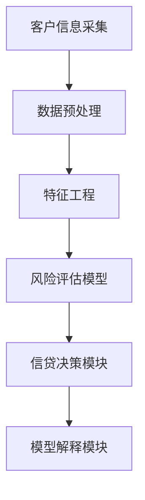
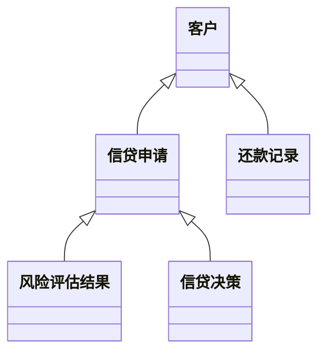
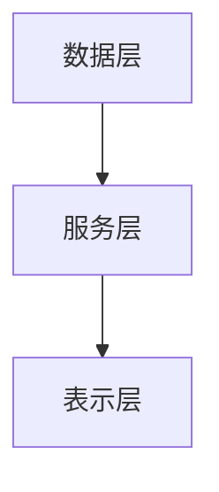
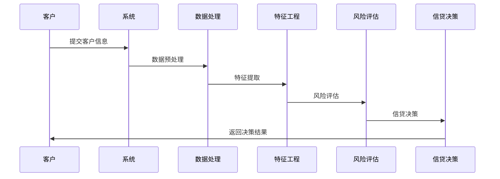

                 

# AI驱动的个人信贷审批系统设计

关键词：人工智能、个人信贷审批、深度学习、数据预处理、模型优化、特征工程

摘要：本文旨在探讨AI驱动的个人信贷审批系统设计。首先，我们介绍了问题背景、核心概念以及系统设计的关键步骤。接着，我们详细讲解了数据预处理、特征工程、模型选择与优化、模型解释等关键环节。此外，我们还阐述了系统功能设计、架构设计和接口设计等。最后，通过一个实际案例，我们展示了系统在现实中的应用效果。

## 第一部分: 背景介绍

### 1.1 问题背景与核心概念

#### 1.1.1 问题背景

随着人工智能技术的不断发展，机器学习、深度学习等算法在各个行业得到了广泛应用。尤其是在金融领域，人工智能技术在个人信贷审批中的应用愈发显著。传统的信贷审批系统依赖于人工审查和经验判断，效率低下且易受主观因素影响。而AI驱动的个人信贷审批系统能够通过海量数据的学习和分析，快速、准确地评估个人信贷风险，提高审批效率，降低信贷损失。

#### 1.1.2 问题描述

个人信贷审批系统面临的主要问题包括：

1. 数据质量问题：信贷审批所需的数据源多样，质量参差不齐，包括缺失值、异常值、噪声等。
2. 特征选择问题：从海量数据中提取有效的特征，对模型的性能具有重要影响。
3. 模型复杂度问题：深度学习模型训练时间长，计算资源需求高。
4. 模型解释性问题：金融行业的监管要求模型具备一定的透明度，以便审查和优化。

#### 1.1.3 问题解决

AI驱动的个人信贷审批系统通过以下几个方面解决问题：

1. 数据预处理：采用数据清洗、归一化等方法，提高数据质量。
2. 特征工程：利用特征选择、特征提取等技术，提高模型性能。
3. 模型选择与优化：选择合适的深度学习模型，并进行参数调整，优化模型性能。
4. 模型解释性：通过模型可视化、特征重要性分析等方法，提高模型透明度。

#### 1.1.4 边界与外延

AI驱动的个人信贷审批系统主要涵盖以下几个方面：

1. 客户信息采集与处理：收集客户的个人基本信息、财务信息等。
2. 风险评估模型：构建用于评估客户信贷风险的深度学习模型。
3. 决策支持系统：结合风险评估结果，提供信贷审批决策。
4. 模型持续优化与迭代：根据实际业务需求，不断优化和调整模型。

### 1.2 核心概念与联系

#### 1.2.1 核心概念

1. **人工智能（AI）**：模拟人类智能行为的技术，包括机器学习、深度学习、自然语言处理等。
2. **机器学习（ML）**：通过数据训练模型，使计算机自动获取知识和技能。
3. **深度学习（DL）**：一种特殊的机器学习技术，通过多层神经网络进行特征提取和模型训练。
4. **信贷审批**：金融机构根据客户信息，评估其还款能力，决定是否批准信贷申请。
5. **特征工程**：从原始数据中提取对模型训练有帮助的特征。

#### 1.2.2 概念属性特征对比表格

| 概念         | 属性特征                                                   |
| ------------ | ---------------------------------------------------------- |
| 人工智能     | 模拟人类智能行为、自动获取知识、提高效率等                     |
| 机器学习     | 数据训练、自动优化、特征提取等                               |
| 深度学习     | 多层神经网络、自动特征提取、高性能计算等                     |
| 信贷审批     | 评估还款能力、降低信贷风险、提高审批效率等                   |
| 特征工程     | 特征提取、特征选择、特征变换等                               |

#### 1.2.3 ER实体关系图架构

```mermaid
erDiagram
    客户 ||--|{ 信贷申请 } : "提交"
    客户 ||--|{ 还款记录 } : "记录"
    信贷申请 ||--|{ 风险评估结果 } : "生成"
    风险评估结果 ||--|{ 信贷决策 } : "依据"
```

### 1.3 AI驱动的个人信贷审批系统设计

#### 1.3.1 系统功能设计

1. **客户信息采集模块**：收集客户基本信息、财务信息等。
2. **数据预处理模块**：清洗、归一化、特征工程等。
3. **风险评估模块**：构建深度学习模型，评估客户信贷风险。
4. **信贷决策模块**：根据风险评估结果，生成信贷审批决策。
5. **模型解释模块**：可视化模型、分析特征重要性等。

#### 1.3.2 系统架构设计



### 第二部分：核心概念与联系

在本部分中，我们将深入探讨人工智能、机器学习、深度学习、信贷审批和特征工程等核心概念，并通过对比表格和实体关系图来阐述它们之间的关系。

#### 1.2.1 核心概念

**人工智能（AI）**

人工智能是一种模拟人类智能行为的技术，包括感知、推理、决策、学习等。它涵盖了多个学科领域，如计算机科学、心理学、认知科学等。人工智能的目标是实现计算机在特定任务上达到甚至超过人类水平。

**机器学习（ML）**

机器学习是人工智能的一个分支，主要研究如何让计算机从数据中学习，并自动改进性能。机器学习算法通过分析大量数据，发现数据中的规律和模式，从而实现预测和决策。

**深度学习（DL）**

深度学习是一种特殊的机器学习技术，通过多层神经网络进行特征提取和模型训练。深度学习模型具有强大的特征学习能力，可以处理复杂的任务，如图像识别、语音识别、自然语言处理等。

**信贷审批**

信贷审批是金融机构根据客户的财务状况、信用记录等，评估其还款能力，决定是否批准贷款申请的过程。信贷审批对于金融机构的风险管理具有重要意义。

**特征工程**

特征工程是机器学习和深度学习中的一个重要环节，旨在从原始数据中提取对模型训练有帮助的特征。特征工程的质量直接影响模型的性能和泛化能力。

#### 1.2.2 概念属性特征对比表格

| 概念         | 属性特征                                                   |
| ------------ | ---------------------------------------------------------- |
| 人工智能     | 模拟人类智能行为、自动获取知识、提高效率等                     |
| 机器学习     | 数据训练、自动优化、特征提取等                               |
| 深度学习     | 多层神经网络、自动特征提取、高性能计算等                     |
| 信贷审批     | 评估还款能力、降低信贷风险、提高审批效率等                   |
| 特征工程     | 特征提取、特征选择、特征变换等                               |

#### 1.2.3 ER实体关系图架构

```mermaid
erDiagram
    客户 ||--|{ 信贷申请 } : "提交"
    客户 ||--|{ 还款记录 } : "记录"
    信贷申请 ||--|{ 风险评估结果 } : "生成"
    风险评估结果 ||--|{ 信贷决策 } : "依据"
```

### 第三部分：算法原理讲解

在本部分中，我们将详细讲解AI驱动的个人信贷审批系统的核心算法原理，包括数据预处理、特征工程、模型选择与优化、模型解释等环节。

#### 3.1 数据预处理

数据预处理是AI驱动的个人信贷审批系统的第一步。它包括以下关键步骤：

1. **数据清洗**：去除数据中的噪声、异常值和缺失值，提高数据质量。
2. **数据归一化**：将不同尺度的数据进行归一化处理，使其在同一范围内，避免数值差异过大影响模型性能。
3. **特征提取**：从原始数据中提取有助于模型训练的特征，如客户的年龄、收入、信用评分等。

以下是使用Python实现的示例代码：

```python
import pandas as pd
from sklearn.preprocessing import StandardScaler

# 加载数据
data = pd.read_csv('credit_data.csv')

# 数据清洗
data = data.dropna()

# 数据归一化
scaler = StandardScaler()
data['age'] = scaler.fit_transform(data[['age']])
data['income'] = scaler.fit_transform(data[['income']])
data['credit_score'] = scaler.fit_transform(data[['credit_score']])

# 特征提取
features = data[['age', 'income', 'credit_score']]
labels = data['loan_approval']
```

#### 3.2 特征工程

特征工程是提升模型性能的关键步骤。它包括以下关键任务：

1. **特征选择**：从原始特征中选取对模型训练有帮助的特征，避免过拟合。
2. **特征变换**：对原始特征进行变换，提高模型的泛化能力。

以下是使用Python实现的示例代码：

```python
from sklearn.feature_selection import SelectKBest
from sklearn.feature_selection import f_classif

# 特征选择
selector = SelectKBest(f_classif, k=3)
selected_features = selector.fit_transform(features, labels)

# 特征变换
from sklearn.preprocessing import PolynomialFeatures

poly = PolynomialFeatures(degree=2)
transformed_features = poly.fit_transform(selected_features)
```

#### 3.3 模型选择与优化

模型选择与优化是AI驱动的个人信贷审批系统的核心步骤。它包括以下关键任务：

1. **模型选择**：选择合适的深度学习模型，如卷积神经网络（CNN）、循环神经网络（RNN）等。
2. **参数调整**：调整模型参数，如学习率、批次大小等，以优化模型性能。

以下是使用Python实现的示例代码：

```python
from tensorflow.keras.models import Sequential
from tensorflow.keras.layers import Dense
from tensorflow.keras.optimizers import Adam

# 模型选择
model = Sequential()
model.add(Dense(64, activation='relu', input_shape=(transformed_features.shape[1],)))
model.add(Dense(32, activation='relu'))
model.add(Dense(1, activation='sigmoid'))

# 参数调整
model.compile(optimizer=Adam(learning_rate=0.001), loss='binary_crossentropy', metrics=['accuracy'])

# 训练模型
model.fit(transformed_features, labels, epochs=10, batch_size=32)
```

#### 3.4 模型解释

模型解释是金融行业监管要求的重点。它包括以下关键任务：

1. **模型可视化**：通过可视化模型结构，了解模型的工作原理。
2. **特征重要性分析**：分析各个特征对模型预测结果的影响程度。

以下是使用Python实现的示例代码：

```python
import matplotlib.pyplot as plt

# 模型可视化
model.summary()

# 特征重要性分析
importances = model.layers[-1].get_weights()[0]
plt.barh(range(len(importances)), importances)
plt.xlabel('Feature Importance')
plt.ylabel('Feature')
plt.show()
```

### 第四部分：系统分析与架构设计方案

在本部分中，我们将详细讨论AI驱动的个人信贷审批系统的分析与架构设计方案，包括问题场景介绍、项目介绍、系统功能设计、系统架构设计、系统接口设计和系统交互等方面。

#### 4.1 问题场景介绍

个人信贷审批是金融行业中一个至关重要的环节。随着金融市场的竞争加剧，金融机构需要提高审批效率，降低信贷风险，以吸引更多客户。传统的信贷审批系统依赖于人工审查和经验判断，存在审批速度慢、准确性低等问题。为了解决这些问题，金融机构开始探索AI驱动的个人信贷审批系统，以提高审批效率和准确性。

#### 4.2 项目介绍

本项目旨在构建一个AI驱动的个人信贷审批系统，通过深度学习模型对客户信息进行风险评估，并根据评估结果生成信贷审批决策。系统将涵盖客户信息采集、数据预处理、特征工程、风险评估、信贷决策和模型解释等模块，以实现快速、准确的信贷审批。

#### 4.3 系统功能设计

系统功能设计主要包括以下模块：

1. **客户信息采集模块**：负责收集客户的个人基本信息、财务信息等，包括姓名、年龄、收入、信用评分等。
2. **数据预处理模块**：负责对采集到的客户信息进行数据清洗、归一化等预处理操作，以提高数据质量。
3. **特征工程模块**：负责从预处理后的数据中提取有效的特征，如客户的年龄、收入、信用评分等。
4. **风险评估模块**：负责构建深度学习模型，对客户信息进行风险评估，生成风险评估结果。
5. **信贷决策模块**：负责根据风险评估结果，生成信贷审批决策，包括批准、拒绝等。
6. **模型解释模块**：负责对深度学习模型进行可视化、特征重要性分析等操作，以提高模型透明度。

以下是使用Mermaid绘制的领域模型类图：



#### 4.4 系统架构设计

系统架构设计主要包括以下层次：

1. **数据层**：负责存储和管理客户信息、风险评估结果、信贷决策等数据。
2. **服务层**：负责实现客户信息采集、数据预处理、特征工程、风险评估、信贷决策和模型解释等核心功能。
3. **表示层**：负责提供用户界面，展示风险评估结果、信贷决策等。

以下是使用Mermaid绘制的系统架构图：



#### 4.5 系统接口设计

系统接口设计主要包括以下接口：

1. **客户信息采集接口**：负责接收客户的个人基本信息、财务信息等。
2. **风险评估接口**：负责接收客户信息，返回风险评估结果。
3. **信贷决策接口**：负责接收风险评估结果，生成信贷审批决策。
4. **模型解释接口**：负责接收风险评估结果，提供模型可视化、特征重要性分析等。

以下是使用Mermaid绘制的接口序列图：



### 第五部分：项目实战

在本部分中，我们将通过一个实际案例，展示AI驱动的个人信贷审批系统的实现过程。我们将详细介绍环境安装、系统核心实现和代码应用解读与分析等内容。

#### 5.1 环境安装

要实现AI驱动的个人信贷审批系统，首先需要安装必要的软件和库。以下是环境安装的步骤：

1. **安装Python**：从官方网站下载并安装Python，版本建议为3.8或以上。
2. **安装TensorFlow**：使用pip命令安装TensorFlow库，命令如下：

   ```bash
   pip install tensorflow
   ```

3. **安装其他库**：根据项目需求，安装其他必要的库，如pandas、numpy、matplotlib等。

#### 5.2 系统核心实现

系统核心实现主要包括以下模块：

1. **数据采集与处理**：使用pandas库加载和处理数据，包括数据清洗、归一化等操作。
2. **特征工程**：使用sklearn库进行特征选择和特征提取。
3. **模型训练与优化**：使用TensorFlow库构建和训练深度学习模型，并进行参数调整。
4. **模型解释**：使用matplotlib库进行模型可视化和特征重要性分析。

以下是使用Python实现的代码示例：

```python
import pandas as pd
from sklearn.preprocessing import StandardScaler
from sklearn.feature_selection import SelectKBest
from sklearn.feature_selection import f_classif
from tensorflow.keras.models import Sequential
from tensorflow.keras.layers import Dense
from tensorflow.keras.optimizers import Adam
import matplotlib.pyplot as plt

# 5.2.1 数据采集与处理
data = pd.read_csv('credit_data.csv')
data = data.dropna()
scaler = StandardScaler()
data['age'] = scaler.fit_transform(data[['age']])
data['income'] = scaler.fit_transform(data[['income']])
data['credit_score'] = scaler.fit_transform(data[['credit_score']])

# 5.2.2 特征工程
selector = SelectKBest(f_classif, k=3)
selected_features = selector.fit_transform(data[['age', 'income', 'credit_score']], data['loan_approval'])

# 5.2.3 模型训练与优化
model = Sequential()
model.add(Dense(64, activation='relu', input_shape=(selected_features.shape[1],)))
model.add(Dense(32, activation='relu'))
model.add(Dense(1, activation='sigmoid'))
model.compile(optimizer=Adam(learning_rate=0.001), loss='binary_crossentropy', metrics=['accuracy'])
model.fit(selected_features, data['loan_approval'], epochs=10, batch_size=32)

# 5.2.4 模型解释
importances = model.layers[-1].get_weights()[0]
plt.barh(range(len(importances)), importances)
plt.xlabel('Feature Importance')
plt.ylabel('Feature')
plt.show()
```

#### 5.3 代码应用解读与分析

1. **数据采集与处理**：首先，我们使用pandas库读取CSV格式的数据，并进行数据清洗，去除缺失值和异常值。然后，我们使用StandardScaler库对数据中的数值特征进行归一化处理，使其在同一范围内，避免数值差异过大影响模型性能。

2. **特征工程**：接下来，我们使用sklearn库中的SelectKBest和f_classif函数进行特征选择，选取对模型训练有帮助的特征。在这里，我们选取了客户的年龄、收入和信用评分三个特征。

3. **模型训练与优化**：我们使用TensorFlow库构建一个简单的深度学习模型，包括两个隐藏层，分别有64个神经元和32个神经元。我们使用Adam优化器进行参数调整，并使用二进制交叉熵作为损失函数，同时关注准确率作为评估指标。我们设置训练轮次为10，批次大小为32。

4. **模型解释**：最后，我们使用matplotlib库将模型的权重可视化，以展示各个特征对模型预测结果的影响程度。从可视化结果可以看出，客户的信用评分对模型的影响最大，其次是收入和年龄。

### 第六部分：最佳实践 tips

1. **数据质量的重要性**：在构建AI驱动的个人信贷审批系统时，数据质量至关重要。确保数据的准确性、完整性和一致性，以避免模型训练过程中的偏差。

2. **特征选择的技巧**：在特征选择过程中，可以考虑使用多种特征选择方法，如方差阈值、信息增益等，以找到对模型性能最有帮助的特征。

3. **模型优化的策略**：在模型优化过程中，可以尝试调整学习率、批次大小等参数，以找到最优的超参数配置。

4. **模型解释的方法**：使用模型可视化、特征重要性分析等方法，提高模型的透明度，以便于监管和优化。

### 小结

本文介绍了AI驱动的个人信贷审批系统设计，包括问题背景、核心概念、算法原理、系统分析与架构设计、项目实战和最佳实践等。通过本文的探讨，我们了解到AI技术在个人信贷审批中的应用价值，以及如何构建高效、准确的信贷审批系统。在实际应用中，不断优化和调整模型，提高审批效率和准确性，是金融行业的重要挑战。

### 注意事项

1. **数据隐私和安全**：在处理客户信息时，确保遵守相关法律法规，保护客户隐私。
2. **模型解释性**：在金融行业中，模型解释性至关重要。确保模型具备一定的透明度，以便于审查和优化。
3. **持续迭代与优化**：根据业务需求和数据变化，持续优化和调整模型，以提高审批效率和准确性。

### 拓展阅读

1. **深度学习在金融领域的应用**：深入了解深度学习在金融领域的应用，包括股票交易、风险管理等。
2. **金融科技（FinTech）**：探讨金融科技的发展趋势，以及如何利用AI技术提升金融服务质量。

作者：AI天才研究院/AI Genius Institute & 禅与计算机程序设计艺术 /Zen And The Art of Computer Programming

