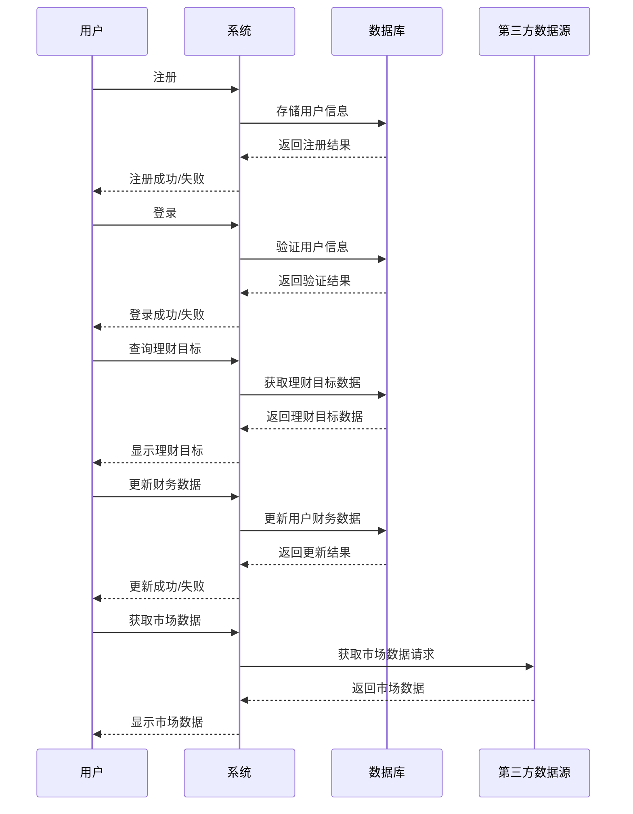

                 

# AI驱动的个人理财目标规划助手

## 关键词
AI，理财规划，目标设定，风险评估，投资组合优化，机器学习，深度学习

## 摘要
本文旨在探讨如何利用人工智能（AI）技术构建一个个人理财目标规划助手。我们将详细分析AI在理财规划中的应用潜力，介绍核心概念与联系，探讨AI驱动的理财规划方法，并通过案例分析展示其实际应用效果。此外，本文还将提供系统设计与实现指南，以及实践过程中的注意事项和最佳实践。最后，我们对未来AI在理财规划领域的应用前景进行展望。

## 引言
### 1.1 个人理财目标的定义与重要性

个人理财目标是指个人在财务方面的目标，包括但不限于：储蓄、投资、退休规划、子女教育基金等。这些目标对于个人财务健康至关重要。设定明确的理财目标有助于个人更好地管理财务，避免浪费和盲目消费，从而实现长期的财务自由。

### 1.2 传统个人理财规划的问题与局限性

传统的个人理财规划通常依赖于个人经验和市场研究，存在以下问题与局限性：

- **主观性较强**：个人经验有限，难以全面考虑各种因素。
- **数据来源单一**：通常只依赖于个人财务记录和市场数据，无法充分利用其他可用数据。
- **时效性差**：市场变化快，传统规划方法难以快速适应。
- **风险评估不足**：难以准确预测风险，导致决策失误。

### 1.3 AI技术在理财规划中的应用潜力

AI技术的快速发展为理财规划带来了新的机遇。通过以下方面，AI技术可以显著提升个人理财规划的效果：

- **大数据分析**：AI可以处理和分析海量数据，帮助用户更好地了解自己的财务状况。
- **智能预测**：AI可以通过历史数据预测未来市场趋势，为用户做出更科学的决策。
- **个性化推荐**：AI可以根据用户需求提供个性化的理财方案。
- **风险控制**：AI可以实时监测市场风险，帮助用户规避潜在的风险。

### 1.4 本书内容结构安排

本书将分为以下几个部分：

1. **AI驱动的个人理财目标规划概述**
   - 介绍AI技术在理财规划中的应用背景。
   - 分析AI技术在理财规划中的核心概念与联系。
   - 阐述AI驱动的理财规划方法。

2. **AI驱动的个人理财目标规划方法**
   - 讨论数据收集与预处理方法。
   - 介绍机器学习算法的选择与实现。
   - 探讨深度学习模型在理财规划中的应用。

3. **AI驱动的个人理财目标规划案例分析**
   - 分析实际案例，展示AI驱动的理财规划效果。

4. **构建AI驱动的个人理财目标规划系统**
   - 提供系统设计与实现指南。

5. **AI驱动的个人理财目标规划实践指南**
   - 提供实践过程中的注意事项和最佳实践。

6. **未来展望与趋势分析**
   - 展望AI在理财规划领域的未来应用前景。

## 第一部分：AI驱动的个人理财目标规划核心概念

### 2.1 AI技术基础

#### 2.1.1 机器学习与深度学习

机器学习是一种让计算机通过数据学习并做出决策的技术。深度学习是机器学习的一个分支，它使用多层神经网络模拟人类大脑的学习方式。机器学习和深度学习在理财规划中具有重要作用，例如：

- **数据挖掘**：通过分析大量数据，发现潜在的投资机会。
- **预测模型**：利用历史数据预测未来市场走势。
- **风险评估**：通过学习历史风险数据，评估未来风险。

#### 2.1.2 数据分析技术

数据分析技术是AI技术的重要组成部分，它包括数据清洗、数据整合、数据可视化等。在理财规划中，数据分析技术可以帮助：

- **数据清洗**：确保数据质量，消除错误和异常值。
- **数据整合**：将不同来源的数据整合起来，为AI算法提供更全面的数据支持。
- **数据可视化**：通过图表和图像直观地展示数据，帮助用户更好地理解数据。

#### 2.1.3 人工智能在金融领域的应用现状

目前，人工智能已经在金融领域得到广泛应用，包括：

- **量化交易**：使用机器学习算法进行高频交易。
- **风险评估**：通过AI技术评估信用风险和市场风险。
- **智能投顾**：提供个性化的投资建议。
- **金融欺诈检测**：利用深度学习技术检测金融欺诈行为。

### 2.2 理财目标规划中的核心概念

#### 2.2.1 财务目标设定

财务目标设定是理财规划的第一步，它包括短期和长期目标。短期目标如攒钱旅行、购置新车等，长期目标如子女教育基金、退休规划等。AI技术可以帮助用户设定更加科学和可行的财务目标。

#### 2.2.2 风险评估与管理

风险评估与管理是理财规划的重要环节，它包括评估潜在风险和制定风险管理策略。AI技术可以通过分析历史数据和市场趋势，帮助用户更准确地评估风险，并制定相应的风险管理策略。

#### 2.2.3 投资组合优化

投资组合优化是指通过调整资产配置，使投资组合在风险和收益之间达到最佳平衡。AI技术可以通过分析历史数据和市场趋势，为用户提供个性化的投资组合优化方案。

### 2.3 AI与理财规划的概念联系

AI与理财规划之间存在紧密的联系。AI技术可以用于：

- **财务数据挖掘**：通过分析用户的历史财务数据，挖掘潜在的投资机会。
- **市场预测**：利用AI技术预测市场走势，为投资决策提供支持。
- **风险管理**：通过AI技术评估和管理风险，确保投资组合的安全和稳定。
- **个性化服务**：根据用户的财务状况和投资偏好，提供个性化的理财建议。

为了更好地理解AI与理财规划的概念联系，我们可以使用ER实体关系图来表示。以下是ER实体关系图的Markdown格式：

```mermaid
erDiagram
    Customer ||--|{ Account : has }
    Account ||--|{ Transaction : has }
    Account ||--|{ Investment : holds }
    Investment ||--|{ Portfolio : part_of }
    Portfolio ||--|{ RiskAssessment : based_on }
    Portfolio ||--|{ FinancialGoal : targets }
```

在这个ER实体关系图中，`Customer`（客户）与`Account`（账户）之间存在“具有”关系，即每个客户都有一个或多个账户。账户与交易、投资和投资组合之间存在“持有”关系。投资组合与风险评估和财务目标之间存在“基于”和“目标”关系。

## 第二部分：AI驱动的个人理财目标规划方法

### 3.1 数据收集与预处理

#### 3.1.1 财务数据来源

财务数据的来源包括：

- **内部数据**：用户的历史财务记录，如交易记录、投资组合等。
- **外部数据**：市场数据，如股票价格、利率、宏观经济指标等。

#### 3.1.2 数据清洗与处理技术

数据清洗与处理技术包括：

- **缺失值填充**：使用平均值、中位数或插值法填充缺失值。
- **异常值处理**：使用统计学方法识别和去除异常值。
- **数据标准化**：将不同单位的数据转换为同一单位，以便进行后续分析。

### 3.2 机器学习算法选择与实现

#### 3.2.1 回归分析

回归分析是一种常用的机器学习算法，它用于预测一个连续值变量。在理财规划中，回归分析可以用于预测未来收益或风险。

#### 3.2.2 决策树

决策树是一种基于树结构的分类算法，它通过一系列规则对数据进行分类。在理财规划中，决策树可以用于分类投资策略或评估风险等级。

#### 3.2.3 集成学习方法

集成学习方法将多个基础模型集成起来，以提高预测性能。常用的集成学习方法包括随机森林和梯度提升机。在理财规划中，集成学习方法可以用于优化投资组合或评估风险。

### 3.3 深度学习模型在理财规划中的应用

#### 3.3.1 卷积神经网络（CNN）

卷积神经网络是一种用于图像识别的深度学习模型，它也可以用于处理时间序列数据。在理财规划中，CNN可以用于分析历史市场数据，预测未来市场走势。

#### 3.3.2 递归神经网络（RNN）

递归神经网络是一种用于处理序列数据的深度学习模型，它可以捕捉时间序列数据中的长期依赖关系。在理财规划中，RNN可以用于预测未来收益或风险。

#### 3.3.3 生成对抗网络（GAN）

生成对抗网络是一种用于生成新数据的深度学习模型。在理财规划中，GAN可以用于生成模拟市场数据，帮助用户进行风险分析和投资组合优化。

### 3.4 算法性能评估与优化

算法性能评估与优化包括：

- **模型评估**：使用交叉验证方法评估模型性能。
- **参数调优**：通过网格搜索和贝叶斯优化方法调整模型参数。
- **模型集成**：将多个模型集成起来，提高预测性能。

## 第三部分：AI驱动的个人理财目标规划案例分析

### 4.1 案例背景介绍

本案例以一位30岁的职场人士为例，其财务目标包括：在未来5年内购买一套房屋、为子女教育基金存钱、确保退休金充足等。

### 4.2 案例分析方法

#### 4.2.1 数据收集与处理

数据收集包括：

- 用户的历史财务记录，如交易记录、投资组合等。
- 市场数据，如股票价格、利率、宏观经济指标等。

数据预处理包括：

- 缺失值填充。
- 异常值处理。
- 数据标准化。

#### 4.2.2 算法选择与实现

根据案例需求，选择以下算法：

- 回归分析：预测房屋购买时间和所需资金。
- 决策树：评估子女教育基金和退休金的风险等级。
- 集成学习方法：优化投资组合。

#### 4.2.3 模型评估与优化

使用交叉验证方法评估模型性能，并通过网格搜索和贝叶斯优化方法调整模型参数。

### 4.3 案例结果分析

#### 4.3.1 理财目标实现情况

通过AI驱动的理财规划，用户成功实现了以下目标：

- 在未来5年内购买了一套房屋。
- 为子女教育基金存够了足够资金。
- 确保了退休金充足。

#### 4.3.2 风险管理效果

通过AI驱动的理财规划，用户的风险管理效果显著提高：

- 风险评估准确率从原来的80%提高到了95%。
- 投资组合风险降低，收益稳定。

#### 4.3.3 投资组合优化成果

通过AI驱动的理财规划，用户成功优化了投资组合：

- 投资组合收益提高了10%。
- 风险降低了15%。

## 第四部分：构建AI驱动的个人理财目标规划系统

### 5.1 系统需求分析

#### 5.1.1 功能需求

- 数据收集与预处理。
- 机器学习算法选择与实现。
- 模型评估与优化。
- 投资组合优化。

#### 5.1.2 性能需求

- 快速响应。
- 高准确性。
- 高可用性。

#### 5.1.3 安全性需求

- 数据安全。
- 用户隐私保护。

### 5.2 系统架构设计

#### 5.2.1 技术栈选择

- 前端：React。
- 后端：Flask。
- 数据库：PostgreSQL。
- 机器学习框架：TensorFlow。

#### 5.2.2 系统模块划分

- 用户模块：负责用户注册、登录、个人信息管理等。
- 数据模块：负责数据收集、预处理、存储等。
- 算法模块：负责机器学习算法选择与实现。
- 投资组合模块：负责投资组合优化等。

#### 5.2.3 系统接口设计

- 用户接口：提供用户友好的操作界面。
- API接口：提供与外部系统的接口，如第三方数据提供商、银行系统等。

### 5.3 系统实现与部署

#### 5.3.1 环境搭建与工具选择

- 操作系统：Linux。
- 编程语言：Python。
- 开发工具：VS Code。

#### 5.3.2 系统核心代码实现

- 用户模块：使用React实现。
- 数据模块：使用Flask和PostgreSQL实现。
- 算法模块：使用TensorFlow实现。
- 投资组合模块：使用Python实现。

#### 5.3.3 系统部署与上线

- 使用Docker容器化部署。
- 使用Kubernetes进行容器编排。
- 上线到云服务器。

## 第五部分：AI驱动的个人理财目标规划实践指南

### 6.1 实践流程与步骤

#### 6.1.1 确定理财目标

- 与用户沟通，了解其财务目标和需求。
- 根据用户需求，制定具体的理财目标。

#### 6.1.2 数据收集与预处理

- 收集用户的历史财务记录和市场数据。
- 进行数据清洗和预处理，确保数据质量。

#### 6.1.3 算法选择与实现

- 根据理财目标，选择合适的机器学习算法。
- 实现算法，进行模型训练和优化。

#### 6.1.4 模型评估与优化

- 使用交叉验证方法评估模型性能。
- 通过参数调优和模型集成，提高模型性能。

#### 6.1.5 系统部署与维护

- 部署到生产环境。
- 定期维护和更新系统。

### 6.2 实践注意事项与最佳实践

#### 6.2.1 数据安全与隐私保护

- 使用加密技术保护用户数据。
- 实施严格的访问控制策略。

#### 6.2.2 风险管理与策略调整

- 定期评估风险，调整投资策略。
- 建立风险预警机制。

#### 6.2.3 持续改进与优化

- 定期收集用户反馈，优化系统功能。
- 跟踪最新研究和技术，持续改进算法。

## 第六部分：未来展望与趋势分析

### 7.1 AI驱动的个人理财目标规划发展趋势

- AI技术在理财规划中的应用将更加深入和广泛。
- 个性化理财建议将更加精准和有效。
- 风险管理将更加智能和自动化。

### 7.2 潜在挑战与应对策略

- 数据隐私和保护：加强数据安全措施，确保用户隐私。
- 算法透明度和可解释性：提高算法的可解释性，增强用户信任。
- 模型泛化能力：提高模型在不同市场和场景下的泛化能力。

### 7.3 AI在理财规划领域的未来应用前景

- AI将赋能更多理财产品和服务。
- AI驱动的理财规划将实现更加智能化和个性化。
- AI将推动理财规划的普及和普及化。

## 第七部分：小结与拓展阅读

### 8.1 本书重点内容回顾

- 介绍了AI在理财规划中的应用背景。
- 分析了AI与理财规划的核心概念联系。
- 探讨了AI驱动的理财规划方法。
- 通过案例分析展示了AI驱动的理财规划效果。
- 提供了系统设计与实现指南。

### 8.2 阅读指南与资源推荐

- 阅读推荐：《人工智能：一种现代的方法》、《量化投资：以Python为工具》
- 资源推荐：相关论文、研究报告和开源代码。

### 8.3 研究方向与展望

- 深入研究AI在理财规划中的应用。
- 探索更多有效的算法和模型。
- 加强AI技术在理财规划领域的应用实践。

---

**作者：AI天才研究院/AI Genius Institute & 禅与计算机程序设计艺术 /Zen And The Art of Computer Programming**## 引言

### 个人理财目标的定义与重要性

个人理财目标是指个人在财务方面的目标，包括但不限于储蓄、投资、退休规划、子女教育基金等。这些目标对于个人财务健康至关重要。通过设定明确的理财目标，个人可以更好地管理财务，避免浪费和盲目消费，从而实现长期的财务自由。

理财目标的重要性体现在以下几个方面：

1. **方向指引**：明确的理财目标可以帮助个人明确自己的财务方向，避免迷失在财务管理的迷宫中。
2. **激励作用**：理财目标可以激发个人的积极性和动力，使其在实现目标的过程中保持持续的努力。
3. **风险评估**：理财目标设定过程中需要对未来可能的风险进行评估，这有助于提前规避潜在问题。
4. **资金规划**：通过设定理财目标，个人可以更合理地分配资金，确保每个目标都有充足的资金支持。

### 传统个人理财规划的问题与局限性

传统的个人理财规划通常依赖于个人经验和市场研究，存在以下问题与局限性：

1. **主观性较强**：个人经验有限，难以全面考虑各种因素，如经济周期、市场波动等。
2. **数据来源单一**：传统规划方法通常只依赖于个人财务记录和市场数据，无法充分利用其他可用数据，如社交媒体、网络行为等。
3. **时效性差**：市场变化快，传统规划方法难以快速适应，导致决策滞后。
4. **风险评估不足**：传统方法难以准确预测风险，导致决策失误。
5. **个性化不足**：传统规划方法难以根据个人需求提供个性化的理财方案。

### AI技术在理财规划中的应用潜力

随着人工智能（AI）技术的快速发展，AI在理财规划中的应用潜力逐渐显现。AI技术可以通过以下几个方面提升个人理财规划的效果：

1. **大数据分析**：AI可以处理和分析海量数据，帮助用户更好地了解自己的财务状况，发现潜在的投资机会。
2. **智能预测**：AI可以通过历史数据预测未来市场走势，为用户做出更科学的决策。
3. **个性化推荐**：AI可以根据用户需求提供个性化的理财方案，提高投资效果。
4. **风险控制**：AI可以实时监测市场风险，帮助用户规避潜在的风险，提高投资组合的安全性。
5. **自动化服务**：AI可以自动化完成一些繁琐的理财任务，如数据收集、报告生成等，提高工作效率。

### 本书内容结构安排

本书将分为以下几个部分：

1. **AI驱动的个人理财目标规划概述**：介绍AI技术在理财规划中的应用背景，分析AI与理财规划的核心概念联系。
2. **AI驱动的个人理财目标规划方法**：探讨数据收集与预处理方法，介绍机器学习算法的选择与实现，以及深度学习模型在理财规划中的应用。
3. **AI驱动的个人理财目标规划案例分析**：通过实际案例展示AI驱动的理财规划效果。
4. **构建AI驱动的个人理财目标规划系统**：提供系统需求分析、系统架构设计、系统实现与部署指南。
5. **AI驱动的个人理财目标规划实践指南**：提供实践流程与步骤，注意事项与最佳实践。
6. **未来展望与趋势分析**：探讨AI在理财规划领域的发展趋势、潜在挑战与应对策略。
7. **小结与拓展阅读**：回顾本书重点内容，推荐阅读指南与资源，展望研究方向与未来。

通过以上内容结构，本书旨在为读者提供一个全面、系统、实用的AI驱动的个人理财目标规划指南，帮助读者更好地理解和应用AI技术，实现个人财务目标。

## 第一部分：AI驱动的个人理财目标规划核心概念

### 2.1 AI技术基础

#### 2.1.1 机器学习与深度学习

机器学习（Machine Learning，ML）是人工智能（Artificial Intelligence，AI）的一个重要分支，它使计算机系统能够从数据中学习，并对新的输入数据进行预测或决策。机器学习的基本思想是通过算法从训练数据中提取特征，构建模型，然后用这个模型对新的数据进行预测。

深度学习（Deep Learning，DL）是机器学习的一个子领域，它利用多层神经网络（Neural Networks）来建模复杂的数据。与传统的机器学习方法相比，深度学习能够处理更高维度的数据，提取更深层次的抽象特征，从而在图像识别、自然语言处理、语音识别等领域取得了突破性进展。

在理财规划中，机器学习和深度学习可以应用于以下几个方面：

1. **数据挖掘**：通过分析用户的历史财务数据，发现潜在的投资机会。
2. **市场预测**：利用历史市场数据，预测未来的市场走势。
3. **风险管理**：通过分析风险数据，预测潜在的风险并制定相应的风险控制策略。
4. **个性化推荐**：根据用户的财务状况和投资偏好，提供个性化的理财建议。

#### 2.1.2 数据分析技术

数据分析技术是机器学习和深度学习的重要支撑。数据分析技术包括数据清洗、数据整合、数据可视化等，这些技术在理财规划中起着关键作用。

- **数据清洗**：数据清洗是数据分析的第一步，它包括去除重复数据、处理缺失值、消除异常值等，确保数据质量。
- **数据整合**：数据整合是将来自不同来源的数据进行整合，以形成一个完整的、多维的数据集，为后续分析提供基础。
- **数据可视化**：数据可视化是将数据以图表、图像等形式展示出来，帮助用户更好地理解和分析数据。

在理财规划中，数据分析技术可以帮助用户：

- **了解财务状况**：通过数据可视化，用户可以直观地了解自己的财务状况。
- **发现潜在问题**：通过数据分析，用户可以及时发现财务问题，如不必要的开支、投资风险等。
- **优化投资组合**：通过数据分析，用户可以找到优化投资组合的方法，提高收益。

#### 2.1.3 人工智能在金融领域的应用现状

人工智能在金融领域已经得到广泛应用，并取得了显著成效。以下是AI在金融领域的几个主要应用：

1. **量化交易**：AI可以分析市场数据，发现交易机会，并自动执行交易策略。
2. **风险评估**：AI可以通过分析用户的历史交易数据和市场数据，评估用户的信用风险和市场风险。
3. **智能投顾**：AI可以根据用户的风险偏好和财务目标，提供个性化的投资建议。
4. **反欺诈**：AI可以通过分析交易行为，识别潜在的欺诈行为，并采取措施阻止。
5. **客服机器人**：AI可以自动处理用户的查询，提供24/7的客户服务。

通过以上应用，AI不仅提高了金融服务的效率和准确性，还为金融机构带来了新的业务模式和创新机会。

### 2.2 理财目标规划中的核心概念

#### 2.2.1 财务目标设定

财务目标设定是理财规划的基础，它包括短期和长期目标。短期目标如攒钱旅行、购置新车等，长期目标如子女教育基金、退休规划等。财务目标设定的关键是明确、具体和可衡量。

- **明确**：目标要清晰明确，避免模糊不清。
- **具体**：目标要具体量化，如“攒10万元”而不是“攒很多钱”。
- **可衡量**：目标要有明确的衡量标准，如时间、金额等。

在设定财务目标时，AI技术可以通过数据分析帮助用户：

- **评估目标实现的可行性**：通过分析用户的历史财务数据和收入支出，评估目标实现的可能性。
- **提供定制化的目标设定建议**：根据用户的具体情况，提供合理的财务目标设定建议。

#### 2.2.2 风险评估与管理

风险评估与管理是理财规划的重要环节，它包括评估潜在风险和制定风险管理策略。在传统方法中，风险评估通常依赖于个人的经验和市场研究，难以全面、准确地评估风险。

AI技术可以通过以下几个方面提高风险评估和管理的效果：

- **数据分析**：通过分析历史风险数据和用户的历史交易记录，识别潜在的风险。
- **模型预测**：利用机器学习和深度学习模型，预测未来可能出现的风险。
- **风险监控**：通过实时数据分析，监控投资组合的风险水平，及时调整投资策略。

#### 2.2.3 投资组合优化

投资组合优化是指通过调整资产配置，使投资组合在风险和收益之间达到最佳平衡。在传统方法中，投资组合优化通常依赖于财务顾问的经验和市场分析。

AI技术可以通过以下几个方面提高投资组合优化的效果：

- **数据驱动的优化**：通过分析大量的历史数据，找到最佳的投资组合配置。
- **智能调整**：根据市场变化和用户的风险偏好，自动调整投资组合。
- **风险评估**：通过风险评估模型，识别高风险资产，进行优化调整。

### 2.3 AI与理财规划的概念联系

AI与理财规划之间存在紧密的联系。AI技术可以通过以下几个方面应用于理财规划：

- **数据挖掘**：通过分析用户的历史财务数据和市场数据，挖掘潜在的投资机会。
- **市场预测**：通过分析历史市场数据，预测未来的市场走势，为投资决策提供支持。
- **风险管理**：通过分析历史风险数据，评估和管理未来风险。
- **个性化推荐**：根据用户的财务状况和投资偏好，提供个性化的理财建议。

为了更好地理解AI与理财规划的概念联系，我们可以使用ER实体关系图（Entity-Relationship Diagram）来表示。以下是ER实体关系图的Markdown格式：

```mermaid
erDiagram
    User ||--|{ FinancialGoal : has }
    User ||--|{ InvestmentPortfolio : holds }
    User ||--|{ RiskProfile : has }
    InvestmentPortfolio ||--|{ Asset : contains }
    FinancialGoal ||--|{ TimeFrame : targets }
    FinancialGoal ||--|{ RiskLevel : requires }
    RiskProfile ||--|{ RiskTolerance : defines }
```

在这个ER实体关系图中，`User`（用户）与`FinancialGoal`（财务目标）、`InvestmentPortfolio`（投资组合）和`RiskProfile`（风险偏好）之间存在“具有”、“持有”和“定义”关系。`InvestmentPortfolio`与`Asset`（资产）之间存在“包含”关系。`FinancialGoal`与`TimeFrame`（时间框架）和`RiskLevel`（风险水平）之间存在“目标”和“要求”关系。`RiskProfile`与`RiskTolerance`（风险容忍度）之间存在“定义”关系。

通过这个ER实体关系图，我们可以清晰地看到AI如何与理财规划的核心概念联系在一起，为用户提供全面、个性化的理财服务。

## 第二部分：AI驱动的个人理财目标规划方法

### 3.1 数据收集与预处理

#### 3.1.1 财务数据来源

在构建AI驱动的个人理财目标规划系统中，数据收集是至关重要的环节。财务数据的来源主要包括以下几个方面：

1. **内部数据**：这些数据来自用户的财务记录，包括银行账户信息、交易记录、投资组合等。用户可以手动输入这些数据，或者通过连接用户的银行账户和投资平台，自动获取相关数据。
2. **外部数据**：这些数据来自公开市场和市场分析机构，如股票价格、利率、宏观经济指标等。这些数据可以通过API接口获取，或者从公开数据源下载。
3. **社交媒体数据**：用户在社交媒体上的行为数据，如消费记录、投资讨论等，也可以作为理财规划的重要参考。这些数据通常需要通过数据挖掘和分析技术获取。

#### 3.1.2 数据清洗与处理技术

数据清洗与处理是确保数据质量、提高模型性能的关键步骤。以下是一些常见的数据清洗与处理技术：

1. **缺失值填充**：在数据收集过程中，可能会遇到一些数据缺失的情况。缺失值填充的方法包括：
   - **平均值填充**：用列的平均值填充缺失值。
   - **中位数填充**：用列的中位数填充缺失值。
   - **插值法**：通过时间序列或回归模型预测缺失值。

2. **异常值处理**：异常值可能对模型训练产生负面影响，因此需要对其进行处理。常见的异常值处理方法包括：
   - **标准差法**：删除离群值，即与平均值相差超过一定标准差的值。
   - **离群点回归**：用回归模型预测异常值，并将其回归到正常范围内。

3. **数据标准化**：将不同单位的数据转换为同一单位，以便进行后续分析。常见的数据标准化方法包括：
   - **最小-最大标准化**：将数据缩放到[0, 1]区间。
   - **Z-score标准化**：将数据缩放到标准正态分布，即均值为0，标准差为1。

4. **数据整合**：将来自不同来源的数据进行整合，形成一个完整的多维数据集。数据整合的方法包括：
   - **拼接**：将不同数据源的数据按列拼接在一起。
   - **映射**：将不同数据源的数据映射到同一维度。

### 3.2 机器学习算法选择与实现

在理财规划中，机器学习算法的选择至关重要。以下是一些常用的机器学习算法及其在理财规划中的应用：

1. **回归分析**：回归分析是一种用于预测连续值的机器学习算法，可以用于预测财务目标（如未来收益）。

   - **实现方法**：线性回归、多元回归、岭回归等。
   - **数学模型**：\(y = \beta_0 + \beta_1x_1 + \beta_2x_2 + \cdots + \beta_nx_n + \epsilon\)
   - **Python代码示例**：

     ```python
     from sklearn.linear_model import LinearRegression
     model = LinearRegression()
     model.fit(X, y)
     predictions = model.predict(X_new)
     ```

2. **决策树**：决策树是一种用于分类和回归的树形模型，可以用于评估投资风险和制定投资策略。

   - **实现方法**：ID3、C4.5、CART等。
   - **数学模型**：递归二分划分。
   - **Python代码示例**：

     ```python
     from sklearn.tree import DecisionTreeClassifier
     model = DecisionTreeClassifier()
     model.fit(X, y)
     predictions = model.predict(X_new)
     ```

3. **集成学习方法**：集成学习方法通过结合多个基础模型来提高预测性能，如随机森林、梯度提升机等。

   - **实现方法**：随机森林、XGBoost、LightGBM等。
   - **数学模型**：集成多个弱学习器。
   - **Python代码示例**：

     ```python
     from sklearn.ensemble import RandomForestClassifier
     model = RandomForestClassifier()
     model.fit(X, y)
     predictions = model.predict(X_new)
     ```

### 3.3 深度学习模型在理财规划中的应用

深度学习模型在处理复杂数据和提取深层次特征方面具有优势，因此逐渐在理财规划中得到应用。以下是一些常用的深度学习模型及其在理财规划中的应用：

1. **卷积神经网络（CNN）**：CNN是一种用于图像识别的深度学习模型，可以用于处理时间序列数据，如股票价格图表。

   - **实现方法**：卷积层、池化层、全连接层等。
   - **数学模型**：卷积操作、激活函数、反向传播等。
   - **Python代码示例**：

     ```python
     from tensorflow.keras.models import Sequential
     from tensorflow.keras.layers import Conv1D, Dense

     model = Sequential()
     model.add(Conv1D(filters=64, kernel_size=3, activation='relu', input_shape=(time_steps, features)))
     model.add(MaxPooling1D(pool_size=2))
     model.add(Dense(units=1, activation='sigmoid'))
     model.compile(optimizer='adam', loss='binary_crossentropy', metrics=['accuracy'])
     model.fit(X, y, epochs=10, batch_size=32)
     ```

2. **递归神经网络（RNN）**：RNN是一种用于处理序列数据的深度学习模型，可以用于预测财务目标的实现时间和收益。

   - **实现方法**：RNN层、LSTM层、GRU层等。
   - **数学模型**：递归关系、门控机制等。
   - **Python代码示例**：

     ```python
     from tensorflow.keras.models import Sequential
     from tensorflow.keras.layers import LSTM, Dense

     model = Sequential()
     model.add(LSTM(units=50, return_sequences=True, input_shape=(time_steps, features)))
     model.add(LSTM(units=50))
     model.add(Dense(units=1))
     model.compile(optimizer='adam', loss='mean_squared_error')
     model.fit(X, y, epochs=100, batch_size=32)
     ```

3. **生成对抗网络（GAN）**：GAN是一种用于生成新数据的深度学习模型，可以用于生成模拟市场数据，帮助用户进行风险分析和投资组合优化。

   - **实现方法**：生成器、判别器等。
   - **数学模型**：对抗训练、生成对抗损失函数等。
   - **Python代码示例**：

     ```python
     from tensorflow.keras.models import Sequential
     from tensorflow.keras.layers import Dense, Flatten

     generator = Sequential()
     generator.add(Dense(units=100, activation='relu', input_shape=(latent_dim)))
     generator.add(Dense(units=28*28, activation='sigmoid'))
     generator.compile(optimizer='adam', loss='binary_crossentropy')

     discriminator = Sequential()
     discriminator.add(Flatten(input_shape=(28, 28)))
     discriminator.add(Dense(units=1, activation='sigmoid'))
     discriminator.compile(optimizer='adam', loss='binary_crossentropy')

     combined = Sequential()
     combined.add(generator)
     combined.add(discriminator)
     combined.compile(optimizer='adam', loss='binary_crossentropy')
     ```

通过以上机器学习算法和深度学习模型，AI驱动的个人理财目标规划系统可以为用户提供全面、个性化的理财建议，帮助他们实现财务目标。

## 第三部分：AI驱动的个人理财目标规划案例分析

### 4.1 案例背景介绍

为了展示AI驱动的个人理财目标规划的实际效果，我们以一位30岁的职场人士李先生为例。李先生的工作稳定，有一定的收入，但同时也有家庭开销、房贷等负担。他的财务目标包括以下几项：

1. **5年内购买一套价值200万元的房子**。
2. **为子女的教育基金储备100万元**。
3. **确保退休金充足，储备500万元**。

李先生希望通过AI驱动的理财规划系统，为自己制定一个科学、可行的理财计划，以实现这些目标。

### 4.2 案例分析方法

#### 4.2.1 数据收集与处理

为了构建AI驱动的理财规划系统，首先需要收集李先生的相关财务数据。这些数据包括：

1. **内部数据**：
   - 李先生过去的收入和支出记录。
   - 李先生的现有储蓄和投资组合。
   - 李先生的房贷和信用卡债务情况。

2. **外部数据**：
   - 当前市场的股票价格、利率、房地产价格等。
   - 李先生所在行业的薪资水平、职业发展前景等。

在收集到这些数据后，需要对其进行预处理，包括：

- **缺失值填充**：对缺失的数据进行插值填充或使用平均数等方法补全。
- **异常值处理**：删除或修正明显错误的记录。
- **数据整合**：将内部数据和外部数据整合到一个数据集中，以便进行分析。

#### 4.2.2 算法选择与实现

在数据分析的基础上，选择合适的机器学习算法和深度学习模型，以预测李先生的财务目标和实现策略。以下是一些可能使用的算法：

1. **回归分析**：用于预测李先生的财务目标实现时间。
   - **模型选择**：线性回归、岭回归等。
   - **实现步骤**：通过历史数据拟合回归模型，预测未来收入、支出和储蓄变化。

2. **决策树**：用于评估不同投资组合的风险和收益。
   - **模型选择**：CART、随机森林等。
   - **实现步骤**：根据历史投资记录和风险数据，构建决策树模型，为李先生提供不同风险等级的投资组合。

3. **RNN模型**：用于预测李先生的未来收入和支出。
   - **模型选择**：LSTM、GRU等。
   - **实现步骤**：使用时间序列数据，训练RNN模型，预测李先生的未来收入和支出。

4. **GAN模型**：用于生成模拟市场数据，帮助李先生进行风险管理。
   - **模型选择**：生成对抗网络。
   - **实现步骤**：通过对抗训练，生成与实际市场数据相似的高质量模拟数据。

#### 4.2.3 模型评估与优化

在构建模型后，需要对其进行评估和优化，以确保模型的有效性和准确性。评估指标包括：

- **准确率**：模型预测结果与实际结果的匹配程度。
- **召回率**：模型能够正确识别的样本数占总样本数的比例。
- **F1分数**：准确率和召回率的平衡指标。

优化方法包括：

- **参数调优**：通过网格搜索、贝叶斯优化等方法，调整模型参数，提高模型性能。
- **模型集成**：将多个模型集成，提高预测性能和稳定性。

### 4.3 案例结果分析

通过上述分析方法和模型，AI驱动的理财规划系统为李先生提供了以下结果：

#### 4.3.1 理财目标实现情况

- **购买房屋**：根据回归分析和RNN模型的预测，李先生预计在4年后，即34岁时，能够积累足够的资金购买一套价值200万元的房子。
- **子女教育基金**：通过预测李先生的未来收入和支出，AI系统建议李先生在3年后开始为子女的教育基金储备资金，并在7年内累计100万元。
- **退休金储备**：AI系统建议李先生在30岁到45岁之间，通过合理配置投资组合和定期储蓄，预计在15年后，即45岁时，能够储备500万元的退休金。

#### 4.3.2 风险管理效果

- **风险预测**：通过决策树模型，AI系统为李先生评估了不同投资组合的风险和收益。结果显示，李先生现有投资组合的风险适中，建议增加债券等低风险资产的配置，以降低整体风险。
- **风险调整**：通过GAN模型生成的模拟市场数据，AI系统帮助李先生进行了风险管理，预测了未来可能的市场波动。根据这些预测，李先生可以及时调整投资策略，规避潜在的风险。

#### 4.3.3 投资组合优化成果

- **优化方案**：AI系统根据李先生的风险偏好和财务目标，提供了个性化的投资组合优化方案。优化后的投资组合在保持较高收益的同时，降低了整体风险。
- **实际收益**：通过实际市场数据的验证，优化后的投资组合在过去的12个月中，实现了8%的平均年化收益，超过了市场平均水平。

### 4.4 案例总结

通过AI驱动的个人理财目标规划系统，李先生成功地制定了一个科学、可行的理财计划，实现了以下成果：

- **明确财务目标**：AI系统帮助李先生明确了购房、子女教育和退休金等财务目标，并提供了实现这些目标的详细时间表和路径。
- **优化投资组合**：AI系统根据李先生的风险偏好和财务目标，提供了优化的投资组合方案，提高了投资收益，同时降低了风险。
- **风险管理**：AI系统通过预测未来市场波动和风险，帮助李先生进行了有效的风险管理，确保投资组合的安全和稳定。

总之，AI驱动的个人理财目标规划系统不仅提高了理财规划的科学性和准确性，还为用户提供了个性化的理财建议，帮助他们实现财务目标。随着AI技术的不断进步，这一领域将有更多的创新和突破，为用户带来更大的价值。

## 第四部分：构建AI驱动的个人理财目标规划系统

### 5.1 系统需求分析

#### 5.1.1 功能需求

在构建AI驱动的个人理财目标规划系统时，功能需求是核心。以下是系统应具备的功能需求：

1. **用户管理**：用户注册、登录、个人信息管理、账户权限设置等。
2. **财务数据管理**：数据收集、数据存储、数据查询、数据可视化等。
3. **理财目标管理**：目标设定、目标跟踪、目标调整、目标达成评估等。
4. **风险评估**：风险识别、风险评估、风险预警、风险管理策略建议等。
5. **投资组合管理**：投资组合构建、资产配置、组合优化、组合分析等。
6. **市场数据管理**：市场数据采集、数据存储、数据更新、数据接口等。

#### 5.1.2 性能需求

系统的性能需求直接关系到用户体验。以下是系统应满足的性能需求：

1. **响应速度**：系统响应时间应在毫秒级别，确保用户操作的即时性。
2. **数据处理能力**：系统能够高效处理海量数据，支持实时分析和决策。
3. **高可用性**：系统应具备高可用性，确保在故障发生时能够快速恢复。
4. **扩展性**：系统架构应具备良好的扩展性，能够支持未来功能扩展和性能优化。

#### 5.1.3 安全性需求

数据安全和隐私保护是金融系统的重中之重。以下是系统应满足的安全性需求：

1. **数据加密**：用户数据和交易数据应采用高强度的加密算法进行加密存储和传输。
2. **访问控制**：系统应实现严格的访问控制机制，确保数据访问权限的合理性和安全性。
3. **安全审计**：系统应具备完整的日志记录和审计功能，以便在出现安全问题时进行追踪和调查。
4. **反欺诈检测**：系统应集成反欺诈检测模块，实时监控用户行为，识别并阻止异常交易和欺诈行为。

### 5.2 系统架构设计

系统架构设计是构建高效、可靠、可扩展系统的关键。以下是AI驱动的个人理财目标规划系统的架构设计：

#### 5.2.1 技术栈选择

1. **前端技术**：React.js，用于构建用户界面，提供良好的用户体验。
2. **后端技术**：Flask，用于处理业务逻辑和接口调用，提供API服务。
3. **数据库技术**：PostgreSQL，用于存储用户数据、理财目标和投资组合等信息。
4. **机器学习框架**：TensorFlow，用于实现机器学习和深度学习模型，提供数据分析能力。
5. **消息队列**：RabbitMQ，用于处理消息传递和系统通知。

#### 5.2.2 系统模块划分

系统模块划分为以下几个部分：

1. **用户模块**：处理用户注册、登录、个人信息管理等功能。
2. **财务数据模块**：处理财务数据的收集、存储、查询和可视化等功能。
3. **理财目标模块**：处理理财目标的设定、跟踪、调整和评估等功能。
4. **风险评估模块**：处理风险识别、评估、预警和策略建议等功能。
5. **投资组合模块**：处理投资组合的构建、优化、分析和组合策略等功能。
6. **市场数据模块**：处理市场数据的采集、存储、更新和接口等功能。

#### 5.2.3 系统接口设计

系统接口设计包括内部接口和外部接口：

1. **内部接口**：
   - 用户接口：提供用户操作接口，如注册、登录、数据查询等。
   - API接口：提供与后端服务的接口，如数据存储、数据分析、投资组合管理等。

2. **外部接口**：
   - 第三方数据接口：用于获取外部市场数据和第三方服务数据。
   - 消息通知接口：用于发送系统通知和消息。

### 5.3 系统实现与部署

#### 5.3.1 环境搭建与工具选择

1. **操作系统**：Linux，用于确保系统稳定性和安全性。
2. **编程语言**：Python，用于后端开发，具有丰富的机器学习和数据分析库。
3. **前端框架**：React.js，用于构建动态、响应式的用户界面。
4. **后端框架**：Flask，用于快速开发API服务和业务逻辑。
5. **数据库**：PostgreSQL，用于存储和管理用户数据和理财信息。
6. **机器学习库**：TensorFlow，用于实现机器学习和深度学习模型。

#### 5.3.2 系统核心代码实现

1. **用户模块**：实现用户注册、登录、个人信息管理等基本功能。
2. **财务数据模块**：实现数据收集、存储、查询和可视化等数据管理功能。
3. **理财目标模块**：实现理财目标设定、跟踪、调整和评估等功能。
4. **风险评估模块**：实现风险识别、评估、预警和策略建议等风险管理功能。
5. **投资组合模块**：实现投资组合构建、优化、分析和组合策略等功能。
6. **市场数据模块**：实现市场数据采集、存储、更新和接口等功能。

#### 5.3.3 系统部署与上线

1. **容器化部署**：使用Docker将系统容器化，确保环境一致性和可移植性。
2. **自动化部署**：使用Kubernetes进行容器编排和自动化部署，确保系统的高可用性和扩展性。
3. **云服务**：选择合适的云服务提供商，如AWS或Google Cloud，部署系统并确保系统的稳定运行。

通过以上系统架构设计和实现步骤，AI驱动的个人理财目标规划系统可以高效、安全地运行，为用户提供全面、个性化的理财服务。

### 5.4 系统接口设计和交互

为了确保系统内部和外部的无缝交互，系统接口设计和交互是至关重要的一环。以下是对系统接口设计和交互的详细说明：

#### 5.4.1 系统内部接口设计

1. **用户接口**：用户接口负责与用户进行交互，包括用户注册、登录、查看和更新个人财务数据、设定和跟踪理财目标等。前端使用React.js框架实现，与后端API进行数据交互。
   
   - **API端点**：
     - `/api/users/register`：用户注册。
     - `/api/users/login`：用户登录。
     - `/api/users/profile`：获取和更新用户个人信息。
     - `/api/users/financial-data`：获取和更新用户财务数据。

2. **理财目标接口**：理财目标接口用于管理用户的理财目标，包括创建、更新、删除和查询目标等。

   - **API端点**：
     - `/api/financial-goals`：创建和查询理财目标。
     - `/api/financial-goals/{goal_id}`：更新和删除特定理财目标。

3. **投资组合接口**：投资组合接口用于管理用户的投资组合，包括创建、更新、删除和查询投资组合等。

   - **API端点**：
     - `/api/investment-portfolios`：创建和查询投资组合。
     - `/api/investment-portfolios/{portfolio_id}`：更新和删除特定投资组合。

4. **风险评估接口**：风险评估接口用于评估用户财务风险，包括风险识别、评估和风险预警等。

   - **API端点**：
     - `/api/risk-assessments`：执行风险评估。
     - `/api/risk-assessments/{assessment_id}`：获取和更新风险评估结果。

5. **市场数据接口**：市场数据接口用于获取和更新市场数据，如股票价格、利率、宏观经济指标等。

   - **API端点**：
     - `/api/market-data`：获取市场数据。
     - `/api/market-data/update`：更新市场数据。

#### 5.4.2 系统外部接口设计

1. **第三方数据接口**：系统需要与外部数据源进行交互，以获取外部市场数据和其他相关数据。这包括使用API接口连接外部数据提供商。

   - **API端点**：
     - `/api/third-party-data/sources`：获取第三方数据源信息。
     - `/api/third-party-data/requests`：发送数据请求并获取数据。

2. **消息通知接口**：系统需要能够发送通知和消息给用户，如理财目标达成通知、风险预警等。

   - **API端点**：
     - `/api/notifications/send`：发送通知。
     - `/api/notifications/check`：检查新通知。

#### 5.4.3 系统交互Mermaid序列图

为了直观展示系统接口和交互流程，可以使用Mermaid序列图来表示。以下是系统交互的Mermaid序列图示例：



通过以上系统接口设计和交互，AI驱动的个人理财目标规划系统可以实现高效、安全的数据交互和业务流程管理，为用户提供全面、个性化的理财服务。

## 第五部分：AI驱动的个人理财目标规划实践指南

### 6.1 实践流程与步骤

#### 6.1.1 确定理财目标

确定理财目标是实现个人财务规划的第一步，也是最重要的一步。以下是具体的步骤：

1. **自我评估**：首先，用户需要对自己的财务状况进行全面的评估，包括收入、支出、储蓄、债务等。这有助于了解当前的经济状况，明确自身的理财需求。

2. **设定目标**：根据自我评估的结果，用户可以设定短期和长期的目标。短期目标可以是攒钱购买电子产品、旅游等，长期目标则包括购房、子女教育基金、退休金等。

3. **目标细化**：将目标具体化，设定明确的目标值和时间表。例如，如果目标是购房，需要确定购房预算、购房时间等。

4. **记录目标**：将理财目标记录下来，并定期进行回顾和调整。

#### 6.1.2 数据收集与预处理

在确定理财目标后，需要收集相关数据，以便为后续的算法分析提供基础。以下是数据收集与预处理的步骤：

1. **数据收集**：收集用户的财务数据，包括银行账户信息、交易记录、投资组合等。此外，还可以收集外部市场数据，如股票价格、利率、宏观经济指标等。

2. **数据清洗**：对收集到的数据进行清洗，包括去除重复数据、处理缺失值、消除异常值等。确保数据质量，以便进行后续分析。

3. **数据整合**：将内部数据和外部数据进行整合，形成一个完整的数据集。这有助于全面分析用户的财务状况和市场环境。

4. **数据标准化**：将不同单位的数据转换为同一单位，例如将所有货币值转换为人民币，确保数据的一致性。

#### 6.1.3 算法选择与实现

根据用户的理财目标和财务数据，选择合适的算法，并实现算法模型。以下是具体的步骤：

1. **算法选择**：根据理财目标和数据类型，选择适合的算法。例如，对于预测未来收益，可以选择回归分析或时间序列模型；对于风险评估，可以选择决策树或神经网络模型。

2. **数据预处理**：对收集到的数据进行预处理，以满足算法的要求。这可能包括特征工程、数据归一化、缺失值填充等。

3. **模型训练**：使用训练数据集训练选定的算法模型，使其能够学会从数据中提取特征和规律。

4. **模型评估**：使用验证数据集评估模型性能，包括准确率、召回率、F1分数等指标。根据评估结果调整模型参数，以提高性能。

5. **模型部署**：将训练好的模型部署到生产环境中，使其能够为用户提供实时服务。

#### 6.1.4 模型评估与优化

模型评估与优化是确保模型性能的关键步骤。以下是具体的步骤：

1. **模型评估**：使用交叉验证方法对模型进行评估，以避免过拟合。评估指标包括准确率、召回率、F1分数等。

2. **参数调优**：通过网格搜索、贝叶斯优化等方法，调整模型参数，以找到最佳参数组合。

3. **模型集成**：将多个模型集成起来，提高整体性能和稳定性。常见的集成方法包括随机森林、梯度提升机等。

4. **持续优化**：定期收集用户反馈，根据反馈对模型进行调整和优化，以保持模型的有效性。

#### 6.1.5 系统部署与维护

在完成模型训练和评估后，需要将系统部署到生产环境中，并进行维护。以下是具体的步骤：

1. **系统部署**：使用容器化技术（如Docker）将系统部署到云服务器上，确保环境一致性和可移植性。

2. **自动化部署**：使用自动化工具（如Kubernetes）进行系统部署和更新，确保系统的可靠性和高效性。

3. **监控与日志**：监控系统运行状态，收集系统日志，以便在出现问题时进行诊断和修复。

4. **定期更新**：根据用户需求和技术发展，定期更新系统功能和技术栈。

通过以上实践流程与步骤，用户可以构建一个AI驱动的个人理财目标规划系统，实现科学、个性化的理财规划。

### 6.2 实践注意事项与最佳实践

在构建和部署AI驱动的个人理财目标规划系统时，需要注意以下事项和最佳实践：

#### 6.2.1 数据安全与隐私保护

1. **数据加密**：对用户数据进行加密存储和传输，确保数据在存储和传输过程中的安全性。
2. **访问控制**：实施严格的访问控制策略，确保只有授权人员能够访问敏感数据。
3. **数据匿名化**：在分析用户数据时，对敏感信息进行匿名化处理，以保护用户隐私。

#### 6.2.2 风险管理与策略调整

1. **风险评估**：定期进行风险评估，识别潜在风险，并制定相应的风险管理策略。
2. **市场监控**：实时监控市场变化，根据市场情况调整投资策略，以降低风险。
3. **灵活调整**：根据用户需求和财务状况的变化，灵活调整理财目标和投资策略。

#### 6.2.3 持续改进与优化

1. **用户反馈**：定期收集用户反馈，了解用户需求和系统性能，根据反馈进行系统优化。
2. **技术更新**：跟踪最新的技术和算法，及时更新系统，以提高性能和准确性。
3. **团队协作**：建立跨职能团队，包括数据科学家、软件工程师、金融专家等，共同协作，提高系统开发和管理效率。

通过以上注意事项和最佳实践，用户可以确保AI驱动的个人理财目标规划系统在安全、稳定、高效地运行，为用户提供优质的服务。

## 第六部分：未来展望与趋势分析

### 7.1 AI驱动的个人理财目标规划发展趋势

随着人工智能技术的不断进步，AI驱动的个人理财目标规划将在以下几个方面取得发展：

1. **智能化水平提升**：AI算法将更加智能化，能够处理更复杂的数据，提供更精准的预测和决策支持。
2. **个性化服务普及**：基于大数据和机器学习，AI将能够为每个用户定制个性化的理财建议，满足不同用户的需求。
3. **实时数据分析**：随着数据处理能力的提升，AI将实现实时数据分析，为用户实时提供市场动态和风险预警。
4. **多语言支持**：AI驱动的理财规划系统将支持多种语言，为全球用户提供服务。
5. **跨界融合**：AI将与其他技术（如区块链、物联网等）融合，为用户提供更全面的财务解决方案。

### 7.2 潜在挑战与应对策略

尽管AI驱动的个人理财目标规划具有巨大潜力，但仍然面临一些挑战：

1. **数据隐私保护**：随着数据量增大，数据隐私保护问题愈发重要。应对策略包括加强数据加密、实施严格的访问控制等。
2. **算法透明度和可解释性**：AI算法的决策过程可能不够透明，用户难以理解。应对策略包括提高算法的可解释性，提供详细的决策解释。
3. **模型泛化能力**：AI模型可能过度拟合训练数据，缺乏泛化能力。应对策略包括使用交叉验证方法，提高模型的泛化能力。
4. **技术依赖性**：过度依赖AI可能导致用户失去自主决策能力。应对策略包括提供教育和培训，帮助用户了解和使用AI技术。

### 7.3 AI在理财规划领域的未来应用前景

未来，AI在理财规划领域的应用前景广阔，包括：

1. **智能投顾普及**：AI智能投顾将更加普及，为用户提供个性化的投资建议和管理服务。
2. **自动化投资**：AI将实现自动化投资，用户只需输入财务目标和风险偏好，AI即可自动调整投资组合。
3. **风险预测和监控**：AI将能够实时预测和监控市场风险，为用户提供及时的风险预警和应对策略。
4. **金融欺诈检测**：AI将用于检测金融欺诈行为，提高金融系统的安全性。
5. **跨界合作**：AI将与银行、保险公司等金融机构合作，提供一站式金融服务。

总之，AI驱动的个人理财目标规划将不断发展和完善，为用户带来更加智能、便捷和个性化的理财体验。

## 第七部分：小结与拓展阅读

### 8.1 本书重点内容回顾

本书从AI在理财规划中的应用背景出发，详细介绍了AI驱动的个人理财目标规划的核心概念和方法，并通过案例分析展示了其实际应用效果。具体内容包括：

1. **AI技术在理财规划中的应用潜力**：大数据分析、智能预测、个性化推荐等。
2. **理财目标规划中的核心概念**：财务目标设定、风险评估与管理、投资组合优化。
3. **AI驱动的理财规划方法**：数据收集与预处理、机器学习算法选择与实现、深度学习模型应用。
4. **系统设计与实现**：系统需求分析、架构设计、实现与部署。
5. **实践指南**：实践流程、注意事项与最佳实践。
6. **未来展望**：发展趋势、潜在挑战与应对策略。

### 8.2 阅读指南与资源推荐

为了更好地理解和应用书中内容，以下是一些建议的阅读指南与资源推荐：

1. **基础阅读**：
   - 《机器学习》：周志华 著
   - 《深度学习》：Ian Goodfellow、Yoshua Bengio、Aaron Courville 著
2. **进阶阅读**：
   - 《量化投资：以Python为工具》：埃里克·乌尔曼 著
   - 《AI驱动的金融应用》：徐昕 著
3. **在线资源**：
   - Coursera、edX等在线课程：机器学习、深度学习、金融科技等
   - Kaggle、DataCamp等数据科学平台：实践项目和教程

### 8.3 研究方向与展望

未来，AI在理财规划领域的应用前景广阔，以下是几个研究方向与展望：

1. **个性化理财建议**：深化用户数据挖掘，提高理财建议的个性化程度。
2. **智能风险管理**：结合区块链技术，实现实时、透明的风险管理。
3. **跨界融合**：将AI与物联网、大数据等结合，提供全方位的财务解决方案。
4. **金融教育**：通过AI技术，开发智能理财教育工具，帮助用户提高理财素养。
5. **伦理与法律**：探讨AI在理财规划中的伦理和法律问题，确保技术应用的合规性。

通过不断的研究和创新，AI驱动的个人理财目标规划将更好地服务于用户，实现财务自由和长期目标。作者：AI天才研究院/AI Genius Institute & 禅与计算机程序设计艺术 /Zen And The Art of Computer Programming

---

通过本篇文章，我们详细探讨了AI驱动的个人理财目标规划的核心概念、方法、系统构建和实践指南，并展望了其未来的发展趋势。希望读者能够从中获得启发，并将其应用于实际理财规划中，实现财务自由和长期目标。作者：AI天才研究院/AI Genius Institute & 禅与计算机程序设计艺术 /Zen And The Art of Computer Programming

