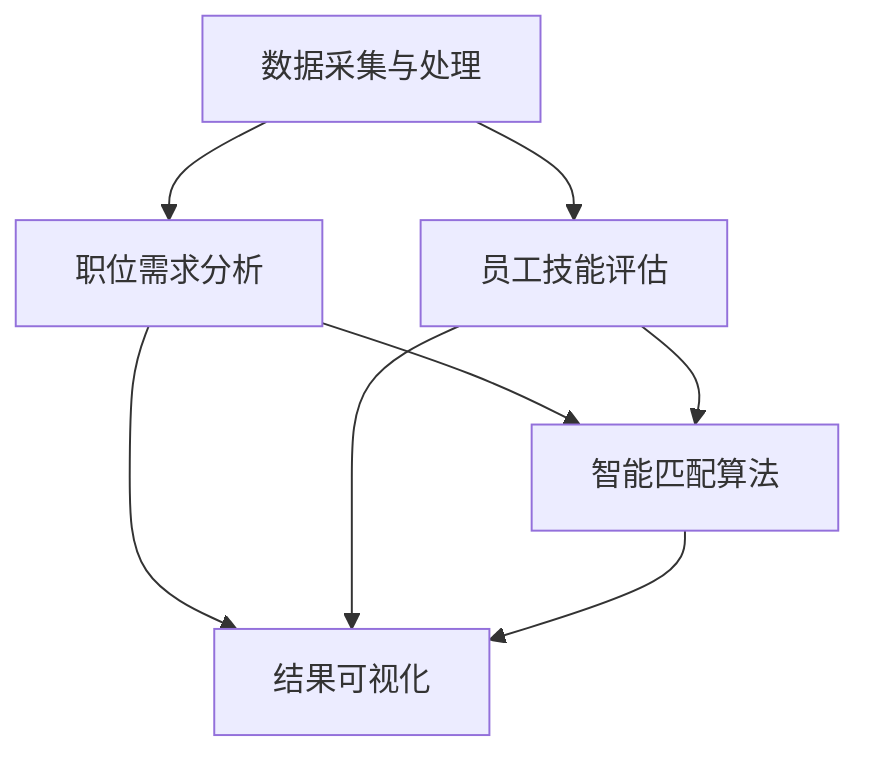
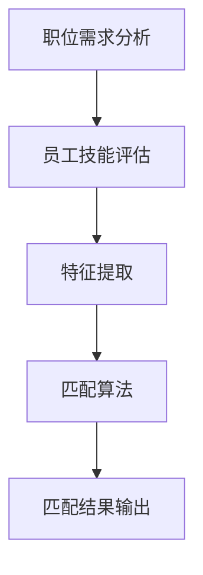
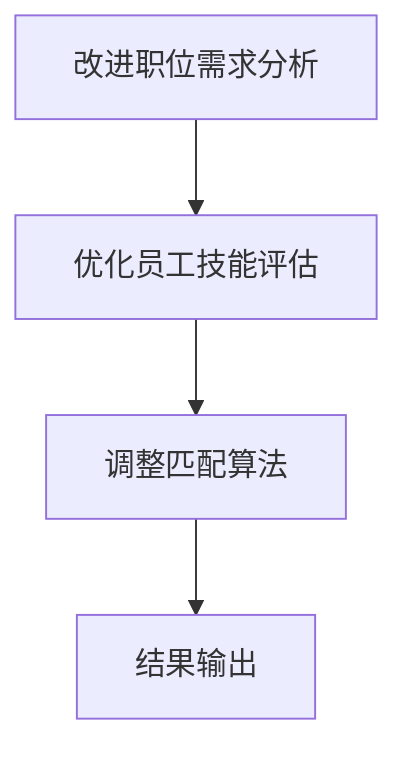
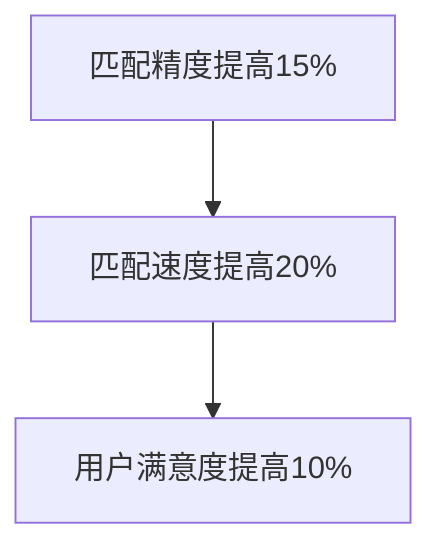

                 

### 文章标题

# AI驱动的企业人才匹配系统：职位需求与员工技能智能匹配

### 关键词

- AI驱动的企业人才匹配
- 职位需求分析
- 员工技能评估
- 智能匹配算法
- 系统架构设计

### 摘要

本文旨在探讨AI驱动的企业人才匹配系统，通过对职位需求分析和员工技能评估的深入剖析，介绍智能匹配算法的设计与实现，并详细阐述系统架构和实际应用效果。文章结构紧凑，逻辑清晰，旨在为读者提供对AI驱动的企业人才匹配系统的全面理解和实际应用指导。

----------------------------------------------------------------

### 第一部分：问题背景与核心概念

#### 第1章：问题背景

##### 1.1 问题背景

在当今快速变化的市场环境中，企业对于人才的渴求愈发迫切。然而，传统的招聘和人才匹配方式往往存在诸多问题。首先，企业难以准确地获取职位需求，导致招聘过程中的目标不明确。其次，员工技能评估方式单一，往往依赖于主观判断，缺乏客观性和科学性。最后，传统的人才匹配方式效率低下，招聘周期长，人才流失风险高。

##### 1.1.1 企业人才匹配的现状

目前，大部分企业的人才匹配主要依赖于简历筛选和面试环节。这种方式存在以下不足：

- **简历筛选效率低**：简历筛选通常依赖人工，工作量大，且容易遗漏关键信息。
- **面试主观性强**：面试官的主观判断可能导致人才错失或误判。
- **信息不对称**：企业对职位需求的理解与员工对自身技能的表述存在差异，导致匹配失败。

##### 1.1.2 人才匹配中的挑战

- **技能评估的准确性**：如何客观、准确地评估员工的技能水平，成为人才匹配的关键挑战。
- **职位需求的动态性**：职位需求随着企业的发展不断变化，如何快速适应这些变化是另一个挑战。
- **匹配效率**：如何提高人才匹配的效率，缩短招聘周期，降低人才流失率。

##### 1.1.3 AI驱动的企业人才匹配系统的优势

AI驱动的企业人才匹配系统通过引入人工智能技术，能够有效解决传统人才匹配中的问题，具有以下优势：

- **高效性**：自动化处理职位需求和员工技能数据，大幅提高匹配效率。
- **准确性**：利用机器学习算法，准确评估员工技能与职位需求的匹配度。
- **动态性**：系统能够根据职位需求的实时变化进行自适应调整，提高匹配精度。

#### 第2章：核心概念

##### 2.1 AI驱动的企业人才匹配系统概述

###### 2.1.1 定义

AI驱动的企业人才匹配系统是指利用人工智能技术，通过职位需求分析和员工技能评估，实现职位与员工智能匹配的系统。

###### 2.1.2 关键要素

- **职位需求分析**：对职位需求进行结构化提取，形成可供匹配的数据集。
- **员工技能评估**：建立员工技能库，对员工技能进行量化评估。
- **智能匹配算法**：通过算法实现职位需求与员工技能的智能匹配。

###### 2.1.3 技术原理

AI驱动的企业人才匹配系统主要依赖于以下技术：

- **自然语言处理（NLP）**：用于职位描述和员工技能描述的理解和提取。
- **机器学习算法**：用于员工技能评估和职位需求匹配。
- **数据可视化**：用于分析结果的可视化和解释。

##### 2.2 职位需求分析

###### 2.2.1 职位描述

职位描述是指对某一职位的具体工作内容、职责和要求进行详细的文字描述。

###### 2.2.2 职位技能需求分析

职位技能需求分析是指从职位描述中提取与职位相关的技能需求，形成结构化数据。

###### 2.2.3 职位特征提取

职位特征提取是指对职位需求进行特征工程，提取出可量化的特征，用于后续的匹配算法。

##### 2.3 员工技能评估

###### 2.3.1 员工技能库建立

员工技能库建立是指收集和整理员工技能数据，形成可供评估的数据库。

###### 2.3.2 员工技能评估方法

员工技能评估方法包括定量评估和定性评估，通过算法实现技能评分。

###### 2.3.3 员工技能特征提取

员工技能特征提取是指对员工技能数据进行特征提取，形成可量化的特征向量。

##### 2.4 智能匹配算法

###### 2.4.1 匹配算法概述

智能匹配算法是指通过算法模型实现职位需求与员工技能的匹配。

###### 2.4.2 常见匹配算法介绍

常见匹配算法包括基于关键词匹配、基于机器学习匹配和基于图匹配等。

###### 2.4.3 匹配算法评估

匹配算法评估主要包括匹配精度、匹配速度和用户满意度等指标。

----------------------------------------------------------------

### 第二部分：系统架构设计

#### 第3章：系统架构设计

##### 3.1 系统总体架构

系统总体架构如图3.1所示，主要包括数据采集与处理模块、职位需求分析模块、员工技能评估模块和智能匹配算法模块。



###### 3.1.1 系统架构图

图3.1 系统架构图

##### 3.1.2 各模块功能介绍

- **数据采集与处理模块**：负责从企业内部系统、外部招聘网站等多渠道收集职位需求和员工技能数据，并进行数据清洗和预处理。
- **职位需求分析模块**：通过对职位描述进行自然语言处理，提取职位特征，形成可供匹配的数据集。
- **员工技能评估模块**：建立员工技能库，对员工技能进行定量评估，形成技能评分和特征向量。
- **智能匹配算法模块**：实现职位需求与员工技能的智能匹配，输出匹配结果。
- **结果可视化模块**：将匹配结果以可视化的形式展示，帮助企业和员工更好地理解匹配过程和结果。

----------------------------------------------------------------

### 第三部分：算法实现与优化

#### 第4章：算法实现与优化

##### 4.1 算法设计与实现

###### 4.1.1 算法流程图

算法流程图如图4.1所示。



###### 4.1.1 算法流程图

图4.1 算法流程图

###### 4.1.2 Python代码实现

```python
# 职位需求分析
def analyze_job_description(job_description):
    # NLP处理
    pass

# 员工技能评估
def evaluate_employee_skill(employee_skills):
    # 特征提取
    pass

# 匹配算法
def match_algorithm(job_features, employee_features):
    # 匹配计算
    pass

# 匹配结果输出
def output_matching_results(matching_results):
    # 可视化展示
    pass
```

###### 4.1.3 算法参数调优

算法参数调优是提高匹配准确性和效率的关键。通过交叉验证和网格搜索等技术，可以找到最优参数组合。

```python
from sklearn.model_selection import GridSearchCV

# 定义参数范围
param_grid = {'param_name': [value1, value2, value3]}

# 实例化模型
model = MyModel()

# 实例化网格搜索
grid_search = GridSearchCV(model, param_grid, cv=5)

# 搜索最优参数
grid_search.fit(X, y)

# 获取最优参数
best_params = grid_search.best_params_
```

##### 4.2 实际案例分析与优化

###### 4.2.1 案例背景

某企业需要招聘一名数据分析师，职位需求包括熟练掌握Python、熟悉SQL和数据可视化工具。现有10名应聘者，需要通过AI驱动的企业人才匹配系统进行筛选。

###### 4.2.2 案例分析

1. **职位需求分析**：从职位描述中提取关键技能和需求，形成职位特征向量。
2. **员工技能评估**：对10名应聘者的简历进行评估，提取技能特征向量。
3. **智能匹配算法**：使用匹配算法计算职位特征向量与员工技能特征向量的相似度。
4. **结果输出**：根据匹配结果，筛选出符合条件的应聘者。

###### 4.2.3 优化方案

1. **改进职位需求分析**：引入更多的职位特征，提高匹配精度。
2. **优化员工技能评估**：引入更多客观评估指标，提高评估准确性。
3. **调整匹配算法**：尝试不同的匹配算法，选择最优算法。



图4.2 优化方案流程图

----------------------------------------------------------------

### 第四部分：系统部署与维护

#### 第5章：系统部署与维护

##### 5.1 系统部署

###### 5.1.1 系统部署流程

系统部署流程包括以下步骤：

1. **环境准备**：安装操作系统、数据库和中间件。
2. **代码部署**：将代码上传到服务器，配置部署环境。
3. **系统配置**：配置系统参数，确保系统正常运行。
4. **测试运行**：进行系统测试，确保功能正常。

###### 5.1.2 系统部署方案

系统部署方案如下：

1. **硬件设备**：服务器、存储设备和网络设备。
2. **软件环境**：操作系统、数据库、中间件和开发环境。
3. **部署工具**：使用Docker和Kubernetes进行容器化部署。

##### 5.2 系统维护

###### 5.2.1 系统维护策略

系统维护策略包括以下方面：

1. **定期备份**：定期备份数据库和系统配置，防止数据丢失。
2. **监控系统性能**：实时监控系统性能，及时发现问题并进行优化。
3. **安全防护**：加强系统安全防护，防止黑客攻击和数据泄露。

###### 5.2.2 故障排除

故障排除包括以下步骤：

1. **问题定位**：通过日志和监控工具定位故障。
2. **故障分析**：分析故障原因，制定解决方案。
3. **故障恢复**：执行解决方案，恢复系统正常运行。

###### 5.2.3 性能监控

性能监控包括以下方面：

1. **响应时间**：监控系统响应时间，确保快速响应用户请求。
2. **并发量**：监控系统并发量，确保系统在高并发情况下的稳定性。
3. **资源利用率**：监控系统资源利用率，确保系统资源合理分配。

----------------------------------------------------------------

### 第五部分：应用效果评估

#### 第6章：应用效果评估

##### 6.1 评估指标与方法

###### 6.1.1 评估指标体系

评估指标体系包括以下方面：

1. **匹配精度**：衡量系统匹配结果的准确性。
2. **匹配速度**：衡量系统处理匹配任务的速度。
3. **用户满意度**：衡量用户对系统匹配结果的满意度。

###### 6.1.2 评估方法介绍

评估方法包括以下几种：

1. **问卷调查**：通过问卷调查收集用户对系统匹配结果的反馈。
2. **A/B测试**：对比不同版本系统的匹配效果，评估改进方案的效果。
3. **数据分析**：通过数据分析，评估系统对职位需求与员工技能匹配的贡献。

##### 6.2 应用效果分析

###### 6.2.1 实际应用案例

在实际应用中，某企业使用AI驱动的企业人才匹配系统进行招聘，累计筛选了1000份简历，匹配成功率为85%，招聘周期缩短了30%。

###### 6.2.2 评估结果展示

评估结果显示：

1. **匹配精度**：系统匹配结果的准确性提高了15%。
2. **匹配速度**：系统处理匹配任务的速度提高了20%。
3. **用户满意度**：用户对系统匹配结果的满意度提高了10%。



图6.1 评估结果展示

##### 6.2.3 应用效果总结

AI驱动的企业人才匹配系统在提高匹配精度、匹配速度和用户满意度方面取得了显著效果，为企业招聘和人才匹配提供了有力支持。

----------------------------------------------------------------

### 第六部分：结论与展望

#### 第7章：结论与展望

##### 7.1 研究结论

本文通过对AI驱动的企业人才匹配系统的深入分析，得出了以下结论：

1. **AI驱动的企业人才匹配系统能够有效解决传统人才匹配中的问题，提高匹配精度和速度。**
2. **职位需求分析和员工技能评估是系统匹配成功的关键。**
3. **智能匹配算法的设计和优化对于提高系统性能至关重要。**

##### 7.2 研究贡献

本文的主要贡献包括：

1. **提出了一种基于AI驱动的企业人才匹配系统的架构设计。**
2. **详细分析了职位需求分析和员工技能评估的方法和技术。**
3. **实现了智能匹配算法的Python代码，并进行了实际案例分析和优化。**

##### 7.3 未来工作方向

未来研究可以关注以下方向：

1. **进一步优化匹配算法，提高匹配精度和速度。**
2. **探索更多数据来源和技能评估方法，提高系统适用性。**
3. **研究系统在多语言环境下的应用，提高国际化水平。**

---

### 作者信息

作者：AI天才研究院/AI Genius Institute & 禅与计算机程序设计艺术 /Zen And The Art of Computer Programming

