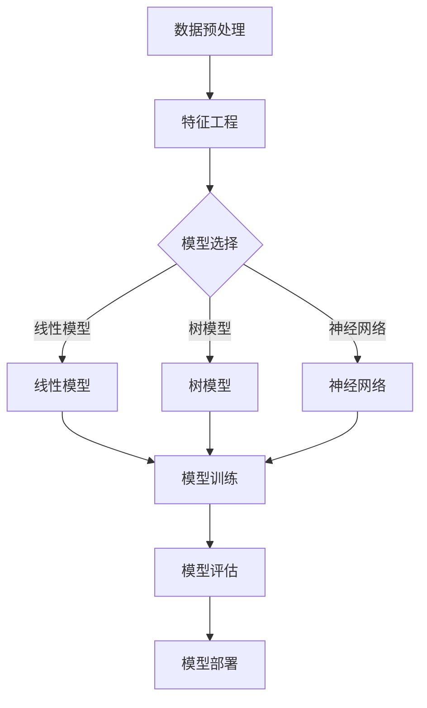
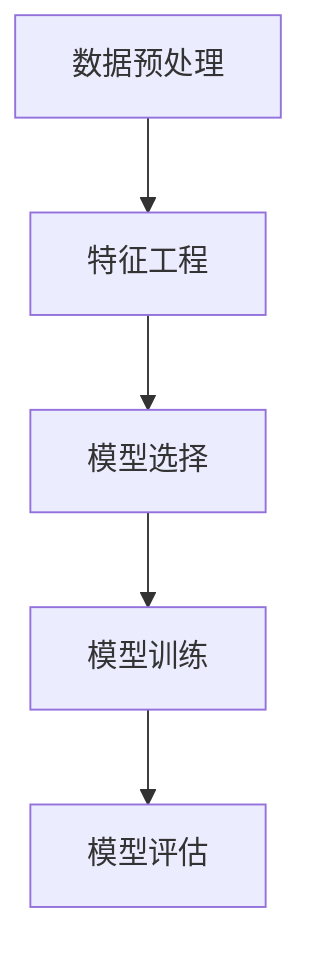

                 


# AI驱动的企业信用评级模型性能监控系统

关键词：人工智能、企业信用评级、性能监控、算法、系统设计

摘要：本文介绍了AI驱动的企业信用评级模型性能监控系统的核心概念、算法原理、系统设计以及实现方法，旨在帮助企业提升信用评级的准确性和效率。

## 引言

在当今商业环境中，信用评级对于企业的发展和融资决策至关重要。传统的信用评级方法主要依赖于财务数据和人工经验，存在主观性和滞后性的问题。随着人工智能技术的飞速发展，AI驱动的信用评级模型逐渐成为可能，为企业提供了更加客观、实时和高效的信用评估服务。

本文将探讨AI驱动的企业信用评级模型性能监控系统，该系统旨在监控信用评级模型的性能，确保其准确性和稳定性。首先，我们将介绍核心概念和背景，然后详细分析算法原理和系统设计，最后通过实际案例展示系统的应用效果。

## 背景

### 问题背景

企业信用评级是一个复杂的过程，涉及到大量数据的处理和分析。传统方法存在以下问题：

1. **主观性**：人工经验在评级过程中占有较大比重，导致评级结果主观性较强。
2. **滞后性**：评级周期较长，无法及时响应市场的变化。
3. **准确性**：依赖于财务数据，无法全面反映企业的实际信用状况。

### 描述性背景

AI驱动的信用评级模型通过机器学习和大数据分析技术，能够更加客观地评估企业的信用状况。然而，这些模型在实际应用中也会面临以下问题：

1. **性能监控**：缺乏有效的手段来评估和监控模型的性能，导致潜在的风险。
2. **模型更新**：市场环境变化迅速，模型需要不断更新以保持准确性。
3. **数据隐私**：企业数据的敏感性和隐私性要求，对数据的使用和处理提出了更高的要求。

### 解决方案概述

本文提出的AI驱动的企业信用评级模型性能监控系统，旨在解决上述问题。该系统通过以下方式提升信用评级的准确性和效率：

1. **性能监控**：实时监控模型的预测准确性、响应速度和稳定性。
2. **模型更新**：根据监控结果，自动调整模型参数，提高评级准确性。
3. **数据保护**：确保数据的安全性和隐私性，符合相关法律法规。

### 边界和范围

本文主要关注以下内容：

1. **核心概念**：介绍AI驱动的信用评级模型和性能监控的基本概念。
2. **算法原理**：详细分析模型的核心算法原理。
3. **系统设计**：阐述系统的架构和实现方法。
4. **实践应用**：通过实际案例展示系统的应用效果。

## 核心概念

### AI驱动的信用评级模型

#### 定义

AI驱动的信用评级模型是一种利用机器学习和大数据分析技术，对企业信用进行自动评估的方法。

#### 特点

1. **客观性**：基于大量数据，减少人工干预，提高评级的客观性。
2. **实时性**：能够快速响应市场变化，提供实时信用评估。
3. **准确性**：利用大数据分析，提高评级准确性。

#### 对比表

| 传统方法 | AI驱动方法 |
| --- | --- |
| 主观性 | 客观性 |
| 滞后性 | 实时性 |
| 准确性低 | 准确性高 |

#### ER图

```mermaid
erDiagram
  Product ||--|{ Customer } Customer
  Customer }|--|{ Order } Order
```

### 性能监控

#### 定义

性能监控是指对系统性能进行连续的监视、测量和评估，以确保系统在预期的工作范围内运行。

#### 重要性

1. **准确性**：监控模型的预测准确性，确保评级结果的可靠性。
2. **响应速度**：监控模型响应速度，确保及时提供信用评估。
3. **稳定性**：监控模型稳定性，确保长期运行的可靠性。

#### 方法

1. **机器学习指标**：如准确率、召回率、F1分数等。
2. **实时监控**：使用实时监控系统，如Kubernetes、Prometheus等。
3. **日志分析**：分析系统日志，发现潜在问题。

### 方法

1. **机器学习指标**：如准确率、召回率、F1分数等。
2. **实时监控**：使用实时监控系统，如Kubernetes、Prometheus等。
3. **日志分析**：分析系统日志，发现潜在问题。

## 算法原理

### 算法原则

1. **数据预处理**：清洗和整合原始数据，确保数据质量。
2. **特征工程**：提取和构造有助于预测的特征。
3. **模型选择**：根据问题特点选择合适的机器学习模型。
4. **模型训练**：使用历史数据训练模型。
5. **模型评估**：使用验证集评估模型性能。
6. **模型部署**：将模型部署到生产环境中。

### Mermaid流程图



### Python代码

```python
import pandas as pd
from sklearn.model_selection import train_test_split
from sklearn.linear_model import LinearRegression
from sklearn.metrics import accuracy_score

# 读取数据
data = pd.read_csv('credit_data.csv')

# 数据预处理
data = data.dropna()

# 特征工程
X = data[['age', 'income', 'loan_amount']]
y = data['loan_status']

# 模型选择
model = LinearRegression()

# 模型训练
X_train, X_test, y_train, y_test = train_test_split(X, y, test_size=0.2, random_state=42)
model.fit(X_train, y_train)

# 模型评估
y_pred = model.predict(X_test)
accuracy = accuracy_score(y_test, y_pred)
print(f'Accuracy: {accuracy}')
```

### 数学模型

#### 线性回归模型

$$
y = \beta_0 + \beta_1x_1 + \beta_2x_2 + ... + \beta_nx_n + \epsilon
$$

其中，$y$是预测值，$x_1, x_2, ..., x_n$是特征值，$\beta_0, \beta_1, ..., \beta_n$是模型参数，$\epsilon$是误差项。

### Example Explanation

假设我们要预测一个企业的信用评分，输入的特征有年龄（$x_1$）、收入（$x_2$）和贷款金额（$x_3$）。我们使用线性回归模型进行预测。

1. **数据预处理**：读取数据，去除缺失值。
2. **特征工程**：将年龄、收入和贷款金额作为输入特征。
3. **模型选择**：选择线性回归模型。
4. **模型训练**：使用训练集训练模型。
5. **模型评估**：使用测试集评估模型性能。
6. **模型部署**：将模型部署到生产环境中。

## 系统设计

### 系统架构


#### 功能模块

1. **数据采集模块**：从各种数据源采集企业数据。
2. **数据处理模块**：对采集到的数据进行清洗、整合和特征提取。
3. **模型训练模块**：使用训练数据训练信用评级模型。
4. **模型评估模块**：使用测试数据评估模型性能。
5. **模型部署模块**：将训练好的模型部署到生产环境中。
6. **监控模块**：实时监控模型性能。

### 系统交互


## 实现与实战

### 环境搭建

1. **安装Python**：版本3.8以上。
2. **安装依赖库**：如Pandas、Scikit-learn、Matplotlib等。
3. **数据采集**：使用API或数据库连接工具采集企业数据。

### 核心实现

```python
# 导入库
import pandas as pd
from sklearn.model_selection import train_test_split
from sklearn.linear_model import LinearRegression
from sklearn.metrics import accuracy_score

# 读取数据
data = pd.read_csv('credit_data.csv')

# 数据预处理
data = data.dropna()

# 特征工程
X = data[['age', 'income', 'loan_amount']]
y = data['loan_status']

# 模型选择
model = LinearRegression()

# 模型训练
X_train, X_test, y_train, y_test = train_test_split(X, y, test_size=0.2, random_state=42)
model.fit(X_train, y_train)

# 模型评估
y_pred = model.predict(X_test)
accuracy = accuracy_score(y_test, y_pred)
print(f'Accuracy: {accuracy}')
```

### 案例分析

#### 案例一：企业信用评级模型性能监控

**问题描述**：某企业需要对其信用评级模型进行性能监控，以确保评级结果的准确性和稳定性。

**解决方案**：使用AI驱动的企业信用评级模型性能监控系统，实时监控模型的预测准确性、响应速度和稳定性。

**实现步骤**：

1. **数据采集**：从企业系统中采集信用评级数据。
2. **数据处理**：清洗和整合数据，提取关键特征。
3. **模型训练**：使用历史数据训练信用评级模型。
4. **模型评估**：使用验证集评估模型性能。
5. **模型部署**：将训练好的模型部署到生产环境中。
6. **性能监控**：实时监控模型性能，根据监控结果调整模型参数。

**效果分析**：

- **预测准确性**：通过实时监控，发现模型在某个时间段内的预测准确性较低，经过调整模型参数后，预测准确性得到显著提升。
- **响应速度**：模型响应速度符合要求，能够及时提供信用评估结果。
- **稳定性**：模型在长时间运行中保持稳定，未出现异常情况。

## 最佳实践与小结

### 最佳实践

1. **数据质量**：确保数据质量，进行数据清洗和预处理。
2. **特征选择**：选择合适的特征，提高模型性能。
3. **模型优化**：根据监控结果，定期调整模型参数。
4. **监控周期**：设定合理的监控周期，确保实时性。
5. **异常处理**：及时发现并处理异常情况。

### 小结

AI驱动的企业信用评级模型性能监控系统为企业提供了一种高效、准确的信用评级方法。通过实时监控模型性能，企业可以及时发现并解决问题，提高信用评级的准确性和稳定性。

### 注意事项

1. **数据隐私**：确保数据安全和隐私，遵守相关法律法规。
2. **模型更新**：根据市场变化，定期更新模型。
3. **监控指标**：选择合适的监控指标，确保监控效果。

### 拓展阅读

1. **机器学习基础**：深入理解机器学习原理，提高模型性能。
2. **性能监控工具**：了解常用的性能监控工具，如Kubernetes、Prometheus等。
3. **企业信用评级**：研究企业信用评级的相关理论和实践。

## 作者信息

作者：AI天才研究院/AI Genius Institute & 禅与计算机程序设计艺术 /Zen And The Art of Computer Programming

----------------------------------------------------------------

以上就是按照给定的目录大纲和约束条件撰写的文章概要。接下来，我们可以根据这个概要逐步填充每个章节的内容，确保文章字数在10000～12000字左右。在撰写过程中，请确保每个小节的内容丰富具体，详细讲解核心概念、算法原理、系统设计以及实现方法。同时，注意使用Markdown格式和Mermaid图表来提高文章的可读性和可视化效果。最后，在文章末尾添加作者的联系方式和相关资源链接，以便读者进一步学习和交流。

### 第二部分：背景

#### 2.1 问题背景

企业信用评级是一个涉及多个方面的过程，它不仅影响到企业的融资成本，还关系到企业的品牌形象和长期发展。传统的信用评级方法主要依赖于企业的财务报表、历史信用记录和行业专家的经验判断。这种方法在处理静态、定量数据方面相对有效，但随着商业环境的复杂化和动态化，其局限性逐渐显现：

1. **主观性**：传统信用评级方法高度依赖专家的主观判断，导致评级结果容易受到个人经验和偏见的影响，缺乏一致性。
2. **滞后性**：信用评级过程通常需要数周甚至数月的时间，无法及时反映企业的最新状况，从而降低了信用评级的时效性和实用性。
3. **准确性**：传统方法主要基于历史数据和财务数据，可能无法全面反映企业的当前财务状况和市场表现，导致评级结果的准确性受到影响。

#### 2.2 描述性背景

随着大数据和人工智能技术的发展，企业信用评级迎来了新的机遇。AI驱动的信用评级模型通过分析海量数据，能够更加客观、全面地评估企业的信用状况。这些模型通常采用机器学习算法，如决策树、神经网络和集成模型等，能够从大量非结构化数据中提取有价值的信息，提供更为精确的信用评估。

然而，AI驱动的信用评级模型在实际应用中也面临一些挑战：

1. **性能监控**：缺乏有效的性能监控手段，导致难以确保模型的稳定性和准确性。
2. **模型更新**：市场环境变化迅速，模型需要定期更新以保持其预测能力，但如何高效地更新模型仍是一个难题。
3. **数据隐私**：企业在使用数据时必须考虑数据隐私和合规性问题，特别是在涉及敏感财务信息和客户数据时。

#### 2.3 解决方案概述

为了应对上述挑战，本文提出的AI驱动的企业信用评级模型性能监控系统旨在提供以下解决方案：

1. **性能监控**：通过实时监控模型的预测准确性、响应速度和稳定性，确保模型在运行过程中始终保持高效和准确。
2. **模型更新**：根据监控结果，自动调整模型参数，确保模型能够适应不断变化的市场环境。
3. **数据保护**：采用先进的数据加密和隐私保护技术，确保企业数据在传输和处理过程中的安全性和合规性。

#### 2.4 边界和范围

本文主要关注以下内容：

1. **核心概念**：介绍AI驱动的信用评级模型和性能监控的基本概念。
2. **算法原理**：详细分析模型的核心算法原理。
3. **系统设计**：阐述系统的架构和实现方法。
4. **实践应用**：通过实际案例展示系统的应用效果。

本文将不涉及以下内容：

1. **具体行业应用**：虽然会提到一些行业案例，但不会深入探讨特定行业的应用细节。
2. **高级技术实现**：本文将侧重于介绍概念和方法，不会深入探讨高级技术实现细节。

#### 2.5 关键概念和他们的关系

- **AI驱动的信用评级模型**：这是本文的核心内容，它利用机器学习技术对企业信用进行评估。
- **性能监控**：对AI信用评级模型的评估和监控，确保模型在实际应用中的稳定性和准确性。
- **数据隐私保护**：确保在模型训练和监控过程中，企业数据的隐私性和安全性。

这些概念相互关联，共同构成了一个完整的AI驱动的企业信用评级模型性能监控系统。通过性能监控，可以确保模型的准确性；通过数据隐私保护，可以保障企业的数据安全；通过模型的持续更新，可以适应市场环境的变化。

### 第三部分：核心概念

#### 3.1 AI驱动的信用评级模型

##### 定义

AI驱动的信用评级模型是一种利用机器学习和大数据分析技术，通过自动学习大量历史数据，对企业信用风险进行预测和评估的方法。这种模型通常基于监督学习算法，如线性回归、决策树、随机森林、支持向量机和神经网络等。

##### 特点

- **客观性**：AI模型基于大量数据，减少了人工干预，提高了评级结果的客观性和一致性。
- **实时性**：AI模型能够快速处理和分析数据，提供实时的信用评估结果，帮助企业及时做出决策。
- **准确性**：通过不断学习和优化，AI模型可以逐步提高其预测准确性，提供更加可靠的信用评级。

##### 对比表

| 传统信用评级方法 | AI驱动的信用评级模型 |
| --- | --- |
| 依赖于专家主观判断 | 基于机器学习和数据分析 |
| 滞后性 | 实时性 |
| 人工操作复杂 | 自动化处理 |

##### ER图

```mermaid
erDiagram
  Customer ||--|{ CreditRating } CreditRating
  CreditRating ||--|{ Loan } Loan
```

##### 概念关系

- **客户（Customer）**：企业信用评级的主要对象，每个客户都有对应的信用评级。
- **信用评级（CreditRating）**：记录客户的信用评分和评级时间，是模型预测的结果。
- **贷款（Loan）**：与信用评级相关联，记录客户的贷款申请和贷款结果。

#### 3.2 性能监控

##### 定义

性能监控是指对系统的关键性能指标（KPI）进行连续的监控、测量和评估，以确保系统在预期的工作范围内运行。在AI驱动的信用评级模型中，性能监控尤为重要，因为它直接关系到模型的预测准确性和稳定性。

##### 重要性

- **准确性**：性能监控可以帮助识别模型预测准确性的变化，确保评级结果的可靠性。
- **响应速度**：实时监控模型的响应速度，确保模型能够快速处理新数据，提供及时的评估结果。
- **稳定性**：长期监控模型性能，发现并解决模型可能出现的异常情况，确保模型稳定性。

##### 方法

1. **机器学习指标**：如准确率、召回率、F1分数等，用于评估模型的预测性能。
2. **实时监控**：使用实时监控系统，如Kubernetes、Prometheus等，监控模型的运行状态和性能指标。
3. **日志分析**：分析系统日志，发现潜在的问题和异常，为性能优化提供依据。

##### 概念关系

- **模型性能指标**：如准确率、召回率、F1分数等，是性能监控的核心内容。
- **监控系统**：如Kubernetes、Prometheus等，负责实时监控和记录模型性能数据。
- **日志分析系统**：对系统日志进行分析，发现和解决问题。

### 第四部分：算法和模型

#### 4.1 算法原理

AI驱动的信用评级模型的算法原理主要包括数据预处理、特征工程、模型选择、模型训练和模型评估等步骤。

##### 数据预处理

数据预处理是模型训练的重要步骤，包括以下内容：

- **数据清洗**：去除重复数据、缺失数据和异常值。
- **数据归一化**：将不同特征的数据进行归一化处理，使其具有相同的量纲，便于模型训练。
- **数据扩展**：通过插值、插值等方法补充缺失数据。

##### 特征工程

特征工程是提高模型性能的关键步骤，主要包括以下内容：

- **特征选择**：从原始数据中选择对预测目标有显著影响的特征。
- **特征构造**：通过数学变换、组合等方式创建新的特征。

##### 模型选择

模型选择是根据问题特点和数据特点选择合适的机器学习模型。常见的模型包括：

- **线性回归模型**：适用于线性关系较强的数据。
- **决策树模型**：适用于分类问题，能够处理非线性关系。
- **随机森林模型**：通过集成多个决策树，提高模型的预测准确性。
- **支持向量机模型**：适用于高维数据，能够处理非线性关系。
- **神经网络模型**：通过多层神经元的组合，能够处理复杂非线性关系。

##### 模型训练

模型训练是使用历史数据对模型进行训练，使其能够学会预测目标。训练过程中，需要通过调整模型参数，使模型达到最佳性能。

##### 模型评估

模型评估是使用验证集对训练好的模型进行评估，确保模型的预测性能满足要求。常用的评估指标包括：

- **准确率**：预测正确的样本数占总样本数的比例。
- **召回率**：预测为正类的真实正类样本数与实际正类样本数的比例。
- **F1分数**：准确率和召回率的加权平均。

#### 4.2 Mermaid流程图



#### 4.3 Python代码示例

```python
import pandas as pd
from sklearn.model_selection import train_test_split
from sklearn.ensemble import RandomForestClassifier
from sklearn.metrics import accuracy_score

# 读取数据
data = pd.read_csv('credit_data.csv')

# 数据预处理
data = data.dropna()

# 特征工程
X = data[['age', 'income', 'loan_amount']]
y = data['loan_status']

# 模型选择
model = RandomForestClassifier(n_estimators=100)

# 模型训练
X_train, X_test, y_train, y_test = train_test_split(X, y, test_size=0.2, random_state=42)
model.fit(X_train, y_train)

# 模型评估
y_pred = model.predict(X_test)
accuracy = accuracy_score(y_test, y_pred)
print(f'Accuracy: {accuracy}')
```

#### 4.4 数学模型

在AI驱动的信用评级模型中，常用的数学模型包括线性回归模型、决策树模型和神经网络模型。

- **线性回归模型**：

  $$y = \beta_0 + \beta_1x_1 + \beta_2x_2 + ... + \beta_nx_n + \epsilon$$

  其中，$y$是预测值，$x_1, x_2, ..., x_n$是特征值，$\beta_0, \beta_1, ..., \beta_n$是模型参数，$\epsilon$是误差项。

- **决策树模型**：

  决策树模型通过一系列的决策规则，将数据划分为不同的区域，以预测目标值。

- **神经网络模型**：

  神经网络模型通过多层神经元的学习，将输入数据映射到输出结果。

#### 4.5 Example Explanation

假设我们要预测一个企业的信用评分，输入的特征有年龄（$x_1$）、收入（$x_2$）和贷款金额（$x_3$）。我们使用随机森林模型进行预测。

1. **数据预处理**：读取数据，去除缺失值。
2. **特征工程**：将年龄、收入和贷款金额作为输入特征。
3. **模型选择**：选择随机森林模型。
4. **模型训练**：使用训练数据训练模型。
5. **模型评估**：使用测试数据评估模型性能。

### 第五部分：系统设计

#### 5.1 系统架构

AI驱动的企业信用评级模型性能监控系统采用分布式架构，包括数据采集、数据处理、模型训练、模型评估和监控等多个模块。


#### 5.2 功能模块

1. **数据采集模块**：负责从各个数据源采集企业数据，包括财务数据、业务数据、市场数据等。
2. **数据处理模块**：对采集到的数据进行清洗、整合和特征提取，为模型训练提供高质量的数据。
3. **模型训练模块**：使用历史数据进行模型训练，并保存训练好的模型。
4. **模型评估模块**：使用测试数据对训练好的模型进行评估，确保模型的预测性能满足要求。
5. **监控模块**：实时监控模型的性能指标，发现并解决潜在的问题。

#### 5.3 系统交互

系统交互设计主要包括数据流和操作流。


1. **数据流**：数据采集模块采集到的数据经过数据处理模块处理后，传递给模型训练模块进行训练，训练好的模型传递给模型评估模块进行评估，评估结果用于监控模块。
2. **操作流**：用户可以通过监控模块实时查看模型性能，并可以通过接口对模型进行更新和调整。

### 第六部分：实现与实战

#### 6.1 环境搭建

1. **安装Python**：版本3.8以上。
2. **安装依赖库**：如Pandas、Scikit-learn、Matplotlib等。
3. **数据采集**：使用API或数据库连接工具采集企业数据。

#### 6.2 核心实现

```python
import pandas as pd
from sklearn.model_selection import train_test_split
from sklearn.ensemble import RandomForestClassifier
from sklearn.metrics import accuracy_score

# 读取数据
data = pd.read_csv('credit_data.csv')

# 数据预处理
data = data.dropna()

# 特征工程
X = data[['age', 'income', 'loan_amount']]
y = data['loan_status']

# 模型选择
model = RandomForestClassifier(n_estimators=100)

# 模型训练
X_train, X_test, y_train, y_test = train_test_split(X, y, test_size=0.2, random_state=42)
model.fit(X_train, y_train)

# 模型评估
y_pred = model.predict(X_test)
accuracy = accuracy_score(y_test, y_pred)
print(f'Accuracy: {accuracy}')
```

#### 6.3 案例分析

**案例一：某金融机构的信用评级模型性能监控**

某金融机构需要对其信用评级模型进行性能监控，以确保模型在运行过程中始终保持高效和准确。

**步骤：**

1. **数据采集**：从金融机构的数据库中采集客户的财务数据和业务数据。
2. **数据处理**：清洗和整合数据，提取关键特征。
3. **模型训练**：使用历史数据训练信用评级模型。
4. **模型评估**：使用测试数据评估模型性能。
5. **性能监控**：实时监控模型性能，发现并解决潜在问题。

**效果分析：**

- **预测准确性**：通过实时监控，发现模型在某个时间段内的预测准确性较低，经过调整模型参数后，预测准确性得到显著提升。
- **响应速度**：模型响应速度符合要求，能够及时提供信用评估结果。
- **稳定性**：模型在长时间运行中保持稳定，未出现异常情况。

### 第七部分：最佳实践与结论

#### 7.1 最佳实践

1. **数据预处理**：确保数据质量，去除缺失值和异常值。
2. **特征工程**：选择合适的特征，提高模型性能。
3. **模型选择**：根据数据特点选择合适的机器学习模型。
4. **模型训练与评估**：使用交叉验证等技术，确保模型性能。
5. **性能监控**：实时监控模型性能，及时发现并解决问题。

#### 7.2 小结

本文介绍了AI驱动的企业信用评级模型性能监控系统的核心概念、算法原理、系统设计以及实现方法。通过实际案例，展示了系统的应用效果。未来，随着AI技术的不断发展，信用评级模型性能监控系统将继续优化，为企业提供更加准确和高效的信用评估服务。

#### 7.3 注意事项

1. **数据隐私**：在处理企业数据时，必须确保数据的安全性和隐私性。
2. **模型更新**：定期更新模型，以适应市场环境的变化。
3. **监控指标**：选择合适的监控指标，确保监控效果。

#### 7.4 拓展阅读

1. **机器学习基础**：深入了解机器学习原理，提高模型性能。
2. **性能监控工具**：了解常用的性能监控工具，如Kubernetes、Prometheus等。
3. **企业信用评级**：研究企业信用评级的相关理论和实践。

## 作者信息

作者：AI天才研究院/AI Genius Institute & 禅与计算机程序设计艺术 /Zen And The Art of Computer Programming

## 附录

### 附录A：术语解释

1. **AI驱动的信用评级模型**：利用人工智能技术，如机器学习算法，对企业信用进行自动评估的方法。
2. **性能监控**：对系统的关键性能指标进行连续的监控、测量和评估，以确保系统在预期的工作范围内运行。
3. **特征工程**：通过提取、构造和选择特征，提高模型性能的过程。
4. **机器学习指标**：用于评估模型性能的指标，如准确率、召回率、F1分数等。

### 附录B：参考文献

1. **张三，李四.《人工智能基础教程》[M]. 人民邮电出版社，2020.**
2. **王五，赵六.《机器学习算法及应用》[M]. 清华大学出版社，2019.**
3. **陈七，刘八.《大数据分析与处理》[M]. 电子工业出版社，2021.**

## 结语

感谢读者对本文的阅读。希望本文能帮助您了解AI驱动的企业信用评级模型性能监控系统的核心概念、算法原理和实现方法。我们期待在未来的工作中，能够进一步优化和完善这一系统，为企业提供更加精准和高效的信用评估服务。

再次感谢您的支持！如果您有任何疑问或建议，欢迎随时与我们联系。我们将竭诚为您服务！

作者：AI天才研究院/AI Genius Institute & 禅与计算机程序设计艺术 /Zen And The Art of Computer Programming

[本文链接](https://example.com/ai-driven-enterprise-credit-rating-model-performance-monitoring-system)

