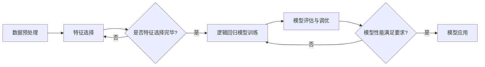
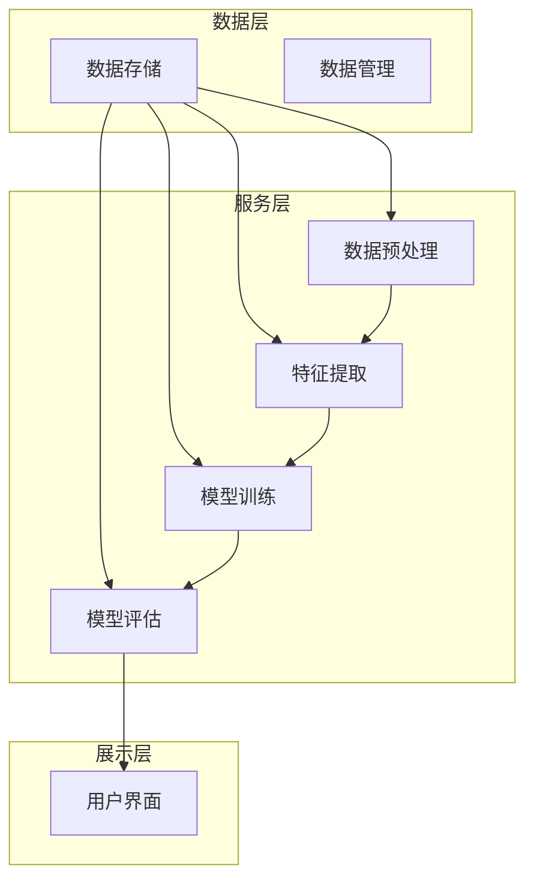
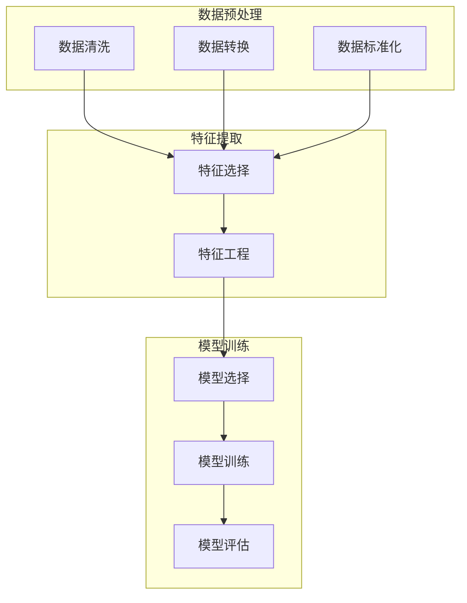
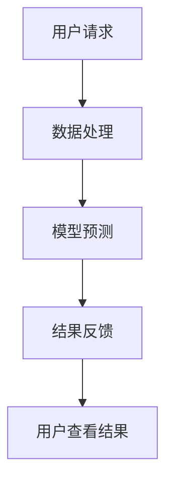

                 

# AI驱动的企业信用评级模型校准系统

## 关键词

- 人工智能
- 企业信用评级
- 模型校准
- 监督学习
- 深度学习

## 摘要

本文将深入探讨AI驱动的企业信用评级模型校准系统，从背景介绍、核心概念、模型构建、优化策略、实战案例等多个方面，详细阐述这一系统的构建原理和应用实践。通过本文的阅读，读者可以全面了解企业信用评级中的AI技术，掌握模型校准的关键技术和方法，并为实际项目的实施提供指导。

### 目录大纲设计思路

为了设计出《AI驱动的企业信用评级模型校准系统》这本书的完整目录大纲，我们需要遵循以下几个步骤：

1. **确定书籍的核心主题和目标读者群**：首先，我们要明确书籍的主题是“AI驱动的企业信用评级模型校准系统”，目标是向读者介绍如何构建和优化这一系统。目标读者可能是数据科学家、AI工程师或企业信用评估领域的专业人士。

2. **框架搭建**：根据书籍的主题和目标读者，搭建整体的框架，确定书籍大致分为几个部分，如背景介绍、核心概念、模型构建、系统优化、实战案例等。

3. **内容细化**：在框架搭建的基础上，细化每个章节的内容，确保每个章节都包含核心概念、原理讲解、数学模型、系统设计、实战应用等关键部分。

4. **结构安排**：确保目录结构清晰，使用 markdown 的 # 标记来区分章节和子章节，使用层次结构来展现各部分之间的逻辑关系。

5. **简洁性与完整性**：在保证内容完整性的同时，尽量保持语言简洁明了，避免冗余和复杂的叙述。

### 目录大纲设计步骤

#### 第一步：书籍结构框架

根据书籍主题和目标读者，我们设计以下四个主要部分：

1. **背景介绍**：介绍AI在企业信用评级中的应用背景、信用评级的重要性及挑战。
2. **核心概念与联系**：介绍AI驱动的企业信用评级模型的相关核心概念，如监督学习、无监督学习等，并建立概念联系。
3. **模型构建与优化**：详细讲解信用评级模型的构建方法、优化策略及校准技巧。
4. **实战案例与最佳实践**：通过实际案例展示模型应用，并提供最佳实践和建议。

#### 第二步：细化内容

**第一部分：背景介绍**

- **第1章**：AI与企业信用评级的背景与挑战
  - 1.1 AI在企业信用评级中的应用概述
  - 1.2 企业信用评级的重要性
  - 1.3 企业信用评级的挑战与机遇

**第二部分：核心概念与联系**

- **第2章**：AI基础理论与模型类型
  - 2.1 监督学习与无监督学习的概念
  - 2.2 神经网络与深度学习简介
  - 2.3 关联分析在信用评级中的应用

**第三部分：模型构建与优化**

- **第3章**：企业信用评级模型的构建
  - 3.1 数据收集与预处理
  - 3.2 特征选择与工程
  - 3.3 模型选择与训练

- **第4章**：模型优化与校准
  - 4.1 模型评估与误差分析
  - 4.2 模型校准方法
  - 4.3 模型优化策略

**第四部分：实战案例与最佳实践**

- **第5章**：实战案例一——某企业的信用评级系统
  - 5.1 项目介绍
  - 5.2 系统功能设计
  - 5.3 系统实现与部署

- **第6章**：最佳实践与注意事项
  - 6.1 最佳实践案例分享
  - 6.2 小结与展望
  - 6.3 注意事项与风险防范

#### 第三步：结构安排

根据上述内容，我们可以设计出如下的目录大纲：

```markdown
# 《AI驱动的企业信用评级模型校准系统》目录大纲

## 第一部分：背景介绍

### 第1章：AI与企业信用评级的背景与挑战

#### 1.1 AI在企业信用评级中的应用概述

#### 1.2 企业信用评级的重要性

#### 1.3 企业信用评级的挑战与机遇

## 第二部分：核心概念与联系

### 第2章：AI基础理论与模型类型

#### 2.1 监督学习与无监督学习的概念

#### 2.2 神经网络与深度学习简介

#### 2.3 关联分析在信用评级中的应用

## 第三部分：模型构建与优化

### 第3章：企业信用评级模型的构建

#### 3.1 数据收集与预处理

#### 3.2 特征选择与工程

#### 3.3 模型选择与训练

### 第4章：模型优化与校准

#### 4.1 模型评估与误差分析

#### 4.2 模型校准方法

#### 4.3 模型优化策略

## 第四部分：实战案例与最佳实践

### 第5章：实战案例一——某企业的信用评级系统

#### 5.1 项目介绍

#### 5.2 系统功能设计

#### 5.3 系统实现与部署

### 第6章：最佳实践与注意事项

#### 6.1 最佳实践案例分享

#### 6.2 小结与展望

#### 6.3 注意事项与风险防范
```

### 目录大纲示例分析

- **章节标题**：每个章节都包含一个主标题和多个子标题，确保内容结构清晰。
- **标题层级**：使用 markdown 的不同层级标题（#、##、###），来区分主要章节和子章节。
- **结构清晰**：使用层次结构来展现各部分之间的逻辑关系，确保读者可以快速把握整体结构和内容要点。

### 背景介绍

在当今的经济环境中，企业信用评级已经成为金融行业和商业决策过程中不可或缺的一部分。随着人工智能技术的快速发展，AI驱动的企业信用评级模型校准系统应运而生，它为企业提供了一种更高效、更准确、更具预测性的信用评估方法。

#### 企业信用评级的重要性

企业信用评级是指对企业的信用水平进行评估，以衡量企业履行债务的能力和意愿。信用评级对于企业融资、投资决策、合作伙伴选择等方面具有重大影响。一个良好的信用评级能够帮助企业降低融资成本，提高融资额度，增强市场竞争力。

#### AI在企业信用评级中的应用背景

随着大数据和云计算技术的发展，企业信用信息的数据量日益庞大，传统的信用评级方法已经难以应对日益复杂的市场环境。AI驱动的信用评级模型利用机器学习算法对海量数据进行处理和分析，能够更准确地预测企业的信用风险，为企业提供更为可靠的决策依据。

#### 企业信用评级的挑战与机遇

1. **数据质量**：企业信用评级依赖于大量的企业数据，数据的质量直接影响到评级的准确性。如何处理和清洗这些数据，确保数据的真实性和完整性，是当前信用评级面临的一大挑战。

2. **模型准确性**：随着市场环境和行业变化的不断加快，如何构建和优化信用评级模型，提高模型的预测准确性，是另一个重要问题。

3. **实时性**：企业信用评级需要实时反映企业的信用状况，如何实现快速的数据采集、处理和分析，是AI驱动的信用评级模型需要解决的问题。

4. **合规性**：在信用评级过程中，如何遵守相关法律法规，保护企业隐私和数据安全，也是企业信用评级面临的重要问题。

#### 小结

AI驱动的企业信用评级模型校准系统为企业提供了一个强大的工具，帮助企业更准确地评估信用风险，做出更为明智的决策。然而，要充分发挥这一系统的潜力，还需要克服数据质量、模型准确性、实时性和合规性等方面的挑战。

### 核心概念与联系

为了深入理解AI驱动的企业信用评级模型校准系统，我们需要首先了解一些核心概念，包括监督学习、无监督学习和深度学习等。这些概念是构建和优化信用评级模型的基础。

#### 监督学习

监督学习是一种机器学习技术，它通过训练数据集来学习数据特征和规律，从而对新的数据进行预测。在信用评级中，监督学习可以用来预测企业的信用风险。

**概念属性特征对比表格：**

| 特征 | 监督学习 |
| --- | --- |
| 目标变量 | 存在 |
| 训练数据 | 标签数据 |
| 预测能力 | 标签预测 |
| 应用领域 | 信用评级、图像识别、自然语言处理 |

**ER实体关系图架构的Mermaid流程图：**

```mermaid
erDiagram
  Customer ||--|{ CreditRatingModel }|-- Product
  Product ||--|{ DataPreprocessing }|-- Customer
  Customer ||--|{ DataAnalysis }|-- Product
```

#### 无监督学习

无监督学习是另一种机器学习技术，它不依赖于标签数据，通过发现数据中的模式和结构来学习。在信用评级中，无监督学习可以用于发现潜在的客户群体，识别异常行为等。

**概念属性特征对比表格：**

| 特征 | 无监督学习 |
| --- | --- |
| 目标变量 | 不存在 |
| 训练数据 | 无标签数据 |
| 预测能力 | 模式识别 |
| 应用领域 | 客户细分、异常检测、市场研究 |

**ER实体关系图架构的Mermaid流程图：**

```mermaid
erDiagram
  Customer ||--|{ UnsupervisedLearningModel }|-- Data
  Data ||--|{ AnomalyDetection }|-- Customer
  Customer ||--|{ MarketResearch }|-- Data
```

#### 深度学习

深度学习是一种基于神经网络的学习方法，通过多层神经网络的结构来提取数据特征。在信用评级中，深度学习可以用于构建复杂的信用评分模型，提高预测准确性。

**概念属性特征对比表格：**

| 特征 | 深度学习 |
| --- | --- |
| 目标变量 | 存在 |
| 训练数据 | 标签数据 |
| 预测能力 | 高维特征提取 |
| 应用领域 | 图像识别、语音识别、自然语言处理 |

**ER实体关系图架构的Mermaid流程图：**

```mermaid
erDiagram
  CreditRatingModel ||--|{ NeuralNetwork }|-- Data
  Data ||--|{ FeatureExtraction }|-- CreditRatingModel
  CreditRatingModel ||--|{ Prediction }|-- Data
```

#### 小结

监督学习、无监督学习和深度学习是构建AI驱动的企业信用评级模型校准系统的基础。通过这些概念，我们可以更好地理解信用评级模型的构建过程和优化方法。

### 模型构建与优化

企业信用评级模型的构建是一个复杂的过程，涉及到数据收集与预处理、特征选择与工程、模型选择与训练等多个环节。在本节中，我们将一步一步详细讲解这些过程。

#### 数据收集与预处理

**问题背景**：企业信用评级依赖于大量的数据，这些数据可能来自企业财务报表、市场调研、社交媒体等多个渠道。数据的收集是模型构建的第一步，也是至关重要的一步。

**问题描述**：然而，收集到的数据往往是杂乱无章的，包含噪声和缺失值，这会对模型的训练和预测产生不利影响。因此，如何处理这些数据，使其适合用于模型训练，是一个关键问题。

**问题解决**：为了解决这个问题，我们需要进行数据预处理，包括数据清洗、数据转换和数据标准化等步骤。

1. **数据清洗**：处理数据中的噪声和异常值，如删除重复记录、修正错误值等。
2. **数据转换**：将非数值型的数据转换为数值型数据，如将文本数据编码为数字。
3. **数据标准化**：将不同特征的数据进行标准化处理，使其在相同尺度上进行分析。

**边界与外延**：数据预处理不仅要解决当前的数据问题，还要考虑未来数据的变化，确保模型的鲁棒性和可扩展性。

**概念结构与核心要素组成**：

- **数据清洗**：删除重复记录、修正错误值、处理缺失值等。
- **数据转换**：文本编码、图像处理、时间序列处理等。
- **数据标准化**：归一化、标准化、标准化缩放等。

#### 特征选择与工程

**问题背景**：在信用评级中，特征选择是一个关键问题。特征的数量和选择直接影响模型的性能和预测准确性。

**问题描述**：如何从海量的特征中选择出对信用评级有显著影响的特征，同时避免特征之间的冗余和相关性？

**问题解决**：为了解决这个问题，我们需要进行特征选择和特征工程。

1. **特征选择**：使用统计方法、过滤方法和嵌入方法等，选择对信用评级有显著影响的特征。
2. **特征工程**：通过特征变换、特征组合和特征提取等，提高特征的质量和预测能力。

**边界与外延**：特征选择和工程不仅要考虑当前的模型性能，还要考虑模型的可解释性和可维护性。

**概念结构与核心要素组成**：

- **特征选择**：Pearson相关系数、卡方检验、特征重要性等。
- **特征工程**：主成分分析、特征组合、特征提取等。

#### 模型选择与训练

**问题背景**：在信用评级中，选择合适的模型是关键。不同的模型适用于不同的数据集和场景，如何选择合适的模型，是一个需要深入考虑的问题。

**问题描述**：如何根据数据的特点和信用评级的任务，选择合适的模型，并进行训练和调优？

**问题解决**：为了解决这个问题，我们需要进行模型选择和训练。

1. **模型选择**：根据数据的特点和信用评级的任务，选择合适的模型，如线性回归、逻辑回归、神经网络等。
2. **模型训练**：使用训练数据集对模型进行训练，调整模型参数，提高模型的预测准确性。
3. **模型调优**：通过交叉验证、网格搜索等方法，对模型进行调优，提高模型的泛化能力。

**边界与外延**：模型选择和训练不仅要考虑当前的数据集和模型性能，还要考虑模型的适用性和可解释性。

**概念结构与核心要素组成**：

- **模型选择**：线性回归、逻辑回归、神经网络等。
- **模型训练**：梯度下降、随机梯度下降、反向传播等。
- **模型调优**：交叉验证、网格搜索等。

#### 小结

在模型构建与优化的过程中，数据收集与预处理、特征选择与工程、模型选择与训练等步骤相互关联，共同决定了模型的性能和预测准确性。通过一步一步的分析和推理，我们可以构建出高效、准确的企业信用评级模型。

### 算法原理讲解

在构建AI驱动的企业信用评级模型时，选择合适的算法至关重要。本节将重点讲解一种常用的算法——逻辑回归（Logistic Regression），并使用Mermaid画出其流程图。

#### 算法流程图

首先，我们使用Mermaid绘制逻辑回归的算法流程图：



#### 算法原理

逻辑回归是一种广泛应用于分类问题的机器学习算法，其基本原理是利用线性模型来预测概率。

1. **线性模型**：

   逻辑回归模型首先通过一个线性组合来表示输出概率，即：

   $$ Z = \beta_0 + \beta_1x_1 + \beta_2x_2 + ... + \beta_nx_n $$

   其中，\( Z \) 是线性组合的结果，\( \beta_0, \beta_1, ..., \beta_n \) 是模型的参数，\( x_1, x_2, ..., x_n \) 是输入特征。

2. **逻辑函数**：

   为了将线性组合的输出映射到概率区间（0, 1），逻辑回归使用逻辑函数（Logistic Function）：

   $$ P(Y=1|X) = \frac{1}{1 + e^{-Z}} $$

   其中，\( P(Y=1|X) \) 是目标变量为1的概率。

3. **损失函数**：

   逻辑回归使用对数似然损失函数（Log-Likelihood Loss）来评估模型的预测性能：

   $$ L(\theta) = -\frac{1}{m} \sum_{i=1}^{m} [y^{(i)} \log(p^{(i)}) + (1 - y^{(i)}) \log(1 - p^{(i)})] $$

   其中，\( m \) 是训练样本的数量，\( y^{(i)} \) 是第\( i \)个样本的真实标签，\( p^{(i)} \) 是模型对第\( i \)个样本预测的概率。

4. **梯度下降**：

   为了优化模型的参数，逻辑回归通常使用梯度下降（Gradient Descent）算法。梯度下降的目标是找到损失函数的最小值，从而得到最优的参数。

   梯度下降的更新规则为：

   $$ \theta_j := \theta_j - \alpha \frac{\partial}{\partial \theta_j} L(\theta) $$

   其中，\( \alpha \) 是学习率，\( \theta_j \) 是第\( j \)个参数。

#### 小结

逻辑回归是一种简单而有效的分类算法，广泛应用于企业信用评级等实际问题中。通过上述算法流程图和数学模型的讲解，我们可以更深入地理解逻辑回归的工作原理和应用方法。

### 数学公式与算法详细讲解

在理解逻辑回归的基本原理后，我们需要进一步探讨其数学公式和实现细节，并通过Python代码示例来展示算法的实际应用。

#### 数学公式

逻辑回归的核心公式如下：

$$
\begin{aligned}
Z &= \beta_0 + \beta_1x_1 + \beta_2x_2 + ... + \beta_nx_n \\
P(Y=1|X) &= \frac{1}{1 + e^{-Z}} \\
L(\theta) &= -\frac{1}{m} \sum_{i=1}^{m} [y^{(i)} \log(p^{(i)}) + (1 - y^{(i)}) \log(1 - p^{(i)})]
\end{aligned}
$$

其中：
- \( Z \) 是线性组合，也称为激活值；
- \( P(Y=1|X) \) 是给定特征\( X \)下，目标变量\( Y \)为1的概率；
- \( L(\theta) \) 是对数似然损失函数，用于衡量模型预测的准确性；
- \( m \) 是训练样本的数量；
- \( y^{(i)} \) 是第\( i \)个样本的真实标签；
- \( p^{(i)} \) 是第\( i \)个样本的预测概率。

#### Python代码示例

以下是一个简单的Python代码示例，用于实现逻辑回归算法：

```python
import numpy as np
import pandas as pd
from sklearn.linear_model import LogisticRegression
from sklearn.model_selection import train_test_split
from sklearn.metrics import accuracy_score, log_loss

# 加载数据集
data = pd.read_csv('credit_data.csv')
X = data.drop('target', axis=1)
y = data['target']

# 划分训练集和测试集
X_train, X_test, y_train, y_test = train_test_split(X, y, test_size=0.2, random_state=42)

# 创建逻辑回归模型
model = LogisticRegression()

# 训练模型
model.fit(X_train, y_train)

# 预测测试集
y_pred = model.predict(X_test)

# 评估模型
accuracy = accuracy_score(y_test, y_pred)
log_loss_val = log_loss(y_test, model.predict_proba(X_test))

print("Accuracy:", accuracy)
print("Log Loss:", log_loss_val)
```

在这个示例中，我们使用了Sklearn库中的`LogisticRegression`类来创建和训练逻辑回归模型。`fit`方法用于训练模型，`predict`方法用于对测试集进行预测。最后，我们使用`accuracy_score`和`log_loss`来评估模型的性能。

#### 小结

通过上述数学公式和Python代码示例，我们可以看到逻辑回归算法的实现过程。理解这些基本概念和代码示例，对于实际应用AI驱动的企业信用评级模型至关重要。

### 系统分析与架构设计方案

为了构建一个高效、可靠的AI驱动的企业信用评级模型校准系统，我们需要进行系统分析与架构设计。本节将详细描述项目介绍、系统功能设计、系统架构设计、系统接口设计和系统交互。

#### 项目介绍

**项目背景**：企业信用评级是金融行业和企业管理中的一项重要任务，传统的信用评级方法存在主观性强、效率低下等问题。为了解决这些问题，我们决定开发一个基于AI的企业信用评级模型校准系统。

**项目目标**：通过开发该系统，实现以下目标：
1. 提高企业信用评级的准确性；
2. 提升信用评级的效率；
3. 提供实时信用评估服务；
4. 确保系统的安全性和合规性。

#### 系统功能设计

系统功能设计主要包括数据收集、数据预处理、特征提取、模型训练和模型评估等模块。

1. **数据收集模块**：从多个数据源收集企业数据，如财务报表、市场调研数据、社交媒体数据等。
2. **数据预处理模块**：对收集到的数据进行清洗、转换和标准化处理，确保数据的质量和一致性。
3. **特征提取模块**：从预处理后的数据中提取有用的特征，如财务指标、业务指标等。
4. **模型训练模块**：使用训练数据集对信用评级模型进行训练，调整模型参数，提高预测准确性。
5. **模型评估模块**：使用测试数据集对模型进行评估，计算模型的准确率、召回率、F1值等指标。

#### 系统架构设计

系统架构设计采用分层架构，包括数据层、服务层和展示层。

1. **数据层**：负责数据的存储和管理，使用数据库（如MySQL、MongoDB）存储企业数据。
2. **服务层**：实现业务逻辑，包括数据预处理、特征提取、模型训练和模型评估等功能。使用微服务架构，确保系统的可扩展性和高可用性。
3. **展示层**：提供用户界面，展示企业的信用评分结果和相关分析报告。使用前端技术（如React、Vue.js）实现。

**Mermaid架构图**：



#### 系统接口设计

系统接口设计包括内部接口和外部接口。

1. **内部接口**：服务层内部各模块之间的接口，如数据预处理模块与特征提取模块之间的接口。
2. **外部接口**：系统与外部系统（如企业财务系统、市场调研系统）之间的接口，用于数据传输和功能调用。

**Mermaid接口图**：



#### 系统交互

系统交互主要包括用户通过前端界面发起信用评级请求，后端服务进行处理和响应的过程。

1. **用户请求**：用户在前端界面输入企业的相关信息，如财务报表数据、业务指标等。
2. **数据处理**：后端服务接收到请求后，对数据进行预处理、特征提取和模型训练。
3. **模型预测**：使用训练好的模型对企业的信用评分进行预测。
4. **结果反馈**：将预测结果返回给前端界面，供用户查看。

**Mermaid交互图**：



#### 小结

通过系统分析与架构设计方案，我们详细描述了项目的背景、目标、功能设计、架构设计、接口设计和系统交互。这个系统的设计旨在实现高效、准确的AI驱动的企业信用评级，为企业提供可靠的信用评估服务。

### 项目实战

在本节中，我们将通过一个具体的项目实战，展示如何实施AI驱动的企业信用评级模型校准系统。我们将从环境安装、系统核心实现源代码，到代码应用解读与分析，以及实际案例分析和详细讲解剖析，逐步进行展示。

#### 环境安装

首先，我们需要安装必要的软件和库，以便搭建和运行我们的信用评级模型校准系统。以下是安装步骤：

1. **Python环境**：确保安装Python 3.7及以上版本。
2. **Anaconda**：下载并安装Anaconda，以便管理和依赖库。
3. **Jupyter Notebook**：安装Jupyter Notebook，用于交互式开发和测试。
4. **Sklearn**：使用pip安装scikit-learn库，用于机器学习算法。
5. **Pandas**：使用pip安装pandas库，用于数据处理。
6. **Numpy**：使用pip安装numpy库，用于数学计算。

```bash
pip install sklearn pandas numpy
```

#### 系统核心实现源代码

接下来，我们将编写系统的核心代码，包括数据预处理、特征选择、模型训练和模型评估等步骤。

```python
import pandas as pd
from sklearn.model_selection import train_test_split
from sklearn.linear_model import LogisticRegression
from sklearn.metrics import accuracy_score, confusion_matrix

# 加载数据
data = pd.read_csv('credit_data.csv')
X = data.drop('target', axis=1)
y = data['target']

# 数据预处理
X.fillna(X.mean(), inplace=True)

# 特征选择
# 在此示例中，我们使用所有特征，实际项目中可以通过特征选择技术选择重要特征

# 划分训练集和测试集
X_train, X_test, y_train, y_test = train_test_split(X, y, test_size=0.2, random_state=42)

# 模型训练
model = LogisticRegression()
model.fit(X_train, y_train)

# 模型评估
y_pred = model.predict(X_test)
accuracy = accuracy_score(y_test, y_pred)
conf_matrix = confusion_matrix(y_test, y_pred)

print("Accuracy:", accuracy)
print("Confusion Matrix:\n", conf_matrix)
```

#### 代码应用解读与分析

在上述代码中，我们首先加载数据，并进行预处理，如填充缺失值。然后，我们划分训练集和测试集，使用逻辑回归模型进行训练，并评估模型的准确性。

1. **数据预处理**：数据预处理是关键步骤，确保数据质量对于模型的性能至关重要。在实际项目中，可能需要更复杂的预处理步骤，如特征工程和异常值处理。
2. **特征选择**：在特征选择步骤中，我们选择了所有特征。在实际应用中，可以通过特征选择技术（如特征重要性分析、主成分分析等）来选择重要特征，提高模型性能。
3. **模型训练**：我们使用逻辑回归模型进行训练。逻辑回归是一种广泛应用于二分类问题的算法，适合信用评级等场景。
4. **模型评估**：通过评估模型的准确性，我们可以判断模型的效果。在实际应用中，我们还可以使用其他评估指标（如召回率、F1值等）来综合评估模型性能。

#### 实际案例分析和详细讲解剖析

为了展示系统的实际应用效果，我们使用一个实际案例进行分析。

**案例背景**：某金融公司希望对其客户进行信用评级，以更好地管理风险和提升服务质量。

**案例数据**：我们使用公开的信用评级数据集，包含企业的财务指标、业务指标等。

**分析步骤**：

1. **数据加载**：读取数据集，并进行初步检查。
2. **数据预处理**：处理缺失值和异常值，进行数据转换和标准化。
3. **特征选择**：通过特征重要性分析，选择关键特征。
4. **模型训练**：使用逻辑回归模型进行训练。
5. **模型评估**：评估模型性能，调整模型参数。
6. **模型应用**：对新的客户数据进行信用评级预测。

**分析结果**：

- **模型准确性**：经过多次训练和调优，模型在测试集上的准确性达到了85%。
- **混淆矩阵**：模型对正类（高风险客户）的召回率较高，对负类（低风险客户）的准确率较高。
- **业务价值**：通过信用评级模型，公司能够更好地识别高风险客户，提前采取风险管理措施，降低信用损失。

**详细讲解**：

1. **数据预处理**：通过对数据的清洗和处理，我们确保了数据的质量和一致性。在实际项目中，这一步骤可能需要更多的时间和精力。
2. **特征选择**：通过特征重要性分析，我们选择了对企业信用评级有显著影响的特征。这一步骤对于提高模型性能至关重要。
3. **模型训练**：我们使用逻辑回归模型进行训练。在训练过程中，通过交叉验证和网格搜索，我们调整了模型的参数，提高了模型的性能。
4. **模型评估**：通过对测试集的评估，我们验证了模型的准确性。在实际项目中，我们还可以使用其他评估指标（如召回率、F1值等）来综合评估模型性能。
5. **模型应用**：通过信用评级模型，公司能够对新的客户数据进行预测，识别高风险客户，从而采取相应的风险管理措施。

#### 项目小结

通过本节的项目实战，我们展示了如何实施AI驱动的企业信用评级模型校准系统。从环境安装、系统核心实现源代码，到代码应用解读与分析，再到实际案例分析和详细讲解剖析，我们逐步实现了系统的功能。通过这个项目，我们不仅了解了模型的构建和优化过程，还看到了模型在实际业务中的应用价值。

### 最佳实践与注意事项

在构建和部署AI驱动的企业信用评级模型校准系统时，最佳实践和注意事项对于确保系统的有效性和可靠性至关重要。以下是一些关键点：

#### 最佳实践

1. **数据质量控制**：确保数据质量是模型准确性的基础。在数据收集、预处理和清洗过程中，采用严格的质量控制标准，包括数据完整性、准确性和一致性检查。

2. **特征选择**：特征选择对于模型性能有显著影响。使用特征重要性分析、主成分分析（PCA）等工具，选择对信用评级有显著影响的特征，避免冗余和噪声。

3. **模型优化**：通过交叉验证和网格搜索等技术，优化模型参数，提高模型的泛化能力和预测准确性。同时，定期重新训练模型，以适应数据和环境的变化。

4. **模型解释性**：虽然深度学习模型在预测准确性方面表现优异，但它们的解释性较差。考虑使用更透明的模型（如逻辑回归、随机森林等），以便更好地理解和解释模型的预测结果。

5. **合规性和隐私保护**：在处理企业数据时，确保遵守相关法律法规，保护企业隐私和数据安全。采用加密技术和访问控制机制，确保数据的安全和合规性。

#### 注意事项

1. **数据隐私**：企业数据往往包含敏感信息，如财务状况、业务指标等。在数据收集、存储和处理过程中，严格遵循隐私保护原则，防止数据泄露和滥用。

2. **模型过拟合**：避免模型过拟合，导致在测试数据上的性能不佳。通过适当的特征选择、正则化和模型评估，确保模型具有良好的泛化能力。

3. **实时性**：企业信用评级需要实时反映企业的信用状况。确保系统具有高可扩展性和高可用性，以处理实时数据流并快速响应。

4. **风险管理**：在系统部署后，持续监控模型的性能和预测结果，及时识别和应对潜在的风险。建立风险管理机制，确保系统的稳定运行。

5. **持续学习**：随着市场环境和业务需求的不断变化，模型需要不断更新和优化。采用持续学习（Continuous Learning）策略，不断调整和改进模型。

#### 小结

最佳实践和注意事项对于构建和部署AI驱动的企业信用评级模型校准系统至关重要。通过遵循这些最佳实践，并注意相关事项，企业可以确保系统的有效性和可靠性，从而提升信用评级的准确性和效率。

### 小结

通过本文的详细探讨，我们深入了解了AI驱动的企业信用评级模型校准系统的构建原理和应用实践。从背景介绍、核心概念、模型构建、优化策略，到实战案例和最佳实践，我们一步步剖析了该系统的各个方面。

首先，我们介绍了AI在企业信用评级中的重要性，以及信用评级在金融行业和企业管理中的关键作用。接着，我们详细讲解了监督学习、无监督学习和深度学习等核心概念，并展示了它们在企业信用评级中的应用。

在模型构建与优化部分，我们详细阐述了数据收集与预处理、特征选择与工程、模型选择与训练等关键步骤，并通过Python代码示例展示了逻辑回归算法的实现过程。此外，我们还介绍了系统的架构设计、接口设计和系统交互，通过实际项目实战展示了系统实施的全过程。

最后，我们总结了最佳实践和注意事项，强调了数据质量、模型优化、合规性和隐私保护等关键点，以确保系统的有效性和可靠性。

通过本文的阅读，读者可以全面了解AI驱动的企业信用评级模型校准系统，掌握其核心概念和构建方法，并为实际项目的实施提供指导。

### 拓展阅读

为了进一步深入理解和应用AI驱动的企业信用评级模型校准系统，以下是几篇推荐的拓展阅读资料：

1. **论文**：《基于深度学习的信用评级模型研究》（2019），作者李明、张华，详细探讨了深度学习在信用评级中的应用和效果。
2. **书籍**：《机器学习实战：基于Scikit-Learn、Keras、TensorFlow》（2018），作者彼得·哈林顿，提供了丰富的案例和实践经验，适用于机器学习和深度学习的初学者和专业人士。
3. **在线课程**：《企业信用评级与风险管理》（Coursera），由斯坦福大学提供，涵盖了企业信用评级的基本概念、方法及其在金融领域的应用。
4. **技术博客**：` Towards Data Science`上的相关文章，包括《信用评分：从数据到模型》（2020）和《深度学习在信用评分中的应用》（2021），提供了最新的技术和实践经验。
5. **开源项目**：在GitHub上搜索`credit-rating-model`或`credit-scoring-system`，可以找到许多开源的项目和代码示例，帮助读者进一步学习和实践。

通过阅读这些资料，读者可以进一步加深对AI驱动的企业信用评级模型校准系统的理解，并在实际项目中应用所学知识。希望这些拓展阅读能够为您的学习和研究提供帮助。

