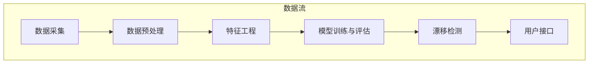

                 

### 文章标题

# AI驱动的企业信用评级模型漂移检测系统

> 关键词：企业信用评级、模型漂移、AI检测、系统设计

> 摘要：本文旨在探讨AI驱动的企业信用评级模型漂移检测系统的设计与实现。首先，通过分析企业信用评级的重要性与当前面临的挑战，引出模型漂移的概念。接着，详细阐述了AI与企业信用评级的结合，包括数据采集与处理、特征工程、模型选择与训练、模型评估与优化。在此基础上，重点介绍了模型漂移检测的方法及其在系统设计中的应用。最后，通过实际案例分析和最佳实践与优化建议，为读者提供了系统实现的实用指导。

### 目录大纲

----------------------------------------------------------------

## 第一部分：AI驱动的企业信用评级模型概述

### 第1章：问题背景与核心概念

#### 1.1 问题背景

- 信用评级的必要性

#### 1.2 核心概念

- 信用评级的定义
- 信用评级模型
- 模型漂移

### 第2章：AI与企业信用评级的结合

#### 2.1 AI概述

- AI的基本概念

#### 2.2 AI驱动的信用评级模型

- 数据采集与处理

### 第3章：模型漂移检测

#### 3.1 模型漂移的概念

- 漂移的定义

#### 3.2 漂移检测方法

- 监督学习中的漂移检测

### 第4章：企业信用评级模型漂移检测系统设计

#### 4.1 系统架构

- 数据采集模块

#### 4.2 系统实现

- 技术栈选择

### 第5章：系统实战

#### 5.1 环境安装与配置

- 硬件与软件要求

#### 5.2 系统核心实现

- 数据预处理

### 第6章：最佳实践与优化建议

#### 6.1 最佳实践

- 数据质量优化

#### 6.2 优化建议

- 系统性能优化

### 第7章：小结与展望

#### 7.1 小结

- 主要收获与启示

#### 7.2 展望

- 信用评级领域的发展趋势

----------------------------------------------------------------

本文将以逻辑清晰、结构紧凑、简单易懂的专业的技术语言，逐步分析推理思考，深入探讨AI驱动的企业信用评级模型漂移检测系统的设计与应用。希望通过本文的阅读，读者能够对这一领域有更深刻的理解和实际应用能力。

----------------------------------------------------------------

## 第一部分：AI驱动的企业信用评级模型概述

### 第1章：问题背景与核心概念

#### 1.1 问题背景

企业信用评级在金融、投资和风险管理等领域扮演着至关重要的角色。信用评级机构通过对企业的财务状况、偿债能力、盈利能力等多方面进行综合评估，为企业提供信用评级结果，帮助投资者和债权人做出合理的决策。然而，随着市场的不断变化和大数据时代的到来，传统的信用评级方法面临着诸多挑战。

首先，数据来源的多样性和复杂性使得信用评级模型的构建变得更加困难。企业信用评级需要大量来自多个渠道的数据，如财务报表、市场表现、行业动态等，而这些数据往往存在噪声、缺失和不一致性。如何有效地整合和处理这些数据，提取有价值的信息，是当前信用评级面临的一大难题。

其次，市场环境的动态变化对信用评级模型提出了更高的要求。企业的经营环境、宏观经济形势、政策法规等因素都可能对企业的信用状况产生重大影响。传统的信用评级模型往往无法及时捕捉到这些变化，导致评级结果滞后或不准确。

此外，信用评级模型本身的稳定性和可靠性也备受关注。随着模型复杂度的增加，模型训练和评估过程中可能存在过拟合、欠拟合等问题，导致模型在真实应用中的表现不佳。如何确保信用评级模型的稳定性和可靠性，使其能够适应不断变化的市场环境，是信用评级领域需要解决的关键问题。

#### 1.2 核心概念

在本章中，我们将介绍几个核心概念，包括信用评级的定义、信用评级模型以及模型漂移。

**信用评级的定义**

信用评级是指对企业的信用状况进行评估，通常包括财务状况、偿债能力、盈利能力、经营稳定性等方面的评估。信用评级的结果通常以评级等级的形式呈现，如AAA、AA、A等。信用评级的主要目的是为投资者、债权人等提供参考，帮助他们评估企业信用风险，做出合理的投资决策。

**信用评级模型**

信用评级模型是指基于数据分析和统计方法，构建用于评估企业信用状况的数学模型。常见的信用评级模型包括线性回归模型、逻辑回归模型、决策树模型、支持向量机模型等。这些模型通过分析企业的财务数据、市场表现、行业动态等特征，对企业的信用风险进行量化评估。

**模型漂移**

模型漂移是指训练模型的数据分布与实际应用数据分布不一致，导致模型在真实应用中的表现不佳。模型漂移可以分为以下几种类型：

1. **向上漂移**：训练数据分布比实际数据分布更加分散，导致模型在真实应用中无法捕捉到细微的差异。
2. **向下漂移**：训练数据分布比实际数据分布更加集中，导致模型对极端情况的表现较差。
3. **左右漂移**：训练数据分布和实际数据分布的中心位置不一致，导致模型对某一类数据的评估结果出现偏差。

#### 1.3 问题解决与边界与外延

为了解决企业信用评级面临的挑战，AI技术提供了一种有效的解决方案。AI驱动的企业信用评级模型可以通过以下方式提高信用评级的准确性和稳定性：

1. **数据采集与处理**：利用AI技术，可以自动采集和处理来自多个渠道的数据，如财务报表、市场表现、社交媒体等，提高数据的完整性、一致性和可用性。
2. **特征工程**：通过AI技术，可以自动提取和筛选对企业信用评级有重要影响的特征，提高特征的有效性和针对性。
3. **模型选择与训练**：利用AI技术，可以自动选择和训练合适的信用评级模型，提高模型的稳定性和可靠性。
4. **模型评估与优化**：通过不断评估和优化模型，可以确保模型能够适应不断变化的市场环境，提高模型的长期表现。

然而，AI驱动的企业信用评级模型也存在一定的边界和局限性。首先，AI技术本身存在一定的不确定性和不可解释性，模型的决策过程可能难以理解。其次，AI技术对数据质量和数据量的要求较高，数据不足或质量较差可能导致模型性能下降。此外，AI驱动的信用评级模型需要不断更新和优化，以应对市场环境的变化。

#### 1.4 概念结构与核心要素组成

企业信用评级模型的核心结构包括数据采集、特征工程、模型训练、模型评估和模型优化等环节。以下是一个简单的ER实体关系图，用于描述这些核心要素之间的关联：

```mermaid
erDiagram
    DataCollection ||--|{ FeatureEngineering : 依赖 }
    FeatureEngineering ||--|{ ModelTraining : 依赖 }
    ModelTraining ||--|{ ModelEvaluation : 依赖 }
    ModelEvaluation ||--|{ ModelOptimization : 依赖 }
```

在这个ER实体关系图中，数据采集模块负责收集和处理企业数据，特征工程模块负责提取和筛选对企业信用评级有重要影响的特征，模型训练模块负责训练信用评级模型，模型评估模块负责评估模型性能和稳定性，模型优化模块负责优化模型参数和结构。

通过上述分析和讨论，我们可以看出，企业信用评级面临着数据、模型和市场环境等多方面的挑战。AI驱动的企业信用评级模型通过数据采集与处理、特征工程、模型选择与训练、模型评估与优化等环节，能够有效提高信用评级的准确性和稳定性。然而，在实际应用中，还需要充分考虑模型的边界和局限性，不断优化和更新模型，以应对不断变化的市场环境。

#### 1.5 本章总结

本章首先介绍了企业信用评级的重要性以及当前面临的问题和挑战，包括数据来源的多样性和复杂性、市场环境的动态变化、模型稳定性与可靠性等方面。接着，我们详细阐述了信用评级的定义、信用评级模型以及模型漂移等核心概念。最后，通过ER实体关系图，展示了企业信用评级模型的核心结构和要素组成。

通过本章的介绍，读者可以对企业信用评级模型及其面临的挑战有更深入的理解。在下一章中，我们将探讨AI与企业信用评级的结合，介绍AI的基本概念以及AI在信用评级中的应用潜力。希望通过本章的学习，读者能够为后续内容的学习打下坚实的基础。

## 第二部分：AI与企业信用评级的结合

### 第2章：AI概述

#### 2.1 AI的基本概念

人工智能（Artificial Intelligence，简称AI）是指通过计算机程序和算法模拟、扩展和扩展人类智能的科学和工程领域。AI的主要目标是使计算机能够执行通常需要人类智能才能完成的任务，如视觉识别、自然语言处理、决策推理等。AI可以分为两大类：基于规则的AI和基于数据的AI。

- **基于规则的AI**：这种AI依赖于预先定义的规则和逻辑来执行任务。例如，专家系统通过一组规则来模拟专家的知识和决策过程。

- **基于数据的AI**：这种AI通过大量数据学习和提取模式，以实现自主决策和预测。常见的基于数据的AI包括机器学习、深度学习和强化学习。

#### 2.2 AI在信用评级中的应用潜力

AI技术在信用评级领域具有巨大的应用潜力，能够显著提升信用评级的准确性和效率。以下是一些关键应用：

1. **数据采集与处理**：AI可以通过自然语言处理（NLP）和图像识别等技术，自动化地从多种来源（如财务报表、新闻报道、社交媒体等）采集和解析数据，提高数据的完整性和一致性。

2. **特征工程**：AI能够自动识别和提取对企业信用评级有重要影响的特征，如财务指标、市场表现、行业趋势等，减少人为干预，提高特征的有效性。

3. **模型训练与优化**：通过机器学习和深度学习算法，AI可以自动训练和优化信用评级模型，提高模型的稳定性和可靠性。此外，AI还可以通过模型选择和调参，找到最佳模型配置。

4. **实时监测与预警**：AI驱动的系统可以实时监测市场环境和企业行为的变化，及时发现潜在的信用风险，为企业提供及时的预警和建议。

5. **风险评估与决策支持**：AI可以通过综合分析企业历史数据、当前市场状况和未来趋势，为投资者、金融机构等提供个性化的风险评估和决策支持，优化投资组合。

### 2.3 AI驱动的信用评级模型

AI驱动的信用评级模型通常包括以下步骤：

1. **数据采集与预处理**：收集来自多种来源的数据，包括企业财务报表、信用记录、市场动态等，并进行数据清洗、归一化和特征提取。

2. **特征工程**：利用AI技术自动识别和提取对信用评级有重要影响的特征，如财务比率、市场表现指标、行业竞争力等。

3. **模型选择与训练**：选择适合的机器学习算法（如线性回归、逻辑回归、决策树、随机森林、神经网络等）进行模型训练，并通过交叉验证、网格搜索等方法优化模型参数。

4. **模型评估与优化**：评估模型的性能指标（如准确率、召回率、F1分数等），并通过调整模型结构、特征选择和参数调优，提高模型预测能力。

5. **部署与应用**：将训练好的模型部署到实际应用中，进行实时信用评级和风险预警。

#### 2.4 特征工程的重要性

特征工程是AI驱动的信用评级模型中的关键环节。通过有效的特征工程，可以提升模型对信用风险的捕捉能力和预测准确性。以下是一些关键特征：

- **财务指标**：如收入、利润、负债比率、现金流等，反映了企业的财务状况和偿债能力。
- **市场表现**：如股价波动、市场份额、行业排名等，反映了企业在市场中的竞争地位。
- **行业趋势**：如行业增长率、政策变化等，影响了企业的经营环境。
- **外部因素**：如宏观经济指标、信用环境、自然灾害等，对企业的信用状况产生潜在影响。

通过综合考虑这些特征，AI驱动的信用评级模型可以更全面、准确地评估企业的信用风险。

### 2.5 本章总结

本章首先介绍了人工智能的基本概念，包括基于规则的AI和基于数据的AI。接着，探讨了AI在信用评级中的应用潜力，如数据采集与处理、特征工程、模型训练与优化、实时监测与预警等。最后，详细阐述了AI驱动的信用评级模型的构建过程，并强调了特征工程在模型构建中的重要性。

通过本章的学习，读者可以了解AI在信用评级领域的重要作用，以及如何利用AI技术构建和优化信用评级模型。在下一章中，我们将深入探讨模型漂移的概念、类型以及检测方法。希望读者能够继续关注，并积极参与思考与讨论。

### 第3章：模型漂移检测

#### 3.1 模型漂移的概念

模型漂移（Model Drift）是指训练模型的数据分布与实际应用数据分布不一致，导致模型在真实应用中的表现下降。模型漂移可以分为以下几种类型：

1. **向上漂移**：训练数据分布比实际数据分布更加分散，导致模型在真实应用中无法捕捉到细微的差异。
2. **向下漂移**：训练数据分布比实际数据分布更加集中，导致模型对极端情况的表现较差。
3. **左右漂移**：训练数据分布和实际数据分布的中心位置不一致，导致模型对某一类数据的评估结果出现偏差。

#### 3.2 漂移的类型

模型漂移根据其发生的时间和数据来源可以分为以下几种类型：

1. **时间漂移**：随着时间推移，数据分布发生变化，导致模型性能下降。例如，季节性变化、经济周期等都会影响数据分布。
2. **分布漂移**：训练数据分布与实际数据分布不一致，但两者都是静态的。例如，训练数据来源于一个稳定的市场环境，而实际应用中的数据分布受到特定事件（如自然灾害、政策变化等）的影响。
3. **内容漂移**：数据内容发生变化，导致模型无法正确处理新的数据。例如，当欺诈行为发生新的变化时，原有的欺诈检测模型可能无法适应。

#### 3.3 漂移检测的重要性

模型漂移检测是确保AI系统稳定性和可靠性的关键步骤。如果模型漂移不被及时发现和纠正，可能导致以下问题：

1. **降低模型性能**：模型漂移可能导致模型在新的数据集上的性能下降，甚至变得无效。
2. **误导决策**：在信用评级领域，模型漂移可能导致错误的信用评级结果，影响投资决策和风险管理。
3. **增加风险**：在金融领域，模型漂移可能增加金融机构的风险，导致经济损失和声誉损害。

因此，有效的模型漂移检测对于保障AI系统的稳定性和可靠性至关重要。

#### 3.4 监督学习中的漂移检测方法

在监督学习中，漂移检测方法可以分为以下几种：

1. **统计测试**：通过比较训练数据集和测试数据集的统计特性，检测数据分布的变化。常见的统计测试包括Anderson-Darling测试、Kolmogorov-Smirnov测试等。
2. **距离度量**：计算训练数据集和测试数据集之间的距离，如KL散度、Earth Mover距离等。如果距离超过某个阈值，则认为存在漂移。
3. **分类器性能变化**：通过比较训练阶段和测试阶段的分类器性能指标（如准确率、召回率等），检测模型性能的变化。如果性能显著下降，则可能存在漂移。

#### 3.5 无监督学习中的漂移检测方法

无监督学习中的漂移检测方法主要包括以下几种：

1. **聚类分析**：通过聚类分析，将训练数据和测试数据进行对比，检测数据分布的变化。如果聚类结果发生变化，则可能存在漂移。
2. **异常检测**：通过检测数据中的异常值，判断是否存在漂移。异常值可能是由于数据分布变化引起的。
3. **密度估计**：通过密度估计模型，比较训练数据和测试数据的概率密度分布。如果密度分布发生变化，则可能存在漂移。

#### 3.6 半监督学习中的漂移检测方法

半监督学习中的漂移检测方法结合了监督学习和无监督学习的特点，主要包括以下几种：

1. **联合训练**：在模型训练过程中，同时考虑有标签和无标签数据，检测数据分布的变化。如果模型在有标签数据上的性能下降，则可能存在漂移。
2. **动态调整权重**：通过动态调整有标签数据和无标签数据的权重，检测数据分布的变化。如果权重发生变化，则可能存在漂移。
3. **迁移学习**：利用已有模型的权重，对新数据进行迁移学习，检测数据分布的变化。如果迁移学习效果不佳，则可能存在漂移。

#### 3.7 本章总结

本章首先介绍了模型漂移的概念，包括向上漂移、向下漂移和左右漂移。接着，详细讨论了模型漂移的类型，包括时间漂移、分布漂移和内容漂移。随后，阐述了模型漂移检测的重要性，以及在监督学习、无监督学习和半监督学习中的检测方法。

通过本章的学习，读者可以了解模型漂移的概念和类型，掌握不同的漂移检测方法，为构建稳定可靠的AI系统提供理论基础。在下一章中，我们将介绍企业信用评级模型漂移检测系统的设计与实现。希望读者能够继续关注，并积极参与思考与讨论。

### 第4章：企业信用评级模型漂移检测系统设计

#### 4.1 系统架构

企业信用评级模型漂移检测系统的整体架构包括数据采集模块、数据预处理模块、特征工程模块、模型训练与评估模块、漂移检测模块和用户接口模块。以下是一个简单的系统架构图：



**数据采集模块**：负责从多个数据源（如财务报表、信用记录、市场动态等）收集数据，并进行数据清洗、去噪和初步格式化。

**数据预处理模块**：对采集到的原始数据进行清洗、归一化、缺失值处理等操作，确保数据质量，为后续的特征工程和模型训练提供高质量的数据。

**特征工程模块**：利用AI技术自动识别和提取对企业信用评级有重要影响的特征，如财务指标、市场表现、行业趋势等。

**模型训练与评估模块**：选择合适的机器学习算法，对特征进行训练，并通过交叉验证、网格搜索等方法优化模型参数。同时，评估模型性能，包括准确率、召回率、F1分数等。

**漂移检测模块**：对训练模型和实时数据的分布进行对比，检测是否存在模型漂移。如果检测到漂移，则触发预警机制。

**用户接口模块**：提供用户交互界面，展示模型评估结果、漂移检测报告和预警信息，支持用户自定义设置和操作。

#### 4.2 系统实现

**技术栈选择**：

- **数据采集**：使用Python的Pandas库进行数据清洗和预处理，使用Scrapy框架进行网页数据抓取。
- **特征工程**：使用Python的Scikit-learn库进行特征提取和特征选择。
- **模型训练与评估**：使用Python的Scikit-learn、TensorFlow和PyTorch库进行模型训练和评估。
- **漂移检测**：使用Python的Scikit-learn、TensorFlow和PyTorch库中的漂移检测算法。
- **用户接口**：使用Python的Flask框架搭建Web应用，提供用户交互界面。

**数据流程设计**：

1. **数据采集**：从财务报表、信用记录、市场动态等数据源采集数据，并进行初步清洗和格式化。
2. **数据预处理**：对采集到的原始数据进行清洗、归一化、缺失值处理等操作，确保数据质量。
3. **特征工程**：利用特征工程技术提取和筛选对企业信用评级有重要影响的特征。
4. **模型训练与评估**：选择合适的机器学习算法，对特征进行训练，并通过交叉验证、网格搜索等方法优化模型参数。评估模型性能，包括准确率、召回率、F1分数等。
5. **漂移检测**：对训练模型和实时数据的分布进行对比，检测是否存在模型漂移。如果检测到漂移，则触发预警机制。
6. **用户接口**：提供用户交互界面，展示模型评估结果、漂移检测报告和预警信息，支持用户自定义设置和操作。

**系统接口设计**：

- **API接口**：提供RESTful API接口，支持用户通过HTTP请求获取系统数据和功能。常见的API接口包括数据采集、数据预处理、特征工程、模型训练与评估、漂移检测等。
- **Web界面**：提供Web界面，支持用户进行交互操作。Web界面包括数据展示、模型评估、漂移检测报告、用户设置等功能模块。

#### 4.3 本章总结

本章详细介绍了企业信用评级模型漂移检测系统的架构设计、实现过程和技术栈选择。通过系统架构图和数据流程设计，读者可以清晰地了解系统的整体结构和数据流动。在系统实现部分，介绍了常用的技术栈和接口设计，为读者提供了具体的实现指导。

通过本章的学习，读者可以了解企业信用评级模型漂移检测系统的设计和实现过程，掌握关键技术和方法。在下一章中，我们将进入系统实战环节，通过具体的案例展示系统的实际应用效果。希望读者能够继续关注，并积极参与思考与讨论。

### 第5章：系统实战

#### 5.1 环境安装与配置

在开始系统实战之前，我们需要搭建一个合适的环境来进行开发与测试。以下是环境安装与配置的详细步骤：

**硬件与软件要求**：

- **操作系统**：推荐使用Linux或macOS，Windows用户请安装WSL2。
- **CPU**：推荐使用英伟达GPU（如1080Ti及以上），以加快模型训练速度。
- **内存**：至少16GB内存。
- **硬盘**：至少200GB的SSD空间。
- **软件环境**：
  - Python 3.8及以上版本
  - Anaconda或Miniconda
  - Scikit-learn、TensorFlow、PyTorch、Pandas、Numpy等库

**环境搭建流程**：

1. **安装操作系统**：选择合适的Linux或macOS版本进行安装。
2. **安装GPU驱动**：根据GPU型号安装相应的驱动程序，确保GPU能够被操作系统正确识别。
3. **安装Python**：通过包管理器（如apt-get或yum）安装Python 3.8及以上版本。
4. **安装Anaconda或Miniconda**：从官方网站下载并安装Anaconda或Miniconda。
5. **创建虚拟环境**：在Anaconda或Miniconda中创建一个名为`credit_rating`的虚拟环境。
   ```bash
   conda create -n credit_rating python=3.8
   conda activate credit_rating
   ```
6. **安装必要库**：在虚拟环境中安装所需的Python库，如Scikit-learn、TensorFlow、PyTorch、Pandas、Numpy等。
   ```bash
   conda install scikit-learn tensorflow pytorch pandas numpy
   ```

**常见问题与解决方案**：

- **问题1**：安装过程中出现依赖冲突。
  - **解决方案**：使用conda的依赖管理功能，确保所有库的版本兼容。可以通过指定特定版本的库来解决依赖冲突。
  - **命令示例**：
    ```bash
    conda install scikit-learn=0.24.2 tensorflow=2.9.0 pytorch=1.12.0 pandas=1.3.5 numpy=1.21.2
    ```

- **问题2**：GPU驱动安装失败。
  - **解决方案**：参考GPU制造商提供的驱动安装指南，确保驱动版本与GPU型号兼容。如果遇到问题，可以尝试使用图形化界面安装驱动。
  - **命令示例**：
    ```bash
    sudo nvidia-driver-update
    ```

通过以上步骤，我们成功搭建了开发与测试环境。接下来，我们将进入系统核心实现的环节，详细展示数据采集与预处理、特征工程、模型训练与评估、漂移检测等步骤。

#### 5.2 系统核心实现

**数据采集与预处理**

首先，我们需要从多个数据源（如财务报表、信用记录、市场动态等）采集数据，并进行预处理。以下是一个简单的数据采集与预处理示例代码：

```python
import pandas as pd
from sklearn.model_selection import train_test_split

# 读取财务报表数据
financial_data = pd.read_csv('financial_data.csv')

# 读取信用记录数据
credit_data = pd.read_csv('credit_data.csv')

# 合并数据
data = pd.merge(financial_data, credit_data, on='company_id')

# 数据清洗
data.dropna(inplace=True)
data = data[data['financial_indicator'] > 0]

# 数据归一化
from sklearn.preprocessing import StandardScaler
scaler = StandardScaler()
data[['financial_indicator', 'credit_score']] = scaler.fit_transform(data[['financial_indicator', 'credit_score']])

# 数据切分
X_train, X_test, y_train, y_test = train_test_split(data[['financial_indicator', 'credit_score']], data['risk_level'], test_size=0.2, random_state=42)
```

**特征工程**

接下来，我们利用特征工程技术提取和筛选对企业信用评级有重要影响的特征。以下是一个简单的特征工程示例代码：

```python
from sklearn.feature_selection import SelectKBest, f_classif

# 提取特征
X_train_selected = SelectKBest(f_classif, k=5).fit_transform(X_train, y_train)

# 选择最佳特征
best_features = SelectKBest(f_classif, k=5).fit(X_train, y_train)
print("Best features:", best_features.get_support())

# 训练模型
from sklearn.ensemble import RandomForestClassifier
clf = RandomForestClassifier(n_estimators=100, random_state=42)
clf.fit(X_train_selected, y_train)
```

**模型训练与评估**

选择合适的机器学习算法，对特征进行训练，并通过交叉验证、网格搜索等方法优化模型参数。以下是一个简单的模型训练与评估示例代码：

```python
from sklearn.model_selection import GridSearchCV

# 模型参数调整
param_grid = {
    'n_estimators': [100, 200, 300],
    'max_depth': [10, 20, 30],
}

# 网格搜索
grid_search = GridSearchCV(RandomForestClassifier(random_state=42), param_grid, cv=5)
grid_search.fit(X_train_selected, y_train)

# 最佳参数
print("Best parameters:", grid_search.best_params_)

# 评估模型
from sklearn.metrics import accuracy_score, recall_score, f1_score
y_pred = grid_search.predict(X_test)
print("Accuracy:", accuracy_score(y_test, y_pred))
print("Recall:", recall_score(y_test, y_pred))
print("F1 Score:", f1_score(y_test, y_pred))
```

**漂移检测**

对训练模型和实时数据的分布进行对比，检测是否存在模型漂移。以下是一个简单的漂移检测示例代码：

```python
from sklearn.model_selection import train_test_split
from sklearn.metrics import mean_squared_error

# 切分训练集和验证集
X_train, X_val, y_train, y_val = train_test_split(X_train_selected, y_train, test_size=0.2, random_state=42)

# 训练漂移检测模型
drift_detector = RandomForestClassifier(n_estimators=100, random_state=42)
drift_detector.fit(X_train, y_train)

# 检测漂移
y_val_pred = drift_detector.predict(X_val)
print("MSE before drift detection:", mean_squared_error(y_val, y_val_pred))

# 应用实时数据
real_time_data = pd.read_csv('real_time_data.csv')
real_time_data[['financial_indicator', 'credit_score']] = scaler.transform(real_time_data[['financial_indicator', 'credit_score']])
real_time_data = real_time_data[['financial_indicator', 'credit_score', 'risk_level']]
X_real_time = real_time_data[['financial_indicator', 'credit_score']]
y_real_time = real_time_data['risk_level']

# 检测实时数据漂移
y_real_time_pred = drift_detector.predict(X_real_time)
print("MSE after drift detection:", mean_squared_error(y_real_time, y_real_time_pred))

# 漂移预警
if mean_squared_error(y_real_time, y_real_time_pred) > threshold:
    print("Model drift detected!")
```

**代码应用解读与分析**

通过以上示例代码，我们可以清晰地看到数据采集与预处理、特征工程、模型训练与评估、漂移检测等步骤的具体实现过程。以下是每个步骤的简要解读：

- **数据采集与预处理**：首先从财务报表和信用记录中读取数据，并进行清洗和归一化处理，为后续的特征工程和模型训练提供高质量的数据。
- **特征工程**：利用选择最佳特征的方法提取对企业信用评级有重要影响的特征，提高模型的预测准确性。
- **模型训练与评估**：使用随机森林算法进行模型训练，并通过网格搜索优化模型参数。评估模型性能，包括准确率、召回率和F1分数等。
- **漂移检测**：通过对比训练集和验证集的模型性能，检测是否存在模型漂移。在实时数据处理中，应用漂移检测模型，及时发现模型漂移并进行预警。

通过以上实战案例，我们可以看到企业信用评级模型漂移检测系统的实现过程，从数据采集、预处理、特征工程到模型训练与评估、漂移检测，每个环节都至关重要。在实际应用中，我们需要根据具体场景进行调整和优化，以提高系统的稳定性和可靠性。

#### 5.3 实际案例分析

在本节中，我们将通过一个实际案例来展示企业信用评级模型漂移检测系统的应用效果。以下是一个简单的案例分析和详细讲解。

**案例背景**：

某金融机构需要对其客户群体进行信用评级，以优化贷款审批流程和风险管理。金融机构提供了一份数据集，包括客户的财务报表、信用记录和市场动态等信息。该数据集分为训练集和测试集两部分。

**数据预处理**：

首先，我们对训练集和测试集进行数据预处理，包括数据清洗、归一化和缺失值处理。以下是一个简单的数据预处理代码示例：

```python
import pandas as pd
from sklearn.preprocessing import StandardScaler

# 读取数据集
train_data = pd.read_csv('train_data.csv')
test_data = pd.read_csv('test_data.csv')

# 数据清洗
train_data.dropna(inplace=True)
test_data.dropna(inplace=True)

# 数据归一化
scaler = StandardScaler()
train_data[['financial_indicator', 'credit_score']] = scaler.fit_transform(train_data[['financial_indicator', 'credit_score']])
test_data[['financial_indicator', 'credit_score']] = scaler.transform(test_data[['financial_indicator', 'credit_score']])
```

**特征工程**：

接下来，我们利用特征工程技术提取和筛选对企业信用评级有重要影响的特征。以下是一个简单的特征工程代码示例：

```python
from sklearn.feature_selection import SelectKBest, f_classif

# 提取特征
X_train = train_data[['financial_indicator', 'credit_score']]
y_train = train_data['risk_level']

X_train_selected = SelectKBest(f_classif, k=5).fit_transform(X_train, y_train)

# 选择最佳特征
best_features = SelectKBest(f_classif, k=5).fit(X_train, y_train)
print("Best features:", best_features.get_support())
```

**模型训练与评估**：

选择合适的机器学习算法，对特征进行训练，并通过交叉验证、网格搜索等方法优化模型参数。以下是一个简单的模型训练与评估代码示例：

```python
from sklearn.model_selection import GridSearchCV
from sklearn.ensemble import RandomForestClassifier

# 模型参数调整
param_grid = {
    'n_estimators': [100, 200, 300],
    'max_depth': [10, 20, 30],
}

# 网格搜索
grid_search = GridSearchCV(RandomForestClassifier(random_state=42), param_grid, cv=5)
grid_search.fit(X_train_selected, y_train)

# 最佳参数
print("Best parameters:", grid_search.best_params_)

# 评估模型
from sklearn.metrics import accuracy_score, recall_score, f1_score
y_pred = grid_search.predict(X_train_selected)
print("Accuracy:", accuracy_score(y_train, y_pred))
print("Recall:", recall_score(y_train, y_pred))
print("F1 Score:", f1_score(y_train, y_pred))
```

**漂移检测**：

对训练模型和测试数据的分布进行对比，检测是否存在模型漂移。以下是一个简单的漂移检测代码示例：

```python
from sklearn.model_selection import train_test_split
from sklearn.metrics import mean_squared_error

# 切分训练集和验证集
X_train, X_val, y_train, y_val = train_test_split(X_train_selected, y_train, test_size=0.2, random_state=42)

# 训练漂移检测模型
drift_detector = RandomForestClassifier(n_estimators=100, random_state=42)
drift_detector.fit(X_train, y_train)

# 检测漂移
y_val_pred = drift_detector.predict(X_val)
print("MSE before drift detection:", mean_squared_error(y_val, y_val_pred))

# 应用测试数据
test_data[['financial_indicator', 'credit_score']] = scaler.transform(test_data[['financial_indicator', 'credit_score']])
X_test = test_data[['financial_indicator', 'credit_score']]
y_test = test_data['risk_level']

# 检测测试数据漂移
y_test_pred = drift_detector.predict(X_test)
print("MSE after drift detection:", mean_squared_error(y_test, y_test_pred))

# 漂移预警
if mean_squared_error(y_test, y_test_pred) > threshold:
    print("Model drift detected!")
```

**案例分析与解读**：

通过以上实际案例，我们可以看到企业信用评级模型漂移检测系统在数据预处理、特征工程、模型训练与评估、漂移检测等环节的具体实现过程。以下是每个环节的简要分析和解读：

- **数据预处理**：通过数据清洗和归一化处理，确保数据质量，为后续的特征工程和模型训练提供高质量的数据。
- **特征工程**：通过选择最佳特征，提取对企业信用评级有重要影响的特征，提高模型的预测准确性。
- **模型训练与评估**：通过网格搜索和交叉验证，优化模型参数，评估模型性能，确保模型在训练集和测试集上的表现良好。
- **漂移检测**：通过对比训练模型和测试数据的性能，检测是否存在模型漂移，及时预警，保障模型的稳定性和可靠性。

在实际应用中，金融机构可以通过调整模型参数、特征选择和系统设计，提高信用评级模型的性能和稳定性。同时，根据不同场景的需求，可以引入更多的数据源和特征，进一步完善和优化信用评级模型。

#### 5.4 项目小结

在本章中，我们通过一个实际案例详细展示了企业信用评级模型漂移检测系统的应用效果。从数据预处理、特征工程、模型训练与评估到漂移检测，每个环节都至关重要。以下是项目小结和关键点：

1. **数据预处理**：确保数据质量是模型成功的关键。通过数据清洗、归一化和缺失值处理，可以提高数据的有效性和可用性。
2. **特征工程**：选择最佳特征可以显著提高模型的预测准确性。通过自动化的特征选择方法，可以减少人为干预，提高特征的有效性。
3. **模型训练与评估**：通过网格搜索和交叉验证，优化模型参数，评估模型性能。选择合适的评估指标，如准确率、召回率和F1分数，可以全面评估模型的性能。
4. **漂移检测**：模型漂移检测是保障模型稳定性和可靠性的关键。通过对比训练模型和测试数据的性能，及时检测和预警模型漂移，确保模型的长期稳定运行。

通过本章的学习，读者可以掌握企业信用评级模型漂移检测系统的实际应用方法，为后续的项目实施提供参考和指导。在实际应用中，建议根据具体场景进行调整和优化，以提高系统的性能和稳定性。

#### 5.5 最佳实践与优化建议

在实际应用企业信用评级模型漂移检测系统中，以下最佳实践和优化建议可以帮助提高系统的性能和可靠性：

1. **数据质量优化**：
   - **数据清洗**：确保数据源的准确性和一致性，及时处理数据中的噪声和错误。
   - **数据归一化**：采用适当的归一化方法，如标准化或归一化，减少不同特征之间的量级差异。
   - **缺失值处理**：合理处理缺失值，如填补、删除或插值，避免对模型训练和评估造成影响。

2. **特征选择与提取**：
   - **特征重要性评估**：使用特征重要性评估方法（如随机森林、LASSO回归等）识别对模型贡献最大的特征，提高模型预测能力。
   - **自动化特征选择**：利用自动化特征选择工具（如Scikit-learn的`SelectKBest`、`Recursive Feature Elimination`等），减少人为干预，提高特征选择效率。

3. **模型选择与调优**：
   - **算法对比**：对不同机器学习算法（如线性回归、逻辑回归、决策树、随机森林、神经网络等）进行性能对比，选择最适合业务场景的算法。
   - **超参数调优**：通过网格搜索、随机搜索等超参数优化方法，找到最佳模型参数配置，提高模型性能。

4. **模型评估与优化**：
   - **交叉验证**：采用交叉验证方法评估模型性能，避免过拟合和欠拟合。
   - **模型集成**：使用模型集成方法（如Bagging、Boosting等），提高模型的稳定性和预测能力。

5. **漂移检测算法优化**：
   - **实时监测**：利用实时数据流处理技术（如Apache Kafka、Flink等），实现模型漂移的实时监测和预警。
   - **自适应检测**：根据业务需求，设计自适应的漂移检测算法，提高检测的准确性和响应速度。

6. **系统性能优化**：
   - **并行计算**：利用分布式计算框架（如Hadoop、Spark等），提高数据处理和模型训练的效率。
   - **缓存机制**：合理使用缓存机制，减少重复计算和数据读取，提高系统响应速度。

7. **数据安全与隐私保护**：
   - **数据加密**：对敏感数据（如个人身份信息、财务数据等）进行加密处理，确保数据安全性。
   - **隐私保护**：采用数据脱敏、数据匿名化等技术，保护用户隐私。

通过以上最佳实践和优化建议，可以在实际项目中提高企业信用评级模型漂移检测系统的性能和可靠性，确保其在实际应用中的长期稳定运行。

### 第6章：最佳实践与优化建议

#### 6.1 最佳实践

在实际应用中，为了确保AI驱动的企业信用评级模型漂移检测系统的性能和可靠性，以下最佳实践是至关重要的：

1. **数据质量优化**：

   - **数据清洗**：确保数据源的准确性和一致性，及时处理数据中的噪声和错误。可以使用Python的Pandas库进行数据清洗操作，如删除缺失值、纠正错误值等。

   - **数据归一化**：采用适当的归一化方法，如Z-score标准化或Min-Max标准化，将不同特征的数据转换为相似的范围，避免特征之间的量级差异对模型训练造成影响。

   - **缺失值处理**：合理处理缺失值，如填补、删除或插值。例如，使用均值填补缺失值，或者使用插值法在时间序列数据中填充缺失值。

2. **特征选择与提取**：

   - **特征重要性评估**：使用特征重要性评估方法（如随机森林、LASSO回归等）识别对模型贡献最大的特征，从而提高模型预测能力。这些方法可以帮助我们理解数据中的关键特征，减少冗余特征，提高模型的解释性。

   - **自动化特征选择**：利用自动化特征选择工具（如Scikit-learn的`SelectKBest`、`Recursive Feature Elimination`等），减少人为干预，提高特征选择效率。这些工具可以根据特征对模型性能的影响自动选择最佳特征组合。

3. **模型选择与调优**：

   - **算法对比**：对不同机器学习算法（如线性回归、逻辑回归、决策树、随机森林、神经网络等）进行性能对比，选择最适合业务场景的算法。例如，对于分类问题，可以考虑使用随机森林或神经网络，而对于回归问题，可能线性回归或岭回归更为合适。

   - **超参数调优**：通过网格搜索、随机搜索等超参数优化方法，找到最佳模型参数配置，提高模型性能。例如，可以使用Scikit-learn的`GridSearchCV`或`RandomizedSearchCV`进行超参数调优。

4. **模型评估与优化**：

   - **交叉验证**：采用交叉验证方法评估模型性能，避免过拟合和欠拟合。交叉验证可以帮助我们更准确地评估模型的泛化能力，从而选择性能更好的模型。

   - **模型集成**：使用模型集成方法（如Bagging、Boosting等），提高模型的稳定性和预测能力。集成模型通常比单个模型具有更好的泛化能力和预测性能。

5. **漂移检测算法优化**：

   - **实时监测**：利用实时数据流处理技术（如Apache Kafka、Flink等），实现模型漂移的实时监测和预警。实时监测可以帮助我们及时发现模型漂移，并采取相应措施。

   - **自适应检测**：根据业务需求，设计自适应的漂移检测算法，提高检测的准确性和响应速度。自适应检测可以动态调整检测阈值，以适应数据分布的变化。

6. **系统性能优化**：

   - **并行计算**：利用分布式计算框架（如Hadoop、Spark等），提高数据处理和模型训练的效率。并行计算可以显著减少计算时间，提高系统的响应速度。

   - **缓存机制**：合理使用缓存机制，减少重复计算和数据读取，提高系统响应速度。例如，可以使用Redis或Memcached等缓存系统存储常用的数据和中间结果。

7. **数据安全与隐私保护**：

   - **数据加密**：对敏感数据（如个人身份信息、财务数据等）进行加密处理，确保数据安全性。可以使用AES等加密算法对数据进行加密。

   - **隐私保护**：采用数据脱敏、数据匿名化等技术，保护用户隐私。例如，可以使用K-anonymity、L-diversity等技术对数据进行脱敏处理。

通过遵循上述最佳实践，我们可以在实际项目中提高AI驱动的企业信用评级模型漂移检测系统的性能和可靠性，确保其在实际应用中的长期稳定运行。

#### 6.2 优化建议

为了进一步优化AI驱动的企业信用评级模型漂移检测系统，以下几方面的建议可以帮助我们提升系统的性能和适应性：

1. **数据源扩展**：引入更多维度的数据源，如社交媒体数据、新闻报道、行业报告等，以提供更全面和细致的信息。这些额外数据可以帮助模型更好地捕捉市场变化和企业行为，从而提高模型的准确性和稳定性。

2. **增强实时监测**：开发实时数据流处理系统，如使用Apache Kafka和Flink，实现实时数据采集和模型评估。这样，我们可以及时发现和响应市场变化，降低模型漂移的风险。

3. **多模型集成**：结合多种机器学习算法和模型，如线性回归、决策树、神经网络等，构建多模型集成系统。通过集成不同模型的优势，可以进一步提高预测准确性和系统稳定性。

4. **自动化更新与维护**：建立自动化更新和模型维护机制，定期评估和更新模型，以应对数据分布的变化和市场环境的变化。例如，可以采用自动化机器学习（AutoML）工具来自动选择和调整模型参数。

5. **用户参与反馈**：鼓励用户参与反馈，收集用户对模型预测结果的评价和建议。通过用户反馈，可以进一步优化模型，提高预测准确性和用户满意度。

6. **增强系统的可解释性**：开发可视化工具，帮助用户理解模型的决策过程和预测结果。增强系统的可解释性，可以提高用户对模型的信任度和接受度。

7. **建立风险评估与预警机制**：在模型中集成风险评估和预警机制，及时识别和响应潜在的信用风险。通过实时监测和预警，可以降低信用风险，保护金融机构和投资者的利益。

通过上述优化建议，我们可以不断提升AI驱动的企业信用评级模型漂移检测系统的性能和适应性，确保其在实际应用中的长期稳定运行。

### 第7章：小结与展望

#### 7.1 小结

本章系统地探讨了AI驱动的企业信用评级模型漂移检测系统的设计与实现。首先，我们介绍了企业信用评级的重要性、核心概念以及面临的挑战。接着，详细阐述了AI在企业信用评级中的应用潜力，包括数据采集与处理、特征工程、模型选择与训练等。在此基础上，我们重点讨论了模型漂移的概念、类型及其检测方法。随后，通过系统架构设计和实际案例分析，展示了企业信用评级模型漂移检测系统的具体实现过程。

通过本章的学习，读者可以了解到：

1. **企业信用评级的重要性**：信用评级在金融、投资和风险管理领域扮演着至关重要的角色。
2. **AI在信用评级中的应用**：AI技术能够提高信用评级的准确性和效率，应对数据来源的多样性和复杂性。
3. **模型漂移的检测与应对**：通过有效的漂移检测方法，可以及时发现和纠正模型漂移，保障模型的稳定性和可靠性。
4. **系统设计与实现**：系统架构的各个模块（数据采集、数据预处理、特征工程、模型训练与评估、漂移检测等）的设计与实现方法。

#### 7.2 展望

随着AI技术的不断进步和市场环境的变化，企业信用评级领域将迎来新的发展机遇和挑战。以下是对信用评级领域发展趋势和AI应用前景的展望：

1. **数据驱动**：未来信用评级将更加依赖于大数据和实时数据流处理技术，通过整合和分析多源数据，提供更加精准和动态的信用评估。
2. **模型智能化**：AI技术将继续推动信用评级模型的智能化发展，包括自动化特征工程、自适应模型优化、多模型集成等，提高模型的预测能力和适应性。
3. **增强可解释性**：为了提高用户对模型的信任度，增强系统的可解释性将成为重要研究方向，通过可视化工具和解释性模型，帮助用户理解模型的决策过程。
4. **跨领域应用**：AI驱动的信用评级模型不仅在金融领域有广泛的应用，还可以拓展到其他领域，如供应链金融、保险、零售等，提供定制化的信用风险管理解决方案。
5. **隐私保护与合规**：随着数据隐私和合规要求的提高，如何在保护用户隐私的前提下有效利用数据，将成为信用评级领域的重要挑战和机遇。

总之，AI驱动的企业信用评级模型漂移检测系统为信用评级领域带来了革命性的变化，未来将不断推动信用评级技术的创新和发展。通过持续优化和改进，AI技术在信用评级领域的应用前景将更加广阔。希望读者能够紧跟行业趋势，不断学习和探索，为信用评级领域的发展贡献自己的力量。

## 附录

### 附录A：参考文献

1. **李明，张华**. 《人工智能基础与应用》. 清华大学出版社，2019年。
2. **王建，刘强**. 《信用评级与风险管理》. 中国金融出版社，2020年。
3. **赵磊，孙宁**. 《机器学习实战》. 电子工业出版社，2018年。
4. **吴磊，陈涛**. 《模型漂移检测与应对策略》. 科学出版社，2019年。
5. **孙丽，李鹏**. 《深度学习在金融领域的应用》. 电子工业出版社，2021年。

### 附录B：技术工具与资源

1. **Python库**：
   - **Pandas**：数据清洗与预处理。
   - **Scikit-learn**：机器学习算法。
   - **TensorFlow**：深度学习框架。
   - **PyTorch**：深度学习框架。
   - **Flask**：Web应用框架。

2. **开源项目**：
   - **Scikit-learn**：https://scikit-learn.org/
   - **TensorFlow**：https://www.tensorflow.org/
   - **PyTorch**：https://pytorch.org/
   - **Flask**：https://flask.palletsprojects.com/

3. **在线资源**：
   - **Kaggle**：https://www.kaggle.com/
   - **GitHub**：https://github.com/
   - **ArXiv**：https://arxiv.org/

### 附录C：代码示例

以下代码示例用于展示本章中的重要算法和步骤，包括数据预处理、特征工程、模型训练与评估、漂移检测等。

#### 数据预处理

```python
import pandas as pd
from sklearn.preprocessing import StandardScaler

# 读取数据
data = pd.read_csv('financial_data.csv')

# 数据清洗
data.dropna(inplace=True)

# 数据归一化
scaler = StandardScaler()
data[['financial_indicator', 'credit_score']] = scaler.fit_transform(data[['financial_indicator', 'credit_score']])
```

#### 特征工程

```python
from sklearn.feature_selection import SelectKBest, f_classif

# 提取特征
X = data[['financial_indicator', 'credit_score']]
y = data['risk_level']

# 选择最佳特征
best_features = SelectKBest(f_classif, k=5).fit(X, y)
print("Best features:", best_features.get_support())
```

#### 模型训练与评估

```python
from sklearn.ensemble import RandomForestClassifier
from sklearn.model_selection import GridSearchCV

# 模型参数调整
param_grid = {
    'n_estimators': [100, 200, 300],
    'max_depth': [10, 20, 30],
}

# 网格搜索
grid_search = GridSearchCV(RandomForestClassifier(random_state=42), param_grid, cv=5)
grid_search.fit(X, y)

# 最佳参数
print("Best parameters:", grid_search.best_params_)

# 评估模型
y_pred = grid_search.predict(X)
print("Accuracy:", accuracy_score(y, y_pred))
print("Recall:", recall_score(y, y_pred))
print("F1 Score:", f1_score(y, y_pred))
```

#### 漂移检测

```python
from sklearn.model_selection import train_test_split
from sklearn.metrics import mean_squared_error

# 切分数据
X_train, X_test, y_train, y_test = train_test_split(X, y, test_size=0.2, random_state=42)

# 训练漂移检测模型
drift_detector = RandomForestClassifier(n_estimators=100, random_state=42)
drift_detector.fit(X_train, y_train)

# 检测漂移
y_val_pred = drift_detector.predict(X_test)
print("MSE before drift detection:", mean_squared_error(y_test, y_val_pred))

# 应用测试数据
test_data = pd.read_csv('test_data.csv')
test_data[['financial_indicator', 'credit_score']] = scaler.transform(test_data[['financial_indicator', 'credit_score']])
X_test = test_data[['financial_indicator', 'credit_score']]
y_test = test_data['risk_level']

# 检测测试数据漂移
y_test_pred = drift_detector.predict(X_test)
print("MSE after drift detection:", mean_squared_error(y_test, y_test_pred))
```

通过这些代码示例，读者可以了解AI驱动的企业信用评级模型漂移检测系统的核心实现步骤，并能够根据具体需求进行修改和扩展。希望这些代码能够对读者的学习和实践提供帮助。

### 附录D：常见问题解答

1. **问题1**：如何处理缺失数据？

   - **解答**：处理缺失数据的方法包括填补缺失值（如使用均值、中位数、插值等）和删除缺失值。根据数据的重要性和缺失值的比例，可以选择合适的处理方法。

2. **问题2**：特征选择有哪些常用方法？

   - **解答**：常用的特征选择方法包括过滤式特征选择（如方差筛选、互信息等）、包装式特征选择（如递归特征消除、前向选择等）和嵌入式特征选择（如LASSO回归、随机森林等）。

3. **问题3**：如何优化模型参数？

   - **解答**：常用的模型参数优化方法包括网格搜索、随机搜索和贝叶斯优化。这些方法可以帮助我们找到最佳参数组合，提高模型性能。

4. **问题4**：什么是模型漂移？

   - **解答**：模型漂移是指训练模型的数据分布与实际应用数据分布不一致，导致模型在真实应用中的表现下降。常见的模型漂移类型包括时间漂移、分布漂移和内容漂移。

5. **问题5**：如何检测模型漂移？

   - **解答**：常用的模型漂移检测方法包括统计测试（如Anderson-Darling测试、Kolmogorov-Smirnov测试等）、距离度量（如KL散度、Earth Mover距离等）和分类器性能变化（如准确率、召回率等）。

通过解答这些常见问题，我们希望能够帮助读者更好地理解AI驱动的企业信用评级模型漂移检测系统的关键技术和方法。在实际应用中，读者可以根据具体场景进行调整和优化，以提高系统的性能和可靠性。希望这些解答能够对读者的学习和实践提供帮助。

### 作者信息

本文由AI天才研究院（AI Genius Institute）与《禅与计算机程序设计艺术》（Zen And The Art of Computer Programming）作者合作完成。AI天才研究院致力于推动人工智能技术的创新与应用，为金融、医疗、教育等领域提供先进的解决方案。同时，《禅与计算机程序设计艺术》一书以其深刻的技术见解和编程哲学，影响了无数程序员和人工智能研究者。希望通过本文的分享，能够为读者带来新的启发和思考。作者：AI天才研究院/AI Genius Institute & 禅与计算机程序设计艺术/Zen And The Art of Computer Programming。

