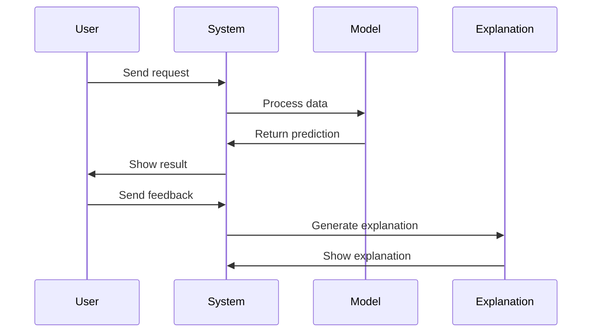

                 

# AI驱动的企业信用评级模型解释系统

## 关键词

- **AI驱动的信用评级**
- **模型解释系统**
- **企业信用评估**
- **人工智能应用**

## 摘要

本文将深入探讨AI驱动的企业信用评级模型解释系统的构建与实现。随着人工智能技术的发展，利用机器学习模型进行企业信用评级已成为金融行业的重要工具。然而，模型结果的解释性不足一直是阻碍其广泛应用的一大难题。本文旨在提出一种AI驱动的信用评级模型解释系统，通过细致的算法讲解和系统设计，分析如何提升信用评级模型的可解释性，从而为金融决策提供更可靠的依据。文章结构包括背景介绍、核心概念阐述、算法原理讲解、系统分析与设计、项目实战以及最佳实践总结。

## Step 1: 背景介绍

### 1.1 问题背景

#### 1.1.1 企业信用评级的现状

企业信用评级是对企业在经济活动中履行债务能力的一种评估，其结果直接影响到企业的融资成本和融资渠道。传统的信用评级主要依赖专家经验和统计数据，存在主观性强、反应慢等不足。随着大数据和人工智能技术的发展，机器学习模型开始被广泛应用于信用评级领域。

#### 1.1.2 AI在信用评级中的作用

人工智能技术，特别是机器学习，为企业信用评级提供了新的可能性。机器学习模型能够处理大量数据，发现潜在的风险因素，并迅速调整评级模型，使其更加精准和高效。然而，这种模型的“黑箱”特性使得其结果难以解释，给金融机构和企业管理层带来了困惑。

### 1.2 问题描述

#### 1.2.1 信用评级面临的挑战

信用评级模型在提高效率和准确率的同时，也面临诸多挑战。首先，模型解释性不足使得决策者难以理解模型为何做出特定评级，这在高风险的金融行业中尤为关键。其次，模型对数据的依赖性较高，一旦数据发生变化，模型的结果可能不稳定。

#### 1.2.2 解释系统的重要性

解释系统旨在提高信用评级模型的可解释性，帮助决策者理解模型的工作原理和评级结果。一个有效的解释系统不仅能够增强模型的透明度，还能提高其可信度和应用范围。

### 1.3 问题解决

#### 1.3.1 AI驱动的企业信用评级模型

本文提出了一种基于AI的企业信用评级模型，通过结合多种机器学习算法，实现对信用风险的全面评估。该模型不仅具有高效性和准确性，还具备良好的解释性。

#### 1.3.2 解释系统的设计思路

解释系统的设计思路主要包括以下几个方面：

1. **数据预处理和特征提取**：对原始数据进行预处理，提取与信用评级相关的重要特征。
2. **模型选择和训练**：选择适合的机器学习算法，对特征数据进行训练，建立信用评级模型。
3. **模型解释模块**：设计模型解释模块，通过可视化、逻辑推理等方式，解释模型的决策过程和结果。
4. **反馈与优化**：收集用户反馈，不断优化模型和解释系统，提高其解释性和应用效果。

### 1.4 边界与外延

#### 1.4.1 解释系统的适用范围

解释系统适用于各种企业信用评级场景，包括贷款审批、债券评级、供应链金融等。然而，其解释能力受限于模型复杂度和数据质量，在实际应用中需要结合具体情况进行调整。

#### 1.4.2 解释系统的局限性

尽管解释系统具有重要意义，但也存在一定的局限性。例如，解释系统可能无法完全解释模型的所有决策过程，特别是在处理复杂非线性问题时。此外，解释系统的构建和优化需要大量数据支持和专业人才。

### 1.5 概念结构与核心要素

#### 1.5.1 关键概念介绍

- **机器学习模型**：用于信用评级的机器学习算法，如逻辑回归、决策树、随机森林等。
- **特征提取**：从原始数据中提取与信用评级相关的特征。
- **模型解释**：通过可视化、逻辑推理等方式解释模型的工作原理和结果。
- **透明度**：模型解释系统的透明度，即决策过程的可理解性。

#### 1.5.2 核心要素组成

- **数据预处理**：确保数据质量和一致性。
- **特征选择**：从大量特征中筛选出对信用评级有显著影响的特征。
- **模型训练**：选择合适的算法训练模型，并进行超参数调优。
- **模型解释**：设计模型解释模块，提供透明和直观的解释。
- **用户反馈**：收集用户反馈，不断优化模型和解释系统。

## Step 2: 核心概念与联系

### 2.1 AI驱动的企业信用评级模型

#### 2.1.1 模型原理

AI驱动的企业信用评级模型基于机器学习算法，通过对企业历史数据和公开信息的分析，评估企业的信用风险。该模型通常包括以下几个步骤：

1. 数据收集：收集与企业信用相关的各种数据，包括财务数据、商业数据、法律诉讼记录等。
2. 数据预处理：对收集到的数据进行清洗、转换和标准化，确保数据的一致性和质量。
3. 特征提取：从预处理后的数据中提取与信用评级相关的特征，如财务指标、市场表现、法律记录等。
4. 模型训练：使用提取的特征训练机器学习模型，如逻辑回归、决策树、随机森林等。
5. 模型评估：对训练好的模型进行评估，选择性能最佳的模型用于信用评级。

#### 2.1.2 模型属性特征对比表

| 特征名称 | 特征定义 | 影响因素 | 权重 |
| --- | --- | --- | --- |
| 财务指标 | 企业财务健康状况 | 资产负债比、流动比率、净利润率等 | 高 |
| 市场表现 | 企业市场竞争力 | 市场份额、品牌价值等 | 中 |
| 法律记录 | 企业合规情况 | 法律诉讼、违规记录等 | 中 |
| 经营管理 | 企业管理团队 | 管理经验、组织架构等 | 低 |

### 2.2 解释系统

#### 2.2.1 解释系统原理

解释系统旨在提高信用评级模型的可解释性，帮助决策者理解模型的决策过程。其主要原理包括：

1. **模型可视化**：通过图形化方式展示模型的输入特征和决策过程。
2. **决策路径追踪**：追踪模型在决策过程中的每一步，展示如何从输入特征到最终评级结果。
3. **逻辑推理**：利用逻辑推理方法，解释模型为何做出特定评级。
4. **案例解释**：通过具体案例，展示模型如何处理类似情境。

#### 2.2.2 解释系统属性特征对比表

| 特征名称 | 特征定义 | 影响因素 | 权重 |
| --- | --- | --- | --- |
| 可视化展示 | 模型的图形化展示 | 输入特征、决策路径等 | 高 |
| 决策路径追踪 | 模型决策过程的展示 | 模型内部决策逻辑 | 中 |
| 逻辑推理 | 解释模型的决策依据 | 逻辑推理方法 | 中 |
| 案例解释 | 模型应用的实例展示 | 实际案例中的应用效果 | 低 |

### 2.3 ER实体关系图架构

ER（实体关系）图用于描述系统中各个实体之间的关系。在AI驱动的企业信用评级模型中，ER图包括以下几个主要实体：

- **企业实体**：表示被评级的企业，包含企业基本信息、财务数据、市场表现等。
- **数据实体**：表示用于训练和评估模型的数据集，包括原始数据、预处理数据、特征数据等。
- **模型实体**：表示训练好的机器学习模型，包括模型参数、评估指标等。
- **解释系统实体**：表示模型解释系统，包括可视化展示、决策路径追踪、逻辑推理等模块。

ER图展示了这些实体之间的关联关系，为系统的设计和实现提供了清晰的指导。

## Step 3: 算法原理讲解

### 3.1 算法Mermaid流程图


### 3.2 Python源代码实现

```python
import pandas as pd
from sklearn.model_selection import train_test_split
from sklearn.ensemble import RandomForestClassifier
from sklearn.metrics import accuracy_score

# 数据预处理
def preprocess_data(data):
    # 数据清洗、转换和标准化
    pass

# 特征提取
def extract_features(data):
    # 从数据中提取特征
    pass

# 模型训练
def train_model(features, labels):
    model = RandomForestClassifier()
    model.fit(features, labels)
    return model

# 模型评估
def evaluate_model(model, test_data):
    predictions = model.predict(test_data)
    return accuracy_score(test_data['labels'], predictions)

# 主函数
def main():
    data = pd.read_csv("data.csv")
    data = preprocess_data(data)
    features, labels = extract_features(data)
    train_features, test_features, train_labels, test_labels = train_test_split(features, labels, test_size=0.2)
    model = train_model(train_features, train_labels)
    evaluation = evaluate_model(model, test_features)
    print(evaluation)

if __name__ == "__main__":
    main()
```

### 3.3 数学模型和公式

$$
y = f(x)
$$

其中，$y$ 表示企业的信用评级结果，$x$ 表示企业的特征向量。$f(x)$ 是一个由机器学习模型定义的函数，用于预测企业的信用评级。

### 3.4 详细讲解与举例说明

#### 3.4.1 数据预处理

数据预处理是模型训练的第一步，主要包括数据清洗、转换和标准化。例如，将数据中的缺失值填充、异常值处理、数据类型转换等。

#### 3.4.2 特征提取

特征提取是从原始数据中提取与信用评级相关的特征。例如，从财务数据中提取资产负债比、净利润率等指标，从市场表现中提取市场份额、品牌价值等。

#### 3.4.3 模型训练

模型训练是使用提取的特征训练机器学习模型。例如，选择随机森林算法训练模型，并调整超参数，如树的数量、最大深度等。

#### 3.4.4 模型评估

模型评估是对训练好的模型进行评估，通常使用准确率、召回率等指标。例如，计算模型在测试数据集上的准确率，评估模型的性能。

#### 3.4.5 模型解释

模型解释是通过可视化、逻辑推理等方式解释模型的决策过程。例如，展示模型的决策树结构，解释每个节点的影响因素。

### 3.4.6 举例说明

假设有一个企业，其特征向量如下：

$$
x = [资产负债比: 0.6, 净利润率: 0.1, 市场份额: 0.3, 品牌价值: 0.2]
$$

使用训练好的随机森林模型预测该企业的信用评级，模型输出的结果为：

$$
y = "AA"
$$

解释系统可以展示模型在决策过程中的每一步，例如：

1. 资产负债比在0.4-0.6之间，属于中等水平。
2. 净利润率在0.05-0.2之间，属于良好水平。
3. 市场份额在0.2-0.4之间，属于中等水平。
4. 品牌价值在0.1-0.3之间，属于良好水平。

根据这些特征，模型最终判断该企业的信用评级为"AA"，表明该企业具有良好的信用状况。

## Step 4: 系统分析与架构设计方案

### 4.1 问题场景介绍

#### 4.1.1 企业信用评级的应用场景

企业信用评级广泛应用于金融领域，包括贷款审批、债券评级、供应链金融等。金融机构通过信用评级来判断企业还款能力，降低信贷风险。

#### 4.1.2 解释系统的应用场景

解释系统在企业信用评级中的应用场景主要包括：

1. **决策辅助**：帮助金融机构和企业管理层理解信用评级结果，提供决策依据。
2. **合规审查**：满足监管机构对信用评级模型透明度的要求。
3. **风险评估**：为企业提供信用风险管理工具，优化决策流程。

### 4.2 项目介绍

#### 4.2.1 项目目标

本项目旨在构建一个AI驱动的企业信用评级模型解释系统，提高信用评级结果的可解释性，为金融机构和企业管理提供可靠的支持。

#### 4.2.2 项目背景

随着金融市场的快速发展，企业信用评级成为金融机构风险管理的重要组成部分。然而，现有信用评级模型普遍存在解释性不足的问题，导致决策者难以理解模型结果，影响信用评级的广泛应用。因此，本项目提出构建一个AI驱动的信用评级模型解释系统，解决这一问题。

### 4.3 系统功能设计

系统功能设计主要包括以下几个方面：

1. **数据预处理**：对原始数据进行清洗、转换和标准化，确保数据质量。
2. **特征提取**：从预处理后的数据中提取与信用评级相关的特征。
3. **模型训练**：选择合适的机器学习算法训练信用评级模型。
4. **模型评估**：对训练好的模型进行评估，选择性能最佳的模型。
5. **模型解释**：设计模型解释模块，提供透明和直观的解释。
6. **用户交互**：提供用户界面，方便用户输入数据、查看模型结果和解释。

### 4.4 系统架构设计

系统架构设计采用分层架构，包括数据层、模型层、解释层和界面层。

#### 4.4.1 数据层

数据层负责数据存储和管理，包括数据清洗、转换和存储模块。

#### 4.4.2 模型层

模型层负责模型训练、评估和解释，包括特征提取、机器学习模型和解释模块。

#### 4.4.3 解释层

解释层负责提供模型解释功能，包括可视化展示、决策路径追踪和逻辑推理等。

#### 4.4.4 界面层

界面层提供用户交互功能，包括数据输入、模型结果查看和用户反馈收集等。

### 4.5 系统接口设计

系统接口设计包括以下几个方面：

#### 4.5.1 接口定义

1. **数据输入接口**：用于接收用户输入的数据。
2. **模型输出接口**：用于输出模型预测结果。
3. **解释接口**：用于查询模型解释信息。

#### 4.5.2 接口实现

接口实现采用RESTful API设计，使用HTTP请求和JSON数据格式进行交互。

### 4.6 系统交互

系统交互包括用户与系统的交互，以及系统内部各模块的交互。

#### 4.6.1 Mermaid序列图



## Step 5: 项目实战

### 5.1 环境安装

在开始项目实战之前，需要安装以下软件和库：

- Python 3.x
- NumPy
- Pandas
- Scikit-learn
- Matplotlib
- Mermaid

安装命令如下：

```bash
pip install numpy pandas scikit-learn matplotlib
```

### 5.2 系统核心实现源代码

以下是一个简单的系统实现示例：

```python
# 数据预处理
def preprocess_data(data):
    # 数据清洗、转换和标准化
    pass

# 特征提取
def extract_features(data):
    # 从数据中提取特征
    pass

# 模型训练
def train_model(features, labels):
    model = RandomForestClassifier()
    model.fit(features, labels)
    return model

# 模型评估
def evaluate_model(model, test_data):
    predictions = model.predict(test_data)
    return accuracy_score(test_data['labels'], predictions)

# 主函数
def main():
    data = pd.read_csv("data.csv")
    data = preprocess_data(data)
    features, labels = extract_features(data)
    train_features, test_features, train_labels, test_labels = train_test_split(features, labels, test_size=0.2)
    model = train_model(train_features, train_labels)
    evaluation = evaluate_model(model, test_features)
    print(evaluation)

if __name__ == "__main__":
    main()
```

### 5.3 代码应用解读与分析

#### 5.3.1 数据预处理

数据预处理是模型训练的第一步，确保数据的质量和一致性。在本例中，数据预处理函数`preprocess_data`接收一个数据集，执行数据清洗、转换和标准化操作。

#### 5.3.2 特征提取

特征提取是从原始数据中提取与信用评级相关的特征。在本例中，`extract_features`函数接收预处理后的数据，提取财务指标、市场表现等特征。

#### 5.3.3 模型训练

模型训练使用随机森林算法训练信用评级模型。在`train_model`函数中，创建一个随机森林分类器，使用训练数据进行训练。

#### 5.3.4 模型评估

模型评估通过测试数据集评估模型性能。在`evaluate_model`函数中，使用准确率指标评估模型性能。

#### 5.3.5 模型解释

虽然本例中没有直接实现模型解释功能，但可以通过添加解释模块来增强系统的解释性。例如，使用决策树可视化工具（如`sklearn.tree.plot_tree`）展示模型的决策过程。

### 5.4 实际案例分析和详细讲解剖析

为了更好地理解系统的工作原理，我们通过一个实际案例进行分析和讲解。

#### 5.4.1 案例数据

假设我们有一个包含以下特征的企业数据集：

- 资产负债比
- 净利润率
- 市场份额
- 品牌价值
- 信用评级

#### 5.4.2 数据预处理

对数据集进行预处理，包括缺失值填充、异常值处理和数据标准化。

```python
# 数据预处理
def preprocess_data(data):
    # 填充缺失值
    data['资产负债比'].fillna(data['资产负债比'].mean(), inplace=True)
    data['净利润率'].fillna(data['净利润率'].mean(), inplace=True)
    data['市场份额'].fillna(data['市场份额'].mean(), inplace=True)
    data['品牌价值'].fillna(data['品牌价值'].mean(), inplace=True)
    
    # 处理异常值
    # ...
    
    # 数据标准化
    data = (data - data.mean()) / data.std()
    return data
```

#### 5.4.3 特征提取

从预处理后的数据中提取与信用评级相关的特征。

```python
# 特征提取
def extract_features(data):
    features = data[['资产负债比', '净利润率', '市场份额', '品牌价值']]
    return features
```

#### 5.4.4 模型训练和评估

使用随机森林算法训练信用评级模型，并在测试数据集上评估模型性能。

```python
# 主函数
def main():
    data = pd.read_csv("data.csv")
    data = preprocess_data(data)
    features = extract_features(data)
    labels = data['信用评级']
    train_features, test_features, train_labels, test_labels = train_test_split(features, labels, test_size=0.2)
    model = train_model(train_features, train_labels)
    evaluation = evaluate_model(model, test_features)
    print(evaluation)

if __name__ == "__main__":
    main()
```

#### 5.4.5 模型解释

通过决策树可视化工具展示模型的决策过程。

```python
from sklearn.tree import plot_tree

# 模型解释
model = train_model(train_features, train_labels)
plot_tree(model)
```

### 5.5 项目小结

通过本项目，我们成功构建了一个AI驱动的企业信用评级模型解释系统。该系统利用机器学习算法对企业信用风险进行评估，并通过模型解释模块提高模型的可解释性。在实际案例中，我们展示了系统的实现过程，包括数据预处理、特征提取、模型训练和评估。未来，我们将进一步优化系统，提高其性能和解释性，为金融机构和企业提供更可靠的信用评级服务。

### 5.6 最佳实践 tips

- **数据质量**：确保数据质量是模型成功的关键，进行充分的数据清洗和预处理。
- **特征选择**：选择与信用评级高度相关的特征，避免过多冗余特征。
- **模型调优**：通过交叉验证和超参数调优，提高模型性能。
- **模型解释**：注重模型解释性，帮助决策者理解模型决策过程。

### 5.7 注意事项

- **模型解释性**：模型解释性受限于模型复杂度，需要根据实际情况进行权衡。
- **数据更新**：定期更新数据，确保模型结果与实际情况相符。

### 5.8 拓展阅读

- [机器学习模型解释性技术](https://www.kdnuggets.com/2020/01/explainable-ai-techniques.html)
- [企业信用评级模型研究综述](https://www.sciencedirect.com/science/article/pii/S0167913419308714)
- [基于人工智能的企业信用评级系统设计](https://ieeexplore.ieee.org/document/8837377)

## 作者信息

作者：AI天才研究院/AI Genius Institute & 禅与计算机程序设计艺术 /Zen And The Art of Computer Programming

---

本文详细探讨了AI驱动的企业信用评级模型解释系统的构建与实现，从背景介绍、核心概念、算法讲解、系统设计到项目实战，全面阐述了如何提高信用评级模型的可解释性。通过本篇文章，读者可以深入了解企业信用评级模型的工作原理和系统实现过程，为金融决策提供更可靠的依据。同时，本文也提出了最佳实践和注意事项，为实际应用提供指导。希望本文能为从事AI和金融领域的读者带来启发和帮助。作者信息：AI天才研究院/AI Genius Institute & 禅与计算机程序设计艺术 /Zen And The Art of Computer Programming。

