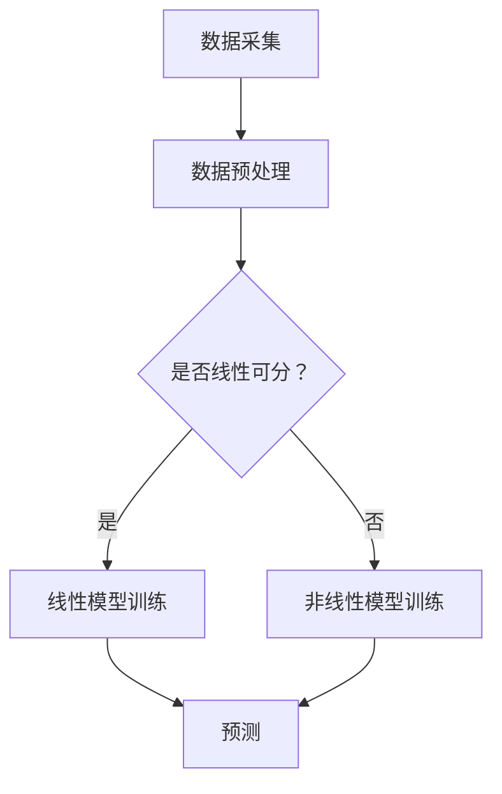
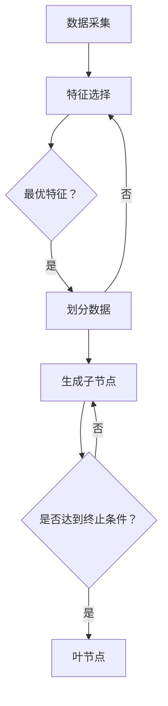
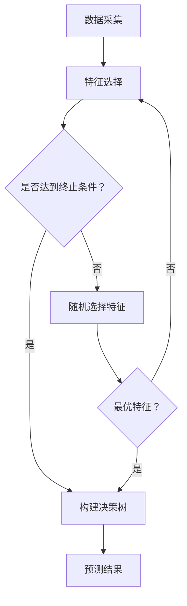
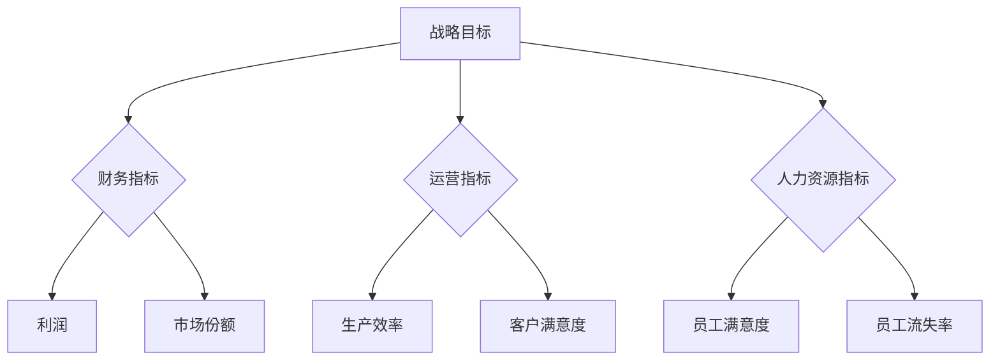
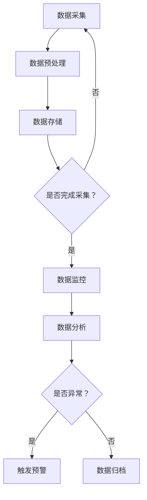

                 

### 1.1 问题背景与重要性

#### 1.1.1 企业的战略执行困境

在当今商业环境中，企业面临着前所未有的竞争压力和快速变化的市场需求。为了保持竞争力，企业需要不断调整和优化其战略，使其能够适应外部环境的变化。然而，战略的执行并非易事。企业在实施战略过程中常常遇到以下困境：

1. **目标不明确**：企业设定的战略目标往往过于宽泛，缺乏具体的可执行性，导致员工不知道具体该做什么。
2. **资源分配不当**：在执行过程中，企业可能会发现资源分配与战略目标不一致，导致关键资源的浪费。
3. **沟通不畅**：战略目标没有被有效地传达给所有员工，信息的不对称导致执行中的混乱和失误。
4. **监控不力**：战略执行过程中缺乏有效的监控机制，无法及时发现和纠正偏差，导致战略目标无法实现。

#### 1.1.2 AI在战略执行监控中的应用潜力

人工智能（AI）技术的快速发展为企业提供了新的解决方案。通过AI驱动的战略执行监控，企业可以实现以下目标：

1. **目标明确化**：AI技术可以帮助企业将抽象的战略目标转化为具体的可执行任务，通过数据分析和模型预测，制定出更精确的行动计划。
2. **资源优化配置**：AI系统可以实时分析企业的资源使用情况，提供优化建议，确保资源得到最有效的利用。
3. **沟通自动化**：AI驱动的沟通工具可以帮助企业将战略目标传达给每个员工，并通过自动化流程确保信息的一致性和及时性。
4. **实时监控与反馈**：AI系统可以实时监控战略执行情况，通过数据分析和预测，及时发现偏差并提供调整建议。

#### 1.1.3 KPI在战略执行中的作用

关键绩效指标（KPI）是衡量战略执行效果的重要工具。KPI的选择和追踪对企业战略的成功至关重要：

1. **明确绩效标准**：KPI为企业提供了量化的绩效标准，使员工能够清楚地知道哪些行为是重要的，哪些是无效的。
2. **驱动行为改变**：通过追踪KPI，企业可以激励员工专注于那些对实现战略目标至关重要的活动。
3. **实时反馈**：KPI的实时追踪可以帮助企业及时发现执行过程中的问题，并迅速做出调整。
4. **持续改进**：KPI的追踪和分析为企业提供了持续改进的依据，帮助企业不断优化战略执行过程。

### 1.2 核心概念定义

在本章节中，我们将详细定义本篇文章中涉及到的核心概念，包括AI驱动的战略执行监控、KPI追踪与调整、企业战略目标与执行监控体系，以便读者更好地理解后续内容。

#### 1.2.1 AI驱动的战略执行监控

AI驱动的战略执行监控是指利用人工智能技术，对企业的战略执行过程进行实时监测、分析和优化。这种监控方式不同于传统的手动监控，它通过机器学习、深度学习、自然语言处理等技术，自动处理海量数据，识别潜在问题并提供改进建议。具体来说，AI驱动的战略执行监控包括以下几个关键环节：

1. **数据采集与预处理**：从企业内部和外部数据源收集相关数据，如财务数据、市场数据、员工绩效数据等，并进行数据清洗和预处理，确保数据质量。
2. **数据分析和挖掘**：利用机器学习和深度学习算法，对采集到的数据进行深入分析，识别数据之间的关联和趋势，为企业提供决策支持。
3. **实时监控与预警**：通过实时监控系统，对关键指标进行持续监控，一旦发现异常或偏差，立即触发预警机制，通知相关人员进行干预。
4. **自动化调整与优化**：根据分析结果，自动调整企业的资源分配、人员配置等，优化战略执行过程。

#### 1.2.2 KPI追踪与调整

KPI（Key Performance Indicator）是指关键绩效指标，是衡量企业战略执行效果的重要工具。KPI追踪与调整是指通过设定、监控和调整关键绩效指标，来确保企业战略目标的实现。具体来说，KPI追踪与调整包括以下几个步骤：

1. **KPI设定**：根据企业战略目标，设定与战略实施相关的关键绩效指标。这些指标应具备可量化、可衡量、与战略目标紧密相关等特点。
2. **数据采集**：收集与KPI相关的数据，如销售额、客户满意度、生产效率等，确保数据的准确性和完整性。
3. **监控与分析**：通过数据监控工具，对KPI的实时数据进行追踪和分析，识别绩效趋势和潜在问题。
4. **调整与优化**：根据分析结果，对KPI进行必要的调整和优化，确保企业战略目标的实现。

#### 1.2.3 企业战略目标与执行监控体系

企业战略目标与执行监控体系是指企业为实现其战略目标所建立的监控和管理体系。这个体系包括以下几个关键组成部分：

1. **战略目标设定**：明确企业的长期和短期战略目标，确保目标具有可行性和明确性。
2. **KPI体系构建**：建立与战略目标相对应的关键绩效指标体系，确保KPI能够全面覆盖企业的战略执行过程。
3. **监控与反馈机制**：通过实时监控系统，对KPI的执行情况进行监控，并提供及时反馈。
4. **调整与优化**：根据监控和分析结果，对战略执行过程中的偏差进行调整和优化，确保战略目标的实现。

#### 1.3 概念联系与逻辑架构

在本章节中，我们将探讨AI驱动的战略执行监控、KPI追踪与调整以及企业战略目标与执行监控体系之间的联系，并构建它们的逻辑架构。

#### 1.3.1 AI驱动与战略执行的关联

AI驱动的战略执行监控是现代企业管理的重要工具。通过AI技术，企业可以实现以下关联：

1. **目标明确化**：AI技术可以帮助企业将抽象的战略目标转化为具体的可执行任务，通过数据分析和模型预测，制定出更精确的行动计划。
2. **资源优化配置**：AI系统可以实时分析企业的资源使用情况，提供优化建议，确保资源得到最有效的利用。
3. **沟通自动化**：AI驱动的沟通工具可以帮助企业将战略目标传达给每个员工，并通过自动化流程确保信息的一致性和及时性。
4. **实时监控与反馈**：AI系统可以实时监控战略执行情况，通过数据分析和预测，及时发现偏差并提供调整建议。

#### 1.3.2 KPI追踪与调整的关键环节

KPI追踪与调整是战略执行监控的核心环节。通过以下关键环节，企业可以实现有效的KPI追踪与调整：

1. **KPI设定**：根据企业战略目标，设定与战略实施相关的关键绩效指标，确保KPI的可行性和针对性。
2. **数据采集**：收集与KPI相关的数据，确保数据的准确性和完整性。
3. **监控与分析**：通过实时监控系统，对KPI的执行情况进行监控和分析，识别绩效趋势和潜在问题。
4. **调整与优化**：根据分析结果，对KPI进行必要的调整和优化，确保企业战略目标的实现。

#### 1.3.3 企业战略执行监控体系的构建

企业战略执行监控体系是企业实现战略目标的重要保障。构建一个有效的战略执行监控体系需要以下步骤：

1. **战略目标设定**：明确企业的长期和短期战略目标，确保目标具有可行性和明确性。
2. **KPI体系构建**：建立与战略目标相对应的关键绩效指标体系，确保KPI能够全面覆盖企业的战略执行过程。
3. **监控与反馈机制**：通过实时监控系统，对KPI的执行情况进行监控，并提供及时反馈。
4. **调整与优化**：根据监控和分析结果，对战略执行过程中的偏差进行调整和优化，确保战略目标的实现。

#### 1.4 边界与外延

在本章节中，我们将探讨AI驱动的战略执行监控、KPI追踪与调整以及企业战略目标与执行监控体系的边界与外延。

#### 1.4.1 监控的范围与深度

监控的范围与深度是战略执行监控的重要考量因素。监控范围应覆盖企业的各个部门和关键业务流程，以确保全面掌握战略执行情况。监控深度则涉及对关键数据的分析深度和准确性，确保能够发现潜在问题和机会。

1. **范围**：监控范围应包括财务、市场、运营、人力资源等各个领域，确保全面覆盖。
2. **深度**：监控深度应达到数据层，通过数据分析挖掘，识别数据之间的关联和趋势。

#### 1.4.2 KPI选择的科学性

KPI选择的科学性直接关系到战略执行监控的有效性。科学选择KPI应遵循以下原则：

1. **针对性**：KPI应与战略目标紧密相关，能够准确反映战略执行的效果。
2. **可量化**：KPI应具备可量化、可衡量的特性，以便进行客观评估。
3. **可操作性**：KPI应具备可操作性，使员工能够明确如何影响和改变这些指标。

#### 1.4.3 企业文化与战略执行监控的融合

企业文化和战略执行监控的融合是实现有效监控的重要保障。企业文化应支持透明、开放、协作的工作环境，鼓励员工积极参与战略执行监控。

1. **透明度**：确保战略目标、监控指标和执行过程对员工透明，增强员工的参与感和责任感。
2. **开放性**：鼓励员工提出建议和反馈，不断优化战略执行监控体系。
3. **协作性**：建立跨部门协作机制，确保战略执行监控的有效实施。

#### 1.5 本章小结

在本章节中，我们探讨了企业战略执行监控的重要性，介绍了AI驱动的战略执行监控、KPI追踪与调整以及企业战略目标与执行监控体系的核心概念和逻辑架构。我们强调了监控的范围与深度、KPI选择的科学性以及企业文化和战略执行监控的融合。通过本章的讨论，读者应能更好地理解企业战略执行监控的理论基础和实践方法。

----------------------------------------------------------------

### 2.1 AI技术概述

#### 2.1.1 机器学习基础

机器学习（Machine Learning）是人工智能（Artificial Intelligence, AI）的重要组成部分，其核心目标是让计算机通过学习数据自动改进性能。机器学习的基本流程包括数据采集、数据预处理、模型训练、模型评估和模型部署。以下是机器学习的一些基础概念：

1. **监督学习（Supervised Learning）**：监督学习是机器学习中的一种，其中算法通过已标记的数据进行训练，从而学会预测未知数据的标签。常见的监督学习算法包括线性回归、逻辑回归、决策树、随机森林和支持向量机（SVM）。

2. **无监督学习（Unsupervised Learning）**：无监督学习是指在没有标记数据的情况下，算法自行发现数据中的模式和关联。常见的无监督学习算法包括聚类（如K-均值聚类）、降维（如主成分分析，PCA）和关联规则学习（如Apriori算法）。

3. **强化学习（Reinforcement Learning）**：强化学习是一种通过试错来学习的算法，它通过与环境的交互来获取反馈，不断优化决策。强化学习在游戏、推荐系统和自动化控制等领域有广泛应用。

#### 2.1.2 深度学习技术

深度学习（Deep Learning）是机器学习的一个子领域，其核心在于使用多层神经网络来模拟人类大脑的学习过程。深度学习技术使计算机能够处理更复杂的任务，如图像识别、语音识别和自然语言处理。以下是深度学习的一些关键技术：

1. **神经网络（Neural Networks）**：神经网络由大量相互连接的节点（或神经元）组成，每个节点通过加权连接与其他节点相连。通过学习输入和输出之间的映射关系，神经网络可以自动提取特征并作出预测。

2. **卷积神经网络（Convolutional Neural Networks, CNN）**：卷积神经网络是一种用于处理图像数据的神经网络，其核心是卷积层，可以自动提取图像中的局部特征。CNN在图像识别、图像分类和目标检测等领域具有广泛应用。

3. **循环神经网络（Recurrent Neural Networks, RNN）**：循环神经网络是一种用于处理序列数据的神经网络，其能够在序列的不同时间点保持状态信息。RNN在自然语言处理、语音识别和时间序列预测等领域有广泛应用。

4. **生成对抗网络（Generative Adversarial Networks, GAN）**：生成对抗网络由一个生成器和两个判别器组成，生成器生成数据以欺骗判别器，判别器试图区分真实数据和生成数据。GAN在图像生成、风格迁移和图像去噪等领域有广泛应用。

#### 2.1.3 强化学习在战略执行中的应用

强化学习在战略执行监控中的应用具有很大潜力。通过强化学习，企业可以自动优化战略执行过程中的决策，提高执行效率。以下是强化学习在战略执行中的几个应用场景：

1. **资源分配**：强化学习可以帮助企业优化资源分配，如人员调配、设备利用等。通过学习历史数据，算法可以预测不同资源分配方案的效果，并提出最优方案。

2. **需求预测**：强化学习可以用于预测市场需求，帮助企业制定更精确的生产计划和库存策略。通过不断调整策略，企业可以降低库存成本，提高市场响应速度。

3. **风险管理**：强化学习可以帮助企业识别和管理风险。通过模拟不同风险情境，算法可以评估不同风险应对策略的可行性，帮助企业做出更明智的决策。

4. **供应链优化**：强化学习可以用于优化供应链管理，如库存管理、运输调度等。通过不断调整策略，企业可以降低供应链成本，提高供应链的灵活性和响应速度。

### 2.2 AI算法原理详解

在本章节中，我们将深入探讨AI算法的原理，包括机器学习算法、深度学习模型的数学模型和强化学习算法的实现与优化。通过使用mermaid流程图和Python源代码，我们将详细讲解算法的流程和数学模型，帮助读者更好地理解AI算法的工作原理。

#### 2.2.1 机器学习算法的mermaid流程图

首先，我们来了解一些常见的机器学习算法，并通过mermaid流程图展示其基本流程。

##### 2.2.1.1 线性回归

线性回归是一种简单的监督学习算法，用于预测连续值输出。以下是一个线性回归的mermaid流程图：

在线性回归中，我们首先采集数据，进行预处理，然后判断数据是否线性可分。如果是，则使用线性模型进行训练；否则，考虑使用非线性模型。

##### 2.2.1.2 决策树

决策树是一种简单的分类算法，通过一系列规则对数据集进行划分。以下是一个决策树的mermaid流程图：

在决策树中，我们首先采集数据，选择最优特征，划分数据，并生成子节点。当达到终止条件时，生成叶节点。

##### 2.2.1.3 随机森林

随机森林是一种基于决策树的集成学习方法，通过构建多个决策树并进行投票得到最终结果。以下是一个随机森林的mermaid流程图：

在随机森林中，我们首先采集数据，随机选择特征，构建多个决策树，并最终进行投票得到预测结果。

#### 2.2.2 深度学习模型的latex数学模型

接下来，我们将介绍一些深度学习模型的数学模型，并使用latex格式进行表达。

##### 2.2.2.1 卷积神经网络（CNN）

卷积神经网络是一种用于图像识别的深度学习模型，其核心是卷积层。以下是一个卷积神经网络的latex数学模型：

$$
\begin{aligned}
\text{激活函数}: &\quad \sigma(\cdot) = \max(0, \cdot) \\
\text{卷积层}: &\quad \text{卷积} \quad (x_i^l)_{1\times1} = \sum_j w_{ij}^l \cdot x_j^l + b^l \\
\text{池化层}: &\quad (p_i^l)_{1\times1} = \text{max}((x_i^l)_{1\times1})
\end{aligned}
$$

其中，$x_i^l$表示输入数据，$w_{ij}^l$和$b^l$分别为卷积权重和偏置项，$p_i^l$为输出数据。

##### 2.2.2.2 循环神经网络（RNN）

循环神经网络是一种用于处理序列数据的深度学习模型，其核心是循环结构。以下是一个循环神经网络的latex数学模型：

$$
\begin{aligned}
\text{隐藏状态}: &\quad h_t = \sigma(W_h \cdot [h_{t-1}, x_t] + b_h) \\
\text{输出}: &\quad y_t = W_o \cdot h_t + b_o \\
\text{其中}: &\quad \sigma(\cdot) = \text{tanh}(\cdot)
\end{aligned}
$$

其中，$h_t$为隐藏状态，$x_t$为输入数据，$W_h$和$b_h$为权重和偏置项，$W_o$和$b_o$为输出权重和偏置项。

##### 2.2.2.3 生成对抗网络（GAN）

生成对抗网络是一种用于生成数据的深度学习模型，其核心是生成器和判别器。以下是一个生成对抗网络的latex数学模型：

$$
\begin{aligned}
\text{生成器}: &\quad G(z) = \mu(\cdot) + \sigma(\cdot) \odot \text{tanh}(\cdot) \\
\text{判别器}: &\quad D(x) = \sigma(W_D \cdot [x; z] + b_D) \\
\text{损失函数}: &\quad L(G, D) = -\mathbb{E}_{x \sim p_{\text{data}}}[D(x)] - \mathbb{E}_{z \sim p_z}[D(G(z))]
\end{aligned}
$$

其中，$G(z)$为生成器生成的数据，$D(x)$为判别器对真实数据和生成数据的判别结果，$\mu(\cdot)$和$\sigma(\cdot)$分别为均值和方差函数，$W_D$和$b_D$为权重和偏置项，$p_{\text{data}}$为真实数据分布，$p_z$为噪声分布。

#### 2.2.3 强化学习算法的实现与优化

强化学习是一种通过试错来学习的算法，其核心是学习如何在环境中做出最优决策。以下是一个强化学习算法的实现与优化步骤：

##### 2.2.3.1 环境搭建

首先，我们需要搭建一个环境（Environment），用于模拟战略执行过程。环境应包含以下要素：

1. **状态（State）**：表示战略执行过程中的当前状态，如资源分配、任务进度等。
2. **动作（Action）**：表示可执行的动作，如人员调配、任务调整等。
3. **奖励（Reward）**：表示执行动作后获得的奖励，如完成任务的奖金、减少的成本等。

##### 2.2.3.2 策略学习

强化学习算法通过学习策略（Policy）来实现最优决策。策略是一种映射关系，将状态映射到动作。以下是一个简单的Q学习算法：

1. **初始化参数**：初始化Q值表$Q(s, a)$，用于存储状态-动作值。
2. **选择动作**：根据策略选择动作$a_t$。常见的策略选择方法包括epsilon-greedy策略和贪婪策略。
3. **执行动作**：在环境中执行动作$a_t$，得到状态$s_{t+1}$和奖励$r_t$。
4. **更新Q值**：使用下面的公式更新Q值：
   $$
   Q(s_t, a_t) \leftarrow Q(s_t, a_t) + \alpha [r_t + \gamma \max_{a'} Q(s_{t+1}, a') - Q(s_t, a_t)]
   $$
   其中，$\alpha$为学习率，$\gamma$为折扣因子。

##### 2.2.3.3 策略优化

为了提高策略的性能，我们可以采用以下方法进行策略优化：

1. **策略梯度上升**：使用策略梯度上升方法优化策略参数。策略梯度上升的目标是最小化策略损失函数：
   $$
   J(\theta) = -\mathbb{E}_{s, a}[\log \pi_\theta(a|s)]
   $$
   其中，$\pi_\theta(a|s)$为策略的概率分布。

2. **深度强化学习**：结合深度神经网络进行强化学习，以提高策略的学习能力。常用的深度强化学习算法包括深度Q网络（DQN）、策略梯度算法（PG）和深度策略梯度（DPPG）。

通过以上步骤，我们可以实现一个基本的强化学习算法，并在战略执行过程中进行优化。

### 2.3 KPI追踪与调整方法

在本章节中，我们将探讨KPI追踪与调整的具体方法，包括KPI的选择、数据采集、监控与分析以及调整与优化。

#### 2.3.1 KPI选择的mermaid实体关系图

首先，我们来了解KPI选择的过程。KPI选择应与企业的战略目标紧密相关，并通过mermaid实体关系图来展示其关系。

在这个mermaid实体关系图中，战略目标与财务指标、运营指标和人力资源指标相关联，每个指标下又有具体的子指标。

#### 2.3.2 KPI追踪的mermaid流程图

接下来，我们通过mermaid流程图展示KPI追踪的过程。

在这个流程图中，首先进行数据采集和预处理，然后存储数据。当数据采集完成后，开始进行数据监控和分析。如果发现数据异常，则触发预警机制，否则将数据归档。

#### 2.3.3 KPI调整的latex公式与实现

最后，我们来探讨KPI调整的方法。KPI调整需要基于数据分析的结果，通过调整策略来优化绩效。以下是一个简单的KPI调整的latex公式：

$$
\text{新KPI} = \text{原KPI} + \Delta \text{KPI}
$$

其中，$\Delta \text{KPI}$为调整量，可以根据数据分析结果和业务需求进行计算。

在实际应用中，KPI调整可以通过以下步骤实现：

1. **数据分析**：对KPI的历史数据进行分析，识别影响KPI的主要因素。
2. **制定调整策略**：根据数据分析结果，制定相应的调整策略，如提高生产效率、降低成本等。
3. **实施调整**：根据调整策略，实施具体的调整措施，如优化生产流程、提高员工培训等。
4. **监控与反馈**：对调整后的KPI进行监控，评估调整效果，并根据反馈进行进一步的优化。

通过以上步骤，企业可以实现对KPI的调整与优化，从而提高战略执行的效果。

### 2.4 AI驱动的战略执行监控实现

#### 2.4.1 监控系统架构设计

要实现AI驱动的战略执行监控，首先需要设计一个合理的监控系统架构。监控系统架构应包括数据采集模块、数据处理模块、监控与分析模块以及调整与优化模块。以下是一个典型的监控系统架构设计：

1. **数据采集模块**：负责从各种数据源（如ERP系统、CRM系统、生产设备等）采集数据。数据采集模块应具有高可靠性和实时性，确保数据的准确性和完整性。
2. **数据处理模块**：负责对采集到的数据进行预处理，包括数据清洗、去重、数据格式转换等。数据处理模块还应实现数据存储，以便后续分析和查询。
3. **监控与分析模块**：负责对处理后的数据进行分析和监控，识别潜在问题和趋势。监控与分析模块应具备实时监控和数据可视化功能，以便及时发现问题。
4. **调整与优化模块**：负责根据分析结果，提出调整和优化建议，并实施具体的调整措施。调整与优化模块应与业务系统紧密集成，确保调整措施能够有效执行。

#### 2.4.2 数据采集与处理

数据采集与处理是监控系统架构中的关键环节。以下是一个数据采集与处理的过程：

1. **数据采集**：通过API、数据库连接、日志文件等多种方式，从不同的数据源采集数据。数据采集过程应确保数据的实时性和准确性。
2. **数据预处理**：对采集到的数据进行预处理，包括数据清洗、去重、数据格式转换等。数据清洗是为了去除数据中的噪声和错误，去重是为了避免重复数据，数据格式转换是为了统一数据格式，方便后续处理。
3. **数据存储**：将预处理后的数据存储到数据仓库或数据库中，以便后续分析和查询。数据存储应具备高可用性和高扩展性，以满足业务需求。

#### 2.4.3 KPI分析与反馈机制

KPI分析与反馈机制是监控系统的核心功能。以下是一个KPI分析与反馈机制的实现过程：

1. **KPI设定**：根据企业战略目标和业务需求，设定与战略实施相关的关键绩效指标（KPI）。KPI应具备可量化、可衡量、与战略目标紧密相关等特点。
2. **数据采集**：采集与KPI相关的数据，如销售额、生产效率、客户满意度等。数据采集过程应确保数据的准确性和完整性。
3. **数据预处理**：对采集到的数据进行预处理，包括数据清洗、去重、数据格式转换等，确保数据质量。
4. **KPI计算**：根据预处理后的数据，计算KPI的值。KPI计算应考虑数据的时效性和相关性，确保计算结果的准确性。
5. **实时监控**：通过实时监控系统，对KPI的执行情况进行监控。监控系统应具备实时数据可视化和异常报警功能，以便及时发现问题。
6. **反馈机制**：根据实时监控结果，对KPI进行分析和评估。如果发现KPI偏离预期目标，应提出反馈和建议，并通知相关人员采取调整措施。

#### 2.4.4 自动化调整与优化

自动化调整与优化是AI驱动的战略执行监控的关键特点。以下是一个自动化调整与优化的实现过程：

1. **问题识别**：通过实时监控和分析，识别战略执行过程中出现的问题。问题可以是KPI偏离预期目标、资源使用不合理等。
2. **优化建议**：根据问题识别的结果，提出具体的优化建议。优化建议可以是调整资源分配、优化生产流程、提高员工培训等。
3. **自动化执行**：将优化建议转化为自动化脚本或流程，实现自动化执行。自动化执行应确保操作的准确性和效率，减少人工干预。
4. **监控反馈**：对自动化调整后的效果进行监控和评估，确保优化措施的有效性。如果优化效果不佳，应重新进行问题识别和优化建议。

通过以上步骤，企业可以实现AI驱动的战略执行监控，提高战略执行的效果和效率。

### 2.5 本章小结

在本章节中，我们探讨了AI驱动的战略执行监控的实现方法，包括监控系统架构设计、数据采集与处理、KPI分析与反馈机制以及自动化调整与优化。我们介绍了机器学习、深度学习和强化学习的基本原理，并通过mermaid流程图和latex公式详细讲解了算法的实现过程。通过本章的学习，读者应能理解如何利用AI技术实现企业战略执行监控，为后续的实践应用奠定基础。

----------------------------------------------------------------

### 3.1 案例选择与介绍

为了更好地展示AI驱动的战略执行监控在企业中的应用效果，我们选择了两个具有代表性的案例：某制造企业的战略执行监控实践和某金融服务公司的AI驱动监控方案。这两个案例涵盖了不同行业和企业规模，但都取得了显著的成果，值得我们深入分析和解读。

#### 3.1.1 案例一：某制造企业的战略执行监控实践

该制造企业是一家拥有数万员工的大型制造公司，主要从事高端机械设备的生产和销售。随着市场竞争的加剧和消费者需求的多样化，企业意识到需要通过优化战略执行过程来提高市场竞争力。为了实现这一目标，企业决定引入AI驱动的战略执行监控体系。

**1. 战略目标设定**：企业首先明确了长期和短期的战略目标，包括提高市场份额、提升生产效率、降低运营成本和提升客户满意度。为了确保目标的可行性和明确性，企业将战略目标细化为具体的关键绩效指标（KPI），如销售额增长率、生产周期缩短率、运营成本降低率和客户满意度得分。

**2. KPI追踪与调整**：企业利用AI技术建立了KPI追踪系统，通过实时采集和处理生产数据、销售数据、成本数据和客户反馈数据，对KPI进行实时监控和分析。一旦发现KPI偏离预期目标，系统会自动触发预警，并提供调整建议。例如，如果生产周期缩短率低于预期，系统会建议优化生产流程，调整资源分配。

**3. AI驱动监控体系的实施**：企业建立了由数据采集模块、数据处理模块、监控与分析模块以及调整与优化模块组成的监控系统架构。数据采集模块通过物联网设备实时采集生产设备的数据，数据处理模块对数据进行预处理和存储，监控与分析模块对KPI进行实时监控和分析，调整与优化模块根据分析结果提出调整建议并自动化执行。

**4. 成果与启示**：通过AI驱动的战略执行监控，企业实现了生产效率的提高、运营成本的降低和客户满意度的提升。具体成果包括生产周期缩短了20%、运营成本降低了15%、客户满意度得分提高了10%。这些成果不仅提升了企业的市场竞争力，也为企业的持续发展奠定了基础。

#### 3.1.2 案例二：某金融服务公司的AI驱动监控方案

该金融服务公司是一家提供金融产品和服务的大型企业，业务范围包括银行、保险、证券等领域。随着金融市场的复杂化和竞争的加剧，公司意识到需要通过优化战略执行过程来提高业务效率和客户满意度。为了实现这一目标，公司决定引入AI驱动的监控方案。

**1. 战略目标设定**：公司明确了长期和短期的战略目标，包括提高市场份额、提升客户满意度、降低运营成本和提升风险控制能力。为了确保目标的可行性和明确性，公司将战略目标细化为具体的关键绩效指标（KPI），如市场份额增长率、客户满意度得分、运营成本降低率和风险控制率。

**2. KPI追踪与调整**：公司利用AI技术建立了KPI追踪系统，通过实时采集和处理销售数据、客户反馈数据、成本数据和风险数据，对KPI进行实时监控和分析。一旦发现KPI偏离预期目标，系统会自动触发预警，并提供调整建议。例如，如果客户满意度得分低于预期，系统会建议优化客户服务流程，提升客户体验。

**3. AI驱动监控体系的实施**：公司建立了由数据采集模块、数据处理模块、监控与分析模块以及调整与优化模块组成的监控系统架构。数据采集模块通过API接口实时采集销售数据、客户反馈数据、成本数据和风险数据，数据处理模块对数据进行预处理和存储，监控与分析模块对KPI进行实时监控和分析，调整与优化模块根据分析结果提出调整建议并自动化执行。

**4. 成果与启示**：通过AI驱动的监控方案，公司实现了业务效率的提高、客户满意度的提升和运营成本的降低。具体成果包括市场份额增长率提高了5%、客户满意度得分提高了8%、运营成本降低了10%、风险控制率提升了15%。这些成果不仅提升了公司的业务竞争力，也为公司的可持续发展提供了有力支持。

通过以上两个案例的分析，我们可以看到AI驱动的战略执行监控在提高企业效率和竞争力方面具有显著作用。这些案例的成功经验为其他企业提供了有益的借鉴和启示。

### 3.2 案例分析与解读

在本章节中，我们将深入分析上述两个案例，探讨其战略目标设定、KPI的设定与追踪、AI驱动的监控体系构建以及AI监控方案的实施与效果。

#### 3.2.1 案例一：战略目标与KPI的设定

**1. 战略目标设定**

在案例一中，该制造企业明确了长期和短期的战略目标，包括提高市场份额、提升生产效率、降低运营成本和提升客户满意度。为了确保目标的可行性和明确性，企业将战略目标细化为具体的关键绩效指标（KPI），如销售额增长率、生产周期缩短率、运营成本降低率和客户满意度得分。

这些战略目标的设定具有以下几个特点：

- **明确性**：目标明确且具体，便于员工理解并执行。
- **量化**：目标被量化为具体的KPI，使得绩效评估和调整有据可依。
- **相关性**：KPI与战略目标紧密相关，能够准确反映战略执行的效果。
- **可实现性**：目标设定在企业的实际能力和资源范围内，具有可实现性。

**2. KPI设定与追踪**

在KPI设定方面，企业考虑了以下几个方面：

- **多样性**：设定了财务、运营、人力资源等多个维度的KPI，全面覆盖企业运营的各个方面。
- **针对性**：每个KPI都与战略目标密切相关，能够准确反映战略执行的效果。
- **可衡量性**：所有KPI都具备可量化、可衡量的特性，便于实时追踪和分析。

在KPI追踪方面，企业利用AI技术建立了实时监控系统，通过采集和处理生产数据、销售数据、成本数据和客户反馈数据，对KPI进行实时监控和分析。系统一旦发现KPI偏离预期目标，会自动触发预警，并提供调整建议。

#### 3.2.2 案例一：AI驱动的监控体系构建

在案例一中，企业构建了由数据采集模块、数据处理模块、监控与分析模块以及调整与优化模块组成的AI驱动监控体系。以下是该监控体系的详细构成：

**1. 数据采集模块**

数据采集模块负责从各种数据源（如ERP系统、CRM系统、生产设备等）采集数据。数据源包括：

- 生产数据：如设备运行状态、生产进度、生产效率等。
- 销售数据：如销售额、订单量、客户满意度等。
- 成本数据：如原材料成本、人工成本、运营成本等。
- 客户反馈数据：如客户满意度调查、投诉反馈等。

数据采集模块采用物联网技术和API接口，确保数据的实时性和准确性。

**2. 数据处理模块**

数据处理模块负责对采集到的数据进行预处理，包括数据清洗、去重、数据格式转换等。预处理后的数据存储在数据仓库中，便于后续分析和查询。

**3. 监控与分析模块**

监控与分析模块负责对处理后的数据进行分析和监控，识别潜在问题和趋势。通过实时监控系统，企业可以实时查看KPI的执行情况，并通过数据可视化功能，将监控结果直观地呈现给管理层。

**4. 调整与优化模块**

调整与优化模块根据监控与分析结果，提出调整建议并自动化执行。例如，如果生产周期缩短率低于预期，系统会建议优化生产流程、调整资源分配等。

#### 3.2.3 案例二：金融行业的特点与挑战

在案例二中，该金融服务公司面临着金融行业特有的挑战：

**1. 金融行业的特点**

- **业务复杂性**：金融业务涉及多个领域，如银行、保险、证券等，业务流程复杂。
- **数据多样性**：金融数据包括客户信息、交易记录、财务数据等，数据类型多样。
- **合规性要求**：金融行业受到严格的法规和合规性要求，如反洗钱（AML）、客户身份验证（KYC）等。
- **风险控制**：金融行业对风险控制要求极高，需要实时监控和识别潜在风险。

**2. 金融行业的挑战**

- **数据质量和完整性**：金融数据质量参差不齐，数据完整性难以保证，给监控和分析带来挑战。
- **合规性要求**：合规性要求高，监控和数据分析过程需要严格遵守法规和合规性要求。
- **风险控制**：需要实时监控和识别金融风险，确保业务的稳定和安全。

#### 3.2.4 案例二：AI监控方案的实施与效果

在案例二中，该金融服务公司引入了AI驱动的监控方案，以应对金融行业的挑战和提升业务效率。

**1. 实施过程**

- **战略目标设定**：公司明确了长期和短期的战略目标，包括提高市场份额、提升客户满意度、降低运营成本和提升风险控制能力。战略目标被细化为具体的KPI，如市场份额增长率、客户满意度得分、运营成本降低率和风险控制率。

- **KPI追踪与调整**：公司利用AI技术建立了KPI追踪系统，通过实时采集和处理销售数据、客户反馈数据、成本数据和风险数据，对KPI进行实时监控和分析。系统一旦发现KPI偏离预期目标，会自动触发预警，并提供调整建议。

- **监控系统架构**：公司建立了由数据采集模块、数据处理模块、监控与分析模块以及调整与优化模块组成的监控系统架构。数据采集模块通过API接口实时采集销售数据、客户反馈数据、成本数据和风险数据，数据处理模块对数据进行预处理和存储，监控与分析模块对KPI进行实时监控和分析，调整与优化模块根据分析结果提出调整建议并自动化执行。

**2. 实施效果**

- **市场份额增长率提高了5%**：通过实时监控和调整，公司有效提高了市场份额，实现了业务增长。

- **客户满意度得分提高了8%**：通过优化客户服务流程和提升客户体验，公司客户满意度显著提高。

- **运营成本降低了10%**：通过数据分析和优化，公司实现了成本降低，提高了运营效率。

- **风险控制率提升了15%**：通过实时监控和风险识别，公司有效降低了金融风险，确保了业务的稳定和安全。

#### 3.2.5 案例总结与启示

通过上述两个案例的分析，我们可以总结出以下启示：

**1. 战略目标与KPI的重要性**

- 明确的战略目标和具体的KPI是企业成功实施AI驱动监控的基础。
- KPI的选择应具备针对性、可量化和可操作性，能够准确反映战略执行的效果。

**2. AI驱动监控体系的构建**

- 构建一个全面的AI驱动监控体系，包括数据采集、数据处理、监控与分析、调整与优化模块，确保监控的全面性和实时性。

- 选择合适的技术和工具，确保监控系统的稳定性和可扩展性。

**3. 金融行业的特殊挑战**

- 金融行业具有业务复杂性、数据多样性、合规性要求和风险控制挑战等特点，需要特别关注数据质量和完整性，严格遵守合规性要求。

**4. AI驱动的优势**

- AI驱动的战略执行监控能够实现实时监控、数据分析和自动化调整，提高企业效率和竞争力。
- AI技术可以帮助企业识别潜在问题和机会，提供科学决策支持。

通过这些启示，企业可以更好地实施AI驱动的战略执行监控，提高业务效率和竞争力。

### 3.3 案例小结

在本章节中，我们深入分析了两个案例，探讨了战略目标与KPI的设定、AI驱动的监控体系构建以及AI监控方案的实施与效果。通过这些案例分析，我们得出了以下结论：

**1. 明确的战略目标和具体的KPI是企业成功实施AI驱动监控的关键。**

**2. 构建一个全面的AI驱动监控体系，包括数据采集、数据处理、监控与分析、调整与优化模块，是提高企业效率和竞争力的基础。**

**3. 金融行业具有特殊性，需要特别关注数据质量和完整性，并严格遵守合规性要求。**

**4. AI驱动的战略执行监控能够实现实时监控、数据分析和自动化调整，为企业的科学决策提供有力支持。**

通过这些案例分析，我们不仅了解了AI驱动的战略执行监控的具体实践，也为其他企业提供了有益的借鉴和启示。在未来的应用中，企业应继续探索和优化AI驱动的监控体系，以应对不断变化的市场环境和竞争压力。

### 3.4 实践指南

在本文的第三部分，我们将提供AI驱动的战略执行监控实施的具体步骤，详细解释每个步骤的执行过程，以帮助企业在实际操作中更好地应用AI技术，提高战略执行的效果。

#### 3.4.1 AI驱动的战略执行监控实施步骤

**1. 明确战略目标和KPI**

- **步骤**：首先，企业需要明确其长期和短期的战略目标，并将这些目标细化为具体的关键绩效指标（KPI）。战略目标的设定应具备明确性、量化和可操作性，以确保员工能够清楚地了解目标，并据此制定行动计划。
- **解释**：明确的战略目标和KPI是战略执行监控的基础。通过量化的KPI，企业可以更准确地衡量战略执行的效果，从而及时发现和调整执行过程中的问题。

**2. 数据采集与预处理**

- **步骤**：其次，企业需要采集与KPI相关的数据，包括财务数据、运营数据、客户数据等。这些数据可以通过ERP系统、CRM系统、物联网设备等多种渠道获取。在数据采集后，需要对数据进行预处理，如清洗、去重、格式转换等，以确保数据的质量和一致性。
- **解释**：数据的质量直接影响监控和分析的结果。通过预处理，可以去除数据中的噪声和错误，提高数据的有效性，为后续的分析和监控奠定基础。

**3. 数据分析与模型构建**

- **步骤**：在预处理完成后，企业需要对数据进行深入分析，构建与战略目标和KPI相关的预测模型和监控模型。数据分析可以使用机器学习、深度学习等技术，通过对历史数据的分析，提取特征并建立模型。
- **解释**：数据分析可以帮助企业发现数据中的规律和趋势，为战略决策提供数据支持。通过建立预测模型和监控模型，企业可以实时监控KPI的执行情况，并预测未来的趋势。

**4. 建立监控与分析系统**

- **步骤**：基于数据分析的结果，企业需要建立监控与分析系统。该系统应包括数据采集、数据处理、监控与分析、预警与反馈等功能。系统可以通过自动化脚本或平台来实现，确保监控的实时性和准确性。
- **解释**：监控与分析系统是企业实现AI驱动战略执行监控的核心。通过该系统，企业可以实时监控KPI的执行情况，识别潜在问题，并提供及时的预警和反馈，帮助企业迅速调整和优化战略执行过程。

**5. 自动化调整与优化**

- **步骤**：在监控与分析系统的基础上，企业需要实现自动化调整与优化功能。当监控系统发现KPI偏离预期目标时，系统应自动生成调整建议，并自动化执行调整措施，如资源分配、流程优化、人员调配等。
- **解释**：自动化调整与优化是企业实现高效战略执行的关键。通过自动化调整，企业可以减少人为干预，提高调整的准确性和效率，确保战略目标的实现。

#### 3.4.2 KPI追踪与调整的操作流程

**1. 设定KPI**

- **步骤**：根据企业的战略目标，设定与战略实施相关的关键绩效指标（KPI）。这些指标应具备可量化、可衡量、与战略目标紧密相关等特点。
- **解释**：设定KPI是KPI追踪与调整的第一步，准确的KPI能够准确地反映战略执行的效果，为后续的监控和分析提供依据。

**2. 数据采集**

- **步骤**：采集与KPI相关的数据，包括销售额、生产效率、运营成本、客户满意度等。这些数据可以通过ERP系统、CRM系统、物联网设备等多种渠道获取。
- **解释**：数据采集是KPI追踪与调整的基础，确保数据的准确性和完整性对于监控和分析的结果至关重要。

**3. 数据预处理**

- **步骤**：对采集到的数据进行预处理，包括数据清洗、去重、数据格式转换等，确保数据的质量和一致性。
- **解释**：数据预处理是提高数据分析准确性的重要步骤，通过清洗和去重，可以去除数据中的噪声和错误，通过数据格式转换，可以实现数据的统一和标准化。

**4. 数据分析**

- **步骤**：对预处理后的数据进行深入分析，使用机器学习、深度学习等技术，提取特征并建立预测模型和监控模型。
- **解释**：数据分析是KPI追踪与调整的核心步骤，通过对数据的分析，可以识别数据中的规律和趋势，为监控和调整提供科学依据。

**5. 监控与预警**

- **步骤**：通过监控系统，对KPI的执行情况进行实时监控，一旦发现KPI偏离预期目标，立即触发预警机制，通知相关人员进行干预。
- **解释**：实时监控与预警是确保KPI执行效果的必要手段，通过预警机制，可以及时发现问题，避免问题扩大，提高调整的效率。

**6. 调整与优化**

- **步骤**：根据监控与分析结果，对KPI进行调整和优化，如调整资源分配、优化流程、提高员工培训等。
- **解释**：调整与优化是KPI追踪与调整的关键步骤，通过调整，可以确保KPI回归预期目标，优化战略执行过程。

#### 3.4.3 数据分析与决策支持策略

**1. 数据可视化**

- **步骤**：使用数据可视化工具，将KPI的执行情况以图表的形式直观呈现，帮助管理层快速了解数据趋势和问题。
- **解释**：数据可视化是数据分析的重要环节，通过图表，可以直观地展示数据的趋势和异常，帮助管理层快速做出决策。

**2. 风险评估**

- **步骤**：通过对历史数据和当前数据的分析，评估潜在的风险，为管理层提供风险预警和建议。
- **解释**：风险评估是决策支持的重要策略，通过评估潜在风险，可以帮助企业提前制定应对措施，降低风险影响。

**3. 建立决策支持模型**

- **步骤**：基于数据分析的结果，建立决策支持模型，如预测模型、优化模型等，为管理层提供科学的决策依据。
- **解释**：决策支持模型是数据分析的高级应用，通过模型，可以模拟不同决策方案的效果，帮助管理层做出最优决策。

### 3.5 本章小结

在本章节中，我们详细介绍了AI驱动的战略执行监控实施的具体步骤和KPI追踪与调整的操作流程，并提出了数据分析与决策支持策略。通过本章的内容，企业可以系统地了解如何利用AI技术实现战略执行监控，提高战略执行的效果和效率。在未来的实践中，企业应不断优化监控体系，提高数据分析和决策支持的能力，以应对快速变化的市场环境。

### 4.1.1 成功案例的共性与特性

在分析多个成功案例的基础上，我们可以发现它们在AI驱动的战略执行监控中存在一些共性与特性，这些特点使得它们能够有效地利用AI技术提高企业的战略执行效果。

#### 1. 明确的战略目标与KPI

所有成功案例的首要共性是明确且具体的战略目标和与之对应的KPI。这些目标和KPI不仅与企业的长远发展紧密相关，而且具有明确的可衡量性和可实现性。通过量化的KPI，企业能够清晰地了解战略执行的效果，并为监控和调整提供依据。

#### 2. 完善的数据采集与处理系统

成功案例中的企业都建立了完善的数据采集与处理系统，这些系统能够从各种渠道采集与企业战略执行相关的数据，如财务数据、生产数据、客户反馈数据等。此外，这些企业还重视数据预处理工作，通过数据清洗、去重和格式转换等手段，确保数据的质量和一致性。

#### 3. 高效的监控与分析系统

在成功案例中，企业通常采用高效的AI监控系统，这些系统能够实时监控KPI的执行情况，并通过数据分析和可视化工具，将监控结果直观地呈现给管理层。这样的系统能够快速识别异常情况，并提供及时的预警和调整建议。

#### 4. 自动化的调整与优化机制

成功案例中的企业还建立了自动化的调整与优化机制。当监控到KPI偏离预期目标时，系统能够自动生成调整建议，并自动执行相应的优化措施。这样的自动化机制不仅提高了调整的效率，还减少了人为干预的可能性，确保了调整的科学性和有效性。

#### 5. 强调数据驱动的决策支持

成功案例中的企业高度重视数据驱动的决策支持，通过建立决策支持模型和风险评估系统，为企业提供科学的决策依据。这种数据驱动的决策支持策略，使得企业在面对复杂的市场环境时，能够做出更为明智和有效的决策。

### 4.1.2 失败案例分析及教训

虽然AI驱动的战略执行监控具有显著的优势，但在实际应用中，一些企业也遭遇了失败。通过分析这些失败案例，我们可以总结出一些教训，以避免类似的问题。

#### 1. 战略目标不明确

一些失败案例中，企业的战略目标设定过于模糊或过于理想化，导致KPI难以制定和追踪。缺乏明确的目标，企业难以形成统一的战略方向，员工也缺乏具体的行动指南，最终导致战略执行效果不佳。

#### 2. 数据质量问题

数据质量是AI驱动的战略执行监控的基础。一些失败案例中，企业未能建立完善的数据采集与处理系统，数据质量较差，导致监控和分析结果不准确。数据中的噪声和错误影响了监控的准确性，使得调整和优化的建议缺乏科学依据。

#### 3. 缺乏有效的监控与分析工具

一些失败案例中的企业虽然采集到了大量数据，但缺乏有效的监控与分析工具，无法实时监控KPI的执行情况，也无法对数据进行深入分析。这导致企业无法及时发现和纠正问题，战略执行效果受到影响。

#### 4. 缺乏自动化的调整与优化机制

在一些失败案例中，企业虽然建立了监控与分析系统，但缺乏自动化的调整与优化机制。监控到KPI偏离预期目标时，企业需要手动进行调整，这不仅效率低下，还容易导致人为失误，影响战略执行的效果。

#### 5. 缺乏数据驱动的决策支持

一些失败案例中的企业未能充分利用数据驱动的决策支持，决策过程仍然依赖经验和个人判断。这种缺乏数据支持的决策，容易导致企业对市场变化的反应迟钝，错过最佳调整时机。

### 4.1.3 AI驱动战略执行监控的常见误区

在AI驱动战略执行监控的实施过程中，企业可能会陷入一些常见的误区，以下是一些常见的误区及避免策略：

#### 1. 依赖技术而忽视管理

企业在引入AI驱动的战略执行监控时，容易过分依赖技术，忽视管理层面的重要性。为了避免这种情况，企业应注重提升管理水平，确保技术与管理相结合，共同推动战略执行。

#### 2. 忽视数据隐私和安全

在数据采集和处理过程中，企业容易忽视数据隐私和安全问题。为了避免数据泄露和隐私侵犯，企业应建立严格的数据安全政策和数据保护措施，确保数据的安全和合规。

#### 3. 未能充分考虑业务需求

企业在设计和实施AI驱动监控体系时，容易忽视业务需求，导致系统功能与实际业务不匹配。为了避免这种情况，企业应在设计阶段充分考虑业务需求，确保监控系统的实用性和有效性。

#### 4. 忽视员工培训与参与

AI驱动的战略执行监控需要员工的支持和参与。一些企业忽视员工的培训，导致员工对监控系统不熟悉，影响了系统的应用效果。为了避免这种情况，企业应重视员工培训，提高员工的技能和参与度。

#### 5. 监控过多而忽视重点

在实施监控时，一些企业倾向于监控过多的KPI，导致监控分散，重点不突出。为了避免这种情况，企业应明确关键KPI，集中精力监控对战略执行最为重要的指标。

### 4.2.4 小结与展望

在本章节中，我们通过对成功案例与失败案例的分析，总结了AI驱动战略执行监控的共性与特性，并提出了避免常见误区的策略。通过这些分析，我们可以看到，成功实施AI驱动的战略执行监控需要明确的目标、高质量的数据、高效的监控与分析工具、自动化的调整与优化机制以及数据驱动的决策支持。

展望未来，AI驱动的战略执行监控将在以下几个方面继续发展：

1. **技术的不断进步**：随着AI技术的不断发展，如深度学习、强化学习等技术的成熟，战略执行监控的能力将进一步提高，能够应对更为复杂的市场环境和业务需求。

2. **数据源的多样化**：随着物联网、大数据等技术的发展，企业将能够获取更为丰富和多样化的数据源，为战略执行监控提供更加全面和精准的数据支持。

3. **跨领域的应用**：AI驱动的战略执行监控将不再局限于特定行业，而是跨领域应用，为不同行业和企业提供个性化的监控解决方案。

4. **人性化的用户体验**：未来的战略执行监控将更加注重用户体验，通过人性化的界面设计和智能化的交互方式，提高员工的参与度和满意度。

5. **合规性与安全性**：随着数据隐私和安全问题的日益突出，AI驱动的战略执行监控将更加重视数据合规性和安全性，确保数据的合法和安全的处理和使用。

通过不断优化和创新，AI驱动的战略执行监控将为企业的战略实施提供更加科学、高效的支持，助力企业在竞争激烈的市场环境中持续发展。

### 4.3.1 实践中的注意事项

在实施AI驱动的战略执行监控时，企业需要特别注意以下几个方面：

1. **数据质量管理**：确保数据的质量和一致性，进行数据清洗、去重和格式转换，以避免数据中的噪声和错误对监控和分析结果产生不利影响。

2. **明确目标和KPI**：确保战略目标和关键绩效指标（KPI）明确、可衡量、可操作，并与企业的长远发展紧密相关。

3. **系统的稳定性和可扩展性**：选择稳定且可扩展的AI监控系统，确保系统能够满足企业的长期需求，并在数据量和业务复杂性增加时依然高效运行。

4. **员工培训与参与**：重视员工的培训，确保他们熟悉监控系统，并鼓励他们积极参与战略执行过程，提高监控系统的应用效果。

5. **合规性与数据安全**：确保监控系统的设计和实施遵循相关的法律法规和合规性要求，保护数据的安全和隐私。

6. **持续优化与创新**：不断优化监控系统的功能，结合企业的实际需求和市场变化，进行创新和调整，确保监控系统能够持续为企业提供有价值的数据支持。

### 4.3.2 未来发展方向与趋势

随着AI技术的不断进步，AI驱动的战略执行监控在未来将呈现出以下发展方向和趋势：

1. **智能化与自动化**：AI技术将更加智能化，系统能够自动识别和预测潜在问题，自动生成调整建议并自动执行，减少人工干预，提高监控的效率和准确性。

2. **跨领域应用**：AI驱动的战略执行监控将不再局限于特定行业，而是跨领域应用，为更多行业和企业提供个性化的监控解决方案。

3. **数据融合与分析**：随着数据源的多样化，企业将能够融合来自不同渠道的数据，进行更加全面和深入的分析，为战略决策提供更加精准的依据。

4. **增强现实与虚拟现实**：利用增强现实（AR）和虚拟现实（VR）技术，企业能够更加直观地了解战略执行情况，提高决策的实时性和准确性。

5. **区块链技术**：结合区块链技术，确保监控数据的真实性和不可篡改性，提高监控系统的可信度和安全性。

6. **人机协同**：AI系统将与人类专家协同工作，通过机器学习和人类经验的结合，进一步提高监控系统的决策能力和效果。

通过不断优化和创新，AI驱动的战略执行监控将在未来为企业带来更大的价值，助力企业在竞争激烈的市场环境中实现持续发展。

