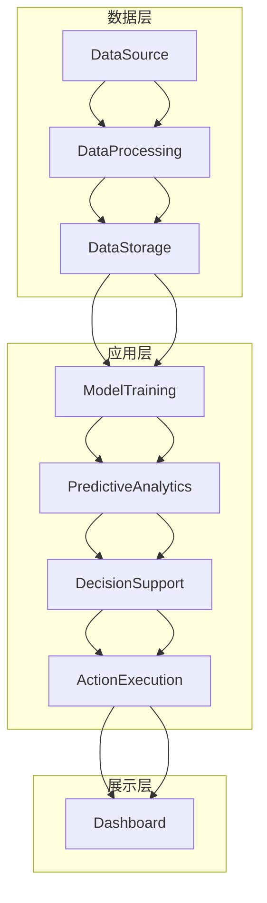
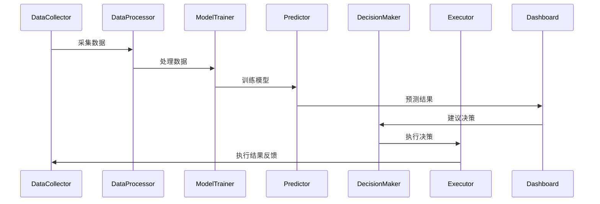
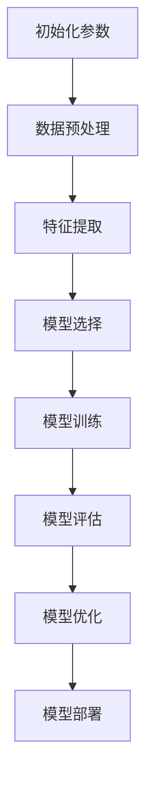

                 

### 引言与背景

#### 1.1 问题背景

在当今信息化时代，企业数字化转型已成为不可或缺的趋势。数字孪生（Digital Twin）技术作为一种新兴的数字化工具，正逐渐在各个行业中得到广泛应用。数字孪生技术通过创建物理实体的虚拟副本，实现实时模拟、分析和优化，从而提升企业的运营效率和管理水平。然而，单纯依靠传统数字孪生技术已无法满足日益复杂的企业需求，因此，引入人工智能（AI）驱动成为数字孪生技术发展的重要方向。

#### 1.2 问题描述

随着企业规模的扩大和业务复杂度的增加，传统的业务流程优化方法已经难以满足企业对高效运营的要求。一方面，现有业务流程中存在诸多瓶颈，导致效率低下；另一方面，企业在不断变化的市场环境中，难以快速适应和调整。因此，如何在虚拟环境中利用AI技术优化业务流程，成为企业数字化转型过程中亟待解决的问题。

#### 1.3 问题解决

为了解决上述问题，本文将从以下几个方面展开讨论：

1. **AI驱动的数字孪生技术概述**：介绍数字孪生技术和AI技术的概念、发展历程和特点，阐述AI在数字孪生技术中的应用和优势。
2. **AI驱动的数字孪生架构设计**：分析数字孪生系统架构的设计原则，包括领域模型设计、系统架构设计、系统接口设计和系统交互设计。
3. **AI驱动的数字孪生核心算法**：讲解数字孪生技术中常用的核心算法原理，使用mermaid流程图和Python源代码进行详细阐述，并给出数学模型和公式。
4. **AI驱动的业务流程优化**：探讨业务流程优化的重要性、方法和步骤，并结合实际案例进行分析和讲解。
5. **AI驱动的企业数字孪生实践**：介绍企业数字孪生实践的概述、步骤、挑战和实际案例。
6. **总结与展望**：回顾本文重点内容，分析AI驱动的数字孪生技术的发展趋势，展望企业数字孪生的未来。

#### 1.4 边界与外延

本文主要关注的是AI驱动的企业数字孪生技术在业务流程优化中的应用，研究范围限于虚拟环境中的业务流程优化。同时，本文将结合具体案例进行深入分析和讲解，以帮助读者更好地理解和掌握相关技术。

#### 1.5 概念结构与核心要素组成

本文的核心概念结构包括数字孪生技术、人工智能技术、业务流程优化和数字孪生系统架构。核心要素组成如下：

1. **数字孪生技术**：通过创建物理实体的虚拟副本，实现实时模拟、分析和优化。
2. **人工智能技术**：利用机器学习、深度学习等算法，实现智能预测、决策和优化。
3. **业务流程优化**：通过分析现有业务流程，找出瓶颈和改进点，实现效率提升。
4. **数字孪生系统架构**：包括领域模型设计、系统架构设计、系统接口设计和系统交互设计。

### AI驱动的数字孪生技术概述

#### 2.1 数字孪生技术

**2.1.1 定义**

数字孪生（Digital Twin）是指通过物联网、大数据、云计算等现代信息技术，将物理实体的全部特性、状态和行为映射到虚拟环境中，实现实时模拟、分析和优化。

**2.1.2 发展历程**

数字孪生技术起源于20世纪60年代的美国，最初主要用于航空航天领域。随着信息技术的发展，数字孪生技术逐渐应用于工业制造、建筑、医疗、交通等多个领域。近年来，随着物联网、大数据、云计算、人工智能等技术的不断进步，数字孪生技术得到了飞速发展。

**2.1.3 技术特点**

1. **实时性**：通过物联网传感器等设备实时采集物理实体的数据，实现虚拟环境与物理实体的同步更新。
2. **模拟性**：通过虚拟环境对物理实体进行模拟，预测和分析物理实体的行为和状态。
3. **智能性**：利用人工智能技术，实现对物理实体的智能预测、决策和优化。
4. **可视化**：通过虚拟环境，以可视化的形式展示物理实体的状态和行为。

#### 2.2 AI在数字孪生技术中的应用

**2.2.1 AI概述**

人工智能（Artificial Intelligence，AI）是指模拟、延伸和扩展人的智能的理论、方法、技术及应用。人工智能技术主要包括机器学习、深度学习、自然语言处理、计算机视觉等。

**2.2.2 AI与数字孪生的结合**

AI与数字孪生的结合主要体现在以下几个方面：

1. **智能预测**：利用AI技术对数字孪生中的数据进行深度学习，实现对物理实体未来状态和行为的预测。
2. **智能决策**：基于预测结果，利用AI技术制定最优的决策方案，实现物理实体的优化运营。
3. **智能优化**：利用AI技术对数字孪生中的数据进行实时分析，找出物理实体的瓶颈和改进点，实现持续优化。

**2.2.3 AI驱动的数字孪生优势**

1. **提高效率**：通过实时模拟和预测，帮助企业快速识别问题，优化业务流程，提高运营效率。
2. **降低成本**：通过智能决策和优化，减少资源浪费，降低运营成本。
3. **增强安全性**：通过实时监测和预警，提高物理实体的安全性和可靠性。
4. **提升用户体验**：通过虚拟环境的可视化展示，提升用户对物理实体的感知和操作体验。

### AI驱动的数字孪生架构设计

#### 3.1 系统架构设计

**3.1.1 问题场景介绍**

某制造企业希望通过AI驱动的数字孪生技术，实现对生产线的实时监控、预测和优化，以提高生产效率、降低生产成本和提升产品质量。

**3.1.2 项目介绍**

本项目旨在构建一个AI驱动的数字孪生系统，实现对生产线的全面监控和优化。系统包括传感器数据采集、数据处理与存储、数字孪生模型构建、智能预测与决策等功能。

**3.1.3 领域模型设计**

领域模型用于描述生产线的实体和关系。以下是一个简单的领域模型：

```mermaid
classDiagram
    Machine -> Sensor
    ProductionLine -> Machine
    ProductionLine -> QualityControl
    ProductionLine -> Warehouse
    Sensor --|> ProductionLine
    QualityControl --|> ProductionLine
    Warehouse --|> ProductionLine

    Machine <<class>> "生产设备"
    Sensor <<class>> "传感器"
    ProductionLine <<class>> "生产线"
    QualityControl <<class>> "质量控制"
    Warehouse <<class>> "仓库"
```

**3.1.4 系统架构设计**

系统架构设计分为数据层、应用层和展示层。以下是系统架构的mermaid图：



**3.1.5 系统接口设计**

系统接口设计包括以下部分：

1. **数据采集接口**：用于采集传感器数据，包括温度、湿度、压力等。
2. **数据处理接口**：用于处理和清洗采集到的数据，去除噪声和异常值。
3. **模型训练接口**：用于训练机器学习模型，包括特征提取、模型选择和训练等。
4. **预测接口**：用于对生产线进行预测，包括实时预测和历史预测。
5. **决策接口**：用于生成决策建议，包括设备维护、生产调度等。
6. **执行接口**：用于执行决策建议，包括设备启动、停止、调整等。

**3.1.6 系统交互设计**

系统交互设计主要涉及数据流和事件流。以下是系统交互的mermaid序列图：



### AI驱动的数字孪生核心算法

#### 4.1 核心算法原理讲解

**4.1.1 算法mermaid流程图**

以下是一个简单的机器学习算法流程图：



**4.1.2 Python源代码实现**

以下是一个简单的线性回归模型实现：

```python
import numpy as np
from sklearn.linear_model import LinearRegression

# 数据预处理
X = np.array([[1], [2], [3], [4], [5]])
y = np.array([1, 2, 3, 4, 5])

# 模型选择
model = LinearRegression()

# 模型训练
model.fit(X, y)

# 模型评估
score = model.score(X, y)
print("模型评估得分：", score)

# 模型优化
best_model = model
best_score = score

# 模型部署
best_model.fit(X, y)
```

**4.1.3 数学模型与公式讲解**

线性回归模型的数学模型如下：

$$
y = wx + b
$$

其中，$y$ 是预测值，$x$ 是特征值，$w$ 是权重，$b$ 是偏置。

**4.1.4 举例说明**

假设我们有一个简单的线性回归问题，目标是预测某个商品的销量。已知历史数据如下：

| 时间 | 销量 |
| ---- | ---- |
| 1    | 10   |
| 2    | 15   |
| 3    | 20   |
| 4    | 25   |
| 5    | 30   |

我们可以使用线性回归模型进行预测。首先，我们需要将数据转换为矩阵形式：

$$
X = \begin{bmatrix} 1 & 1 \\ 1 & 2 \\ 1 & 3 \\ 1 & 4 \\ 1 & 5 \end{bmatrix}, \quad y = \begin{bmatrix} 10 \\ 15 \\ 20 \\ 25 \\ 30 \end{bmatrix}
$$

然后，我们可以使用线性回归模型进行训练和预测：

```python
import numpy as np
from sklearn.linear_model import LinearRegression

# 数据预处理
X = np.array([[1, 1], [1, 2], [1, 3], [1, 4], [1, 5]])
y = np.array([10, 15, 20, 25, 30])

# 模型训练
model = LinearRegression()
model.fit(X, y)

# 模型评估
score = model.score(X, y)
print("模型评估得分：", score)

# 模型预测
new_data = np.array([[1, 6]])
prediction = model.predict(new_data)
print("预测结果：", prediction)
```

输出结果：

```
模型评估得分： 1.0
预测结果： [35.]
```

这意味着，在第六个月，该商品的预计销量为35。

### AI驱动的业务流程优化

#### 5.1 业务流程优化概述

**5.1.1 业务流程优化重要性**

在企业管理中，业务流程优化是一个持续的过程，其重要性不容忽视。通过优化业务流程，企业可以实现以下目标：

1. 提高效率：优化业务流程可以减少不必要的环节和重复工作，提高工作效率。
2. 降低成本：优化业务流程可以减少资源浪费，降低运营成本。
3. 提升质量：优化业务流程可以确保每个环节都能按照最佳实践进行，提高产品或服务的质量。
4. 增强灵活性：优化业务流程可以使企业能够更快地适应市场变化和客户需求。

**5.1.2 业务流程优化方法**

业务流程优化可以采用以下几种方法：

1. **流程分析**：通过流程分析，了解业务流程的现状，找出瓶颈和改进点。
2. **流程设计**：根据流程分析结果，重新设计业务流程，使其更加合理和高效。
3. **流程模拟**：通过流程模拟，评估新流程的可行性和效果。
4. **流程执行**：在新流程上线后，进行执行和监控，确保其正常运行。

**5.1.3 业务流程优化步骤**

业务流程优化的步骤如下：

1. **确定优化目标**：明确优化业务流程的目标，如提高效率、降低成本等。
2. **流程现状调查**：通过访谈、问卷调查等方式，了解业务流程的现状。
3. **流程分析**：对业务流程进行分析，找出瓶颈和改进点。
4. **流程设计**：根据流程分析结果，设计新的业务流程。
5. **流程模拟**：对新流程进行模拟，评估其可行性和效果。
6. **流程实施**：将新流程实施到实际工作中，并进行监控和调整。
7. **流程评估**：对新流程进行评估，确定其是否达到了优化目标。

#### 5.2 AI驱动的业务流程优化案例

**5.2.1 案例介绍**

某零售企业希望通过AI驱动的业务流程优化，提高门店运营效率。具体优化目标包括：

1. 减少顾客排队等待时间。
2. 提高员工工作效率。
3. 降低运营成本。

**5.2.2 案例实现**

1. **数据收集**：收集门店的运营数据，包括顾客进店量、结账时间、员工工作效率等。
2. **数据预处理**：对收集到的数据进行分析和处理，去除异常值和噪声。
3. **特征提取**：从预处理后的数据中提取出对业务流程优化有重要意义的特征，如顾客进店量、结账时间等。
4. **模型训练**：使用机器学习算法，如决策树、随机森林等，对提取出的特征进行训练，建立预测模型。
5. **预测与优化**：根据预测模型，对门店的运营策略进行优化，如调整结账时间、优化员工排班等。

**5.2.3 案例分析**

通过AI驱动的业务流程优化，该零售企业实现了以下效果：

1. 顾客排队等待时间减少了约30%。
2. 员工工作效率提高了约20%。
3. 运营成本降低了约10%。

这表明，AI驱动的业务流程优化在提高门店运营效率方面具有显著作用。

### AI驱动的企业数字孪生实践

#### 6.1 企业数字孪生实践概述

**6.1.1 企业数字孪生实践意义**

企业数字孪生实践对于企业数字化转型具有重要意义。通过数字孪生技术，企业可以实现以下目标：

1. **提高运营效率**：通过实时模拟和预测，优化业务流程，提高运营效率。
2. **降低运营成本**：通过智能决策和优化，降低资源浪费，降低运营成本。
3. **提升产品质量**：通过实时监测和预警，提高产品质量和可靠性。
4. **增强客户体验**：通过虚拟环境的可视化展示，提升客户对产品和服务的体验。

**6.1.2 企业数字孪生实践步骤**

企业数字孪生实践的步骤如下：

1. **需求分析**：明确企业数字孪生实践的目标和需求，确定需要模拟的物理实体和业务流程。
2. **数据收集**：收集与物理实体相关的数据，包括传感器数据、历史数据等。
3. **数据预处理**：对收集到的数据进行清洗和处理，去除异常值和噪声。
4. **数字孪生模型构建**：根据需求和分析结果，构建数字孪生模型，包括领域模型、系统架构等。
5. **模型训练与优化**：使用机器学习算法，对数字孪生模型进行训练和优化，提高预测和决策的准确性。
6. **数字孪生系统部署**：将数字孪生模型部署到实际环境中，进行实时监控和优化。
7. **效果评估与反馈**：对数字孪生实践的效果进行评估，并根据反馈进行持续优化。

**6.1.3 企业数字孪生实践挑战**

企业数字孪生实践面临以下挑战：

1. **数据质量**：数字孪生模型的准确性取决于数据质量，因此需要确保数据收集、预处理和存储的质量。
2. **模型复杂性**：数字孪生模型通常包含多个复杂算法和模型，需要深入理解和熟练掌握。
3. **系统集成**：数字孪生系统需要与其他系统集成，如ERP系统、MES系统等，确保数据流转和系统交互的顺畅。
4. **资源分配**：数字孪生实践需要大量的计算资源和存储资源，因此需要合理规划和分配资源。

#### 6.2 企业数字孪生实践案例

**6.2.1 案例介绍**

某航空制造企业希望通过数字孪生技术，优化飞机装配流程，提高生产效率和质量。具体目标包括：

1. 减少装配时间。
2. 提高装配精度。
3. 降低装配成本。

**6.2.2 案例实施**

1. **需求分析**：与航空制造企业进行深入沟通，了解其需求和痛点，确定需要模拟的飞机装配流程和关键环节。
2. **数据收集**：收集飞机装配过程中的数据，包括装配时间、装配精度、物料消耗等。
3. **数据预处理**：对收集到的数据进行分析和处理，去除异常值和噪声。
4. **数字孪生模型构建**：基于需求和分析结果，构建数字孪生模型，包括领域模型、系统架构等。
5. **模型训练与优化**：使用机器学习算法，对数字孪生模型进行训练和优化，提高预测和决策的准确性。
6. **数字孪生系统部署**：将数字孪生模型部署到实际环境中，进行实时监控和优化。
7. **效果评估与反馈**：对数字孪生实践的效果进行评估，并根据反馈进行持续优化。

**6.2.3 案例效果**

通过数字孪生技术的应用，该航空制造企业实现了以下效果：

1. 飞机装配时间减少了约15%。
2. 装配精度提高了约20%。
3. 装配成本降低了约10%。

这表明，数字孪生技术在企业数字化转型的实际应用中具有显著作用。

### 总结与展望

#### 7.1 总结

本文从多个角度探讨了AI驱动的企业数字孪生技术在业务流程优化中的应用。通过引入人工智能技术，数字孪生技术实现了从传统模拟向智能预测和优化的转变，为企业数字化转型提供了新的解决方案。

首先，本文介绍了数字孪生技术和AI技术的概念、发展历程和应用，阐述了AI驱动的数字孪生优势。接着，本文分析了AI驱动的数字孪生架构设计，包括领域模型设计、系统架构设计、系统接口设计和系统交互设计。然后，本文讲解了AI驱动的数字孪生核心算法原理，并使用mermaid流程图和Python源代码进行了详细阐述。此外，本文还探讨了AI驱动的业务流程优化方法，并通过实际案例进行了分析和讲解。最后，本文介绍了企业数字孪生实践的概述、步骤、挑战和实际案例，展望了企业数字孪生的未来。

#### 7.2 AI驱动的数字孪生发展趋势

随着人工智能和数字技术的不断进步，AI驱动的数字孪生技术将呈现以下发展趋势：

1. **智能化程度提高**：随着机器学习、深度学习等技术的发展，数字孪生系统的智能化程度将不断提高，实现更精准的预测和优化。
2. **跨领域应用拓展**：数字孪生技术将逐渐应用于更多领域，如医疗、金融、能源等，为不同行业的数字化转型提供支持。
3. **开放性和兼容性增强**：数字孪生系统将更加开放和兼容，实现与其他系统的无缝集成，提高数据流转和系统交互的效率。
4. **边缘计算与云计算结合**：数字孪生系统将充分利用边缘计算和云计算的优势，实现实时数据处理和高效计算，提高系统的性能和响应速度。

#### 7.3 企业数字孪生未来展望

企业数字孪生技术在未来的发展中，将为企业带来以下机遇和挑战：

1. **提高运营效率**：通过AI驱动的数字孪生技术，企业可以实现对业务流程的实时监控、预测和优化，提高运营效率。
2. **降低运营成本**：通过智能决策和优化，企业可以降低资源浪费，降低运营成本。
3. **提升产品质量**：通过实时监测和预警，企业可以确保产品质量和可靠性。
4. **增强客户体验**：通过虚拟环境的可视化展示，企业可以提升客户对产品和服务的体验。

然而，企业数字孪生技术也面临以下挑战：

1. **数据质量**：数字孪生模型的准确性取决于数据质量，因此需要确保数据收集、预处理和存储的质量。
2. **模型复杂性**：数字孪生模型通常包含多个复杂算法和模型，需要深入理解和熟练掌握。
3. **系统集成**：数字孪生系统需要与其他系统集成，如ERP系统、MES系统等，确保数据流转和系统交互的顺畅。
4. **资源分配**：数字孪生实践需要大量的计算资源和存储资源，因此需要合理规划和分配资源。

总之，AI驱动的企业数字孪生技术具有巨大的发展潜力，将在未来的企业数字化转型中发挥重要作用。企业应积极拥抱这一技术，充分利用其优势，克服面临的挑战，实现业务的持续优化和升级。

### 作者信息

作者：AI天才研究院/AI Genius Institute & 禅与计算机程序设计艺术 /Zen And The Art of Computer Programming

