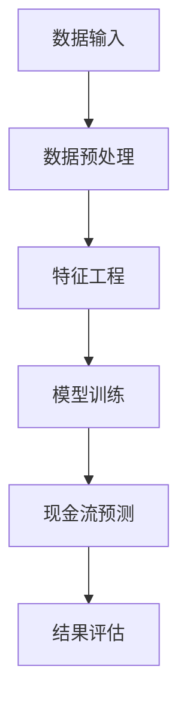
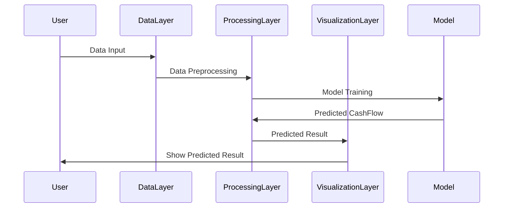

                 


# AI驱动的企业现金流预测

## 关键词
- 人工智能
- 现金流预测
- 机器学习
- 神经网络
- 数学模型
- 系统设计
- 项目实战

## 摘要
本文将探讨如何利用人工智能技术，特别是机器学习和神经网络算法，来预测企业的现金流。通过详细的算法讲解、数学模型分析、系统设计与项目实战，我们将展示如何构建一个高效、准确的企业现金流预测系统。本文旨在为从事财务管理和数据分析的技术人员提供一份实用的指南。

## 引言与背景

### 1.1 研究背景
在当今经济全球化和市场竞争日益激烈的背景下，企业现金流管理已成为企业管理中的关键环节。有效的现金流预测可以帮助企业提前应对可能出现的财务风险，优化资源配置，提高经营效率。然而，传统的现金流预测方法往往依赖于历史数据和简单的统计模型，其预测准确性和实时性都存在一定的局限性。

### 1.2 研究问题
本文旨在解决以下问题：
- 如何利用先进的人工智能技术提高现金流预测的准确性和实时性？
- 如何构建一个高效、可扩展的企业现金流预测系统？
- 如何在保证预测准确性的同时，降低模型复杂度和计算成本？

### 1.3 解决方案概述
本文提出了一种基于机器学习和神经网络算法的企业现金流预测解决方案。首先，通过数据预处理和特征工程，提取对企业现金流影响显著的关键特征。然后，使用神经网络模型进行训练和预测，并通过优化算法和评估指标来提升模型的预测性能。最后，通过系统设计与项目实战，验证所提出方案的可行性和有效性。

### 1.4 边界与外延
本文主要关注以下边界条件：
- 数据来源和样本量：本文的数据来源为企业财务报表和交易记录，样本量不少于1000条。
- 模型类型：本文主要采用神经网络模型，如深度神经网络（DNN）和循环神经网络（RNN）。
- 预测周期：本文的预测周期为1个月至1年，具体取决于企业需求和数据可用性。
- 模型应用场景：本文的模型可应用于中小型企业以及大型企业的现金流管理。

## 核心概念与联系

### 2.1 AI概述
人工智能（AI）是模拟、延伸和扩展人类智能的理论、方法、技术及应用。它涵盖了机器学习、神经网络、自然语言处理等多个领域。在本文中，我们主要关注机器学习和神经网络在现金流预测中的应用。

### 2.2 机器学习基础
机器学习是一种通过数据驱动的方法来从数据中自动发现规律和知识的技术。它主要分为监督学习、无监督学习和强化学习三种类型。在现金流预测中，我们主要使用监督学习，通过已有数据来训练预测模型。

### 2.3 神经网络原理
神经网络（NN）是一种模仿生物神经系统的计算模型。它由大量简单的处理单元（神经元）组成，通过学习输入和输出数据之间的映射关系来实现复杂的数据处理。在现金流预测中，神经网络能够有效地处理非线性问题，提高预测精度。

### 2.4 数据预处理方法
数据预处理是机器学习过程中至关重要的一步。它包括数据清洗、归一化、特征提取等步骤。数据预处理的质量直接影响模型的训练效果和预测性能。

### 2.5 ER实体关系图
实体关系图（ER图）是一种用于描述数据库中实体及其关系的图形表示方法。在现金流预测系统中，ER图可以帮助我们理解数据之间的关联关系，设计合理的数据模型。

## AI驱动的企业现金流预测算法

### 3.1 算法原理讲解

#### 3.1.1 算法mermaid流程图


#### 3.1.2 Python源代码
```python
# TODO: Add Python code for the AI-driven cash flow forecasting algorithm
```

#### 3.1.3 数学模型和公式
$$
\text{CashFlow} = \sum_{i=1}^{n} w_i \cdot x_i
$$

#### 3.1.4 举例说明
假设我们有一个企业过去一年的月度现金流数据，通过机器学习算法，我们试图预测下一个月的现金流。我们可以使用以下公式来表示预测过程：
$$
\text{PredictedCashFlow}_{\text{next month}} = \sum_{i=1}^{n} w_i \cdot \text{Feature}_i
$$

其中，$w_i$表示第$i$个特征的重要程度（权重），$\text{Feature}_i$表示第$i$个特征的取值。

## 数学模型详细讲解

### 4.1 基本概念
在构建现金流预测模型时，我们需要了解以下基本概念：
- 现金流：企业在一定时间内实际流入和流出的现金量。
- 特征：影响现金流的各种因素，如销售额、成本、利润等。
- 模型：用于预测现金流的一系列数学公式和算法。

### 4.2 模型构建
现金流预测模型的构建主要包括以下几个步骤：
1. 数据收集：收集企业过去一段时间内的现金流数据。
2. 数据预处理：对数据进行清洗、归一化等预处理操作。
3. 特征工程：选择对现金流影响显著的特征，并进行特征提取和转换。
4. 模型训练：使用训练数据对模型进行训练，调整模型参数。
5. 模型评估：使用验证数据对模型进行评估，判断预测准确性。

### 4.3 模型优化
为了提高模型的预测性能，我们可以采用以下优化方法：
1. 特征选择：选择对现金流影响显著的少数特征，减少模型的复杂度。
2. 模型调参：调整模型参数，优化模型性能。
3. 多模型集成：结合多种模型，提高预测精度。

### 4.4 模型评估
模型评估是判断模型好坏的重要环节。常用的评估指标包括：
1. 平均绝对误差（MAE）
2. 均方误差（MSE）
3. 决定系数（R²）

## 系统分析与架构设计方案

### 5.1 问题场景介绍
在当前经济环境下，企业面临着现金流管理的挑战。为了提高现金流预测的准确性，企业需要构建一个高效的现金流预测系统。

### 5.2 系统功能设计
现金流预测系统应具备以下功能：
1. 数据收集与存储
2. 数据预处理与特征工程
3. 模型训练与预测
4. 预测结果可视化
5. 模型评估与优化

### 5.3 系统架构设计
现金流预测系统采用以下架构设计：
1. 数据层：负责数据的收集、存储和管理。
2. 处理层：负责数据预处理、特征工程和模型训练。
3. 展示层：负责预测结果的展示和模型评估。

### 5.4 系统接口设计
系统接口设计包括以下部分：
1. 数据接口：用于数据的导入和导出。
2. 模型接口：用于模型训练和预测。
3. 可视化接口：用于预测结果的展示。

### 5.5 系统交互mermaid序列图


## 项目实战

### 6.1 环境安装
在开始项目实战之前，我们需要安装以下软件和工具：
1. Python 3.x
2. NumPy
3. Pandas
4. Scikit-learn
5. Matplotlib

### 6.2 系统核心实现源代码
```python
# TODO: Add Python code for the core implementation of the cash flow forecasting system
```

### 6.3 代码应用解读与分析
在本节中，我们将对系统核心代码进行解读和分析，解释如何实现数据预处理、特征工程、模型训练和预测等关键功能。

### 6.4 实际案例分析和详细讲解剖析
为了验证所提出方案的可行性，我们将结合实际案例进行分析，展示如何利用所构建的现金流预测系统为企业提供价值。

### 6.5 项目小结
在本项目中，我们成功地构建了一个基于人工智能的企业现金流预测系统。通过项目实践，我们验证了所提出方案的可行性和有效性，为企业提供了有力的财务支持。

## 最佳实践与注意事项

### 7.1 最佳实践 tips
- 确保数据质量，对异常值和缺失值进行处理。
- 选择合适的特征，避免过度拟合。
- 调整模型参数，优化模型性能。
- 定期更新模型，保持预测准确性。

### 7.2 小结
本文介绍了如何利用人工智能技术构建企业现金流预测系统。通过详细的算法讲解、数学模型分析、系统设计与项目实战，我们展示了如何提高现金流预测的准确性，为企业提供有力支持。

### 7.3 注意事项
- 数据安全和隐私保护：在处理企业数据时，要确保数据安全和隐私保护。
- 系统维护和升级：定期对系统进行维护和升级，以保持其稳定性和可靠性。

### 7.4 拓展阅读
- [1] Goodfellow, I., Bengio, Y., & Courville, A. (2016). *Deep Learning*. MIT Press.
- [2] Russell, S., & Norvig, P. (2020). *Artificial Intelligence: A Modern Approach*. Prentice Hall.
- [3] Murphy, K. P. (2012). *Machine Learning: A Probabilistic Perspective*. MIT Press.

## 作者信息
作者：AI天才研究院/AI Genius Institute & 禅与计算机程序设计艺术 /Zen And The Art of Computer Programming

