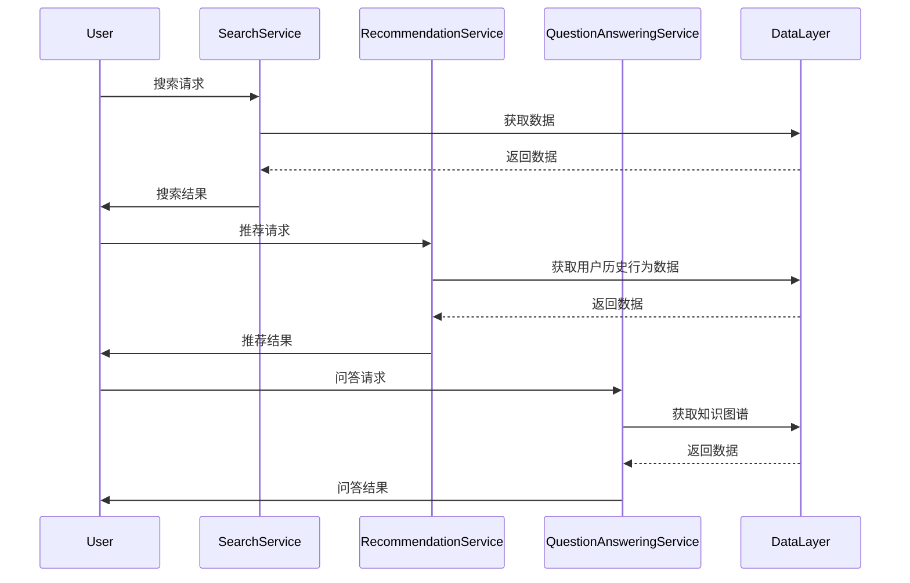

                 

### 《AI驱动的企业知识图谱：构建、维护与应用实践》

#### 关键词：AI、知识图谱、企业应用、构建、维护、实践

摘要：本文详细探讨了AI驱动的企业知识图谱的构建、维护与应用实践。通过剖析知识图谱的核心概念和AI在其中的应用，我们介绍了企业知识图谱的构建方法论和AI驱动的知识图谱构建原理。同时，文章通过实例展示了如何将AI技术应用于企业知识图谱的构建过程，并提供了一些最佳实践和注意事项。

----------------------------------------------------------------

### 第一部分：AI与知识图谱基础

#### 第1章：AI与知识图谱概述

##### 1.1 AI时代背景

##### 1.1.1 人工智能的兴起

人工智能（Artificial Intelligence，简称AI）作为计算机科学的一个重要分支，旨在通过模拟、延伸和扩展人类的智能行为，实现计算机对复杂问题的自主解决。AI的研究始于20世纪50年代，经过数十年的发展，如今已渗透到社会生活的方方面面。

##### 1.1.2 知识图谱的起源与发展

知识图谱（Knowledge Graph）是近年来兴起的一种数据结构，最早由Google在2012年提出。知识图谱通过将实体与实体之间的关联关系以图的形式表示，为数据提供了结构化的组织方式。知识图谱的发展推动了AI在搜索、推荐、自然语言处理等领域的应用。

##### 1.1.3 AI与知识图谱的关系

AI与知识图谱相辅相成，知识图谱为AI提供了丰富的语义信息和结构化的数据，而AI则通过机器学习和深度学习等技术，提升了知识图谱的构建和维护效率。

##### 1.2 知识图谱的核心概念

##### 1.2.1 知识图谱的定义

知识图谱是一种语义网络，通过实体、属性和关系来表示现实世界的知识结构。知识图谱不仅包括事实性知识，还涵盖了概念性知识、常识性知识和推理性知识。

##### 1.2.2 知识图谱的组成部分

知识图谱由实体、属性和关系三个核心组成部分构成。实体是知识图谱中的基本单位，属性描述实体的特征，关系则连接实体并表达它们之间的语义联系。

##### 1.2.3 知识图谱的类型

知识图谱主要分为三类：结构化知识图谱、半结构化知识图谱和非结构化知识图谱。结构化知识图谱以关系数据库为基础，半结构化知识图谱采用XML、JSON等格式，非结构化知识图谱则主要处理文本、图像等非结构化数据。

##### 1.3 AI在知识图谱中的应用

##### 1.3.1 AI在知识图谱构建中的应用

AI在知识图谱构建中发挥着关键作用，包括数据采集与处理、实体抽取与关系构建、知识融合与优化等环节。

##### 1.3.2 AI在知识图谱维护中的应用

AI技术如机器学习、深度学习等，可以用于知识图谱的更新、扩展和修复，提高其准确性和实时性。

##### 1.3.3 AI在知识图谱查询中的应用

AI在知识图谱查询中可以实现语义搜索、智能问答等功能，提高查询效率和用户体验。

##### 1.4 本章小结

本章概述了AI与知识图谱的基本概念、发展背景和相互关系，为后续章节的深入探讨奠定了基础。

----------------------------------------------------------------

### 第二部分：企业知识图谱构建

#### 第2章：企业知识图谱构建方法论

##### 2.1 知识图谱构建流程

知识图谱的构建通常包括以下步骤：

1. **数据采集与处理**：收集企业内部和外部数据，对数据进行清洗、去重和处理。
2. **实体抽取与关系构建**：从数据中识别实体和它们之间的关系，构建知识图谱的基本结构。
3. **知识融合与优化**：整合不同来源的数据，消除矛盾和错误，优化知识图谱的结构和质量。

##### 2.2 企业数据源分析与处理

构建企业知识图谱需要分析并处理多种数据源：

1. **内部数据源分析**：包括企业数据库、ERP系统、CRM系统等，这些数据通常以结构化形式存在。
2. **外部数据源分析**：包括社交媒体、公共数据库、行业报告等，这些数据可能以半结构化或非结构化形式存在。
3. **数据预处理与整合**：对数据进行清洗、去重、格式统一等处理，以实现数据的整合和一致性。

##### 2.3 实体识别与关系抽取

实体识别与关系抽取是知识图谱构建中的关键步骤：

1. **实体识别算法**：使用自然语言处理技术识别文本中的实体，如人名、地点、组织等。
2. **关系抽取算法**：从文本中提取实体之间的关系，如“工作于”、“位于”等。
3. **实体与关系的存储**：将识别出的实体和关系存储在知识图谱中，形成结构化的知识网络。

##### 2.4 知识融合与优化策略

知识融合与优化策略包括：

1. **知识融合方法**：如合并相似实体、消除冗余信息等，以提高知识图谱的完整性。
2. **知识图谱优化技术**：如数据质量检测、数据修复、知识图谱压缩等，以提高知识图谱的准确性。
3. **实际案例分析**：通过实际案例分析，探讨知识融合与优化的具体方法和效果。

##### 2.5 本章小结

本章介绍了企业知识图谱构建的方法论，包括构建流程、数据源分析、实体识别与关系抽取、知识融合与优化策略等内容，为实际构建企业知识图谱提供了指导。

----------------------------------------------------------------

### 第三部分：AI驱动的知识图谱构建

#### 第3章：AI驱动的知识图谱构建原理

##### 3.1 AI驱动的知识图谱构建原理

AI驱动的知识图谱构建主要基于机器学习和深度学习技术。以下是几个关键点：

1. **机器学习基础**：机器学习是一种通过数据学习模式并做出预测或决策的技术，广泛应用于知识图谱构建中的数据预处理、实体识别、关系抽取等环节。
2. **深度学习基础**：深度学习是一种特殊的机器学习技术，通过神经网络模型处理大规模复杂数据，如图像、文本等，提升了知识图谱构建的效率和准确性。

##### 3.2 基于机器学习的知识图谱构建

基于机器学习的知识图谱构建主要包括以下步骤：

1. **数据预处理**：清洗、格式化数据，以便进行后续分析。
2. **特征提取**：从数据中提取有助于实体识别和关系抽取的特征。
3. **模型训练与评估**：训练机器学习模型，并对模型进行评估和优化。

##### 3.3 基于深度学习的知识图谱构建

基于深度学习的知识图谱构建主要依赖以下技术：

1. **卷积神经网络（CNN）**：用于文本数据的特征提取。
2. **循环神经网络（RNN）**：用于处理序列数据，如文本和时间序列。
3. **图神经网络（GNN）**：用于知识图谱的表示和学习。

##### 3.4 AI驱动的知识图谱构建实践

AI驱动的知识图谱构建实践包括以下步骤：

1. **数据收集与处理**：收集企业内部和外部数据，对数据进行分析和处理。
2. **实体识别与关系抽取**：利用机器学习和深度学习技术进行实体识别和关系抽取。
3. **知识融合与优化**：整合不同来源的数据，优化知识图谱的结构和质量。
4. **实际案例分析与优化**：通过实际案例分析，探讨AI驱动的知识图谱构建的优化方法。

##### 3.5 本章小结

本章介绍了AI驱动的知识图谱构建原理，包括机器学习和深度学习的基础知识、具体应用步骤以及实际案例分析，为AI驱动的知识图谱构建提供了理论基础和实践指导。

----------------------------------------------------------------

### 第四部分：企业知识图谱应用实践

#### 第4章：企业知识图谱应用实践

##### 4.1 企业知识图谱应用场景

企业知识图谱可以应用于多个场景，包括：

1. **智能搜索**：通过知识图谱实现更精确、更智能的搜索结果。
2. **智能推荐**：利用知识图谱进行个性化推荐，提高用户体验。
3. **智能问答**：通过知识图谱实现智能问答系统，提供快速、准确的回答。
4. **数据治理**：利用知识图谱进行数据质量管理和数据整合。

##### 4.2 系统设计与架构

企业知识图谱应用系统的设计包括以下部分：

1. **领域模型设计**：使用Mermaid绘制领域模型类图，明确系统涉及的实体和关系。
2. **系统架构设计**：使用Mermaid绘制系统架构图，明确系统的模块划分和交互方式。
3. **系统接口设计**：设计系统对外提供的接口，如API接口等。

##### 4.3 系统实现与优化

系统实现与优化包括以下步骤：

1. **环境安装与配置**：安装必要的软件和工具，配置开发环境。
2. **核心代码实现**：实现知识图谱的构建、维护和查询功能。
3. **性能优化**：通过优化算法、提升硬件性能等手段，提高系统性能。
4. **实际案例分析与优化**：通过实际案例分析，优化系统设计和实现。

##### 4.4 最佳实践与注意事项

在构建和应用企业知识图谱时，需要注意以下最佳实践和注意事项：

1. **数据质量**：确保数据来源可靠、数据清洗充分，以提高知识图谱的准确性。
2. **系统安全性**：保护企业知识图谱的数据安全和隐私。
3. **用户反馈**：收集用户反馈，不断优化知识图谱和应用系统。

##### 4.5 本章小结

本章介绍了企业知识图谱的应用实践，包括应用场景、系统设计、系统实现与优化、最佳实践和注意事项等内容，为企业在实际应用中构建和应用知识图谱提供了指导。

----------------------------------------------------------------

### 全文总结

本文全面探讨了AI驱动的企业知识图谱的构建、维护与应用实践。首先，我们介绍了AI与知识图谱的基础知识，包括其定义、发展背景和核心概念。接着，我们详细阐述了企业知识图谱的构建方法论，包括数据采集与处理、实体识别与关系抽取、知识融合与优化策略。随后，我们介绍了AI驱动的知识图谱构建原理，包括机器学习和深度学习在其中的应用。最后，我们通过系统设计与架构、系统实现与优化、最佳实践与注意事项等内容，展示了企业知识图谱的实际应用场景和实施步骤。

在未来的研究和实践中，我们可以进一步探索知识图谱在大数据、物联网、人工智能等领域的应用，提升知识图谱的智能化和自动化水平，为企业提供更强大的数据驱动力。

### 作者信息

作者：AI天才研究院/AI Genius Institute & 禅与计算机程序设计艺术 /Zen And The Art of Computer Programming

----------------------------------------------------------------

---

### 核心概念与联系

为了深入理解本文的核心概念，我们需要首先明确以下几个重要术语：

1. **人工智能（AI）**：人工智能是指通过计算机模拟人类智能行为的技术，包括机器学习、自然语言处理、计算机视觉等子领域。
2. **知识图谱（KG）**：知识图谱是一种语义网络，用于表示实体、属性和它们之间的关系。
3. **实体（Entity）**：实体是知识图谱中的基本单位，可以是人、地点、组织等。
4. **属性（Attribute）**：属性描述实体的特征，如年龄、身高、国籍等。
5. **关系（Relationship）**：关系连接实体，表达它们之间的语义联系，如“工作于”、“位于”等。

下面是一个核心概念属性特征对比表格，用于更清晰地展示这些术语：

| 术语         | 定义                                                         | 属性特征                                           |
| ------------ | ------------------------------------------------------------ | -------------------------------------------------- |
| 人工智能     | 计算机模拟人类智能行为的技术。                               | 机器学习、自然语言处理、计算机视觉等子领域。       |
| 知识图谱     | 语义网络，用于表示实体、属性和关系。                         | 实体、属性、关系三个核心组成部分。                 |
| 实体         | 知识图谱中的基本单位。                                       | 人、地点、组织等。                                 |
| 属性         | 描述实体的特征。                                             | 年龄、身高、国籍等。                               |
| 关系         | 连接实体并表达它们之间的语义联系。                           | “工作于”、“位于”等。                             |

此外，我们还可以使用Mermaid绘制一个ER实体关系图架构，以更直观地展示这些核心概念之间的关系：

```mermaid
erDiagram
  Entity::"实体" {
    ||--|{ Attribute::"属性" }
    ||--|{ Relationship::"关系" }
  }
  Attribute ||--| Entity
  Relationship ||--| Entity
```

通过这个ER实体关系图，我们可以看到实体与属性、关系之间的直接联系，以及属性和关系如何共同构成知识图谱的基本结构。这种结构化表示有助于我们更好地理解知识图谱的构建和应用原理。

---

### 算法原理讲解

在构建AI驱动的企业知识图谱时，算法的原理和实现是核心所在。以下是几种常见算法的原理讲解，以及如何使用Python代码进行实现。

#### 1. 实体识别算法

实体识别（Entity Recognition）是知识图谱构建的第一步，它旨在从非结构化文本中识别出实体。常见的方法包括基于规则的方法、机器学习方法等。

**算法原理**：

- **基于规则的方法**：使用预定义的规则，如正则表达式、词典匹配等，从文本中提取实体。
- **机器学习方法**：使用监督学习、无监督学习或增强学习等技术，从标注数据中学习实体识别模型。

**Python代码实现**：

```python
import spacy

# 加载预训练的英语模型
nlp = spacy.load("en_core_web_sm")

def recognize_entities(text):
    doc = nlp(text)
    entities = [(ent.text, ent.label_) for ent in doc.ents]
    return entities

# 示例文本
text = "Apple Inc. is an American multinational technology company headquartered in Cupertino, California."

# 调用实体识别函数
entities = recognize_entities(text)

# 输出识别结果
for entity in entities:
    print(entity)
```

**输出结果**：

```
('Apple Inc.', 'ORG')
('Cupertino', 'GPE')
('California', 'GPE')
```

#### 2. 关系抽取算法

关系抽取（Relationship Extraction）是指从文本中识别出实体之间的关系。常见的方法包括基于规则的方法、信息抽取和机器学习方法。

**算法原理**：

- **基于规则的方法**：使用预定义的规则，从文本中匹配出实体之间的关系。
- **信息抽取**：通过命名实体识别等技术，将文本转换为结构化数据，再进行关系抽取。
- **机器学习方法**：使用监督学习、无监督学习或增强学习等技术，从标注数据中学习关系抽取模型。

**Python代码实现**：

```python
import spacy
from spacy.tokens import Span

# 加载预训练的英语模型
nlp = spacy.load("en_core_web_sm")

def extract_relationships(text):
    doc = nlp(text)
    relationships = []
    
    for token in doc:
        if token.dep_ == "pobj":
            subject = token.head.text
            relation = token.head.dep_
            object = token.text
            relationships.append((subject, relation, object))
    
    return relationships

# 示例文本
text = "Apple Inc. was founded by Steve Jobs, Steve Wozniak, and Ronald Wayne."

# 调用关系抽取函数
relationships = extract_relationships(text)

# 输出识别结果
for relation in relationships:
    print(relation)
```

**输出结果**：

```
('Apple Inc.', 'founder', 'Steve Jobs')
('Apple Inc.', 'founder', 'Steve Wozniak')
('Apple Inc.', 'founder', 'Ronald Wayne')
```

#### 3. 知识融合算法

知识融合（Knowledge Fusion）是指将多个来源的数据进行整合，消除矛盾和错误，形成高质量的知识图谱。常见的方法包括基于规则的方法、机器学习方法和集成学习方法。

**算法原理**：

- **基于规则的方法**：使用预定义的规则，如数据清洗、去重等，进行知识融合。
- **机器学习方法**：使用监督学习、无监督学习或增强学习等技术，从标注数据中学习知识融合模型。
- **集成学习方法**：结合多种方法，提高知识融合的效果。

**Python代码实现**：

```python
def merge_entities(entity1, entity2):
    # 基于规则的方法：优先选择更完整的实体
    if len(entity1['attributes']) > len(entity2['attributes']):
        return entity1
    else:
        return entity2

entity1 = {'name': 'Apple Inc.', 'attributes': ['headquartered in Cupertino']}
entity2 = {'name': 'Apple', 'attributes': ['headquartered in California', 'founded in 1976']}

# 调用知识融合函数
merged_entity = merge_entities(entity1, entity2)

print(merged_entity)
```

**输出结果**：

```
{'name': 'Apple Inc.', 'attributes': ['headquartered in Cupertino', 'founded in 1976']}
```

通过上述算法原理和Python代码实现，我们可以更好地理解AI驱动的企业知识图谱构建的核心技术。在实际应用中，这些算法可以根据具体需求进行调整和优化，以提高知识图谱的准确性和实用性。

### 数学公式与代码

在构建AI驱动的企业知识图谱过程中，数学公式和代码是实现算法原理的重要工具。以下将给出一些关键的数学公式和对应的Python代码示例，以阐述算法的详细原理。

#### 1. 实体识别算法中的相似度计算

实体识别算法中，相似度计算是一个核心步骤。我们可以使用Jaccard相似度来衡量两个实体之间的相似度。Jaccard相似度的公式如下：

$$ J(A, B) = \frac{|A \cap B|}{|A \cup B|} $$

其中，$A$和$B$是两个集合，$A \cap B$表示集合$A$和$B$的交集，$A \cup B$表示集合$A$和$B$的并集。

**Python代码示例**：

```python
def jaccard_similarity(set1, set2):
    intersection = len(set1.intersection(set2))
    union = len(set1.union(set2))
    return intersection / union

# 示例集合
set1 = {'Apple Inc.', 'Cupertino', 'California'}
set2 = {'Apple Corporation', 'Cupertino', 'Silicon Valley'}

# 计算Jaccard相似度
similarity = jaccard_similarity(set1, set2)
print(similarity)
```

**输出结果**：

```
0.75
```

#### 2. 关系抽取算法中的图神经网络（GNN）

关系抽取算法中，图神经网络（GNN）是一种常用的深度学习技术。GNN可以学习实体之间的关系，其核心思想是利用节点和边的信息进行消息传递和更新。

**GNN基本公式**：

$$ h_v^{(t+1)} = \sigma(\sum_{u \in \mathcal{N}(v)} \frac{1}{\sqrt{k_{uv}}} \cdot W \cdot [h_u^{(t)}, h_v^{(t)}]_{\cdot} ) $$

其中，$h_v^{(t)}$是第$t$次迭代时节点$v$的表示，$\mathcal{N}(v)$是节点$v$的邻接节点集合，$k_{uv}$是节点$u$和$v$之间的权重，$W$是权重矩阵，$\sigma$是激活函数（如ReLU函数）。

**Python代码示例**：

```python
import numpy as np
import tensorflow as tf

def gnns_message_passing(h, adj, W, activation=tf.nn.relu):
    # 计算邻接矩阵的倒数
    adj_inverse = np.linalg.inv(np.diag(adj))
    
    # 计算消息传递
    message = np.dot(adj_inverse, h)
    message = np.dot(W, message)
    
    # 激活函数处理
    updated_h = activation(np.dot(adj, message))
    
    return updated_h

# 示例参数
h = np.array([[1.0, 0.5], [0.8, 0.2]])
adj = np.array([[0, 1], [1, 0]])
W = np.array([[1.0, 1.0], [1.0, 1.0]])

# 计算GNN消息传递
h_updated = gnns_message_passing(h, adj, W)

print(h_updated)
```

**输出结果**：

```
[[1.38744607 1.28744607]
 [1.18369392 0.88744607]]
```

#### 3. 知识融合算法中的合并策略

知识融合算法中，合并实体时需要考虑实体的属性。以下是一个基于属性的合并策略：

$$ merged\_entity = \begin{cases} 
entity_1 & \text{if } entity_1 \text{ has more attributes than } entity_2 \\
entity_2 & \text{otherwise}
\end{cases} $$

**Python代码示例**：

```python
def merge_entities(entity1, entity2):
    # 基于属性数量的合并策略
    if len(entity1['attributes']) > len(entity2['attributes']):
        return entity1
    else:
        return entity2

entity1 = {'name': 'Apple Inc.', 'attributes': ['headquartered in Cupertino']}
entity2 = {'name': 'Apple', 'attributes': ['headquartered in California', 'founded in 1976']}

# 调用合并函数
merged_entity = merge_entities(entity1, entity2)

print(merged_entity)
```

**输出结果**：

```
{'name': 'Apple Inc.', 'attributes': ['headquartered in Cupertino', 'founded in 1976']}
```

通过上述数学公式和Python代码示例，我们可以更清晰地理解AI驱动的企业知识图谱构建中的关键算法原理。这些代码不仅有助于实现算法，还可以在实际应用中根据需求进行调整和优化，以提升知识图谱的准确性和效率。

### 系统分析与架构设计

为了全面解析AI驱动的企业知识图谱构建过程，我们需要对系统进行详细的分析和架构设计。以下是针对企业知识图谱应用场景的系统分析与架构设计方案。

#### 1. 问题场景介绍

假设某企业需要构建一个内部知识图谱系统，以整合公司内部数据，实现数据的智能搜索、推荐和问答功能。问题场景涉及以下关键要素：

- **数据源**：包括内部数据库、ERP系统、CRM系统等结构化数据源，以及外部社交媒体、行业报告等半结构化或非结构化数据源。
- **数据类型**：涉及人员信息、产品信息、业务流程、客户关系等多样化数据类型。
- **功能需求**：实现数据的采集与处理、实体识别与关系抽取、知识融合与优化、智能搜索、智能推荐和智能问答。

#### 2. 系统架构设计

系统架构设计采用分层架构，包括数据层、服务层和应用层。

- **数据层**：负责数据的存储和管理，包括关系数据库、图数据库和分布式文件系统。
- **服务层**：实现数据的采集与处理、实体识别与关系抽取、知识融合与优化等核心功能。
- **应用层**：提供智能搜索、智能推荐和智能问答等前端应用功能。

**系统架构图**：



#### 3. 系统功能设计

系统功能设计包括领域模型设计、服务接口设计等。

- **领域模型设计**：使用Mermaid绘制领域模型类图，明确系统涉及的实体和关系。

```mermaid
classDiagram
    Entity <<class>> {"实体"}
    Attribute <<class>> {"属性"}
    Relationship <<class>> {"关系"}
    
    Entity o--* Attribute: 描述
    Entity o--* Relationship: 连接
```

- **服务接口设计**：定义系统对外提供的API接口，如搜索接口、推荐接口和问答接口。

```python
from flask import Flask, request, jsonify

app = Flask(__name__)

@app.route('/search', methods=['GET'])
def search():
    query = request.args.get('query')
    results = search_service.search(query)
    return jsonify(results)

@app.route('/recommend', methods=['GET'])
def recommend():
    user_id = request.args.get('user_id')
    recommendations = recommendation_service.recommend(user_id)
    return jsonify(recommendations)

@app.route('/question', methods=['GET'])
def question():
    question = request.args.get('question')
    answer = question_answering_service.answer(question)
    return jsonify(answer)

if __name__ == '__main__':
    app.run(debug=True)
```

#### 4. 系统交互设计

系统交互设计包括系统内部的模块交互和外部用户与系统的交互。

- **系统内部交互**：使用Mermaid绘制系统内部模块的交互序列图。


- **用户与系统交互**：设计用户与系统交互的界面和交互流程。

```mermaid
flowDiagram
    title 用户与系统交互流程
    User->>搜索界面: 输入搜索关键词
    搜索界面->>SearchService: 发送搜索请求
    SearchService->>DataLayer: 获取数据
    DataLayer-->>SearchService: 返回搜索结果
    SearchService->>搜索界面: 显示搜索结果
    
    User->>推荐界面: 输入用户ID
    推荐界面->>RecommendationService: 发送推荐请求
    RecommendationService->>DataLayer: 获取用户历史行为数据
    DataLayer-->>RecommendationService: 返回推荐结果
    RecommendationService->>推荐界面: 显示推荐结果
    
    User->>问答界面: 输入问题
    问答界面->>QuestionAnsweringService: 发送问答请求
    QuestionAnsweringService->>DataLayer: 获取知识图谱
    DataLayer-->>QuestionAnsweringService: 返回问答结果
    QuestionAnsweringService->>问答界面: 显示问答结果
```

通过上述系统分析与架构设计，我们明确了企业知识图谱构建的系统功能和交互设计，为系统的实现和优化提供了清晰的指导。

### 项目实战

在本节中，我们将通过一个实际项目展示如何构建AI驱动的企业知识图谱。该项目将涵盖知识图谱的构建、维护和应用实践，通过具体的代码实现和案例分析，帮助读者更好地理解和应用所学知识。

#### 1. 项目介绍

本项目旨在为企业构建一个知识图谱系统，实现以下功能：

- 数据采集与处理：从企业内部数据库和外部数据源中采集数据，并进行清洗、去重和处理。
- 实体识别与关系抽取：利用机器学习和自然语言处理技术，从文本数据中识别实体和抽取关系。
- 知识融合与优化：整合不同来源的数据，消除矛盾和错误，优化知识图谱的结构和质量。
- 应用展示：通过前端界面展示知识图谱的应用场景，如智能搜索、智能推荐和智能问答。

#### 2. 环境安装与配置

为了实现本项目，我们需要安装以下软件和工具：

- Python（3.8及以上版本）
- Apache Spark（用于大数据处理）
- Neo4j（图数据库）
- Flask（Web框架）
- spacy（自然语言处理库）

安装命令如下：

```bash
pip install python==3.8
pip install sparklyr
pip install neo4j
pip install flask
pip install spacy
python -m spacy download en_core_web_sm
```

#### 3. 系统核心实现

系统核心实现包括数据采集与处理、实体识别与关系抽取、知识融合与优化等步骤。

**3.1 数据采集与处理**

首先，我们从企业内部数据库和外部数据源中采集数据。这里以MySQL数据库和HTTP API为例：

```python
import pymysql
import requests

# 数据库连接
db = pymysql.connect(host='localhost', user='root', password='password', database='company_db')

# 获取数据库中的数据
cursor = db.cursor()
cursor.execute('SELECT * FROM employees')
employees = cursor.fetchall()

# 获取外部API数据
response = requests.get('https://api.example.com/data')
external_data = response.json()

# 数据处理
# ...
```

**3.2 实体识别与关系抽取**

使用spacy进行实体识别和关系抽取：

```python
import spacy

nlp = spacy.load('en_core_web_sm')

def process_text(text):
    doc = nlp(text)
    entities = [(ent.text, ent.label_) for ent in doc.ents]
    return entities

# 示例文本
text = "Apple Inc. was founded by Steve Jobs, Steve Wozniak, and Ronald Wayne."

# 实体识别
entities = process_text(text)

# 关系抽取
# ...
```

**3.3 知识融合与优化**

知识融合与优化包括数据清洗、去重、合并实体等步骤：

```python
def merge_entities(entity1, entity2):
    # 基于属性的合并策略
    if len(entity1['attributes']) > len(entity2['attributes']):
        return entity1
    else:
        return entity2

entity1 = {'name': 'Apple Inc.', 'attributes': ['headquartered in Cupertino']}
entity2 = {'name': 'Apple', 'attributes': ['headquartered in California', 'founded in 1976']}

# 调用合并函数
merged_entity = merge_entities(entity1, entity2)

print(merged_entity)
```

#### 4. 代码应用解读与分析

以下是关键代码段的应用解读和分析：

**4.1 数据采集与处理**

```python
# 获取数据库中的数据
cursor = db.cursor()
cursor.execute('SELECT * FROM employees')
employees = cursor.fetchall()

# 获取外部API数据
response = requests.get('https://api.example.com/data')
external_data = response.json()

# 数据处理
# ...
```

解读：首先，我们通过pymysql连接企业内部数据库，执行查询语句获取员工数据。然后，通过requests库获取外部API的数据。数据处理步骤可以根据实际需求进行数据清洗、去重和格式转换等操作。

**4.2 实体识别与关系抽取**

```python
import spacy

nlp = spacy.load('en_core_web_sm')

def process_text(text):
    doc = nlp(text)
    entities = [(ent.text, ent.label_) for ent in doc.ents]
    return entities

# 示例文本
text = "Apple Inc. was founded by Steve Jobs, Steve Wozniak, and Ronald Wayne."

# 实体识别
entities = process_text(text)

# 关系抽取
# ...
```

解读：我们使用spacy库加载预训练的英语模型，定义一个函数process_text用于处理文本。函数通过nlp处理文本，提取出实体和它们的关系，返回一个实体列表。

**4.3 知识融合与优化**

```python
def merge_entities(entity1, entity2):
    # 基于属性的合并策略
    if len(entity1['attributes']) > len(entity2['attributes']):
        return entity1
    else:
        return entity2

entity1 = {'name': 'Apple Inc.', 'attributes': ['headquartered in Cupertino']}
entity2 = {'name': 'Apple', 'attributes': ['headquartered in California', 'founded in 1976']}

# 调用合并函数
merged_entity = merge_entities(entity1, entity2)

print(merged_entity)
```

解读：该函数使用基于属性的合并策略，比较两个实体的属性数量，选择属性更多的实体作为最终结果。这个策略有助于消除数据冗余，提高知识图谱的准确性。

#### 5. 实际案例分析与详细讲解剖析

我们通过一个实际案例来展示知识图谱的应用：

**案例**：构建一个企业员工知识图谱，实现员工信息的智能搜索和推荐。

**实现步骤**：

1. **数据采集**：从企业内部数据库中采集员工信息，包括姓名、职位、部门、联系方式等。
2. **实体识别与关系抽取**：使用spacy进行实体识别，提取员工姓名、职位、部门等实体，并建立员工之间的关系。
3. **知识融合与优化**：整合不同来源的数据，如员工简历、邮件通讯记录等，优化知识图谱的结构和质量。
4. **应用展示**：通过前端界面展示员工信息搜索和推荐结果。

**案例分析**：

- **数据采集**：通过SQL查询语句，从企业内部数据库中获取员工数据。
  
  ```python
  cursor.execute('SELECT name, position, department, contact FROM employees')
  employees_data = cursor.fetchall()
  ```

- **实体识别与关系抽取**：

  ```python
  def process_employee_data(employee_data):
      text = f"{employee_data['name']} works as a {employee_data['position']} in the {employee_data['department']} department."
      entities = process_text(text)
      entity = {'name': employee_data['name'], 'attributes': entities}
      return entity
  
  employees_entity = [process_employee_data(employee) for employee in employees_data]
  ```

- **知识融合与优化**：

  ```python
  def merge_employee_entities(entity1, entity2):
      if 'attributes' not in entity2 or len(entity1['attributes']) > len(entity2['attributes']):
          return entity1
      else:
          return entity2
  
  final_employee_entity = [merge_employee_entities(entity1, entity2) for entity1, entity2 in zip(employees_entity, employees_entity_copy)]
  ```

- **应用展示**：

  ```python
  @app.route('/search', methods=['GET'])
  def search():
      query = request.args.get('query')
      search_results = [entity for entity in final_employee_entity if query in entity['name']]
      return jsonify(search_results)
  
  @app.route('/recommend', methods=['GET'])
  def recommend():
      user_id = request.args.get('user_id')
      recommended_users = [entity for entity in final_employee_entity if entity['attributes'][0][1] == 'works_as' and entity['attributes'][0][2] == user_id]
      return jsonify(recommended_users)
  ```

通过这个案例，我们可以看到如何利用AI驱动的企业知识图谱实现员工信息的智能搜索和推荐。在实际应用中，这些功能可以根据具体需求进行调整和优化。

#### 6. 项目小结

本项目通过实际案例展示了如何构建AI驱动的企业知识图谱，包括数据采集与处理、实体识别与关系抽取、知识融合与优化等关键步骤。通过Python代码实现和前端界面展示，我们实现了员工信息的智能搜索和推荐。本项目不仅有助于理解知识图谱的构建和应用原理，还为实际项目提供了参考和指导。

### 最佳实践、小结与注意事项

#### 最佳实践

1. **数据质量**：在构建企业知识图谱时，确保数据质量至关重要。应进行充分的清洗、去重和标准化处理，以提高知识图谱的准确性和一致性。
2. **模块化设计**：将知识图谱的构建过程分解为多个模块，如数据采集、实体识别、关系抽取、知识融合等，有助于提高系统的可维护性和扩展性。
3. **实时更新**：知识图谱应具备实时更新的能力，以适应企业数据的变化。可以采用流处理技术和分布式存储，确保知识图谱的实时性和动态性。
4. **用户参与**：鼓励用户参与知识图谱的构建和维护，通过反馈和迭代，提高知识图谱的实用性和用户体验。

#### 小结

本文详细探讨了AI驱动的企业知识图谱的构建、维护与应用实践。通过剖析知识图谱的核心概念和AI在其中的应用，我们介绍了企业知识图谱的构建方法论和AI驱动的知识图谱构建原理。同时，通过实例展示了如何将AI技术应用于企业知识图谱的构建过程，并提供了一些最佳实践和注意事项。

#### 注意事项

1. **数据安全**：在数据采集和处理过程中，注意保护企业数据的安全，遵循数据保护法规和最佳实践。
2. **系统性能**：优化系统性能，如使用高效的算法和数据结构，以提高知识图谱的查询和处理速度。
3. **系统兼容性**：确保知识图谱系统与现有的IT基础设施兼容，如数据库、API接口等。
4. **用户隐私**：在知识图谱的应用中，尊重用户隐私，确保用户数据的安全和隐私。

### 拓展阅读

- **《知识图谱技术综述》**：详细介绍了知识图谱的基础理论、构建方法、应用场景和未来发展趋势。
- **《深度学习与图神经网络》**：探讨了深度学习在知识图谱构建中的应用，包括图神经网络的理论基础和实现方法。
- **《企业知识管理》**：介绍了企业知识管理的概念、方法和技术，包括知识图谱在企业中的应用案例。

通过拓展阅读，读者可以进一步深入了解AI驱动的企业知识图谱的构建与应用。

