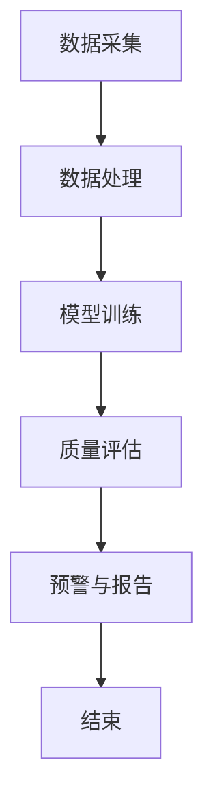
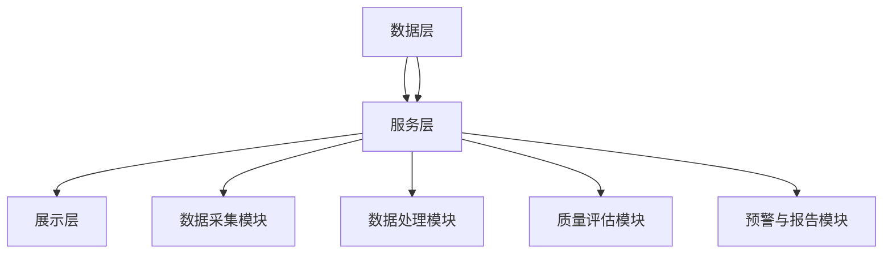
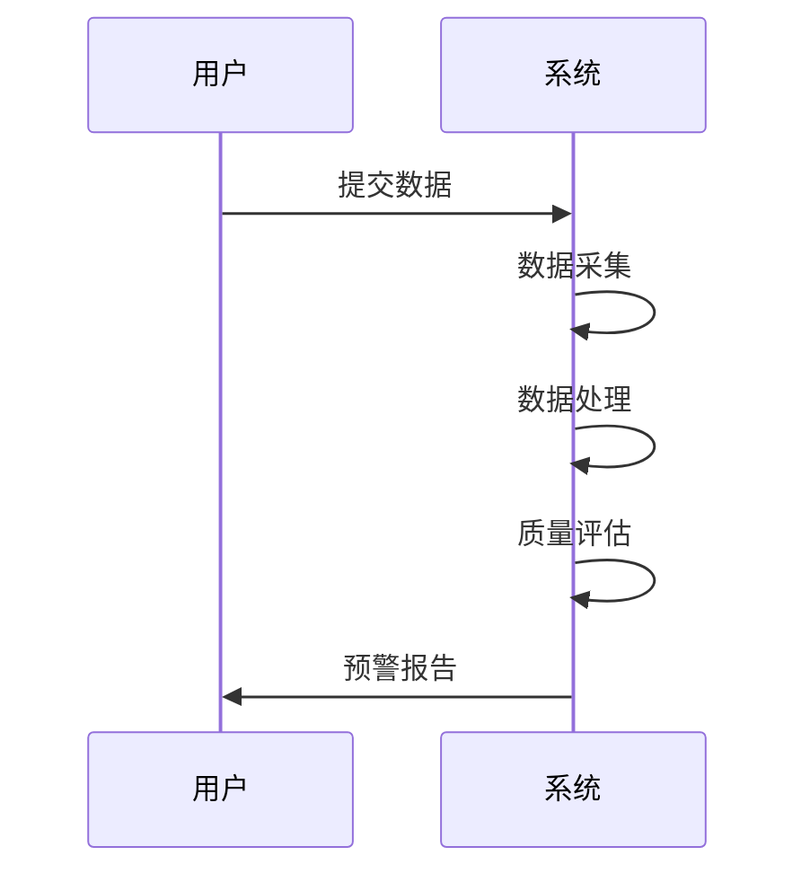

                 

### 第1章：问题背景与核心概念

#### 1.1 问题背景

**1.1.1 企业财务报表质量的重要性**

企业财务报表质量是企业运营健康与否的重要指标，它不仅直接影响到企业的利益相关者，如股东、债权人、客户和政府部门等，也对资本市场和经济环境的稳定起着关键作用。高质量的财务报表能够提供准确、及时和透明的财务信息，帮助利益相关者做出合理的决策。因此，提升财务报表质量成为许多企业的迫切需求。

**1.1.2 财务报表质量监控的现状与挑战**

目前，大多数企业的财务报表质量监控主要依赖于人工审核和传统的审计方法。然而，随着企业规模和数据量的不断扩大，人工审核的效率和准确性逐渐降低，导致财务报表质量难以得到有效保障。此外，财务报表质量监控还存在以下几个挑战：

1. **数据复杂性**：财务报表数据量大，且数据类型多样，传统方法难以处理。
2. **实时性**：传统方法往往无法实现实时监控，信息滞后影响决策。
3. **准确性**：人工审核的误差较大，尤其是面对复杂的会计政策和变化频繁的经济环境。
4. **合规性**：企业需要满足不同国家和地区的会计准则和法规要求，监控难度增加。

**1.1.3 AI技术在财务报表质量监控中的应用潜力**

人工智能（AI）技术的发展为财务报表质量监控带来了新的契机。AI技术具有高效处理大数据、实时分析、自动学习和预测等特点，能够显著提升财务报表质量监控的效率和准确性。以下是一些AI技术在财务报表质量监控中的应用潜力：

1. **数据挖掘与分析**：通过数据挖掘技术，从海量财务报表数据中提取有价值的信息。
2. **自然语言处理（NLP）**：利用NLP技术，自动提取财务报表中的关键信息和异常。
3. **机器学习**：通过机器学习算法，建立财务报表质量评估模型，实现自动评估和预测。
4. **自动化审计**：利用自动化审计技术，减少人工审核工作量，提高审计效率。

#### 1.2 核心概念

**1.2.1 AI的定义与分类**

人工智能（Artificial Intelligence，简称AI）是指通过计算机模拟人类的智能行为，使计算机能够执行复杂的任务，如感知、学习、推理和决策等。根据实现方式和能力，AI可以分为以下几类：

1. **规则推理**：基于预定义的规则进行推理，如专家系统。
2. **基于知识的系统**：通过知识表示和推理技术，模拟人类专家的决策过程。
3. **机器学习**：通过从数据中学习，自动改进性能，如监督学习、无监督学习和强化学习。
4. **深度学习**：基于多层神经网络，模拟人类大脑的学习和处理方式。
5. **自然语言处理**：使计算机能够理解和生成自然语言，如语音识别、文本翻译和情感分析。

**1.2.2 财务报表质量的概念与评估指标**

财务报表质量是指财务报表的准确性、可靠性、及时性和透明度等特性。评估财务报表质量的关键指标包括：

1. **准确性**：财务报表中的数据是否真实、无误。
2. **可靠性**：财务报表是否能够提供稳定、可重复的结果。
3. **及时性**：财务报表是否能够在合理的时间内提供信息。
4. **透明度**：财务报表的编制和披露过程是否公开、透明。

**1.2.3 动态监控系统的基本构成**

动态监控系统是一个能够实时监控、分析和评估财务报表质量的系统。其基本构成包括：

1. **数据采集模块**：负责从各种数据源采集财务报表数据。
2. **数据处理模块**：对采集到的数据进行分析和预处理。
3. **质量评估模块**：利用AI技术，对财务报表质量进行评估。
4. **预警与报告模块**：实时生成质量预警报告，通知相关人员。

#### 1.3 AI驱动财务报表质量监控的优势与挑战

**1.3.1 优势分析**

AI技术在财务报表质量监控中具有以下优势：

1. **数据处理能力**：AI技术能够高效处理大规模、多样化的财务数据。
2. **实时监控**：AI技术可以实现实时监控，提供及时的质量预警。
3. **自动化**：通过自动化技术，减少人工干预，提高监控效率。
4. **准确性**：AI技术能够通过学习和优化，提高财务报表质量评估的准确性。
5. **适应性**：AI技术可以根据企业需求和环境变化，灵活调整监控策略。

**1.3.2 挑战与应对策略**

尽管AI技术具有显著优势，但在财务报表质量监控中也面临一些挑战：

1. **数据隐私**：财务数据涉及企业隐私，需要确保数据的安全性和保密性。
2. **算法偏见**：AI模型可能会因为数据偏差而产生偏见，影响质量评估的准确性。
3. **技术依赖**：过度依赖AI技术可能导致企业对技术的依赖性增加，降低自主创新能力。
4. **成本问题**：AI技术的研发和应用需要较大的资金投入。

应对策略包括：

1. **数据隐私保护**：采用加密、匿名化和数据脱敏技术，确保数据安全。
2. **算法透明性**：建立算法透明性和可解释性机制，降低算法偏见。
3. **技术自主性**：在关键环节保留技术自主性，避免过度依赖外部技术。
4. **成本控制**：合理规划研发投入，优化资源分配，降低成本。

**1.3.3 AI在财务报表质量监控中的前景展望**

随着AI技术的不断发展和应用，其在财务报表质量监控中的前景广阔：

1. **智能化**：AI技术将进一步提高财务报表质量监控的智能化水平。
2. **多样化**：AI技术将支持更多的财务报表质量监控场景和应用。
3. **定制化**：根据企业需求，提供更加个性化和定制化的监控方案。
4. **国际化**：AI技术将有助于满足不同国家和地区的财务报表质量监控需求。

**1.4 本章小结**

本章介绍了AI驱动财务报表质量监控的问题背景、核心概念和优势与挑战。通过分析企业财务报表质量的重要性、AI技术的定义与分类，以及财务报表质量的概念与评估指标，我们了解了AI技术在财务报表质量监控中的应用潜力。同时，本章还探讨了AI驱动财务报表质量监控的优势与挑战，并对未来前景进行了展望。这些内容为后续章节的详细探讨奠定了基础。接下来，我们将进一步深入探讨AI驱动财务报表质量监控的原理与方法，为构建高效、准确的监控系统提供理论支持。

---

### 第2章：AI核心算法原理讲解

**2.1 监控算法原理概述**

在AI驱动的财务报表质量监控系统中，核心算法的设计与实现至关重要。监控算法主要涉及数据采集、处理、分析和评估等多个环节。本节将首先概述监控算法的基本流程，然后详细讲解其原理和关键步骤。

**2.1.1 监控算法的分类与适用场景**

监控算法可以分为以下几类：

1. **数据挖掘算法**：用于从海量财务数据中挖掘有价值的信息，如关联规则挖掘、聚类分析和分类算法等。
2. **异常检测算法**：用于检测财务报表中的异常数据或异常行为，如基于统计方法的异常检测、基于聚类方法的异常检测等。
3. **风险评估算法**：用于评估财务报表中的风险水平，如信用评分模型、风险价值模型等。
4. **自然语言处理算法**：用于处理和解析文本数据，如命名实体识别、文本分类、情感分析等。

不同类型的算法适用于不同的监控场景，企业可以根据具体需求选择合适的算法。

**2.1.2 监控算法的基本流程**

监控算法的基本流程通常包括以下步骤：

1. **数据采集**：从企业内部或外部数据源（如财务系统、ERP系统、金融数据提供商等）采集财务报表数据。
2. **数据处理**：对采集到的数据进行分析和预处理，包括数据清洗、数据转换和数据归一化等。
3. **模型训练**：利用历史数据训练监控模型，如使用机器学习算法构建风险预测模型或异常检测模型。
4. **质量评估**：使用训练好的模型对当前财务报表进行质量评估，识别潜在的问题或风险。
5. **预警与报告**：根据评估结果生成质量预警报告，通知相关人员进行处理。

**2.2 算法原理讲解**

**2.2.1 监控算法的数学模型**

监控算法的核心是建立数学模型，用于描述财务报表质量的评估过程。一个典型的监控算法的数学模型可以表示为：

$$
\text{Quality} = f(\text{Input Data}, \text{Parameters})
$$

其中，`Input Data`代表输入的财务报表数据，`Parameters`代表监控算法的参数设置，`f`代表质量评估函数。质量评估函数可以根据不同的监控需求进行调整和优化。

**2.2.2 监控算法的 Mermaid 流程图**

为了更好地理解监控算法的原理和实现过程，我们可以使用Mermaid绘制一个流程图。以下是监控算法的 Mermaid 流程图示例：



**2.2.3 监控算法的性能评估**

监控算法的性能评估是确保其有效性和可靠性的关键环节。常见的性能评估指标包括准确性、召回率、F1分数、均方误差等。以下是性能评估的简要概述：

1. **准确性**：评估模型在预测财务报表质量时的正确率。
2. **召回率**：评估模型在识别异常或高风险数据时的覆盖率。
3. **F1分数**：综合考虑准确性和召回率的综合指标。
4. **均方误差**：评估模型在回归任务中的预测误差。

性能评估方法通常包括交叉验证、网格搜索、超参数调优等。为了提高监控算法的性能，还可以采用以下策略：

1. **数据增强**：通过增加数据量、数据变换等方式，提高模型的鲁棒性。
2. **特征工程**：选择和构建有助于提高模型性能的特征。
3. **算法调优**：通过调整算法参数，优化模型性能。
4. **集成学习**：结合多种算法，提高整体性能。

**2.3 本章小结**

本章详细讲解了AI驱动财务报表质量监控算法的原理和方法。通过概述监控算法的分类与基本流程，我们了解了不同类型算法的适用场景和实现步骤。接着，我们介绍了监控算法的数学模型和Mermaid流程图，帮助读者更好地理解算法的实现过程。最后，我们讨论了监控算法的性能评估方法和优化策略，为构建高效、准确的监控算法提供了参考。在下一章中，我们将深入探讨AI驱动财务报表质量监控系统的设计与实现。

---

### 第3章：系统设计与架构

**3.1 问题场景介绍**

在现代企业中，财务报表质量监控是一个至关重要的环节。随着企业规模的不断扩大和数据量的急剧增长，传统的手工审核方法已经难以满足高质量、实时性监控的需求。为此，我们设计了一套基于AI技术的企业财务报表质量动态监控系统，以应对上述挑战。

**3.1.1 系统实现目标**

该系统的实现目标主要包括：

1. **自动化处理**：通过AI技术实现财务报表数据的自动采集、处理和质量评估，减少人工干预。
2. **实时监控**：实现财务报表质量的实时监控，及时识别和预警潜在的问题或风险。
3. **高效分析**：利用AI算法对财务数据进行深入分析，提供有价值的洞察和决策支持。
4. **合规性检查**：确保财务报表符合相关法规和标准，提高企业的合规性水平。

**3.1.2 系统使用场景**

该系统适用于各类企业，尤其是那些拥有大量财务数据、业务流程复杂、对财务报表质量要求较高的企业。具体使用场景包括：

1. **年度财务审计**：在年度财务审计过程中，系统可以帮助快速评估财务报表质量，发现潜在问题。
2. **月度财务报告**：月度财务报告的生成和审核过程中，系统可以实时监控数据质量，确保报告的准确性和及时性。
3. **财务风险预警**：通过系统提供的风险预警功能，企业可以及时发现潜在的财务风险，采取相应措施。
4. **内部审计**：内部审计过程中，系统可以辅助审计人员快速识别异常数据和潜在问题，提高审计效率。

**3.2 系统功能设计**

系统功能设计是构建高效、可靠的AI驱动财务报表质量监控系统的重要环节。以下是系统的主要功能模块及其设计思路：

**3.2.1 数据采集模块**

数据采集模块负责从企业内部和外部的数据源（如财务系统、ERP系统、金融数据提供商等）收集财务报表数据。该模块需要实现以下功能：

1. **数据源接入**：支持多种数据源接入方式，如API接口、文件导入、数据库连接等。
2. **数据抽取**：根据系统需求，抽取关键财务报表数据，如资产负债表、利润表、现金流量表等。
3. **数据清洗**：对采集到的数据进行清洗，包括去除重复记录、填补缺失值、处理异常数据等。

**3.2.2 数据处理模块**

数据处理模块负责对采集到的财务报表数据进行预处理和分析。该模块需要实现以下功能：

1. **数据预处理**：对财务报表数据进行标准化处理，如数据格式转换、数据归一化等。
2. **特征提取**：从财务报表数据中提取有助于质量评估的特征，如财务指标、异常指标等。
3. **数据融合**：将来自不同数据源的数据进行融合，构建完整的财务数据视图。

**3.2.3 质量评估模块**

质量评估模块是系统的核心功能，负责对财务报表质量进行评估。该模块需要实现以下功能：

1. **模型训练**：使用历史数据训练质量评估模型，如基于机器学习的风险评估模型、异常检测模型等。
2. **质量评估**：使用训练好的模型对当前财务报表进行质量评估，识别潜在的问题或风险。
3. **风险预警**：根据评估结果生成风险预警报告，通知相关人员采取相应措施。

**3.2.4 预警与报告模块**

预警与报告模块负责生成质量预警报告，并提供可视化展示功能。该模块需要实现以下功能：

1. **报告生成**：根据质量评估结果，生成详细的预警报告，包括问题描述、影响分析、风险等级等。
2. **报告展示**：提供多种报告展示方式，如文本报告、图表报告、仪表盘等，方便用户查看和分析。
3. **交互反馈**：支持用户与系统进行交互，如查看详细报告、标记问题、反馈意见等。

**3.3 系统架构设计**

系统架构设计是确保系统功能实现和性能优化的重要环节。以下是系统的整体架构设计：

**3.3.1 系统架构概述**

系统采用分布式架构设计，包括数据层、服务层和展示层。以下是系统架构的概述：

1. **数据层**：负责数据存储和管理，包括财务报表数据、模型数据、预警数据等。
2. **服务层**：负责系统功能实现，包括数据采集、数据处理、质量评估、预警与报告等。
3. **展示层**：负责系统界面展示，包括报告展示、数据可视化、交互反馈等。

**3.3.2 系统架构Mermaid架构图**

以下是系统的Mermaid架构图示例：



**3.4 系统接口设计**

系统接口设计是确保系统功能模块之间高效通信和协作的重要环节。以下是系统的主要接口设计：

**3.4.1 接口规范**

系统接口采用RESTful API规范，包括以下主要接口：

1. **数据采集接口**：用于数据源的接入和数据的抽取、清洗等操作。
2. **数据处理接口**：用于数据预处理、特征提取和数据融合等操作。
3. **质量评估接口**：用于模型训练、质量评估和风险预警等操作。
4. **预警与报告接口**：用于生成预警报告、报告展示和交互反馈等操作。

**3.4.2 接口实现**

以下是系统接口的实现示例：

```python
# 数据采集接口实现
@app.route('/api/collect_data', methods=['GET'])
def collect_data():
    # 实现数据采集逻辑
    pass

# 数据处理接口实现
@app.route('/api/process_data', methods=['POST'])
def process_data():
    # 实现数据处理逻辑
    pass

# 质量评估接口实现
@app.route('/api/evaluate_quality', methods=['POST'])
def evaluate_quality():
    # 实现质量评估逻辑
    pass

# 预警与报告接口实现
@app.route('/api/generate_report', methods=['GET'])
def generate_report():
    # 实现报告生成逻辑
    pass
```

**3.5 系统交互Mermaid序列图**

系统交互是确保系统功能模块之间高效协作和通信的关键环节。以下是系统的Mermaid序列图示例：



**3.6 本章小结**

本章详细介绍了AI驱动财务报表质量监控系统的设计与架构。通过问题场景介绍，明确了系统的实现目标和适用场景。接着，我们设计了系统的功能模块，包括数据采集、数据处理、质量评估和预警与报告模块。随后，我们介绍了系统的架构设计，包括数据层、服务层和展示层，并使用Mermaid绘制了系统架构图。此外，我们还设计了系统的接口规范和实现示例，并展示了系统交互的Mermaid序列图。这些内容为后续章节的系统实现和实战应用奠定了基础。在下一章中，我们将深入探讨系统环境安装与配置的细节，为实际部署做好准备。

---

### 第4章：环境安装与配置

**4.1 环境需求**

在部署AI驱动的财务报表质量动态监控系统前，我们需要确保环境满足以下基本需求：

**4.1.1 软件环境**

1. **操作系统**：推荐使用Linux系统，如Ubuntu 18.04或更高版本。
2. **Python**：Python 3.8及以上版本。
3. **Pip**：Python的包管理工具。
4. **Docker**：用于容器化部署，版本为19.03或更高。
5. **Nginx**：用于Web服务器，版本为1.18或更高。
6. **数据库**：推荐使用PostgreSQL，版本为12或更高。
7. **Jupyter Notebook**：用于数据分析和可视化，版本为6.0或更高。

**4.1.2 硬件环境**

1. **CPU**：至少4核处理器。
2. **内存**：至少16GB RAM。
3. **硬盘**：至少200GB SSD存储空间。
4. **网络**：至少100Mbps网络带宽。

**4.2 系统安装与配置**

**4.2.1 安装步骤**

以下步骤概述了系统环境的安装过程：

1. **安装操作系统**：根据硬件设备，选择合适的操作系统安装镜像并完成安装。
2. **更新系统**：打开终端，执行以下命令更新系统软件包：
    ```
    sudo apt-get update
    sudo apt-get upgrade
    ```
3. **安装Python和Pip**：执行以下命令安装Python和Pip：
    ```
    sudo apt-get install python3 python3-pip
    ```
4. **安装Docker**：执行以下命令安装Docker：
    ```
    sudo apt-get install docker-ce docker-ce-cli containerd.io
    ```
5. **安装Nginx**：执行以下命令安装Nginx：
    ```
    sudo apt-get install nginx
    ```
6. **安装PostgreSQL**：执行以下命令安装PostgreSQL：
    ```
    sudo apt-get install postgresql postgresql-contrib
    ```
7. **安装Jupyter Notebook**：执行以下命令安装Jupyter Notebook：
    ```
    pip3 install notebook
    ```
8. **配置数据库**：初始化PostgreSQL数据库，并创建用于系统的数据库用户和数据库：
    ```
    sudo -u postgres initdb
    sudo -u postgres createuser -s user
    sudo -u postgres createdb quality_monitor_db
    ```
9. **配置Nginx**：创建并编辑Nginx配置文件`/etc/nginx/sites-available/quality_monitor`：
    ```
    server {
        listen 80;
        server_name localhost;

        location / {
            proxy_pass http://localhost:8888;
            proxy_set_header Host $host;
            proxy_set_header X-Real-IP $remote_addr;
            proxy_set_header X-Forwarded-For $proxy_add_x_forwarded_for;
            proxy_set_header X-Forwarded-Proto $scheme;
        }
    }
    ```
    然后启用配置文件并重启Nginx：
    ```
    sudo ln -s /etc/nginx/sites-available/quality_monitor /etc/nginx/sites-enabled/
    sudo nginx -t
    sudo systemctl restart nginx
    ```

**4.2.2 配置参数**

在安装和配置过程中，我们需要调整一些关键参数，以确保系统性能和稳定性：

1. **Docker配置**：编辑Docker配置文件`/etc/docker/daemon.json`，增加如下内容以启用容器内存和CPU资源限制：
    ```json
    {
        "oom_score_adj": -1000,
        "log-driver": "json-file",
        "log-opts": {"max-size": "10m", "max-file": "3"},
        "storage-driver": "overlay2",
        "kernel_memory": "1g",
        "memory": "3g",
        "cpus": "1.0"
    }
    ```
2. **Nginx配置**：在Nginx配置文件中调整`client_max_body_size`和`proxy_connect_timeout`等参数，以适应系统需求：
    ```nginx
    client_max_body_size 50M;
    proxy_connect_timeout 90;
    proxy_read_timeout 90;
    proxy_send_timeout 90;
    ```

**4.3 本章小结**

本章详细介绍了AI驱动的财务报表质量动态监控系统的安装与配置过程。我们明确了所需的软件和硬件环境，并详细描述了安装步骤和配置参数。通过这些步骤，用户可以顺利搭建系统环境，为后续的系统实现和实战应用奠定基础。在下一章中，我们将深入探讨系统核心实现与代码解读，进一步了解系统的内部工作原理和关键实现细节。

