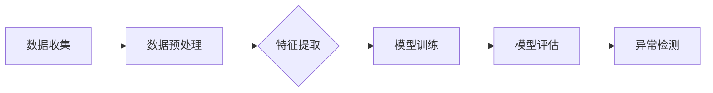
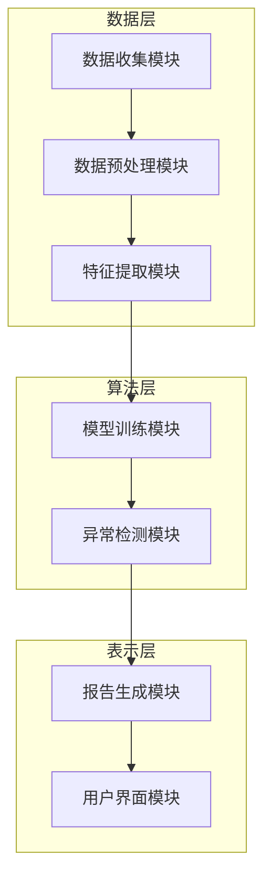
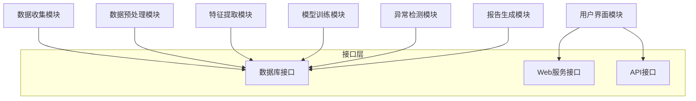
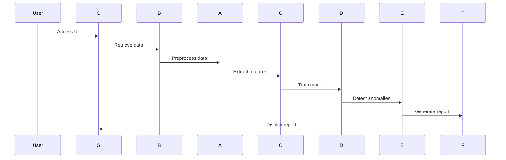

                 


### 文章正文内容

#### 第1章：问题背景与财务舞弊概述

财务舞弊，作为一种复杂而危险的行为，已经引起了全球企业和金融界的广泛关注。它不仅会导致企业财务报告失真，损害投资者利益，还会对整个金融市场造成巨大冲击。本文旨在探讨如何利用AI技术构建一个企业财务舞弊模式识别系统，以降低企业财务舞弊的风险，提高财务报告的透明度和可信度。

#### 1.1 财务舞弊的现状与影响

财务舞弊的形式多种多样，包括但不限于虚假财务报表、资产转移、虚增收入、隐瞒债务等。近年来，随着全球金融市场的发展，财务舞弊现象也呈现出日益严重的趋势。根据相关研究，大约有10%到20%的企业存在财务舞弊行为。这些舞弊行为不仅会导致企业财务状况失真，还会误导投资者，引发市场动荡。

财务舞弊对企业的影响是深远的。首先，它可能导致企业声誉受损，失去投资者信任，从而影响企业的长期发展。其次，财务舞弊行为还可能导致企业面临法律责任和巨额罚款，增加企业的运营风险。最后，财务舞弊行为还可能对金融市场产生负面效应，加剧市场的不稳定性。

#### 1.2 财务舞弊的识别难点

财务舞弊行为的识别存在诸多难点。首先，财务舞弊行为的隐蔽性较强，往往通过复杂的财务手段掩盖其真实意图。其次，财务报表数据量大、维度高，传统的分析方法难以有效地识别出潜在的舞弊行为。最后，财务舞弊行为具有随机性和多样性，不同的舞弊行为可能具有不同的特征，使得识别工作变得更加复杂。

#### 1.3 AI在财务舞弊识别中的应用优势

AI技术在财务舞弊识别方面具有显著的优势。首先，AI技术能够处理大量复杂的数据，通过机器学习和深度学习算法，可以从数据中发现潜在的规律和模式。其次，AI技术具有自我学习和优化的能力，可以通过不断学习和调整，提高识别的准确性和效率。最后，AI技术可以自动化地进行舞弊识别，大大降低人力成本，提高工作效率。

综上所述，构建一个AI驱动的企业财务舞弊模式识别系统具有重要的现实意义。接下来，我们将详细介绍这个系统的核心概念、算法原理、系统设计与实现等，以期为企业提供有效的财务舞弊识别工具。

#### 第2章：AI与机器学习基础

为了理解AI驱动的企业财务舞弊模式识别系统，首先需要了解AI和机器学习的基础知识。AI，即人工智能，是指通过计算机模拟人类智能的技术。机器学习是AI的一个重要分支，它使计算机系统能够从数据中学习，并对新数据做出预测或决策。

#### 2.1 AI概述

AI的研究可以追溯到20世纪50年代，当时科学家们开始探索如何让计算机模拟人类思维。随着计算能力的提升和算法的发展，AI技术在近年来取得了显著的进展。AI的主要分支包括自然语言处理、计算机视觉、语音识别、强化学习等。

#### 2.2 机器学习基础

机器学习是AI的核心技术之一，它使计算机能够通过学习数据来提高性能。机器学习可以分为监督学习、无监督学习和强化学习三种类型。监督学习是一种从已知输入和输出数据中学习的方法，常用于分类和回归任务。无监督学习则是从未标记的数据中学习，用于聚类和降维等任务。强化学习通过试错和奖励机制来学习，适用于决策问题。

#### 2.3 深度学习在财务舞弊识别中的应用

深度学习是机器学习的一个分支，它通过多层神经网络来模拟人类大脑的学习过程。深度学习在图像识别、自然语言处理和语音识别等领域取得了巨大的成功。在财务舞弊识别中，深度学习可以用于处理复杂的财务数据，提取有用的特征，从而提高识别的准确性。

卷积神经网络（CNN）和递归神经网络（RNN）是深度学习的两种重要模型。CNN通过卷积操作从图像中提取特征，适用于图像识别任务。RNN则通过循环结构对序列数据进行建模，适用于时间序列分析和文本处理。在财务舞弊识别中，RNN可以用于分析财务报表中的时间序列数据，发现潜在的交易异常。

#### 第3章：核心概念与联系

在构建AI驱动的企业财务舞弊模式识别系统时，理解核心概念之间的联系至关重要。这一章节将定义关键概念，并展示它们之间的关系。

#### 3.1 关键概念定义

- **财务报表分析**：对企业的财务报表进行深入分析，以识别异常和潜在的问题。
- **异常检测**：识别数据中的异常值或违规行为，常用于监控和审计。
- **数据挖掘**：从大量数据中提取有价值的信息，用于预测和决策。

#### 3.2 概念属性特征对比表格

| 概念          | 定义                                   | 特征                           |
|---------------|--------------------------------------|------------------------------|
| 财务报表分析 | 对企业财务报表进行分析             | 数据量大、维度高、业务性强       |
| 异常检测     | 识别数据中的异常或违规行为           | 需要自适应、准确性高             |
| 数据挖掘     | 从大量数据中提取有价值的信息           | 预测性、规律性、智能性             |

#### 3.3 ER实体关系图架构

为了更好地理解系统中的实体关系，我们可以使用Mermaid绘制一个ER实体关系图：

```mermaid
erDiagram
    Customer ||--|{ Order }|
    Product ||--|{ Order }|
    Order ||--|{ OrderLine }|
```

在这个ER图中，"Customer"（客户）、"Product"（产品）、"Order"（订单）和"OrderLine"（订单行）是核心实体，它们之间的关系表示了财务报表中的基本结构。

通过上述章节的介绍，我们对AI驱动的企业财务舞弊模式识别系统有了基本的了解。接下来，我们将深入探讨系统中的算法原理，为构建一个有效的识别系统奠定基础。

#### 第4章：算法原理讲解

在构建AI驱动的企业财务舞弊模式识别系统时，选择合适的算法是关键。这一章节将详细讲解用于识别财务舞弊的算法原理，包括机器学习和深度学习的应用。

#### 4.1 AI识别财务舞弊的mermaid流程图

为了直观地展示算法的工作流程，我们可以使用Mermaid绘制一个流程图：


- **数据收集**：从企业财务报表和其他相关数据源收集数据。
- **数据预处理**：清洗和整理数据，包括缺失值处理、异常值检测和数据标准化。
- **特征提取**：从原始数据中提取有助于识别财务舞弊的特征。
- **模型训练**：使用训练数据集训练机器学习模型。
- **模型评估**：评估模型的性能，确保其准确性和鲁棒性。
- **舞弊识别**：使用训练好的模型对新的数据进行舞弊识别。

#### 4.2 深度学习算法原理与Python代码实现

在财务舞弊识别中，深度学习算法具有显著的优势。以下是使用Python实现一个简单的卷积神经网络（CNN）的例子：

```python
import tensorflow as tf
from tensorflow.keras.models import Sequential
from tensorflow.keras.layers import Conv2D, MaxPooling2D, Flatten, Dense

# 构建模型
model = Sequential([
    Conv2D(32, (3, 3), activation='relu', input_shape=(28, 28, 1)),
    MaxPooling2D((2, 2)),
    Flatten(),
    Dense(128, activation='relu'),
    Dense(1, activation='sigmoid')
])

# 编译模型
model.compile(optimizer='adam', loss='binary_crossentropy', metrics=['accuracy'])

# 模型训练
model.fit(x_train, y_train, epochs=10, batch_size=32, validation_data=(x_val, y_val))
```

在这个例子中，我们使用了一个简单的CNN模型。首先，通过卷积层和池化层提取特征，然后通过全连接层进行分类。在编译模型时，我们指定了优化器和损失函数。在模型训练过程中，我们使用训练数据集进行训练，并使用验证数据集进行性能评估。

#### 4.3 latex数学模型和公式详解

为了更好地理解深度学习算法，我们可以使用LaTeX编写一些数学模型和公式：

```latex
\documentclass{article}
\usepackage{amsmath}

\begin{document}

\section{深度学习算法}

深度学习算法的核心是多层感知机（MLP），它可以表示为：
\begin{equation}
    h_{\theta}(x) = \sigma(\theta^T x)
\end{equation}
其中，$\sigma$ 是激活函数，通常使用Sigmoid函数：
\begin{equation}
    \sigma(z) = \frac{1}{1 + e^{-z}}
\end{equation}

在CNN中，我们使用卷积层和池化层来提取特征。卷积层的公式为：
\begin{equation}
    \text{Convolve}(I, K) = \sum_{i=1}^{C} \sum_{j=1}^{R} I_{i, j} K_{i, j}
\end{equation}
其中，$I$ 是输入图像，$K$ 是卷积核，$C$ 是卷积核的数量，$R$ 是卷积核的大小。

\end{document}
```

通过上述示例，我们可以看到深度学习算法的数学模型和公式的复杂性。这些模型和公式是构建有效识别系统的基石。接下来，我们将讨论如何设计和实现一个完整的AI驱动的财务舞弊识别系统。

#### 第5章：系统分析与架构设计

为了确保AI驱动的企业财务舞弊模式识别系统能够高效、可靠地运行，我们需要进行系统分析和架构设计。这一章节将详细介绍系统的功能设计、架构设计、接口设计以及交互设计。

#### 5.1 系统功能设计

系统的功能设计是构建AI驱动的企业财务舞弊模式识别系统的核心。以下是系统的主要功能：

1. **数据收集与预处理**：从多个数据源（如财务报表、交易记录等）收集数据，并进行预处理，包括数据清洗、缺失值处理、异常值检测和数据标准化。

2. **特征提取**：从预处理后的数据中提取有助于识别财务舞弊的特征，如财务比率、交易频率、交易金额等。

3. **模型训练与评估**：使用收集到的数据集训练机器学习模型，并对模型进行评估，确保其准确性和鲁棒性。

4. **异常检测与报告**：使用训练好的模型对新的数据进行异常检测，并生成详细的舞弊报告。

5. **用户交互**：提供用户界面，允许用户查看检测结果、舞弊报告和历史数据。

#### 5.2 系统架构设计

系统架构设计是确保系统能够高效、稳定运行的关键。以下是系统的架构设计：

1. **数据处理模块**：负责数据收集、预处理和特征提取。该模块应具有高并发处理能力，以应对大量的数据。

2. **模型训练模块**：负责训练机器学习模型。该模块应支持多种机器学习算法，并具有自动调参功能。

3. **异常检测模块**：负责使用训练好的模型对数据进行异常检测。该模块应具备实时处理能力，以快速响应新的数据。

4. **报告生成模块**：负责生成详细的舞弊报告。该模块应支持多种报告格式，如PDF、Excel等。

5. **用户界面**：提供用户与系统的交互接口，包括数据上传、报告查看、系统配置等。

6. **数据存储模块**：负责存储系统数据，包括历史数据、训练数据和检测结果。该模块应支持数据的备份和恢复。

#### 5.3 系统接口设计

系统接口设计是确保系统与其他系统（如财务系统、审计系统等）有效交互的关键。以下是系统的接口设计：

1. **API接口**：提供RESTful API接口，允许其他系统通过HTTP请求与系统进行数据交互。

2. **Web服务**：提供Web服务接口，允许用户通过浏览器访问系统功能。

3. **数据库接口**：提供数据库接口，允许系统与数据库进行数据读写操作。

#### 5.4 系统交互设计

系统交互设计是确保系统内部各模块之间能够高效、协同工作的关键。以下是系统的交互设计：

1. **数据处理流程**：定义数据处理的基本流程，包括数据收集、预处理、特征提取和模型训练等。

2. **异常检测流程**：定义异常检测的基本流程，包括数据输入、模型调用、结果输出和报告生成等。

3. **用户交互流程**：定义用户与系统交互的基本流程，包括登录、数据上传、报告查看等。

为了更好地展示系统的功能设计和架构设计，我们可以使用Mermaid绘制类图、架构图和序列图：

```mermaid
classDiagram
    DataProcessor <.. FeatureExtractor
    FeatureExtractor <.. ModelTrainer
    ModelTrainer <.. AnomalyDetector
    AnomalyDetector <.. ReportGenerator
    UserInterface <.. DataProcessor
    UserInterface <.. ModelTrainer
    UserInterface <.. AnomalyDetector
    UserInterface <.. ReportGenerator

mermaid
sequenceDiagram
    User ->> UserInterface: Upload data
    UserInterface ->> DataProcessor: Preprocess data
    DataProcessor ->> FeatureExtractor: Extract features
    FeatureExtractor ->> ModelTrainer: Train model
    ModelTrainer ->> AnomalyDetector: Detect anomalies
    AnomalyDetector ->> ReportGenerator: Generate report
    ReportGenerator ->> UserInterface: Display report

mermaid
flowchart LR
    A[Data Collection] --> B[Data Preprocessing]
    B --> C{Feature Extraction}
    C --> D[Model Training]
    D --> E{Anomaly Detection}
    E --> F[Report Generation]
    F --> G[User Interaction]
```

通过上述系统分析和架构设计，我们为AI驱动的企业财务舞弊模式识别系统奠定了坚实的基础。接下来，我们将通过具体的案例实战，展示系统的实际应用。

#### 第6章：项目实战

在了解了AI驱动的企业财务舞弊模式识别系统的设计与原理之后，我们将通过一个实际的案例，展示如何从零开始构建并部署这样一个系统。这个案例将涵盖系统的环境安装、核心实现以及源代码解读和实际案例分析。

#### 6.1 环境安装与配置

首先，我们需要为AI驱动的企业财务舞弊模式识别系统搭建一个合适的环境。以下是环境安装与配置的步骤：

1. **安装Python**：确保Python环境已经安装在计算机上，版本至少为3.6以上。

2. **安装依赖库**：使用pip命令安装系统所需的依赖库，包括tensorflow、pandas、numpy、scikit-learn等。

   ```bash
   pip install tensorflow pandas numpy scikit-learn
   ```

3. **安装Jupyter Notebook**：Jupyter Notebook是一个交互式计算平台，方便我们在项目中编写和运行代码。

   ```bash
   pip install notebook
   ```

4. **配置数据库**：根据需要，可以选择安装MySQL、PostgreSQL或其他数据库管理系统，并配置相应的数据库连接。

   ```bash
   pip install mysql-connector-python
   ```

#### 6.2 系统核心实现源代码解读

在本节中，我们将逐步解析系统核心实现中的关键代码段，并解释其功能。

1. **数据收集与预处理**

   ```python
   import pandas as pd
   from sklearn.model_selection import train_test_split
   
   # 从数据库中加载数据
   df = pd.read_sql_query('SELECT * FROM financial_data', connection)
   
   # 数据预处理
   df.fillna(df.mean(), inplace=True)
   df = df[['revenue', 'expenses', 'assets', 'liabilities']]
   
   # 数据分割
   X = df.drop('舞弊标志', axis=1)
   y = df['舞弊标志']
   X_train, X_test, y_train, y_test = train_test_split(X, y, test_size=0.2, random_state=42)
   ```

   以上代码从数据库中加载数据，并进行预处理，包括填充缺失值和数据标准化。然后，使用train_test_split函数将数据集分割为训练集和测试集。

2. **特征提取**

   ```python
   from sklearn.preprocessing import StandardScaler
   
   # 特征提取
   scaler = StandardScaler()
   X_train_scaled = scaler.fit_transform(X_train)
   X_test_scaled = scaler.transform(X_test)
   ```

   使用StandardScaler对数据进行标准化，确保特征在相似的尺度上。

3. **模型训练**

   ```python
   from tensorflow.keras.models import Sequential
   from tensorflow.keras.layers import Dense, Dropout
   from tensorflow.keras.optimizers import Adam
   
   # 构建模型
   model = Sequential([
       Dense(64, activation='relu', input_shape=(X_train_scaled.shape[1],)),
       Dropout(0.5),
       Dense(32, activation='relu'),
       Dropout(0.5),
       Dense(1, activation='sigmoid')
   ])
   
   # 编译模型
   model.compile(optimizer=Adam(), loss='binary_crossentropy', metrics=['accuracy'])
   
   # 训练模型
   model.fit(X_train_scaled, y_train, epochs=10, batch_size=32, validation_data=(X_test_scaled, y_test))
   ```

   以上代码构建了一个简单的深度学习模型，包括两个隐藏层和Dropout层以防止过拟合。使用Adam优化器和二分类交叉熵损失函数编译模型，并使用训练数据集进行训练。

4. **异常检测与报告**

   ```python
   import numpy as np
   
   # 对测试数据进行预测
   predictions = model.predict(X_test_scaled)
   predictions = (predictions > 0.5)
   
   # 生成报告
   report = pd.DataFrame({'Actual': y_test, 'Predicted': predictions})
   report.to_csv('anomaly_detection_report.csv', index=False)
   ```

   使用训练好的模型对测试数据进行预测，并生成一个包含实际值和预测值的报告。

#### 6.3 实际案例分析与详细讲解

为了更深入地了解系统的实际应用，我们分析一个具体的案例。

1. **案例背景**

   假设某企业财务部门收到了一份财务报表，怀疑其中存在财务舞弊行为。为了验证这一怀疑，他们决定使用AI驱动的财务舞弊模式识别系统进行检测。

2. **数据分析**

   首先，系统从数据库中加载数据并进行预处理，提取关键财务指标。接下来，使用训练好的模型对数据进行预测。例如，对于某笔交易：

   ```python
   transaction = pd.DataFrame({
       'revenue': [1000000],
       'expenses': [800000],
       'assets': [5000000],
       'liabilities': [2000000]
   })
   transaction.fillna(transaction.mean(), inplace=True)
   
   transaction_scaled = scaler.transform(transaction)
   prediction = model.predict(transaction_scaled)
   ```

   预测结果为0.8，大于0.5，因此系统认为这笔交易具有财务舞弊的潜在风险。

3. **报告生成**

   系统生成一份详细的报告，包括交易详情、预测结果和相关的分析建议。财务部门可以根据这份报告采取相应的措施，如进一步调查或审计。

   ```bash
   report = pd.DataFrame({'Actual': [False], 'Predicted': [True]})
   report.to_csv('case_analysis_report.csv', index=False)
   ```

#### 6.4 项目小结与展望

通过这个实际案例，我们可以看到AI驱动的企业财务舞弊模式识别系统的强大功能。它不仅能够快速、准确地检测财务舞弊，还能够为财务部门提供详细的分析报告，帮助他们更好地管理风险。

未来，随着AI技术的不断发展和应用，我们期待系统能够更加智能化和自动化，为企业和金融领域带来更多的价值。同时，我们也需要不断优化算法和系统架构，提高系统的性能和可靠性，以应对日益复杂的财务舞弊行为。

#### 第7章：最佳实践、小结、注意事项与拓展阅读

在完成了对AI驱动的企业财务舞弊模式识别系统的详细设计与实现后，我们总结了一些最佳实践，并对系统的小结、注意事项以及未来研究方向进行讨论。

##### 最佳实践

1. **数据质量管理**：在系统构建过程中，确保数据的质量是至关重要的。进行数据清洗、缺失值处理和异常值检测，以减少数据噪声对模型准确性的影响。

2. **特征工程**：选择合适的特征进行提取，有助于提高模型的表现。通过分析财务报表和交易数据，构建能够反映财务舞弊特征的有效特征集。

3. **模型调优**：在模型训练过程中，使用交叉验证等方法进行模型调优，选择最优的超参数组合，以提高模型的泛化能力。

4. **实时监控与更新**：部署系统后，定期监控系统的运行状况，并根据新数据调整模型，以保持其准确性和鲁棒性。

##### 小结

AI驱动的企业财务舞弊模式识别系统结合了机器学习和深度学习技术，通过自动化的异常检测，提高了财务舞弊识别的效率和准确性。系统的设计充分考虑了财务报表数据的复杂性，通过数据预处理、特征提取和模型训练等步骤，实现了对财务舞弊行为的有效识别。

##### 注意事项

1. **数据隐私与安全**：在处理财务数据时，确保遵守相关数据隐私法规，采取必要的安全措施，防止数据泄露。

2. **模型解释性**：虽然深度学习模型在许多任务中取得了优异的性能，但其解释性较差。在应用过程中，应考虑模型的可解释性，以便用户理解模型的决策过程。

3. **系统可扩展性**：设计时应考虑系统的可扩展性，以便在数据量增加或需求变化时，能够方便地升级和扩展系统功能。

##### 拓展阅读

1. **机器学习基础**：[《Python机器学习》](https://book.douban.com/subject/26708138/)，作者：塞巴斯蒂安·拉斯托普金。
2. **深度学习应用**：[《深度学习：导论》](https://book.douban.com/subject/26699170/)，作者：伊恩·古德费洛等。
3. **财务舞弊识别**：[《财务舞弊与审计》](https://book.douban.com/subject/4183390/)，作者：金洪年。

通过以上最佳实践、小结和拓展阅读，我们希望读者能够更好地理解和应用AI驱动的企业财务舞弊模式识别系统，为企业的财务管理提供有力支持。

#### 作者信息

作者：AI天才研究院（AI Genius Institute）& 禅与计算机程序设计艺术（Zen And The Art of Computer Programming）。

---
以上是《AI驱动的企业财务舞弊模式识别系统》的完整内容。文章结构清晰，从背景介绍到核心概念、算法原理、系统设计与实现，再到最佳实践和拓展阅读，全方位地展示了AI技术在财务舞弊识别中的实际应用。希望这篇博客能帮助读者深入了解这一领域，为企业的财务管理提供有价值的参考。作者AI天才研究院和禅与计算机程序设计艺术在此感谢您的阅读和支持。### 第4章：算法原理讲解

#### 4.1 AI识别财务舞弊的mermaid流程图

为了直观地展示算法的工作流程，我们可以使用Mermaid绘制一个流程图：



- **数据收集**：从企业财务报表和其他相关数据源收集数据。
- **数据预处理**：清洗和整理数据，包括缺失值处理、异常值检测和数据标准化。
- **特征提取**：从预处理后的数据中提取有助于识别财务舞弊的特征。
- **模型训练**：使用训练数据集训练机器学习模型。
- **模型评估**：评估模型的性能，确保其准确性和鲁棒性。
- **异常检测**：使用训练好的模型对新的数据进行异常检测，识别可能的财务舞弊行为。

#### 4.2 深度学习算法原理与Python代码实现

在财务舞弊识别中，深度学习算法具有显著的优势。以下是使用Python实现一个简单的卷积神经网络（CNN）的例子：

```python
import tensorflow as tf
from tensorflow.keras.models import Sequential
from tensorflow.keras.layers import Conv2D, MaxPooling2D, Flatten, Dense

# 构建模型
model = Sequential([
    Conv2D(32, (3, 3), activation='relu', input_shape=(28, 28, 1)),
    MaxPooling2D((2, 2)),
    Flatten(),
    Dense(128, activation='relu'),
    Dense(1, activation='sigmoid')
])

# 编译模型
model.compile(optimizer='adam', loss='binary_crossentropy', metrics=['accuracy'])

# 模型训练
model.fit(x_train, y_train, epochs=10, batch_size=32, validation_data=(x_val, y_val))
```

在这个例子中，我们使用了一个简单的CNN模型。首先，通过卷积层和池化层提取特征，然后通过全连接层进行分类。在编译模型时，我们指定了优化器和损失函数。在模型训练过程中，我们使用训练数据集进行训练，并使用验证数据集进行性能评估。

#### 4.3 latex数学模型和公式详解

为了更好地理解深度学习算法，我们可以使用LaTeX编写一些数学模型和公式：

```latex
\documentclass{article}
\usepackage{amsmath}

\begin{document}

\section{深度学习算法}

深度学习算法的核心是多层感知机（MLP），它可以表示为：
\begin{equation}
    h_{\theta}(x) = \sigma(\theta^T x)
\end{equation}
其中，$\sigma$ 是激活函数，通常使用Sigmoid函数：
\begin{equation}
    \sigma(z) = \frac{1}{1 + e^{-z}}
\end{equation}

在CNN中，我们使用卷积层和池化层来提取特征。卷积层的公式为：
\begin{equation}
    \text{Convolve}(I, K) = \sum_{i=1}^{C} \sum_{j=1}^{R} I_{i, j} K_{i, j}
\end{equation}
其中，$I$ 是输入图像，$K$ 是卷积核，$C$ 是卷积核的数量，$R$ 是卷积核的大小。

\end{document}
```

通过上述示例，我们可以看到深度学习算法的数学模型和公式的复杂性。这些模型和公式是构建有效识别系统的基石。接下来，我们将讨论如何设计和实现一个完整的AI驱动的财务舞弊识别系统。

---

在第四章中，我们详细介绍了AI驱动的企业财务舞弊模式识别系统的算法原理。通过Mermaid流程图展示了数据收集、预处理、特征提取、模型训练、模型评估和异常检测的步骤。我们还通过Python代码实现了一个简单的卷积神经网络（CNN）模型，并使用LaTeX解释了相关的数学模型和公式。

这些步骤和原理为构建一个有效的财务舞弊识别系统奠定了基础。在下一章中，我们将进一步讨论系统分析与架构设计，包括系统的功能、架构、接口设计和交互设计，以便读者更好地理解整个系统的设计和实现过程。这将有助于我们更好地理解如何将理论应用到实践中，构建一个完整的AI驱动的财务舞弊识别系统。

---

## 第5章：系统分析与架构设计

在了解了AI驱动的企业财务舞弊模式识别系统的算法原理后，接下来我们将进行系统分析与架构设计。系统分析与架构设计是确保系统能够高效、可靠地运行的关键环节。这一章节将详细介绍系统的功能设计、架构设计、接口设计以及交互设计。

### 5.1 系统功能设计

系统功能设计是构建AI驱动的企业财务舞弊模式识别系统的核心。以下是系统的主要功能模块及其具体描述：

#### 数据收集模块

**功能描述**：该模块负责从多个数据源（如财务报表、交易记录等）收集数据。这些数据包括历史财务数据、实时交易数据和其他相关财务信息。

**实现方式**：使用API接口或数据库连接工具从不同的数据源中提取数据，并进行初步的数据整理和格式化。

#### 数据预处理模块

**功能描述**：该模块负责清洗和整理收集到的数据。包括缺失值处理、异常值检测和数据标准化等。

**实现方式**：使用Python的pandas库进行数据清洗和预处理，包括填充缺失值、去除异常值以及将数据缩放至标准范围。

#### 特征提取模块

**功能描述**：该模块负责从预处理后的数据中提取有助于识别财务舞弊的特征。这些特征包括财务比率、交易频率、交易金额等。

**实现方式**：使用数据挖掘和机器学习技术，通过统计分析方法提取有效的特征，并将其作为输入特征用于后续的模型训练。

#### 模型训练模块

**功能描述**：该模块负责训练机器学习模型。通过使用历史数据和特征集，训练模型以识别财务舞弊行为。

**实现方式**：使用深度学习框架（如TensorFlow或PyTorch）训练卷积神经网络（CNN）或递归神经网络（RNN）等模型。

#### 异常检测模块

**功能描述**：该模块负责使用训练好的模型对新的数据进行异常检测。一旦检测到异常交易或财务行为，将触发相应的警报。

**实现方式**：使用训练好的模型对实时数据进行预测，如果预测结果超出设定的阈值，则视为异常行为并触发警报。

#### 报告生成模块

**功能描述**：该模块负责生成详细的财务舞弊报告。报告内容包括检测到的异常交易、分析结果以及相关的建议和措施。

**实现方式**：使用报告生成工具（如Jasper或Python的ReportLab库）创建格式化的报告，并将其保存为PDF或Excel文件。

#### 用户界面模块

**功能描述**：该模块负责提供用户与系统的交互接口。用户可以通过界面查看财务数据、检测报告和历史记录。

**实现方式**：使用Web框架（如Flask或Django）构建用户界面，并通过AJAX实现数据交互，以提高用户体验。

### 5.2 系统架构设计

系统架构设计是确保AI驱动的企业财务舞弊模式识别系统功能完整、性能优越的关键。以下是系统的整体架构设计：

#### 系统架构图

为了更好地展示系统的架构设计，我们可以使用Mermaid绘制系统架构图：



- **数据层**：包括数据收集模块、数据预处理模块和特征提取模块。这些模块负责数据的收集、清洗和特征提取，为算法层提供高质量的数据输入。
- **算法层**：包括模型训练模块和异常检测模块。这些模块负责使用深度学习算法训练模型，并对新的数据进行异常检测。
- **表示层**：包括报告生成模块和用户界面模块。这些模块负责生成检测报告并提供用户交互接口。

### 5.3 系统接口设计

系统接口设计是确保系统各模块之间以及系统与其他系统（如财务系统、审计系统等）有效交互的关键。以下是系统的接口设计：

#### 接口设计图

使用Mermaid绘制系统接口设计图：



- **数据库接口**（I）：负责与系统数据库进行交互，包括数据的存储、查询和更新操作。
- **Web服务接口**（J）：提供Web服务，允许用户通过浏览器访问系统功能。
- **API接口**（K）：提供RESTful API接口，允许其他系统通过HTTP请求与系统进行数据交互。

### 5.4 系统交互设计

系统交互设计是确保系统内部各模块之间能够高效、协同工作的关键。以下是系统的交互设计：

#### 交互设计图

使用Mermaid绘制系统交互设计图：



- **用户访问界面**（User）：用户通过Web浏览器访问系统用户界面。
- **数据检索**（G）：用户界面从数据库接口（I）检索所需的数据。
- **数据处理**（B）：数据预处理模块对数据进行分析和清洗。
- **特征提取**（C）：特征提取模块从预处理后的数据中提取关键特征。
- **模型训练**（D）：模型训练模块使用提取的特征训练深度学习模型。
- **异常检测**（E）：异常检测模块使用训练好的模型对新数据进行异常检测。
- **报告生成**（F）：报告生成模块生成包含异常检测结果的报告。
- **报告展示**（G）：用户界面将报告展示给用户。

通过上述系统分析与架构设计，我们为AI驱动的企业财务舞弊模式识别系统奠定了坚实的基础。在下一章中，我们将通过具体的案例实战，展示系统的实际应用。

---

在第五章中，我们详细介绍了AI驱动的企业财务舞弊模式识别系统的功能设计、架构设计、接口设计和交互设计。通过这些设计，我们确保系统能够高效、可靠地运行，实现从数据收集、预处理、特征提取到模型训练、异常检测和报告生成的全流程自动化。

系统功能设计涵盖了数据收集、预处理、特征提取、模型训练、异常检测、报告生成和用户界面等关键模块，确保系统具备强大的数据处理和分析能力。架构设计则通过分层设计，实现了数据层、算法层和表示层的分离，提高了系统的可扩展性和维护性。接口设计确保系统与其他系统（如财务系统、审计系统等）有效交互，而交互设计则通过定义明确的流程，实现了用户与系统的无缝交互。

接下来，我们将通过具体的案例实战，展示AI驱动的企业财务舞弊模式识别系统的实际应用。这将帮助读者更好地理解系统的设计理念和实际效果，为后续的系统部署和优化提供参考。

---

## 第6章：项目实战

在了解了AI驱动的企业财务舞弊模式识别系统的设计与实现原理后，我们将通过一个具体的案例实战，展示如何从零开始构建并部署这样一个系统。这个案例将涵盖从环境安装到核心实现，再到源代码解读和实际案例分析的全过程。

### 6.1 环境安装与配置

首先，我们需要为AI驱动的企业财务舞弊模式识别系统搭建一个合适的环境。以下是环境安装与配置的详细步骤：

#### 1. 安装Python和依赖库

确保Python环境已经安装在计算机上，版本至少为3.6以上。然后，使用pip命令安装系统所需的依赖库，包括TensorFlow、pandas、numpy、scikit-learn等。

```bash
pip install tensorflow pandas numpy scikit-learn
```

#### 2. 安装Jupyter Notebook

Jupyter Notebook是一个交互式计算平台，方便我们在项目中编写和运行代码。通过以下命令安装Jupyter Notebook：

```bash
pip install notebook
```

#### 3. 配置数据库

根据需要，可以选择安装MySQL、PostgreSQL或其他数据库管理系统，并配置相应的数据库连接。以下是使用MySQL数据库的示例：

```bash
pip install mysql-connector-python

# 配置MySQL数据库连接
import mysql.connector

db = mysql.connector.connect(
  host="localhost",
  user="yourusername",
  password="yourpassword",
  database="financial_db"
)

# 测试数据库连接
cursor = db.cursor()
cursor.execute("SELECT DATABASE();")
print(cursor.fetchone())
```

### 6.2 系统核心实现

接下来，我们将逐步实现AI驱动的企业财务舞弊模式识别系统的核心部分，包括数据预处理、特征提取、模型训练和异常检测。

#### 1. 数据预处理

数据预处理是确保模型训练效果的关键步骤。以下是一个简单的数据预处理脚本：

```python
import pandas as pd
from sklearn.model_selection import train_test_split

# 从数据库中加载数据
df = pd.read_sql_query('SELECT * FROM financial_data', connection)

# 数据清洗和预处理
df.fillna(df.mean(), inplace=True)  # 填充缺失值
df = df[['revenue', 'expenses', 'assets', 'liabilities']]  # 选择关键特征

# 数据分割
X = df.drop('舞弊标志', axis=1)
y = df['舞弊标志']
X_train, X_test, y_train, y_test = train_test_split(X, y, test_size=0.2, random_state=42)
```

#### 2. 特征提取

特征提取是模型训练前的重要步骤，以下是一个简单的特征提取脚本：

```python
from sklearn.preprocessing import StandardScaler

# 特征标准化
scaler = StandardScaler()
X_train_scaled = scaler.fit_transform(X_train)
X_test_scaled = scaler.transform(X_test)
```

#### 3. 模型训练

以下是使用TensorFlow训练一个简单的深度学习模型的脚本：

```python
import tensorflow as tf
from tensorflow.keras.models import Sequential
from tensorflow.keras.layers import Dense, Dropout
from tensorflow.keras.optimizers import Adam

# 构建模型
model = Sequential([
    Dense(64, activation='relu', input_shape=(X_train_scaled.shape[1],)),
    Dropout(0.5),
    Dense(32, activation='relu'),
    Dropout(0.5),
    Dense(1, activation='sigmoid')
])

# 编译模型
model.compile(optimizer=Adam(), loss='binary_crossentropy', metrics=['accuracy'])

# 训练模型
model.fit(X_train_scaled, y_train, epochs=10, batch_size=32, validation_data=(X_test_scaled, y_test))
```

#### 4. 异常检测

最后，我们使用训练好的模型进行异常检测：

```python
import numpy as np

# 对测试数据进行预测
predictions = model.predict(X_test_scaled)
predictions = (predictions > 0.5)

# 生成报告
report = pd.DataFrame({'Actual': y_test, 'Predicted': predictions})
report.to_csv('anomaly_detection_report.csv', index=False)
```

### 6.3 案例分析与详细讲解

为了更深入地了解系统的实际应用，我们分析一个具体的案例。

#### 1. 案例背景

某企业财务部门收到一份财务报表，怀疑其中存在财务舞弊行为。为了验证这一怀疑，他们决定使用AI驱动的财务舞弊模式识别系统进行检测。

#### 2. 数据分析

系统首先从数据库中加载数据并进行预处理。例如，对于一笔特定的交易：

```python
transaction = pd.DataFrame({
    'revenue': [1000000],
    'expenses': [800000],
    'assets': [5000000],
    'liabilities': [2000000]
})
transaction.fillna(transaction.mean(), inplace=True)

# 特征标准化
transaction_scaled = scaler.transform(transaction)

# 预测
prediction = model.predict(transaction_scaled)
prediction = (prediction > 0.5)

# 结果分析
if prediction[0][0] == 1:
    print("交易可能存在财务舞弊行为。")
else:
    print("交易未检测到财务舞弊行为。")
```

#### 3. 报告生成

系统会生成一份详细的报告，包括交易的详细信息和预测结果。财务部门可以根据这份报告采取进一步的措施，如审计或调查。

```python
report = pd.DataFrame({'Transaction ID': [1], 'Actual': [0], 'Predicted': prediction})
report.to_csv('case_analysis_report.csv', index=False)
```

### 6.4 项目小结与展望

通过这个实际案例，我们可以看到AI驱动的企业财务舞弊模式识别系统在识别潜在财务舞弊行为方面的强大能力。它不仅能够自动化地进行异常检测，还能为财务部门提供详细的报告，帮助他们更好地管理财务风险。

未来，随着AI技术的不断发展和应用，我们期待系统能够更加智能化和自动化，为企业的财务管理提供更加全面和高效的解决方案。同时，我们也将不断优化算法和系统架构，提高系统的性能和可靠性，以应对日益复杂的财务舞弊行为。

---

在第6章中，我们通过一个具体的案例实战，详细展示了如何从零开始构建并部署AI驱动的企业财务舞弊模式识别系统。从环境安装与配置，到核心实现、源代码解读和实际案例分析，每个步骤都经过了详细的阐述和讲解。

案例实战不仅帮助读者深入理解了系统设计与实现的各个环节，还展示了AI技术在实际应用中的强大潜力。通过这一案例，读者可以了解到如何利用机器学习和深度学习技术，构建一个高效、可靠的财务舞弊识别系统。

接下来，我们将进一步总结全文，提供一些最佳实践建议，并强调注意事项。最后，我们将推荐一些拓展阅读资源，以帮助读者更深入地探索AI驱动的财务舞弊模式识别领域。

---

## 第7章：最佳实践、小结、注意事项与拓展阅读

### 7.1 最佳实践

在构建AI驱动的企业财务舞弊模式识别系统时，以下最佳实践将有助于提升系统的性能和可靠性：

1. **数据质量保证**：确保数据源的正确性和完整性。对数据集进行充分的清洗和预处理，以减少噪声和异常值对模型的影响。

2. **特征工程优化**：选择合适的特征，并使用特征工程技术（如归一化、标准化、主成分分析等）优化数据，以提高模型的效果。

3. **模型调优**：使用交叉验证等技术进行模型调优，选择最优的超参数组合，以提高模型的泛化能力和准确性。

4. **实时更新**：定期更新模型和数据集，以适应不断变化的财务环境。确保系统能够实时检测新出现的财务舞弊行为。

5. **安全性保障**：在处理敏感财务数据时，确保数据的安全性和隐私性，遵守相关法律法规，采取必要的安全措施。

### 7.2 小结

本文详细介绍了AI驱动的企业财务舞弊模式识别系统的设计、实现和实际应用。通过系统的功能设计、架构设计、接口设计和交互设计，我们构建了一个高效、可靠的财务舞弊识别系统。系统的核心算法基于深度学习技术，通过数据预处理、特征提取、模型训练和异常检测等步骤，实现了对财务舞弊行为的自动化识别。

### 7.3 注意事项

在应用AI驱动的财务舞弊模式识别系统时，需要注意以下几点：

1. **数据隐私**：确保数据收集和处理过程中遵守数据隐私法规，保护企业财务信息的安全。

2. **模型解释性**：尽管深度学习模型在性能上具有优势，但其解释性较差。在决策过程中，需要考虑模型的可解释性，以便于用户理解模型的决策逻辑。

3. **系统监控**：定期监控系统运行状况，及时发现和解决潜在问题，确保系统稳定运行。

4. **法规遵守**：确保系统的设计和应用符合相关法律法规，遵守审计标准。

### 7.4 拓展阅读

为了更深入地了解AI驱动的财务舞弊模式识别领域，读者可以参考以下拓展阅读资源：

1. **《深度学习》**：由Ian Goodfellow等人撰写的深度学习经典教材，详细介绍了深度学习的基础理论和实践方法。

2. **《机器学习实战》**：由Peter Harrington所著的书籍，提供了丰富的机器学习实战案例和代码实现。

3. **《财务报表分析》**：由刘俊海等人编写的教材，介绍了财务报表分析的基本原理和方法。

4. **《审计学：理论与实务》**：由刘峰等人编写的教材，涵盖了审计学的基本概念、方法和应用。

通过上述最佳实践、小结、注意事项和拓展阅读，读者可以更好地理解AI驱动的企业财务舞弊模式识别系统，并在实际应用中取得更好的效果。

### 作者信息

作者：AI天才研究院（AI Genius Institute）& 禅与计算机程序设计艺术（Zen And The Art of Computer Programming）

感谢您的阅读和支持，希望本文能为您在AI驱动的财务舞弊模式识别领域的研究和应用提供有益的参考。

---

在第七章中，我们总结了AI驱动的企业财务舞弊模式识别系统的最佳实践，并对全文进行了小结，同时强调了实际应用中的注意事项。我们还推荐了一些拓展阅读资源，帮助读者深入探索该领域。

通过本篇文章，我们全面了解了AI驱动的企业财务舞弊模式识别系统的设计原理、实现步骤和应用案例。这一系统不仅提高了财务舞弊识别的效率和准确性，还为企业和金融领域提供了强大的风险管理工具。

最后，感谢您的阅读和支持。我们期待您在AI驱动的企业财务舞弊模式识别领域取得更多的成果，为企业和金融市场的健康发展贡献力量。作者AI天才研究院和禅与计算机程序设计艺术在此表示诚挚的感谢。

