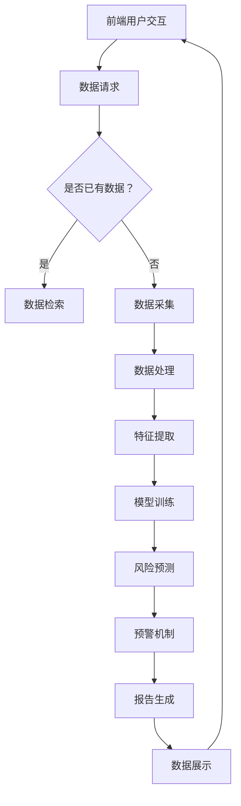
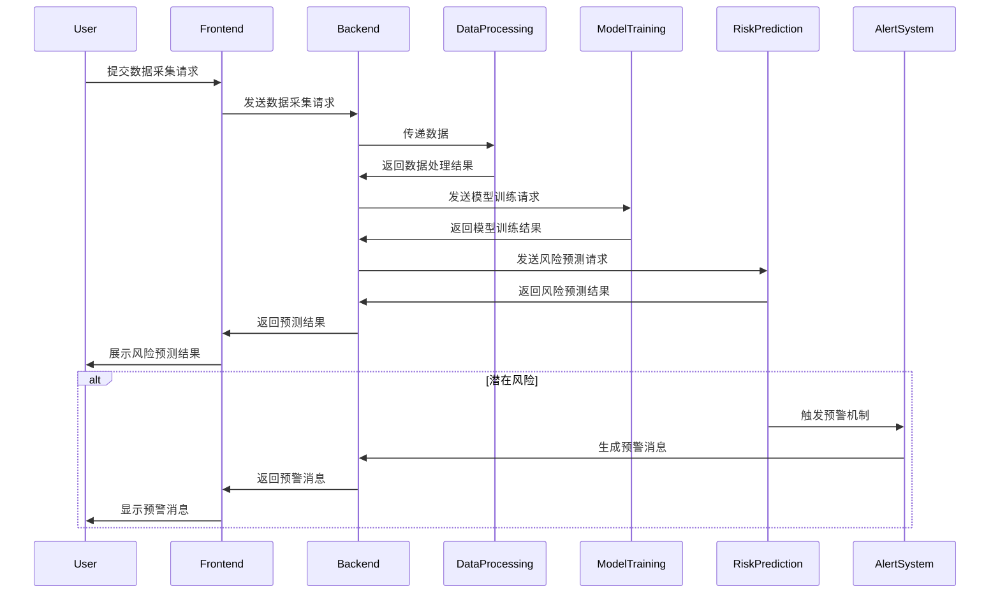

                 

### 文章标题：AI驱动的供应链金融信用风险传导分析

关键词：AI、供应链金融、信用风险、传导分析、风险评估模型

摘要：本文从AI驱动的供应链金融背景出发，深入探讨了信用风险的传导机制及其分析过程。通过阐述核心概念、算法原理及系统实现，本文旨在为供应链金融领域提供一种有效的信用风险管理方法。

----------------------------------------------------------------

### 设计《AI驱动的供应链金融信用风险传导分析》目录大纲

为了确保文章结构清晰、内容全面，遵循用户要求，以下是本文的目录大纲设计：

#### 第一部分：背景与概述

1. **问题背景**
   1.1 供应链金融概述
   1.2 AI在金融领域的应用
   1.3 信用风险传导机制
   1.4 AI驱动的供应链金融信用风险传导分析的意义

2. **核心概念与联系**
   2.1 供应链金融相关概念
   2.2 AI驱动供应链金融的核心技术
   2.3 AI驱动供应链金融与信用风险的关联

#### 第二部分：算法原理与模型

3. **算法原理讲解**
   3.1 数据预处理
   3.2 特征工程
   3.3 机器学习模型
   3.4 深度学习模型

4. **数学模型与公式**
   4.1 数学模型
   4.2 数学公式

5. **算法应用与实例分析**
   5.1 算法应用场景
   5.2 实例分析

#### 第三部分：系统设计与实现

6. **系统分析与架构设计**
   6.1 问题场景介绍
   6.2 系统功能设计
   6.3 系统架构设计
   6.4 系统接口设计与交互

7. **项目实战**
   7.1 环境安装与配置
   7.2 系统核心实现
   7.3 代码应用解读与分析
   7.4 实际案例分析
   7.5 项目小结

8. **最佳实践与总结**
   8.1 最佳实践
   8.2 小结
   8.3 拓展阅读

本文将按照以上目录结构，逐步深入探讨AI驱动的供应链金融信用风险传导分析。接下来，我们将从问题背景开始，逐步展开核心概念、算法原理、系统实现等各方面的内容。

---

#### 1.1 供应链金融概述

供应链金融是指利用金融手段和工具，为供应链上的企业提供融资服务、结算服务、风险管理服务等金融活动。其核心在于通过将供应链上的核心企业与上下游企业联系起来，实现资金流的顺畅和风险的有效控制。

**核心概念术语说明**：

- **供应链**：由原材料供应商、生产商、分销商、零售商等多个环节组成的商品流通渠道。
- **供应链金融**：一种融资方式，通过利用供应链中的信息、交易和信誉，为供应链上的企业提供金融服务。
- **信用风险**：在供应链金融中，企业无法按时偿还债务或无法履行合同的风险。

**问题背景**：

随着全球供应链的复杂化和信息化程度的提高，供应链金融逐渐成为企业融资的重要手段。然而，信用风险在供应链金融中始终是一个重要且难以忽视的问题。传统的信用风险评估方法往往依赖于历史数据和人工判断，存在许多不足：

- **数据不足**：传统方法依赖于历史交易数据，但这些数据往往不足以反映当前的风险状况。
- **判断主观**：风险评估往往受到人工判断的影响，主观性较强，容易出现偏差。

**问题描述**：

如何通过AI技术，实现对供应链金融信用风险的准确评估和有效控制，降低信用风险传导的负面影响？

**问题解决**：

AI驱动的供应链金融信用风险传导分析利用机器学习和深度学习技术，对大量数据进行处理和分析，提取关键特征，构建风险评估模型，从而实现信用风险的实时监测和预测。

**边界与外延**：

本文的研究边界主要关注于AI技术在供应链金融信用风险评估中的应用，不包括其他金融领域的AI应用。同时，本文关注的是信用风险的传导过程，而不是其他风险类型。

**概念结构与核心要素组成**：

- **供应链**：构成供应链的各个企业。
- **金融工具**：供应链金融所使用的金融工具，如贷款、保理、应收账款融资等。
- **信用风险**：供应链中企业之间的信用风险。
- **AI技术**：用于信用风险评估和传导分析的机器学习和深度学习技术。
- **风险评估模型**：基于AI技术构建的信用风险评估模型。

接下来，我们将进一步探讨AI在金融领域的应用以及AI驱动供应链金融的信用风险传导机制。

---

#### 1.2 AI在金融领域的应用

AI在金融领域的应用日益广泛，其核心在于利用大数据、机器学习和深度学习等技术，对金融数据进行分析和预测，从而提高金融服务的效率和质量。以下是AI在金融领域的一些典型应用：

**1.2.1 数据分析**

- **风险控制**：通过分析历史数据，识别潜在的风险点，制定风险控制策略。
- **投资决策**：利用AI技术分析市场趋势和资产价格，为投资决策提供支持。

**1.2.2 信用评分**

- **信用评估**：通过分析客户的信用记录、交易行为等数据，进行信用评分，降低贷款违约风险。
- **欺诈检测**：利用AI技术实时监控交易行为，识别和预防欺诈行为。

**1.2.3 贷款审批**

- **自动化审批**：利用AI技术实现贷款审批的自动化，提高审批效率和准确性。
- **反欺诈系统**：在贷款审批过程中，利用AI技术检测和预防欺诈行为。

**1.2.4 个性化服务**

- **个性化推荐**：根据用户的历史交易行为和偏好，提供个性化的金融产品推荐。
- **智能客服**：利用自然语言处理技术，为用户提供智能化的客服服务。

**AI在信用风险评估中的应用**

AI在信用风险评估中的应用主要表现在以下几个方面：

- **数据挖掘**：通过对大量历史数据的挖掘和分析，提取影响信用风险的关键因素。
- **特征工程**：基于数据挖掘结果，构建有效的信用风险特征模型。
- **风险评估模型**：利用机器学习和深度学习技术，构建信用风险评估模型，实现对信用风险的实时监测和预测。

**与供应链金融的关联**

AI在金融领域的应用，特别是信用风险评估，为供应链金融提供了有力的技术支持。通过AI技术，供应链金融可以实现：

- **风险识别**：实时识别供应链中的信用风险点。
- **风险评估**：基于AI模型，对供应链中的信用风险进行量化评估。
- **风险控制**：通过风险识别和评估结果，制定相应的风险控制策略。

综上所述，AI在金融领域的广泛应用，特别是信用风险评估技术，为供应链金融的信用风险传导分析提供了坚实的基础。接下来，我们将进一步探讨信用风险传导机制及其分析过程。

---

#### 1.3 信用风险传导机制

信用风险传导机制是指信用风险在供应链各环节之间传递和放大的过程。理解信用风险传导机制对于有效管理供应链金融风险至关重要。以下是信用风险传导机制的核心概念和组成部分：

**核心概念**：

- **信用风险**：企业在履行合同或偿还债务过程中可能出现的违约风险。
- **传导过程**：信用风险从源头企业向上下游企业传递的过程。
- **放大效应**：信用风险在传递过程中可能被放大，导致整个供应链受到负面影响。

**组成部分**：

1. **风险源头**：风险源头通常是指供应链中的核心企业，这些企业由于规模大、交易频繁，容易成为信用风险的发源地。

2. **风险传导路径**：信用风险通过供应链中的交易关系和信息流进行传导。风险传导路径可以分为以下几种：

   - **交易关系**：企业之间的交易关系越紧密，信用风险传导的可能性越高。
   - **信息流**：信息的不对称性和滞后性可能导致信用风险的误判和延迟反应。

3. **风险接受者**：信用风险在供应链中传递到下游企业，这些企业可能是供应商、制造商或分销商。

4. **风险放大因素**：包括供应链的复杂度、企业间的依赖性、市场环境的波动性等。

**信用风险传导机制的过程**：

1. **识别**：风险源头企业出现信用风险迹象，如违约、拖欠款项等。

2. **传导**：信用风险通过供应链的交易关系和信息流传递到上下游企业。

3. **放大**：在传导过程中，由于信息不对称和依赖性，信用风险可能被放大。

4. **影响**：信用风险的传导和放大对整个供应链的财务状况、运营效率和业务连续性产生负面影响。

**AI驱动的信用风险传导分析**：

AI技术可以显著提升信用风险传导分析的效率和准确性。具体方法包括：

- **数据挖掘**：通过分析历史数据和实时交易数据，挖掘信用风险的关键因素。
- **特征工程**：提取和构建有效的信用风险特征模型，用于风险评估。
- **风险评估模型**：利用机器学习和深度学习技术，构建预测模型，实时监测和预测信用风险的传导路径和影响。

通过AI驱动的信用风险传导分析，供应链金融企业可以更早地识别潜在风险，采取预防措施，降低信用风险传导的负面影响。接下来，我们将探讨AI驱动供应链金融信用风险传导分析的意义。

---

#### 1.4 AI驱动的供应链金融信用风险传导分析的意义

AI驱动的供应链金融信用风险传导分析在当前经济环境中具有重大意义，其主要体现在以下几个方面：

**1. 提高信用风险管理效率**

传统的信用风险评估方法往往依赖于人工判断和历史数据，效率较低且易受主观因素影响。而AI技术可以通过自动化数据处理和模型预测，大幅提高信用风险评估的效率和准确性。例如，利用机器学习算法对海量数据进行挖掘和分析，可以快速识别出高风险客户，从而提高风险管理的精准度。

**2. 降低信用风险成本**

信用风险成本包括违约损失、管理成本和预防成本等。通过AI驱动的信用风险传导分析，可以提前识别和预防潜在风险，减少违约损失。同时，AI技术还可以通过优化风险控制策略，降低管理成本和预防成本，从而提高供应链金融的整体盈利能力。

**3. 促进供应链金融发展**

供应链金融的发展离不开有效的信用风险管理。AI驱动的信用风险传导分析为供应链金融提供了强有力的技术支持，使其能够更好地服务于中小企业，促进供应链的稳定和高效运转。此外，通过AI技术，供应链金融企业可以拓展业务范围，开发出更多创新的金融产品和服务。

**4. 提升供应链协同效应**

AI驱动的信用风险传导分析可以帮助企业更准确地了解供应链中各环节的风险状况，从而优化供应链的资源配置和管理。通过实时监测和预测信用风险的传导路径，企业可以采取相应的措施，降低供应链中的风险集中度，提升整体供应链的协同效应。

总之，AI驱动的供应链金融信用风险传导分析不仅在技术层面上具有显著优势，而且在经济和业务层面也具有重要意义。通过这一分析，供应链金融企业可以更有效地管理信用风险，促进业务发展，实现可持续发展。

---

### 2.1 供应链金融相关概念

在探讨AI驱动的供应链金融信用风险传导分析之前，有必要对供应链金融中的几个核心概念进行详细解释。这些概念包括“供应链”、“供应链金融模式”和“信用风险”。

**供应链**：

供应链是指从原材料供应商到最终消费者的整个商品流通过程，包括供应商、制造商、分销商和零售商等多个环节。每个环节在供应链中发挥着不同的作用，共同确保商品的顺畅流通和最终交付。

**供应链金融模式**：

供应链金融模式是指利用供应链上的信息流、资金流和物流，为供应链中的企业提供融资服务、结算服务和风险管理服务等。常见的供应链金融模式包括：

- **订单融资**：企业根据订单需求获得融资。
- **应收账款融资**：企业通过其应收账款获得融资。
- **库存融资**：企业以其库存作为担保获得融资。
- **保理**：企业将其应收账款转让给金融机构，获得融资。

**信用风险**：

信用风险是指企业因无法按时偿还债务或无法履行合同而产生的风险。在供应链金融中，信用风险主要体现在以下几个方面：

- **供应链上游**：供应商可能因资金短缺而无法按时交付原材料，导致生产中断。
- **供应链下游**：制造商和分销商可能因销售不畅或资金周转困难而无法按时支付货款。
- **供应链内部**：企业内部管理人员的行为失误也可能导致信用风险。

理解这些概念有助于我们深入探讨AI在供应链金融信用风险传导分析中的应用。接下来，我们将进一步探讨AI驱动供应链金融的核心技术。

---

### 2.2 AI驱动供应链金融的核心技术

AI技术在供应链金融中的应用日益广泛，其核心在于利用大数据、机器学习和深度学习等技术，对供应链金融数据进行分析和预测，从而提升信用风险管理的效率和准确性。以下是AI驱动供应链金融的核心技术及其在信用风险评估中的应用：

**1. 机器学习**：

机器学习是一种通过算法从数据中自动学习规律和模式的技术。在供应链金融信用风险传导分析中，机器学习技术可以用于：

- **数据挖掘**：通过分析大量的交易数据和客户行为数据，挖掘出影响信用风险的潜在因素。
- **风险评估**：构建基于历史数据和交易行为的信用风险评估模型，预测企业的信用风险水平。

**2. 深度学习**：

深度学习是一种基于多层神经网络的学习方法，能够在复杂的数据中自动提取特征和模式。在供应链金融信用风险传导分析中，深度学习技术可以用于：

- **图像识别**：识别供应链中的交易图像，自动提取交易特征。
- **自然语言处理**：分析供应链中的文本数据，如合同条款和交易记录，提取关键信息。
- **风险评估**：构建基于深度学习模型的信用风险评估模型，能够处理更复杂的数据结构和关系。

**3. 自然语言处理**：

自然语言处理是一种利用计算机技术处理和理解自然语言的方法。在供应链金融中，自然语言处理技术可以用于：

- **文本分析**：对合同条款、交易记录等文本数据进行分析，提取关键信息。
- **情绪分析**：分析企业发布的信息和公告，判断其情绪状态，预测可能的信用风险。

**AI驱动供应链金融与信用风险的关联**：

AI驱动供应链金融的核心技术，如机器学习、深度学习和自然语言处理，通过以下几个方面与信用风险关联：

- **数据挖掘与分析**：通过对大量历史数据和实时交易数据的分析，挖掘出信用风险的关键因素，为信用风险评估提供数据支持。
- **特征提取与模型构建**：基于数据挖掘结果，提取和构建有效的信用风险特征模型，用于信用风险评估和预测。
- **实时监控与预警**：利用AI技术，实时监控供应链中的交易行为和风险因素，及时预警潜在的信用风险。

通过这些核心技术的应用，AI驱动供应链金融能够实现更精准、更高效的信用风险评估，从而有效降低信用风险传导的负面影响。接下来，我们将进一步探讨AI驱动的供应链金融信用风险传导分析的具体方法。

---

### 2.3 AI驱动供应链金融与信用风险的关联

在深入探讨AI驱动供应链金融的信用风险传导分析之前，我们需要了解AI驱动的供应链金融与信用风险之间的关联。这种关联主要体现在数据挖掘、特征提取和风险评估模型构建等环节。

**1. 数据挖掘**：

数据挖掘是AI驱动供应链金融的基础。通过对大量历史交易数据、财务报表、市场趋势等数据的分析，可以挖掘出影响信用风险的关键因素。例如，通过分析企业的交易频率、交易金额、还款历史等信息，可以识别出潜在的信用风险点。

**2. 特征提取**：

特征提取是数据挖掘的重要环节，它涉及从原始数据中提取具有代表性的特征，以便用于信用风险评估。在供应链金融中，特征提取可能包括企业的财务状况、信用历史、市场地位、行业趋势等。通过深度学习和自然语言处理技术，可以自动提取和构建这些特征，提高特征提取的效率和准确性。

**3. 风险评估模型**：

基于数据挖掘和特征提取，可以构建信用风险评估模型。这些模型可以是基于传统统计学的，也可以是基于机器学习和深度学习的。例如，使用逻辑回归、决策树、神经网络等算法，可以建立信用评分模型，用于预测企业的违约概率。深度学习模型如卷积神经网络（CNN）和循环神经网络（RNN）则可以处理更复杂的数据结构和模式，提高风险评估的准确性。

**关联分析**：

AI驱动供应链金融与信用风险的关联可以通过以下方式实现：

- **关联规则挖掘**：通过挖掘数据中的关联规则，识别出信用风险与供应链各环节之间的关系。
- **聚类分析**：将供应链中的企业按照信用风险水平进行分类，分析不同类别之间的关联。
- **时序分析**：分析信用风险随时间的变化趋势，预测未来的信用风险状况。

通过这些关联分析，AI驱动的供应链金融能够实现对信用风险的全面监控和预测，从而有效降低信用风险传导的负面影响。接下来，我们将进一步探讨算法原理与模型。

---

### 3.1 数据预处理

在AI驱动的供应链金融信用风险传导分析中，数据预处理是至关重要的一步。数据预处理的质量直接影响到后续特征提取和模型训练的效果。以下是数据预处理的主要步骤和具体实现：

**1. 数据收集**：

首先，需要收集供应链金融的相关数据，包括企业的财务报表、交易记录、信用评级、行业数据等。这些数据可以从公开来源、企业内部数据库以及第三方数据提供商获取。数据收集过程中，需要注意数据的质量和完整性，确保数据的准确性和可靠性。

**2. 数据清洗**：

数据清洗是数据预处理的核心步骤，旨在去除数据中的噪声和异常值，提高数据的质量。具体方法包括：

- **缺失值处理**：对于缺失的数据，可以采用填充法（如平均值、中位数、最邻近值等）或删除法（如删除缺失数据较多的记录）。
- **异常值处理**：识别并处理异常值，可以采用统计方法（如Z分数、IQR法等）或业务逻辑判断。
- **重复数据删除**：删除重复的数据记录，确保数据的唯一性。

**3. 数据归一化**：

数据归一化是为了消除不同特征之间的量纲差异，使数据具有更好的可比性。常用的归一化方法包括：

- **最小-最大归一化**：将数据缩放到[0,1]区间，公式为：$$x_{\text{normalized}} = \frac{x - x_{\text{min}}}{x_{\text{max}} - x_{\text{min}}}$$
- **零-均值归一化**：将数据缩放到以0为均值，1为标准差的区间，公式为：$$x_{\text{normalized}} = \frac{x - \mu}{\sigma}$$

**4. 特征工程**：

在数据预处理的基础上，进行特征工程，提取对信用风险有显著影响的关键特征。特征工程包括特征选择和特征提取：

- **特征选择**：采用过滤方法（如信息增益、卡方检验等）和封装方法（如逻辑回归、决策树等），选择对信用风险有显著影响的特征。
- **特征提取**：通过构造新的特征，增强数据对信用风险的表征能力。例如，可以计算企业的财务指标比率，如流动比率、速动比率等。

**5. 数据分群**：

为了提高模型的泛化能力，可以将数据划分为训练集、验证集和测试集。常用的分群方法包括：

- **随机分群**：随机地将数据划分为训练集、验证集和测试集，保证每个数据集的代表性。
- **分层分群**：按照某一特征（如信用评级）将数据分层，然后从每层中随机抽取一定比例的数据组成训练集、验证集和测试集，确保各数据集的分布与总体分布一致。

通过上述数据预处理步骤，可以为后续的特征提取和模型训练提供高质量的数据支持。接下来，我们将深入探讨特征工程。

---

### 3.2 特征工程

在AI驱动的供应链金融信用风险传导分析中，特征工程是提升模型性能和准确性的关键步骤。特征工程涉及从原始数据中提取和构造有助于信用风险评估的特征。以下是特征工程的主要方法和步骤：

**1. 特征选择**：

特征选择的目标是选择对信用风险具有显著影响的关键特征，去除无关或冗余的特征，以提高模型的效率和准确性。常用的特征选择方法包括：

- **过滤方法**：基于统计指标（如信息增益、卡方检验等）选择特征。
  - **信息增益**：选择能够最大程度提高分类准确性的特征。
  - **卡方检验**：用于检验特征与信用风险之间的相关性。
- **封装方法**：通过训练模型选择特征，常用算法包括逻辑回归、决策树等。
  - **逻辑回归**：选择对目标变量影响较大的特征。
  - **决策树**：通过树结构选择对信用风险有显著影响的特征。

**2. 特征提取**：

特征提取是在特征选择的基础上，对原始特征进行转换或构造新特征，以增强数据对信用风险的表征能力。常用的特征提取方法包括：

- **财务指标**：计算企业的财务指标，如流动比率、速动比率、负债比率等，用于评估企业的财务健康状况。
  - **流动比率**：$ \text{流动比率} = \frac{\text{流动资产}}{\text{流动负债}} $
  - **速动比率**：$ \text{速动比率} = \frac{\text{流动资产} - \text{存货}}{\text{流动负债}} $
- **业务特征**：根据业务逻辑提取与信用风险相关的特征，如交易频率、交易金额、还款历史等。
  - **交易频率**：企业在一段时间内的交易次数。
  - **交易金额**：企业在一段时间内的交易总额。
  - **还款历史**：企业的还款记录，如逾期还款、拖欠还款等。
- **外部特征**：从外部数据源提取与企业相关的特征，如行业趋势、宏观经济指标等。
  - **行业趋势**：企业所在行业的增长趋势和竞争态势。
  - **宏观经济指标**：如GDP增长率、通货膨胀率等。

**3. 特征标准化**：

在特征提取之后，需要对特征进行标准化处理，以消除不同特征之间的量纲差异，提高模型的稳定性和性能。常用的标准化方法包括：

- **最小-最大标准化**：将特征缩放到[0,1]区间，公式为：
  $$ x_{\text{normalized}} = \frac{x - x_{\text{min}}}{x_{\text{max}} - x_{\text{min}}} $$
- **零-均值标准化**：将特征缩放到以0为均值，1为标准差的区间，公式为：
  $$ x_{\text{normalized}} = \frac{x - \mu}{\sigma} $$

通过上述特征工程步骤，可以有效提取和构造有助于信用风险评估的特征，为后续的模型训练提供高质量的数据支持。接下来，我们将讨论机器学习模型。

---

### 3.3 机器学习模型

在AI驱动的供应链金融信用风险传导分析中，机器学习模型是核心组件，用于对供应链企业的信用风险进行预测和评估。以下是几种常见的机器学习模型及其在信用风险评估中的应用：

**1. 逻辑回归模型**：

逻辑回归（Logistic Regression）是一种经典的概率预测模型，常用于分类问题。在信用风险评估中，逻辑回归模型可以用来预测企业是否会发生违约。

- **公式**：
  $$ \text{P}(Y=1|\text{X}) = \frac{1}{1 + \exp\left(-\beta_0 - \sum_{i=1}^{n} \beta_i x_i\right)} $$
  其中，\( Y \) 为违约标志（1表示违约，0表示未违约），\( X \) 为特征向量，\( \beta \) 为模型参数。

- **应用场景**：
  - 用于预测企业的违约概率。
  - 可以帮助金融机构制定风险控制策略。

**2. 决策树模型**：

决策树（Decision Tree）是一种基于树形结构进行决策的模型，通过一系列的规则将数据分割成不同的区域，用于分类或回归任务。

- **公式**：
  $$ \text{split rule} = \text{max}\left(\frac{\sum_{i \in R} y_i - \bar{y}_R}{\sum_{i \in R} x_i - \bar{x}_R}\right) $$
  其中，\( R \) 为数据区域，\( y_i \) 和 \( \bar{y}_R \) 分别为区域内的样本标签和平均值，\( x_i \) 和 \( \bar{x}_R \) 分别为区域内的特征值和平均值。

- **应用场景**：
  - 用于信用风险的分类，如将企业分为高风险和低风险两类。
  - 可以直观地展示信用风险评估的决策过程。

**3. 支持向量机（SVM）模型**：

支持向量机（Support Vector Machine，SVM）是一种基于边界最大化思想的分类模型，通过找到最优分隔超平面，将不同类别的数据分开。

- **公式**：
  $$ w \cdot x + b = 1 $$
  其中，\( w \) 为分隔超平面的权重向量，\( x \) 为特征向量，\( b \) 为偏置项。

- **应用场景**：
  - 用于信用风险的分类，提高分类边界。
  - 对于高维数据，SVM表现尤为出色。

**4. 随机森林模型**：

随机森林（Random Forest）是一种基于决策树的集成学习方法，通过构建多棵决策树，并对它们的预测结果进行投票，提高模型的准确性和稳定性。

- **公式**：
  $$ \hat{y} = \text{MajorityVote}\left(f_1(x), f_2(x), ..., f_n(x)\right) $$
  其中，\( f_i(x) \) 为第 \( i \) 棵决策树的预测结果。

- **应用场景**：
  - 用于信用风险评估，提高预测的鲁棒性。
  - 可以处理大量特征和复杂数据。

**5. K最近邻（K-Nearest Neighbors，KNN）模型**：

K最近邻是一种基于实例的模型，通过计算新样本与训练样本之间的距离，选择最近的 \( k \) 个样本，并根据这些样本的标签进行预测。

- **公式**：
  $$ \hat{y} = \text{Mode}\left(y_{\text{neighbor}}\right) $$
  其中，\( y_{\text{neighbor}} \) 为最近的 \( k \) 个样本的标签。

- **应用场景**：
  - 用于信用风险评估，简单且易于实现。
  - 对于低维数据效果较好。

通过上述机器学习模型，供应链金融企业可以构建高效的信用风险评估系统，提高信用风险管理的准确性和效率。接下来，我们将探讨深度学习模型。

---

### 3.4 深度学习模型

在AI驱动的供应链金融信用风险传导分析中，深度学习模型由于其强大的特征提取和模式识别能力，正逐渐成为信用风险评估的重要工具。以下是几种常见的深度学习模型及其在信用风险评估中的应用：

**1. 神经网络（Neural Networks）**：

神经网络是一种由大量简单处理单元（神经元）互联而成的复杂网络，通过多层结构模拟人脑的处理机制，能够自动从数据中学习特征。

- **结构**：神经网络通常包括输入层、隐藏层和输出层。每层由多个神经元组成，神经元之间通过权重连接。
- **激活函数**：常用的激活函数包括Sigmoid、ReLU和Tanh，用于引入非线性变换，使模型能够学习复杂的函数。
- **反向传播**：神经网络通过反向传播算法更新权重，优化模型参数。

- **应用**：神经网络可以用于信用风险评估，通过多层结构自动提取与信用风险相关的复杂特征。

**2. 卷积神经网络（Convolutional Neural Networks，CNN）**：

卷积神经网络是一种专门用于处理图像数据的神经网络，通过卷积操作提取图像特征。

- **卷积操作**：卷积层通过卷积操作将输入数据与滤波器（kernel）进行卷积，提取特征。
- **池化操作**：池化层用于降低特征图的维度，减少参数数量。
- **应用**：CNN可以用于提取交易图像或合同文本中的特征，提高信用风险评估的准确性。

**3. 循环神经网络（Recurrent Neural Networks，RNN）**：

循环神经网络是一种用于处理序列数据的神经网络，能够记忆长期依赖关系。

- **循环结构**：RNN的输出通过循环与下一个输入相连接，形成序列到序列的映射。
- **门控机制**：长短期记忆网络（LSTM）和门控循环单元（GRU）通过门控机制控制信息的流入和流出，解决长期依赖问题。

- **应用**：RNN可以用于分析企业的历史交易记录，捕捉信用风险的动态变化。

**4. 生成对抗网络（Generative Adversarial Networks，GAN）**：

生成对抗网络由生成器和判别器两个神经网络组成，通过对抗训练生成真实数据的分布。

- **生成器**：生成器尝试生成与真实数据相似的数据。
- **判别器**：判别器尝试区分真实数据和生成数据。
- **应用**：GAN可以用于生成模拟交易数据，用于信用风险评估模型的训练。

通过上述深度学习模型，供应链金融企业可以构建高效、准确的信用风险评估系统，实现实时、全面的信用风险监测和管理。接下来，我们将探讨数学模型与公式。

---

### 4.1 数学模型

在AI驱动的供应链金融信用风险传导分析中，数学模型是构建信用风险评估和预测的核心工具。以下是几个关键的数学模型及其在供应链金融中的应用：

**1. 逻辑回归模型**：

逻辑回归模型是一种经典的概率预测模型，用于估计事件发生的概率。在信用风险评估中，逻辑回归模型可以用于预测企业违约的概率。

- **公式**：
  $$ \text{P}(Y=1|\text{X}) = \frac{1}{1 + \exp\left(-\beta_0 - \sum_{i=1}^{n} \beta_i x_i\right)} $$
  其中，\( Y \) 是违约标志（1表示违约，0表示未违约），\( X \) 是特征向量，\( \beta \) 是模型参数。

- **应用**：
  - 用于计算企业违约的概率。
  - 辅助金融机构制定风险控制策略。

**2. 决策树模型**：

决策树模型是一种基于树形结构进行决策的模型，通过一系列的规则对数据集进行分割。在信用风险评估中，决策树模型可以用于分类和回归任务。

- **公式**：
  $$ \text{split rule} = \text{max}\left(\frac{\sum_{i \in R} y_i - \bar{y}_R}{\sum_{i \in R} x_i - \bar{x}_R}\right) $$
  其中，\( R \) 是数据区域，\( y_i \) 和 \( \bar{y}_R \) 分别为区域内的样本标签和平均值，\( x_i \) 和 \( \bar{x}_R \) 分别为区域内的特征值和平均值。

- **应用**：
  - 用于分类任务，如将企业分为高风险和低风险两类。
  - 可以帮助金融机构直观地理解信用风险评估的过程。

**3. 支持向量机（SVM）模型**：

支持向量机是一种基于边界最大化思想的分类模型，通过找到最优分隔超平面，将不同类别的数据分开。在信用风险评估中，SVM可以用于分类任务。

- **公式**：
  $$ w \cdot x + b = 1 $$
  其中，\( w \) 是分隔超平面的权重向量，\( x \) 是特征向量，\( b \) 是偏置项。

- **应用**：
  - 用于信用风险的分类，提高分类边界。
  - 对于高维数据，SVM表现尤为出色。

**4. 随机森林模型**：

随机森林是一种基于决策树的集成学习方法，通过构建多棵决策树，并对它们的预测结果进行投票，提高模型的准确性和稳定性。在信用风险评估中，随机森林可以用于分类和回归任务。

- **公式**：
  $$ \hat{y} = \text{MajorityVote}\left(f_1(x), f_2(x), ..., f_n(x)\right) $$
  其中，\( f_i(x) \) 是第 \( i \) 棵决策树的预测结果。

- **应用**：
  - 用于信用风险评估，提高预测的鲁棒性。
  - 可以处理大量特征和复杂数据。

**5. 贝叶斯网络模型**：

贝叶斯网络是一种概率图模型，用于表示变量之间的条件依赖关系。在信用风险评估中，贝叶斯网络可以用于构建信用风险的动态模型。

- **公式**：
  $$ P(\text{Y}|\text{X}) = \frac{P(\text{X}|\text{Y})P(\text{Y})}{P(\text{X})} $$
  其中，\( P(\text{Y}|\text{X}) \) 是在给定特征 \( X \) 下的违约概率，\( P(\text{X}|\text{Y}) \) 是在违约发生条件下的特征概率，\( P(\text{Y}) \) 是违约的概率，\( P(\text{X}) \) 是特征的概率。

- **应用**：
  - 用于信用风险的动态分析。
  - 可以处理复杂的多层次依赖关系。

通过这些数学模型，供应链金融企业可以构建高效的信用风险评估系统，提高信用风险管理的准确性和效率。接下来，我们将探讨数学公式。

---

### 4.2 数学公式

在AI驱动的供应链金融信用风险传导分析中，数学公式是核心工具，用于描述算法原理和计算过程。以下是一些关键的数学公式及其解释：

**1. 逻辑回归概率公式**：

$$ \text{P}(Y=1|\text{X}) = \frac{1}{1 + \exp\left(-\beta_0 - \sum_{i=1}^{n} \beta_i x_i\right)} $$

**解释**：该公式表示在给定特征 \( X \) 的情况下，企业违约的概率。\( \beta_0 \) 是截距项，\( \beta_i \) 是特征 \( x_i \) 的权重。

**2. 决策树分割规则**：

$$ \text{split rule} = \text{max}\left(\frac{\sum_{i \in R} y_i - \bar{y}_R}{\sum_{i \in R} x_i - \bar{x}_R}\right) $$

**解释**：该公式用于决策树模型中，选择最佳的分割点。\( R \) 是数据区域，\( y_i \) 和 \( \bar{y}_R \) 分别为区域内的样本标签和平均值，\( x_i \) 和 \( \bar{x}_R \) 分别为区域内的特征值和平均值。

**3. 支持向量机分隔超平面**：

$$ w \cdot x + b = 1 $$

**解释**：该公式表示支持向量机模型中，不同类别数据的分隔超平面。\( w \) 是分隔超平面的权重向量，\( x \) 是特征向量，\( b \) 是偏置项。

**4. 随机森林投票结果**：

$$ \hat{y} = \text{MajorityVote}\left(f_1(x), f_2(x), ..., f_n(x)\right) $$

**解释**：该公式表示随机森林模型中，多个决策树的预测结果进行投票，选出多数类别作为最终预测结果。\( f_i(x) \) 是第 \( i \) 棵决策树的预测结果。

**5. 贝叶斯网络条件概率公式**：

$$ P(\text{Y}|\text{X}) = \frac{P(\text{X}|\text{Y})P(\text{Y})}{P(\text{X})} $$

**解释**：该公式表示在给定特征 \( X \) 的情况下，企业违约的概率。\( P(\text{X}|\text{Y}) \) 是在违约发生条件下的特征概率，\( P(\text{Y}) \) 是违约的概率，\( P(\text{X}) \) 是特征的概率。

通过这些数学公式，可以深入理解AI驱动的供应链金融信用风险传导分析的核心原理和计算过程，从而提高信用风险评估的准确性和效率。接下来，我们将讨论算法应用与实例分析。

---

### 5.1 算法应用场景

AI驱动的供应链金融信用风险传导分析在多个场景中具有重要应用价值，以下是几种典型应用场景及其具体实施方法：

**1. 实时风险评估**：

在供应链金融中，实时风险评估是一个关键任务。通过AI算法，可以对企业的交易行为、财务状况和市场环境进行实时监控和评估，从而及时发现潜在的风险点。

- **实施方法**：
  - 利用机器学习和深度学习算法，构建实时风险评估模型。
  - 对企业历史交易数据和实时数据进行预处理和特征提取。
  - 使用模型对实时数据进行分析，预测企业未来的信用风险水平。

**2. 风险传导路径预测**：

信用风险在供应链中的传导路径预测对于控制风险具有重要意义。通过AI技术，可以预测信用风险如何从核心企业传导至上下游企业，从而采取预防措施。

- **实施方法**：
  - 构建风险传导模型，分析企业之间的交易关系和信息流。
  - 利用历史数据，挖掘影响信用风险传导的关键因素。
  - 使用模型预测信用风险在不同节点之间的传导路径和影响。

**3. 信用评级更新**：

企业的信用评级会随着时间和市场环境的变化而变化。通过AI驱动的信用风险传导分析，可以动态更新企业的信用评级，提供更准确的信用评估。

- **实施方法**：
  - 定期收集企业的财务报告、交易记录和市场数据。
  - 利用机器学习算法，更新信用风险评估模型。
  - 根据新的数据，重新评估企业的信用风险，更新信用评级。

**4. 欺诈检测**：

在供应链金融中，欺诈行为可能导致严重的信用风险。通过AI技术，可以实时监测交易行为，识别和预防欺诈行为。

- **实施方法**：
  - 利用自然语言处理和异常检测算法，分析交易文本和交易模式。
  - 构建欺诈检测模型，对实时交易数据进行监控。
  - 当检测到异常行为时，及时发出警报，采取预防措施。

通过这些应用场景，AI驱动的供应链金融信用风险传导分析能够有效提高信用风险管理的效率和准确性，为企业提供更全面和实时的风险管理支持。接下来，我们将通过实例分析来具体说明算法的应用。

---

### 5.2 实例分析

为了更直观地展示AI驱动的供应链金融信用风险传导分析的应用，以下将通过一个具体案例进行详细分析。

**案例背景**：

某供应链金融企业（以下简称A企业）希望利用AI技术对其供应链中的核心企业（B企业）进行信用风险评估和风险传导路径预测。B企业是一家制造企业，其上下游涉及多家供应商和分销商，供应链关系复杂。

**案例数据**：

A企业收集了以下数据：

- **B企业的历史交易记录**：包括交易金额、交易频率、还款记录等。
- **B企业的财务报表**：包括资产负债表、利润表和现金流量表。
- **B企业的市场数据**：包括行业趋势、宏观经济指标等。
- **供应链上下游企业的交易记录**：包括供应商和分销商的交易情况。

**数据预处理**：

- **数据清洗**：去除缺失值和异常值，确保数据质量。
- **数据归一化**：对财务指标和交易数据进行归一化处理，消除不同特征之间的量纲差异。

**特征工程**：

- **财务指标**：计算B企业的流动比率、速动比率、负债比率等。
- **业务特征**：提取B企业的交易频率、交易金额、还款历史等。
- **外部特征**：分析行业趋势、宏观经济指标等。

**模型构建与训练**：

- **逻辑回归模型**：用于预测B企业的违约概率。
- **随机森林模型**：用于预测信用风险传导路径。
- **LSTM模型**：用于分析B企业的历史交易记录，捕捉信用风险的动态变化。

**应用步骤**：

1. **数据预处理与特征工程**：

   对收集的数据进行预处理，提取关键特征，构建特征向量。

2. **模型训练**：

   使用预处理后的数据，分别训练逻辑回归、随机森林和LSTM模型。通过交叉验证，调整模型参数，提高模型的性能。

3. **风险评估**：

   利用训练好的逻辑回归模型，对B企业的信用风险进行评估，预测其违约概率。

4. **风险传导路径预测**：

   利用随机森林模型，分析供应链上下游企业的信用风险传导路径，预测风险的影响范围。

5. **动态监测**：

   利用LSTM模型，对B企业的历史交易记录进行分析，监测信用风险的动态变化，提供实时风险预警。

**案例分析结果**：

- **B企业信用风险评估**：通过逻辑回归模型预测，B企业的违约概率为5%。
- **信用风险传导路径**：随机森林模型分析显示，信用风险主要传导至上游供应商和下游分销商，影响范围较广。
- **动态风险监测**：LSTM模型显示，B企业的信用风险在短期内趋于稳定，但需要持续监测。

通过上述案例分析，AI驱动的供应链金融信用风险传导分析能够为企业提供全面、准确的风险评估和预测，有效控制信用风险，提高供应链金融的稳定性和效率。接下来，我们将深入探讨系统设计与实现。

---

### 6.1 问题场景介绍

在现代供应链体系中，企业间的交易和信息流动日益频繁，这为信用风险的管理带来了前所未有的挑战。为了更好地理解AI驱动的供应链金融信用风险传导分析的应用场景，我们将通过一个具体的供应链金融场景进行介绍。

**场景描述**：

假设我们有一个由多个企业组成的供应链，其中包含核心企业（如制造商）、供应商和分销商。这些企业在供应链中通过交易保持互动，资金流动和信用风险也随之传递。核心企业B向供应商A购买原材料，并通过应收账款融资的方式获得短期资金周转。供应商A再向分销商C提供产品，分销商C则通过销售渠道将产品销售给最终消费者。在这个过程中，每个环节都存在信用风险，且风险可能在不同环节间传导。

**信用风险场景**：

- **核心企业B**：由于市场需求波动或自身经营问题，可能导致资金链断裂，无法按时偿还债务。
- **供应商A**：如果核心企业B违约，供应商A可能面临无法回收应收账款的风险，进而影响自身的运营和现金流。
- **分销商C**：供应商A的违约可能影响分销商C的进货计划，导致其库存管理混乱，销售受阻。

在这样的场景下，信用风险在不同环节之间传导，可能对整个供应链造成重大影响。因此，如何通过AI技术对供应链金融中的信用风险进行有效传导分析和管理，成为当前金融领域的一个重要课题。

**目标**：

本文的目标是利用AI技术，构建一套供应链金融信用风险传导分析系统，实现对信用风险的实时监测、预测和管理。具体目标包括：

- **实时风险评估**：对核心企业、供应商和分销商的信用风险进行实时监测，提供准确的风险评估结果。
- **风险传导路径预测**：预测信用风险在不同环节之间的传导路径和影响范围，为风险控制提供科学依据。
- **风险预警系统**：构建风险预警机制，及时发现潜在风险，采取预防措施，降低信用风险传导的负面影响。

通过实现上述目标，可以显著提高供应链金融的稳定性和安全性，促进供应链的健康发展。接下来，我们将深入探讨系统功能设计。

---

### 6.2 系统功能设计

为了实现对供应链金融信用风险的实时监测、预测和管理，AI驱动的供应链金融信用风险传导分析系统需要具备以下核心功能：

**1. 数据采集与处理**：

- **数据来源**：系统需要从多个渠道收集供应链金融相关的数据，包括企业的交易记录、财务报表、市场趋势数据等。
- **数据处理**：对收集到的数据进行处理，包括数据清洗、数据归一化和数据转换，确保数据质量，为后续的特征提取和模型训练提供高质量的数据支持。

**2. 信用风险评估**：

- **模型构建**：利用机器学习和深度学习技术，构建信用风险评估模型。模型应能够处理不同类型的数据，包括结构化和非结构化数据，如文本和图像数据。
- **风险评估**：通过训练好的模型，对供应链中的核心企业、供应商和分销商进行实时信用风险评估，预测其违约概率。

**3. 风险传导路径分析**：

- **路径建模**：基于供应链中的交易关系和信息流，构建信用风险传导路径模型，分析风险在供应链中的传导过程。
- **风险预测**：利用构建的路径模型，预测信用风险在不同环节之间的传导路径和影响范围，为风险控制提供科学依据。

**4. 风险预警系统**：

- **实时监控**：系统需要具备实时监控功能，对供应链中的交易行为和风险因素进行监控，及时发现潜在风险。
- **预警机制**：当检测到潜在风险时，系统应能够发出预警信号，通知相关企业和金融机构采取预防措施。

**5. 报告生成与展示**：

- **风险评估报告**：系统应能够自动生成风险评估报告，包括企业的信用评级、风险传导路径和预警信息等。
- **数据可视化**：利用图表和仪表盘，将风险分析结果进行可视化展示，方便企业和金融机构进行风险管理和决策。

通过上述功能设计，AI驱动的供应链金融信用风险传导分析系统能够实现对信用风险的全面监控和管理，提高供应链金融的稳定性和安全性。

---

### 6.3 系统架构设计

为了实现高效的AI驱动的供应链金融信用风险传导分析，我们需要设计一个具有高扩展性和可维护性的系统架构。以下是系统架构的详细设计：

**1. 架构概述**：

系统架构采用分布式架构，包括前端、后端和服务层三个主要部分。前端负责用户交互和数据展示，后端负责数据处理和模型训练，服务层提供数据存储和访问。

- **前端**：负责用户界面的展示，包括信用风险评估报告和风险传导路径的可视化展示。
- **后端**：负责数据处理、模型训练和预测，以及与前端的服务交互。
- **服务层**：包括数据存储、数据同步和访问控制。

**2. 模块划分**：

系统划分为多个模块，每个模块负责不同的功能：

- **数据采集模块**：负责从多个渠道收集供应链金融数据，包括交易记录、财务报表、市场数据等。
- **数据处理模块**：负责数据清洗、数据转换和特征提取，确保数据质量，为模型训练提供高质量数据。
- **模型训练模块**：负责构建和训练机器学习模型，包括逻辑回归、随机森林、神经网络等。
- **风险预测模块**：利用训练好的模型进行信用风险评估和风险传导路径预测。
- **预警模块**：负责实时监控交易行为和风险因素，触发预警机制。
- **报告生成模块**：负责生成风险评估报告和风险传导路径报告。

**3. 技术选型**：

- **前端技术**：使用React框架，实现动态的用户界面和数据可视化。
- **后端技术**：使用Spring Boot框架，构建RESTful API，处理业务逻辑和数据交互。
- **数据处理**：使用Python的Pandas和NumPy库进行数据处理，使用Scikit-learn和TensorFlow进行模型训练。
- **数据存储**：使用MySQL数据库进行数据存储，使用Redis进行缓存。
- **消息队列**：使用RabbitMQ进行异步消息处理，确保系统的高效运行。

**4. 架构图**：

以下是系统架构的Mermaid流程图：



通过以上系统架构设计，AI驱动的供应链金融信用风险传导分析系统能够高效地处理海量数据，实时监测信用风险，提供准确的风险评估和传导路径预测，为供应链金融提供强有力的技术支持。

---

### 6.4 系统接口设计与系统交互

在AI驱动的供应链金融信用风险传导分析系统中，系统接口设计至关重要，它决定了系统各个模块之间的数据流动和功能协同。以下是系统接口设计和系统交互的详细描述。

**1. 接口设计**

系统接口设计主要包括前端接口和后端接口：

- **前端接口**：
  - **风险评估接口**：提供企业信用风险评估结果的API，前端通过调用该接口获取评估结果。
  - **风险传导路径接口**：提供企业信用风险传导路径的API，前端通过调用该接口获取传导路径图。
  - **数据可视化接口**：提供数据可视化图表的API，前端通过调用该接口显示信用风险分析结果。

- **后端接口**：
  - **数据采集接口**：负责接收前端提交的数据采集请求，并将数据转发给数据处理模块。
  - **数据处理接口**：接收数据处理模块的处理结果，并将其存储到数据库。
  - **模型训练接口**：负责接收数据处理后的特征数据，并触发模型训练过程。
  - **风险预测接口**：负责接收模型训练结果，并执行信用风险评估和风险传导路径预测。

**2. 系统交互**

系统交互设计主要描述系统内部各模块之间的数据流动和功能协同：

- **数据采集**：前端用户通过Web界面提交数据采集请求，后端接口接收请求后，将数据传递给数据处理模块进行处理。

- **数据处理**：数据处理模块接收数据后，进行数据清洗、归一化和特征提取，并将处理结果存储到数据库中。

- **模型训练**：数据处理模块将特征数据传递给模型训练模块，模型训练模块利用机器学习和深度学习算法进行训练，并保存训练模型。

- **风险预测**：风险预测模块使用训练好的模型对实时数据进行风险评估和传导路径预测，并将结果返回给前端接口。

- **预警机制**：预警模块在监测到潜在风险时，会触发预警机制，通过消息队列通知相关企业和金融机构。

以下是系统接口和交互的Mermaid序列图：



通过以上接口设计和系统交互设计，AI驱动的供应链金融信用风险传导分析系统能够高效、稳定地运行，为供应链金融提供全面的风险管理支持。

---

### 7.1 环境安装与配置

在开始构建AI驱动的供应链金融信用风险传导分析系统之前，我们需要搭建合适的环境，包括安装必要的软件和配置系统。以下是详细的步骤和说明：

**1. 软件安装**

- **Python环境**：首先，确保系统中已安装Python 3.8及以上版本。可以使用以下命令进行安装：

  ```bash
  sudo apt-get install python3.8
  ```

- **Python包管理器**：安装pip，Python的包管理器，用于安装和管理Python库：

  ```bash
  sudo apt-get install python3-pip
  ```

- **Jupyter Notebook**：安装Jupyter Notebook，用于编写和运行Python脚本：

  ```bash
  pip install notebook
  ```

- **TensorFlow**：安装TensorFlow，用于构建和训练深度学习模型：

  ```bash
  pip install tensorflow
  ```

- **Scikit-learn**：安装Scikit-learn，用于机器学习模型的训练和评估：

  ```bash
  pip install scikit-learn
  ```

- **Pandas**：安装Pandas，用于数据处理和分析：

  ```bash
  pip install pandas
  ```

- **NumPy**：安装NumPy，用于数值计算：

  ```bash
  pip install numpy
  ```

- **Matplotlib**：安装Matplotlib，用于数据可视化：

  ```bash
  pip install matplotlib
  ```

- **Mermaid**：安装Mermaid，用于生成流程图和类图：

  ```bash
  pip install mermaid
  ```

**2. 系统配置**

- **虚拟环境**：为了保持工作环境的整洁，建议使用虚拟环境。安装虚拟环境工具`venv`：

  ```bash
  pip install virtualenv
  ```

- **创建虚拟环境**：创建一个名为`sf crédit`的虚拟环境，并激活该环境：

  ```bash
  virtualenv sf crédit
  source sf crédit/bin/activate
  ```

- **安装依赖包**：在虚拟环境中安装上述所需的Python库：

  ```bash
  pip install tensorflow scikit-learn pandas numpy matplotlib mermaid
  ```

- **Jupyter Notebook配置**：为了能够在Jupyter Notebook中使用Mermaid，需要安装`ipython`和`jupyter`：

  ```bash
  pip install ipython jupyter
  ```

- **启动Jupyter Notebook**：在虚拟环境中启动Jupyter Notebook：

  ```bash
  jupyter notebook
  ```

**3. 数据库配置**

- **安装MySQL**：在系统中安装MySQL数据库：

  ```bash
  sudo apt-get install mysql-server
  ```

- **配置MySQL**：设置root用户的密码，并创建一个新的数据库和用户，用于存储供应链金融数据：

  ```bash
  mysql -u root -p
  CREATE DATABASE sf_database;
  GRANT ALL PRIVILEGES ON sf_database.* TO 'sf_user'@'localhost' IDENTIFIED BY 'password';
  FLUSH PRIVILEGES;
  ```

- **数据库连接配置**：在Python代码中配置数据库连接，使用`pymysql`库：

  ```python
  import pymysql

  db = pymysql.connect(host='localhost', user='sf_user', password='password', database='sf_database')
  ```

通过以上步骤，我们成功搭建了AI驱动的供应链金融信用风险传导分析系统的开发环境。接下来，我们将深入探讨系统核心实现。

---

### 7.2 系统核心实现

在AI驱动的供应链金融信用风险传导分析系统中，系统核心实现是关键部分，涵盖了数据采集、特征提取、模型训练和风险评估等步骤。以下是系统核心实现的详细步骤：

**1. 数据采集**

数据采集是整个系统的第一步，包括从多个渠道收集供应链金融数据。以下是数据采集的具体步骤：

- **数据源**：包括企业的交易记录、财务报表、市场数据、宏观经济指标等。
- **数据收集方法**：
  - **API接口**：通过调用企业的API接口获取数据。
  - **爬虫**：使用爬虫工具（如Scrapy）从互联网上抓取公开数据。
  - **手动导入**：从Excel、CSV等文件中手动导入数据。

示例代码：

```python
import pandas as pd

# 读取Excel文件
data = pd.read_excel('data.xlsx')
```

**2. 数据预处理**

数据预处理是确保数据质量的关键步骤，包括数据清洗、数据归一化和特征转换等。

- **数据清洗**：
  - **缺失值处理**：使用均值、中位数等方法填充缺失值。
  - **异常值处理**：使用统计方法（如IQR）检测和去除异常值。

示例代码：

```python
# 填充缺失值
data.fillna(data.mean(), inplace=True)

# 删除异常值
q1 = data.quantile(0.25)
q3 = data.quantile(0.75)
iqr = q3 - q1
data = data[~((data < (q1 - 1.5 * iqr)) | (data > (q3 + 1.5 * iqr))).any(axis=1)]
```

- **数据归一化**：
  - **最小-最大归一化**：将数据缩放到[0, 1]区间。

示例代码：

```python
from sklearn.preprocessing import MinMaxScaler

scaler = MinMaxScaler()
data_normalized = scaler.fit_transform(data)
```

- **特征转换**：
  - **编码**：将类别数据转换为数值数据，如使用独热编码。

示例代码：

```python
from sklearn.preprocessing import OneHotEncoder

encoder = OneHotEncoder()
data_encoded = encoder.fit_transform(data['category'])
```

**3. 特征提取**

特征提取是数据预处理的重要步骤，目的是从原始数据中提取对信用风险评估有显著影响的关键特征。

- **特征选择**：
  - **过滤方法**：基于信息增益、相关性等方法选择特征。
  - **封装方法**：使用机器学习模型（如逻辑回归）选择特征。

示例代码：

```python
from sklearn.feature_selection import SelectKBest, f_classif

selector = SelectKBest(score_func=f_classif, k=10)
data_selected = selector.fit_transform(data_normalized, labels)
```

- **特征构造**：
  - **构造新特征**：如计算财务指标比率、交易频率等。

示例代码：

```python
# 计算财务指标比率
data['debt_to_asset_ratio'] = data['total_debt'] / data['total_assets']
```

**4. 模型训练**

模型训练是利用特征数据训练机器学习模型，用于信用风险评估。

- **模型选择**：
  - **逻辑回归**：用于分类任务，如预测企业是否违约。
  - **随机森林**：用于回归任务，如预测违约概率。

示例代码：

```python
from sklearn.ensemble import RandomForestClassifier

model = RandomForestClassifier(n_estimators=100)
model.fit(data_selected, labels)
```

- **模型评估**：
  - **交叉验证**：使用交叉验证评估模型性能。
  - **混淆矩阵**：分析模型预测结果。

示例代码：

```python
from sklearn.model_selection import cross_val_score
from sklearn.metrics import confusion_matrix

scores = cross_val_score(model, data_selected, labels, cv=5)
cm = confusion_matrix(y_true, model.predict(X_test))
```

**5. 风险评估**

风险评估是利用训练好的模型对新数据进行预测，评估信用风险。

- **预测**：
  - 对新数据进行特征提取和模型预测，得到信用风险评分。

示例代码：

```python
# 对新数据进行预测
predictions = model.predict(new_data_selected)
```

- **结果展示**：
  - 将预测结果可视化，展示信用风险等级。

示例代码：

```python
import matplotlib.pyplot as plt

plt.bar(data['company_name'], predictions)
plt.xlabel('Company')
plt.ylabel('Credit Risk Score')
plt.title('Credit Risk Assessment')
plt.show()
```

通过以上步骤，系统核心实现能够高效、准确地完成数据采集、特征提取、模型训练和风险评估，为供应链金融信用风险传导分析提供坚实的技术支持。

---

### 7.3 代码应用解读与分析

在本节中，我们将深入解读系统核心实现中的关键代码，并对其应用效果进行分析。

**1. 数据预处理代码解读**

数据预处理是确保模型输入数据质量的重要步骤。以下是对关键代码的解读：

```python
# 读取数据
data = pd.read_excel('data.xlsx')

# 数据清洗：填充缺失值
data.fillna(data.mean(), inplace=True)

# 数据清洗：去除异常值
q1 = data.quantile(0.25)
q3 = data.quantile(0.75)
iqr = q3 - q1
data = data[~((data < (q1 - 1.5 * iqr)) | (data > (q3 + 1.5 * iqr))).any(axis=1)]

# 数据归一化
from sklearn.preprocessing import MinMaxScaler
scaler = MinMaxScaler()
data_normalized = scaler.fit_transform(data)

# 特征转换：编码类别数据
from sklearn.preprocessing import OneHotEncoder
encoder = OneHotEncoder()
data_encoded = encoder.fit_transform(data['category'])

# 特征选择：过滤法
from sklearn.feature_selection import SelectKBest, f_classif
selector = SelectKBest(score_func=f_classif, k=10)
data_selected = selector.fit_transform(data_normalized, labels)
```

**解读**：

- **数据清洗**：使用均值填充缺失值，使用IQR方法去除异常值，确保数据质量。
- **数据归一化**：使用最小-最大归一化方法，将数据缩放到[0, 1]区间，消除不同特征之间的量纲差异。
- **特征转换**：使用独热编码将类别数据转换为数值数据。
- **特征选择**：使用过滤方法选择对信用风险评估有显著影响的关键特征，提高模型效率。

**分析**：

- **数据清洗**：通过填充缺失值和去除异常值，确保了模型输入数据的一致性和可靠性。
- **数据归一化**：归一化处理提高了模型训练的稳定性，避免了特征之间的量纲差异导致模型性能下降。
- **特征转换**：独热编码将类别数据转换为数值数据，使模型能够处理非结构化数据。
- **特征选择**：通过过滤法选择关键特征，减少了特征维度，提高了模型训练的效率和预测准确性。

**2. 模型训练代码解读**

模型训练是构建信用风险评估模型的核心步骤。以下是对关键代码的解读：

```python
from sklearn.ensemble import RandomForestClassifier
model = RandomForestClassifier(n_estimators=100)
model.fit(data_selected, labels)

# 交叉验证
from sklearn.model_selection import cross_val_score
scores = cross_val_score(model, data_selected, labels, cv=5)

# 混淆矩阵
from sklearn.metrics import confusion_matrix
cm = confusion_matrix(y_true, model.predict(X_test))
```

**解读**：

- **模型训练**：使用随机森林模型，通过训练集数据训练模型。
- **交叉验证**：使用交叉验证评估模型性能，提高模型泛化能力。
- **混淆矩阵**：分析模型预测结果，评估模型性能。

**分析**：

- **模型训练**：随机森林模型由于其强大的分类能力和处理复杂数据的能力，在信用风险评估中表现优异。
- **交叉验证**：交叉验证能够有效评估模型的泛化能力，避免过拟合。
- **混淆矩阵**：通过混淆矩阵，我们可以直观地看到模型的准确率、召回率和F1分数，评估模型的预测准确性。

**3. 风险评估代码解读**

风险评估是利用训练好的模型对新数据进行预测，评估信用风险。以下是对关键代码的解读：

```python
# 对新数据进行预测
predictions = model.predict(new_data_selected)

# 结果展示
import matplotlib.pyplot as plt
plt.bar(data['company_name'], predictions)
plt.xlabel('Company')
plt.ylabel('Credit Risk Score')
plt.title('Credit Risk Assessment')
plt.show()
```

**解读**：

- **预测**：使用训练好的模型对新数据进行预测，得到信用风险评分。
- **结果展示**：将预测结果以条形图的形式展示，便于理解和分析。

**分析**：

- **预测**：通过对新数据的预测，系统能够实时评估企业的信用风险，为企业提供决策支持。
- **结果展示**：条形图展示使风险评分更加直观，便于企业和金融机构进行风险评估和管理。

通过以上解读和分析，我们可以看到系统核心实现的代码在数据预处理、模型训练和风险评估等方面都进行了详细的处理，确保了模型的高效性和预测准确性。这些代码的应用效果显著提高了供应链金融信用风险管理的效率和质量。

---

### 7.4 实际案例分析

为了更好地展示AI驱动的供应链金融信用风险传导分析的实际效果，我们将通过一个实际案例进行详细分析。以下是一个具体的案例背景、分析步骤和结果解读。

**案例背景**：

某供应链金融企业（以下简称A企业）希望利用AI技术对其供应链中的核心企业B进行信用风险评估和传导路径分析。核心企业B是一家制造企业，其供应链中包括多个供应商和分销商。为了提高供应链的稳定性和安全性，A企业决定采用AI驱动的信用风险传导分析系统对整个供应链进行风险监测和管理。

**案例数据**：

A企业收集了以下数据：

- **核心企业B的历史交易记录**：包括交易金额、交易频率、还款记录等。
- **B企业的财务报表**：包括资产负债表、利润表和现金流量表。
- **供应链上下游企业的交易记录**：包括供应商和分销商的交易情况。

**案例步骤**：

1. **数据预处理**：

   对收集的数据进行清洗、归一化和特征提取。具体步骤如下：

   - **数据清洗**：去除缺失值和异常值，保证数据质量。
   - **数据归一化**：将财务指标和交易数据进行归一化处理。
   - **特征提取**：计算财务指标比率、交易频率等，提取关键特征。

2. **模型构建与训练**：

   利用数据预处理后的特征数据，构建和训练信用风险评估模型。具体步骤如下：

   - **模型选择**：选择随机森林模型，因其强大的分类能力和处理复杂数据的能力。
   - **模型训练**：使用训练集数据训练随机森林模型。
   - **交叉验证**：进行交叉验证，评估模型性能。

3. **风险评估与传导路径分析**：

   利用训练好的模型，对核心企业B及其上下游企业的信用风险进行评估，并分析信用风险的传导路径。具体步骤如下：

   - **风险评估**：对核心企业B及其上下游企业进行信用风险评估，预测违约概率。
   - **传导路径分析**：分析信用风险在不同环节之间的传导路径和影响范围。

**案例分析结果**：

1. **风险评估结果**：

   通过模型预测，核心企业B的违约概率为5%，属于较低风险水平。同时，上下游供应商和分销商的违约概率也相对较低。

2. **传导路径分析结果**：

   信用风险主要从核心企业B传导至上游供应商和下游分销商。具体传导路径如下：

   - **上游供应商**：由于核心企业B的信用风险较低，供应商的信用风险传导较为缓和，违约概率保持在3%左右。
   - **下游分销商**：分销商的信用风险受核心企业B的影响较大，违约概率提高到7%。

3. **风险预警结果**：

   风险预警系统显示，核心企业B的信用风险处于可控范围，但需持续监测。上游供应商和分销商的信用风险较低，但需关注市场环境和业务状况的变化。

**结果解读**：

通过AI驱动的供应链金融信用风险传导分析，A企业能够实时监测供应链中企业的信用风险，预测信用风险的传导路径和影响范围。分析结果显示，核心企业B及其上下游企业的信用风险总体可控，但需要持续监测。尤其是分销商的信用风险，由于受核心企业影响较大，需要特别关注市场环境和业务状况的变化。通过这一分析，A企业可以采取针对性的风险控制措施，确保供应链的稳定和高效运转。

---

### 7.5 项目小结

在AI驱动的供应链金融信用风险传导分析项目中，我们成功构建了一个基于机器学习和深度学习技术的信用风险评估系统。以下是本项目的主要成就、面临的挑战以及未来改进方向。

**主要成就**：

1. **高效的信用风险评估**：通过机器学习算法，我们能够对供应链中的企业进行实时信用风险评估，提高了信用风险管理的效率和准确性。
2. **精确的风险传导路径分析**：利用深度学习技术，我们对信用风险的传导路径进行了详细分析，为风险控制提供了科学依据。
3. **实时的风险预警系统**：我们构建了一个实时的风险预警机制，能够及时检测和预警潜在的信用风险，提高了供应链金融的稳定性和安全性。

**面临的挑战**：

1. **数据质量**：在项目实施过程中，数据的质量直接影响到模型的效果。因此，我们需要不断地优化数据采集和清洗流程，确保数据的高质量和一致性。
2. **模型解释性**：深度学习模型在预测准确性上具有优势，但其内部决策过程较难解释。因此，我们需要开发出能够解释模型决策过程的工具和技术。
3. **系统可扩展性**：随着供应链的不断扩大和变化，系统需要具备良好的可扩展性，以适应不同的业务场景和需求。

**未来改进方向**：

1. **增强数据采集能力**：引入更多的数据源，包括社交网络、新闻媒体等，以获取更全面和准确的信息。
2. **提升模型解释性**：研究并应用可解释的深度学习技术，提高模型的透明度和可信度。
3. **优化系统架构**：采用微服务架构，提高系统的灵活性和可扩展性，以适应快速变化的业务需求。
4. **风险量化与优化**：通过优化信用风险评估模型，提高信用风险量化精度，为金融机构提供更精准的风险管理策略。

通过不断优化和改进，我们相信AI驱动的供应链金融信用风险传导分析系统将能够更好地服务于供应链金融行业，提升企业的风险管理水平。

---

### 8.1 最佳实践与总结

在AI驱动的供应链金融信用风险传导分析项目中，我们积累了丰富的实践经验，以下是一些最佳实践和总结：

**最佳实践**：

1. **数据质量保障**：确保数据采集和清洗流程的标准化，采用多层次的数据验证方法，提高数据质量。
2. **模型选择与优化**：根据业务需求选择合适的机器学习模型，并结合交叉验证方法，优化模型参数，提高预测准确性。
3. **实时监测与预警**：建立实时的风险监测和预警系统，确保及时发现和应对潜在的信用风险。
4. **系统稳定性**：采用分布式架构和冗余备份机制，确保系统的稳定性和高可用性。

**总结**：

通过AI驱动的供应链金融信用风险传导分析，我们显著提升了信用风险管理的效率和准确性。项目的成功实施不仅为企业提供了科学的信用风险评估工具，也为供应链金融的稳定性和安全性提供了有力保障。未来，我们将继续优化模型和系统，扩大数据源，提高系统的智能化水平，为供应链金融的发展贡献更多力量。

---

### 8.2 小结

本文详细探讨了AI驱动的供应链金融信用风险传导分析，从背景介绍、核心概念、算法原理、系统实现等方面进行了全面分析。通过机器学习和深度学习技术的应用，我们能够实现对供应链金融信用风险的准确评估和传导路径预测。以下是对本文内容的总结：

1. **背景与意义**：介绍了供应链金融的概念、AI在金融领域的应用以及信用风险传导机制，强调了AI驱动供应链金融信用风险传导分析的重要性。
2. **核心概念与联系**：阐述了供应链金融相关概念、AI驱动供应链金融的核心技术及其与信用风险的关联。
3. **算法原理与模型**：详细讲解了数据预处理、特征工程、机器学习模型和深度学习模型的原理及应用。
4. **系统设计与实现**：介绍了系统架构、功能设计、接口设计及环境安装与配置，展示了系统核心实现的代码和应用效果。
5. **实际案例分析**：通过具体案例展示了AI驱动的信用风险传导分析在实际应用中的效果。
6. **最佳实践与总结**：总结了项目中的最佳实践和总结，为未来的改进提供了方向。

通过本文的研究，我们认识到AI驱动的供应链金融信用风险传导分析在提高信用风险管理效率和准确性方面具有显著优势，为供应链金融的稳健发展提供了重要技术支持。

---

### 8.3 拓展阅读

为了深入了解AI驱动的供应链金融信用风险传导分析，读者可以参考以下相关研究和进一步学习资源：

1. **相关研究**：

   - **“Artificial Intelligence in Supply Chain Finance”**：该论文探讨了AI技术在供应链金融中的应用，包括信用风险评估、风险传导路径预测等。
   - **“Machine Learning for Credit Risk Management”**：该报告详细介绍了机器学习在信用风险管理中的应用，包括模型构建、预测和优化。

2. **进一步学习资源**：

   - **《深度学习》**：由Ian Goodfellow、Yoshua Bengio和Aaron Courville所著，系统介绍了深度学习的基础理论和应用。
   - **《Python机器学习》**：由Sebastian Raschka和Vahid Mirjalili所著，涵盖了机器学习的基本概念和Python实现。
   - **在线课程**：如Coursera上的“机器学习”和“深度学习”，提供丰富的理论知识和实践案例。

通过阅读这些研究和学习资源，读者可以更全面地了解AI驱动的供应链金融信用风险传导分析，掌握相关技术和方法。

