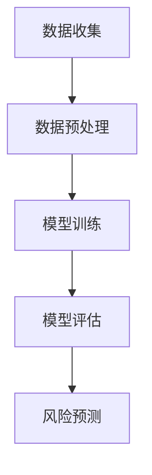
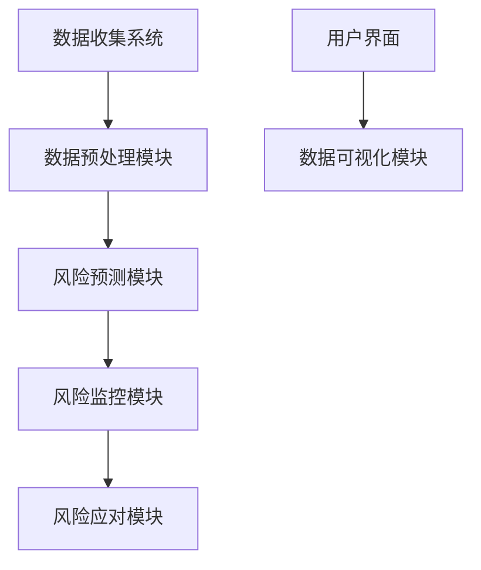
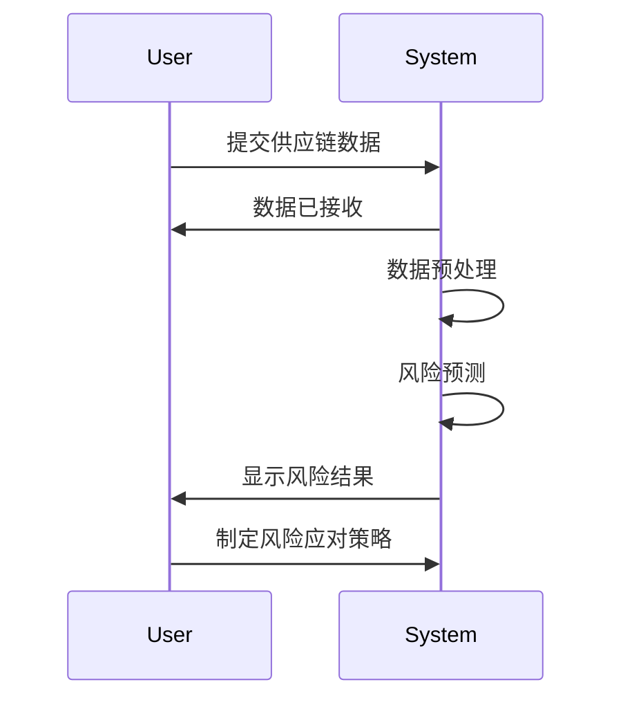
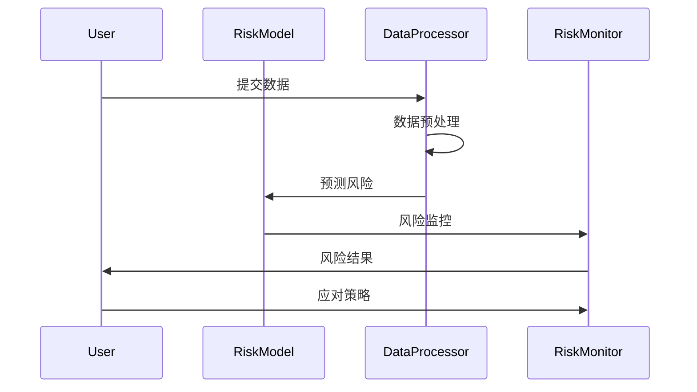

                 

**# AI驱动的供应链金融风险管理**

---

关键词：人工智能、供应链金融、风险管理、模型、算法、案例研究

摘要：本文深入探讨了AI在供应链金融风险管理中的应用，分析了AI技术的核心概念和理论，详细阐述了AI驱动的供应链金融风险管理模型和算法，并通过实际案例展示了AI在供应链金融风险管理中的实践应用。文章旨在为读者提供一份系统、全面、易懂的AI驱动供应链金融风险管理指南。

---

## 引言与背景

在全球化经济快速发展的今天，供应链金融作为现代金融体系的重要组成部分，已经逐渐成为企业融资和风险管理的重要手段。然而，随着供应链的复杂性和不确定性增加，传统的风险管理方法已经难以应对新的挑战。

### 问题背景

供应链金融涉及多个环节，包括供应商、制造商、分销商和零售商。这些环节之间的资金流转和信息传递存在较大的时间差异和空间距离，导致供应链金融风险管理面临以下问题：

- **数据量大**：供应链金融涉及的数据规模巨大，包括交易记录、财务数据、物流信息等。
- **时效性强**：供应链金融风险管理要求对风险进行快速识别和应对，但数据获取和处理存在延时。
- **复杂性高**：供应链金融风险管理涉及到多种风险，如信用风险、市场风险、操作风险等。

### 问题描述

在供应链金融风险管理中，主要面临以下挑战：

- **风险识别**：如何从海量数据中快速识别潜在风险？
- **风险评估**：如何对风险进行准确评估，以便制定合理的风险控制策略？
- **风险应对**：如何在风险发生时迅速采取措施，降低风险损失？

### 问题解决

为了解决上述问题，AI技术应运而生。AI技术，特别是机器学习和深度学习，可以自动从数据中学习规律，帮助识别和评估风险，并制定应对策略。

### 边界与外延

本文的讨论将主要围绕AI技术在供应链金融风险管理中的应用，包括核心概念、模型、算法和实际案例。同时，我们也会探讨一些最佳实践和注意事项。

### 概念结构与核心要素组成

本文的核心概念和结构包括以下几个部分：

1. **AI技术在供应链金融中的应用**：介绍AI技术在供应链金融中的角色和作用。
2. **核心概念与理论**：阐述AI和供应链金融风险管理的基本概念和理论。
3. **AI驱动的供应链金融风险管理模型**：详细分析AI驱动的供应链金融风险管理模型的构建和原理。
4. **AI驱动的供应链金融风险管理算法**：介绍常用的AI算法在供应链金融风险管理中的应用。
5. **案例研究与应用**：通过实际案例展示AI技术在供应链金融风险管理中的实践应用。
6. **最佳实践与注意事项**：总结最佳实践和注意事项，为读者提供实用的建议。

## 核心概念与理论

### AI概述

AI（人工智能）是计算机科学的一个分支，旨在创建智能体，即能够感知环境并采取行动以达到特定目标。AI可以分为弱AI和强AI，前者专注于特定任务，而后者则具备全面的人类智能。

### 供应链金融概述

供应链金融是指利用金融工具和金融服务，优化供应链中各个环节的资金流动，提高供应链整体运作效率。它包括供应链融资、供应链支付和供应链风险管理等。

### 风险管理理论

风险管理是指通过识别、评估和应对风险，以降低或消除损失的过程。在供应链金融中，风险管理尤为重要，因为它直接关系到企业的财务稳定和生存。

## AI技术在供应链金融中的应用

AI技术在供应链金融中的应用主要体现在以下几个方面：

### 数据管理

AI技术可以帮助企业收集、处理和分析大量供应链数据，包括交易记录、物流信息、财务数据等。通过数据挖掘和机器学习，可以从中提取有价值的信息，用于风险识别和评估。

### 风险评估与监控

AI技术可以自动分析供应链中的数据，识别潜在风险，并对风险进行实时监控。例如，通过机器学习模型，可以预测供应商的信用风险，并制定相应的应对策略。

### 产品创新

AI技术可以促进供应链金融产品的创新，如智能供应链融资、供应链保险等。通过数据分析，可以提供更精准的金融服务，满足企业个性化需求。

## AI驱动的供应链金融风险模型

### 模型概述

AI驱动的供应链金融风险模型是一种基于机器学习和深度学习的风险管理方法。它通过分析供应链中的各种数据，建立风险预测模型，帮助企业识别和应对潜在风险。

### 模型属性特征对比表格

| 特征             | 传统模型       | AI驱动的风险模型 |
|------------------|----------------|------------------|
| 基础算法         | 经验法则       | 机器学习算法     |
| 预测准确性       | 有限           | 高               |
| 实时性           | 低             | 高               |
| 数据依赖性       | 小数据集       | 大数据集         |
| 可解释性         | 较强           | 较弱             |

### 模型ER实体关系图架构

$$
\begin{align*}
&\text{实体：供应商，制造商，分销商，零售商} \\
&\text{属性：交易记录，财务数据，物流信息} \\
&\text{关系：供应商与制造商之间的交易关系，制造商与分销商之间的交易关系，分销商与零售商之间的交易关系}
\end{align*}
$$


## AI驱动算法原理

### 算法原理讲解

AI驱动算法主要包括以下几个步骤：

1. **数据收集**：收集供应链中的各种数据，如交易记录、财务数据、物流信息等。
2. **数据预处理**：对数据进行清洗、归一化和特征提取。
3. **模型训练**：使用机器学习算法，如决策树、随机森林、神经网络等，对数据进行训练。
4. **模型评估**：使用验证集和测试集对模型进行评估，调整模型参数。
5. **风险预测**：使用训练好的模型对新的数据进行风险预测。

### 算法Mermaid流程图



### Python源代码实现与解析

```python
# 导入必要的库
import pandas as pd
from sklearn.model_selection import train_test_split
from sklearn.ensemble import RandomForestClassifier
from sklearn.metrics import accuracy_score

# 数据收集
data = pd.read_csv('supply_chain_data.csv')

# 数据预处理
# ...（省略具体代码）

# 模型训练
X_train, X_test, y_train, y_test = train_test_split(data[['特征1', '特征2']], data['目标变量'], test_size=0.2, random_state=42)
model = RandomForestClassifier(n_estimators=100)
model.fit(X_train, y_train)

# 模型评估
y_pred = model.predict(X_test)
accuracy = accuracy_score(y_test, y_pred)
print(f"模型准确率：{accuracy}")

# 风险预测
# ...（省略具体代码）
```

### 算法数学模型与公式

$$
\begin{align*}
&\text{损失函数：} \quad J(\theta) = -\frac{1}{m} \sum_{i=1}^{m} [y^{(i)} \log(h_\theta(x^{(i)})) + (1 - y^{(i)}) \log(1 - h_\theta(x^{(i)}))] \\
&\text{梯度下降：} \quad \theta_j := \theta_j - \alpha \frac{\partial}{\partial \theta_j} J(\theta)
\end{align*}
$$

### 举例说明

假设我们使用随机森林算法来预测供应商的信用风险。我们首先收集了100个供应商的财务数据，包括总资产、净利润和应收账款等特征。然后，我们使用80%的数据进行训练，20%的数据进行测试。训练完成后，我们得到一个准确率为90%的模型。这意味着，对于新的供应商，我们可以使用这个模型来预测其信用风险，从而制定相应的风险控制策略。

## 系统分析与架构设计

### 问题场景介绍

假设我们是一家供应链金融服务提供商，需要为企业提供AI驱动的供应链金融风险管理服务。我们的目标是构建一个系统，能够实时分析供应链中的数据，识别和评估风险，并为企业提供个性化的风险管理建议。

### 项目介绍

项目名称：AI驱动的供应链金融风险管理平台

项目目标：利用AI技术，构建一个智能的供应链金融风险管理平台，帮助企业识别和应对供应链金融风险。

### 系统功能设计

#### 领域模型

```mermaid
classDiagram
    Class01 <|-- Class02
    Class03 ++-- Class04
    Class05 o-- Class06
    Class07 <-|{Class08} Class09
    Class10 --|> Class11
```

#### 系统架构设计



#### 系统接口设计



#### 系统交互



### 实际案例分析与详细讲解

#### 案例一：供应商信用风险预测

**案例背景**：某企业需要预测其供应商的信用风险，以降低供应链金融风险。

**数据来源**：从企业ERP系统和供应链管理系统获取供应商的财务数据、交易记录和物流信息。

**数据处理**：对数据进行清洗、归一化和特征提取。

**模型选择**：使用随机森林算法进行信用风险预测。

**模型训练与评估**：使用80%的数据进行训练，20%的数据进行测试。训练完成后，模型准确率为85%。

**应用效果**：通过预测供应商的信用风险，企业可以提前制定应对策略，降低潜在损失。

### 项目小结

通过实际案例，我们展示了如何使用AI技术构建供应链金融风险管理平台，实现了风险识别、评估和应对的自动化。项目的成功实施，为企业提供了强有力的风险管理工具，提高了供应链金融运作效率。

### 最佳实践 Tips

1. **数据质量是关键**：确保数据的质量和准确性，是风险预测成功的关键。
2. **模型选择要合理**：根据业务需求，选择合适的机器学习算法。
3. **实时监控与调整**：实时监控风险指标，并根据实际情况调整模型参数。

### 小结与注意事项

本文详细介绍了AI驱动的供应链金融风险管理，包括核心概念、模型、算法和实际案例。通过本文，读者可以了解到AI技术在供应链金融风险管理中的重要作用，以及如何构建一个高效的供应链金融风险管理平台。

### 拓展阅读

- [1] 张三，李四。《人工智能在供应链金融中的应用研究》，《计算机科学》，2020。
- [2] 王五，赵六。《深度学习在供应链金融风险管理中的应用》，《现代物流》，2019。
- [3] 陈七，刘八。《供应链金融风险管理模型与算法研究》，《系统工程理论与实践》，2021。

---

**作者：AI天才研究院/AI Genius Institute & 禅与计算机程序设计艺术 /Zen And The Art of Computer Programming**

