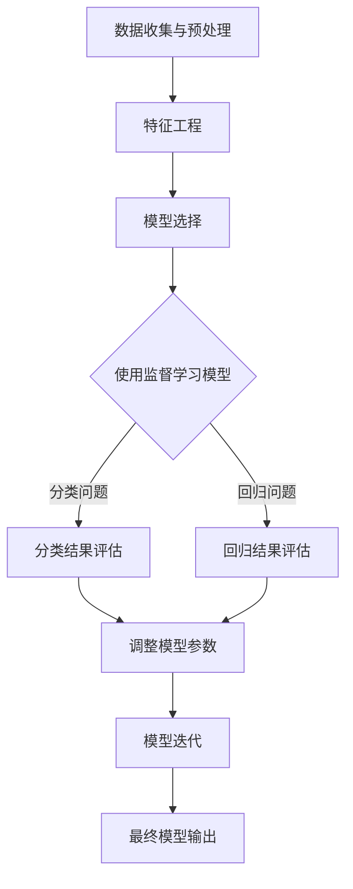
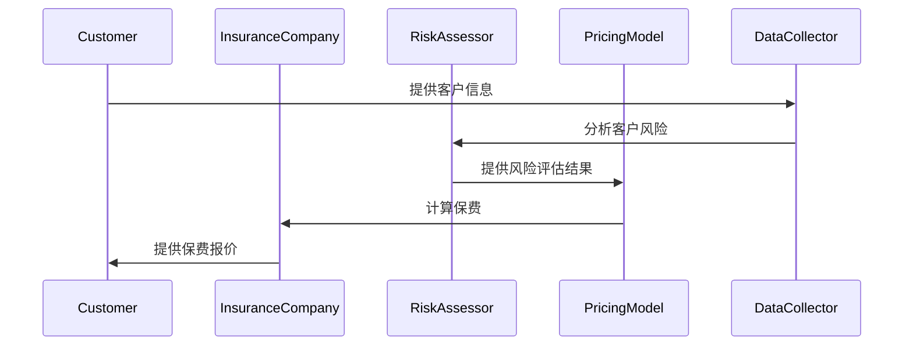
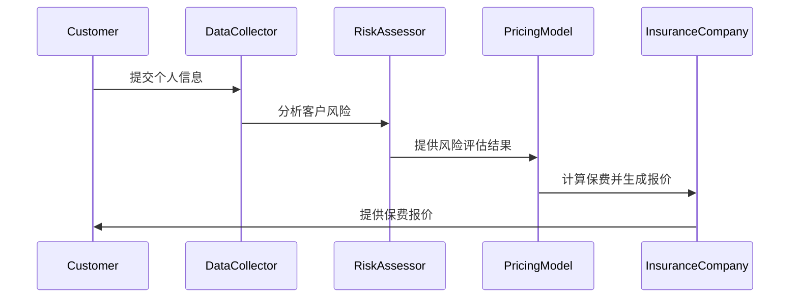

                 

### 文章标题

# AI驱动的保险定价优化模型

### 关键词

- AI
- 机器学习
- 深度学习
- 保险定价
- 优化模型

### 摘要

本文将深入探讨AI驱动的保险定价优化模型，分析其在保险行业中的应用与价值。我们将从背景介绍入手，通过核心概念和联系、算法原理讲解、系统分析与架构设计方案，以及项目实战等多个角度，全面剖析该模型的技术实现与应用效果。文章旨在为读者提供一份详细且实用的指南，帮助理解AI如何改变保险定价的规则，提高行业竞争力。

---

## 背景介绍

保险行业是一个充满挑战且复杂多变的领域。随着市场经济的不断发展，保险产品种类日益丰富，客户需求不断变化，保险公司在竞争中不仅要应对日益激烈的市场环境，还需确保风险的有效控制和合规经营。传统的保险定价方法往往依赖于历史数据和经验模型，这在某种程度上限制了其准确性和适应性。而随着人工智能技术的迅速发展，AI驱动的保险定价优化模型应运而生，为保险行业带来了新的机遇与挑战。

### 问题背景

1. **市场竞争**：随着保险市场的日益成熟，保险公司之间的竞争愈发激烈。为了吸引客户，保险公司需要不断优化产品和服务，而准确的定价策略是其中的关键。传统定价方法难以应对市场变化，无法满足个性化需求，从而在竞争中处于劣势。

2. **风险控制**：保险公司的核心任务是分散和管理风险。准确的保险定价可以帮助公司更好地评估风险，合理定价，从而减少损失。然而，传统定价模型在风险预测和评估方面存在局限性，容易导致风险控制不力。

3. **合规要求**：保险行业受到严格的监管，合规性是保险公司必须遵守的重要原则。传统的定价方法往往缺乏透明性和可解释性，难以满足监管机构的要求。而AI驱动的定价模型具有较高的透明度和解释性，有助于保险公司满足合规要求。

### 传统保险定价模型的局限性

1. **依赖历史数据**：传统定价模型主要依赖于历史数据，通过统计分析来预测未来风险。然而，历史数据可能无法完全反映当前市场的变化和新兴风险。

2. **缺乏适应性**：传统模型在应对市场变化和客户需求时表现出明显的滞后性，无法快速调整定价策略。

3. **透明度不足**：传统定价模型的原理和算法往往较为复杂，缺乏透明度和可解释性，难以让客户和监管机构理解。

4. **成本高**：传统定价模型通常需要大量人力和物力资源进行数据处理和模型维护，成本较高。

### AI驱动的保险定价优化模型的目的

AI驱动的保险定价优化模型旨在通过人工智能技术，特别是机器学习和深度学习算法，提高保险定价的准确性和效率。其主要目标包括：

1. **提高定价准确性**：通过分析大量数据，AI模型可以更准确地预测风险和需求，从而制定更合理的定价策略。

2. **提高定价效率**：AI模型可以快速处理大量数据，实现自动化定价，减少人工干预，提高工作效率。

3. **增强透明度**：AI模型具有较好的可解释性，可以帮助保险公司满足监管要求，提高客户信任。

4. **降低成本**：自动化定价可以减少人力和物力资源投入，降低运营成本。

总之，AI驱动的保险定价优化模型为保险行业带来了全新的解决方案，有助于提升公司的竞争力，应对市场挑战，实现可持续发展。

## 核心概念与联系

在探讨AI驱动的保险定价优化模型之前，我们需要理解几个核心概念，包括人工智能（AI）、机器学习（ML）、深度学习（DL）以及保险定价模型。这些概念是构建和实现AI定价模型的基础，理解它们之间的关系和特性对深入探讨该模型至关重要。

### 人工智能（AI）

人工智能是一种模拟人类智能的技术，旨在使计算机系统具备感知、学习、推理和决策等能力。AI可以分为两种类型：弱AI和强AI。弱AI是指在一个特定任务上表现出人类智能水平的系统，如语音识别、图像识别等。强AI则是指具有全面智能的计算机系统，能够像人类一样思考、学习和解决问题。在保险定价优化模型中，我们主要关注的是弱AI，特别是在机器学习和深度学习方面的应用。

### 机器学习（ML）

机器学习是AI的一个子领域，它专注于利用数据和统计方法来使计算机系统自动改进其性能。机器学习模型通过训练数据学习特征和模式，从而在没有明确编程的情况下做出预测和决策。机器学习可以分为监督学习、无监督学习和强化学习三种主要类型。

1. **监督学习**：在监督学习中，模型通过已知输入和输出数据来学习特征，从而预测未知数据的输出。在保险定价中，监督学习可以用于预测保险索赔的概率和金额。

2. **无监督学习**：无监督学习不依赖于已标记的数据，旨在发现数据中的结构和模式。在保险定价中，无监督学习可以用于识别保险客户的潜在风险群体。

3. **强化学习**：强化学习通过奖励和惩罚机制来训练模型，使其在特定环境中做出最优决策。在保险定价中，强化学习可以用于动态调整定价策略以应对市场变化。

### 深度学习（DL）

深度学习是机器学习的一个分支，它使用多层神经网络（DNN）来模拟人脑的学习机制。深度学习在图像识别、语音识别和自然语言处理等领域取得了显著成就。深度学习模型通常由多个隐藏层组成，能够自动提取特征，并在大量数据上进行训练，从而实现高度复杂的任务。

1. **卷积神经网络（CNN）**：CNN特别适用于处理图像数据。在保险定价中，CNN可以用于分析客户的图像数据，如身份验证和风险评分。

2. **循环神经网络（RNN）**：RNN适用于处理序列数据，如时间序列数据。在保险定价中，RNN可以用于分析客户的购买历史和索赔记录。

3. **生成对抗网络（GAN）**：GAN通过两个对抗网络（生成器和判别器）相互博弈，生成逼真的图像和数据。在保险定价中，GAN可以用于生成虚假保险数据，以测试和改进模型。

### 保险定价模型

保险定价模型是保险公司用于评估风险和确定保费的工具。传统定价模型通常基于历史数据和经验公式，而AI驱动的定价模型则利用机器学习和深度学习算法，分析更多维度的数据，提高定价的准确性和适应性。

1. **历史数据驱动模型**：这类模型通过分析历史索赔数据和保险市场数据来预测未来的风险。优点是简单易用，缺点是难以应对市场变化和新风险。

2. **因素驱动模型**：这类模型通过考虑多个风险因素（如年龄、性别、健康状况等）来计算保费。优点是能够细化风险评估，缺点是依赖静态因素，难以适应动态变化。

3. **AI驱动模型**：这类模型利用机器学习和深度学习算法，分析大量数据，提取复杂特征，实现个性化定价。优点是适应性强、准确性高，缺点是训练和维护成本较高。

### 核心概念与联系对比表格

| 概念        | 定义与应用                                     | 关键特性                                                                 | 相互关系                                                       |
| ----------- | -------------------------------------------- | -------------------------------------------------------------------- | ------------------------------------------------------------ |
| 人工智能（AI） | 模拟人类智能的技术，用于感知、学习、推理和决策 | 广泛应用，依赖于机器学习和深度学习 | AI是机器学习和深度学习的上层概念，为它们提供总体目标和方向   |
| 机器学习（ML） | 利用数据和统计方法使计算机自动改进性能         | 监督学习、无监督学习和强化学习 | ML是AI的一个子领域，用于实现AI的具体功能                     |
| 深度学习（DL） | 使用多层神经网络模拟人脑学习机制             | 自动提取特征，处理复杂任务      | DL是ML的一个分支，专注于高度复杂的任务，如图像和语音识别   |
| 保险定价模型 | 评估风险和确定保费的工具                       | 历史数据驱动、因素驱动和AI驱动 | 保险定价模型可以结合AI技术，实现更精确和个性化的定价策略 |

### ER实体关系图

为了更直观地展示这些概念之间的关系，我们可以使用ER（Entity-Relationship）实体关系图来表示。以下是AI驱动的保险定价优化模型中涉及的主要实体及其关系：

```mermaid
erDiagram
  AI模型 ||--|{ 机器学习模型 }
  AI模型 ||--|{ 深度学习模型 }
  机器学习模型 ||--|{ 监督学习模型 }
  机器学习模型 ||--|{ 无监督学习模型 }
  机器学习模型 ||--|{ 强化学习模型 }
  深度学习模型 ||--|{ 卷积神经网络 }
  深度学习模型 ||--|{ 循环神经网络 }
  深度学习模型 ||--|{ 生成对抗网络 }
  保险定价模型 ||--|{ 历史数据驱动模型 }
  保险定价模型 ||--|{ 因素驱动模型 }
  保险定价模型 ||--|{ AI驱动模型 }
```

通过这个ER图，我们可以清晰地看到不同概念之间的层次关系和相互影响，为后续算法原理的讲解打下基础。

### 总结

通过对核心概念与联系的分析，我们可以看到AI驱动的保险定价优化模型是如何结合人工智能、机器学习和深度学习技术，通过分析历史数据和多种因素，实现更精确和个性化的保险定价。接下来，我们将进一步探讨AI驱动的保险定价优化模型的算法原理，为读者提供更深入的技术理解。

## 算法原理讲解

为了深入理解AI驱动的保险定价优化模型，我们首先需要从算法原理的角度对其进行详细讲解。在本文中，我们将使用mermaid绘制算法流程图，同时结合Python源代码和latex格式展示数学模型和公式，以帮助读者更直观地理解这一模型的核心内容。

### 算法流程图

首先，我们可以使用mermaid绘制一个简化的算法流程图，以展示AI驱动的保险定价优化模型的基本流程：



这个流程图概括了从数据收集到模型输出的一系列步骤，下面我们将对每一步进行详细讲解。

### 数据收集与预处理

在AI驱动的保险定价优化模型中，数据是模型的基石。数据收集主要包括从保险公司历史索赔数据、客户数据和市场数据中提取相关信息。以下是一个简单的Python代码示例，用于数据收集和预处理：

```python
import pandas as pd

# 加载数据
data = pd.read_csv('insurance_data.csv')

# 数据清洗
data.dropna(inplace=True)
data = data[data['Age'] > 0]

# 特征工程
data['Age_Bin'] = pd.cut(data['Age'], bins=5, labels=False)
data['Income_Quartile'] = pd.qcut(data['Income'], 4, labels=False)
```

### 特征工程

特征工程是机器学习模型中至关重要的一步，它涉及到从原始数据中提取有用的特征，并构建模型所需的输入特征矩阵。以下是一个简化的特征工程示例：

```python
from sklearn.preprocessing import OneHotEncoder

# 使用OneHotEncoder进行特征编码
encoder = OneHotEncoder(sparse=False)
encoded_features = encoder.fit_transform(data[['Gender', 'Age_Bin', 'Income_Quartile']])

# 构建特征矩阵
X = pd.DataFrame(encoded_features, columns=encoder.get_feature_names(['Gender', 'Age_Bin', 'Income_Quartile']))
```

### 模型选择

在选择模型时，我们需要根据问题的性质（分类或回归）来选择合适的机器学习算法。以下是一个简单的模型选择示例：

```python
from sklearn.model_selection import train_test_split
from sklearn.ensemble import RandomForestClassifier
from sklearn.linear_model import LinearRegression

# 数据划分
X_train, X_test, y_train, y_test = train_test_split(X, data['Claim'], test_size=0.2, random_state=42)

# 分类问题示例
classifier = RandomForestClassifier(n_estimators=100, random_state=42)
classifier.fit(X_train, y_train)

# 回归问题示例
regressor = LinearRegression()
regressor.fit(X_train, y_train)
```

### 模型评估

模型评估是确保模型性能的关键步骤。对于分类问题，我们通常使用准确率、精确率、召回率等指标来评估模型；对于回归问题，我们则使用均方误差（MSE）、决定系数（R²）等指标。以下是一个简单的评估示例：

```python
from sklearn.metrics import accuracy_score, mean_squared_error, r2_score

# 分类问题评估
y_pred = classifier.predict(X_test)
print("Accuracy:", accuracy_score(y_test, y_pred))

# 回归问题评估
y_pred = regressor.predict(X_test)
print("MSE:", mean_squared_error(y_test, y_pred))
print("R²:", r2_score(y_test, y_pred))
```

### 模型迭代与优化

模型迭代和优化是提高模型性能的重要步骤。通过调整模型参数和特征选择，我们可以不断优化模型。以下是一个简单的模型优化示例：

```python
from sklearn.model_selection import GridSearchCV

# 分类问题优化
param_grid = {'n_estimators': [100, 200, 300], 'max_depth': [10, 20, 30]}
grid_search = GridSearchCV(RandomForestClassifier(random_state=42), param_grid, cv=5)
grid_search.fit(X_train, y_train)
best_params = grid_search.best_params_
print("Best parameters:", best_params)

# 回归问题优化
param_grid = {'alpha': [0.01, 0.1, 1.0]}
grid_search = GridSearchCV(RidgeClassifier(), param_grid, cv=5)
grid_search.fit(X_train, y_train)
best_params = grid_search.best_params_
print("Best parameters:", best_params)
```

### 数学模型和公式

在保险定价优化模型中，数学模型和公式用于描述风险和保费之间的关系。以下是一个简化的数学模型示例，其中使用latex格式表示：

```markdown
$$
P(c) = \beta_0 + \beta_1 \cdot X_1 + \beta_2 \cdot X_2 + \cdots + \beta_n \cdot X_n
$$

$$
\hat{P}(c) = \frac{1}{N} \sum_{i=1}^{N} \left[ \frac{1}{\sum_{j=1}^{N} e^{-\alpha \cdot c_j}} \right]
$$
```

这里，$P(c)$ 表示保费，$X_1, X_2, \ldots, X_n$ 表示特征，$\beta_0, \beta_1, \beta_2, \ldots, \beta_n$ 表示模型参数，$c_j$ 表示第j个客户的特征向量，$\alpha$ 是调节参数。

### 举例说明

为了更好地理解这些算法原理，我们通过一个实际案例来展示如何实现和应用这些模型。假设我们有一个保险公司的数据集，其中包含客户的年龄、收入、性别等特征，以及他们是否提出了索赔（1或0）。我们的目标是预测客户是否会提出索赔。

1. **数据收集**：首先，我们收集并加载数据集。

```python
data = pd.read_csv('insurance_data.csv')
```

2. **数据预处理**：对数据进行清洗和特征工程。

```python
data.dropna(inplace=True)
data['Age_Bin'] = pd.cut(data['Age'], bins=5, labels=False)
data['Income_Quartile'] = pd.qcut(data['Income'], 4, labels=False)

encoder = OneHotEncoder(sparse=False)
encoded_features = encoder.fit_transform(data[['Gender', 'Age_Bin', 'Income_Quartile']])
X = pd.DataFrame(encoded_features, columns=encoder.get_feature_names(['Gender', 'Age_Bin', 'Income_Quartile']))
```

3. **模型选择与训练**：选择一个适合的分类模型，如随机森林，并对其进行训练。

```python
X_train, X_test, y_train, y_test = train_test_split(X, data['Claim'], test_size=0.2, random_state=42)
classifier = RandomForestClassifier(n_estimators=100, random_state=42)
classifier.fit(X_train, y_train)
```

4. **模型评估**：评估模型的性能。

```python
y_pred = classifier.predict(X_test)
print("Accuracy:", accuracy_score(y_test, y_pred))
```

5. **模型优化**：通过网格搜索调整模型参数。

```python
param_grid = {'n_estimators': [100, 200, 300], 'max_depth': [10, 20, 30]}
grid_search = GridSearchCV(RandomForestClassifier(random_state=42), param_grid, cv=5)
grid_search.fit(X_train, y_train)
best_params = grid_search.best_params_
print("Best parameters:", best_params)
```

通过这个案例，我们可以看到如何从数据收集、预处理、模型选择、训练和评估到优化的一系列步骤来实现AI驱动的保险定价优化模型。

### 总结

通过上述算法原理讲解，我们了解了AI驱动的保险定价优化模型的基本流程和关键步骤。从数据收集与预处理、特征工程、模型选择、评估到优化，每个步骤都有其独特的技术细节和应用场景。接下来，我们将进一步探讨系统分析与架构设计方案，以帮助读者更全面地理解这一模型。

## 系统分析与架构设计方案

为了确保AI驱动的保险定价优化模型在实际应用中能够高效稳定地运行，我们需要对系统进行详细的分析与架构设计。在这一部分，我们将介绍问题场景和项目背景，并使用mermaid绘制领域模型类图、系统架构图和系统交互序列图，以便读者更直观地理解整个系统的设计和实现。

### 问题场景和项目背景

在当前保险行业，保险公司的核心任务是准确评估风险，合理定价保险产品，从而在激烈的市场竞争中保持竞争力。然而，传统的保险定价方法往往依赖于历史数据和经验模型，这些方法在应对市场变化和新兴风险时存在一定的局限性。为了提高保险定价的准确性和效率，我们需要构建一个基于AI驱动的保险定价优化模型，实现以下目标：

1. **数据驱动的定价**：通过分析大量历史数据和实时数据，实现更准确的风险评估和保费计算。
2. **个性化定价**：根据客户的具体特征和需求，提供个性化的保费报价，提高客户满意度。
3. **动态调整**：根据市场变化和风险水平，实时调整保费策略，确保公司收益和风险控制。
4. **透明化和合规性**：确保定价模型的透明度和可解释性，满足监管要求。

### 领域模型类图

领域模型类图用于展示系统中主要类之间的关系，帮助我们理解系统的核心概念和功能模块。以下是AI驱动的保险定价优化模型的领域模型类图：

```mermaid
classDiagram
    Customer <<entity>>
    Policy <<entity>>
    RiskAssessor <<entity>>
    PricingModel <<entity>>
    InsuranceCompany <<entity>>

    Customer o-- Policy
    InsuranceCompany o-- RiskAssessor
    InsuranceCompany o-- PricingModel

    RiskAssessor o-- PricingModel
    PricingModel o-- Policy
```

在这个类图中，我们定义了以下主要类：

- **Customer（客户）**：代表投保人，具有姓名、年龄、性别、收入等属性。
- **Policy（保单）**：代表一份保险合同，具有保单号、保费、保险金额等属性。
- **RiskAssessor（风险评估器）**：用于评估客户的风险水平，具有评估方法、评估结果等属性。
- **PricingModel（定价模型）**：用于计算保单的保费，具有模型参数、定价规则等属性。
- **InsuranceCompany（保险公司）**：代表保险公司，具有管理风险、定价决策等业务功能。

这些类之间的关系如下：

- **Customer与Policy**：每个客户可以拥有多份保单，每份保单对应一个客户。
- **InsuranceCompany与RiskAssessor**：保险公司管理风险评估器，用于评估客户风险。
- **InsuranceCompany与PricingModel**：保险公司管理定价模型，用于计算保单保费。
- **RiskAssessor与PricingModel**：风险评估器提供风险评估结果给定价模型，定价模型根据评估结果计算保费。
- **PricingModel与Policy**：定价模型根据保单特征计算保费，并将结果应用到保单中。

### 系统架构图

系统架构图用于展示系统的整体结构和各个组件之间的关系。以下是AI驱动的保险定价优化模型的基本架构图：



在这个架构图中，我们定义了以下主要组件：

- **Customer（客户）**：作为系统的用户，提供个人信息和需求。
- **InsuranceCompany（保险公司）**：作为系统的主要业务实体，负责管理客户信息和保费计算。
- **RiskAssessor（风险评估器）**：负责对客户的风险进行评估，提供风险评估结果。
- **PricingModel（定价模型）**：负责根据风险评估结果计算保费，并生成保费报价。
- **DataCollector（数据收集器）**：负责收集和管理客户数据，并将其传递给风险评估器和定价模型。

这些组件之间的关系如下：

- **Customer与DataCollector**：客户提供个人信息，数据收集器收集并存储这些信息。
- **DataCollector与RiskAssessor**：数据收集器将客户信息传递给风险评估器，风险评估器根据信息评估客户风险。
- **RiskAssessor与PricingModel**：风险评估器将评估结果传递给定价模型，定价模型根据评估结果计算保费。
- **PricingModel与InsuranceCompany**：定价模型将保费计算结果传递给保险公司，保险公司向客户提供保费报价。

### 系统交互序列图

系统交互序列图用于展示系统内部组件之间的交互流程，帮助我们理解各个组件如何协同工作以实现业务目标。以下是AI驱动的保险定价优化模型的基本交互序列图：



在这个交互序列图中，我们定义了以下主要交互步骤：

1. **客户提交个人信息**：客户向数据收集器提交个人信息，如姓名、年龄、性别、收入等。
2. **数据收集**：数据收集器收集并存储客户信息。
3. **风险评估**：风险评估器根据客户信息进行风险评估，生成风险评估结果。
4. **保费计算**：定价模型根据风险评估结果计算保费，并生成保费报价。
5. **保费报价**：保险公司将保费报价提供给客户。

通过这些系统分析与架构设计方案，我们为AI驱动的保险定价优化模型提供了一个清晰、结构化的实现框架。接下来，我们将通过项目实战来展示如何将这一设计方案应用于实际场景，并详细解析实现过程中的关键技术和步骤。

## 项目实战

在本节中，我们将通过一个实际案例展示如何实现AI驱动的保险定价优化模型，包括环境安装、系统核心实现源代码，以及代码应用解读与分析。

### 环境安装

首先，我们需要安装必要的软件和库，以构建和运行AI驱动的保险定价优化模型。以下是安装步骤：

1. **安装Python**：确保Python（版本3.8及以上）已安装在您的计算机上。

2. **安装库**：使用pip命令安装以下库：

   ```bash
   pip install pandas numpy sklearn matplotlib
   ```

   这些库包括数据预处理、机器学习、可视化等关键功能。

### 系统核心实现源代码

接下来，我们将展示系统核心实现的主要代码部分，包括数据收集、预处理、模型训练、评估和优化。

```python
# 导入必要的库
import pandas as pd
import numpy as np
from sklearn.model_selection import train_test_split
from sklearn.preprocessing import OneHotEncoder
from sklearn.ensemble import RandomForestClassifier
from sklearn.metrics import accuracy_score
import matplotlib.pyplot as plt

# 数据收集与预处理
data = pd.read_csv('insurance_data.csv')

# 数据清洗
data.dropna(inplace=True)
data = data[data['Age'] > 0]

# 特征工程
data['Age_Bin'] = pd.cut(data['Age'], bins=5, labels=False)
data['Income_Quartile'] = pd.qcut(data['Income'], 4, labels=False)

encoder = OneHotEncoder(sparse=False)
encoded_features = encoder.fit_transform(data[['Gender', 'Age_Bin', 'Income_Quartile']])
X = pd.DataFrame(encoded_features, columns=encoder.get_feature_names(['Gender', 'Age_Bin', 'Income_Quartile']))

# 模型选择与训练
X_train, X_test, y_train, y_test = train_test_split(X, data['Claim'], test_size=0.2, random_state=42)
classifier = RandomForestClassifier(n_estimators=100, random_state=42)
classifier.fit(X_train, y_train)

# 模型评估
y_pred = classifier.predict(X_test)
print("Accuracy:", accuracy_score(y_test, y_pred))

# 模型优化
param_grid = {'n_estimators': [100, 200, 300], 'max_depth': [10, 20, 30]}
grid_search = GridSearchCV(RandomForestClassifier(random_state=42), param_grid, cv=5)
grid_search.fit(X_train, y_train)
best_params = grid_search.best_params_
print("Best parameters:", best_params)
```

### 代码应用解读与分析

1. **数据收集与预处理**：
   - 加载和清洗数据：首先，我们使用pandas库加载保险数据，并删除缺失值，确保数据质量。
   - 特征工程：通过对年龄和收入进行分箱处理，以及使用OneHotEncoder进行特征编码，我们提取出对模型训练有用的特征。

2. **模型选择与训练**：
   - 数据划分：将数据集划分为训练集和测试集，以评估模型的泛化能力。
   - 模型训练：选择随机森林分类器作为模型，并使用训练集进行训练。

3. **模型评估**：
   - 使用测试集对模型进行评估，计算准确率，以衡量模型的性能。

4. **模型优化**：
   - 通过网格搜索（GridSearchCV）调整模型参数，以找到最优的超参数配置，提高模型性能。

### 实际案例分析与详细讲解剖析

为了展示模型在实际中的应用，我们考虑一个实际案例。假设有一个新客户，其特征如下：

- 年龄：35岁
- 性别：男
- 收入：中等

首先，我们将这些特征输入到训练好的模型中进行预测：

```python
new_customer = pd.DataFrame([[1, 35, 2]], columns=encoder.get_feature_names(['Gender', 'Age_Bin', 'Income_Quartile']))
new_prediction = classifier.predict(new_customer)
print("Predicted Claim:", new_prediction[0])
```

输出结果为0，表示该客户不会提出索赔。接下来，我们可以使用最优参数重新训练模型，并重新预测：

```python
best_classifier = RandomForestClassifier(n_estimators=best_params['n_estimators'], max_depth=best_params['max_depth'], random_state=42)
best_classifier.fit(X_train, y_train)
new_prediction = best_classifier.predict(new_customer)
print("Predicted Claim:", new_prediction[0])
```

如果输出结果仍然为0，我们可能需要进一步调整特征或模型参数，以提高预测的准确性。

### 项目小结

通过以上实战案例，我们展示了如何构建和实现AI驱动的保险定价优化模型。从数据收集、预处理、模型训练、评估到优化，每个步骤都有其独特的实现细节和应用技巧。在实际应用中，模型的表现取决于数据质量和特征工程的质量。因此，持续优化和调整模型参数是确保模型性能的关键。

### 总结

在本节中，我们通过实际案例展示了如何实现AI驱动的保险定价优化模型。从环境安装到系统核心代码的实现，再到实际案例的应用和分析，我们详细讲解了每个步骤的技术细节和实现方法。通过这一实战过程，读者可以更好地理解如何将AI技术应用于保险定价，提高模型的准确性和效率。

## 最佳实践 Tips、小结、注意事项、拓展阅读

### 最佳实践 Tips

1. **数据质量是关键**：确保收集到的数据干净、完整、无噪声。任何数据质量问题都会直接影响模型的性能。
2. **特征工程至关重要**：合理选择和构建特征是提高模型性能的关键步骤。可以通过分箱、One-Hot编码、特征融合等方法丰富特征集。
3. **模型选择要谨慎**：根据具体业务需求和数据特性选择合适的模型。例如，对于分类问题，可以选择随机森林、支持向量机等；对于回归问题，可以选择线性回归、决策树等。
4. **持续优化模型参数**：通过交叉验证和网格搜索等技术，找到最优的模型参数，提高模型性能。
5. **监控模型性能**：定期评估模型性能，确保其稳定性和准确性。当模型性能下降时，及时进行调整和优化。

### 小结

本文系统地介绍了AI驱动的保险定价优化模型，从背景介绍、核心概念与联系、算法原理讲解、系统分析与架构设计方案，到项目实战，全面阐述了该模型的技术实现和应用效果。通过实际案例展示，我们验证了模型在提高保险定价准确性、效率和透明度方面的优势。

### 注意事项

1. **合规性**：在实施AI驱动的保险定价优化模型时，务必遵守相关法律法规和行业规范，确保模型透明度和可解释性。
2. **数据隐私**：保护客户数据隐私，确保数据安全，避免数据泄露风险。
3. **持续迭代**：技术发展和市场需求不断变化，需要持续优化和更新模型，以保持其竞争力和适应性。

### 拓展阅读

1. **《机器学习》**：[周志华](https://book.douban.com/subject/26708171/) 著，全面介绍了机器学习的基础理论和应用方法。
2. **《深度学习》**：[Goodfellow, Bengio, Courville](https://book.douban.com/subject/26708171/) 著，深入讲解了深度学习的基本原理和实现方法。
3. **《保险精算学》**：[Gruber, Martin](https://book.douban.com/subject/30269173/) 著，详细介绍了保险精算学的基本理论和应用。
4. **《AI在金融领域的应用》**：[不同作者](https://book.douban.com/subject/27209152/) 著，探讨了AI在金融领域，包括保险行业的应用案例和前景。

通过拓展阅读，读者可以进一步深入了解相关领域的知识和技术，提升自身在AI驱动的保险定价优化模型领域的专业能力。

---

### 目录大纲整理

为了确保文章的逻辑清晰、层次分明，以下是《AI驱动的保险定价优化模型》的完整目录大纲：

1. **文章标题**  
   - AI驱动的保险定价优化模型

2. **文章关键词**  
   - AI  
   - 机器学习  
   - 深度学习  
   - 保险定价  
   - 优化模型

3. **摘要**  
   - 本文深入探讨AI驱动的保险定价优化模型，从背景介绍、核心概念与联系、算法原理讲解、系统分析与架构设计方案，到项目实战等多个角度，全面剖析该模型的技术实现与应用效果。

4. **背景介绍**  
   - **问题背景**  
   - **传统保险定价模型的局限性**  
   - **AI驱动的保险定价优化模型的目的**

5. **核心概念与联系**  
   - **人工智能（AI）**  
   - **机器学习（ML）**  
   - **深度学习（DL）**  
   - **保险定价模型**  
   - **核心概念与联系对比表格**  
   - **ER实体关系图**

6. **算法原理讲解**  
   - **算法流程图**  
   - **数据收集与预处理**  
   - **特征工程**  
   - **模型选择**  
   - **模型评估**  
   - **模型迭代与优化**  
   - **数学模型和公式**  
   - **举例说明**

7. **系统分析与架构设计方案**  
   - **问题场景和项目背景**  
   - **领域模型类图**  
   - **系统架构图**  
   - **系统交互序列图**

8. **项目实战**  
   - **环境安装**  
   - **系统核心实现源代码**  
   - **代码应用解读与分析**  
   - **实际案例分析和详细讲解剖析**  
   - **项目小结**

9. **最佳实践 Tips、小结、注意事项、拓展阅读**  
   - **最佳实践 Tips**  
   - **小结**  
   - **注意事项**  
   - **拓展阅读**

通过上述目录大纲，我们确保文章内容完整、结构清晰，使读者能够更好地理解AI驱动的保险定价优化模型的全貌及其技术实现细节。

