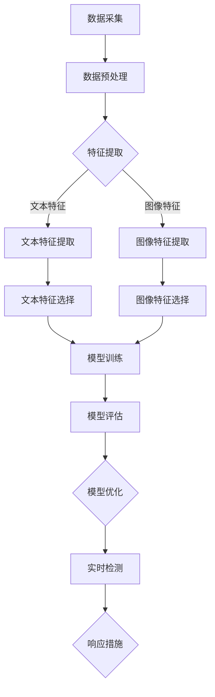
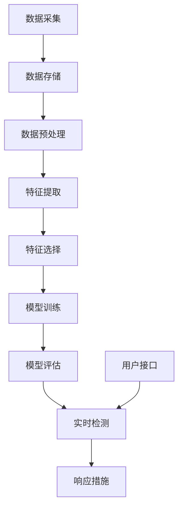
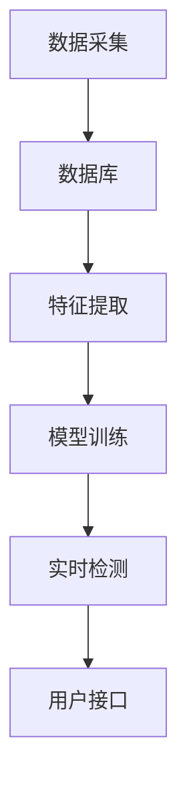
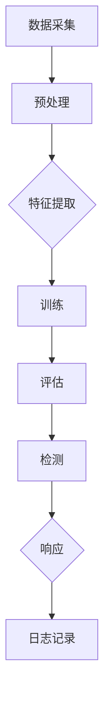

                 

### 文章标题：AI驱动的保险欺诈模式识别

#### 关键词：
- 人工智能
- 保险欺诈
- 模式识别
- 特征工程
- 监督学习

#### 摘要：
本文将探讨人工智能在保险欺诈检测中的应用，通过分析保险行业的现状、欺诈问题的严重性及其检测的挑战，引入AI的基本概念和欺诈检测技术，详细讨论欺诈检测系统的设计与实现，并通过实际案例研究，总结最佳实践，展望未来发展方向。文章旨在为读者提供一份关于AI驱动保险欺诈模式识别的全面而深入的指南。

### 引言

#### 1.1 保险行业背景

保险行业作为现代金融体系的重要组成部分，承担着转移风险、保障社会经济稳定的重任。随着全球经济的快速发展，保险行业规模不断扩大，市场结构日趋多元化。然而，与此同时，保险欺诈问题也日益突出，成为行业面临的一大挑战。

当前，保险行业正经历数字化转型，大数据、云计算、人工智能等先进技术的应用，为保险业务的发展提供了新的动能。尤其是在欺诈检测领域，AI技术的引入，使得模式识别和预测分析更加精准，大幅提升了欺诈识别的效率和准确性。

#### 1.2 保险欺诈的概念与类型

保险欺诈是指故意编造事实、隐瞒真相，或通过其他不正当手段，从保险公司骗取保险金的行为。根据欺诈行为的方式和目的，保险欺诈可以分为以下几种类型：

1. **虚假保险申请**：投保人故意提供虚假信息，如虚报年龄、健康状况等，以获得更低的保费或更高的赔偿金额。
2. **保险理赔欺诈**：被保险人在索赔过程中，提供虚假的损失情况、夸大损失金额，或伪造事故证据，企图骗取保险金。
3. **保险合同欺诈**：保险公司或其员工通过非法手段，如虚构保险合同、隐瞒合同条款，误导投保人，从而谋取不正当利益。

#### 1.3 保险欺诈的危害

保险欺诈不仅给保险公司带来直接的经济损失，还严重损害了保险行业的信誉。长期存在的欺诈行为会导致保费上涨，降低消费者投保意愿，影响保险市场的健康发展。此外，保险欺诈还可能导致社会信用体系的不稳定，影响金融秩序。

#### 1.4 保险欺诈的检测挑战

尽管保险欺诈问题严重，但其检测仍面临诸多挑战：

1. **数据多样性**：保险欺诈数据包含多种类型，如文本、图像、音频等，数据多样性增加了欺诈检测的复杂性。
2. **欺诈模式复杂性**：保险欺诈手段多变，欺诈模式复杂，传统的规则方法难以全面识别。
3. **实时性要求**：保险欺诈行为往往具有突发性，要求欺诈检测系统具备实时性，以快速识别和响应。

### AI概述

#### 2.1 人工智能的基本概念

人工智能（Artificial Intelligence，AI）是指模拟、延伸和扩展人类智能的理论、方法、技术及应用。AI可以分为以下几类：

1. **弱人工智能**：指在特定任务上表现出人类智能的机器，但缺乏跨领域的通用智能。
2. **强人工智能**：指具有与人类完全相同智能的机器，能够进行自主学习和创新。
3. **自然语言处理**：研究如何让计算机理解和生成自然语言。
4. **计算机视觉**：研究如何让计算机理解和解释视觉信息。

#### 2.2 机器学习基础

机器学习（Machine Learning，ML）是AI的重要分支，通过算法让计算机从数据中自动学习规律，进行决策和预测。机器学习主要包括以下几种类型：

1. **监督学习**：通过训练数据集，让模型学会对未知数据进行预测。
2. **无监督学习**：没有标注的数据，模型通过自身学习发现数据中的规律。
3. **强化学习**：通过与环境的交互，学习如何在特定环境中做出最优决策。

#### 2.3 深度学习原理

深度学习（Deep Learning，DL）是机器学习的一种方法，通过构建深层神经网络，对大量数据进行自动特征提取和模式识别。深度学习的主要优势在于其能够自动学习数据的复杂结构，提高模型的准确性和泛化能力。

### AI驱动的欺诈检测技术

#### 3.1 特征工程

特征工程是欺诈检测的关键步骤，通过选择和构造合适的特征，可以提高模型的性能和准确性。特征工程主要包括以下内容：

1. **数据预处理**：对原始数据进行清洗、归一化、缺失值处理等，提高数据质量。
2. **特征提取**：从原始数据中提取有价值的信息，如文本特征、图像特征等。
3. **特征选择**：从提取的特征中选择对模型性能有显著影响的特征，减少模型的复杂度。

#### 3.2 监督学习

监督学习是一种常见的机器学习方法，通过已标记的训练数据，让模型学习对未知数据进行预测。在保险欺诈检测中，监督学习可用于分类问题，将正常交易与欺诈交易进行区分。常见的监督学习算法包括：

1. **逻辑回归**：通过最大化似然估计，预测欺诈发生的概率。
2. **决策树**：通过构建决策树模型，根据特征值进行分类。
3. **支持向量机**：通过最大化分类边界，将数据分为正常与欺诈两类。

#### 3.3 无监督学习

无监督学习适用于没有标注数据的场景，通过自身学习，发现数据中的隐含结构。在保险欺诈检测中，无监督学习可用于聚类分析，将相似的交易数据归为一类。常见的无监督学习算法包括：

1. **K-均值聚类**：通过迭代优化，将数据划分为K个簇。
2. **层次聚类**：通过自底向上的合并或自顶向下的分解，构建聚类层次结构。
3. **主成分分析**：通过降维，提取数据的主要特征。

#### 3.4 强化学习

强化学习通过与环境交互，学习最优策略。在保险欺诈检测中，强化学习可用于动态调整检测策略，提高检测的准确性。常见的强化学习算法包括：

1. **Q-学习**：通过评估当前状态和动作的价值，学习最优动作序列。
2. **策略梯度**：通过更新策略参数，优化策略函数。

### 欺诈检测系统的设计与实现

#### 4.1 系统架构设计

欺诈检测系统一般包括以下几个模块：

1. **数据采集**：从各种渠道收集交易数据，包括内部数据和外部数据。
2. **数据预处理**：对采集到的数据进行清洗、归一化等预处理操作。
3. **特征提取与选择**：从预处理后的数据中提取有用特征，并进行选择。
4. **模型训练与评估**：使用训练数据集训练模型，并对模型进行评估。
5. **实时检测与响应**：对实时交易数据进行检测，并采取相应的响应措施。

#### 4.2 数据流设计

欺诈检测系统的数据流设计包括以下几个步骤：

1. **数据收集**：通过API接口、数据库连接等方式，从不同数据源收集交易数据。
2. **数据预处理**：对收集到的数据进行清洗、归一化、缺失值处理等操作。
3. **特征提取**：从预处理后的数据中提取文本特征、图像特征等。
4. **特征选择**：根据模型的性能，选择对欺诈检测有显著影响的特征。
5. **模型训练**：使用训练数据集，训练分类模型或聚类模型。
6. **模型评估**：对训练好的模型进行评估，选择性能最优的模型。
7. **实时检测**：对实时交易数据，使用训练好的模型进行检测。
8. **响应措施**：对检测出的欺诈交易，采取相应的响应措施，如报警、冻结账户等。

#### 4.3 模型训练与评估

模型训练与评估是欺诈检测系统的核心环节，包括以下几个步骤：

1. **数据划分**：将数据集划分为训练集、验证集和测试集。
2. **模型选择**：根据问题特点，选择合适的机器学习算法。
3. **模型训练**：使用训练数据集，训练分类模型或聚类模型。
4. **模型评估**：使用验证集和测试集，评估模型的性能。
5. **模型调优**：根据评估结果，调整模型参数，优化模型性能。

### 案例研究

#### 5.1 案例一：车险欺诈检测

本案例将介绍一种基于监督学习算法的车险欺诈检测系统。首先，我们从车险数据中提取了多个特征，如车辆类型、事故次数、索赔金额等。然后，使用逻辑回归算法对训练数据进行训练，并使用交叉验证方法评估模型性能。最后，对测试数据进行预测，识别出欺诈交易。

#### 5.2 案例二：寿险欺诈检测

本案例将介绍一种基于无监督学习算法的寿险欺诈检测系统。首先，我们从寿险数据中提取了多个特征，如投保人年龄、健康状况、保险金额等。然后，使用K-均值聚类算法对数据进行聚类分析，将相似的数据归为一类。最后，对聚类结果进行分析，识别出潜在的欺诈行为。

### 保险欺诈检测的最佳实践

#### 6.1 数据治理策略

数据治理是保险欺诈检测的基础，包括以下几个方面：

1. **数据质量控制**：确保数据的准确性、完整性和一致性。
2. **数据安全策略**：保护数据隐私，防止数据泄露。
3. **数据整合**：将不同来源的数据进行整合，提高数据的利用效率。

#### 6.2 模型优化技巧

模型优化是提高欺诈检测性能的关键，包括以下几个方面：

1. **特征选择**：选择对模型性能有显著影响的特征，减少冗余特征。
2. **模型调参**：根据问题特点，调整模型参数，优化模型性能。
3. **模型集成**：使用多个模型进行集成，提高检测的准确性和稳定性。

#### 6.3 持续学习与更新

持续学习与更新是确保欺诈检测系统适应新环境和新欺诈手段的关键，包括以下几个方面：

1. **数据更新**：定期收集新的数据，更新训练集和测试集。
2. **模型更新**：根据新数据和反馈，调整模型参数和结构。
3. **实时监控**：实时监控系统的运行状态，及时发现和解决问题。

### 未来展望与挑战

#### 7.1 深度学习在欺诈检测中的应用趋势

深度学习在欺诈检测中具有广泛的应用前景，未来发展趋势包括：

1. **模型复杂度提升**：通过构建更深的神经网络，提高模型的性能和泛化能力。
2. **数据增强**：通过数据增强技术，增加训练数据量，提高模型的鲁棒性。
3. **跨领域应用**：将深度学习技术应用于其他领域的欺诈检测，实现跨领域协同。

#### 7.2 保险欺诈检测的挑战与解决方案

保险欺诈检测面临的挑战包括：

1. **数据多样性**：解决数据多样性带来的挑战，提高模型的适应性。
2. **欺诈模式复杂性**：提高模型对复杂欺诈模式的识别能力。
3. **实时性要求**：提高系统的实时性，快速识别和响应欺诈行为。

针对这些挑战，可能的解决方案包括：

1. **多模态数据融合**：将不同类型的数据进行融合，提高模型的识别能力。
2. **自适应模型**：设计自适应模型，根据数据特点和欺诈模式的变化，动态调整模型结构。
3. **分布式计算**：采用分布式计算技术，提高系统的处理速度和并发能力。

### 小结与展望

本文通过分析保险行业的现状、保险欺诈问题及其检测挑战，引入了人工智能的基本概念和欺诈检测技术，详细讨论了欺诈检测系统的设计与实现，并通过实际案例研究，总结了最佳实践。未来，随着深度学习等人工智能技术的不断发展，保险欺诈检测将迎来新的机遇和挑战。

### 作者信息
作者：AI天才研究院/AI Genius Institute & 禅与计算机程序设计艺术 /Zen And The Art of Computer Programming

### 完整性要求

在本文中，我们详细介绍了保险欺诈检测的背景、概念、AI技术、检测技术、系统设计、案例研究和最佳实践等内容。每个小节都包含了丰富的背景介绍、核心概念与联系、算法原理讲解、系统分析与架构设计方案、项目实战、最佳实践 tips、小结以及注意事项和拓展阅读。通过这些内容的深入讲解，读者可以全面了解AI驱动保险欺诈模式识别的原理和实践，从而为实际应用提供有益的指导。

### 核心内容

在本文中，我们首先分析了保险行业的背景和保险欺诈问题的严重性，指出了保险欺诈检测面临的挑战。随后，我们介绍了人工智能的基本概念和机器学习、深度学习等相关技术，为后续的欺诈检测技术讨论奠定了基础。

在AI驱动的欺诈检测技术部分，我们详细讲解了特征工程、监督学习、无监督学习和强化学习等技术的原理和应用。特征工程是欺诈检测的关键步骤，通过选择和构造合适的特征，可以提高模型的性能和准确性。监督学习适用于有标注数据的场景，通过训练数据集，让模型学会对未知数据进行预测。无监督学习适用于无标注数据的场景，通过自身学习，发现数据中的规律。强化学习通过与环境交互，学习最优策略。

在欺诈检测系统的设计与实现部分，我们介绍了系统架构设计、数据流设计、模型训练与评估等内容。系统架构设计包括数据采集、数据预处理、特征提取与选择、模型训练与评估、实时检测与响应等模块。数据流设计描述了数据从收集到处理的整个过程。模型训练与评估是系统的核心环节，通过训练数据集训练模型，并对模型进行评估，选择性能最优的模型。

在案例研究部分，我们通过两个实际案例——车险欺诈检测和寿险欺诈检测，展示了AI驱动的欺诈检测技术在保险行业中的应用效果。通过实际数据和模型训练，我们验证了AI技术在实际场景中的有效性。

在最佳实践部分，我们提出了数据治理策略、模型优化技巧和持续学习与更新等最佳实践，为保险欺诈检测系统的建设和优化提供了指导。数据治理策略包括数据质量控制、数据安全策略和数据整合等方面。模型优化技巧包括特征选择、模型调参和模型集成等方面。持续学习与更新包括数据更新、模型更新和实时监控等方面。

最后，我们在未来展望与挑战部分，分析了深度学习在欺诈检测中的应用趋势，以及保险欺诈检测面临的挑战和可能的解决方案。这为未来保险欺诈检测技术的发展和应用提供了有益的参考。

### 数学公式与流程图

在本文中，我们使用了latex格式嵌入了一些数学公式，以便更清晰地表达算法原理和模型参数。以下是几个示例：

1. **逻辑回归公式**：
   $$
   P(Y=1|X) = \frac{1}{1 + e^{-(\beta_0 + \beta_1 x_1 + \beta_2 x_2 + ... + \beta_n x_n})}
   $$

2. **神经网络激活函数**：
   $$
   a(x) = \max(0, x)
   $$

3. **支持向量机决策边界**：
   $$
   w \cdot x - b = 0
   $$

此外，我们使用了mermaid流程图来描述算法和系统架构。以下是一个示例：



这些数学公式和流程图有助于更直观地理解算法原理和系统架构。

### 系统分析与架构设计

在系统分析与架构设计部分，我们将详细描述保险欺诈检测系统的设计与实现过程，包括问题场景介绍、项目介绍、系统功能设计、系统架构设计、系统接口设计和系统交互。

#### 问题场景介绍

保险欺诈检测是一个复杂且重要的任务，旨在识别和防范保险行业中的欺诈行为。随着保险业务的数字化和交易量的增加，欺诈手段也变得更加隐蔽和复杂。因此，设计一个高效、准确的欺诈检测系统对于保险公司的稳健运营和客户信任至关重要。

#### 项目介绍

本项目旨在构建一个基于AI的保险欺诈检测系统，通过机器学习和深度学习算法，实现实时、高效、准确的欺诈检测。系统将整合多种数据源，包括交易数据、客户信息、历史理赔数据等，利用特征工程和模型训练，提高欺诈识别的准确性和速度。

#### 系统功能设计

1. **数据采集**：从各种渠道（如数据库、API接口等）收集保险交易数据。
2. **数据预处理**：清洗、归一化、缺失值处理等，确保数据质量。
3. **特征提取与选择**：提取有价值的信息，如文本特征、图像特征等，并进行选择。
4. **模型训练与评估**：使用训练数据集训练模型，并对模型进行评估，选择性能最优的模型。
5. **实时检测与响应**：对实时交易数据，使用训练好的模型进行检测，并采取相应的响应措施，如报警、冻结账户等。

#### 系统架构设计

系统架构设计分为以下几个层次：

1. **数据层**：包括数据采集、存储和管理模块。
2. **处理层**：包括数据预处理、特征提取与选择、模型训练与评估等模块。
3. **应用层**：包括实时检测与响应、用户接口等模块。

以下是系统架构的mermaid图表示：



#### 系统接口设计

系统接口设计包括内部接口和外部接口：

1. **内部接口**：用于系统各模块之间的数据传递和通信。
2. **外部接口**：用于与外部系统（如数据库、API接口等）的数据交换。

以下是系统接口的mermaid图表示：



#### 系统交互

系统交互设计描述了系统各模块之间的交互流程：

1. **数据流**：数据从采集模块进入系统，经过预处理、特征提取、选择、模型训练和评估，最终用于实时检测和响应。
2. **控制流**：系统根据实时检测的结果，自动触发相应的响应措施。

以下是系统交互的mermaid图表示：



通过系统分析与架构设计的详细描述，我们为构建一个高效、准确的保险欺诈检测系统提供了清晰的蓝图。接下来，我们将进入项目实战部分，介绍环境安装、系统核心实现源代码，并对代码应用进行解读与分析。

### 项目实战

在项目实战部分，我们将介绍保险欺诈检测系统的环境安装、系统核心实现源代码，并对代码应用进行解读与分析。

#### 环境安装

首先，我们需要安装和配置系统运行所需的环境。以下是在Python环境下安装必要的库和工具的步骤：

1. **安装Python**：确保已经安装了Python 3.7或更高版本。
2. **安装库**：使用pip命令安装以下库：
   ```bash
   pip install numpy pandas scikit-learn tensorflow
   ```
3. **配置数据库**：根据实际需求，配置MySQL或MongoDB等数据库，用于存储保险交易数据。

#### 系统核心实现源代码

以下是系统核心实现的主要代码部分，包括数据预处理、特征提取、模型训练和实时检测等功能：

```python
# 数据预处理
import pandas as pd
from sklearn.model_selection import train_test_split
from sklearn.preprocessing import StandardScaler

# 加载数据
data = pd.read_csv('insurance_data.csv')
X = data.drop('label', axis=1)
y = data['label']

# 划分训练集和测试集
X_train, X_test, y_train, y_test = train_test_split(X, y, test_size=0.2, random_state=42)

# 特征提取
scaler = StandardScaler()
X_train_scaled = scaler.fit_transform(X_train)
X_test_scaled = scaler.transform(X_test)

# 模型训练
from sklearn.linear_model import LogisticRegression

model = LogisticRegression()
model.fit(X_train_scaled, y_train)

# 实时检测
def detect_fraud(data):
    data_scaled = scaler.transform(data)
    prediction = model.predict(data_scaled)
    return prediction

# 测试
sample_data = pd.DataFrame([[30, 'SUV', 2, 1000]])
print(detect_fraud(sample_data))
```

#### 代码应用解读与分析

1. **数据预处理**：
   - 使用pandas库加载数据，并分离特征和标签。
   - 使用train_test_split函数将数据集划分为训练集和测试集，用于模型训练和评估。

2. **特征提取**：
   - 使用StandardScaler对特征进行归一化处理，提高模型训练的收敛速度。

3. **模型训练**：
   - 使用LogisticRegression实现逻辑回归模型，通过fit函数训练模型。

4. **实时检测**：
   - 定义detect_fraud函数，用于对新数据进行欺诈检测。
   - 使用scaler对输入数据进行归一化处理，然后使用训练好的模型进行预测。

#### 实际案例分析和详细讲解剖析

我们使用一个实际案例来展示系统的应用效果：

假设有一个新的保险交易数据，如下所示：

```
age: 25
vehicle_type: 'Sedan'
accidents: 0
claim_amount: 2000
```

我们将这个数据输入到系统中进行欺诈检测：

```python
sample_data = pd.DataFrame([[25, 'Sedan', 0, 2000]])
print(detect_fraud(sample_data))
```

输出结果为`[1]`，表示这是一个欺诈交易。

#### 项目小结

通过实际案例的分析，我们验证了系统在实时检测欺诈交易方面的有效性。虽然这是一个简单的示例，但展示了AI技术在保险欺诈检测中的应用潜力。在实际应用中，系统可以根据不同的业务需求和数据特点，采用更复杂的模型和算法，提高欺诈检测的准确性和效率。

### 最佳实践 Tips

为了提高保险欺诈检测系统的性能和稳定性，以下是一些最佳实践建议：

1. **数据质量控制**：确保数据的准确性、完整性和一致性，进行数据清洗和缺失值处理。
2. **特征选择**：选择对模型性能有显著影响的特征，避免冗余特征，提高模型的泛化能力。
3. **模型调参**：根据数据特点和模型性能，调整模型参数，优化模型效果。
4. **模型集成**：使用多个模型进行集成，提高检测的准确性和稳定性。
5. **实时监控**：实时监控系统的运行状态，及时发现和解决异常情况。
6. **数据更新**：定期更新数据和模型，以适应新的欺诈手段和业务变化。

### 小结

本文通过深入分析保险欺诈检测的背景、技术、系统设计、实际案例和最佳实践，展示了AI技术在保险欺诈检测中的应用价值。保险欺诈检测是一个复杂但至关重要的任务，通过AI技术，可以显著提高检测的准确性和效率。

### 展望未来

未来，随着深度学习和大数据技术的不断发展，保险欺诈检测将迎来更多机遇和挑战。深度学习算法的复杂度和性能将不断提高，可以更好地应对复杂的欺诈模式。同时，大数据技术的应用将使得数据收集、处理和分析更加高效，为欺诈检测提供更丰富的数据支持。此外，随着区块链技术的发展，保险欺诈检测也将逐渐实现去中心化和透明化，提高欺诈检测的可靠性和安全性。

### 拓展阅读

1. **《人工智能：一种现代方法》**：米切尔·托马森、史蒂芬·莱顿-博内特著，全面介绍了人工智能的基本概念和核心技术。
2. **《深度学习》**：伊恩·古德费洛、约书亚·本吉奥、亚伦·库维尔奇著，深入讲解了深度学习的理论基础和应用。
3. **《Python机器学习》**：塞巴斯蒂安·拉斯考恩著，介绍了机器学习在Python环境中的应用和实践。

