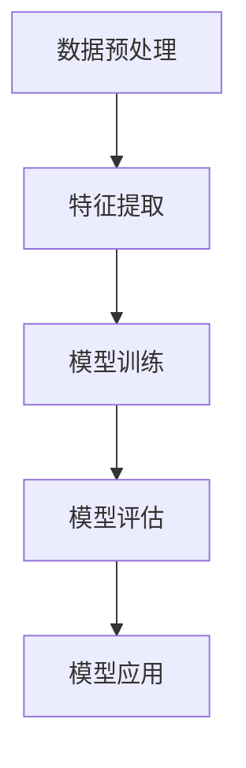
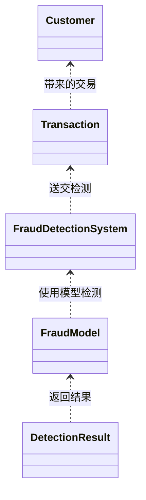
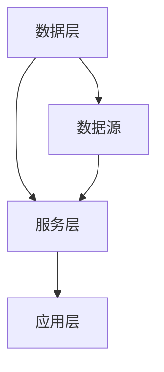

                 


# AI驱动的信用卡fraud检测模型

## 关键词

- 人工智能
- 机器学习
- 深度学习
- 信用卡欺诈检测
- 数据预处理
- 特征工程
- 模型评估

## 摘要

本文将深入探讨AI驱动的信用卡欺诈检测模型。通过详细分析背景、核心概念、算法原理、系统设计与实现，我们旨在提供一幅全面、系统的信用卡欺诈检测解决方案。文章还将分享一些实用的最佳实践，为读者提供有价值的指导。

### 第一部分: 信用卡欺诈检测问题背景

#### 1.1 问题背景

信用卡欺诈是一种普遍存在的金融犯罪行为，其影响深远。每年，信用卡欺诈给银行和消费者带来的经济损失高达数十亿美元。随着信用卡使用频率的增加，信用卡欺诈的问题也日益突出。

AI技术在信用卡欺诈检测中扮演着重要角色。传统的欺诈检测方法主要依赖于规则和统计模型，但这些方法在应对复杂、多变的欺诈行为时显得力不从心。相比之下，AI技术，尤其是机器学习和深度学习，通过自动学习和模式识别，能够在海量数据中发现潜在的欺诈行为，提供更为精准的检测能力。

#### 1.2 核心概念与联系

在深入讨论AI驱动的信用卡欺诈检测模型之前，我们需要明确几个核心概念：

- **AI（人工智能）**: 人工智能是指模拟人类智能行为的计算机系统，包括感知、学习、推理和决策等能力。
- **机器学习（Machine Learning）**: 机器学习是AI的一个分支，通过数据驱动的方式，让计算机自动从数据中学习模式和规律，并做出预测或决策。
- **深度学习（Deep Learning）**: 深度学习是机器学习的一种方法，通过构建具有多层神经元的神经网络，对数据进行复杂的非线性变换和学习。
- **信用卡欺诈（Credit Card Fraud）**: 信用卡欺诈是指不法分子利用信用卡进行非法交易的行为，包括伪造卡、克隆卡、虚假交易等。

这些概念之间存在紧密的联系。例如，机器学习是AI的一个组成部分，而深度学习是机器学习的一种先进技术。在信用卡欺诈检测中，AI技术通过机器学习和深度学习算法，可以从海量的交易数据中识别出欺诈行为。

### 第二部分: AI驱动的信用卡欺诈检测模型原理

#### 2.1 算法原理讲解

AI驱动的信用卡欺诈检测模型通常包括以下步骤：

1. **数据预处理**：对原始交易数据进行清洗、归一化等处理，使其适合模型训练。
2. **特征提取**：从原始数据中提取出与欺诈相关的特征，如交易金额、时间、地理位置等。
3. **模型训练**：使用机器学习或深度学习算法，对特征进行训练，构建欺诈检测模型。
4. **模型评估**：通过测试数据对模型进行评估，调整模型参数，提高检测准确性。
5. **模型应用**：将训练好的模型应用于实际交易数据，进行实时欺诈检测。

下面我们将通过Mermaid流程图来展示这一算法流程：



#### 2.2 数学模型和数学公式

在信用卡欺诈检测中，常用的数学模型和公式包括：

1. **数据预处理公式**：
   $$
   x_{\text{标准化}} = \frac{x_{\text{原始}} - \mu}{\sigma}
   $$
   其中，$x_{\text{原始}}$是原始数据，$\mu$是均值，$\sigma$是标准差。

2. **特征提取公式**：
   $$
   f(x) = \sigma(x)
   $$
   其中，$\sigma$是激活函数，如Sigmoid或ReLU。

3. **损失函数**：
   $$
   J(\theta) = \frac{1}{2m}\sum_{i=1}^{m}(h_\theta(x^{(i)}) - y^{(i)})^2
   $$
   其中，$h_\theta(x)$是模型的预测输出，$y^{(i)}$是真实标签。

4. **模型评估指标**：
   $$
   \text{准确率} = \frac{\text{实际为欺诈的样本中被正确识别为欺诈的样本数}}{\text{所有实际为欺诈的样本数}} + \frac{\text{实际不为欺诈的样本中被正确识别为正常交易的样本数}}{\text{所有实际不为欺诈的样本数}}
   $$

### 第三部分: 信用卡欺诈检测系统设计与实现

#### 3.1 系统功能设计

信用卡欺诈检测系统的核心功能包括：

1. **数据采集**：从不同的数据源（如银行系统、POS机、网络交易等）收集交易数据。
2. **数据预处理**：对收集到的交易数据进行清洗、归一化等处理。
3. **特征提取**：从预处理后的数据中提取出与欺诈相关的特征。
4. **模型训练**：使用提取的特征数据训练欺诈检测模型。
5. **实时检测**：将训练好的模型应用于实时交易数据，进行欺诈检测。
6. **报警与报告**：对检测到的欺诈交易发出警报，并生成报告。

下面是一个使用Mermaid绘制的领域模型类图：



#### 3.2 系统架构设计

信用卡欺诈检测系统的架构设计需要考虑以下几个方面：

1. **数据层**：负责数据采集、存储和预处理。
2. **服务层**：包括特征提取、模型训练和实时检测等功能。
3. **应用层**：提供用户界面，展示检测结果和报警信息。

下面是一个使用Mermaid绘制的系统架构图：



#### 3.3 项目实战

在项目实战中，我们将详细描述如何实现信用卡欺诈检测系统。

1. **环境安装**：首先，需要安装Python环境、机器学习库（如scikit-learn）和深度学习库（如TensorFlow或PyTorch）。
2. **数据预处理**：读取交易数据，进行清洗和归一化处理。
3. **特征提取**：根据业务需求，提取与欺诈相关的特征。
4. **模型训练**：使用机器学习或深度学习算法训练欺诈检测模型。
5. **模型评估**：使用测试数据评估模型性能。
6. **实时检测**：将模型部署到生产环境，对实时交易数据进行检测。

下面是一个简单的Python代码示例，用于数据预处理：

```python
import pandas as pd
from sklearn.preprocessing import StandardScaler

# 读取交易数据
data = pd.read_csv('transactions.csv')

# 数据清洗
data = data.dropna()

# 数据归一化
scaler = StandardScaler()
data[['amount', 'time']] = scaler.fit_transform(data[['amount', 'time']])

# 特征提取
features = data[['amount', 'time', 'location']]
labels = data['is_fraud']

# 模型训练（此处简化为线性分类器）
from sklearn.linear_model import LogisticRegression
model = LogisticRegression()
model.fit(features, labels)

# 模型评估
from sklearn.metrics import accuracy_score
predictions = model.predict(features)
accuracy = accuracy_score(labels, predictions)
print("Accuracy:", accuracy)
```

### 第四部分: 最佳实践、小结与注意事项

#### 最佳实践

1. **数据质量至关重要**：确保交易数据的准确性、完整性和一致性，这对于模型的性能至关重要。
2. **特征工程**：精心设计特征，提取与欺诈相关的高质量特征，可以提高模型的准确性。
3. **模型选择**：根据数据特点和业务需求，选择合适的模型，深度学习模型在处理复杂数据时往往表现更好。
4. **持续监控与更新**：实时监控模型性能，定期更新模型，以应对新的欺诈手段。

#### 小结

本文详细介绍了AI驱动的信用卡欺诈检测模型，从背景介绍到核心概念、算法原理、系统设计与实现，再到最佳实践。通过本文，读者可以全面了解信用卡欺诈检测的原理和实践方法。

#### 注意事项

1. **数据隐私**：在处理信用卡交易数据时，必须严格遵守数据隐私法规，确保用户信息的安全。
2. **性能优化**：为了提高系统的响应速度，需要优化模型的计算性能和资源利用。
3. **实时检测**：确保系统实时检测能力，快速识别并响应欺诈交易。

#### 拓展阅读

- **机器学习基础**：深入理解机器学习的基本概念、算法和应用。
- **深度学习技术**：学习深度学习的基本原理、架构和应用案例。
- **信用卡欺诈检测研究**：阅读相关研究论文，了解最新的研究成果和技术趋势。

### 结语

AI驱动的信用卡欺诈检测模型在金融行业中具有广泛应用和巨大潜力。通过本文的介绍，希望读者能够掌握这一技术的核心原理和实践方法，为构建安全、高效的信用卡欺诈检测系统提供有力支持。

#### 作者信息

作者：AI天才研究院/AI Genius Institute & 禅与计算机程序设计艺术 /Zen And The Art of Computer Programming

