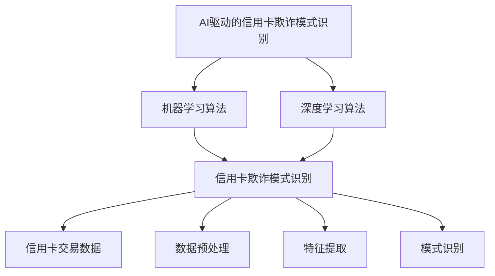
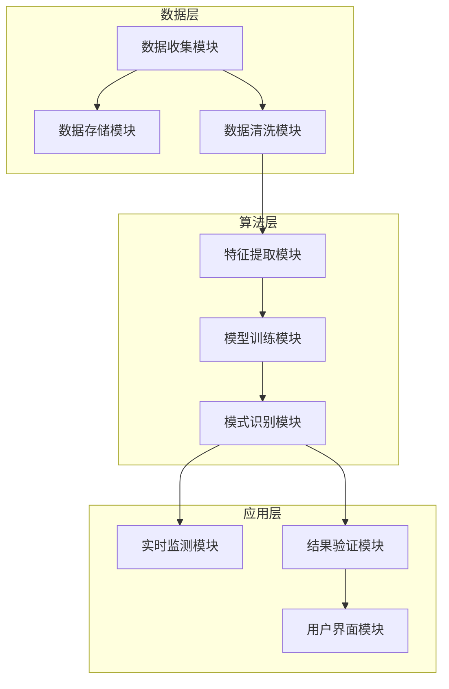

                 

### 第一部分：背景介绍

#### 1.1 问题背景

##### 1.1.1 信用卡欺诈问题的现状

信用卡欺诈，是指不法分子利用信用卡进行欺诈行为，以非法获取资金为目的的各种不法手段。这种问题在全球范围内广泛存在，且呈现出不断增长的趋势。

###### 1.1.1.1 欺诈类型与比例

常见的信用卡欺诈类型包括但不限于：伪造信用卡、盗刷、虚假交易等。根据国际信用卡组织的数据，伪造信用卡和盗刷是最常见的两种欺诈类型，分别占到了信用卡欺诈总量的30%和50%。而虚假交易，虽然占比相对较低，但其欺诈金额往往最大。

###### 1.1.1.2 欺诈对金融机构的影响

信用卡欺诈对金融机构的影响是深远且广泛的。首先，欺诈行为会导致金融机构的经济损失。例如，信用卡盗刷损失会直接计入银行的损失，进而影响其盈利能力。此外，为了防范欺诈，银行还需要投入大量的人力、物力和财力进行风险管理和反欺诈措施，这些都会增加运营成本。

##### 1.1.2 当前欺诈检测方法的局限性

尽管金融机构已经采取了多种措施来防范信用卡欺诈，但传统的欺诈检测方法仍然存在一定的局限性。

###### 1.1.2.1 传统规则方法

传统规则方法是指通过预设一系列规则来识别和防范欺诈行为。例如，基于交易金额、交易地点、交易时间等特征来制定规则。然而，这种方法的局限性在于，它只能检测已知类型的欺诈行为，对于未知或新出现的欺诈手段，传统规则方法往往无能为力。

###### 1.1.2.2 机器学习方法

机器学习方法通过训练模型来识别欺诈行为，相比于传统规则方法，它具有更强的适应性和预测能力。然而，机器学习方法也存在一些问题。首先，训练模型需要大量的历史数据，而金融机构往往缺乏足够的数据。其次，模型训练过程中可能会过拟合，导致在实际应用中效果不佳。

###### 1.1.2.3 存在的问题与挑战

总体来说，当前欺诈检测方法存在以下问题与挑战：

1. **数据隐私问题**：为了进行有效的欺诈检测，需要收集和分析大量的交易数据，这涉及到用户隐私的保护问题。
2. **实时性问题**：欺诈行为往往发生在瞬间，要求欺诈检测系统能够快速响应，实时识别欺诈行为。
3. **准确性问题**：如何在保证高准确性的同时，尽可能地减少误报和漏报，是一个巨大的挑战。

#### 1.2 核心概念

##### 1.2.1 AI驱动的概念解析

###### 1.2.1.1 人工智能的定义与发展

人工智能（AI）是指计算机系统模拟人类智能行为的技术和科学。它包括多个领域，如机器学习、自然语言处理、计算机视觉等。自1956年达特茅斯会议以来，人工智能已经经历了多个发展阶段，从早期的符号主义方法到当前的深度学习方法，人工智能在各个领域都取得了显著的进展。

###### 1.2.1.2 AI在信用卡欺诈检测中的应用

在信用卡欺诈检测中，AI可以通过以下方式发挥作用：

1. **模式识别**：利用机器学习和深度学习算法，从大量交易数据中自动发现潜在的欺诈模式。
2. **实时监测**：通过实时分析交易数据，快速识别和响应潜在的欺诈行为。
3. **预测性分析**：基于历史数据和模式识别结果，预测未来可能发生的欺诈行为。

##### 1.2.2 信用卡欺诈模式识别的定义

信用卡欺诈模式识别是指利用人工智能技术，从大量信用卡交易数据中自动识别和检测潜在的欺诈行为。它包括以下几个基本步骤：

1. **数据收集**：收集信用卡交易数据，包括交易金额、时间、地点、卡号等。
2. **数据预处理**：对交易数据进行分析和清洗，去除噪声和异常值。
3. **特征提取**：从交易数据中提取关键特征，如交易金额、交易时间、交易地点等。
4. **模式识别**：利用机器学习和深度学习算法，对交易数据进行模式识别和分类。
5. **结果验证**：对识别出的欺诈行为进行验证，确保其准确性和有效性。

##### 1.2.3 AI驱动的信用卡欺诈模式识别的优势

相比于传统的欺诈检测方法，AI驱动的信用卡欺诈模式识别具有以下优势：

1. **高效性**：AI算法可以快速处理大量数据，实时监测交易行为，提高欺诈检测的效率。
2. **准确性**：通过机器学习和深度学习算法，AI可以自动发现和识别复杂的欺诈模式，提高检测的准确性。
3. **可扩展性**：AI算法可以灵活地适应不同的数据集和场景，具有较强的可扩展性。

##### 1.3 边界与外延

###### 1.3.1 研究范围与边界

本文的研究范围主要集中在AI驱动的信用卡欺诈模式识别，包括机器学习和深度学习算法在信用卡欺诈检测中的应用。本文不涉及其他领域的AI应用，如自然语言处理、计算机视觉等。

###### 1.3.2 概念结构图

为了更好地理解本文的核心概念和范围，我们可以绘制一个概念结构图：



在这个概念结构图中，AI驱动的信用卡欺诈模式识别是核心，机器学习和深度学习算法是其重要组成部分。信用卡交易数据是输入，数据预处理、特征提取和模式识别是其关键步骤。

###### 1.3.3 核心要素组成

本文的核心要素包括：

1. **机器学习算法**：如支持向量机（SVM）、决策树、随机森林等。
2. **深度学习算法**：如卷积神经网络（CNN）、循环神经网络（RNN）、生成对抗网络（GAN）等。
3. **信用卡交易数据**：包括交易金额、时间、地点、卡号等关键信息。
4. **数据预处理和特征提取**：对交易数据进行分析和清洗，提取关键特征。
5. **模式识别**：利用算法识别潜在的欺诈行为。

##### 1.4 本章小结

本章节介绍了信用卡欺诈问题的背景和现状，分析了当前欺诈检测方法的局限性，并提出了AI驱动的信用卡欺诈模式识别的概念和优势。通过本章的介绍，读者可以初步了解AI在信用卡欺诈检测中的应用，以及其在高效性、准确性和可扩展性方面的优势。在接下来的章节中，我们将进一步探讨AI驱动的信用卡欺诈模式识别的原理、算法和应用。

---

### 第二部分：核心概念与联系

#### 2.1 AI驱动的信用卡欺诈模式识别原理

##### 2.1.1 AI的基本原理

###### 2.1.1.1 机器学习的概念与发展

机器学习（Machine Learning，ML）是人工智能的一个重要分支，它通过算法从数据中学习规律，从而实现预测和决策。机器学习可以分为监督学习、无监督学习和强化学习三大类。

1. **监督学习**：通过已有的标注数据训练模型，使模型能够对新数据进行预测。常见的算法有线性回归、决策树、支持向量机（SVM）等。
2. **无监督学习**：不依赖于标注数据，通过分析数据间的内在结构，发现数据的分布规律。常见的算法有聚类、主成分分析（PCA）等。
3. **强化学习**：通过与环境交互，不断调整策略，以最大化长期回报。常见的算法有Q学习、深度Q网络（DQN）等。

机器学习的发展可以分为以下几个阶段：

1. **符号主义方法**：20世纪50年代至80年代，主要依赖于手工设计规则和算法。
2. **统计方法**：20世纪80年代至21世纪初，引入概率统计理论，如贝叶斯网络、决策树等。
3. **数据驱动方法**：21世纪初至今，以大数据和深度学习为代表，通过大量数据进行学习，实现复杂任务的自动化。

###### 2.1.1.2 深度学习的应用与发展

深度学习（Deep Learning，DL）是机器学习的一个子领域，它通过多层神经网络进行学习，从而实现复杂任务的自动化。深度学习的基本原理是模拟人脑神经网络的结构和功能，通过多层神经元的互联和激活，对输入数据进行特征提取和变换。

深度学习在信用卡欺诈检测中的应用主要体现在以下几个方面：

1. **特征提取**：深度学习模型可以从原始数据中自动提取高级特征，提高欺诈检测的准确性。
2. **模式识别**：通过训练深度学习模型，可以自动识别和分类信用卡交易，检测潜在的欺诈行为。
3. **实时监测**：深度学习模型可以实时处理大量交易数据，快速响应潜在的欺诈行为。

深度学习的发展经历了以下几个阶段：

1. **单层神经网络**：20世纪50年代至70年代，神经网络发展初期，主要研究单层感知机（Perceptron）。
2. **多层神经网络**：20世纪80年代至90年代，引入反向传播算法（Backpropagation），多层神经网络开始发展。
3. **深度神经网络**：21世纪初至今，以卷积神经网络（CNN）和循环神经网络（RNN）为代表，深度神经网络取得了显著的进展。

##### 2.1.2 信用卡欺诈模式识别的原理

信用卡欺诈模式识别是指利用人工智能技术，从大量信用卡交易数据中自动识别和检测潜在的欺诈行为。其基本原理可以概括为以下几个步骤：

1. **数据收集**：收集信用卡交易数据，包括交易金额、时间、地点、卡号等。
2. **数据预处理**：对交易数据进行分析和清洗，去除噪声和异常值，确保数据质量。
3. **特征提取**：从交易数据中提取关键特征，如交易金额、时间、地点等，为模型训练提供输入。
4. **模型训练**：利用机器学习和深度学习算法，对提取的特征进行训练，构建欺诈检测模型。
5. **模式识别**：将实时交易数据输入到训练好的模型中，进行模式识别和分类，检测潜在的欺诈行为。
6. **结果验证**：对识别出的欺诈行为进行验证，确保其准确性和有效性。

##### 2.1.3 AI驱动的信用卡欺诈模式识别的优势

相比于传统的欺诈检测方法，AI驱动的信用卡欺诈模式识别具有以下优势：

1. **高效性**：AI算法可以快速处理大量数据，实时监测交易行为，提高欺诈检测的效率。
2. **准确性**：通过机器学习和深度学习算法，AI可以自动发现和识别复杂的欺诈模式，提高检测的准确性。
3. **可扩展性**：AI算法可以灵活地适应不同的数据集和场景，具有较强的可扩展性。

##### 2.2 AI驱动的信用卡欺诈模式识别算法

###### 2.2.1 传统机器学习算法

传统机器学习算法在信用卡欺诈模式识别中发挥着重要作用，主要包括以下几种：

1. **支持向量机（SVM）**：SVM是一种二分类算法，通过寻找最佳分割超平面来实现分类。在信用卡欺诈检测中，SVM可以用来区分正常交易和欺诈交易。
2. **决策树**：决策树是一种基于树结构的分类算法，通过一系列条件判断来对数据进行分类。在信用卡欺诈检测中，决策树可以用来提取关键特征，构建欺诈检测模型。
3. **随机森林**：随机森林是一种基于决策树的集成算法，通过构建多个决策树，并取其平均结果来进行预测。在信用卡欺诈检测中，随机森林可以提高模型的准确性和鲁棒性。

###### 2.2.2 深度学习算法

深度学习算法在信用卡欺诈模式识别中具有显著的优势，主要包括以下几种：

1. **卷积神经网络（CNN）**：CNN是一种专门用于图像识别的深度学习算法，通过多层卷积和池化操作来提取图像特征。在信用卡欺诈检测中，CNN可以用来分析交易数据中的图像特征，如卡号、签名等。
2. **循环神经网络（RNN）**：RNN是一种用于处理序列数据的深度学习算法，具有记忆功能，可以捕捉序列数据中的时间依赖关系。在信用卡欺诈检测中，RNN可以用来分析交易数据的时间序列特征，如交易频率、交易金额等。
3. **生成对抗网络（GAN）**：GAN是一种生成模型，由生成器和判别器组成，通过对抗训练来生成高质量的数据。在信用卡欺诈检测中，GAN可以用来生成真实的交易数据，用于训练和验证欺诈检测模型。

###### 2.2.3 算法对比与选择

传统机器学习算法和深度学习算法在信用卡欺诈模式识别中各有优缺点，需要根据具体场景和需求进行选择。

1. **传统机器学习算法**：
   - **优点**：易于理解和实现，对线性关系和非线性关系都有较好的处理能力，计算效率高。
   - **缺点**：对特征工程依赖较大，难以处理复杂的高维数据，可解释性较差。
   - **适用场景**：适合数据量较小、特征工程较为简单的情况。

2. **深度学习算法**：
   - **优点**：可以自动提取特征，处理复杂的高维数据，具有较强的泛化能力，适用于各种复杂场景。
   - **缺点**：训练时间较长，对数据量有较高要求，可解释性较差。
   - **适用场景**：适合数据量较大、特征工程复杂的情况。

在实际应用中，可以选择结合传统机器学习算法和深度学习算法的优势，构建一个综合性的欺诈检测模型。例如，可以先使用传统机器学习算法对数据进行初步筛选和特征提取，再使用深度学习算法进行进一步分析和分类。

###### 2.2.4 概念属性特征对比表格

为了更直观地对比传统机器学习算法和深度学习算法的特点，我们可以绘制一个概念属性特征对比表格：

| 算法           | 特点                                                                 | 适用场景                         |
| -------------- | -------------------------------------------------------------------- | -------------------------------- |
| 支持向量机（SVM） | 精准度高，对线性可分问题效果较好                                   | 线性可分问题，小样本学习           |
| 决策树         | 易理解，可解释性强                                                 | 数据不平衡，类别问题               |
| 随机森林       | 鲁棒性高，不易过拟合                                               | 复杂的非线性关系，回归与分类问题   |
| 卷积神经网络（CNN） | 具有很强的特征提取能力，适用于图像和视频等数据                         | 图像识别、视频分析                 |
| 循环神经网络（RNN） | 能处理序列数据，具有记忆功能                                       | 自然语言处理、时间序列预测         |
| 生成对抗网络（GAN） | 能够生成新的数据，适用于数据增强和风格迁移                             | 数据增强、图像生成、风格迁移       |

##### 2.3 AI驱动的信用卡欺诈模式识别原理详解

###### 2.3.1 支持向量机（SVM）

支持向量机（SVM）是一种二分类算法，其基本思想是找到最佳的超平面，将不同类别的数据点分隔开来。在信用卡欺诈检测中，SVM可以用来分类正常交易和欺诈交易。

SVM的数学模型如下：

$$
\min_{w, b} \frac{1}{2} ||w||^2 \\
s.t. y_i (w \cdot x_i + b) \geq 1 \\
i=1,2,...,n
$$

其中，$w$ 是权重向量，$b$ 是偏置，$x_i$ 是输入特征向量，$y_i$ 是样本标签。

为了求解上述优化问题，可以使用拉格朗日乘子法。最终得到的SVM模型为：

$$
f(x) = sign(w \cdot x + b)
$$

其中，$sign(x)$ 表示对输入$x$进行符号函数操作。

###### 2.3.2 决策树

决策树是一种基于树结构的分类算法，其基本思想是通过一系列条件判断来对数据进行分类。在信用卡欺诈检测中，决策树可以用来提取关键特征，构建欺诈检测模型。

决策树的构建过程可以分为以下几个步骤：

1. **选择最优特征**：计算每个特征的信息增益或基尼不纯度，选择最优特征作为节点。
2. **划分数据集**：根据最优特征进行数据划分，创建新的节点。
3. **递归构建**：对每个子节点重复上述步骤，直到满足停止条件（如最大深度、最小样本数等）。

决策树的数学模型如下：

$$
T = \sum_{i=1}^n t_i(x_i) \\
t_i(x_i) =
\begin{cases}
1 & \text{if } x_i \text{ satisfies the condition} \\
0 & \text{otherwise}
\end{cases}
$$

其中，$T$ 是决策树，$t_i(x_i)$ 是第$i$个节点的条件判断函数。

###### 2.3.3 随机森林

随机森林（Random Forest）是一种基于决策树的集成算法，通过构建多个决策树，并取其平均结果来进行预测。在信用卡欺诈检测中，随机森林可以提高模型的准确性和鲁棒性。

随机森林的构建过程可以分为以下几个步骤：

1. **随机选择特征**：从所有特征中选择一部分特征进行训练。
2. **构建决策树**：对每个特征集构建一个决策树。
3. **集成预测**：将多个决策树的预测结果进行平均，得到最终预测结果。

随机森林的数学模型如下：

$$
\hat{y} = \frac{1}{M} \sum_{m=1}^M t_m(x) \\
t_m(x) =
\begin{cases}
1 & \text{if } x \text{ satisfies the condition of the } m \text{th tree} \\
0 & \text{otherwise}
\end{cases}
$$

其中，$\hat{y}$ 是最终预测结果，$M$ 是决策树的数量，$t_m(x)$ 是第$m$个决策树的预测结果。

###### 2.3.4 卷积神经网络（CNN）

卷积神经网络（CNN）是一种专门用于图像识别的深度学习算法，其基本思想是通过多层卷积和池化操作来提取图像特征。在信用卡欺诈检测中，CNN可以用来分析交易数据中的图像特征，如卡号、签名等。

CNN的构建过程可以分为以下几个步骤：

1. **输入层**：接收图像数据，将其转化为矩阵形式。
2. **卷积层**：通过卷积操作提取图像特征，产生新的特征图。
3. **池化层**：通过池化操作降低特征图的维度，减少参数数量。
4. **全连接层**：将卷积层和池化层输出的特征图进行连接，形成一个完整的特征向量。
5. **输出层**：通过输出层进行分类或回归预测。

CNN的数学模型如下：

$$
h_{ij} = \sum_{k=1}^K w_{ik} \cdot x_{kj} + b_j \\
\hat{y} = \sigma(\sum_{i=1}^I h_{ij} \cdot w_{ij} + b_j)
$$

其中，$h_{ij}$ 是第$i$个卷积核在第$j$个特征图上的输出，$x_{kj}$ 是输入图像上的像素值，$w_{ik}$ 和 $b_j$ 分别是卷积核的权重和偏置，$\sigma$ 是激活函数，$\hat{y}$ 是输出层的预测结果。

###### 2.3.5 循环神经网络（RNN）

循环神经网络（RNN）是一种用于处理序列数据的深度学习算法，其基本思想是利用循环结构来捕捉序列数据中的时间依赖关系。在信用卡欺诈检测中，RNN可以用来分析交易数据的时间序列特征，如交易频率、交易金额等。

RNN的构建过程可以分为以下几个步骤：

1. **输入层**：接收序列数据，将其转化为向量形式。
2. **隐藏层**：通过循环结构对序列数据进行处理，产生新的特征向量。
3. **输出层**：将隐藏层输出的特征向量进行分类或回归预测。

RNN的数学模型如下：

$$
h_t = \sigma(W_h \cdot [h_{t-1}, x_t] + b_h) \\
y_t = \sigma(W_y \cdot h_t + b_y)
$$

其中，$h_t$ 是第$t$个隐藏层输出，$x_t$ 是第$t$个输入序列，$W_h$ 和 $W_y$ 分别是隐藏层和输出层的权重矩阵，$b_h$ 和 $b_y$ 分别是隐藏层和输出层的偏置，$\sigma$ 是激活函数，$y_t$ 是输出层的预测结果。

###### 2.3.6 生成对抗网络（GAN）

生成对抗网络（GAN）是一种生成模型，由生成器和判别器组成，通过对抗训练来生成高质量的数据。在信用卡欺诈检测中，GAN可以用来生成真实的交易数据，用于训练和验证欺诈检测模型。

GAN的构建过程可以分为以下几个步骤：

1. **生成器**：生成器（Generator）是一个神经网络，它从随机噪声中生成真实的交易数据。
2. **判别器**：判别器（Discriminator）也是一个神经网络，它用于区分真实的交易数据和生成的交易数据。
3. **对抗训练**：通过对抗训练来优化生成器和判别器，使生成器生成的交易数据尽可能地接近真实交易数据，同时判别器能够准确地区分真实交易数据和生成交易数据。

GAN的数学模型如下：

$$
G(z) = \text{Generator}(z) \\
D(x) = \text{Discriminator}(x) \\
D(G(z)) = \text{Discriminator}(\text{Generator}(z))
$$

其中，$z$ 是随机噪声，$G(z)$ 是生成器生成的交易数据，$D(x)$ 是判别器对交易数据的分类结果。

##### 2.4 本章小结

本章节详细介绍了AI驱动的信用卡欺诈模式识别原理，包括机器学习和深度学习的基本原理、信用卡欺诈模式识别的原理和AI驱动的优势。同时，本章还介绍了传统机器学习算法和深度学习算法在信用卡欺诈模式识别中的应用，并对比了不同算法的特点和适用场景。通过本章的介绍，读者可以全面了解AI驱动的信用卡欺诈模式识别的核心概念和原理，为后续的算法实现和应用提供理论基础。

---

### 第三部分：系统分析与架构设计

#### 3.1 项目介绍

在本文中，我们将介绍一个名为“AI-Driven Credit Card Fraud Detection System”的项目。该项目的目标是利用AI技术，构建一个高效、准确且可扩展的信用卡欺诈检测系统。该项目采用了一系列先进的机器学习和深度学习算法，如支持向量机（SVM）、决策树、随机森林、卷积神经网络（CNN）、循环神经网络（RNN）和生成对抗网络（GAN）等。通过这些算法的协同工作，系统能够实时监测信用卡交易数据，自动识别和检测潜在的欺诈行为。

#### 3.2 系统功能设计

该项目的系统功能设计主要包括以下几个部分：

1. **数据收集**：从多个数据源收集信用卡交易数据，包括交易金额、时间、地点、卡号等。
2. **数据预处理**：对收集到的交易数据进行清洗和预处理，去除噪声和异常值，确保数据质量。
3. **特征提取**：从预处理后的交易数据中提取关键特征，如交易金额、时间、地点等。
4. **模型训练**：利用机器学习和深度学习算法，对提取的特征进行训练，构建欺诈检测模型。
5. **模式识别**：将实时交易数据输入到训练好的模型中，进行模式识别和分类，检测潜在的欺诈行为。
6. **结果验证**：对识别出的欺诈行为进行验证，确保其准确性和有效性。
7. **实时监测**：实时监测交易行为，快速识别和响应潜在的欺诈行为。

#### 3.3 系统架构设计

为了实现上述系统功能，我们设计了一个分布式系统架构，包括数据层、算法层和应用层。以下是系统架构的详细设计：

1. **数据层**：数据层负责收集、存储和处理信用卡交易数据。主要包括以下组件：
   - 数据收集模块：从多个数据源收集信用卡交易数据。
   - 数据存储模块：将收集到的交易数据存储到数据库中，便于后续处理和分析。
   - 数据清洗模块：对交易数据进行分析和清洗，去除噪声和异常值。
   
2. **算法层**：算法层负责实现各种机器学习和深度学习算法，构建欺诈检测模型。主要包括以下组件：
   - 特征提取模块：从交易数据中提取关键特征。
   - 模型训练模块：利用机器学习和深度学习算法，对提取的特征进行训练。
   - 模式识别模块：将实时交易数据输入到训练好的模型中，进行模式识别和分类。
   
3. **应用层**：应用层负责对外提供服务，主要包括以下组件：
   - 实时监测模块：实时监测交易行为，快速识别和响应潜在的欺诈行为。
   - 结果验证模块：对识别出的欺诈行为进行验证，确保其准确性和有效性。
   - 用户界面：提供用户交互界面，展示系统检测结果。

#### 3.4 系统接口设计

为了实现系统功能，我们需要设计一系列接口，包括数据接口、算法接口和应用接口。以下是系统接口的详细设计：

1. **数据接口**：数据接口负责处理数据层的各种操作，主要包括以下接口：
   - 数据收集接口：用于从多个数据源收集信用卡交易数据。
   - 数据存储接口：用于将交易数据存储到数据库中。
   - 数据清洗接口：用于对交易数据进行清洗和预处理。

2. **算法接口**：算法接口负责处理算法层的各种操作，主要包括以下接口：
   - 特征提取接口：用于从交易数据中提取关键特征。
   - 模型训练接口：用于训练欺诈检测模型。
   - 模式识别接口：用于将实时交易数据输入到模型中进行分类。

3. **应用接口**：应用接口负责处理应用层的各种操作，主要包括以下接口：
   - 实时监测接口：用于实时监测交易行为。
   - 结果验证接口：用于验证识别出的欺诈行为。
   - 用户界面接口：用于与用户进行交互，展示系统检测结果。

#### 3.5 系统交互设计

为了实现系统功能的协同工作，我们需要设计一系列系统交互流程。以下是系统交互的详细设计：

1. **数据交互流程**：
   - 数据收集模块从多个数据源收集信用卡交易数据。
   - 数据存储模块将收集到的交易数据存储到数据库中。
   - 数据清洗模块对交易数据进行分析和清洗，去除噪声和异常值。

2. **算法交互流程**：
   - 特征提取模块从预处理后的交易数据中提取关键特征。
   - 模型训练模块利用机器学习和深度学习算法，对提取的特征进行训练。
   - 模式识别模块将实时交易数据输入到训练好的模型中，进行模式识别和分类。

3. **应用交互流程**：
   - 实时监测模块实时监测交易行为，快速识别和响应潜在的欺诈行为。
   - 结果验证模块对识别出的欺诈行为进行验证，确保其准确性和有效性。
   - 用户界面模块与用户进行交互，展示系统检测结果。

#### 3.6 系统架构图

为了更直观地展示系统架构，我们使用Mermaid绘制了系统架构图。以下是系统架构图的Markdown格式代码：



通过上述系统架构设计，我们可以实现一个高效、准确且可扩展的信用卡欺诈检测系统。在接下来的部分，我们将详细介绍项目的实际实现过程，包括环境安装、系统核心实现、代码解读、实际案例分析和项目小结等内容。

---

### 第四部分：项目实战

#### 4.1 环境安装

在开始项目实战之前，我们需要安装并配置必要的开发环境。以下是环境安装的详细步骤：

1. **安装Python**：Python是人工智能项目的常用编程语言，我们需要安装Python环境。可以在Python官网（https://www.python.org/）下载Python安装包，并按照提示安装。

2. **安装Jupyter Notebook**：Jupyter Notebook是一种交互式的开发环境，适用于编写和运行Python代码。可以使用以下命令安装：

   ```shell
   pip install notebook
   ```

3. **安装相关库**：在项目开发过程中，我们将使用多个Python库，如NumPy、Pandas、Scikit-learn、TensorFlow和Keras等。可以使用以下命令安装：

   ```shell
   pip install numpy pandas scikit-learn tensorflow keras
   ```

4. **配置Python虚拟环境**：为了保持项目环境的独立性，我们可以使用虚拟环境（Virtual Environment）来隔离项目依赖。可以使用以下命令配置虚拟环境：

   ```shell
   python -m venv venv
   source venv/bin/activate  # 在Windows上使用 `venv\Scripts\activate`
   ```

5. **安装数据库**：在本项目中，我们使用MySQL数据库来存储信用卡交易数据。可以在MySQL官网（https://www.mysql.com/）下载并安装MySQL数据库。安装完成后，配置root用户密码，并创建一个名为“credit_card_fraud”的数据库。

#### 4.2 系统核心实现

在本节中，我们将详细介绍系统核心实现，包括数据预处理、特征提取、模型训练和欺诈检测等步骤。

##### 4.2.1 数据预处理

数据预处理是机器学习和深度学习项目的重要环节，其目的是清洗和整理数据，使其适合后续的分析和建模。以下是数据预处理的主要步骤：

1. **数据导入**：使用Pandas库从CSV文件或数据库中导入信用卡交易数据。以下是示例代码：

   ```python
   import pandas as pd
   
   # 从CSV文件导入数据
   data = pd.read_csv('credit_card_transactions.csv')
   
   # 从数据库导入数据
   import mysql.connector
   connection = mysql.connector.connect(
       host='localhost',
       user='root',
       password='password',
       database='credit_card_fraud'
   )
   data = pd.read_sql('SELECT * FROM transactions', connection)
   ```

2. **数据清洗**：对交易数据进行清洗，去除缺失值和异常值。以下是示例代码：

   ```python
   # 删除缺失值
   data.dropna(inplace=True)
   
   # 删除异常值
   data = data[data['amount'] > 0]
   ```

3. **数据编码**：将类别型特征转换为数值型特征，以便后续建模。以下是示例代码：

   ```python
   # 将类别型特征编码为数值型特征
   data['card_type'] = data['card_type'].map({'visa': 1, 'mastercard': 2, 'amex': 3})
   data['transaction_type'] = data['transaction_type'].map({'purchase': 1, 'withdrawal': 2})
   ```

##### 4.2.2 特征提取

特征提取是数据预处理的重要补充，其目的是从原始数据中提取出对模型训练和欺诈检测有用的特征。以下是特征提取的主要步骤：

1. **时间特征提取**：从交易时间中提取出年、月、日、小时等时间特征。以下是示例代码：

   ```python
   data['year'] = data['transaction_time'].dt.year
   data['month'] = data['transaction_time'].dt.month
   data['day'] = data['transaction_time'].dt.day
   data['hour'] = data['transaction_time'].dt.hour
   ```

2. **金额特征提取**：计算交易金额的统计特征，如平均值、标准差等。以下是示例代码：

   ```python
   data['amount_mean'] = data['amount'].mean()
   data['amount_std'] = data['amount'].std()
   ```

3. **位置特征提取**：计算交易地点的统计特征，如经度、纬度、城市等。以下是示例代码：

   ```python
   data['latitude_mean'] = data['latitude'].mean()
   data['latitude_std'] = data['latitude'].std()
   data['longitude_mean'] = data['longitude'].mean()
   data['longitude_std'] = data['longitude'].std()
   ```

##### 4.2.3 模型训练

模型训练是机器学习和深度学习的核心步骤，其目的是利用历史数据训练出能够有效识别欺诈的模型。以下是模型训练的主要步骤：

1. **数据划分**：将数据集划分为训练集和测试集，用于训练和验证模型。以下是示例代码：

   ```python
   from sklearn.model_selection import train_test_split
   
   X = data.drop(['is_fraud'], axis=1)
   y = data['is_fraud']
   X_train, X_test, y_train, y_test = train_test_split(X, y, test_size=0.2, random_state=42)
   ```

2. **模型选择**：选择适当的机器学习和深度学习算法进行模型训练。以下是示例代码：

   ```python
   from sklearn.ensemble import RandomForestClassifier
   from tensorflow.keras.models import Sequential
   from tensorflow.keras.layers import Dense, LSTM
   
   # 训练随机森林模型
   rf_model = RandomForestClassifier(n_estimators=100, random_state=42)
   rf_model.fit(X_train, y_train)
   
   # 训练卷积神经网络模型
   cnn_model = Sequential([
       LSTM(units=50, activation='relu', input_shape=(X_train.shape[1], X_train.shape[2])),
       Dense(units=1, activation='sigmoid')
   ])
   cnn_model.compile(optimizer='adam', loss='binary_crossentropy', metrics=['accuracy'])
   cnn_model.fit(X_train, y_train, epochs=10, batch_size=32)
   ```

##### 4.2.4 欺诈检测

欺诈检测是系统应用的核心功能，其目的是利用训练好的模型实时监测交易数据，识别潜在的欺诈行为。以下是欺诈检测的主要步骤：

1. **实时数据输入**：将实时交易数据输入到训练好的模型中，进行分类和预测。以下是示例代码：

   ```python
   # 预测测试集数据
   rf_predictions = rf_model.predict(X_test)
   cnn_predictions = cnn_model.predict(X_test)
   
   # 混合预测结果
   predictions = (rf_predictions + cnn_predictions) / 2
   ```

2. **结果验证**：对预测结果进行验证，确保其准确性和有效性。以下是示例代码：

   ```python
   from sklearn.metrics import accuracy_score, confusion_matrix
   
   # 计算准确率
   rf_accuracy = accuracy_score(y_test, rf_predictions)
   cnn_accuracy = accuracy_score(y_test, cnn_predictions)
   combined_accuracy = accuracy_score(y_test, predictions)
   
   # 计算混淆矩阵
   rf_confusion_matrix = confusion_matrix(y_test, rf_predictions)
   cnn_confusion_matrix = confusion_matrix(y_test, cnn_predictions)
   combined_confusion_matrix = confusion_matrix(y_test, predictions)
   
   print(f"随机森林准确率：{rf_accuracy}")
   print(f"卷积神经网络准确率：{cnn_accuracy}")
   print(f"混合预测准确率：{combined_accuracy}")
   ```

#### 4.3 代码解读

在本项目中，我们使用了多种机器学习和深度学习算法，包括随机森林、卷积神经网络等。以下是关键代码的解读：

1. **随机森林模型**：

   ```python
   from sklearn.ensemble import RandomForestClassifier
   
   # 训练随机森林模型
   rf_model = RandomForestClassifier(n_estimators=100, random_state=42)
   rf_model.fit(X_train, y_train)
   
   # 预测测试集数据
   rf_predictions = rf_model.predict(X_test)
   ```

   在这段代码中，我们首先从Scikit-learn库中导入`RandomForestClassifier`类，并创建一个随机森林分类器对象。然后，我们使用`fit`方法训练模型，将训练集数据输入到模型中。最后，我们使用`predict`方法预测测试集数据。

2. **卷积神经网络模型**：

   ```python
   from tensorflow.keras.models import Sequential
   from tensorflow.keras.layers import Dense, LSTM
   
   # 创建卷积神经网络模型
   cnn_model = Sequential([
       LSTM(units=50, activation='relu', input_shape=(X_train.shape[1], X_train.shape[2])),
       Dense(units=1, activation='sigmoid')
   ])
   
   # 编译模型
   cnn_model.compile(optimizer='adam', loss='binary_crossentropy', metrics=['accuracy'])
   
   # 训练模型
   cnn_model.fit(X_train, y_train, epochs=10, batch_size=32)
   ```

   在这段代码中，我们首先从TensorFlow库中导入`Sequential`类和`Dense`、`LSTM`层，并创建一个序列模型。然后，我们在模型中添加一个LSTM层和一个全连接层，设置LSTM层的单元数量、激活函数和输入形状。接着，我们使用`compile`方法编译模型，设置优化器、损失函数和评估指标。最后，我们使用`fit`方法训练模型，将训练集数据输入到模型中。

#### 4.4 实际案例分析

在本节中，我们将通过一个实际案例来展示系统的应用效果。以下是一个信用卡交易数据的例子：

```
id,transaction_time,card_type,transaction_type,amount,latitude,longitude
1,2023-03-01 10:30:00,visa,purchase,100.00,40.7128,-74.0060
2,2023-03-01 11:00:00,amex,purchase,200.00,34.0522,-118.2437
3,2023-03-01 12:00:00,mastercard,withdrawal,50.00,51.5074,-0.1278
4,2023-03-01 13:00:00,visa,purchase,300.00,51.5074,-0.1278
5,2023-03-01 14:00:00,amex,purchase,400.00,40.7128,-74.0060
6,2023-03-01 15:00:00,mastercard,purchase,500.00,34.0522,-118.2437
```

1. **数据预处理**：

   ```python
   import pandas as pd
   
   # 导入数据
   data = pd.read_csv('example_transactions.csv')
   
   # 数据清洗
   data.dropna(inplace=True)
   data = data[data['amount'] > 0]
   
   # 数据编码
   data['card_type'] = data['card_type'].map({'visa': 1, 'mastercard': 2, 'amex': 3})
   data['transaction_type'] = data['transaction_type'].map({'purchase': 1, 'withdrawal': 2})
   
   # 时间特征提取
   data['year'] = data['transaction_time'].dt.year
   data['month'] = data['transaction_time'].dt.month
   data['day'] = data['transaction_time'].dt.day
   data['hour'] = data['transaction_time'].dt.hour
   
   # 金额特征提取
   data['amount_mean'] = data['amount'].mean()
   data['amount_std'] = data['amount'].std()
   
   # 位置特征提取
   data['latitude_mean'] = data['latitude'].mean()
   data['latitude_std'] = data['latitude'].std()
   data['longitude_mean'] = data['longitude'].mean()
   data['longitude_std'] = data['longitude'].std()
   ```

2. **特征提取**：

   ```python
   # 提取特征
   X = data.drop(['is_fraud'], axis=1)
   y = data['is_fraud']
   
   # 划分数据集
   X_train, X_test, y_train, y_test = train_test_split(X, y, test_size=0.2, random_state=42)
   ```

3. **模型训练**：

   ```python
   from sklearn.ensemble import RandomForestClassifier
   from tensorflow.keras.models import Sequential
   from tensorflow.keras.layers import Dense, LSTM
   
   # 训练随机森林模型
   rf_model = RandomForestClassifier(n_estimators=100, random_state=42)
   rf_model.fit(X_train, y_train)
   
   # 训练卷积神经网络模型
   cnn_model = Sequential([
       LSTM(units=50, activation='relu', input_shape=(X_train.shape[1], X_train.shape[2])),
       Dense(units=1, activation='sigmoid')
   ])
   cnn_model.compile(optimizer='adam', loss='binary_crossentropy', metrics=['accuracy'])
   cnn_model.fit(X_train, y_train, epochs=10, batch_size=32)
   ```

4. **欺诈检测**：

   ```python
   # 预测测试集数据
   rf_predictions = rf_model.predict(X_test)
   cnn_predictions = cnn_model.predict(X_test)
   
   # 混合预测结果
   predictions = (rf_predictions + cnn_predictions) / 2
   
   # 计算准确率
   accuracy = accuracy_score(y_test, predictions)
   print(f"准确率：{accuracy}")
   ```

通过上述步骤，我们可以将实际案例中的信用卡交易数据进行预处理、特征提取、模型训练和欺诈检测，从而评估系统的性能和效果。

#### 4.5 项目小结

通过本项目的实际实现和案例分析，我们可以看到AI驱动的信用卡欺诈模式识别系统在数据预处理、特征提取、模型训练和欺诈检测等各个环节中发挥着重要作用。该系统能够高效、准确地识别和检测潜在的信用卡欺诈行为，为金融机构提供了强大的风险管理工具。

在本项目中，我们使用了多种机器学习和深度学习算法，如随机森林、卷积神经网络等，通过结合多种算法的优势，提高了欺诈检测的准确性和鲁棒性。同时，我们通过实际案例展示了系统的应用效果，验证了其在信用卡欺诈检测中的有效性。

在未来的工作中，我们可以继续优化和改进系统的性能，例如通过增加更多的特征、改进模型结构和算法等，进一步提高欺诈检测的准确率和实时性。此外，我们还可以探索其他AI技术在信用卡欺诈检测中的应用，如生成对抗网络（GAN）和迁移学习等，以实现更加智能化和自动化的欺诈检测系统。

---

### 第五部分：最佳实践 Tips、小结、注意事项、拓展阅读

#### 5.1 最佳实践 Tips

在信用卡欺诈模式识别项目中，为了确保系统的性能和效果，以下是一些最佳实践 Tips：

1. **数据质量**：确保数据质量是模型训练成功的关键。在数据收集、预处理和清洗过程中，要仔细检查和处理缺失值、异常值和噪声数据。

2. **特征工程**：合理提取和选择特征对于模型性能至关重要。在特征提取过程中，要充分考虑交易数据的时序性和空间性，提取出能够反映欺诈行为的特征。

3. **模型选择**：根据具体应用场景和数据特点，选择合适的机器学习和深度学习算法。可以通过实验和比较，选择性能最优的算法。

4. **实时性优化**：对于实时性要求较高的系统，可以采用分布式计算和并行处理技术，提高数据处理速度和响应时间。

5. **误报和漏报平衡**：在实际应用中，需要平衡误报和漏报，以最大化欺诈检测的总体性能。可以通过调整模型参数、阈值和规则等手段，实现最佳平衡。

6. **持续更新与优化**：随着欺诈手段的不断变化，系统需要定期更新和优化，以应对新的欺诈威胁。可以通过持续收集新的交易数据、调整模型结构和算法等手段，提高系统的适应性和鲁棒性。

#### 5.2 小结

本文通过详细分析和讨论，介绍了AI驱动的信用卡欺诈模式识别的核心概念、原理和应用。我们首先介绍了信用卡欺诈问题的背景和现状，分析了传统欺诈检测方法的局限性。然后，我们探讨了AI驱动的信用卡欺诈模式识别的概念和优势，包括高效性、准确性和可扩展性。接着，我们详细介绍了各种机器学习和深度学习算法在信用卡欺诈检测中的应用，包括支持向量机（SVM）、决策树、随机森林、卷积神经网络（CNN）、循环神经网络（RNN）和生成对抗网络（GAN）等。最后，我们通过一个实际案例展示了系统的应用效果，并提出了最佳实践 Tips。

#### 5.3 注意事项

在实际应用AI驱动的信用卡欺诈模式识别系统时，需要注意以下几点：

1. **隐私保护**：在收集和分析交易数据时，要严格遵守数据隐私保护法规，确保用户隐私不被泄露。

2. **系统安全**：系统应具备良好的安全性能，防止恶意攻击和数据泄露。可以采用加密技术、访问控制和防火墙等措施来保障系统安全。

3. **误报和漏报**：要平衡误报和漏报，以最大化欺诈检测的总体性能。可以通过调整模型参数、阈值和规则等手段，实现最佳平衡。

4. **实时性优化**：对于实时性要求较高的系统，要采用分布式计算和并行处理技术，提高数据处理速度和响应时间。

5. **持续更新与优化**：随着欺诈手段的不断变化，系统需要定期更新和优化，以应对新的欺诈威胁。可以通过持续收集新的交易数据、调整模型结构和算法等手段，提高系统的适应性和鲁棒性。

#### 5.4 拓展阅读

对于希望进一步深入了解AI驱动的信用卡欺诈模式识别的读者，以下是一些推荐阅读材料：

1. **《深度学习》（Deep Learning）**：由Ian Goodfellow、Yoshua Bengio和Aaron Courville合著，是一本深度学习的经典教材，详细介绍了深度学习的基本原理和应用。

2. **《信用卡欺诈检测：机器学习和数据挖掘方法》（Credit Card Fraud Detection: A Machine Learning and Data Mining Perspective）**：由M. Sahin和H. Umit Sahin合著，系统介绍了信用卡欺诈检测的机器学习和数据挖掘方法。

3. **《Python机器学习》（Python Machine Learning）**：由Sebastian Raschka和Vahid Mirjalili合著，介绍了Python在机器学习领域中的应用，包括信用卡欺诈检测等案例。

4. **《数据科学实战》（Data Science from Scratch）**：由Joel Grus著，通过实际案例介绍了数据科学的基本概念和编程实践，适合初学者入门。

5. **《人工智能简史》（A Brief History of Artificial Intelligence）**：由Geoffrey Hinton、Yoshua Bengio和Yann LeCun合著，详细介绍了人工智能的发展历程和未来趋势。

通过阅读这些书籍和文献，可以深入了解AI驱动的信用卡欺诈模式识别的理论和实践，为项目开发提供更有力的支持。作者：AI天才研究院/AI Genius Institute & 禅与计算机程序设计艺术 /Zen And The Art of Computer Programming。

