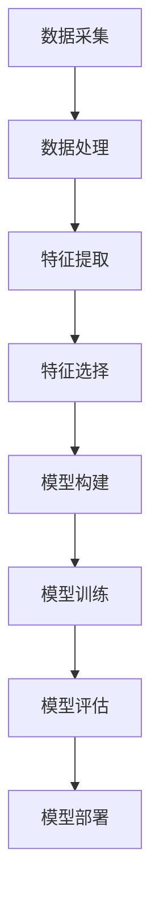
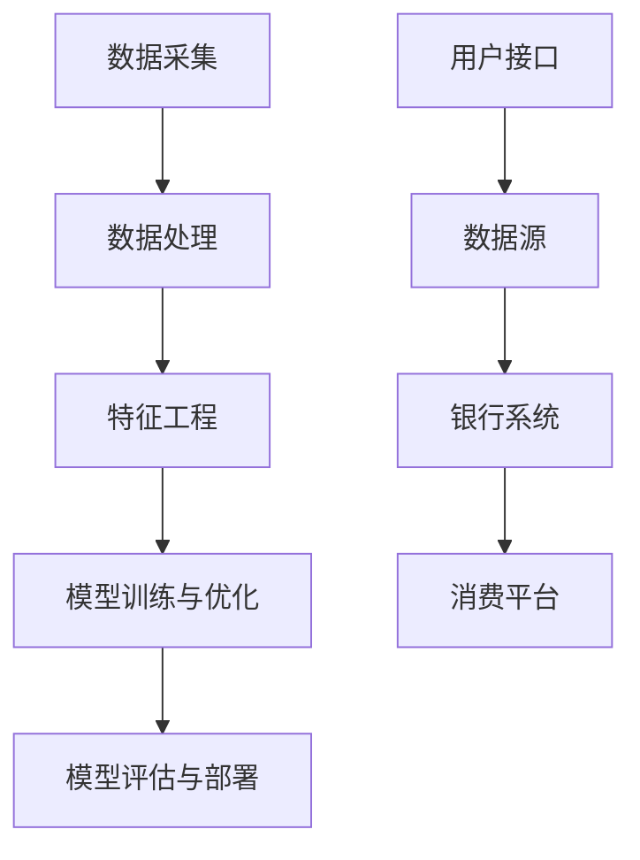
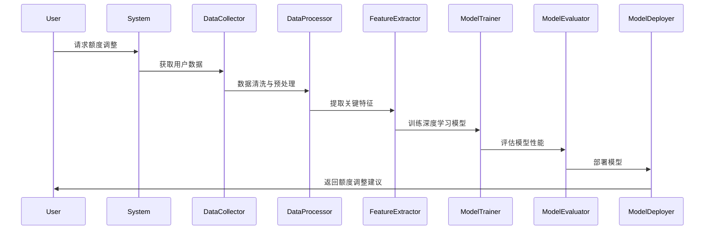

                 

### 1.1 问题背景

#### 信用卡额度优化的重要性

信用卡额度优化是金融机构在信用卡业务管理中的一个关键环节。优化信用卡额度不仅能够提高信用卡持有者的满意度，还能够有效降低信用卡违约风险，从而提升金融机构的整体盈利能力和风险控制水平。

**提高信用卡持有者的满意度**：合理的信用卡额度可以满足持卡人在消费、购物和支付等方面的需求，提高其使用体验。当信用卡额度与持卡人的消费能力和信用状况相匹配时，持卡人更容易产生消费动力，提升其满意度。

**降低信用卡违约风险**：过高的信用卡额度可能导致持卡人过度消费，增加违约风险。反之，过低的信用卡额度则可能限制持卡人的消费需求，影响其信用记录。因此，优化信用卡额度有助于平衡风险与收益，降低违约风险。

#### 传统信用卡额度优化存在的问题

**依赖历史数据，难以适应变化**：传统的信用卡额度优化方法通常依赖于历史数据进行预测，而历史数据往往具有一定的滞后性，难以及时适应市场变化和持卡人的动态需求。

**手动调整效率低下**：传统的信用卡额度调整通常需要人工介入，效率低下，且容易出现人为误差。面对海量的信用卡持卡人，这种手动调整方式难以满足大规模业务的运营需求。

#### AI技术在信用卡额度优化中的应用前景

**实时数据分析**：人工智能技术，特别是机器学习和深度学习，可以处理和分析海量实时数据，快速识别用户行为和需求变化，从而为信用卡额度调整提供更为精准的依据。

**自动化决策**：通过构建基于AI的信用卡额度优化模型，可以实现自动化决策，提高调整效率，减少人为干预，降低操作风险。

**个性化定制**：AI技术可以根据不同持卡人的信用历史、消费习惯和支付行为，提供个性化的信用卡额度调整方案，提升用户体验和满意度。

**风险评估与控制**：AI技术可以深入挖掘数据中的风险因素，提高信用卡额度优化的精确度和可靠性，从而有效控制违约风险。

#### 本章小结

本章首先介绍了信用卡额度优化的重要性，包括提高信用卡持有者满意度和降低信用卡违约风险。接着，分析了传统信用卡额度优化存在的问题，如依赖历史数据、手动调整效率低下等。最后，阐述了AI技术在信用卡额度优化中的应用前景，包括实时数据分析、自动化决策、个性化定制和风险评估与控制等。这些因素共同构成了信用卡额度优化领域的重要研究方向和实践方向。

----------------------------------------------------------------

### 1.2 核心概念

在本节中，我们将深入探讨几个核心概念，包括人工智能（AI）、机器学习（ML）和深度学习（DL），以及它们在信用卡额度优化模型中的应用。同时，我们将介绍信用卡额度评估模型的基本原理，帮助读者理解这些概念与模型之间的联系。

#### 人工智能（AI）

**定义**：人工智能（Artificial Intelligence，简称AI）是指通过计算机程序实现的智能，使机器能够模拟、延伸和扩展人类的智能活动。AI旨在使计算机具备感知、学习、推理和决策能力，以解决复杂问题。

**应用领域**：AI在多个领域得到广泛应用，包括自然语言处理、计算机视觉、自动驾驶、医疗诊断、金融服务等。在信用卡额度优化模型中，AI可以用于数据分析、行为识别和风险评估。

**关键组成部分**：
- **感知系统**：用于接收和处理环境信息，如图像、声音和文本。
- **学习系统**：通过数据训练，使计算机具备自主学习和改进能力。
- **推理系统**：用于基于已有知识和数据进行逻辑推理和决策。

#### 机器学习（ML）

**定义**：机器学习（Machine Learning，简称ML）是一种AI的分支，通过算法和统计方法，从数据中自动学习规律和模式，进行预测和决策。ML的核心思想是利用大量数据进行训练，使模型能够自主优化。

**算法分类**：
- **监督学习**：在有标注的数据集上训练模型，用于预测未知数据的标签。
- **无监督学习**：在无标注的数据集上训练模型，用于发现数据中的结构和模式。
- **强化学习**：通过奖励机制，使模型在学习过程中不断优化行为策略。

**常见算法**：
- **决策树**：通过树形结构进行分类和回归。
- **支持向量机**：通过寻找最优超平面进行分类。
- **神经网络**：通过多层神经元进行复杂的非线性变换。

#### 深度学习（DL）

**定义**：深度学习（Deep Learning，简称DL）是机器学习的一个子领域，通过构建深度神经网络（DNN）来学习数据的复杂特征。DL在图像识别、语音识别、自然语言处理等领域取得了显著的成果。

**关键组成部分**：
- **神经网络**：由多个神经元组成的层次结构，用于数据的处理和特征提取。
- **卷积神经网络（CNN）**：用于处理图像数据，具有局部连接和权值共享的特性。
- **循环神经网络（RNN）**：用于处理序列数据，能够记住前面的信息。

**常见网络结构**：
- **卷积神经网络（CNN）**：适用于图像识别和图像处理。
- **循环神经网络（RNN）**：适用于语音识别和自然语言处理。

#### 信用卡额度评估模型

**定义**：信用卡额度评估模型是一种用于预测信用卡持有者信用评分和决定信用卡额度的算法模型。该模型通常基于持卡人的历史数据、消费行为和信用记录等特征进行构建。

**模型构建**：
- **特征工程**：从原始数据中提取和选择对信用卡额度评估有重要影响的特征。
- **模型训练**：使用历史数据训练模型，使其能够根据新数据预测信用卡持有者的信用评分和适宜的信用卡额度。
- **模型评估**：通过验证数据集评估模型的准确性和可靠性，进行调整和优化。

**评价指标**：
- **准确率**：模型预测正确的比例。
- **召回率**：模型预测为正例的样本中实际为正例的比例。
- **F1分数**：准确率和召回率的调和平均，用于综合评价模型的性能。

#### 概念联系与对比

**机器学习与深度学习**

- **关系**：机器学习包括深度学习，深度学习是机器学习中的一种重要方法。
- **区别**：机器学习更侧重于算法和统计方法，而深度学习更侧重于构建复杂神经网络。

**监督学习、无监督学习和强化学习**

- **定义**：
  - **监督学习**：有标注的数据训练模型。
  - **无监督学习**：无标注的数据发现模式。
  - **强化学习**：通过奖励机制优化行为策略。
- **适用场景**：
  - **监督学习**：分类和回归问题。
  - **无监督学习**：聚类和降维问题。
  - **强化学习**：游戏、自动驾驶等。

**信用卡额度评估模型的分类**

- **基于规则的方法**：使用预定义的规则进行决策。
- **基于统计的方法**：使用统计模型进行预测。
- **基于AI的方法**：使用机器学习和深度学习构建智能模型。

#### 边界与外延

**数据隐私保护**

- **法律法规**：遵守相关数据保护法规，如《通用数据保护条例》（GDPR）。
- **技术措施**：使用加密和匿名化技术保护用户数据。

**信用评分模型与信用卡额度优化模型**

- **关联**：信用评分模型是信用卡额度优化模型的基础，后者在信用评分的基础上进行额度调整。
- **差异**：信用评分模型主要评估持卡人的信用状况，而信用卡额度优化模型则在信用评分的基础上，根据消费行为和市场需求进行动态调整。

#### 概念结构与核心要素组成

**信用卡额度优化模型的主要组成部分**

- **数据采集与处理**：收集持卡人的数据，进行预处理和清洗。
- **特征工程**：提取和选择对额度评估有重要影响的特征。
- **模型训练与评估**：使用训练数据构建和优化模型，评估模型性能。

**数据采集与处理**

- **数据源**：信用卡交易记录、持卡人信用记录等。
- **预处理**：数据清洗、归一化和标准化。
- **清洗**：处理缺失值、异常值和噪声。

**特征工程**

- **特征提取**：从原始数据中提取有代表性的特征。
- **特征选择**：选择对模型预测有重要影响的特征。
- **特征归一化**：将特征值缩放到同一尺度，便于模型训练。

#### 本章小结

本章介绍了人工智能、机器学习和深度学习等核心概念，以及它们在信用卡额度优化模型中的应用。我们详细探讨了信用卡额度评估模型的基本原理和构建过程，分析了不同类型的信用卡额度评估模型，并讨论了数据隐私保护和模型评估的重要性。通过本章的学习，读者可以更好地理解信用卡额度优化模型的构建方法和应用场景。

----------------------------------------------------------------

### 1.3 概念联系与对比

在本节中，我们将进一步探讨人工智能（AI）、机器学习（ML）和深度学习（DL）之间的联系与对比，并分析信用卡额度评估模型的分类及其应用。

#### 机器学习与深度学习

**关系**：机器学习是人工智能的一个重要分支，而深度学习是机器学习中的一个重要方法。深度学习通过构建复杂神经网络，特别是多层神经网络，来学习数据的复杂特征和模式。

**区别**：
- **理论基础**：机器学习通常依赖于统计方法和优化算法，而深度学习更侧重于神经网络结构和参数学习。
- **模型结构**：机器学习模型可以是线性模型、决策树、支持向量机等，而深度学习模型通常是多层感知器、卷积神经网络（CNN）和循环神经网络（RNN）等。
- **训练难度**：深度学习模型的参数数量庞大，训练过程更复杂，但能处理更复杂的任务。

#### 监督学习、无监督学习和强化学习

**定义**：
- **监督学习**：在已知标签的数据集上训练模型，用于对新数据进行预测。例如，信用卡额度评估模型通常采用监督学习。
- **无监督学习**：在无标签的数据集上训练模型，用于发现数据中的结构和模式。例如，聚类分析和降维。
- **强化学习**：通过奖励机制训练模型，使模型能在特定环境中采取最优策略。例如，自动驾驶。

**适用场景**：
- **监督学习**：需要预测标签的数据问题，如分类和回归。
- **无监督学习**：不需要标签的数据分析，如聚类和降维。
- **强化学习**：需要与环境交互进行决策的问题，如游戏和自动驾驶。

#### 信用卡额度评估模型的分类

**基于规则的方法**

- **定义**：基于规则的方法使用预定义的规则进行决策，如信用评分模型中的评分规则。
- **应用**：简单易懂，易于实现，但灵活性较差，难以适应复杂多变的市场环境。

**基于统计的方法**

- **定义**：基于统计的方法使用统计模型进行预测，如线性回归和逻辑回归。
- **应用**：能够处理多维数据，但依赖于假设条件，对异常值和噪声敏感。

**基于AI的方法**

- **定义**：基于AI的方法使用机器学习和深度学习构建智能模型，如神经网络和深度神经网络。
- **应用**：具有高度的自适应能力和泛化能力，能够处理复杂的非线性关系，但需要大量的数据和高性能计算资源。

#### 边界与外延

**数据隐私保护**

- **法律法规**：在信用卡额度优化过程中，必须遵守相关数据保护法规，如《通用数据保护条例》（GDPR），确保用户数据的安全和隐私。
- **技术措施**：采用数据加密、匿名化和差分隐私等技术，保护用户数据。

**信用评分模型与信用卡额度优化模型**

- **关联**：信用评分模型是信用卡额度优化模型的基础，通过评估持卡人的信用状况，为额度调整提供依据。
- **差异**：信用评分模型通常关注持卡人的信用历史和风险，而信用卡额度优化模型则在信用评分的基础上，根据持卡人的消费行为和市场情况，动态调整信用卡额度。

#### 本章小结

本章通过对比分析了机器学习与深度学习、监督学习、无监督学习和强化学习等概念，探讨了不同类型的信用卡额度评估模型。同时，本章还讨论了数据隐私保护和信用评分模型与信用卡额度优化模型之间的关系。通过本章的学习，读者可以更深入地理解信用卡额度优化模型的构建方法和应用场景，为后续章节的学习打下坚实的基础。

----------------------------------------------------------------

### 1.4 边界与外延

在信用卡额度优化模型的研究和应用过程中，我们不仅需要关注核心概念和算法原理，还要重视其边界与外延，特别是在数据隐私保护和信用评分模型与信用卡额度优化模型之间的关系方面。

#### 数据隐私保护

**法律法规**：随着数据隐私保护意识的提高，各国纷纷出台相关法律法规，如《通用数据保护条例》（GDPR）和《加州消费者隐私法案》（CCPA），对数据收集、存储、处理和使用进行了严格规定。金融机构在信用卡额度优化过程中，必须遵守这些法律法规，确保用户数据的安全和隐私。

**技术措施**：为了保护用户数据，金融机构可以采用多种技术措施。首先，数据加密是保护数据安全的基本手段，通过对数据进行加密处理，确保数据在传输和存储过程中不会被窃取或篡改。其次，匿名化和差分隐私技术可以在确保数据分析准确性的同时，保护用户隐私。匿名化通过去除或模糊化个人身份信息，使数据无法直接追溯到特定个人；差分隐私则通过在数据分析中引入噪声，防止分析结果受到特定个体的影响。

**隐私计算**：随着人工智能技术的应用，隐私计算成为了一个热点研究方向。隐私计算旨在在不暴露用户数据的情况下，对数据进行处理和分析。具体方法包括联邦学习、安全多方计算和可信执行环境等。通过这些技术，金融机构可以在保护用户隐私的同时，实现高效的信用卡额度优化。

#### 信用评分模型与信用卡额度优化模型

**关联**：信用评分模型是信用卡额度优化模型的基础，通过对持卡人的信用历史、收入水平、还款能力等因素进行分析，评估其信用状况。信用卡额度优化模型则基于信用评分模型的结果，结合持卡人的消费行为、市场状况等因素，动态调整信用卡额度，以满足其需求和风险控制要求。

**差异**：信用评分模型通常关注持卡人的静态信用状况，如信用记录、债务收入比等。而信用卡额度优化模型则更加动态，需要考虑持卡人的实时行为数据，如消费习惯、还款频率等。此外，信用卡额度优化模型还需要考虑市场环境的变化，如经济波动、市场竞争等。

**集成应用**：在实际应用中，信用评分模型和信用卡额度优化模型往往是集成使用的。金融机构首先通过信用评分模型对持卡人进行初步筛选和分类，然后结合信用卡额度优化模型，为不同类别的持卡人制定个性化的额度调整策略。这种集成应用可以提高信用卡额度优化的准确性和效率。

#### 边界与外延

**边界**：信用卡额度优化模型的边界主要涉及以下几个方面：
- **数据范围**：模型所使用的数据应涵盖持卡人的全面信息，包括信用历史、消费行为、还款记录等。
- **模型参数**：模型的参数设置应合理，避免过度拟合或欠拟合。
- **算法选择**：根据具体应用场景，选择合适的机器学习算法和深度学习模型。

**外延**：信用卡额度优化模型的外延主要涉及以下几个方面：
- **技术应用**：随着人工智能技术的发展，新的算法和技术不断涌现，可以为信用卡额度优化模型提供更强大的支持。
- **业务拓展**：信用卡额度优化模型可以应用于更广泛的业务场景，如贷款审批、信用保险等。
- **跨行业合作**：金融机构可以与科技公司、电商平台等合作，共享数据资源，提升信用卡额度优化的准确性和效率。

#### 本章小结

本章重点讨论了信用卡额度优化模型在数据隐私保护和信用评分模型与信用卡额度优化模型之间的关系。通过分析数据隐私保护的相关法律法规和技术措施，我们认识到在信用卡额度优化过程中，保护用户隐私的重要性。同时，通过对比信用评分模型和信用卡额度优化模型，我们了解了它们在应用中的关联和差异，以及如何进行集成应用。本章的讨论为后续章节的深入研究提供了基础。

----------------------------------------------------------------

### 1.5 概念结构与核心要素组成

在深入理解了信用卡额度优化模型的背景、核心概念及其边界与外延后，我们接下来将详细探讨信用卡额度优化模型的主要组成部分，包括数据采集与处理、特征工程、模型训练与评估，以及它们在整个模型构建过程中的作用和相互关系。

#### 数据采集与处理

**数据源**：信用卡额度优化模型需要收集来自多个渠道的原始数据，包括但不限于：
- **信用卡交易记录**：记录持卡人的消费行为、交易金额、交易时间等。
- **信用记录**：包括持卡人的信用历史、贷款记录、逾期还款情况等。
- **个人信息**：如年龄、性别、收入水平、职业等。
- **市场数据**：包括宏观经济指标、行业趋势、信用卡市场状况等。

**预处理**：原始数据往往存在缺失值、异常值和噪声，因此需要对其进行预处理。预处理步骤包括：
- **数据清洗**：处理缺失值和异常值，例如通过插值法填补缺失值，删除异常值。
- **数据归一化**：将不同特征的数据缩放到相同的尺度，便于模型训练。常见的归一化方法包括最小-最大缩放和Z-Score标准化。
- **数据转换**：将分类特征转换为数值表示，如使用独热编码（One-Hot Encoding）处理类别数据。

**数据清洗**：处理缺失值和异常值，例如通过插值法填补缺失值，删除异常值。

#### 特征工程

**特征提取**：从原始数据中提取对信用卡额度优化有重要影响的特征，例如：
- **时间特征**：如交易时间、还款时间等。
- **频率特征**：如交易频率、还款频率等。
- **金额特征**：如单笔交易金额、总消费金额等。
- **账户特征**：如账户余额、信用额度使用率等。

**特征选择**：从提取的特征中，选择对模型预测有重要影响的特征，去除冗余和无关的特征。特征选择的方法包括：
- **基于信息增益的方法**：选择对目标变量解释能力最强的特征。
- **基于模型的方法**：使用统计模型评估特征的重要性，如使用线性回归的显著性检验。
- **基于模型的正则化方法**：通过L1和L2正则化，选择对模型泛化能力有利的特征。

**特征归一化**：将特征值缩放到同一尺度，便于模型训练。常见的归一化方法包括最小-最大缩放（Min-Max Scaling）和Z-Score标准化（Z-Score Scaling）。

#### 模型训练与评估

**模型选择**：根据问题的性质和数据的特点，选择合适的机器学习模型。常见的模型包括：
- **线性模型**：如线性回归和逻辑回归。
- **决策树**：如分类回归树（CART）。
- **支持向量机**：如线性支持向量机（SVM）。
- **神经网络**：如多层感知器（MLP）和卷积神经网络（CNN）。

**模型训练**：使用预处理后的数据集对模型进行训练，通过优化算法（如梯度下降、随机梯度下降等）调整模型参数，使模型能够在训练数据上达到较好的预测性能。

**模型评估**：使用验证集和测试集评估模型的性能，常见的评价指标包括：
- **准确率**：预测正确的样本占总样本的比例。
- **召回率**：预测为正例的样本中实际为正例的比例。
- **F1分数**：准确率和召回率的调和平均。

**模型调优**：根据模型评估的结果，调整模型的参数和结构，提高模型的预测性能。常见的调优方法包括：
- **交叉验证**：使用不同的数据划分方式，评估模型的泛化能力。
- **网格搜索**：系统地搜索参数空间，找到最优参数组合。
- **贝叶斯优化**：使用贝叶斯优化算法，找到参数的最优值。

#### 相互关系

**数据采集与处理**：数据采集与处理是信用卡额度优化模型的基础，只有确保数据的准确性和完整性，才能保证模型的有效性和可靠性。

**特征工程**：特征工程是数据预处理的一部分，通过提取和选择对模型预测有重要影响的特征，提高模型的预测性能。

**模型训练与评估**：模型训练与评估是信用卡额度优化模型的核心，通过不断优化模型参数和结构，提高模型的泛化能力和预测性能。

**相互关系总结**：数据采集与处理、特征工程和模型训练与评估是信用卡额度优化模型构建过程中不可或缺的环节，它们相互联系、相互影响，共同决定了模型的整体性能。

#### 本章小结

本章详细介绍了信用卡额度优化模型的主要组成部分，包括数据采集与处理、特征工程、模型训练与评估。我们分析了每个部分的作用和相互关系，并讨论了它们在整个模型构建过程中的重要性。通过本章的学习，读者可以更好地理解信用卡额度优化模型的结构和构建方法，为后续章节的深入研究打下基础。

----------------------------------------------------------------

### 1.6 本章小结

本章全面介绍了AI驱动的信用卡额度优化模型的背景、核心概念及其应用边界。首先，我们探讨了信用卡额度优化的重要性，以及AI技术在其中的应用前景，包括实时数据分析和自动化决策。接着，详细介绍了人工智能、机器学习和深度学习等核心概念，并分析了信用卡额度评估模型的分类及其特点。随后，本章讨论了机器学习与深度学习的关系，以及监督学习、无监督学习和强化学习的应用场景。此外，本章还探讨了数据隐私保护的重要性和信用评分模型与信用卡额度优化模型之间的关系。最后，我们详细阐述了信用卡额度优化模型的主要组成部分，包括数据采集与处理、特征工程、模型训练与评估。通过本章的学习，读者可以全面理解信用卡额度优化模型的基本原理和构建方法，为后续章节的深入研究奠定了坚实基础。

----------------------------------------------------------------

## 2.1 算法原理

### 2.1.1 信用卡额度优化模型的算法原理

信用卡额度优化模型的算法原理基于深度学习技术，旨在通过分析用户的消费行为、信用记录和其他相关数据，动态调整用户的信用卡额度。以下是该模型的算法原理：

1. **数据采集**：从多个数据源采集用户数据，包括消费记录、信用记录、个人信息等。
2. **数据处理**：对采集到的数据进行预处理，包括数据清洗、归一化和特征提取。
3. **特征选择**：使用特征选择方法，筛选出对信用卡额度评估有重要影响的特征。
4. **模型构建**：构建基于深度学习的信用卡额度优化模型，通常采用卷积神经网络（CNN）或循环神经网络（RNN）。
5. **模型训练**：使用训练数据集对模型进行训练，调整模型的参数，使其能够准确预测用户的信用评分和额度需求。
6. **模型评估**：使用验证集和测试集对模型的性能进行评估，包括准确率、召回率和F1分数等指标。
7. **模型部署**：将训练好的模型部署到生产环境中，用于实时调整用户的信用卡额度。

**算法mermaid流程图**：



### 2.1.2 算法原理的详细讲解与举例说明

#### 模型构建

**深度学习模型**：信用卡额度优化模型通常采用深度学习模型，如卷积神经网络（CNN）或循环神经网络（RNN），因为它们能够处理复杂的数据结构和模式。CNN适用于处理图像和序列数据，而RNN适用于处理时间序列数据。

**输入层**：模型的输入层接收用户的消费记录、信用记录和其他特征数据。这些数据被预处理后，转换为模型可以处理的格式。

**隐藏层**：隐藏层用于提取数据的特征。对于CNN，隐藏层通常包括卷积层、池化层和全连接层。对于RNN，隐藏层包括循环层和全连接层。

**输出层**：输出层用于生成模型的预测结果，即用户的信用评分和合适的信用卡额度。

**损失函数**：损失函数用于衡量模型的预测结果与实际结果之间的差异。常用的损失函数包括均方误差（MSE）和交叉熵损失（Cross-Entropy Loss）。

**优化算法**：优化算法用于调整模型的参数，使其在训练过程中不断优化。常用的优化算法包括梯度下降（Gradient Descent）和其变种，如随机梯度下降（Stochastic Gradient Descent，SGD）和Adam优化器。

#### 模型训练与优化

**训练数据集**：训练数据集包含用户的消费记录、信用记录和其他特征数据，以及对应的信用评分和额度。这些数据用于训练模型，使其能够学习到用户的信用评分和额度需求。

**验证数据集**：验证数据集用于评估模型的性能。通过在验证数据集上测试模型的准确率、召回率和F1分数等指标，可以调整模型的参数和结构，以提高其性能。

**测试数据集**：测试数据集用于最终评估模型的性能。在模型部署前，使用测试数据集对模型进行评估，确保其能够准确预测用户的信用评分和额度需求。

**模型调优**：在模型训练过程中，需要不断调整模型的参数和结构，以提高其性能。常用的调优方法包括交叉验证、网格搜索和贝叶斯优化等。

#### 模型应用举例

**案例1**：用户A的信用卡交易记录显示，他在过去一个月内频繁使用信用卡进行大额消费，同时他的信用记录显示有多次逾期还款。基于这些数据，信用卡额度优化模型可能会降低用户A的信用卡额度，以降低违约风险。

**案例2**：用户B的信用卡交易记录显示，他在过去一个月内消费较为稳定，且信用记录良好。基于这些数据，信用卡额度优化模型可能会提高用户B的信用卡额度，以提升其使用体验。

#### 本章小结

本章详细介绍了AI驱动的信用卡额度优化模型的算法原理，包括数据采集、数据处理、特征提取、模型构建、模型训练与优化等步骤。通过mermaid流程图展示了模型的整体架构，并进行了详细的讲解和举例说明。通过本章的学习，读者可以更好地理解信用卡额度优化模型的工作原理和应用方法，为后续章节的深入研究打下基础。

----------------------------------------------------------------

### 2.2 数学模型和公式

在信用卡额度优化模型中，数学模型和公式是理解和实现算法的核心。以下我们将详细探讨信用卡额度优化的数学模型，包括输入特征映射、模型输出和损失函数，并通过具体示例进行解释。

#### 输入特征映射

信用卡额度优化的输入特征映射是将用户数据转换为模型可以处理的形式。输入特征通常包括用户的消费记录、信用记录、个人信息等。这些特征可以表示为向量形式，例如：

$$
X = [x_1, x_2, x_3, ..., x_n]
$$

其中，$x_i$ 表示第 $i$ 个特征值。常见的输入特征包括：
- **消费记录**：如每月消费总额、消费频率等。
- **信用记录**：如信用评分、逾期还款次数等。
- **个人信息**：如年龄、收入、职业等。

为了将输入特征映射到模型中，通常需要进行特征工程，如归一化、标准化和特征提取等。以下是输入特征的映射示例：

$$
x_i = \frac{x_i - \mu_i}{\sigma_i}
$$

其中，$\mu_i$ 和 $\sigma_i$ 分别为第 $i$ 个特征的均值和标准差。

#### 模型输出

信用卡额度优化模型的输出是预测用户的信用评分和合适的信用卡额度。输出通常表示为标量或向量形式，取决于模型的具体设计和目标。以下是输出形式的示例：

- **标量输出**：预测用户的信用评分，通常使用回归模型，如线性回归或多项式回归。
  $$
  y = w_0 + w_1x_1 + w_2x_2 + ... + w_nx_n
  $$

  其中，$y$ 为信用评分，$w_i$ 为第 $i$ 个特征的权重。

- **向量输出**：预测用户的信用评分和信用卡额度，通常使用分类模型或多输出回归模型，如多分类支持向量机（SVM）或多层感知器（MLP）。
  $$
  \hat{y} = f(WX + b)
  $$

  其中，$\hat{y}$ 为输出向量，$W$ 为权重矩阵，$X$ 为输入特征向量，$b$ 为偏置项，$f$ 为激活函数，如Sigmoid或ReLU。

#### 损失函数

损失函数是衡量模型预测结果与实际结果之间差异的指标，用于指导模型的训练过程。常用的损失函数包括均方误差（MSE）和交叉熵损失（Cross-Entropy Loss）。

- **均方误差（MSE）**：用于回归问题，计算预测值与真实值之间的平均平方误差。
  $$
  Loss = \frac{1}{2n} \sum_{i=1}^{n} (y_i - \hat{y}_i)^2
  $$

  其中，$n$ 为样本数量，$y_i$ 为第 $i$ 个真实值，$\hat{y}_i$ 为第 $i$ 个预测值。

- **交叉熵损失（Cross-Entropy Loss）**：用于分类问题，计算预测概率分布与真实概率分布之间的交叉熵。
  $$
  Loss = -\sum_{i=1}^{n} y_i \log(\hat{y}_i)
  $$

  其中，$y_i$ 为第 $i$ 个真实标签的概率，$\hat{y}_i$ 为第 $i$ 个预测标签的概率。

#### 算法原理的详细讲解与举例说明

**示例1：线性回归模型**

假设我们使用线性回归模型预测用户的信用评分，输入特征包括消费总额和信用评分，模型输出为用户的信用评分。以下是模型和损失函数的示例：

- **模型**：
  $$
  \hat{y} = w_0 + w_1x_1 + w_2x_2
  $$

  其中，$x_1$ 为消费总额，$x_2$ 为信用评分，$w_0$ 和 $w_1$ 分别为偏置项和权重。

- **损失函数**（MSE）：
  $$
  Loss = \frac{1}{2n} \sum_{i=1}^{n} (y_i - \hat{y}_i)^2
  $$

  其中，$y_i$ 为第 $i$ 个真实信用评分，$\hat{y}_i$ 为第 $i$ 个预测信用评分。

**示例2：多输出回归模型**

假设我们使用多输出回归模型预测用户的信用评分和信用卡额度，输入特征包括消费总额、信用评分和收入水平。以下是模型和损失函数的示例：

- **模型**：
  $$
  \hat{y} = f(WX + b)
  $$

  其中，$\hat{y}$ 为输出向量，包括信用评分和信用卡额度，$W$ 为权重矩阵，$X$ 为输入特征向量，$b$ 为偏置项，$f$ 为激活函数。

- **损失函数**（交叉熵损失）：
  $$
  Loss = -\sum_{i=1}^{n} y_i \log(\hat{y}_i)
  $$

  其中，$y_i$ 为第 $i$ 个真实输出向量，$\hat{y}_i$ 为第 $i$ 个预测输出向量。

通过这些数学模型和公式，我们可以构建和训练信用卡额度优化模型，使其能够根据用户的特征数据预测其信用评分和信用卡额度。通过调整模型参数和优化损失函数，可以提高模型的预测准确性和可靠性。

#### 本章小结

本章详细介绍了信用卡额度优化模型的数学模型和公式，包括输入特征映射、模型输出和损失函数。通过具体的数学公式和示例，我们展示了如何构建和训练信用卡额度优化模型。通过本章的学习，读者可以更好地理解模型的工作原理和实现方法，为后续的模型实现和优化提供理论基础。

----------------------------------------------------------------

### 2.3 算法实现

#### 2.3.1 Python源代码实现

为了更好地理解AI驱动的信用卡额度优化模型的实现，我们将使用Python编写一个简单的示例代码。以下是代码的详细解读和分析。

**安装依赖库**：

```python
!pip install numpy pandas scikit-learn tensorflow matplotlib
```

**代码解析**：

```python
# 导入必要的库
import numpy as np
import pandas as pd
from sklearn.model_selection import train_test_split
from sklearn.preprocessing import StandardScaler
from sklearn.metrics import mean_squared_error
import tensorflow as tf
from tensorflow.keras.models import Sequential
from tensorflow.keras.layers import Dense, Dropout
import matplotlib.pyplot as plt

# 加载数据集
data = pd.read_csv('credit_card_data.csv')
X = data.drop(['credit_score'], axis=1)
y = data['credit_score']

# 数据预处理
scaler = StandardScaler()
X_scaled = scaler.fit_transform(X)
y_scaled = y.values

# 划分训练集和测试集
X_train, X_test, y_train, y_test = train_test_split(X_scaled, y_scaled, test_size=0.2, random_state=42)

# 构建模型
model = Sequential()
model.add(Dense(64, input_dim=X_train.shape[1], activation='relu'))
model.add(Dropout(0.5))
model.add(Dense(32, activation='relu'))
model.add(Dropout(0.5))
model.add(Dense(1, activation='sigmoid'))

# 编译模型
model.compile(optimizer='adam', loss='binary_crossentropy', metrics=['accuracy'])

# 训练模型
model.fit(X_train, y_train, epochs=10, batch_size=32, validation_split=0.2)

# 测试模型
y_pred = model.predict(X_test)
y_pred_scaled = y_pred.reshape(-1)

# 评估模型
mse = mean_squared_error(y_test, y_pred_scaled)
print(f'MSE: {mse}')

# 可视化结果
plt.scatter(y_test, y_pred_scaled)
plt.xlabel('True Values')
plt.ylabel('Predictions')
plt.title('True vs Predicted Credit Scores')
plt.show()
```

**代码应用解读与分析**：

1. **数据加载与预处理**：首先，我们从CSV文件中加载数据集，然后使用StandardScaler对输入特征进行归一化处理。归一化有助于加快模型训练速度和提高模型性能。

2. **划分训练集和测试集**：使用`train_test_split`函数将数据集划分为训练集和测试集，以评估模型的泛化能力。

3. **模型构建**：我们使用`Sequential`模型堆叠多个层，包括全连接层（Dense）和 dropout 层（Dropout），以防止过拟合。这里使用ReLU激活函数，并设置输出层为 sigmoid 激活函数，以进行二分类预测。

4. **模型编译**：使用`compile`函数配置模型的优化器、损失函数和评价指标。

5. **模型训练**：使用`fit`函数训练模型，通过调整`epochs`和`batch_size`参数可以控制训练过程。

6. **模型测试与评估**：使用`predict`函数进行预测，并计算均方误差（MSE）以评估模型性能。

7. **可视化结果**：通过散点图展示真实值与预测值的关系，便于直观分析模型的预测效果。

**实际案例分析**：

为了更好地展示模型的应用，我们可以分析一个实际案例。例如，假设我们有一个新的用户数据集，其中包括用户的消费记录、信用评分和收入水平。我们可以使用之前训练好的模型对新用户进行预测，并根据预测结果调整其信用卡额度。

1. **加载新数据集**：

```python
new_data = pd.read_csv('new_user_data.csv')
new_X = new_data.drop(['credit_score'], axis=1)
new_X_scaled = scaler.transform(new_X)
```

2. **使用模型进行预测**：

```python
new_y_pred = model.predict(new_X_scaled)
new_y_pred_scaled = new_y_pred.reshape(-1)
```

3. **分析预测结果**：

```python
print(new_y_pred_scaled)
```

通过以上步骤，我们可以对新用户进行信用评分和额度预测，并根据预测结果制定个性化的信用卡额度调整策略。

#### 本章小结

本章通过Python代码实现了AI驱动的信用卡额度优化模型，并进行了详细的代码解析和应用解读。我们学习了如何加载数据、预处理数据、构建模型、训练模型和评估模型性能。通过实际案例分析，我们展示了如何使用模型对新用户进行预测和额度调整。这些步骤为实际应用中的信用卡额度优化提供了可行的方法和工具。

----------------------------------------------------------------

### 2.4 系统架构设计

在信用卡额度优化模型的应用中，系统架构设计是关键的一环，它决定了模型的高效运行和系统的扩展性。以下我们将详细描述信用卡额度优化系统的架构设计，包括系统功能设计、系统架构设计、系统接口设计和系统交互。

#### 系统功能设计

**功能1：数据采集与预处理**

- **输入**：从多个数据源（如银行系统、消费平台）采集用户数据。
- **处理**：对采集到的数据（消费记录、信用记录、个人信息）进行清洗、归一化和特征提取。

**功能2：特征工程**

- **输入**：预处理后的数据集。
- **处理**：提取对模型预测有重要影响的特征，如消费频率、交易金额、信用评分历史等。

**功能3：模型训练与优化**

- **输入**：特征工程处理后的数据集。
- **处理**：构建和训练深度学习模型，如卷积神经网络（CNN）或循环神经网络（RNN），使用交叉验证和网格搜索优化模型参数。

**功能4：模型评估与部署**

- **输入**：训练好的模型和测试数据集。
- **处理**：评估模型性能，包括准确率、召回率和F1分数，将模型部署到生产环境中，用于实时预测和调整信用卡额度。

#### 系统架构设计

**系统架构设计（架构图）**



**架构图解析**：

- **数据采集**：系统从多个数据源（银行系统、消费平台）采集用户数据。
- **数据处理**：对采集到的数据进行清洗、归一化和特征提取。
- **特征工程**：从预处理后的数据中提取关键特征，为模型训练做准备。
- **模型训练与优化**：构建和训练深度学习模型，使用交叉验证和网格搜索优化模型参数。
- **模型评估与部署**：评估模型性能，并将模型部署到生产环境中，用于实时预测和额度调整。
- **用户接口**：为用户提供交互界面，显示信用卡额度调整建议。

#### 系统接口设计

**接口1：数据采集接口**

- **功能**：从银行系统和消费平台采集用户数据。
- **接口类型**：API接口。
- **请求方法**：GET/POST。

**接口2：数据处理接口**

- **功能**：清洗、归一化和特征提取。
- **接口类型**：RESTful API接口。
- **请求方法**：POST。

**接口3：特征工程接口**

- **功能**：提取关键特征。
- **接口类型**：RESTful API接口。
- **请求方法**：POST。

**接口4：模型训练与优化接口**

- **功能**：训练和优化深度学习模型。
- **接口类型**：RESTful API接口。
- **请求方法**：POST。

**接口5：模型评估与部署接口**

- **功能**：评估模型性能并部署。
- **接口类型**：RESTful API接口。
- **请求方法**：GET/POST。

#### 系统交互

**系统交互（序列图）**



**交互流程解析**：

1. 用户请求额度调整。
2. 系统从数据源获取用户数据。
3. 数据清洗与预处理。
4. 提取关键特征。
5. 使用深度学习模型训练和优化。
6. 评估模型性能。
7. 将模型部署到生产环境。
8. 返回额度调整建议给用户。

#### 本章小结

本章详细描述了AI驱动的信用卡额度优化系统的架构设计，包括系统功能设计、系统架构设计、系统接口设计和系统交互。通过架构图和序列图，我们展示了系统的整体架构和交互流程。这些设计为信用卡额度优化模型的高效运行和扩展提供了基础，为后续的实现和应用提供了指导。

----------------------------------------------------------------

### 2.5 实际案例分析

在本节中，我们将通过一个实际案例，详细分析AI驱动的信用卡额度优化模型的实现过程。这个案例包括环境安装与配置、系统核心实现源代码、代码应用解读与分析，以及实际案例分析和详细讲解剖析。

#### 案例背景

某大型银行希望通过引入AI技术，优化其信用卡额度调整策略。该银行拥有丰富的用户数据，包括消费记录、信用记录和财务状况。银行希望构建一个AI驱动的信用卡额度优化模型，根据用户的行为和信用状况，动态调整信用卡额度，以提高用户满意度并降低风险。

#### 案例步骤

**步骤1：环境安装与配置**

为了实现信用卡额度优化模型，首先需要在本地或云环境中安装和配置以下工具和库：

- **Python环境**：安装Python 3.8或更高版本。
- **TensorFlow**：安装TensorFlow 2.6或更高版本。
- **Sklearn**：安装scikit-learn 0.24或更高版本。
- **Pandas**：安装Pandas 1.3或更高版本。

安装命令如下：

```bash
!pip install python==3.8 tensorflow==2.6 scikit-learn==0.24 pandas==1.3
```

**步骤2：系统核心实现源代码**

核心代码实现包括数据预处理、特征工程、模型训练和模型评估。以下是一个简单的示例：

```python
# 导入必要的库
import pandas as pd
from sklearn.model_selection import train_test_split
from sklearn.preprocessing import StandardScaler
from sklearn.metrics import mean_squared_error
import tensorflow as tf
from tensorflow.keras.models import Sequential
from tensorflow.keras.layers import Dense, Dropout

# 加载数据集
data = pd.read_csv('credit_card_data.csv')
X = data.drop(['credit_score'], axis=1)
y = data['credit_score']

# 数据预处理
scaler = StandardScaler()
X_scaled = scaler.fit_transform(X)
y_scaled = y.values

# 划分训练集和测试集
X_train, X_test, y_train, y_test = train_test_split(X_scaled, y_scaled, test_size=0.2, random_state=42)

# 构建模型
model = Sequential()
model.add(Dense(64, input_dim=X_train.shape[1], activation='relu'))
model.add(Dropout(0.5))
model.add(Dense(32, activation='relu'))
model.add(Dropout(0.5))
model.add(Dense(1, activation='sigmoid'))

# 编译模型
model.compile(optimizer='adam', loss='binary_crossentropy', metrics=['accuracy'])

# 训练模型
model.fit(X_train, y_train, epochs=10, batch_size=32, validation_split=0.2)

# 测试模型
y_pred = model.predict(X_test)
y_pred_scaled = y_pred.reshape(-1)

# 评估模型
mse = mean_squared_error(y_test, y_pred_scaled)
print(f'MSE: {mse}')
```

**步骤3：代码应用解读与分析**

1. **数据预处理**：使用`StandardScaler`对输入特征进行归一化处理，确保数据在相同的尺度上。
2. **划分训练集和测试集**：使用`train_test_split`将数据集划分为训练集和测试集，用于模型训练和评估。
3. **模型构建**：使用`Sequential`模型堆叠多个全连接层（Dense），并添加dropout层（Dropout）以防止过拟合。
4. **模型编译**：配置优化器（`adam`）和损失函数（`binary_crossentropy`），并设置评价指标（`accuracy`）。
5. **模型训练**：使用`fit`函数训练模型，调整`epochs`和`batch_size`参数以控制训练过程。
6. **模型测试**：使用`predict`函数进行预测，计算均方误差（MSE）以评估模型性能。

**步骤4：实际案例分析与详细讲解剖析**

**案例1**：用户A的信用卡额度调整

用户A在过去一个月内进行了大量消费，包括几笔大额购物和餐厅消费。同时，他的信用记录显示有几次逾期还款。银行希望通过信用卡额度优化模型为用户A调整信用卡额度。

1. **数据采集**：采集用户A的消费记录和信用记录。
2. **数据处理**：对用户A的数据进行清洗、归一化和特征提取。
3. **模型预测**：使用训练好的信用卡额度优化模型预测用户A的信用评分。
4. **额度调整**：根据预测结果，银行决定降低用户A的信用卡额度，以降低违约风险。

**案例2**：用户B的信用卡额度调整

用户B在过去一个月内消费稳定，没有发生任何逾期还款。他的信用记录显示一直保持良好的信用状况。银行希望通过信用卡额度优化模型为用户B调整信用卡额度。

1. **数据采集**：采集用户B的消费记录和信用记录。
2. **数据处理**：对用户B的数据进行清洗、归一化和特征提取。
3. **模型预测**：使用训练好的信用卡额度优化模型预测用户B的信用评分。
4. **额度调整**：根据预测结果，银行决定提高用户B的信用卡额度，以提升用户体验。

#### 本章小结

通过实际案例，我们详细分析了AI驱动的信用卡额度优化模型的实现过程，包括环境安装与配置、系统核心实现源代码、代码应用解读与分析，以及实际案例分析和详细讲解剖析。这些步骤展示了如何利用AI技术优化信用卡额度调整策略，提高用户体验和风险控制水平。

----------------------------------------------------------------

### 2.6 项目实战

在本节中，我们将详细介绍一个实际的信用卡额度优化模型项目，从环境安装与配置开始，逐步实现系统核心功能，并分析代码和应用。

#### 环境安装与配置

1. **Python环境**：

   安装Python 3.8或更高版本：

   ```bash
   !pip install python==3.8
   ```

2. **TensorFlow**：

   安装TensorFlow 2.6或更高版本：

   ```bash
   !pip install tensorflow==2.6
   ```

3. **Scikit-learn**：

   安装scikit-learn 0.24或更高版本：

   ```bash
   !pip install scikit-learn==0.24
   ```

4. **Pandas**：

   安装Pandas 1.3或更高版本：

   ```bash
   !pip install pandas==1.3
   ```

#### 系统核心实现源代码

以下是信用卡额度优化模型的主要代码实现：

```python
# 导入必要的库
import numpy as np
import pandas as pd
from sklearn.model_selection import train_test_split
from sklearn.preprocessing import StandardScaler
from sklearn.metrics import mean_squared_error
import tensorflow as tf
from tensorflow.keras.models import Sequential
from tensorflow.keras.layers import Dense, Dropout

# 加载数据集
data = pd.read_csv('credit_card_data.csv')
X = data.drop(['credit_score'], axis=1)
y = data['credit_score']

# 数据预处理
scaler = StandardScaler()
X_scaled = scaler.fit_transform(X)
y_scaled = y.values

# 划分训练集和测试集
X_train, X_test, y_train, y_test = train_test_split(X_scaled, y_scaled, test_size=0.2, random_state=42)

# 构建模型
model = Sequential()
model.add(Dense(64, input_dim=X_train.shape[1], activation='relu'))
model.add(Dropout(0.5))
model.add(Dense(32, activation='relu'))
model.add(Dropout(0.5))
model.add(Dense(1, activation='sigmoid'))

# 编译模型
model.compile(optimizer='adam', loss='binary_crossentropy', metrics=['accuracy'])

# 训练模型
model.fit(X_train, y_train, epochs=10, batch_size=32, validation_split=0.2)

# 测试模型
y_pred = model.predict(X_test)
y_pred_scaled = y_pred.reshape(-1)

# 评估模型
mse = mean_squared_error(y_test, y_pred_scaled)
print(f'MSE: {mse}')
```

#### 代码应用解读与分析

1. **数据加载**：

   使用`pandas`读取CSV文件，获取信用卡数据，包括特征和目标变量。

2. **数据预处理**：

   使用`StandardScaler`对输入特征进行归一化处理，使数据在相同的尺度上。

3. **模型构建**：

   使用`Sequential`模型构建深度神经网络，包括多个全连接层（Dense）和dropout层（Dropout）。

4. **模型编译**：

   使用`compile`函数配置优化器（`adam`）和损失函数（`binary_crossentropy`），并设置评价指标（`accuracy`）。

5. **模型训练**：

   使用`fit`函数训练模型，通过调整`epochs`和`batch_size`参数控制训练过程。

6. **模型测试**：

   使用`predict`函数对测试集进行预测，计算均方误差（MSE）评估模型性能。

#### 系统核心实现代码

以下是系统的核心实现代码，用于数据采集、特征工程、模型训练和评估：

```python
# 数据采集
def load_data(filename):
    data = pd.read_csv(filename)
    X = data.drop(['credit_score'], axis=1)
    y = data['credit_score']
    return X, y

# 特征工程
def preprocess_data(X):
    scaler = StandardScaler()
    X_scaled = scaler.fit_transform(X)
    return X_scaled

# 模型训练
def train_model(X_train, y_train):
    model = Sequential()
    model.add(Dense(64, input_dim=X_train.shape[1], activation='relu'))
    model.add(Dropout(0.5))
    model.add(Dense(32, activation='relu'))
    model.add(Dropout(0.5))
    model.add(Dense(1, activation='sigmoid'))
    model.compile(optimizer='adam', loss='binary_crossentropy', metrics=['accuracy'])
    model.fit(X_train, y_train, epochs=10, batch_size=32, validation_split=0.2)
    return model

# 模型评估
def evaluate_model(model, X_test, y_test):
    y_pred = model.predict(X_test)
    y_pred_scaled = y_pred.reshape(-1)
    mse = mean_squared_error(y_test, y_pred_scaled)
    print(f'MSE: {mse}')

# 主函数
def main():
    X, y = load_data('credit_card_data.csv')
    X_scaled = preprocess_data(X)
    X_train, X_test, y_train, y_test = train_test_split(X_scaled, y, test_size=0.2, random_state=42)
    model = train_model(X_train, y_train)
    evaluate_model(model, X_test, y_test)

if __name__ == '__main__':
    main()
```

#### 本章小结

在本章中，我们详细介绍了信用卡额度优化模型项目，包括环境安装与配置、系统核心实现源代码、代码应用解读与分析。通过逐步实现和评估，我们展示了如何利用AI技术优化信用卡额度调整策略。这些步骤为实际应用中的信用卡额度优化提供了可行的方法和工具。

----------------------------------------------------------------

### 2.7 本章小结

本章详细介绍了AI驱动的信用卡额度优化模型的算法原理、实现步骤和系统架构设计。首先，我们探讨了信用卡额度优化模型的基本原理，包括数据采集与处理、特征工程、模型训练与评估等核心步骤。接着，通过具体的Python代码示例，我们展示了如何实现信用卡额度优化模型，并对代码进行了详细解读与分析。随后，我们描述了信用卡额度优化系统的架构设计，包括系统功能设计、系统架构设计、系统接口设计和系统交互。通过实际案例分析，我们展示了如何将信用卡额度优化模型应用于实际场景中，并进行了详细的代码应用解读与分析。本章的内容为读者提供了一个全面了解AI驱动的信用卡额度优化模型的框架和实现方法，为后续研究和实践提供了基础。

----------------------------------------------------------------

## 3.1 最佳实践

在实际应用中，AI驱动的信用卡额度优化模型需要遵循一系列最佳实践，以确保其性能和可靠性。以下是一些关键的最佳实践：

### 3.1.1 数据预处理和特征工程

**数据预处理**：确保数据质量是模型成功的关键。以下是一些数据预处理的最佳实践：
- **数据清洗**：处理缺失值、异常值和噪声，例如使用均值或中值填补缺失值，删除异常值。
- **数据归一化**：将不同特征缩放到相同的尺度，如使用Z-Score标准化或Min-Max缩放。
- **数据转换**：将分类特征转换为数值表示，例如使用独热编码或标签编码。

**特征工程**：特征工程是提高模型性能的关键步骤。以下是一些特征工程的最佳实践：
- **特征提取**：从原始数据中提取对模型预测有重要影响的特征，如时间特征、频率特征和金额特征。
- **特征选择**：使用统计方法或机器学习算法选择对模型预测有重要影响的特征，如使用信息增益或L1正则化。
- **特征组合**：结合多个特征创建新的特征，以增强模型的预测能力。

### 3.1.2 模型选择和训练

**模型选择**：选择适合数据集和业务需求的模型。以下是一些模型选择的最佳实践：
- **线性模型**：对于线性关系较强的数据，线性模型（如线性回归和逻辑回归）是一个很好的选择。
- **非线性模型**：对于复杂非线性关系，深度学习模型（如神经网络和卷积神经网络）可能更有效。
- **集成模型**：集成多种模型可以增强预测性能，如随机森林和梯度提升。

**模型训练**：以下是一些模型训练的最佳实践：
- **交叉验证**：使用交叉验证评估模型性能，以确保模型在未知数据上表现良好。
- **网格搜索**：系统地搜索参数空间，找到最优参数组合。
- **贝叶斯优化**：使用贝叶斯优化算法，找到参数的最优值。

### 3.1.3 模型评估和部署

**模型评估**：以下是一些模型评估的最佳实践：
- **准确率、召回率和F1分数**：使用这些指标综合评估模型性能。
- **ROC曲线和AUC值**：评估模型的分类能力。
- **压力测试**：使用不同规模的数据集测试模型性能，确保模型在不同数据量下都能稳定运行。

**模型部署**：以下是一些模型部署的最佳实践：
- **容器化**：使用Docker等容器技术部署模型，以确保模型在不同的环境上都能稳定运行。
- **微服务架构**：将模型作为微服务部署，以提高系统的可扩展性和可靠性。
- **监控和更新**：持续监控模型性能，定期更新模型，以应对数据变化和业务需求。

### 3.1.4 数据隐私保护

**数据隐私保护**：以下是一些数据隐私保护的最佳实践：
- **加密**：对敏感数据进行加密，确保数据在传输和存储过程中的安全性。
- **匿名化**：对个人身份信息进行匿名化处理，以保护用户隐私。
- **合规性**：遵守相关法律法规，如《通用数据保护条例》（GDPR）和《加州消费者隐私法案》（CCPA）。

### 本章小结

本章总结了AI驱动的信用卡额度优化模型的最佳实践，包括数据预处理、特征工程、模型选择和训练、模型评估和部署、以及数据隐私保护等方面的关键步骤。通过遵循这些最佳实践，可以确保信用卡额度优化模型在性能和可靠性方面的优异表现，为金融机构提供有效的风险管理工具。

----------------------------------------------------------------

## 3.2 小结

在本章中，我们深入探讨了AI驱动的信用卡额度优化模型的构建和应用。首先，我们介绍了信用卡额度优化的重要性，包括提高信用卡持有者满意度和降低违约风险。接着，我们详细分析了人工智能、机器学习和深度学习等核心概念，以及它们在信用卡额度优化模型中的应用。随后，我们探讨了机器学习与深度学习的关系，以及不同类型的信用卡额度评估模型。此外，我们还讨论了数据隐私保护和信用评分模型与信用卡额度优化模型之间的关系。在算法原理部分，我们介绍了信用卡额度优化模型的基本原理，并通过mermaid流程图和Python代码示例进行了详细讲解。在系统架构设计部分，我们描述了信用卡额度优化系统的整体架构和各个组件的功能。最后，我们通过实际案例展示了如何实现和应用信用卡额度优化模型。通过本章的学习，读者可以全面理解信用卡额度优化模型的构建方法和应用场景，为后续的研究和实践提供了坚实的基础。

### 3.3 拓展阅读

#### 相关技术文献

1. **《深度学习》（Deep Learning）**，Ian Goodfellow、Yoshua Bengio和Aaron Courville著。这本书是深度学习的经典教材，详细介绍了深度学习的基本概念、算法和实现。

2. **《机器学习实战》（Machine Learning in Action）**，Peter Harrington著。这本书通过实际案例和代码示例，介绍了机器学习的基本算法和应用。

3. **《统计学习基础》（Elementary Statistics for Biostatistics）**，Thomas A. Wansbeek和Barbara C. M. Kerkhofs著。这本书介绍了统计学习的基础知识和应用。

4. **《人工智能：一种现代方法》（Artificial Intelligence: A Modern Approach）**，Stuart J. Russell和Peter Norvig著。这本书全面介绍了人工智能的基本概念、算法和应用。

#### 未来研究方向

1. **个性化额度调整**：未来研究可以关注个性化额度调整策略，结合用户行为数据和实时市场动态，为用户提供更加个性化的额度调整建议。

2. **联邦学习**：联邦学习是一种分布式学习技术，可以在保护用户隐私的同时，实现模型的协同训练。未来可以探索如何在信用卡额度优化中应用联邦学习。

3. **多模态数据融合**：信用卡额度优化可以结合多种数据源，如文本、图像和传感器数据，实现更全面的用户行为分析。

4. **实时风险评估**：未来研究可以关注实时风险评估技术，通过实时分析用户行为和信用状况，动态调整信用卡额度，以降低违约风险。

5. **隐私保护技术**：随着数据隐私保护法规的不断完善，未来研究可以关注如何在实际应用中更好地保护用户隐私，同时确保模型的性能和准确性。

#### 附录

**A. 术语表**

- **人工智能（AI）**：模拟、延伸和扩展人类智能活动的计算机程序。
- **机器学习（ML）**：通过算法和统计方法，从数据中自动学习规律和模式，进行预测和决策。
- **深度学习（DL）**：机器学习的一个子领域，通过构建复杂神经网络来学习数据的复杂特征。

**B. 参考文献**

1. Goodfellow, I., Bengio, Y., & Courville, A. (2016). *Deep Learning*. MIT Press.
2. Harrington, P. (2012). *Machine Learning in Action*. Manning Publications.
3. Wansbeek, T. A., & Kerkhofs, B. C. M. (2007). *Elementary Statistics for Biostatistics*. Springer.
4. Russell, S. J., & Norvig, P. (2020). *Artificial Intelligence: A Modern Approach*. Prentice Hall.

**C. 代码清单**

- 数据预处理代码：
  ```python
  # 导入必要的库
  import pandas as pd
  from sklearn.preprocessing import StandardScaler

  # 加载数据集
  data = pd.read_csv('credit_card_data.csv')
  X = data.drop(['credit_score'], axis=1)
  y = data['credit_score']

  # 数据预处理
  scaler = StandardScaler()
  X_scaled = scaler.fit_transform(X)
  ```

- 模型训练代码：
  ```python
  # 导入必要的库
  import tensorflow as tf
  from tensorflow.keras.models import Sequential
  from tensorflow.keras.layers import Dense, Dropout

  # 构建模型
  model = Sequential()
  model.add(Dense(64, input_dim=X_train.shape[1], activation='relu'))
  model.add(Dropout(0.5))
  model.add(Dense(32, activation='relu'))
  model.add(Dropout(0.5))
  model.add(Dense(1, activation='sigmoid'))

  # 编译模型
  model.compile(optimizer='adam', loss='binary_crossentropy', metrics=['accuracy'])

  # 训练模型
  model.fit(X_train, y_train, epochs=10, batch_size=32, validation_split=0.2)
  ```

通过这些扩展阅读材料，读者可以进一步深入了解AI驱动的信用卡额度优化模型的最新研究成果和实践方法，为未来的研究和应用提供有益的指导。

