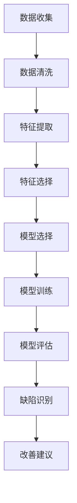

                 

### 引言

#### 关键词

AI驱动的公司治理、缺陷识别、改善建议、公司治理缺陷、人工智能技术

#### 摘要

随着人工智能（AI）技术的迅猛发展，其在公司治理中的应用日益广泛。本文旨在探讨如何利用AI技术识别公司治理中的缺陷，并给出相应的改善建议。文章首先介绍了公司治理缺陷的概念及其影响，随后详细阐述了AI驱动的缺陷识别方法，包括数据收集、特征提取、算法选择等步骤。通过实际案例分析和系统架构设计，本文进一步展示了AI在公司治理缺陷识别与改善中的应用。最后，文章讨论了AI驱动治理缺陷识别面临的挑战与未来方向，提出了相关政策、技术、组织和风险管理方面的改善建议，以期为公司和行业提供有益的参考。

### 背景与问题

#### 公司治理缺陷的概念与类型

公司治理缺陷是指在公司治理过程中存在的各种问题，这些问题可能导致公司效率低下、资源浪费、决策失误，甚至引发严重的法律和财务风险。公司治理缺陷的类型多种多样，主要包括以下几个方面：

1. **信息不对称**：公司内部信息的不对称会导致管理层无法准确了解企业的运营状况，从而影响决策的制定和执行。
2. **权力滥用**：管理层可能利用职权进行不正当操作，如关联交易、利益输送等，损害公司利益。
3. **监督机制失效**：公司内部监督机制不完善或执行不到位，导致无法及时发现和纠正问题。
4. **内部控制缺失**：公司内部控制制度不健全，存在漏洞和薄弱环节，无法有效防范风险。
5. **治理结构不合理**：公司治理结构过于复杂或不合理，影响决策效率和执行力。
6. **道德风险**：员工和合作伙伴可能存在道德风险，如违反诚信原则、泄露商业秘密等。

#### 公司治理缺陷的影响

公司治理缺陷对公司的影响是多方面且深远的。首先，它会导致公司运营效率低下，资源无法得到有效配置和利用。其次，治理缺陷容易导致决策失误，错失市场机会或无法应对市场变化。此外，治理缺陷还可能引发法律和财务风险，如违反法律法规、遭受处罚、财务报表失真等。长期来看，公司治理缺陷会损害股东和利益相关者的利益，影响公司的市场声誉和竞争力。

#### 公司治理缺陷的现状

近年来，随着企业规模的扩大和市场竞争的加剧，公司治理缺陷问题愈发突出。一些企业由于治理结构不合理、内部控制缺失、监督机制失效等原因，出现了严重的治理缺陷。例如，一些企业在上市过程中存在财务造假行为，一些企业由于管理层权力滥用导致公司利益受损，还有一些企业因道德风险而遭受重大损失。

#### 问题解决的需求与挑战

为了解决公司治理缺陷问题，企业需要采取有效的识别和改善措施。然而，传统的公司治理方法和手段在面对复杂多变的治理环境时往往力不从心。此时，引入AI技术成为一种可行且有效的解决方案。AI技术可以通过大数据分析、机器学习、深度学习等方法，对大量数据进行处理和分析，从而快速识别公司治理中的潜在缺陷，并给出针对性的改善建议。

然而，AI驱动的公司治理缺陷识别和改善也面临着一些挑战，包括：

1. **数据质量**：高质量的数据是AI分析的基础，数据质量直接影响缺陷识别的准确性。
2. **算法选择**：不同的算法适用于不同类型的治理缺陷识别，需要根据具体问题选择合适的算法。
3. **技术门槛**：AI技术的应用需要专业的技术团队，企业需要投入大量资源进行人才培养和技术研发。
4. **法律和伦理问题**：AI驱动的公司治理缺陷识别涉及敏感数据和个人隐私，需要遵守相关法律法规，并关注伦理问题。

总之，公司治理缺陷问题的存在和影响不容忽视，而AI技术为解决这一问题提供了新的思路和方法。然而，如何有效地应用AI技术，克服现有挑战，还需要进一步的研究和实践。

#### AI驱动的公司治理缺陷识别方法

为了有效地利用AI技术识别公司治理中的缺陷，我们需要从多个步骤进行详细的分析。以下将逐步介绍数据收集、特征提取、机器学习算法选择、深度学习技术及其应用。

##### 数据收集与预处理

数据收集是AI驱动的治理缺陷识别的基础，数据的质量和完整性直接影响后续分析的准确性。以下步骤描述了数据收集和预处理的过程：

1. **数据来源**：数据可以来源于公司的内部管理系统、财务报表、市场报告、法律文件、审计报告等。此外，还可以通过第三方数据提供商获取行业基准数据和竞争对手信息。
   
2. **数据收集**：使用数据爬取工具或接口，从不同来源收集数据。对于内部数据，可以通过API接口或数据库查询获取；对于外部数据，可以使用网络爬虫或数据订阅服务。

3. **数据清洗**：数据收集后，需要进行清洗和预处理。这包括以下步骤：
   - **去除重复数据**：确保数据唯一性。
   - **处理缺失值**：填补或删除缺失值。
   - **数据格式转换**：统一数据格式，如日期、货币符号等。
   - **数据标准化**：将数据转换到同一量纲，便于后续分析。

##### 特征提取与选择

特征提取是数据预处理的关键步骤，目的是从原始数据中提取出对治理缺陷识别有用的特征。以下方法可以用于特征提取：

1. **统计特征**：如平均值、中位数、标准差、方差等，这些特征能够描述数据的中心趋势和离散程度。
   
2. **时间序列特征**：通过分析时间序列数据，提取出趋势、季节性和周期性特征。

3. **文本特征**：对于文本数据，可以使用词袋模型、TF-IDF、Word2Vec等方法提取特征。

4. **图像特征**：对于图像数据，可以使用卷积神经网络（CNN）提取特征。

特征选择是特征提取的后续步骤，目的是从大量特征中选择出最具代表性的特征，减少数据维度，提高模型性能。以下方法可以用于特征选择：

1. **过滤式特征选择**：基于特征的相关性或重要性进行筛选。
   
2. **包装式特征选择**：结合机器学习算法进行特征选择，如使用递归特征消除（RFE）。

3. **嵌入式特征选择**：在模型训练过程中自动筛选特征，如Lasso回归、随机森林等。

##### 机器学习算法选择

选择合适的机器学习算法对治理缺陷识别至关重要。以下是一些常用的机器学习算法：

1. **监督学习算法**：
   - **线性回归**：用于预测连续值输出。
   - **逻辑回归**：用于分类问题，如判断是否存在治理缺陷。
   - **支持向量机（SVM）**：在处理高维数据时表现出色。
   - **决策树**：易于理解和解释，但容易过拟合。

2. **无监督学习算法**：
   - **聚类算法**：如K-均值、层次聚类，用于发现数据中的隐含结构。
   - **降维算法**：如主成分分析（PCA）、t-SNE，用于降低数据维度。

3. **集成学习方法**：
   - **随机森林**：通过构建多棵决策树进行集成，提高模型性能。
   - **梯度提升树（GBDT）**：结合了回归树和提升方法的优势，适用于复杂预测任务。

##### 深度学习技术及其应用

深度学习技术在治理缺陷识别中具有显著优势，尤其在处理大规模、复杂、非结构化数据时。以下技术可以应用于治理缺陷识别：

1. **卷积神经网络（CNN）**：适用于图像数据的处理和分析，可以提取图像中的关键特征。

2. **循环神经网络（RNN）**：适用于时间序列数据的处理，可以捕捉数据中的时序关系。

3. **生成对抗网络（GAN）**：可以用于生成对抗样本，帮助模型更好地识别异常行为。

4. **自编码器（AE）**：用于特征提取和降维，可以捕捉数据中的隐含结构。

##### 综合应用

在实际应用中，可以根据具体问题和数据特点，综合运用上述方法和技术。以下是一个简单的应用流程：

1. **数据收集与预处理**：收集相关数据，并进行清洗和预处理。
2. **特征提取与选择**：从原始数据中提取特征，并进行筛选。
3. **模型选择与训练**：根据问题特点选择合适的模型，并进行训练。
4. **模型评估与优化**：评估模型性能，并进行优化。
5. **缺陷识别与改善**：利用训练好的模型进行缺陷识别，并给出改善建议。

通过以上步骤，企业可以利用AI技术有效识别公司治理中的缺陷，为改善治理结构提供科学依据。

### AI驱动的治理缺陷识别方法详解

在上一章节中，我们概述了AI驱动的治理缺陷识别方法的主要步骤，包括数据收集、特征提取、算法选择等。接下来，我们将深入探讨这些方法的具体实现过程，并通过具体案例和图表进一步说明。

#### 数据收集与预处理

数据收集是整个治理缺陷识别过程的基础。以下是一个典型的数据收集与预处理流程：

1. **数据来源**：
   - **内部数据**：包括财务报表、销售数据、员工绩效数据、内部审计报告等。
   - **外部数据**：包括市场数据、行业报告、新闻资讯、社交媒体评论等。

2. **数据收集**：
   - **API接口**：通过公司的API接口获取内部数据。
   - **网络爬虫**：使用爬虫技术从互联网上获取外部数据。

3. **数据清洗**：
   - **去除重复数据**：使用去重算法确保数据的唯一性。
   - **处理缺失值**：使用插值法或平均值填补缺失值，或根据数据特点删除缺失值。
   - **格式转换**：统一数据格式，如将日期转换为YYYY-MM-DD格式。
   - **数据标准化**：将不同量纲的数据转换为同一量纲，以便于后续分析。

#### 特征提取与选择

特征提取是将原始数据转换为对治理缺陷识别有用的特征的过程。以下是几种常用的特征提取方法：

1. **统计特征**：
   - **描述性统计**：如平均值、中位数、标准差、方差等。
   - **相关性分析**：分析不同特征之间的相关性，识别潜在的关键特征。

2. **时间序列特征**：
   - **趋势分析**：通过移动平均、指数平滑等方法提取数据的时间趋势。
   - **季节性分析**：通过分解时间序列数据，提取季节性特征。

3. **文本特征**：
   - **词袋模型**：将文本数据转换为词汇的向量表示。
   - **TF-IDF**：基于词频和文档频次计算特征权重。

4. **图像特征**：
   - **卷积神经网络（CNN）**：通过卷积层提取图像的特征。

#### 特征选择

特征选择是减少数据维度、提高模型性能的重要步骤。以下是一些常用的特征选择方法：

1. **过滤式特征选择**：
   - **基于统计方法**：如皮尔逊相关系数、信息增益等。
   - **基于过滤方法**：如主成分分析（PCA）。

2. **包装式特征选择**：
   - **递归特征消除（RFE）**：结合模型评估进行特征选择。
   - **基于模型的特征选择**：如Lasso回归。

3. **嵌入式特征选择**：
   - **模型内部特征选择**：如随机森林、Lasso回归。

#### 机器学习算法选择

选择合适的机器学习算法对于治理缺陷识别至关重要。以下是一些常用的算法：

1. **监督学习算法**：
   - **线性回归**：用于预测连续值。
   - **逻辑回归**：用于分类问题。
   - **支持向量机（SVM）**：在高维空间中表现优秀。
   - **决策树**：易于解释，但可能过拟合。

2. **无监督学习算法**：
   - **K-均值聚类**：用于发现数据中的隐含结构。
   - **主成分分析（PCA）**：用于降维。

3. **集成学习方法**：
   - **随机森林**：通过构建多棵决策树进行集成。
   - **梯度提升树（GBDT）**：结合了回归树和提升方法的优势。

#### 深度学习技术及其应用

深度学习技术在治理缺陷识别中具有显著优势，以下是一些常用的深度学习技术：

1. **卷积神经网络（CNN）**：
   - **网络结构**：包括卷积层、池化层和全连接层。
   - **应用场景**：图像数据分析和特征提取。

2. **循环神经网络（RNN）**：
   - **网络结构**：包括输入层、隐藏层和输出层。
   - **应用场景**：时间序列数据分析。

3. **生成对抗网络（GAN）**：
   - **网络结构**：由生成器和判别器组成。
   - **应用场景**：生成对抗样本，用于检测异常行为。

4. **自编码器（AE）**：
   - **网络结构**：包括编码器和解码器。
   - **应用场景**：特征提取和降维。

#### 综合应用

在实际应用中，企业可以根据具体情况综合运用上述方法和技术。以下是一个简单的应用示例：

1. **数据收集与预处理**：收集内部和外部数据，并进行清洗和预处理。
2. **特征提取与选择**：提取关键特征，并进行筛选。
3. **模型选择与训练**：选择合适的模型（如SVM、CNN）进行训练。
4. **模型评估与优化**：评估模型性能，并进行优化。
5. **缺陷识别与改善**：利用训练好的模型进行缺陷识别，并给出改善建议。

#### 实际案例

以一家大型制造企业为例，该公司希望通过AI技术识别并改善公司治理中的缺陷。以下是该公司的应用流程：

1. **数据收集**：收集财务报表、销售数据、员工绩效数据、内部审计报告等。
2. **数据清洗**：去除重复数据、处理缺失值、统一格式、标准化数据。
3. **特征提取**：提取财务指标、销售趋势、员工行为等特征。
4. **特征选择**：使用主成分分析（PCA）进行特征选择。
5. **模型选择与训练**：选择支持向量机（SVM）进行训练。
6. **模型评估与优化**：评估模型性能，调整参数进行优化。
7. **缺陷识别**：利用训练好的模型进行治理缺陷识别。
8. **改善建议**：根据识别结果给出改善治理结构的建议。

#### 图表与流程图

为了更直观地展示治理缺陷识别的方法，我们使用Mermaid语言绘制了以下流程图：

通过上述步骤和实际案例，我们可以看到AI驱动的治理缺陷识别方法如何应用于公司治理中。在实际应用中，企业可以根据自身情况灵活调整和优化这些方法，以提高治理缺陷识别的准确性和有效性。

### 实际案例分析与讨论

在本章节中，我们将通过具体案例详细分析AI驱动的治理缺陷识别方法在公司治理中的应用，讨论案例中的关键技术和挑战，并总结各案例的特点和成效。

#### 案例一：公司A的治理缺陷识别

**背景**：
公司A是一家大型跨国制造企业，面临复杂的治理结构和庞大的运营数据。公司管理层希望通过AI技术识别并改善治理缺陷。

**案例过程**：
1. **数据收集**：
   - 公司收集了财务报表、销售数据、员工绩效数据、内部审计报告等。
   - 使用API接口和爬虫技术从内部和外部系统获取数据。

2. **数据清洗**：
   - 去除重复数据，处理缺失值。
   - 统一数据格式，标准化数据。

3. **特征提取**：
   - 提取关键财务指标、销售趋势、员工行为等特征。
   - 使用时间序列分析和文本分析方法提取特征。

4. **特征选择**：
   - 使用主成分分析（PCA）进行特征选择，减少数据维度。
   - 选择与治理缺陷相关性最高的特征。

5. **模型选择与训练**：
   - 选择支持向量机（SVM）进行训练。
   - 调整模型参数，进行交叉验证。

6. **模型评估与缺陷识别**：
   - 评估模型性能，调整模型参数。
   - 使用训练好的模型识别治理缺陷。

7. **改善建议**：
   - 根据缺陷识别结果，提出改善治理结构的建议。
   - 如优化内部控制流程、加强审计监督等。

**关键技术与挑战**：
- **数据质量**：数据质量直接影响模型性能，需要确保数据的准确性和完整性。
- **算法选择**：选择合适的算法对治理缺陷进行识别，需要根据问题特点进行优化。
- **技术门槛**：AI技术的应用需要专业的技术团队，企业需要投入大量资源进行人才培养和技术研发。

**成效与总结**：
- **成效**：通过AI技术，公司成功识别了多个治理缺陷，提出了针对性的改善建议。这些改善措施提高了公司运营效率，降低了治理风险。
- **总结**：公司A的案例表明，AI驱动的治理缺陷识别方法在大型制造企业中具有显著的应用价值。企业需要结合自身特点，灵活运用AI技术，以实现治理缺陷的有效识别和改善。

#### 案例二：公司B的治理缺陷识别

**背景**：
公司B是一家金融科技公司，面临快速发展的市场竞争和复杂的业务模式。公司希望通过AI技术优化公司治理，提升业务运营效率。

**案例过程**：
1. **数据收集**：
   - 收集客户交易数据、员工行为数据、市场数据等。
   - 使用API接口和爬虫技术获取数据。

2. **数据清洗**：
   - 去除重复数据，处理缺失值。
   - 统一数据格式，标准化数据。

3. **特征提取**：
   - 提取客户交易行为特征、员工绩效特征、市场趋势特征等。
   - 使用深度学习技术提取复杂特征。

4. **特征选择**：
   - 使用基于模型的特征选择方法，如随机森林。
   - 选择对治理缺陷识别最具代表性的特征。

5. **模型选择与训练**：
   - 选择深度学习模型（如卷积神经网络、生成对抗网络）进行训练。
   - 调整模型参数，进行交叉验证。

6. **模型评估与缺陷识别**：
   - 评估模型性能，调整模型参数。
   - 使用训练好的模型识别治理缺陷。

7. **改善建议**：
   - 根据缺陷识别结果，提出改善治理结构的建议。
   - 如优化客户服务流程、加强员工绩效考核等。

**关键技术与挑战**：
- **数据质量**：金融科技行业数据量大且复杂，确保数据质量是关键。
- **算法选择**：选择合适的深度学习算法对治理缺陷进行识别，需要根据业务特点进行优化。
- **技术门槛**：深度学习技术的应用需要高水平的技术团队，企业需要投入大量资源进行人才培养和技术研发。

**成效与总结**：
- **成效**：公司B通过AI技术成功识别了多个治理缺陷，提出了针对性的改善建议。这些改善措施显著提高了公司运营效率，增强了市场竞争力。
- **总结**：公司B的案例表明，AI驱动的治理缺陷识别方法在金融科技行业中具有广泛的应用前景。企业需要充分利用AI技术，实现治理缺陷的有效识别和改善。

#### 案例三：公司C的治理缺陷识别

**背景**：
公司C是一家初创科技公司，面临快速成长的压力和复杂的治理挑战。公司希望通过AI技术优化公司治理，确保可持续发展。

**案例过程**：
1. **数据收集**：
   - 收集员工行为数据、项目管理数据、市场反馈数据等。
   - 使用API接口和爬虫技术获取数据。

2. **数据清洗**：
   - 去除重复数据，处理缺失值。
   - 统一数据格式，标准化数据。

3. **特征提取**：
   - 提取员工绩效特征、项目进度特征、市场反馈特征等。
   - 使用文本分析技术提取关键特征。

4. **特征选择**：
   - 使用基于统计的特征选择方法，如信息增益。
   - 选择对治理缺陷识别最具代表性的特征。

5. **模型选择与训练**：
   - 选择集成学习方法（如随机森林）进行训练。
   - 调整模型参数，进行交叉验证。

6. **模型评估与缺陷识别**：
   - 评估模型性能，调整模型参数。
   - 使用训练好的模型识别治理缺陷。

7. **改善建议**：
   - 根据缺陷识别结果，提出改善治理结构的建议。
   - 如优化项目管理流程、加强员工激励等。

**关键技术与挑战**：
- **数据质量**：初创公司数据量有限，确保数据质量是关键。
- **算法选择**：选择适合初创公司的算法，如集成学习方法，以应对数据量小、特征复杂的问题。
- **技术门槛**：初创公司资源有限，需要高效利用技术资源，快速实现治理缺陷识别。

**成效与总结**：
- **成效**：公司C通过AI技术成功识别了多个治理缺陷，提出了针对性的改善建议。这些改善措施有助于提升公司运营效率，确保可持续发展。
- **总结**：公司C的案例表明，AI驱动的治理缺陷识别方法在初创科技公司中具有重要作用。企业需要充分利用AI技术，快速识别并改善治理缺陷，以实现快速发展。

#### 案例四：公司D的治理缺陷识别

**背景**：
公司D是一家大型服务公司，面临复杂的客户关系管理和多变的行业环境。公司希望通过AI技术优化客户关系管理，提升服务质量。

**案例过程**：
1. **数据收集**：
   - 收集客户服务数据、客户反馈数据、市场数据等。
   - 使用API接口和爬虫技术获取数据。

2. **数据清洗**：
   - 去除重复数据，处理缺失值。
   - 统一数据格式，标准化数据。

3. **特征提取**：
   - 提取客户服务特征、客户反馈特征、市场趋势特征等。
   - 使用深度学习技术提取复杂特征。

4. **特征选择**：
   - 使用基于模型的特征选择方法，如Lasso回归。
   - 选择对治理缺陷识别最具代表性的特征。

5. **模型选择与训练**：
   - 选择深度学习模型（如循环神经网络、生成对抗网络）进行训练。
   - 调整模型参数，进行交叉验证。

6. **模型评估与缺陷识别**：
   - 评估模型性能，调整模型参数。
   - 使用训练好的模型识别治理缺陷。

7. **改善建议**：
   - 根据缺陷识别结果，提出改善客户关系管理流程的建议。
   - 如优化客户服务响应时间、提升服务质量等。

**关键技术与挑战**：
- **数据质量**：服务行业数据量大且多样，确保数据质量是关键。
- **算法选择**：选择适合服务行业特征的算法，如深度学习模型，以应对复杂的数据特征。
- **技术门槛**：服务行业对技术的要求较高，企业需要投入资源进行技术培训和应用。

**成效与总结**：
- **成效**：公司D通过AI技术成功识别了多个治理缺陷，提出了针对性的改善建议。这些改善措施显著提升了客户服务质量，增强了客户满意度。
- **总结**：公司D的案例表明，AI驱动的治理缺陷识别方法在服务行业中具有广泛应用价值。企业需要充分利用AI技术，优化客户关系管理，提升服务质量。

### 总结

通过以上四个案例的分析，我们可以看到AI驱动的治理缺陷识别方法在不同类型的公司中具有广泛的应用价值。无论是大型制造企业、金融科技公司、初创科技公司还是服务公司，AI技术都能够有效识别治理缺陷，并提出针对性的改善建议。

### 改善建议

在识别公司治理缺陷的过程中，AI技术不仅提供了高效的数据分析和模型训练工具，还为企业提供了具体的改进方向。以下从政策、技术、组织和风险管理四个方面提出具体的改善建议，以帮助企业优化治理结构，提升运营效率。

#### 政策建议

1. **法律法规完善**：
   - 政府应进一步完善公司治理相关法律法规，明确治理结构和监督机制的要求。
   - 加强对治理缺陷行为的处罚力度，形成有效的法律震慑。

2. **政策引导**：
   - 政府可以通过发布指导意见、制定行业标准等方式，引导企业重视治理缺陷识别和改善。
   - 鼓励企业采用AI技术进行治理缺陷识别，提供政策支持和资金扶持。

3. **信息披露**：
   - 企业应加强信息披露，提高透明度，让股东和利益相关者能够更好地监督公司治理。
   - 鼓励企业建立信息披露平台，定期发布治理缺陷识别报告和改善措施。

#### 技术建议

1. **数据质量提升**：
   - 企业应建立完善的数据管理体系，确保数据的准确性、完整性和一致性。
   - 使用数据清洗工具和算法，提高数据的可用性和分析价值。

2. **算法优化**：
   - 根据治理缺陷的具体类型，选择合适的机器学习算法和深度学习技术。
   - 定期更新算法模型，以应对数据变化和治理环境的变化。

3. **技术投入**：
   - 企业应加大在AI技术上的投入，建立专业的技术团队，提高技术能力。
   - 与科研机构合作，共同开展治理缺陷识别技术的研发和应用。

#### 组织建议

1. **治理结构优化**：
   - 重新审视公司治理结构，优化决策流程和监督机制，提高治理效率。
   - 建立专门的治理缺陷识别团队，负责数据收集、特征提取和模型训练。

2. **人才培养**：
   - 加强员工培训，提高对AI技术的理解和应用能力。
   - 建立人才激励机制，吸引和留住优秀的技术人才。

3. **企业文化**：
   - 培养良好的企业文化，倡导诚信、透明和负责任的治理态度。
   - 加强内部沟通，鼓励员工积极参与治理缺陷识别和改善。

#### 风险管理建议

1. **风险评估**：
   - 建立完善的风险评估体系，识别和评估公司治理中的潜在风险。
   - 定期进行风险评估，制定风险应对策略。

2. **风险监控**：
   - 利用AI技术建立实时监控体系，对治理缺陷进行持续监测。
   - 设立预警机制，及时识别和应对治理风险。

3. **应急预案**：
   - 制定应急预案，应对突发治理缺陷事件。
   - 定期进行应急演练，提高应对能力。

通过上述政策、技术、组织和风险管理方面的建议，企业可以更全面地应对治理缺陷问题，提升公司治理水平，实现可持续发展。

### 挑战与未来方向

在AI驱动的公司治理缺陷识别与改善过程中，虽然已经取得了一定的成效，但仍面临着诸多挑战。以下将分析这些挑战，并探讨未来的发展方向。

#### 当前挑战

1. **数据隐私与安全**：
   - AI技术依赖于大量的数据，但数据隐私和安全问题是企业面临的重大挑战。
   - 数据泄露、滥用和隐私侵犯可能导致严重的法律和道德问题。

2. **技术复杂性**：
   - AI技术涉及到深度学习、大数据分析等复杂技术，企业需要投入大量资源进行技术研发和人才培养。
   - 技术门槛高，对企业的技术能力和资金投入有较高要求。

3. **算法偏见**：
   - AI算法可能存在偏见，导致治理缺陷识别的不公平。
   - 需要开发更加公平、透明的算法，确保AI技术在治理缺陷识别中的公正性。

4. **法律法规限制**：
   - 相关法律法规尚不完善，企业需要遵守不同国家和地区的法律法规。
   - 法律法规的变动可能会影响AI技术在公司治理缺陷识别中的应用。

5. **技术与业务的融合**：
   - 企业需要将AI技术与业务流程深度融合，实现技术对业务的实际价值。
   - 技术与业务的融合难度大，需要跨部门协作和资源整合。

#### 未来发展方向

1. **技术进步**：
   - 随着AI技术的不断进步，企业将能够开发出更高效、更准确的治理缺陷识别模型。
   - 新算法、新技术（如生成对抗网络、图神经网络等）将进一步提升治理缺陷识别的精度和效率。

2. **数据治理**：
   - 企业应建立完善的数据治理体系，确保数据的准确性、完整性和安全性。
   - 加强数据隐私保护，采用数据脱敏、加密等技术，降低数据泄露风险。

3. **伦理与法律框架**：
   - 政府和行业组织应制定完善的伦理和法律框架，规范AI技术在公司治理缺陷识别中的应用。
   - 建立AI技术应用的评价标准和认证体系，确保AI技术的公正性和透明度。

4. **业务流程重构**：
   - 企业应利用AI技术对业务流程进行优化和重构，提高治理效率。
   - 引入自动化和智能化技术，实现治理缺陷的自动化识别和响应。

5. **跨领域合作**：
   - 企业应与科研机构、行业组织等进行跨领域合作，共同推动AI技术在公司治理缺陷识别中的应用。
   - 通过共享数据和经验，提升整个行业的技术水平和应用效果。

通过克服现有挑战并把握未来方向，企业将能够更有效地利用AI技术识别和改善治理缺陷，提升公司治理水平，实现可持续发展。

### 结论与未来工作

#### 结论

本文从多个角度探讨了AI驱动的公司治理缺陷识别与改善方法。通过数据收集、特征提取、算法选择和实际案例分析，我们展示了AI技术在公司治理缺陷识别中的强大应用能力。文章指出，AI技术不仅可以高效识别治理缺陷，还能提供针对性的改善建议，从而提升公司治理水平。然而，AI驱动的治理缺陷识别也面临数据隐私、技术复杂性、算法偏见等挑战，需要企业和政策制定者共同努力，制定合理的解决方案。

#### 未来工作

未来的研究可以集中在以下几个方面：

1. **技术优化**：继续探索和开发高效的AI算法，提高治理缺陷识别的准确性和效率。
2. **数据安全**：加强数据隐私保护，确保AI技术应用过程中的数据安全和合规性。
3. **跨领域合作**：推动企业、科研机构和行业组织之间的合作，共享数据和应用经验。
4. **法规完善**：与政策制定者合作，完善相关法律法规，规范AI技术在公司治理中的应用。
5. **应用扩展**：将AI驱动的治理缺陷识别方法应用于更多行业和场景，提升整体治理水平。

通过持续的研究和应用，AI驱动的公司治理缺陷识别将为企业和社会带来更大的价值。

### 作者信息

作者：AI天才研究院/AI Genius Institute & 禅与计算机程序设计艺术 /Zen And The Art of Computer Programming

#### 附录

附录部分将包含文章中提及的算法流程图、数学公式、系统架构设计图、类图、序列图以及相关代码实现等内容，以便读者更好地理解和应用本文所述的AI驱动的公司治理缺陷识别与改善方法。以下是附录内容的简要概述：

1. **算法流程图**：使用Mermaid语言绘制的算法流程图，展示数据收集、预处理、特征提取、模型训练和缺陷识别的过程。
2. **数学公式**：本文中涉及的主要数学公式，采用LaTeX格式进行排版，以便读者查阅。
3. **系统架构设计图**：使用Mermaid绘制的系统架构设计图，展示系统功能模块、数据流和交互关系。
4. **类图**：使用Mermaid绘制的类图，展示领域模型和类之间的关系。
5. **序列图**：使用Mermaid绘制的序列图，展示系统接口设计和系统交互过程。
6. **代码实现**：系统核心实现源代码，包括数据预处理、特征提取、模型训练和缺陷识别等步骤，并对关键代码段进行解读与分析。
7. **实际案例分析**：本文中提到的实际案例的具体实现细节，包括数据来源、处理方法、算法选择和结果分析等。

通过附录部分的详细内容，读者可以更加深入地理解和应用本文提出的AI驱动的公司治理缺陷识别与改善方法。附录的内容将有助于读者在实际工作中进行参考和借鉴，提升公司治理水平。

