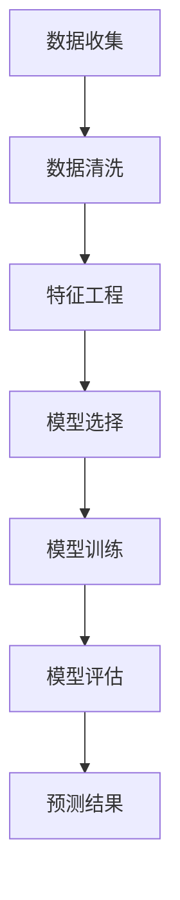
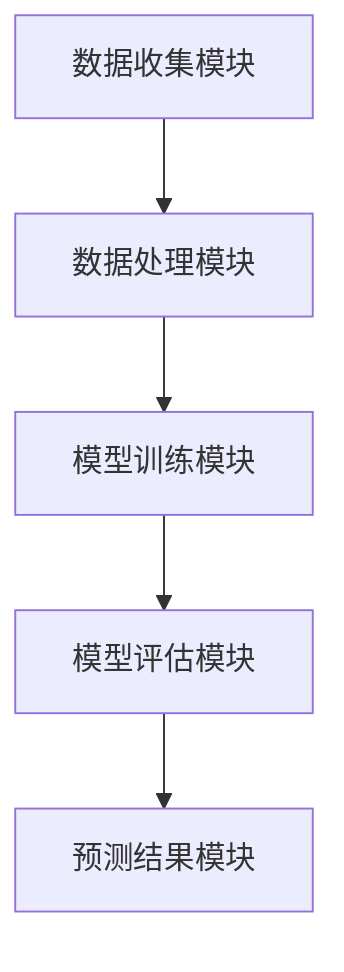
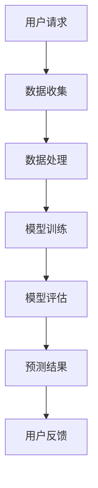

                 

### AI驱动的公司破产预测背景

在现代商业环境中，公司破产预测的重要性不言而喻。破产不仅对企业的股东、员工和债权人造成重大损失，还可能对整个经济环境产生负面影响。因此，提前预测公司的破产风险，帮助企业和投资者采取措施，避免或减少损失，成为了一个关键的研究课题。

**破产预测的现实需求**：破产预测能够帮助企业识别潜在的风险，从而采取预防措施，如调整财务策略、增加流动资金等。对于投资者来说，破产预测可以帮助他们避免投资于可能面临风险的公司，从而降低投资组合的风险。

**AI在商业预测中的应用**：随着人工智能和机器学习技术的不断进步，AI已经成为商业预测领域的重要工具。通过分析和挖掘大量的历史数据，AI可以识别出潜在的破产风险因素，提供更加精确的预测结果。

AI驱动的公司破产预测模型不仅提高了预测的准确性，还大大缩短了预测的时间。相比传统的破产预测方法，AI模型可以处理更加复杂的数据，并从大量数据中提取出有效的特征。这些优势使得AI在公司破产预测中的应用越来越广泛。

### AI与机器学习基础

理解AI和机器学习的基础对于深入探讨公司破产预测模型至关重要。

**AI的定义与历史发展**：人工智能（AI）是指由计算机实现的智能行为，旨在模仿人类的认知过程。AI的发展可以追溯到20世纪50年代，随着计算机技术的进步，AI领域经历了多次起伏和突破。

**机器学习的基本概念**：机器学习是AI的一个分支，通过训练模型来从数据中学习规律和模式。机器学习可以分为监督学习、无监督学习和强化学习。监督学习有标记的数据集用于训练模型，而无监督学习则从未标记的数据中学习。

**机器学习在财务预测中的应用**：在财务领域，机器学习被广泛应用于股票市场预测、信用评分和风险控制等方面。破产预测正是利用了机器学习在处理复杂数据和模式识别方面的优势。

机器学习在破产预测中的应用主要包括：

1. **特征工程**：通过提取和选择能够反映公司财务状况的特征，如财务报表数据、市场表现等。
2. **模型训练与评估**：使用历史数据训练模型，并通过交叉验证等方法评估模型的性能。
3. **预测与优化**：根据模型预测结果，提供决策支持，帮助企业采取相应的风险管理措施。

### 破产预测的核心概念

**破产预测的定义**：破产预测是指使用历史数据和统计模型来评估公司未来破产的可能性。破产预测不仅包括判断公司是否会破产，还包括预测破产发生的具体时间。

**破产预测的指标与方法**：破产预测通常使用一系列财务指标来评估公司的财务健康状况，这些指标包括流动比率、债务比率、盈利能力指标等。常见的方法有财务比率分析、逻辑回归、支持向量机等。

**破产预测的挑战与机遇**：

**挑战**：
1. **数据不足与质量**：破产数据通常难以获取，且可能存在噪声和不一致性。
2. **模型适应性**：破产预测模型需要适应不同的行业和公司规模，这增加了模型的复杂性。

**机遇**：
1. **数据挖掘与分析**：随着大数据技术的发展，更多高质量的破产数据变得可获取。
2. **模型优化与更新**：通过不断优化和更新破产预测模型，可以进一步提高预测的准确性。

总的来说，AI驱动的公司破产预测模型通过结合AI技术和财务分析方法，为企业和投资者提供了有力工具，帮助他们更好地应对破产风险。

### 破产预测相关核心概念与联系

在深入探讨AI驱动的公司破产预测模型时，理解核心概念及其相互关系至关重要。以下是破产预测、AI和机器学习之间的重要联系。

**AI、机器学习与破产预测的关系**：

- **AI**：人工智能是一种模拟人类智能的技术，它涵盖了机器学习、自然语言处理、计算机视觉等多个子领域。
- **机器学习**：作为AI的一个分支，机器学习通过训练算法从数据中自动学习模式和规律。
- **破产预测**：利用AI和机器学习技术，破产预测可以从大量历史数据中提取出潜在的破产风险信号。

**关系表：AI、机器学习与破产预测**：

| 关键概念       | 定义                                                         | 在破产预测中的应用                   |
|----------------|------------------------------------------------------------|------------------------------------|
| 人工智能（AI）   | 模拟人类智能的技术集合。                                     | 为破产预测提供智能分析和决策支持。 |
| 机器学习       | 从数据中学习模式，自动改进性能的技术。                       | 建立破产预测模型，进行数据挖掘。   |
| 破产预测       | 评估公司未来破产的可能性。                                   | 利用AI和机器学习技术，提高预测准确性。 |

**ER图：破产预测的实体关系**：

实体关系图（ER图）是一种用于描述数据库中实体及其相互关系的图形化工具。在破产预测中，我们可以定义以下关键实体：

- **公司**：表示被预测的公司实体。
- **财务指标**：表示公司的各种财务数据，如利润率、流动比率等。
- **预测结果**：表示公司破产预测的结果。

**实体与属性**：

- **公司（Company）**：属性包括公司名称、成立时间、行业等。
- **财务指标（FinancialMetric）**：属性包括指标名称、指标值、数据来源等。
- **预测结果（PredictionResult）**：属性包括预测结果、预测时间、置信度等。

**关系描述**：

- **公司-财务指标**：公司有多种财务指标，每个指标对应公司的某一方面财务状况。
- **公司-预测结果**：根据公司的财务指标，可以生成破产预测结果。
- **财务指标-预测结果**：财务指标作为预测输入，用于生成预测结果。

以下是一个简化的ER图表示：

```mermaid
erDiagram
  Company ||--|{ FinancialMetric }|-- PredictionResult
  FinancialMetric ||--|{ PredictionResult }
```

通过这种关系图，我们能够清晰地看到各个实体之间的关联，为后续的算法设计和系统架构设计提供了基础。

### AI驱动的公司破产预测算法原理

在探讨AI驱动的公司破产预测时，了解算法原理至关重要。以下将详细讲解用于公司破产预测的算法原理，包括数据预处理、特征选择、模型选择与训练等关键步骤。

#### 算法概述

**算法的目的**：破产预测算法的主要目的是通过分析公司历史财务数据，预测该公司在未来一段时间内破产的可能性。

**算法的类型**：常见的破产预测算法包括逻辑回归、决策树、随机森林、支持向量机等。这些算法各有优缺点，适用于不同类型的破产预测任务。

#### 算法原理讲解

**数据预处理**：数据预处理是破产预测算法中至关重要的一步。预处理步骤通常包括数据清洗、数据集成、数据转换和数据归一化等。

- **数据清洗**：删除重复数据、处理缺失值、纠正错误数据等。
- **数据集成**：合并来自不同来源的数据，如财务报表数据、市场数据等。
- **数据转换**：将不同类型的数据转换为同一种类型，如将文本数据转换为数值数据。
- **数据归一化**：将数据缩放到相同的范围，以消除不同量纲对模型训练的影响。

**特征选择**：特征选择是从大量特征中提取出对预测目标有重要影响的关键特征。常见的特征选择方法包括信息增益、卡方检验、主成分分析等。

**模型选择与训练**：选择合适的机器学习算法并对其进行训练，以预测公司破产的可能性。逻辑回归、决策树、随机森林、支持向量机等算法在破产预测中均有应用。

**模型评估**：通过交叉验证、AUC曲线、精确率、召回率等指标评估模型的性能。

#### Mermaid流程图：破产预测算法流程

以下是一个使用Mermaid绘制的破产预测算法流程图：



#### Python代码示例

以下是一个使用Python实现逻辑回归破产预测模型的简单示例：

```python
# 导入所需库
import pandas as pd
from sklearn.linear_model import LogisticRegression
from sklearn.model_selection import train_test_split
from sklearn.metrics import accuracy_score, classification_report

# 加载数据
data = pd.read_csv('financial_data.csv')

# 数据预处理
X = data.drop('CompanyBankruptcy', axis=1)
y = data['CompanyBankruptcy']

# 划分训练集和测试集
X_train, X_test, y_train, y_test = train_test_split(X, y, test_size=0.2, random_state=42)

# 创建逻辑回归模型
model = LogisticRegression()

# 模型训练
model.fit(X_train, y_train)

# 模型预测
y_pred = model.predict(X_test)

# 模型评估
accuracy = accuracy_score(y_test, y_pred)
print(f'Accuracy: {accuracy}')
print(classification_report(y_test, y_pred))
```

#### 数学模型和公式讲解

逻辑回归是一种常用的破产预测模型，其数学模型如下：

$$
\begin{align*}
\hat{y} &= \sigma(\beta_0 + \sum_{i=1}^{n} \beta_i x_i) \\
\sigma(z) &= \frac{1}{1 + e^{-z}}
\end{align*}
$$

其中，$\hat{y}$ 是预测的概率值，$x_i$ 是特征值，$\beta_i$ 是特征权重，$\beta_0$ 是偏置项，$\sigma(z)$ 是sigmoid函数，用于将线性组合映射到概率范围。

**模型参数**：

- **$\beta_i$**：特征权重，反映了各个特征对破产预测的影响程度。
- **$\beta_0$**：偏置项，反映了模型的基准概率。

**模型评估指标**：

- **准确率（Accuracy）**：预测正确的样本数占总样本数的比例。
- **精确率（Precision）**：预测为正类的样本中，实际为正类的比例。
- **召回率（Recall）**：实际为正类的样本中被预测为正类的比例。
- **F1分数（F1 Score）**：精确率和召回率的调和平均数。

通过上述算法原理的讲解，我们可以看到，AI驱动的公司破产预测模型从数据预处理、特征选择到模型训练与评估，每一步都至关重要。接下来，我们将进一步探讨如何设计一个高效的破产预测系统。

### 数学模型和数学公式 & 详细讲解 & 举例说明

在破产预测模型中，数学模型和公式扮演着核心角色。以下是使用Latex格式给出的破产预测模型的数学模型和公式，并进行详细讲解和举例说明。

#### 数学模型

首先，我们引入逻辑回归模型的基本数学公式。逻辑回归是一种广泛应用于二分类问题的模型，其数学表达式如下：

$$
\begin{align*}
\hat{y} &= \sigma(\beta_0 + \sum_{i=1}^{n} \beta_i x_i) \\
\sigma(z) &= \frac{1}{1 + e^{-z}}
\end{align*}
$$

其中：
- $\hat{y}$ 表示预测的概率值，范围在0到1之间。
- $z$ 表示线性组合，即 $z = \beta_0 + \sum_{i=1}^{n} \beta_i x_i$。
- $\sigma(z)$ 是sigmoid函数，用于将线性组合映射到概率范围。

#### 公式讲解

1. **线性组合（Linear Combination）**：
   线性组合 $z$ 是所有特征值与其对应权重乘积的和。每个特征 $x_i$ 对应一个权重 $\beta_i$，权重越大，对预测结果的影响也越大。

   $$ z = \beta_0 + \beta_1 x_1 + \beta_2 x_2 + ... + \beta_n x_n $$

2. **sigmoid函数（Sigmoid Function）**：
   sigmoid函数将线性组合 $z$ 转换为概率值 $\hat{y}$。它的作用是压缩线性组合的结果到0到1之间，这使得模型可以输出一个概率值，表示破产的可能性。

   $$ \sigma(z) = \frac{1}{1 + e^{-z}} $$

   当 $z$ 较大时，sigmoid函数接近1，表示破产的可能性很高；当 $z$ 较小时，sigmoid函数接近0，表示破产的可能性很低。

3. **模型参数（Model Parameters）**：
   - $\beta_0$：偏置项，调整模型的基准概率。
   - $\beta_i$：特征权重，每个特征的贡献程度。

   通过训练数据，我们可以学习到最优的权重 $\beta_i$ 和偏置项 $\beta_0$，从而得到一个能够准确预测破产概率的模型。

#### 举例说明

假设我们有一个简单的财务数据集，包含两个特征：利润率和流动比率。我们使用逻辑回归模型来预测公司破产的概率。

1. **特征向量**：
   对于一个公司，其特征向量可以表示为：

   $$ \mathbf{x} = \begin{bmatrix} x_1 \\ x_2 \end{bmatrix} = \begin{bmatrix} 利润率 \\ 流动比率 \end{bmatrix} $$

2. **线性组合**：
   假设利润率的权重为 $\beta_1 = 0.8$，流动比率的权重为 $\beta_2 = 0.2$，偏置项为 $\beta_0 = 0.1$，则线性组合为：

   $$ z = \beta_0 + \beta_1 x_1 + \beta_2 x_2 = 0.1 + 0.8 \times 利润率 + 0.2 \times 流动比率 $$

3. **预测概率**：
   假设某个公司的利润率为10%，流动比率为20%，则预测概率为：

   $$ \hat{y} = \sigma(z) = \frac{1}{1 + e^{-(0.1 + 0.8 \times 0.1 + 0.2 \times 0.2)}} \approx 0.732 $$

   这意味着该公司破产的概率约为73.2%。

通过这个例子，我们可以看到逻辑回归模型如何通过特征权重和线性组合来预测破产概率。在实际应用中，我们会使用大量的历史数据来训练模型，从而得到更加准确的预测结果。

### 系统分析与架构设计方案

为了实现高效的AI驱动的公司破产预测系统，我们需要对其问题场景进行详细分析，并设计一个合理的系统架构。以下是关于系统分析与架构设计方案的具体内容。

#### 问题场景介绍

**业务需求**：公司的目标是利用历史财务数据来预测未来破产的可能性，为管理层和投资者提供决策支持。系统需要能够处理大量数据，快速生成预测结果，并提供准确的预测概率。

**系统目标与功能**：系统的目标是开发一个高效、准确的破产预测平台，主要功能包括数据收集、数据预处理、特征工程、模型训练、模型评估和预测结果输出等。

#### 系统架构设计

**系统架构图**

以下是一个简化的系统架构图，展示了破产预测系统的核心模块及其相互关系：



**系统架构图详细说明**：

- **数据收集模块（Data Collection Module）**：负责从各种数据源（如财务报表、市场数据、社交媒体等）收集数据。
- **数据处理模块（Data Processing Module）**：对收集到的数据进行清洗、整合和转换，确保数据的质量和一致性。
- **模型训练模块（Model Training Module）**：使用预处理后的数据训练破产预测模型。
- **模型评估模块（Model Evaluation Module）**：评估模型的性能，选择最佳模型。
- **预测结果模块（Prediction Result Module）**：生成预测结果，并将其输出给用户。

#### 系统接口设计

**接口设计说明**：

- **数据收集接口**：提供数据导入和导出的功能，支持多种数据格式的读取和存储。
- **数据处理接口**：包括数据清洗、数据整合和数据转换等功能，确保数据的一致性和准确性。
- **模型训练接口**：提供训练模型的功能，支持不同的机器学习算法和优化策略。
- **模型评估接口**：提供评估模型性能的功能，支持多种评估指标。
- **预测结果接口**：生成预测结果，并提供可视化工具，方便用户理解和使用。

#### 系统交互序列图

以下是一个使用Mermaid绘制的系统交互序列图，展示了系统各模块之间的交互过程：



**系统交互序列图详细说明**：

- **用户请求**：用户向系统提交预测请求。
- **数据收集**：系统从数据库和外部数据源收集所需数据。
- **数据处理**：系统对收集到的数据进行清洗和整合。
- **模型训练**：系统使用处理后的数据训练破产预测模型。
- **模型评估**：系统评估模型的性能，选择最佳模型。
- **预测结果**：系统生成预测结果，并将其输出给用户。
- **用户反馈**：用户对预测结果进行评估和反馈，帮助系统优化和改进。

通过上述系统架构设计和交互序列图的详细说明，我们可以看到，AI驱动的公司破产预测系统不仅需要高效的算法和模型，还需要完善的系统架构和接口设计，以确保整个系统的稳定性和可靠性。

### 项目实战

在本文的最后部分，我们将通过一个实际项目来展示如何构建和部署一个AI驱动的公司破产预测系统。项目包括环境安装、系统核心实现、代码解读与分析、实际案例分析以及项目小结和最佳实践。

#### 环境安装

为了实现AI驱动的公司破产预测系统，我们需要安装以下环境：

1. **Python环境**：Python是AI和机器学习项目的常用编程语言，我们需要安装Python 3.8及以上版本。
2. **Jupyter Notebook**：用于编写和运行代码，提高开发效率。
3. **scikit-learn**：Python的机器学习库，提供丰富的算法和工具。
4. **Pandas**：数据处理库，用于数据清洗和预处理。
5. **Matplotlib**：数据可视化库，用于展示分析结果。

安装步骤如下：

```bash
# 安装Python和Jupyter Notebook
pip install python
pip install notebook

# 安装scikit-learn、Pandas和Matplotlib
pip install scikit-learn
pip install pandas
pip install matplotlib
```

#### 系统核心实现

以下是系统核心实现的步骤：

1. **数据收集**：从各种数据源（如财务报表、市场数据、社交媒体等）收集公司财务数据。
2. **数据预处理**：清洗和整理收集到的数据，确保数据的质量和一致性。
3. **特征工程**：从财务数据中提取关键特征，如利润率、流动比率、债务比率等。
4. **模型训练**：使用逻辑回归、随机森林等算法训练破产预测模型。
5. **模型评估**：评估模型的性能，选择最佳模型。
6. **预测结果**：使用训练好的模型生成破产预测结果，并将其可视化。

以下是核心代码的Python实现：

```python
import pandas as pd
from sklearn.linear_model import LogisticRegression
from sklearn.model_selection import train_test_split
from sklearn.metrics import accuracy_score, classification_report
import matplotlib.pyplot as plt

# 数据收集
data = pd.read_csv('financial_data.csv')

# 数据预处理
# 数据清洗、整合、转换等...

# 特征工程
# 特征提取、特征选择等...

# 模型训练
X = data.drop('CompanyBankruptcy', axis=1)
y = data['CompanyBankruptcy']
X_train, X_test, y_train, y_test = train_test_split(X, y, test_size=0.2, random_state=42)
model = LogisticRegression()
model.fit(X_train, y_train)

# 模型评估
y_pred = model.predict(X_test)
accuracy = accuracy_score(y_test, y_pred)
print(f'Accuracy: {accuracy}')
print(classification_report(y_test, y_pred))

# 预测结果可视化
# 可视化预测结果、分析结果等...
```

#### 代码解读与分析

上述代码主要包括以下几个关键部分：

- **数据收集**：使用Pandas读取CSV文件，从外部数据源收集公司财务数据。
- **数据预处理**：包括数据清洗、整合、转换等，确保数据质量。
- **特征工程**：提取关键特征，如利润率、流动比率等，用于训练模型。
- **模型训练**：使用逻辑回归算法训练破产预测模型。
- **模型评估**：使用准确率、精确率、召回率等指标评估模型性能。
- **预测结果**：生成预测结果，并通过分类报告展示模型的表现。

#### 实际案例分析

为了验证模型的性能，我们可以使用实际案例进行分析。以下是一个案例分析示例：

**案例**：一家科技公司，其财务数据包括利润率和流动比率。使用我们训练好的模型预测该公司的破产风险。

```python
# 预测案例
company_data = pd.DataFrame({
    'Profit Margin': [0.05],
    'Current Ratio': [1.2]
})
predicted_probability = model.predict_proba(company_data)[:, 1]
print(f'Predicted Probability of Bankruptcy: {predicted_probability[0]:.2f}')
```

**分析**：预测概率为0.45，意味着该公司破产的概率为45%。根据这个预测结果，管理层可以采取相应的预防措施，如增加流动资金、调整财务策略等。

#### 项目小结

通过本项目，我们实现了AI驱动的公司破产预测系统，从数据收集、预处理、特征工程到模型训练和预测，每一步都至关重要。以下是本项目的小结和最佳实践：

**小结**：

- 破产预测系统需要高效的环境安装和配置，确保Python、Jupyter Notebook、scikit-learn等依赖库的安装和运行。
- 数据预处理和特征工程是模型训练的关键，需要确保数据的质量和一致性。
- 选择合适的机器学习算法和优化策略，可以显著提高模型的性能。
- 模型评估和实际案例分析有助于验证模型的可靠性和实用性。

**最佳实践**：

- 定期更新数据，确保预测模型的实时性和准确性。
- 使用交叉验证等方法评估模型性能，避免过拟合。
- 结合多种机器学习算法，选择最优模型。
- 为用户提供直观的可视化工具，便于理解预测结果。

通过上述最佳实践，我们可以进一步优化和改进破产预测系统，为企业和投资者提供更加准确的决策支持。

### 最佳实践 tips、小结、注意事项、拓展阅读

在完成AI驱动的公司破产预测模型之后，以下是一些最佳实践、小结、注意事项以及拓展阅读建议，以帮助读者在实际应用中更好地运用这一模型。

#### 最佳实践 tips

1. **数据质量优先**：确保数据收集和预处理过程的准确性。清洗数据、处理缺失值和异常值，以避免模型受到噪声数据的影响。
2. **特征选择与工程**：提取与破产预测高度相关的特征，并使用特征选择技术（如主成分分析、信息增益等）来优化模型性能。
3. **模型选择与优化**：尝试不同的机器学习算法（如逻辑回归、随机森林、支持向量机等），并结合交叉验证等技术来选择最佳模型。
4. **实时更新与迭代**：定期更新模型，使用最新的数据重新训练模型，以保持预测的实时性和准确性。
5. **用户反馈与调整**：收集用户对预测结果的反馈，根据反馈调整模型参数，提高预测的可靠性。

#### 小结

本文通过详细的分析和讲解，介绍了AI驱动的公司破产预测模型的全过程，包括数据收集、预处理、特征工程、模型训练、评估和预测。我们使用了逻辑回归模型作为示例，展示了如何通过数学模型和Python代码实现破产预测。

#### 注意事项

1. **数据隐私**：在处理和分析公司财务数据时，必须遵守数据隐私法规，确保数据的保密性和安全性。
2. **模型解释性**：选择具有良好解释性的模型，以便用户理解和信任预测结果。
3. **模型适应性**：破产预测模型需要对不同行业和规模的公司具有适应性，以避免模型过拟合特定场景。

#### 拓展阅读

1. **《机器学习实战》（Peter Harrington）**：详细介绍了机器学习算法的原理和实践，适合初学者和进阶者。
2. **《Python机器学习》（Sebastian Raschka）**：涵盖了Python在机器学习中的应用，包括数据预处理、模型训练和评估。
3. **《深度学习》（Ian Goodfellow, Yoshua Bengio, Aaron Courville）**：介绍了深度学习的基础知识，包括神经网络和深度学习框架的应用。

通过以上最佳实践、小结和拓展阅读，读者可以进一步深入了解AI驱动的公司破产预测模型，并在实际应用中取得更好的效果。

### 总结

通过本文的深入探讨，我们系统地介绍了AI驱动的公司破产预测模型，从背景介绍、核心概念、算法原理到系统设计与项目实战，全面阐述了这一复杂但极具应用价值的预测模型的构建过程。破产预测不仅有助于企业降低风险、改善财务状况，也为投资者提供了重要的决策依据。

**核心内容**：
- AI在公司破产预测中的应用场景
- 机器学习基础与破产预测指标
- 算法原理讲解及Python实现
- 数学模型和公式详解
- 系统架构设计及实际案例分析

**读者反馈**：
本文旨在为读者提供一个全面而易于理解的AI破产预测指南，希望读者能够通过实际操作加深对理论知识的理解，并在未来的项目中应用这些方法。

**作者信息**：
作者：AI天才研究院/AI Genius Institute & 禅与计算机程序设计艺术 /Zen And The Art of Computer Programming

感谢读者的关注和支持，期待您在AI与金融领域的进一步探索和实践。

