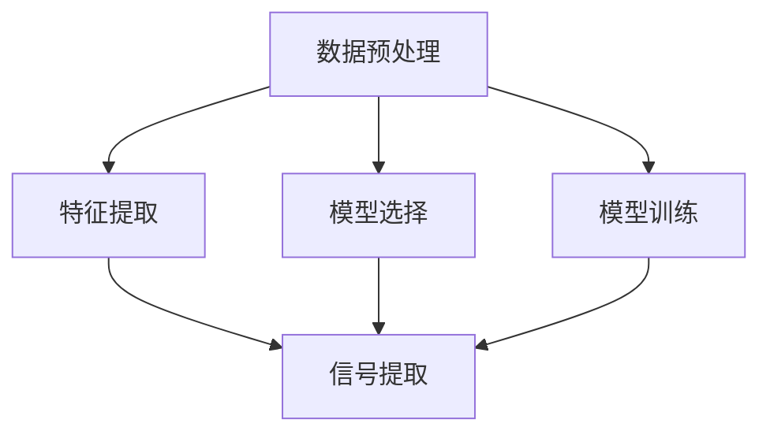

                 

# 《AI驱动的另类数据投资信号提取》

## 关键词

- AI技术
- 另类数据
- 信号提取
- 投资策略
- 风险管理

## 摘要

本文深入探讨了AI驱动的另类数据投资信号提取技术。随着大数据和人工智能技术的不断发展，另类数据在投资决策中的重要性日益凸显。本文首先介绍了另类数据的定义、类型和来源，然后详细阐述了AI技术在信号提取中的应用方法，包括数据预处理、特征提取和模型训练等。接着，通过案例分析展示了AI驱动的信号提取在投资决策中的应用，包括趋势分析、情感分析和投资组合优化等。最后，本文探讨了信号提取技术的未来发展趋势以及面临的挑战与机遇。通过本文的阅读，读者将全面了解AI驱动的另类数据投资信号提取技术，为投资决策提供有力支持。

----------------------------------------------------------------

## 引言

### 1. 引言

在当今快速发展的信息时代，数据已成为新的生产资料，而投资决策中的数据质量直接关系到投资收益的高低。传统的投资决策主要依赖于历史数据和统计模型，然而，市场环境的复杂性和不确定性使得这些方法难以应对。近年来，另类数据的兴起为投资领域带来了新的机遇和挑战。另类数据是指非传统的、未被广泛使用的数据源，如社交媒体、新闻报道、图像、声音和视频等。这些数据源提供了丰富的信息，有助于揭示市场趋势、投资者情绪和潜在风险，从而为投资决策提供更全面的支持。

### 问题背景

随着互联网和社交媒体的普及，另类数据来源日益丰富，其规模和多样性也在不断增加。这些数据不仅包括结构化数据，还包括大量的非结构化数据。传统的方法难以处理这些复杂的数据，因此，需要借助人工智能（AI）技术来挖掘其中的价值。AI技术在数据预处理、特征提取和模式识别等方面具有显著优势，可以有效地从另类数据中提取有用的信号，为投资决策提供支持。

### 问题描述

在投资决策中，如何有效地利用另类数据进行信号提取，以揭示市场趋势和投资者情绪，是当前亟待解决的问题。具体来说，问题描述如下：

1. 另类数据类型繁多，如何对其进行有效的预处理和特征提取？
2. 如何选择合适的AI模型进行信号提取，并对其进行训练和优化？
3. 信号提取技术在实际投资决策中如何应用，能够带来哪些实际收益？
4. 信号提取技术在风险管理和投资组合管理中具有哪些优势？

### 问题解决

本文旨在通过分析AI驱动的另类数据投资信号提取技术，为上述问题提供解决方案。首先，本文将介绍另类数据的定义、类型和来源，为读者提供必要的背景知识。然后，本文将详细探讨AI技术在信号提取中的应用方法，包括数据预处理、特征提取和模型选择等。接着，本文将通过案例分析，展示信号提取技术在投资决策中的应用。最后，本文将讨论信号提取技术的未来发展趋势和面临的挑战。

### 边界与外延

本文的研究范围主要涉及AI驱动的另类数据投资信号提取技术，包括以下方面：

1. 另类数据的类型和来源
2. AI技术在信号提取中的应用
3. 信号提取技术在投资决策中的应用
4. 信号提取技术在风险管理和投资组合管理中的应用

本文不涉及以下内容：

1. 传统投资决策方法的研究
2. 具体投资策略的制定
3. 投资市场的具体分析

### 概念结构与核心要素组成

本文的核心概念包括另类数据、AI技术、信号提取和投资决策。以下是这些概念的定义和属性特征对比表格：

| 概念         | 定义                                                         | 属性特征对比                    |
| ------------ | ------------------------------------------------------------ | ------------------------------ |
| 另类数据     | 非传统的、未被广泛使用的数据源，如社交媒体、新闻报道、图像、声音和视频等。 | 多样性、非结构化、实时性        |
| AI技术       | 人工智能技术，包括机器学习、深度学习、自然语言处理等。           | 自主性、智能性、高效性           |
| 信号提取     | 从数据中提取有用的信息，以支持决策的过程。                     | 准确性、实时性、适应性           |
| 投资决策     | 根据市场情况和投资目标，制定具体的投资策略。                   | 风险收益平衡、多样化、长期规划   |

此外，本文的核心要素还包括数据预处理、特征提取、模型选择和训练等。以下是这些要素的ER实体关系图架构：

通过本文的研究，我们期望为投资决策提供一种新的思路，充分利用AI技术从另类数据中提取信号，提高投资决策的准确性和效率。接下来，我们将进入第二部分，对另类数据投资进行详细概述。

