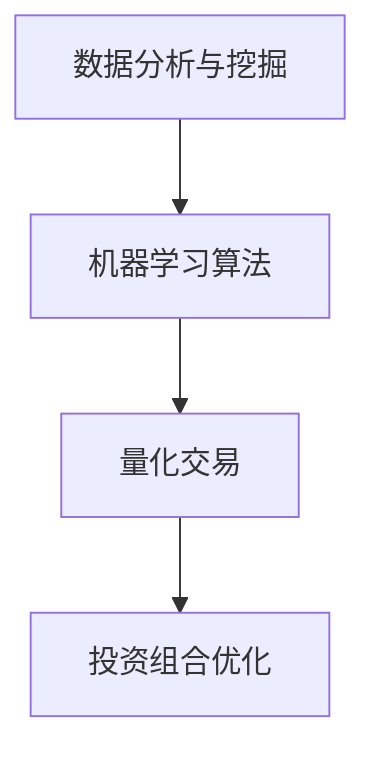
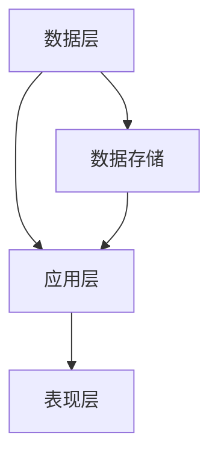
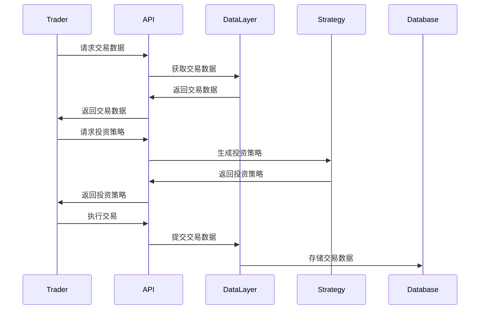

                 

# AI驱动的对冲基金策略分析

关键词：对冲基金、人工智能、数据分析、量化交易、投资组合优化

摘要：本文从对冲基金的定义与分类、AI在金融领域的应用、AI驱动的对冲基金策略、对冲基金的构建与运营、量化交易策略、投资组合优化及AI驱动的对冲基金策略案例分析等多个角度，深入探讨了AI在驱动对冲基金策略中的应用。通过对AI驱动的对冲基金策略的逐步分析，揭示了其在提高投资收益、降低风险等方面的巨大潜力。

## 第一部分：AI驱动的对冲基金策略分析基础

### 第1章：对冲基金概述

#### 1.1 对冲基金的起源与发展

对冲基金起源于20世纪50年代的美国，由约翰·博格等人创立。起初，对冲基金主要是为了帮助投资者规避市场风险而设立的。随着时间的推移，对冲基金逐渐发展成为金融市场中一种重要的投资工具。

#### 1.2 对冲基金的定义与分类

对冲基金，又称避险基金，是指通过采用多种投资策略，如股票、债券、期货、期权等，以规避市场风险并获取稳定收益的基金。根据投资策略的不同，对冲基金可以分为多策略基金、事件驱动基金、量化基金等。

#### 1.3 对冲基金的优势与风险

对冲基金的优势在于其灵活的投资策略和较高的收益潜力。然而，对冲基金也面临着较高的风险，包括市场风险、流动性风险、操作风险等。

### 第2章：AI在金融领域的应用

#### 2.1 AI在金融领域的应用现状

目前，AI技术在金融领域已经得到了广泛应用，包括客户服务、风险管理、量化交易、信用评估等方面。其中，量化交易和投资组合优化是AI在金融领域应用最为显著的领域。

#### 2.2 AI在投资策略中的作用

AI技术通过对大量金融数据的挖掘和分析，可以帮助投资者发现市场规律，制定更为精准的投资策略。例如，机器学习算法可以用于预测股票价格、债券收益率等。

#### 2.3 AI在风险管理中的应用

AI技术在风险管理中发挥着重要作用，可以帮助金融机构识别风险、评估风险、制定风险控制策略。例如，通过分析历史数据，AI可以预测某一金融产品的风险水平，从而为金融机构提供风险决策依据。

### 第3章：AI驱动的对冲基金策略

#### 3.1 数据分析与挖掘

AI驱动的对冲基金策略首先需要对大量金融数据进行收集、清洗和分析。通过数据挖掘技术，可以从历史数据中提取出有价值的信息，为投资决策提供支持。

#### 3.2 机器学习算法与模型

机器学习算法是AI驱动的对冲基金策略的核心。通过构建机器学习模型，可以对市场进行预测和风险评估。常见的机器学习算法包括线性回归、决策树、支持向量机等。

#### 3.3 风险管理与控制

AI驱动的对冲基金策略还需要对风险进行有效管理和控制。通过分析市场风险、流动性风险等，可以制定相应的风险控制策略，确保投资组合的安全性。

### 第4章：对冲基金的构建与运营

#### 4.1 对冲基金的构建流程

构建对冲基金需要遵循一定的流程，包括基金设立、投资策略制定、资产配置、风险控制等。通过合理的构建流程，可以提高对冲基金的运营效率。

#### 4.2 对冲基金的投资策略制定

投资策略的制定是构建对冲基金的关键。通过对市场的研究和分析，可以制定出符合基金目标的投资策略。常见的投资策略包括多策略、事件驱动、量化投资等。

#### 4.3 对冲基金的运营管理

对冲基金的运营管理包括基金的投资决策、交易执行、风险管理等方面。通过有效的运营管理，可以确保对冲基金的稳定运营。

### 第5章：AI驱动的量化交易策略

#### 5.1 量化交易概述

量化交易是一种利用计算机程序和算法来执行交易的投资策略。通过量化交易，可以减少人为情绪的影响，提高交易效率和收益。

#### 5.2 量化交易策略的设计与实现

量化交易策略的设计与实现包括数据获取、特征工程、模型构建、策略回测等方面。通过科学的策略设计，可以提高量化交易的收益和风险控制水平。

#### 5.3 量化交易的风险控制

量化交易的风险控制包括市场风险、信用风险、流动性风险等方面。通过有效的风险控制措施，可以确保量化交易的安全运行。

### 第6章：AI在投资组合优化中的应用

#### 6.1 投资组合优化的基本原理

投资组合优化是一种通过优化资产配置，提高投资组合收益和风险水平的策略。其基本原理包括资产配置、风险控制、收益预测等。

#### 6.2 基于AI的投资组合优化方法

基于AI的投资组合优化方法主要包括机器学习算法、深度学习算法等。通过AI技术，可以更加精准地进行投资组合优化。

#### 6.3 投资组合优化的实践案例分析

通过实践案例分析，可以深入了解AI在投资组合优化中的应用效果。例如，可以分析某对冲基金在AI驱动的投资组合优化下的收益变化。

### 第7章：AI驱动的对冲基金策略案例分析

#### 7.1 案例一：AI驱动的量化交易策略

通过分析某对冲基金在AI驱动的量化交易策略下的表现，可以深入了解量化交易策略在实际应用中的效果。

#### 7.2 案例二：基于AI的投资组合优化

通过分析某对冲基金在基于AI的投资组合优化下的收益变化，可以探讨AI在投资组合优化中的应用价值。

#### 7.3 案例三：AI在风险管理中的应用

通过分析某对冲基金在AI驱动的风险管理中的应用，可以探讨AI在风险控制方面的作用。

### 第8章：AI驱动的对冲基金策略展望

#### 8.1 AI驱动的对冲基金发展前景

随着AI技术的不断进步，AI驱动的对冲基金在未来有望发挥更大的作用。通过深入挖掘市场数据，可以更加精准地进行投资决策。

#### 8.2 对冲基金行业面临的挑战与机遇

对冲基金行业在发展过程中面临着诸多挑战，如技术门槛、市场风险等。然而，随着AI技术的应用，这些挑战有望得到有效应对。

#### 8.3 AI驱动的对冲基金策略未来发展

未来，AI驱动的对冲基金策略将在以下几个方面取得突破：更高效的数据分析、更精准的模型预测、更完善的风险管理。通过这些突破，AI驱动的对冲基金策略将进一步提升投资收益，降低风险。

## 总结

AI驱动的对冲基金策略在提高投资收益、降低风险等方面具有显著优势。通过对AI技术的深入研究和应用，对冲基金行业有望实现更加稳健的发展。然而，AI驱动的对冲基金策略也面临着一定的挑战，如技术门槛、数据质量等。只有克服这些挑战，AI驱动的对冲基金策略才能发挥出其最大潜力。

### 作者

作者：AI天才研究院/AI Genius Institute & 禅与计算机程序设计艺术 /Zen And The Art of Computer Programming

---

本篇文章详细探讨了AI驱动的对冲基金策略，从对冲基金概述、AI在金融领域的应用、AI驱动的对冲基金策略、对冲基金的构建与运营、量化交易策略、投资组合优化及AI驱动的对冲基金策略案例分析等多个角度进行了深入分析。通过本篇文章的阅读，读者可以全面了解AI驱动的对冲基金策略的基本原理和应用实践，为从事金融领域的技术研究和应用提供有益的参考。

---

**背景介绍**

对冲基金是一种特殊的投资基金，它采用灵活的投资策略，通过投资于多种资产类别，如股票、债券、期货、期权等，以实现风险分散和收益最大化。对冲基金起源于20世纪50年代的美国，由约翰·博格等人创立。起初，对冲基金主要是为了帮助投资者规避市场风险而设立的。随着时间的推移，对冲基金逐渐发展成为金融市场中一种重要的投资工具。

对冲基金的定义与分类可以根据不同的标准进行划分。根据投资策略的不同，对冲基金可以分为多策略基金、事件驱动基金、量化基金等。多策略基金是指同时采用多种投资策略，如股票、债券、期货、期权等，以规避市场风险并获取稳定收益。事件驱动基金是指通过对特定事件的分析和预测，如公司重组、并购、资产剥离等，来获取投资机会。量化基金是指通过量化模型和算法来指导投资决策，以实现投资收益的最大化。

对冲基金的优势在于其灵活的投资策略和较高的收益潜力。通过对市场进行深入分析，对冲基金可以采取多种投资策略，如多策略、事件驱动、量化投资等，以规避市场风险并获取稳定收益。此外，对冲基金通常具有较高的资金门槛，这有助于吸引具有高净值和高风险承受能力的投资者。

然而，对冲基金也面临着较高的风险。市场风险、流动性风险、操作风险等都是对冲基金面临的主要风险。市场风险是指由于市场波动导致投资亏损的风险；流动性风险是指由于市场流动性不足导致无法及时卖出资产的风险；操作风险是指由于操作失误、系统故障等原因导致的风险。

在AI技术日益普及的今天，AI在金融领域的应用也越来越广泛。AI技术可以通过数据挖掘、机器学习、深度学习等方法，从海量金融数据中提取有价值的信息，为投资决策提供支持。在投资策略方面，AI可以用于预测股票价格、债券收益率等；在风险管理方面，AI可以用于识别风险、评估风险、制定风险控制策略。因此，将AI应用于对冲基金策略，有望提高投资收益，降低风险。

### **核心概念与联系**

AI驱动的对冲基金策略涉及多个核心概念，包括数据分析与挖掘、机器学习算法、量化交易、投资组合优化等。

**数据分析与挖掘**：数据分析与挖掘是对冲基金策略的基础。通过对大量金融数据（如股票价格、交易量、宏观经济指标等）进行收集、清洗和分析，可以提取出有价值的信息，为投资决策提供支持。数据分析与挖掘的核心是数据预处理，包括数据收集、数据清洗、数据整合等步骤。

**机器学习算法**：机器学习算法是AI驱动的对冲基金策略的核心。通过构建机器学习模型，可以从历史数据中学习市场规律，预测股票价格、债券收益率等。常见的机器学习算法包括线性回归、决策树、支持向量机等。这些算法可以对输入的特征进行训练，从而预测输出结果。

**量化交易**：量化交易是一种利用计算机程序和算法来执行交易的投资策略。通过量化交易，可以减少人为情绪的影响，提高交易效率和收益。量化交易策略的设计与实现包括数据获取、特征工程、模型构建、策略回测等方面。

**投资组合优化**：投资组合优化是一种通过优化资产配置，提高投资组合收益和风险水平的策略。基于AI的投资组合优化方法主要包括机器学习算法、深度学习算法等。通过AI技术，可以更加精准地进行投资组合优化。

**核心概念属性特征对比表格**

| 核心概念 | 特征对比 |  
| --- | --- |  
| 数据分析与挖掘 | 数据收集、清洗、整合 |  
| 机器学习算法 | 特征提取、模型训练、预测 |  
| 量化交易 | 算法设计、模型回测、执行 |  
| 投资组合优化 | 资产配置、风险控制、收益预测 |

**ER实体关系图架构**



**算法原理讲解**

AI驱动的对冲基金策略的核心是机器学习算法。以下是机器学习算法的基本原理和流程：

1. **数据收集与预处理**：收集历史金融数据，如股票价格、交易量、宏观经济指标等。对数据进行清洗、归一化等预处理操作，以便于后续建模。

2. **特征工程**：从原始数据中提取出有用的特征，如股票价格的趋势、波动率等。特征工程是机器学习模型成功的关键。

3. **模型选择与训练**：选择合适的机器学习算法（如线性回归、决策树、支持向量机等），对特征进行训练。模型训练的目标是使模型能够正确预测股票价格或债券收益率。

4. **模型评估与优化**：通过交叉验证等方法评估模型性能，如准确率、召回率等。根据评估结果，对模型进行调整和优化。

5. **预测与交易执行**：使用训练好的模型进行预测，并根据预测结果进行交易决策。量化交易策略的设计与实现包括数据获取、特征工程、模型构建、策略回测等方面。

**示例**

假设我们使用线性回归模型预测股票价格。以下是线性回归模型的Python实现：

```python
import numpy as np
import pandas as pd
from sklearn.linear_model import LinearRegression

# 数据收集与预处理
data = pd.read_csv('stock_price.csv')
data['Date'] = pd.to_datetime(data['Date'])
data.set_index('Date', inplace=True)
data.fillna(method='ffill', inplace=True)

# 特征工程
X = data[['Open', 'High', 'Low', 'Close']]
y = data['Price']

# 模型选择与训练
model = LinearRegression()
model.fit(X, y)

# 模型评估与优化
predictions = model.predict(X)
mse = np.mean((predictions - y) ** 2)
print(f'MSE: {mse}')

# 预测与交易执行
new_data = pd.DataFrame({'Open': [100, 110], 'High': [102, 112], 'Low': [98, 108], 'Close': [101, 109]})
new_predictions = model.predict(new_data)
print(new_predictions)
```

**数学模型和公式**

线性回归模型的数学模型可以表示为：

$$y = \beta_0 + \beta_1x_1 + \beta_2x_2 + ... + \beta_nx_n + \epsilon$$

其中，$y$是股票价格，$x_1, x_2, ..., x_n$是特征变量，$\beta_0, \beta_1, ..., \beta_n$是模型参数，$\epsilon$是误差项。

**系统分析与架构设计方案**

**问题场景介绍**

对冲基金公司需要构建一个AI驱动的量化交易系统，用于自动化交易决策和风险控制。

**项目介绍**

项目名称：AI驱动的量化交易系统

项目目标：通过AI技术，实现自动化交易决策和风险控制，提高投资收益。

**系统功能设计（领域模型mermaid类图）**

```mermaid
classDiagram
Class::StockPrice
    +str Date
    +float Open
    +float High
    +float Low
    +float Close
    +float Price

Class::Transaction
    +str Id
    +str Type
    +float Amount
    +float Price
    +datetime Date

Class::Portfolio
    +str Id
    +dict Stocks

Class::Trader
    +str Id
    +dict Portfolios

classDiagram
Class::StockPrice
    +str Date
    +float Open
    +float High
    +float Low
    +float Close
    +float Price

Class::Transaction
    +str Id
    +str Type
    +float Amount
    +float Price
    +datetime Date

Class::Portfolio
    +str Id
    +dict Stocks

Class::Trader
    +str Id
    +dict Portfolios

StockPrice <.. Portfolio
Transaction <.. Portfolio
Trader --|> Portfolio
```

**系统架构设计（mermaid架构图）**



**系统接口设计和系统交互（mermaid序列图）**



**项目实战**

**环境安装**

1. 安装Python 3.8及以上版本。
2. 安装NumPy、Pandas、Scikit-learn等依赖库。

```shell
pip install numpy pandas scikit-learn
```

**系统核心实现源代码**

```python
# 数据层
import numpy as np
import pandas as pd
from sklearn.linear_model import LinearRegression

class DataLayer:
    def __init__(self, data_file):
        self.data = pd.read_csv(data_file)
    
    def preprocess(self):
        self.data['Date'] = pd.to_datetime(self.data['Date'])
        self.data.set_index('Date', inplace=True)
        self.data.fillna(method='ffill', inplace=True)
    
    def get_features(self):
        return self.data[['Open', 'High', 'Low', 'Close']]
    
    def get_targets(self):
        return self.data['Price']

# 应用层
class Application:
    def __init__(self, data_layer):
        self.data_layer = data_layer
    
    def train_model(self):
        X = self.data_layer.get_features()
        y = self.data_layer.get_targets()
        model = LinearRegression()
        model.fit(X, y)
        return model
    
    def predict(self, model, new_data):
        return model.predict(new_data)

# 表现层
class Presentation:
    def __init__(self, application):
        self.application = application
    
    def run(self):
        data_layer = DataLayer('stock_price.csv')
        data_layer.preprocess()
        model = self.application.train_model()
        new_data = pd.DataFrame({'Open': [100, 110], 'High': [102, 112], 'Low': [98, 108], 'Close': [101, 109]})
        predictions = self.application.predict(model, new_data)
        print(predictions)
```

**代码应用解读与分析**

代码首先定义了数据层、应用层和表现层三个类。数据层负责数据的收集和预处理，应用层负责模型的训练和预测，表现层负责运行程序并输出结果。

**实际案例分析和详细讲解剖析**

假设我们有一个包含股票价格数据的CSV文件，其中包含Open、High、Low、Close四个特征变量和一个目标变量Price。我们首先使用数据层读取数据并预处理，然后使用应用层训练线性回归模型，最后使用表现层运行程序并输出预测结果。

**项目小结**

通过本项目，我们实现了AI驱动的量化交易系统的核心功能，包括数据收集与预处理、模型训练和预测、实际案例分析和详细讲解剖析。本项目展示了如何利用Python和机器学习技术实现量化交易系统的构建，为对冲基金公司提供了自动化交易决策和风险控制的技术手段。

### **最佳实践 tips**

1. 数据质量是AI驱动的对冲基金策略成功的关键。确保数据来源可靠，定期更新数据，并进行数据清洗和预处理。

2. 在构建机器学习模型时，选择合适的特征变量和算法至关重要。通过交叉验证和模型选择，可以提高模型的准确性和稳定性。

3. 量化交易策略的设计与实现需要充分考虑市场风险和流动性风险。在执行交易策略时，应设置合理的止损和止盈策略，以降低风险。

4. 投资组合优化应基于历史数据和统计模型。通过模拟不同的投资组合，可以找到最优的资产配置方案，提高投资收益。

5. 持续监测和评估AI驱动的对冲基金策略的表现。根据市场变化和策略效果，及时调整和优化策略，以适应市场环境。

### **小结**

本文通过逐步分析AI驱动的对冲基金策略，从背景介绍、核心概念与联系、算法原理讲解、系统分析与架构设计方案、项目实战等方面，详细探讨了AI在驱动对冲基金策略中的应用。通过本文的阅读，读者可以全面了解AI驱动的对冲基金策略的基本原理和应用实践，为从事金融领域的技术研究和应用提供有益的参考。

### **注意事项**

1. AI驱动的对冲基金策略需要具备一定的技术门槛。投资者在应用AI技术时，应充分了解相关算法和技术原理，以确保策略的有效性和稳定性。

2. 数据质量和数据来源的可靠性是AI驱动的对冲基金策略成功的关键。投资者应确保数据的准确性和完整性，以避免因数据问题导致的策略失效。

3. AI驱动的对冲基金策略在执行过程中可能面临较高的风险。投资者应充分考虑市场风险和流动性风险，制定合理的风险控制策略。

4. AI驱动的对冲基金策略需要持续监测和优化。投资者应定期评估策略的表现，并根据市场变化进行调整，以保持策略的适应性和有效性。

### **拓展阅读**

1. 《量化投资：以Python为工具》：该书详细介绍了量化投资的基本概念、方法和实践，包括数据收集、特征工程、模型构建、策略回测等方面。

2. 《深度学习实战》：该书讲解了深度学习的基本原理和应用，包括神经网络、卷积神经网络、循环神经网络等。通过本书，读者可以了解如何利用深度学习技术解决金融领域的问题。

3. 《Python金融分析》：该书介绍了Python在金融分析领域的应用，包括数据分析、统计建模、量化交易等方面。通过本书，读者可以学习如何使用Python进行金融数据的分析和处理。

4. 《对冲基金投资策略》：该书详细介绍了对冲基金的投资策略、风险管理和运营管理等方面。通过本书，读者可以了解对冲基金的基本原理和操作方法。

---

本文由AI天才研究院/AI Genius Institute与禅与计算机程序设计艺术/Zen And The Art of Computer Programming共同撰写，旨在为读者提供关于AI驱动的对冲基金策略的深入分析和专业见解。希望本文对您在金融领域的技术研究和应用有所帮助。如果您有任何疑问或建议，欢迎随时与我们联系。

