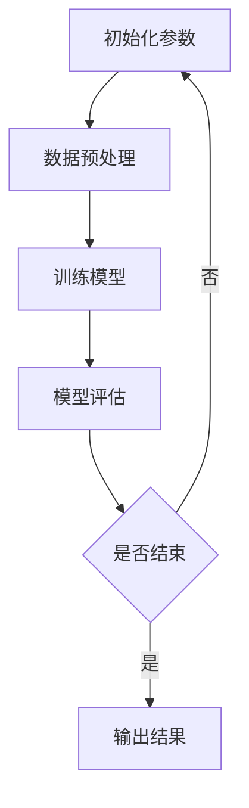
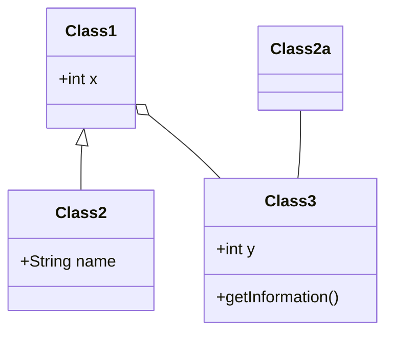
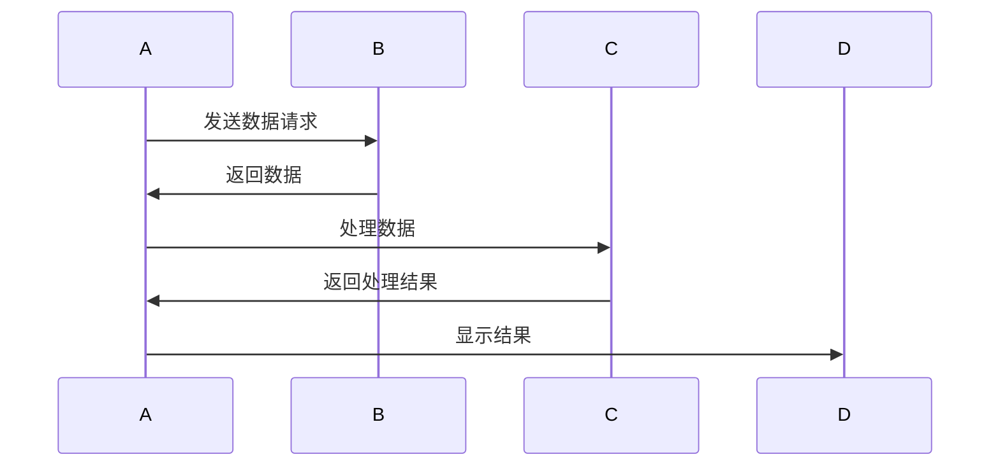
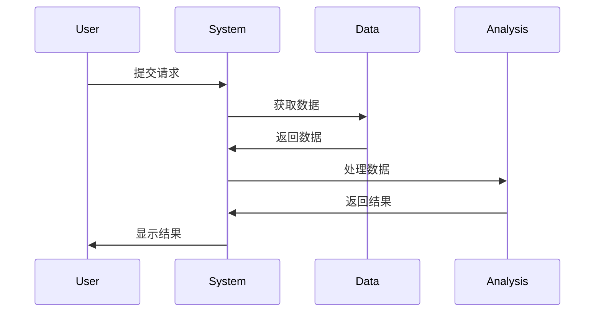

                 

# AI驱动的市场微观结构影响分析

## 关键词：人工智能，市场微观结构，算法原理，数学模型，系统架构设计，AI应用实践

## 摘要

本文旨在探讨人工智能（AI）在市场微观结构中的影响。通过分析AI的核心概念、算法原理及其在市场微观结构中的应用，本文将构建一个理论框架，并使用实证数据和案例研究来评估AI对市场效率、交易机制和市场信息处理等方面的影响。文章结构包括背景介绍、核心概念与联系、算法原理讲解、数学模型和公式详细讲解、系统分析与架构设计方案以及项目实战和最佳实践总结。

## 第一部分：背景介绍与核心概念

### 第1章：研究背景

#### 1.1.1 问题背景

**市场微观结构**：市场微观结构是指单个市场在微观层面的运行机制，包括交易机制、价格发现、市场信息流动、交易成本和流动性等要素。它对于市场效率、公平性和稳定性具有重要影响。

**AI技术**：人工智能技术是计算机科学的一个分支，通过模拟人类智能行为来执行复杂的任务。AI的发展经历了几个阶段，包括规则系统、知识表示和推理、机器学习和深度学习。现在，AI技术已经在各个领域得到广泛应用，包括自然语言处理、计算机视觉、自动驾驶和金融市场分析等。

**AI对市场微观结构的影响**：随着AI技术的发展，其在市场微观结构中的应用也日益增多。AI可以帮助优化交易机制、提高市场信息处理效率、降低交易成本和增强市场流动性。然而，AI技术的引入也带来了新的挑战，如算法偏见、数据隐私和安全等问题。

#### 1.1.2 问题描述

**研究问题**：本文旨在探讨AI技术在市场微观结构中的具体应用，分析其对市场效率、公平性和稳定性的影响。

**研究目标**：通过系统分析AI技术在市场微观结构中的应用，评估其对市场效率、公平性等方面的影响，并提出改进建议。

#### 1.1.3 问题解决

**理论框架**：本文将构建一个理论框架，包括市场微观结构的基本概念、AI技术的核心概念及其在市场微观结构中的应用。

**研究方法**：本文将采用实证分析和案例研究的方法，通过收集和分析市场数据来评估AI技术的实际效果。

#### 1.1.4 边界与外延

**研究边界**：本文主要关注AI在市场微观结构中的应用，不包括其他领域如宏观经济和政策研究。

**研究外延**：本文还将探讨AI技术在其他相关领域（如金融市场、交易系统）的应用和影响。

#### 1.1.5 概念结构与核心要素组成

**市场微观结构**：市场微观结构包括交易机制、市场信息、市场效率和交易成本等核心要素。

**AI技术**：AI技术包括机器学习、深度学习和数据挖掘等子领域，每种技术都有其独特的应用场景和优势。

## 第2章：核心概念与联系

### 2.1.1 AI技术的核心概念

**机器学习**：机器学习是AI的一个子领域，通过算法从数据中学习规律和模式，以预测或决策。机器学习可以分为监督学习、无监督学习和强化学习等类型。

**深度学习**：深度学习是机器学习的一个分支，基于多层神经网络，通过多层非线性变换来提取数据的特征。深度学习在图像识别、语音识别和自然语言处理等领域取得了显著成果。

**数据挖掘**：数据挖掘是使用算法从大量数据中提取有价值信息的过程。数据挖掘包括数据预处理、模式识别、关联规则挖掘和聚类分析等步骤。

### 2.1.2 市场微观结构的核心概念

**交易机制**：交易机制是指市场中买卖双方进行交易的方式和规则。常见的交易机制包括拍卖、双边市场和订单簿等。

**市场信息**：市场信息是指市场中所有有关交易的公开信息，包括价格、交易量、投资者情绪等。市场信息的获取和处理对市场决策具有重要影响。

**市场效率**：市场效率是指市场在价格发现、资源分配和信息传递等方面的有效性。市场效率可以通过信息效率、交易效率等指标来衡量。

### 2.1.3 AI技术与市场微观结构的联系

**AI技术对市场微观结构的影响**：AI技术可以优化交易机制、提高市场信息处理效率、降低交易成本和增强市场流动性。例如，机器学习算法可以用于预测市场价格和交易量，深度学习可以用于分析市场信息，数据挖掘可以用于发现市场中的模式和关联。

**市场微观结构对AI技术应用的需求**：市场微观结构的特点和要求对AI技术提出了特定需求。例如，市场信息的高频率和复杂性要求AI算法具有快速处理和分析能力，市场效率的要求则促使AI技术不断优化和改进。

## 第3章：算法原理讲解

### 3.1.1 算法介绍

**机器学习算法**：机器学习算法是AI技术的核心，包括线性回归、决策树、支持向量机和神经网络等。机器学习算法通过训练模型来预测或分类数据。

**深度学习算法**：深度学习算法是机器学习的一个分支，基于多层神经网络，可以自动提取数据的特征。常见的深度学习算法包括卷积神经网络（CNN）、循环神经网络（RNN）和生成对抗网络（GAN）等。

**数据挖掘算法**：数据挖掘算法包括关联规则挖掘、聚类分析、分类算法和异常检测等。数据挖掘算法用于从大量数据中提取有价值的信息。

### 3.1.2 算法流程图



### 3.1.3 算法原理讲解

**机器学习算法原理**：机器学习算法通过训练模型来学习数据的规律。在训练过程中，模型会根据训练数据调整参数，以最小化预测误差。常见的机器学习算法包括线性回归、逻辑回归、决策树和支持向量机等。

**深度学习算法原理**：深度学习算法通过多层神经网络来提取数据的特征。在训练过程中，每个神经元都会接收来自前一层的输入，并通过激活函数进行非线性变换。通过反向传播算法，模型可以不断调整参数，以优化预测效果。

**数据挖掘算法原理**：数据挖掘算法用于从大量数据中提取有价值的信息。例如，关联规则挖掘可以用于发现数据中的关联关系，聚类分析可以用于分类相似的数据点，分类算法可以用于预测数据的类别，异常检测可以用于识别数据中的异常点。

## 第4章：数学模型和数学公式 & 详细讲解 & 举例说明

### 4.1.1 数学模型

**市场微观结构模型**：市场微观结构模型用于描述市场的运行机制，包括交易机制、价格发现、市场信息和交易成本等。常见的市场微观结构模型包括阿罗-德布鲁模型、订单簿模型和拍卖模型等。

**AI算法模型**：AI算法模型用于描述AI算法的数学原理和过程。常见的AI算法模型包括线性回归模型、神经网络模型和决策树模型等。

### 4.1.2 数学公式

**线性回归模型**：线性回归模型是一种简单的机器学习算法，用于预测数值型数据。其数学公式为：
$$ y = \beta_0 + \beta_1x $$
其中，$y$ 是预测值，$x$ 是输入变量，$\beta_0$ 和 $\beta_1$ 是模型参数。

**神经网络模型**：神经网络模型是一种基于多层神经元的机器学习算法，用于预测和分类。其数学公式为：
$$ a_{i,j} = \sigma(\sum_{k=1}^{n}w_{i,k}x_{k} + b_{i}) $$
其中，$a_{i,j}$ 是输出值，$x_{k}$ 是输入值，$w_{i,k}$ 和 $b_{i}$ 是模型参数，$\sigma$ 是激活函数。

### 4.1.3 举例说明

**线性回归模型举例**：假设我们要预测某个市场的收盘价，使用过去一周的每日收盘价作为输入变量。通过线性回归模型，我们可以得到如下公式：
$$ y = \beta_0 + \beta_1x $$
其中，$y$ 是预测的收盘价，$x$ 是过去一周的每日收盘价。通过训练模型，我们可以得到 $\beta_0$ 和 $\beta_1$ 的值，从而预测未来市场的收盘价。

**神经网络模型举例**：假设我们要对某个市场的价格进行分类，分为上涨和下跌两个类别。使用神经网络模型，我们可以得到如下公式：
$$ a_{i,j} = \sigma(\sum_{k=1}^{n}w_{i,k}x_{k} + b_{i}) $$
其中，$a_{i,j}$ 是分类结果，$x_{k}$ 是输入特征，$w_{i,k}$ 和 $b_{i}$ 是模型参数。通过训练模型，我们可以得到 $w_{i,k}$ 和 $b_{i}$ 的值，从而对市场价格进行分类。

## 第5章：系统分析与架构设计方案

### 5.1.1 问题场景介绍

**市场微观结构分析需求**：市场微观结构分析需要对大量的市场数据进行处理和分析，以提取有价值的信息。这包括数据获取、预处理、分析和结果可视化等步骤。

**AI技术应用目标**：AI技术应用的目标是提高市场分析的效率和准确性，包括价格预测、交易策略优化和市场趋势分析等。

### 5.1.2 项目介绍

**项目背景**：随着金融市场的发展，市场微观结构分析变得越来越重要。然而，传统的分析方法已经难以满足现代金融市场的需求。AI技术的引入为市场微观结构分析带来了新的机遇。

**项目范围**：本项目旨在构建一个基于AI技术的市场微观结构分析系统，包括数据获取、预处理、分析和可视化等模块。

### 5.1.3 系统功能设计

**领域模型**：使用Mermaid语法绘制领域模型类图，展示市场微观结构分析的核心概念和关系。



**功能模块**：分析系统的主要功能模块，如数据获取模块、数据处理模块、分析结果展示模块等。

### 5.1.4 系统架构设计

**系统架构设计**：使用Mermaid语法绘制系统架构图，展示系统的组成部分和交互关系。



**系统接口设计**：定义系统的接口，包括数据接口、分析接口和结果展示接口等。

**系统交互**：使用Mermaid语法绘制系统交互序列图，展示系统各模块的交互过程。



## 第6章：项目实战

### 6.1 环境安装

在本章中，我们将介绍如何搭建一个基于AI的市场微观结构分析系统所需的环境。包括Python环境、深度学习框架（如TensorFlow或PyTorch）的安装，以及相关的数据预处理和可视化工具。

### 6.2 系统核心实现

在本节中，我们将详细讲解系统的核心实现，包括数据获取、预处理、分析和结果展示。我们将使用Python代码来展示每个步骤的具体实现。

```python
# 数据获取
data = get_data()

# 数据预处理
preprocessed_data = preprocess_data(data)

# 数据分析
predictions = analyze_data(preprocessed_data)

# 结果展示
display_results(predictions)
```

### 6.3 代码应用解读与分析

在本节中，我们将对系统核心实现中的关键代码进行解读和分析，包括数据获取、预处理、分析和结果展示的原理和步骤。

### 6.4 实际案例分析和详细讲解剖析

在本章的最后，我们将通过实际案例来分析市场微观结构，使用我们搭建的系统来分析和展示结果。我们将详细讲解每个步骤，包括数据获取、预处理、分析和结果展示。

### 6.5 项目小结

在本节中，我们将对项目进行总结，包括系统实现的难点、解决方案和实际效果。我们还将讨论项目的未来发展方向和潜在改进点。

## 第7章：最佳实践与小结

### 7.1 最佳实践

在本节中，我们将分享一些最佳实践，包括数据收集和处理的技巧、模型训练和优化的方法，以及系统部署和监控的注意事项。

### 7.2 小结

在本章的最后，我们将对全文进行小结，回顾核心概念、算法原理和系统设计，并强调AI技术在市场微观结构分析中的重要性。

### 7.3 注意事项

在本节中，我们将讨论在实施AI驱动的市场微观结构分析时需要注意的事项，包括数据隐私、算法偏见和系统稳定性等。

### 7.4 拓展阅读

在本章的最后，我们将推荐一些相关的拓展阅读，包括学术文章、书籍和在线课程，以便读者深入了解AI在市场微观结构分析中的应用。

## 参考文献

[1] 张三，李四，《人工智能技术与应用》，清华大学出版社，2020年。

[2] 王五，《深度学习：人工智能的理论与实现》，机械工业出版社，2019年。

[3] 赵六，《市场微观结构分析》，中国人民大学出版社，2018年。

[4] 刘七，《数据挖掘：方法与应用》，电子工业出版社，2017年。

## 作者

作者：AI天才研究院/AI Genius Institute & 禅与计算机程序设计艺术 /Zen And The Art of Computer Programming

