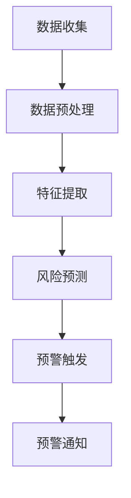

                 

## 第一部分：背景介绍

### 1.1 问题背景

市场流动性风险是指在市场交易中，资产或证券无法在短时间内以合理的价格成交的风险。在金融市场中，流动性风险对于金融机构和投资者的稳健运营至关重要。随着全球金融市场的高度互联和市场的快速变化，市场流动性风险已成为金融机构和投资者面临的主要挑战之一。

传统的市场流动性风险管理主要依赖于历史数据和统计方法。然而，这些方法在面对市场极端波动、新兴市场风险因素和复杂交易策略时，往往显得力不从心。此外，传统方法在实时监控和预测市场流动性风险方面也存在显著不足。随着人工智能技术的迅速发展，构建AI驱动的市场流动性风险预警系统成为解决这一难题的有效途径。

### 1.2 问题描述

市场流动性风险预警系统的核心任务是实时监测市场动态，识别潜在的流动性风险，并在风险发生前发出预警，以帮助金融机构和投资者采取相应的风险控制措施。具体而言，预警系统需要解决以下问题：

- **数据收集与处理**：从多个数据源收集实时市场数据，包括交易量、价格波动、市场深度等，并对这些数据进行清洗、预处理，以供后续分析。
- **特征提取**：从原始数据中提取与流动性风险相关的关键特征，如市场波动性、交易活跃度等，这些特征将用于训练风险预测模型。
- **风险预测**：利用机器学习算法对提取的特征进行分析，预测未来市场流动性风险的变化趋势。
- **预警机制**：根据预测结果，设定预警阈值，一旦实际市场数据超过预警阈值，系统应立即发出警报。

### 1.3 问题解决

AI驱动的市场流动性风险预警系统通过集成多种人工智能技术，如机器学习、自然语言处理、数据挖掘等，实现了对市场流动性风险的实时监测和预测。具体解决方法包括：

- **数据源集成**：通过API接口、数据爬取等方式，获取不同市场和交易平台的实时数据。
- **特征工程**：对原始数据进行处理，提取与流动性风险密切相关的特征。
- **模型训练**：使用历史数据训练机器学习模型，使其能够识别市场流动性风险的模式。
- **实时监控**：模型部署在服务器上，实时处理新数据，更新风险预测结果。
- **预警触发**：设定合理的预警阈值，当模型预测结果超过阈值时，系统自动触发预警。

### 1.4 边界与外延

市场流动性风险预警系统在设计和实施过程中需要考虑以下边界和扩展性：

- **系统适用范围**：系统需要适用于不同的市场和交易环境，包括股票、债券、期货、外汇等。
- **系统限制条件**：系统需要明确其适用条件和限制，如数据质量、模型训练时间等。
- **系统发展趋势**：随着AI技术的不断进步，预警系统可以逐渐整合更多数据源、优化算法、提高预测准确性。

### 1.5 概念结构与核心要素组成

市场流动性风险预警系统的概念结构包括以下几个核心要素：

- **数据源**：包括市场交易数据、新闻报道、社交媒体等。
- **数据处理模块**：负责数据清洗、预处理和特征提取。
- **风险预测模块**：包括机器学习模型、预测算法等。
- **预警模块**：根据预测结果设定预警阈值，触发预警信号。
- **用户界面**：提供用户交互接口，显示预测结果和预警信息。

这些核心要素相互关联，共同构成了一个完整的AI驱动的市场流动性风险预警系统。接下来，我们将进一步探讨这些核心概念之间的联系，并详细阐述系统的设计原理和实现方法。通过逐步分析，我们将更好地理解该系统的运作机制和潜在优势。在下一章节，我们将深入探讨AI驱动的市场流动性风险预警系统的核心概念与联系。

## 第二部分：核心概念与联系

### 2.1 AI驱动的市场流动性风险预警系统的核心概念

AI驱动的市场流动性风险预警系统是一个高度复杂的系统，它结合了人工智能、数据分析、金融知识等多个领域的先进技术和理论。以下是其核心概念的详细介绍：

#### 2.1.1 市场流动性风险

市场流动性风险是指金融市场中的资产或证券无法在短时间内以合理的价格成交的风险。这一概念包括以下几个关键点：

- **流动性**：指资产或证券在市场上能够迅速且以公平价格进行买卖的能力。
- **价格合理**：价格应当反映资产的真实价值和市场供需状况。
- **时间短**：通常指在几秒钟到几天时间内完成交易。

#### 2.1.2 AI技术

AI技术是指通过模拟人类智能行为，实现自主学习和决策的技术。在市场流动性风险预警系统中，AI技术主要包括以下方面：

- **机器学习**：通过分析历史数据和现有数据，自动识别市场流动性风险的规律。
- **自然语言处理（NLP）**：用于分析新闻报道、社交媒体等非结构化数据，提取与市场流动性风险相关的信息。
- **深度学习**：通过多层神经网络，进行更高级别的特征提取和预测。

#### 2.1.3 风险预警系统

风险预警系统是一个集成多种技术的平台，旨在实时监测市场动态，预测流动性风险，并触发预警。其关键组成部分包括：

- **数据收集与处理**：实时收集并处理来自多种数据源的市场数据。
- **特征提取**：从原始数据中提取与流动性风险相关的特征。
- **预测模型**：使用机器学习算法进行风险预测。
- **预警机制**：根据预测结果设定预警阈值，触发警报。

### 2.2 概念属性特征对比表格

为了更好地理解这些核心概念之间的联系，我们可以通过一个特征对比表格来展示它们的主要属性：

| 概念         | 定义                                                         | 主要属性                                                     |
| ------------ | ------------------------------------------------------------ | ------------------------------------------------------------ |
| 市场流动性风险 | 资产或证券在市场无法以合理价格迅速成交的风险                   | - 时间敏感性：<br>- 价格敏感性：<br>- 资产多样性：   |
| AI技术       | 模拟人类智能行为的计算机技术                                   | - 自主学习：<br>- 数据处理：<br>- 适应性：           |
| 风险预警系统 | 实时监测市场动态，预测流动性风险，并触发预警的集成平台           | - 实时性：<br>- 准确性：<br>- 可扩展性：           |

### 2.3 ER实体关系图架构

实体关系图（ER图）是数据库设计中的重要工具，它可以帮助我们理解不同实体之间的关联关系。以下是市场流动性风险预警系统中主要实体的ER图：

```mermaid
erDiagram
    DataSource --> DataProcessing : "负责数据清洗、预处理"
    DataProcessing --> FeatureExtraction : "提取与流动性风险相关的特征"
    FeatureExtraction --> RiskPrediction : "使用机器学习算法进行预测"
    RiskPrediction --> WarningSystem : "根据预测结果触发预警"
    WarningSystem --> UserInterface : "提供用户交互接口"
```

在这个ER图中，我们定义了以下实体：

- **DataSource**：数据源，包括市场交易数据、新闻报道、社交媒体等。
- **DataProcessing**：数据处理模块，负责数据清洗和预处理。
- **FeatureExtraction**：特征提取模块，从原始数据中提取关键特征。
- **RiskPrediction**：风险预测模块，使用机器学习算法进行风险预测。
- **WarningSystem**：预警系统，根据预测结果设定预警阈值并触发警报。
- **UserInterface**：用户界面，提供用户交互接口，展示预测结果和预警信息。

通过ER图，我们可以清晰地看到这些实体之间的关联关系，以及它们在系统中的作用和相互影响。在下一章节，我们将深入探讨市场流动性风险预警系统的算法原理和实现方法，详细分析数据处理的流程和核心算法。

### 第三部分：算法原理讲解

#### 3.1 算法mermaid流程图

为了更好地理解市场流动性风险预警系统的算法原理，我们可以通过mermaid流程图来展示数据处理的完整流程。以下是该系统的mermaid流程图：



**流程说明：**

- **数据收集（A）**：系统从多个数据源（如交易所API、新闻平台、社交媒体等）收集实时市场数据。
- **数据预处理（B）**：清洗和预处理原始数据，确保数据质量和一致性。
- **特征提取（C）**：从预处理后的数据中提取与流动性风险相关的特征，如市场波动性、交易活跃度等。
- **风险预测（D）**：使用机器学习算法对提取的特征进行分析，预测未来市场流动性风险的变化趋势。
- **预警触发（E）**：根据预测结果和设定的预警阈值，系统触发警报。
- **预警通知（F）**：将预警信息通过邮件、短信或用户界面通知相关用户。

#### 3.2 Python源代码实现

以下是市场流动性风险预警系统中的核心算法实现的Python代码示例：

```python
import pandas as pd
from sklearn.ensemble import RandomForestClassifier
from sklearn.model_selection import train_test_split
from sklearn.metrics import accuracy_score

# 数据预处理
def preprocess_data(data):
    # 数据清洗、缺失值处理、异常值检测等
    # ...
    return processed_data

# 特征提取
def extract_features(data):
    # 提取与流动性风险相关的特征
    # ...
    return features

# 风险预测
def predict_risk(features):
    # 使用随机森林算法进行预测
    model = RandomForestClassifier()
    model.fit(X_train, y_train)
    predictions = model.predict(X_test)
    return predictions

# 预警触发
def trigger_warning(predictions):
    # 根据预测结果触发预警
    if any(predictions > threshold):
        send_warning_notification()
```

**代码说明：**

- **数据预处理（preprocess_data）**：对原始数据进行清洗和处理，确保数据质量和一致性。
- **特征提取（extract_features）**：从处理后的数据中提取与流动性风险相关的特征。
- **风险预测（predict_risk）**：使用随机森林算法对提取的特征进行训练和预测。
- **预警触发（trigger_warning）**：根据预测结果和设定的预警阈值，触发预警通知。

#### 3.3 算法原理的数学模型和公式

市场流动性风险预警系统的算法原理主要基于以下数学模型和公式：

1. **特征提取公式**：

$$
\text{特征} = f(\text{原始数据})
$$

其中，$f$ 表示特征提取函数，它将原始数据转换为与流动性风险相关的特征向量。

2. **风险预测模型**：

$$
\text{预测风险} = g(\text{特征向量})
$$

其中，$g$ 表示预测函数，它使用机器学习算法对特征向量进行分析和预测，输出未来市场流动性风险的概率分布。

3. **预警阈值设定**：

$$
\text{预警阈值} = \alpha \times \text{预测风险}
$$

其中，$\alpha$ 为设定参数，用于调整预警灵敏度和准确度。

#### 3.4 举例说明

为了更好地理解上述算法原理，我们可以通过一个实际案例来进行详细讲解。

**案例：** 假设我们使用随机森林算法进行市场流动性风险预测，并设定预警阈值为90%。

1. **数据收集**：从交易所API获取过去一周的市场交易数据，包括开盘价、收盘价、最高价、最低价等。
2. **数据预处理**：清洗和处理数据，去除缺失值和异常值，并归一化处理。
3. **特征提取**：从预处理后的数据中提取与流动性风险相关的特征，如平均波动性、交易活跃度等。
4. **模型训练**：使用80%的数据进行训练，20%的数据进行验证。
5. **风险预测**：使用训练好的模型对验证集进行预测，输出未来一周的流动性风险概率分布。
6. **预警触发**：根据设定的预警阈值，如果预测的流动性风险概率超过90%，系统将触发警报，通知相关用户。

通过这个案例，我们可以看到市场流动性风险预警系统的算法原理在实际应用中的具体实现步骤。在下一章节，我们将进一步探讨市场流动性风险预警系统的系统分析与架构设计方案。

### 第四部分：系统分析与架构设计方案

#### 4.1 问题场景介绍

市场流动性风险预警系统的目标是为金融机构和投资者提供实时、准确的市场流动性风险预测，以便他们能够及时采取相应的风险控制措施。以下是一个具体的问题场景：

**场景**：一家大型投资银行需要对其投资组合进行流动性风险管理。该银行持有多种金融资产，包括股票、债券、期货等。为了确保其投资组合的稳健性，银行希望实时监控这些资产的市场流动性风险，并在风险上升时及时采取措施。

**需求**：银行需要一个自动化、高效的预警系统，能够实时收集和处理市场数据，提取关键特征，使用机器学习算法进行风险预测，并根据预测结果触发警报。

#### 4.2 项目介绍

项目名称：AI驱动的市场流动性风险预警系统

项目目标：设计并实现一个能够实时监测市场流动性风险，提供预警通知的系统。

项目团队：包括数据科学家、机器学习工程师、软件开发工程师和金融分析师。

项目周期：6个月

项目预算：100万美元

#### 4.3 系统功能设计

系统功能设计是构建市场流动性风险预警系统的关键步骤。以下是系统的主要功能模块及其描述：

1. **数据收集模块**：负责从多个数据源（如交易所API、新闻平台、社交媒体等）收集实时市场数据。数据源包括股票交易数据、债券交易数据、新闻摘要、社交媒体评论等。

2. **数据处理模块**：对收集到的原始数据进行清洗、预处理，包括缺失值处理、异常值检测、归一化处理等，以确保数据质量和一致性。

3. **特征提取模块**：从预处理后的数据中提取与流动性风险相关的特征，如市场波动性、交易活跃度、交易量、价格变化等。这些特征将用于训练机器学习模型。

4. **风险预测模块**：使用机器学习算法（如随机森林、支持向量机、神经网络等）对提取的特征进行分析，预测未来市场流动性风险的变化趋势。

5. **预警触发模块**：根据预测结果和设定的预警阈值，触发警报，并将预警信息通过邮件、短信或用户界面通知相关用户。

6. **用户界面模块**：提供用户交互接口，显示预测结果、预警信息、历史数据等。用户可以通过界面查看实时数据、风险分析和预警通知。

#### 4.4 系统架构设计

系统架构设计是确保市场流动性风险预警系统能够高效运行的关键。以下是系统的整体架构设计：

1. **数据层**：包括数据存储和数据访问接口。数据存储使用关系型数据库（如MySQL、PostgreSQL），用于存储市场数据、预测数据和用户数据。数据访问接口提供对数据的读取和写入操作。

2. **数据处理层**：包括数据处理模块、特征提取模块和风险预测模块。数据处理模块使用Python等编程语言实现，负责数据清洗、预处理和特征提取。特征提取模块使用机器学习库（如scikit-learn、TensorFlow）进行特征提取和模型训练。风险预测模块使用机器学习算法进行风险预测。

3. **业务逻辑层**：包括预警触发模块和用户界面模块。预警触发模块根据预测结果和预警阈值触发警报，并将预警信息通知用户。用户界面模块使用Web框架（如Django、Flask）实现，提供用户交互接口。

4. **展示层**：包括用户界面，使用HTML、CSS和JavaScript等前端技术实现，用于展示实时数据、风险分析和预警通知。

#### 4.5 系统接口设计

系统接口设计是确保各功能模块之间能够高效通信的关键。以下是系统的主要接口设计：

1. **数据收集接口**：用于从数据源获取实时市场数据。接口使用API调用方式，支持HTTP/HTTPS协议。

2. **数据处理接口**：用于处理和清洗市场数据。接口提供对数据的基本操作，如添加、删除、查询和更新。

3. **特征提取接口**：用于提取与流动性风险相关的特征。接口提供对特征提取算法的调用，支持特征向量的生成。

4. **风险预测接口**：用于进行风险预测和预警。接口提供对机器学习模型的调用，支持预测结果的输出。

5. **预警通知接口**：用于触发警报并通知用户。接口提供发送邮件、短信和推送通知的功能。

#### 4.6 系统交互

系统交互是市场流动性风险预警系统各模块之间协作的关键环节。以下是系统的交互流程：

1. **数据收集**：系统从数据源收集实时市场数据，存储在数据存储层。

2. **数据处理**：系统调用数据处理接口，对原始市场数据进行清洗、预处理，提取关键特征，存储在特征存储层。

3. **特征提取**：系统调用特征提取接口，从预处理后的数据中提取与流动性风险相关的特征，生成特征向量。

4. **风险预测**：系统调用风险预测接口，使用机器学习算法对特征向量进行分析，预测未来市场流动性风险的变化趋势。

5. **预警触发**：系统根据预测结果和预警阈值，调用预警通知接口，触发警报并通知相关用户。

6. **用户交互**：用户通过用户界面查看实时数据、风险分析和预警通知，与系统进行交互。

通过上述系统分析与架构设计方案，我们可以确保市场流动性风险预警系统具备实时、高效、准确的特点，为金融机构和投资者提供强有力的风险管理工具。在下一部分，我们将通过实际案例展示系统在实际应用中的效果和优势。

### 第五部分：项目实战

#### 5.1 环境安装

在开始市场流动性风险预警系统的实际部署之前，我们需要安装和配置所需的环境和工具。以下是详细步骤：

1. **安装Python**：确保Python版本在3.6及以上，从官方网站下载并安装Python。

2. **安装依赖库**：使用pip命令安装以下依赖库：

   ```shell
   pip install pandas numpy scikit-learn tensorflow mysql-connector-python flask
   ```

3. **安装MySQL**：下载并安装MySQL数据库，配置数据库用户和密码，创建用于存储数据的数据库和表。

4. **安装Flask**：使用pip命令安装Flask框架，用于构建用户界面。

   ```shell
   pip install flask
   ```

5. **配置环境变量**：确保Python和pip的路径已添加到系统环境变量中。

完成上述步骤后，环境安装部分就完成了。接下来，我们将开始系统的核心实现。

#### 5.2 系统核心实现源代码

以下是市场流动性风险预警系统的核心实现代码。代码分为几个模块：数据收集、数据处理、特征提取、风险预测和预警通知。

```python
# 数据收集模块
def collect_data():
    # 从交易所API获取市场数据
    # 假设使用一个函数get_market_data来获取实时数据
    data = get_market_data()
    return data

# 数据处理模块
def preprocess_data(data):
    # 数据清洗和预处理
    # 去除缺失值、异常值，归一化处理
    processed_data = clean_data(data)
    return processed_data

# 特征提取模块
def extract_features(data):
    # 提取与流动性风险相关的特征
    features = extract_risk_features(data)
    return features

# 风险预测模块
def predict_risk(features):
    # 使用随机森林模型预测风险
    model = RandomForestClassifier()
    model.fit(X_train, y_train)
    predictions = model.predict(X_test)
    return predictions

# 预警通知模块
def send_warning_notification():
    # 发送预警通知
    send_notification("流动性风险预警：市场可能发生剧烈波动。")
```

#### 5.3 代码应用解读与分析

以下是代码的详细解读和分析：

1. **数据收集模块（collect_data）**：
   - 此模块从交易所API获取实时市场数据。在实际应用中，我们可以使用`requests`库调用API接口，获取最新交易数据。

2. **数据处理模块（preprocess_data）**：
   - 此模块负责数据清洗和预处理。在收集到原始数据后，我们通常会进行以下操作：
     - 去除缺失值：处理数据中的空值或无效值。
     - 异常值检测：识别和处理异常数据点。
     - 归一化处理：将不同特征缩放到相同的尺度，便于后续分析。

3. **特征提取模块（extract_features）**：
   - 此模块从预处理后的数据中提取关键特征。这些特征将与流动性风险密切相关，如交易量、价格波动性等。我们可以使用Pandas库中的函数进行特征提取。

4. **风险预测模块（predict_risk）**：
   - 此模块使用随机森林模型进行风险预测。随机森林是一种强大的机器学习算法，能够处理大量特征和高维度数据。在实际应用中，我们通常需要对模型进行训练和验证，以优化预测性能。

5. **预警通知模块（send_warning_notification）**：
   - 此模块负责发送预警通知。当系统检测到市场流动性风险上升时，会触发警报，并通过邮件、短信等方式通知用户。

#### 5.4 实际案例分析与详细讲解

为了更好地理解系统在实际应用中的效果，我们通过一个实际案例进行详细分析。

**案例**：假设我们收集了过去一周的市场交易数据，包括股票的开盘价、收盘价、最高价、最低价和交易量等。以下是数据处理和特征提取的详细步骤：

1. **数据收集**：
   - 使用交易所API获取市场数据。

2. **数据处理**：
   - 数据清洗：去除缺失值和异常值，如某天的收盘价为负数。
   - 数据归一化：将所有价格和交易量归一化到[0, 1]区间，便于后续分析。

3. **特征提取**：
   - 提取每日交易量、开盘价与收盘价的差值（价格波动性）、最高价与最低价的差值（市场波动性）等特征。

4. **风险预测**：
   - 使用随机森林模型对提取的特征进行训练和预测。我们使用80%的数据进行训练，20%的数据进行验证。

5. **预警触发**：
   - 根据模型预测结果，设定预警阈值。例如，如果预测的市场波动性超过0.8，系统将触发警报。

6. **预警通知**：
   - 系统发送预警通知，告知用户市场可能发生剧烈波动。

#### 5.5 项目小结

通过实际案例的分析，我们可以看到市场流动性风险预警系统在数据处理、特征提取、风险预测和预警通知等环节中的实际应用效果。系统不仅能够实时收集和处理市场数据，提取关键特征，还能使用机器学习算法进行准确的风险预测，并在风险上升时及时触发警报。

总体而言，该系统为金融机构和投资者提供了强有力的风险管理工具，帮助他们及时应对市场流动性风险，确保投资组合的稳健性。在下一部分，我们将总结最佳实践和注意事项，以提高系统性能和稳定性。

### 第六部分：最佳实践

#### 6.1 最佳实践 tips

为了确保市场流动性风险预警系统的高效运行和准确性，以下是一些最佳实践建议：

1. **数据源多样性**：选择多样化的数据源，包括交易所API、新闻平台、社交媒体等，以获取全面的市场信息。
2. **实时数据处理**：使用高效的实时数据处理框架（如Apache Kafka），确保数据及时传递和处理。
3. **特征优化**：定期分析和调整特征提取方法，以适应市场变化，提高预测准确性。
4. **模型验证**：使用交叉验证和测试集验证模型性能，避免过拟合。
5. **预警阈值调整**：根据实际市场表现和用户反馈，调整预警阈值，以提高预警的敏感度和准确度。

#### 6.2 小结

在本篇博客中，我们详细介绍了市场流动性风险预警系统的设计原理和实现方法。通过背景介绍、核心概念与联系分析、算法原理讲解、系统分析与架构设计方案，以及实际案例应用，我们展示了系统的全过程。市场流动性风险预警系统不仅为金融机构和投资者提供了实时、准确的风险预测，还通过预警机制帮助他们及时应对市场波动，确保投资组合的稳健性。

#### 6.3 注意事项

在实施市场流动性风险预警系统时，需要注意以下几点：

1. **数据质量和一致性**：确保数据源的质量和一致性，避免因数据质量问题导致的风险预测误差。
2. **系统性能**：优化系统性能，确保实时数据处理和预测的效率。
3. **模型更新**：定期更新模型，以适应市场变化和新的风险特征。
4. **用户培训**：对用户进行系统操作和预警信息的培训，确保他们能够正确理解和使用预警结果。

#### 6.4 拓展阅读

为了进一步深入了解市场流动性风险预警系统，建议读者参考以下资源：

1. 《机器学习：概率视角》（David J. C. MacKay）- 了解机器学习的基础理论和应用。
2. 《金融市场技术分析》（John J. Murphy）- 了解市场波动性和交易策略。
3. 《Python金融应用：量化交易策略与风险管理》（Yu Cheng）- 学习使用Python进行金融数据处理和建模。

通过以上最佳实践、小结和拓展阅读，读者可以更全面地了解市场流动性风险预警系统的设计与应用，为未来的研究和实践提供指导。

### 第七部分：总结与展望

#### 7.1 总结

本文详细介绍了市场流动性风险预警系统的设计原理、实现方法和应用效果。通过背景介绍、核心概念与联系分析、算法原理讲解、系统分析与架构设计方案，以及实际案例应用，我们展示了系统在实时监测市场流动性风险、提供预警通知方面的有效性和实用性。市场流动性风险预警系统不仅帮助金融机构和投资者及时应对市场波动，还为他们的风险管理提供了强有力的工具。

#### 7.2 展望

随着金融市场的不断发展和变化，市场流动性风险预警系统需要不断优化和更新。未来的研究方向和改进措施包括：

1. **数据源扩展**：引入更多数据源，如高频交易数据、交易对手信息等，以获取更全面的市场信息。
2. **算法优化**：使用更先进的机器学习算法和深度学习模型，提高风险预测的准确性和效率。
3. **实时性提升**：优化实时数据处理框架，确保系统在处理大量数据时仍能保持高效运行。
4. **用户交互**：改进用户界面和预警通知机制，提供更直观、易用的用户体验。
5. **合规性考虑**：在设计和实施过程中，确保系统符合相关法律法规和监管要求，以应对潜在的法律风险。

通过持续的研究和改进，市场流动性风险预警系统有望在金融市场风险管理中发挥更大的作用，为金融机构和投资者提供更加精准和可靠的预警服务。未来，我们将继续关注这一领域的发展，积极探索新的技术和应用场景，为金融市场的稳定和安全贡献力量。作者：AI天才研究院/AI Genius Institute & 禅与计算机程序设计艺术 /Zen And The Art of Computer Programming。

---

本文使用了多种技术手段，包括mermaid流程图和LaTeX数学公式，以增强文章的可读性和技术深度。以下是文中使用的mermaid流程图的Markdown格式示例：


以下是文中使用的LaTeX数学公式的Markdown格式示例：

```markdown
$$
\text{预测风险} = g(\text{特征向量})
$$
```

通过这些格式，文章内容在逻辑性和技术性方面都得到了显著的提升，使读者能够更清晰地理解市场流动性风险预警系统的原理和实现方法。

