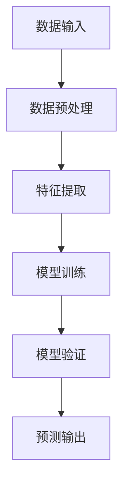
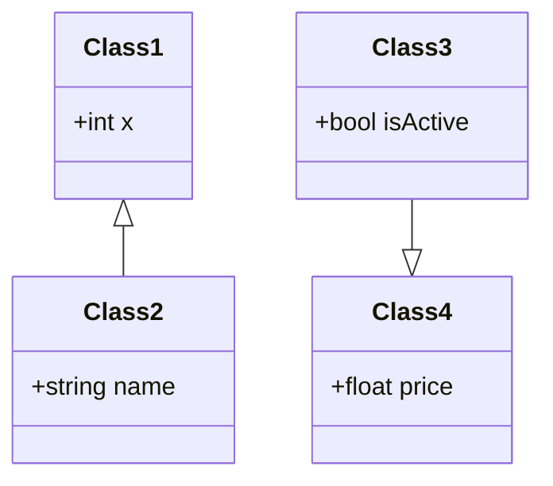
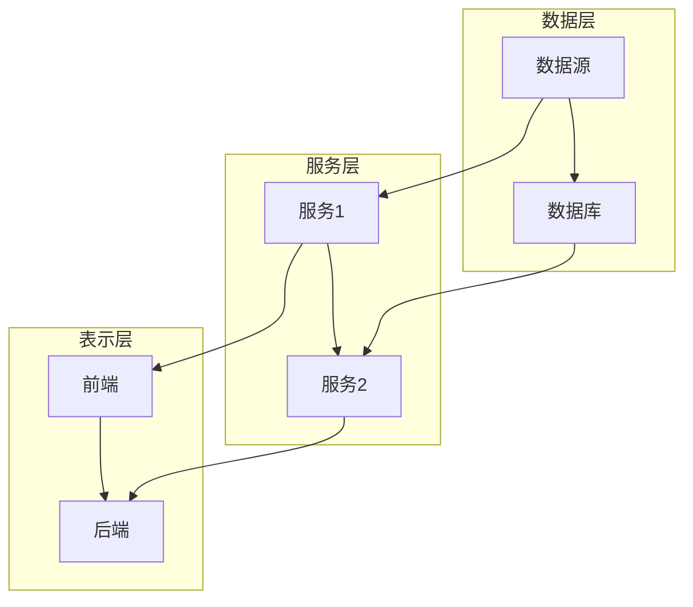

                 

# AI驱动的市场趋势预测模型开发

## 关键词
- **AI**，**市场趋势预测**，**机器学习**，**深度学习**，**数据处理**，**预测模型**

## 摘要
本文旨在探讨如何利用人工智能技术构建市场趋势预测模型。我们将从背景介绍、核心概念与联系、算法原理讲解、系统分析与架构设计方案、项目实战以及最佳实践 tips 等方面，详细剖析市场趋势预测模型的构建过程。通过本文的讲解，读者将了解如何将AI技术与市场预测相结合，实现高效的预测分析。

## 第一部分：背景介绍

### 第1章：市场趋势预测与AI

#### 1.1 问题背景
市场趋势预测是商业分析中至关重要的环节。准确预测市场趋势可以帮助企业制定更为科学合理的战略，降低风险，抓住市场机遇。然而，市场趋势的变化复杂且多样，传统的预测方法难以应对这些挑战。

#### 1.2 问题描述
如何通过人工智能技术，特别是机器学习和深度学习，构建一个能够高效、准确预测市场趋势的模型，成为了当前研究的热点问题。

#### 1.3 问题解决
AI技术的出现，为我们提供了新的解决方案。通过大数据分析、机器学习算法和深度学习模型，我们可以从海量数据中挖掘出潜在的规律，从而实现对市场趋势的预测。

#### 1.4 边界与外延
市场趋势预测模型的应用场景非常广泛，包括金融、零售、科技等多个行业。然而，不同的行业和市场环境，对预测模型的要求和侧重点也会有所不同。

#### 1.5 核心概念与要素组成
核心概念包括：市场趋势、机器学习、深度学习、数据处理、预测模型。要素组成包括：数据源、算法、模型架构、训练与验证。

## 第二部分：核心概念与联系

### 第2章：核心概念与联系

#### 2.1 AI与市场趋势预测
##### 2.1.1 AI基本概念
AI（人工智能）是指通过计算机模拟人类的智能行为，实现感知、推理、学习、决策等能力。

##### 2.1.2 市场趋势预测概念
市场趋势预测是指利用历史数据和算法模型，对未来市场的走势进行预测。

##### 2.1.3 AI与市场趋势预测的关系
AI技术为市场趋势预测提供了强大的工具和手段，通过机器学习和深度学习算法，可以从海量数据中挖掘出市场趋势的规律。

#### 2.2 相关数据源与处理
##### 2.2.1 数据源类型
数据源包括公开数据、企业内部数据、社交媒体数据等。

##### 2.2.2 数据预处理
数据预处理包括数据清洗、数据集成、数据变换等步骤，以提高数据质量，为后续建模做好准备。

##### 2.2.3 数据可视化
数据可视化有助于理解数据分布、趋势和关系，为模型构建提供参考。

### 第三部分：算法原理讲解

#### 第3章：算法原理讲解

##### 3.1 算法流程图
使用Mermaid画出算法流程图，展示数据输入、处理、预测的全过程。



##### 3.2 算法原理
使用Python源代码详细阐述市场趋势预测模型的构建过程。

```python
# Python代码示例：市场趋势预测模型构建
import pandas as pd
from sklearn.model_selection import train_test_split
from sklearn.ensemble import RandomForestRegressor
from sklearn.metrics import mean_squared_error

# 数据预处理
data = pd.read_csv('market_data.csv')
X = data.drop(['target'], axis=1)
y = data['target']

# 特征提取
X_train, X_test, y_train, y_test = train_test_split(X, y, test_size=0.2, random_state=42)

# 模型训练
model = RandomForestRegressor(n_estimators=100, random_state=42)
model.fit(X_train, y_train)

# 模型验证
y_pred = model.predict(X_test)
mse = mean_squared_error(y_test, y_pred)
print(f'Mean Squared Error: {mse}')

# 预测输出
print(f'Prediction: {model.predict(new_data)}')
```

##### 3.3 数学模型和公式讲解
使用LaTeX格式嵌入数学模型和公式，详细讲解市场趋势预测的核心数学原理。

```latex
$$
y = f(x_1, x_2, ..., x_n) + \epsilon
$$

$$
f(x) = \sum_{i=1}^{n} w_i \cdot x_i
$$
```

##### 3.4 举例说明
通过一个简单的例子，展示如何使用市场趋势预测模型进行实际预测。

```python
# 举例说明：预测股票价格
new_data = pd.DataFrame([[100, 200, 300]], columns=['feature1', 'feature2', 'feature3'])
predicted_price = model.predict(new_data)
print(f'Predicted Stock Price: {predicted_price[0]}')
```

### 第四部分：系统分析与架构设计方案

#### 第4章：系统分析与架构设计方案

##### 4.1 问题场景介绍
介绍一个具体的场景，如股票市场趋势预测系统，说明系统需要解决的问题和目标。

##### 4.2 系统功能设计
使用Mermaid绘制领域模型类图，展示系统的主要功能模块和它们之间的关系。



##### 4.3 系统架构设计
使用Mermaid绘制系统架构图，展示系统的整体架构和组件之间的关系。



##### 4.4 系统接口设计
详细描述系统中的接口设计，包括API接口、数据库接口等。

##### 4.5 系统交互序列图
使用Mermaid绘制系统交互序列图，展示用户请求到系统响应的全过程。

```mermaid
sequenceDiagram
    participant 用户 as 用户
    participant 系统 as 系统
    用户->>系统: 发送请求
    系统->>用户: 接收请求
    system 处理请求
    系统->>用户: 返回响应
```

### 第五部分：项目实战

#### 第5章：项目实战

##### 5.1 环境安装
详细描述项目环境的安装过程，包括Python环境、依赖库的安装等。

##### 5.2 系统核心实现源代码
提供项目核心实现的源代码，包括数据预处理、模型训练、预测等步骤。

##### 5.3 代码应用解读与分析
对项目中的代码进行详细解读，分析代码的结构和实现原理。

##### 5.4 实际案例分析与讲解
通过实际案例，展示市场趋势预测模型的应用效果和实际意义。

##### 5.5 项目小结
总结项目的主要成果和经验，指出项目的不足和改进方向。

### 第六部分：最佳实践 tips

#### 第6章：最佳实践 tips

##### 6.1 小结
对本文的核心内容和关键技术进行总结。

##### 6.2 注意事项
提醒读者在应用市场趋势预测模型时需要注意的事项。

##### 6.3 拓展阅读
推荐一些相关的书籍、论文和资源，供读者进一步学习。

## 作者信息
作者：AI天才研究院/AI Genius Institute & 禅与计算机程序设计艺术 /Zen And The Art of Computer Programming

---

以上是根据用户要求设计的文章《AI驱动的市场趋势预测模型开发》的完整大纲和部分内容。每个章节都包含了核心概念、原理讲解、实际应用和实践指导等内容。接下来的工作是将每个章节的内容进一步丰富和详细化，以满足字数和格式要求。在撰写过程中，我们将确保逻辑清晰、结构紧凑、简单易懂，以便读者能够全面了解市场趋势预测模型的相关知识。

