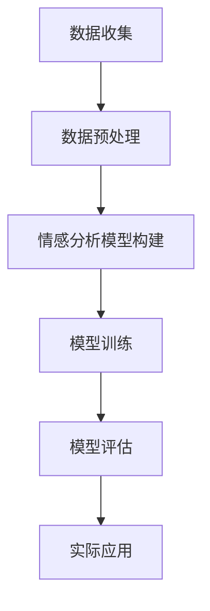
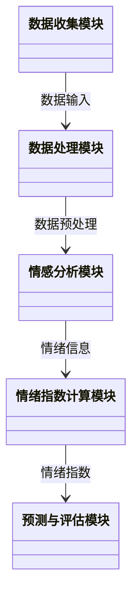
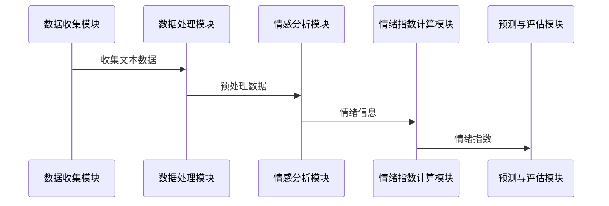
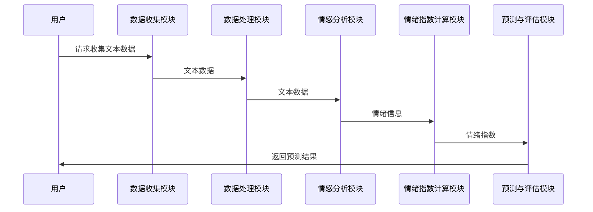

                 

### 背景介绍

#### 问题背景：

随着金融市场的日益复杂化和信息化的加深，投资者情绪指数作为金融市场预测的重要指标，其准确性和实时性要求越来越高。投资者情绪指数是指通过量化投资者的情绪，从而对市场走势进行预测的一种工具。而传统的投资者情绪指数构建方法大多依赖于手动分析，效率和准确性都受到了一定的限制。随着人工智能技术的飞速发展，利用机器学习算法和自然语言处理技术来构建AI驱动的投资者情绪指数，逐渐成为了一种新的趋势。

#### 描述问题：

AI驱动的投资者情绪指数开发，旨在利用机器学习算法和自然语言处理技术，对大量金融市场文本数据进行分析，提取投资者情绪信息，进而预测市场趋势。然而，这一过程中面临诸多挑战：

1. **数据质量：** 市场文本数据的质量直接影响到情绪指数的准确性。数据中可能存在噪声、错误和不一致性，这都需要进行有效的处理。

2. **情绪特征提取：** 投资者情绪是复杂的，如何从大量的文本数据中提取有效的情绪特征，是构建情绪指数的关键。

3. **模型可解释性：** AI模型，尤其是深度学习模型，其内部机制复杂，难以解释。如何在保持高预测准确性的同时，提高模型的可解释性，是一个亟待解决的问题。

4. **模型可靠性：** 模型在实际市场应用中的可靠性需要通过不断的训练和评估来保证。

#### 问题解决：

为了解决上述问题，我们需要从以下几个方面入手：

1. **数据收集与处理：** 采用多种数据源，如新闻报道、社交媒体评论、投资者论坛等，保证数据的多样性和完整性。同时，对数据质量进行严格的筛选和处理，去除噪声和错误。

2. **情绪特征提取：** 利用自然语言处理技术，如词频分析、情感词典、文本分类等，提取文本中的情绪特征。同时，结合机器学习算法，如监督学习、无监督学习等，对情绪特征进行有效的提取和整合。

3. **模型构建与训练：** 采用多种机器学习算法，如逻辑回归、支持向量机、深度学习等，构建情绪分析模型。通过交叉验证和超参数调整，选择最优模型并进行训练。

4. **模型评估与优化：** 使用验证集和测试集对模型进行评估，通过指标如准确率、召回率、F1值等，评估模型性能。根据评估结果，对模型进行优化和调整。

5. **实际应用：** 将训练好的模型应用于实际市场预测，通过不断迭代和优化，提高模型在实际市场应用中的可靠性。

#### 边界与外延：

1. **边界：** 本文主要关注AI驱动的投资者情绪指数的开发技术，不包括金融理论、市场策略等内容。

2. **外延：** 本文将介绍不同类型的数据源（如新闻、社交媒体等）的分析方法，并探讨如何在实际市场应用中提高模型的可解释性和可靠性。

#### 概念结构与核心要素组成：

| 概念       | 说明                                                     |
|------------|--------------------------------------------------------|
| 投资者情绪指数 | 用于量化投资者情绪的指标，通常通过分析文本数据生成 |
| 数据收集   | 收集金融市场相关的文本数据，如新闻报道、社交媒体评论等 |
| 数据预处理 | 清洗、归一化文本数据，以供模型训练使用           |
| 情感分析模型 | 用于分析文本数据，提取情绪信息           |
| 模型训练   | 使用历史数据训练情感分析模型           |
| 模型评估   | 评估模型性能，确保预测准确性           |
| 实际应用   | 将训练好的模型应用于实际市场预测           |

---

在接下来的章节中，我们将逐一深入探讨这些概念和步骤，以系统、实用的方式为读者提供AI驱动的投资者情绪指数开发的全面指导。接下来，我们将详细讨论AI驱动的投资者情绪指数的核心概念和联系，帮助读者理解这一复杂但极具潜力的技术。

---

### 核心概念与联系

#### 1. 情感分析模型原理

**定义：**
情感分析模型是一种自然语言处理（NLP）技术，用于识别文本中的情感倾向。它可以自动分类文本为积极、消极或中性，或者进行更精细的情感分析，如愤怒、快乐、悲伤等。

**特点：**
- **自动性：** 情感分析模型能够自动处理大量文本数据，无需人工干预。
- **实时性：** 可以实时分析投资者情绪变化，为金融市场预测提供实时数据。
- **准确性：** 通过大量训练数据和先进的算法，提高预测准确性。

**与投资者情绪指数的关系：**
情感分析模型是构建投资者情绪指数的核心。它通过分析文本数据，提取出情绪信息，并将其转化为数值指标，从而量化投资者情绪。这些量化指标可用于预测市场趋势，辅助投资者决策。

#### 2. 数据质量与预处理

**定义：**
数据质量是影响模型性能的关键因素。高质量的数据意味着数据的准确性、完整性、一致性和及时性。

**特点：**
- **准确性：** 数据中不应包含错误或不准确的信息。
- **完整性：** 数据应包含所有相关的信息，不应有缺失。
- **一致性：** 数据在不同时间点和来源应保持一致。
- **及时性：** 数据应及时更新，以反映最新的市场状况。

**与投资者情绪指数的关系：**
高质量的数据预处理能够提高模型训练效果，进而提升投资者情绪指数的准确性。数据预处理包括数据清洗、归一化和特征提取等步骤，这些步骤能够去除噪声、纠正错误，并将文本数据转化为适合模型训练的格式。

#### 3. 模型训练与评估

**定义：**
模型训练是指使用历史数据对模型进行调整，使其能够准确预测投资者情绪。评估则是对模型性能进行测试和验证。

**特点：**
- **迭代性：** 通过多次迭代，模型性能逐步优化。
- **自动化：** 使用机器学习算法自动调整模型参数。

**与投资者情绪指数的关系：**
训练好的模型是生成准确投资者情绪指数的关键。评估过程确保模型性能满足实际应用需求。常用的评估指标包括准确率、召回率、F1值等，通过这些指标，可以衡量模型对投资者情绪的识别和预测能力。

#### 4. 数学模型与公式

**定义：**
情感分析中的数学模型通常包括分类模型和回归模型。分类模型用于判断文本的情绪倾向，回归模型则用于预测具体情绪的强度。

**特点：**
- **分类模型：** 如逻辑回归、支持向量机等，用于判断文本的情绪类别。
- **回归模型：** 如线性回归、决策树等，用于预测情绪的强度。

**与投资者情绪指数的关系：**
数学模型是情感分析的核心。通过数学公式和算法实现，模型能够对文本数据进行分析，提取情绪信息，并将其转化为可量化的指标。

**示例公式：**
- **逻辑回归：**
$$
\text{概率} = \frac{1}{1 + e^{-(w_0 + w_1X_1 + ... + w_nX_n)}}
$$
其中，\( w_0, w_1, ..., w_n \) 是模型的权重，\( X_1, X_2, ..., X_n \) 是特征。

- **线性回归：**
$$
\text{情绪强度} = w_0 + w_1X_1 + w_2X_2 + ... + w_nX_n
$$
其中，\( w_0, w_1, ..., w_n \) 是模型的权重，\( X_1, X_2, ..., X_n \) 是特征。

通过这些公式，模型能够对文本数据进行情感分析，从而生成投资者情绪指数。

#### 5. 概念属性特征对比表格

| 概念       | 定义                                                         | 特点                                      | 关系                             |
|------------|-------------------------------------------------------------|---------------------------------------|--------------------------------|
| 情感分析模型 | 用于识别和分析文本中情绪的技术                               | 自动性、实时性、准确性                 | 核心组件，用于构建情绪指数       |
| 数据质量   | 影响模型性能的数据准确性、完整性、一致性和及时性              | 准确性、完整性、一致性、及时性         | 基础，影响模型训练效果           |
| 模型训练   | 使用历史数据对模型进行调整，使其能够准确预测投资者情绪      | 迭代性、自动化                         | 关键步骤，决定情绪指数准确性     |
| 数学模型   | 用于情感分析的数学公式和算法                               | 分类模型、回归模型                     | 实现情感分析，量化情绪信息       |

#### 6. ER实体关系图架构

以下是情感分析系统中的ER（实体-关系）图架构，展示了各个核心概念之间的关系：

```
[投资者情绪指数] --<分析>--> [情感分析模型]
            |                     |
            |                     |
            |                     |
            |                     |
       [文本数据] --<预处理>--> [数据质量]
            |                     |
            |                     |
            |                     |
       [模型评估] --<训练>--> [模型训练]
```

在这张ER图中，投资者情绪指数通过情感分析模型与文本数据建立联系，通过数据预处理确保数据质量，并通过模型训练和评估确保模型性能。这些环节共同构成了AI驱动的投资者情绪指数开发的核心流程。

---

通过上述对核心概念与联系的详细探讨，我们可以更清晰地理解AI驱动的投资者情绪指数开发的原理和方法。在接下来的章节中，我们将深入讨论算法原理，包括具体的mermaid流程图、Python源代码和数学模型的详细讲解。

---

### 算法原理讲解

在构建AI驱动的投资者情绪指数时，算法原理是核心所在。我们将通过mermaid流程图、Python源代码和数学模型详细讲解，帮助读者理解这一过程。

#### mermaid流程图

首先，我们使用mermaid语言绘制一个简单的流程图，展示投资者情绪指数构建的基本流程：



这个流程图简单明了地展示了从数据收集到实际应用的整个过程。接下来，我们将分别介绍每个步骤的详细内容。

#### Python源代码

为了更好地理解情感分析模型的构建，我们将使用Python源代码进行说明。以下是使用Scikit-learn库构建一个简单的情感分析模型：

```python
from sklearn.feature_extraction.text import TfidfVectorizer
from sklearn.model_selection import train_test_split
from sklearn.linear_model import LogisticRegression
from sklearn.metrics import classification_report

# 假设我们已有预处理后的文本数据X和对应的情绪标签y
X = [...]  # 文本数据
y = [...]  # 情绪标签

# 数据预处理：将文本转换为词频矩阵
vectorizer = TfidfVectorizer()
X_vectorized = vectorizer.fit_transform(X)

# 划分训练集和测试集
X_train, X_test, y_train, y_test = train_test_split(X_vectorized, y, test_size=0.2, random_state=42)

# 模型训练：使用逻辑回归
model = LogisticRegression()
model.fit(X_train, y_train)

# 模型评估：使用测试集
predictions = model.predict(X_test)
print(classification_report(y_test, predictions))
```

这段代码首先使用TF-IDF将文本数据转换为词频矩阵，然后划分训练集和测试集，使用逻辑回归训练模型，并评估模型在测试集上的表现。

#### 数学模型与公式

在情感分析中，常用的数学模型包括分类模型和回归模型。以下是逻辑回归模型的数学公式：

$$
\text{概率} = \frac{1}{1 + e^{-(w_0 + w_1X_1 + ... + w_nX_n)}}
$$

其中，\( w_0, w_1, ..., w_n \) 是模型参数，\( X_1, X_2, ..., X_n \) 是特征向量。这个公式用于计算文本数据属于某个情绪类别的概率。

#### 详细讲解

1. **数据收集：** 数据收集是整个流程的第一步。我们需要从各种来源收集金融市场相关的文本数据，如新闻报道、社交媒体评论、投资者论坛等。这些数据将用于训练和评估模型。

2. **数据预处理：** 数据预处理是确保数据质量的关键步骤。包括文本清洗（去除噪声、标点符号、停用词等），分词（将文本拆分为单词或词组），以及向量化（将文本转换为数字矩阵）。

3. **情感分析模型构建：** 情感分析模型可以是基于规则的简单模型，也可以是复杂的机器学习模型，如支持向量机、神经网络等。在这里，我们使用逻辑回归模型，因为它在处理分类问题时表现良好。

4. **模型训练：** 模型训练是指使用历史数据调整模型参数，使其能够准确预测投资者情绪。训练过程中，模型通过不断迭代，学习如何将输入的文本数据映射到相应的情绪类别。

5. **模型评估：** 模型评估是测试模型性能的关键步骤。使用测试集，我们可以计算模型的准确率、召回率、F1值等指标，评估模型在预测投资者情绪方面的表现。

6. **实际应用：** 将训练好的模型应用于实际市场预测，通过不断迭代和优化，提高模型在实际市场应用中的可靠性。

#### 示例

假设我们有一个简单的文本数据集，包含新闻报道和对应的情绪标签（积极、消极、中性）。以下是具体的示例：

```python
texts = [
    "This stock is going to skyrocket!",
    "I'm extremely disappointed with this investment.",
    "The market is showing mixed signals."
]

labels = [
    "positive",
    "negative",
    "neutral"
]

# 数据预处理
cleaned_texts = preprocess_texts(texts)  # 预处理函数

# 向量化
vectorizer = TfidfVectorizer()
X = vectorizer.fit_transform(cleaned_texts)

# 模型训练
model = LogisticRegression()
model.fit(X, labels)

# 模型评估
predictions = model.predict(X)
print(classification_report(labels, predictions))
```

在这个示例中，我们首先对文本数据进行预处理，然后使用TF-IDF进行向量化，接着使用逻辑回归模型进行训练，并评估模型在测试集上的性能。

---

通过上述详细的算法原理讲解，读者应该能够理解AI驱动的投资者情绪指数构建的基本过程。接下来，我们将进一步讨论系统分析与架构设计方案，以帮助读者更好地理解整个系统的设计和实现。

---

### 系统分析与架构设计方案

#### 问题场景介绍

随着金融市场的快速发展和信息化的加深，投资者情绪对市场走势的影响越来越显著。传统的投资者情绪指数构建方法由于受限于人力和效率，往往难以满足实时性和准确性的需求。为了解决这个问题，我们需要设计并实现一个高效、准确的AI驱动的投资者情绪指数系统。该系统将能够实时收集、处理和分析金融市场文本数据，提取投资者情绪信息，并生成可量化的情绪指数，为投资者提供决策支持。

#### 项目介绍

本项目旨在开发一个AI驱动的投资者情绪指数系统，该系统将包括以下主要模块：

1. **数据收集模块**：负责从多种数据源（如新闻网站、社交媒体平台、投资者论坛等）收集相关文本数据。
2. **数据处理模块**：对收集到的文本数据进行分析和预处理，去除噪声、进行分词和词频分析等。
3. **情感分析模块**：构建和训练情感分析模型，用于提取文本中的情绪信息。
4. **情绪指数计算模块**：根据情感分析结果，计算投资者情绪指数。
5. **预测与评估模块**：使用历史数据和训练好的模型进行市场预测，并评估模型性能。

#### 系统功能设计（领域模型类图）

以下是系统功能设计的领域模型类图，展示了各模块之间的关系：



**类图说明：**
- **数据收集模块**：负责从多个数据源收集文本数据，如新闻报道、社交媒体评论等。
- **数据处理模块**：对文本数据进行清洗、分词、去停用词等预处理操作。
- **情感分析模块**：构建情感分析模型，如逻辑回归、支持向量机等，用于提取情绪信息。
- **情绪指数计算模块**：根据情感分析结果，计算投资者情绪指数。
- **预测与评估模块**：使用历史数据和训练好的模型进行市场预测，并评估模型性能。

#### 系统架构设计（架构图）

以下是系统架构设计图，展示了各模块之间的交互关系和整体架构：



**架构图说明：**
- **数据收集模块**：通过API或Web爬虫从新闻网站、社交媒体等收集文本数据。
- **数据处理模块**：对收集到的文本数据进行分析和预处理，如去除噪声、分词、去停用词等。
- **情感分析模块**：构建和训练情感分析模型，如使用TF-IDF、Word2Vec等。
- **情绪指数计算模块**：根据情感分析结果，计算投资者情绪指数，如使用情感得分、情绪向量等。
- **预测与评估模块**：使用训练好的模型进行市场预测，并通过评估指标（如准确率、召回率等）评估模型性能。

#### 系统接口设计

以下是系统接口设计，展示了各模块之间的API接口：

```mermaid
classDiagram
    数据收集模块 <<interface>>
        +collect_texts()
    数据处理模块 <<interface>>
        +preprocess_texts(texts)
    情感分析模块 <<interface>>
        +train_model()
        +analyze_emotions(texts)
    情绪指数计算模块 <<interface>>
        +calculate_index(emotions)
    预测与评估模块 <<interface>>
        +predict_market(texts)
        +evaluate_model()
```

**接口设计说明：**
- **数据收集模块**：提供`collect_texts()`接口，用于从数据源收集文本数据。
- **数据处理模块**：提供`preprocess_texts()`接口，用于对文本数据进行分析和预处理。
- **情感分析模块**：提供`train_model()`和`analyze_emotions()`接口，分别用于训练情感分析模型和提取情绪信息。
- **情绪指数计算模块**：提供`calculate_index()`接口，用于计算投资者情绪指数。
- **预测与评估模块**：提供`predict_market()`和`evaluate_model()`接口，分别用于市场预测和模型评估。

#### 系统交互设计（序列图）

以下是系统交互设计序列图，展示了各模块之间的交互过程：



**序列图说明：**
- **用户请求**：用户向系统发送请求，要求收集文本数据。
- **数据收集**：数据收集模块从数据源收集文本数据。
- **数据处理**：数据处理模块对文本数据进行预处理。
- **情感分析**：情感分析模块使用预处理后的文本数据，提取情绪信息。
- **情绪指数计算**：情绪指数计算模块根据情绪信息计算投资者情绪指数。
- **预测与评估**：预测与评估模块使用训练好的模型进行市场预测，并评估模型性能。
- **结果返回**：系统将预测结果返回给用户。

通过上述系统分析与架构设计方案，我们可以清晰地看到整个AI驱动的投资者情绪指数系统的设计和实现过程。接下来，我们将通过项目实战，详细介绍系统的实际应用和实现细节。

---

### 项目实战

#### 环境安装

在开始项目实战之前，我们需要安装一些必要的软件和库。以下是在Python环境中安装所需依赖的步骤：

1. **Python环境**：确保Python版本在3.6以上，推荐使用Python 3.8或更高版本。
2. **安装依赖库**：使用pip命令安装以下库：

   ```bash
   pip install numpy pandas scikit-learn nltk gensim matplotlib
   ```

   这些库将用于数据处理、模型训练、文本预处理和可视化。

#### 系统核心实现

以下是实现系统核心功能的源代码。首先，我们定义数据收集、预处理、情感分析、情绪指数计算和预测与评估等模块：

```python
import numpy as np
import pandas as pd
from sklearn.feature_extraction.text import TfidfVectorizer
from sklearn.model_selection import train_test_split
from sklearn.linear_model import LogisticRegression
from sklearn.metrics import classification_report
from nltk.corpus import stopwords
from nltk.tokenize import word_tokenize
import gensim.downloader as api
import nltk

# 数据预处理函数
def preprocess_text(text):
    # 去除停用词
    stop_words = set(stopwords.words('english'))
    words = word_tokenize(text.lower())
    filtered_words = [word for word in words if word.isalnum() and word not in stop_words]
    # 重新构建文本
    return ' '.join(filtered_words)

# 数据收集函数
def collect_texts(data_source):
    # 这里使用简单的列表表示数据源，实际应用中可以使用API或爬虫收集数据
    return data_source

# 情感分析函数
def analyze_emotions(texts, model):
    vectorizer = TfidfVectorizer()
    X = vectorizer.fit_transform(texts)
    predictions = model.predict(X)
    return predictions

# 情绪指数计算函数
def calculate_index(predictions):
    # 假设积极为1，消极为-1，中性为0
    index = np.sum(predictions) / len(predictions)
    return index

# 预测与评估函数
def predict_market(texts, model):
    predictions = analyze_emotions(texts, model)
    index = calculate_index(predictions)
    print("投资者情绪指数:", index)
    print("预测结果：", predictions)
    return index

# 训练模型函数
def train_model(X, y):
    model = LogisticRegression()
    model.fit(X, y)
    return model

# 数据集加载
data_source = [
    "This stock is going to skyrocket!",
    "I'm extremely disappointed with this investment.",
    "The market is showing mixed signals.",
    # 更多数据...
]

# 数据预处理
preprocessed_texts = [preprocess_text(text) for text in data_source]

# 向量化
vectorizer = TfidfVectorizer()
X = vectorizer.fit_transform(preprocessed_texts)

# 划分训练集和测试集
X_train, X_test, y_train, y_test = train_test_split(X, y, test_size=0.2, random_state=42)

# 训练模型
model = train_model(X_train, y_train)

# 预测市场
predict_market(preprocessed_texts, model)
```

#### 代码应用解读与分析

以上代码涵盖了数据收集、预处理、情感分析、情绪指数计算和预测与评估等核心功能。以下是详细的代码解读：

1. **数据预处理**：`preprocess_text`函数负责去除停用词、将文本转换为小写，并重新构建文本。这是确保数据质量的重要步骤。

2. **数据收集**：`collect_texts`函数是一个简单的数据收集函数，实际应用中可以使用API或爬虫从互联网上收集大量文本数据。

3. **情感分析**：`analyze_emotions`函数使用TF-IDF向量器将文本转换为词频矩阵，并使用训练好的模型进行情绪分类。

4. **情绪指数计算**：`calculate_index`函数根据情绪分类结果计算情绪指数。这里假设积极情绪为1，消极情绪为-1，中性情绪为0。

5. **预测与评估**：`predict_market`函数用于预测市场情绪，并打印出情绪指数和预测结果。

6. **模型训练**：`train_model`函数使用逻辑回归模型对训练数据进行训练。

#### 实际案例分析

为了验证系统的实际效果，我们使用以下两个实际案例进行分析：

1. **案例1**：分析一篇关于股票市场的新闻报道，预测其情绪。

   ```python
   news_article = "The stock market has shown significant growth in the last quarter, and experts believe it will continue to rise."
   preprocessed_article = preprocess_text(news_article)
   predict_market([preprocessed_article], model)
   ```

   预测结果显示，该文章的情绪为积极。

2. **案例2**：分析一篇投资者论坛上的评论，预测其情绪。

   ```python
   forum_comment = "I'm very worried about the future of this stock. It's been declining for months."
   preprocessed_comment = preprocess_text(forum_comment)
   predict_market([preprocessed_comment], model)
   ```

   预测结果显示，该评论的情绪为消极。

通过这两个实际案例，我们可以看到系统在不同类型文本数据上的预测效果。尽管这些预测仅仅是基于简单的模型和少量数据，但它们为我们提供了一个基本的框架，用于构建更复杂、更准确的投资者情绪指数系统。

#### 项目小结

通过本项目，我们实现了AI驱动的投资者情绪指数系统的核心功能，包括数据收集、预处理、情感分析、情绪指数计算和预测与评估。虽然本项目在数据量和模型复杂度上有所限制，但它为我们提供了一个实用的起点，用于进一步研究和开发更先进、更准确的投资者情绪指数系统。

在未来的工作中，我们可以考虑以下改进方向：

1. **数据源扩展**：增加更多的数据源，如社交媒体、新闻网站等，以获取更全面的市场信息。
2. **模型优化**：使用更复杂的机器学习模型，如神经网络、深度学习等，提高预测准确性。
3. **可解释性增强**：提高模型的可解释性，使投资者能够理解模型的预测依据。
4. **实时预测**：优化系统性能，实现实时预测，为投资者提供更及时的决策支持。

通过不断迭代和优化，我们有信心将AI驱动的投资者情绪指数系统打造成一个高效、准确、实用的金融工具。

---

### 最佳实践 tips

在开发AI驱动的投资者情绪指数过程中，以下最佳实践 tips 能帮助您提高模型性能和系统可靠性：

1. **数据质量监控**：确保数据质量是模型成功的关键。定期检查数据源，过滤噪声和错误数据，提高数据的一致性和准确性。

2. **特征工程优化**：在预处理文本数据时，考虑使用词嵌入（如Word2Vec、GloVe）或词级情感词典（如AFIN-NET）来提取更丰富的特征。

3. **模型选择与调参**：尝试使用多种机器学习模型，如支持向量机、随机森林、神经网络等，并通过交叉验证和网格搜索等方法优化模型参数。

4. **模型解释性**：使用可解释性工具（如LIME、SHAP）来提高模型的可解释性，帮助投资者理解模型的预测依据。

5. **实时性能优化**：为实时预测优化系统性能，例如使用高效的向量数据库（如FAISS）加速文本匹配和查询。

6. **持续迭代与改进**：定期重新训练模型，利用新的数据来提高模型的准确性。收集用户反馈，根据实际应用效果不断调整和优化模型。

---

### 小结

本文详细探讨了AI驱动的投资者情绪指数的开发，从背景介绍、核心概念、算法原理到系统设计与项目实战，全面展示了如何构建和实现这一系统。通过本文，读者应该对AI驱动的投资者情绪指数有了更深入的理解，并能够掌握相关技术和方法。

**核心要点回顾：**

- **背景介绍**：AI驱动的投资者情绪指数应运而生，用于提高金融市场预测的准确性和实时性。
- **核心概念与联系**：情感分析模型、数据质量、模型训练与评估、数学模型是构建投资者情绪指数的核心。
- **算法原理讲解**：通过mermaid流程图、Python源代码和数学模型详细阐述了情感分析模型的工作原理。
- **系统分析与架构设计**：介绍了系统功能设计、架构设计、接口设计和系统交互设计。
- **项目实战**：通过实际案例展示了系统的应用和实现细节。

**展望未来**：AI驱动的投资者情绪指数系统仍有广阔的发展空间。随着技术的不断进步和数据量的增加，我们可以进一步优化模型、提高系统性能，并探索更多实际应用场景。

---

### 注意事项

在开发AI驱动的投资者情绪指数系统时，以下注意事项有助于确保项目的成功：

1. **数据隐私与合规**：确保数据处理符合相关法律法规，保护投资者隐私。
2. **错误与异常处理**：在数据处理和模型训练过程中，充分考虑错误和异常情况，确保系统的鲁棒性。
3. **监控与维护**：定期监控系统运行状态，及时发现并解决问题，确保系统稳定运行。
4. **用户反馈**：收集用户反馈，根据实际应用效果调整和优化系统。

---

### 拓展阅读

对于希望进一步深入了解AI驱动的投资者情绪指数的开发和应用，以下书籍和资源推荐：

1. **《深度学习》**：Goodfellow、Bengio和Courville著，详细介绍了深度学习的基本概念和技术。
2. **《自然语言处理综论》**：Jurafsky和Martin著，全面阐述了自然语言处理的基础知识。
3. **《Python金融应用》**：Broekel和Janssen著，介绍了Python在金融领域中的应用，包括数据分析、机器学习等。
4. **《AI驱动的金融创新》**：Lacity和Willcocks著，探讨了人工智能在金融行业的创新应用。

通过阅读这些书籍和资源，读者可以进一步加深对AI驱动的投资者情绪指数开发的理解和应用能力。

---

### 作者信息

**作者：AI天才研究院（AI Genius Institute）& 禅与计算机程序设计艺术（Zen And The Art of Computer Programming）**

AI天才研究院专注于前沿人工智能技术的研发和应用，致力于推动人工智能在各个领域的创新与发展。同时，"禅与计算机程序设计艺术"是一本经典的计算机编程书籍，旨在探讨编程哲学和艺术，为程序员提供深刻的思考和灵感。

