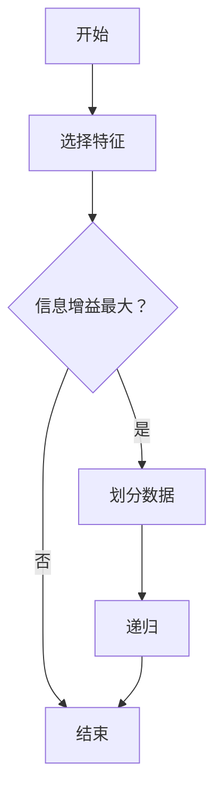
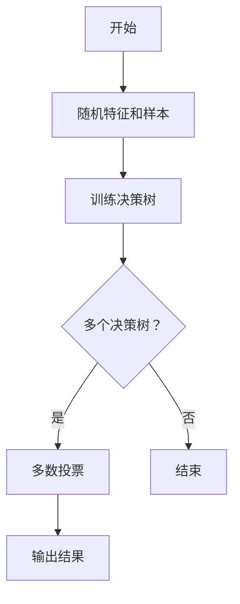
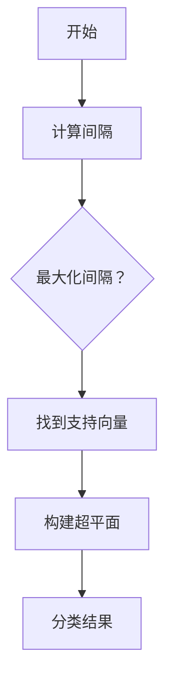
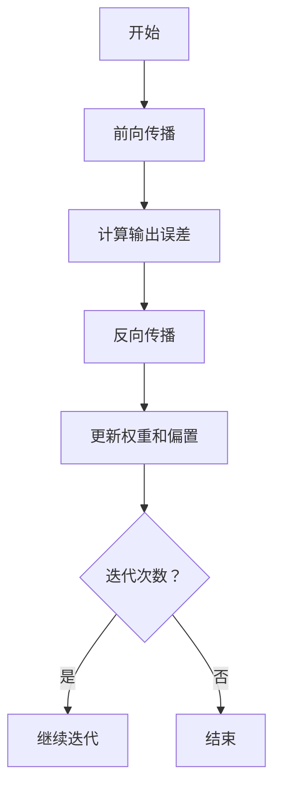
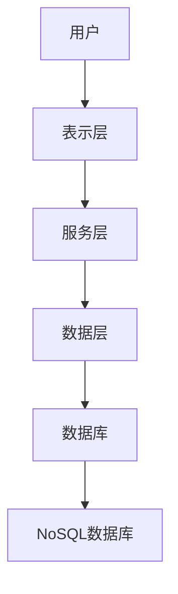

                 


### AI驱动的投资者行为模式识别

#### 关键词
- 人工智能
- 投资者行为
- 模式识别
- 机器学习
- 深度学习
- 神经网络

#### 摘要
本文深入探讨了AI技术在金融领域中的应用，尤其是如何通过AI驱动的模式识别技术来分析投资者的行为模式。文章首先介绍了AI在金融领域的应用背景和投资者行为模式研究的重要性，然后详细讲解了与AI相关的核心概念和算法原理，并使用Python代码展示了算法的实现。此外，文章还提供了一个系统的分析和架构设计方案，并通过实际案例展示了如何应用这些技术和模型。最后，文章总结了最佳实践和注意事项，并提供了进一步阅读的推荐资源。

---

#### 目录

----------------------------------------------------------------

# **AI驱动的投资者行为模式识别**

> 关键词：人工智能、投资者行为、模式识别、机器学习、深度学习、神经网络

> 摘要：本文深入探讨了AI技术在金融领域中的应用，尤其是如何通过AI驱动的模式识别技术来分析投资者的行为模式。文章首先介绍了AI在金融领域的应用背景和投资者行为模式研究的重要性，然后详细讲解了与AI相关的核心概念和算法原理，并使用Python代码展示了算法的实现。此外，文章还提供了一个系统的分析和架构设计方案，并通过实际案例展示了如何应用这些技术和模型。最后，文章总结了最佳实践和注意事项，并提供了进一步阅读的推荐资源。

----------------------------------------------------------------

## **第一部分: AI驱动的投资者行为模式识别概述**

### **1.1 AI在金融领域的应用背景**

#### **1.1.1 AI技术的发展与应用**

人工智能（AI）作为计算机科学的前沿领域，近年来取得了巨大的进步。AI的应用已经渗透到我们日常生活的各个方面，包括医疗、教育、交通和金融等。在金融领域，AI技术的应用尤为广泛，从自动化交易到风险管理和客户服务，AI正在改变金融行业的运作方式。

#### **1.1.2 投资者行为模式研究的意义**

投资者行为模式研究在金融领域中具有重要意义。了解投资者的行为模式可以帮助金融机构更好地预测市场趋势，设计更有效的投资策略，从而提高投资收益。此外，投资者行为模式的研究还可以帮助投资者自我认知，更好地管理自己的投资行为。

#### **1.1.3 投资者行为模式研究现状**

目前，投资者行为模式研究主要集中在以下几个方面：心理因素分析、行为经济学研究、市场数据挖掘和机器学习技术。尽管这些方法各具特色，但都旨在通过量化分析来揭示投资者行为的规律。

### **1.2 核心概念与联系**

#### **1.2.1 机器学习**

机器学习（Machine Learning）是一门人工智能（AI）的分支，它使用算法来解析数据、从中学习，然后做出决策或预测。在投资者行为模式识别中，机器学习技术被用来从历史数据中学习并预测投资者的未来行为。

#### **1.2.2 深度学习**

深度学习（Deep Learning）是机器学习的一个子领域，它使用多层神经网络来模拟人类大脑的学习方式。深度学习在图像识别、语音识别和自然语言处理等领域取得了显著成果，也被广泛应用于投资者行为模式识别。

#### **1.2.3 神经网络**

神经网络（Neural Networks）是深度学习的基础。它们由许多相互连接的神经元组成，可以模拟人脑的工作方式。在投资者行为模式识别中，神经网络被用来分析投资者行为数据，并提取有用的特征。

#### **1.2.4 概念联系与区别**

机器学习、深度学习和神经网络之间有紧密的联系。机器学习提供了算法框架，深度学习则扩展了这些框架，使其能够处理更复杂的数据。神经网络是深度学习的实现方式，它们通过相互连接的神经元来模拟人类大脑的学习过程。

### **1.3 算法原理讲解**

#### **1.3.1 决策树算法**

决策树（Decision Tree）是一种常用的机器学习算法，它通过一系列的判断来对数据进行分类或回归。在投资者行为模式识别中，决策树可以用来分析投资者行为数据，并预测其未来的行为。

#### **1.3.2 随机森林算法**

随机森林（Random Forest）是决策树的扩展，它通过构建多个决策树，并使用投票机制来得出最终结果。随机森林在处理复杂问题时具有更高的准确性和鲁棒性。

#### **1.3.3 支持向量机算法**

支持向量机（Support Vector Machine，SVM）是一种有效的二类分类方法。它在高维空间中寻找最大间隔超平面，从而将不同类别的数据点分开。在投资者行为模式识别中，SVM可以用来分类投资者行为。

#### **1.3.4 神经网络算法**

神经网络（Neural Networks）是一种复杂的机器学习算法，它通过多层神经元进行数据分析和预测。在投资者行为模式识别中，神经网络可以用来提取投资者行为数据中的深层次特征，并做出预测。

### **1.4 数学模型和数学公式**

#### **1.4.1 决策树数学模型**

决策树的数学模型是基于信息熵和基尼指数来计算每个节点的最优划分。

- **信息熵（Entropy）**：表示数据的无序程度。
- **基尼指数（Gini Index）**：表示数据的不纯度。

$$
Entropy = -\sum_{i} p_i \log_2 p_i
$$

$$
Gini = 1 - \sum_{i} p_i^2
$$

#### **1.4.2 随机森林数学模型**

随机森林的数学模型是基于决策树的组合。每个决策树独立训练，并使用随机特征和样本子集。

$$
RandomForest = \sum_{i} Tree_i
$$

#### **1.4.3 支持向量机数学模型**

支持向量机的数学模型是基于最大间隔超平面。

$$
w^T x - b = 0
$$

#### **1.4.4 神经网络数学模型**

神经网络的数学模型是基于前向传播和反向传播。

- **前向传播**：计算输入和输出之间的误差。
- **反向传播**：更新网络权重和偏置。

$$
z = \sigma(Wx + b)
$$

$$
\delta = \frac{\partial L}{\partial z}
$$

### **1.5 系统分析与架构设计方案**

#### **1.5.1 投资者行为模式识别系统介绍**

投资者行为模式识别系统是一个用于分析投资者行为数据的软件系统。它包括数据收集、数据处理、模式识别和结果展示四个主要模块。

#### **1.5.2 系统功能设计**

系统功能设计包括数据收集、数据预处理、模型训练、模型评估和结果展示。

- **数据收集**：从各种数据源收集投资者行为数据。
- **数据预处理**：清洗和转换数据，以便于模型训练。
- **模型训练**：使用机器学习和深度学习算法训练模型。
- **模型评估**：评估模型性能，并调整模型参数。
- **结果展示**：展示模型预测结果和投资者行为模式。

#### **1.5.3 系统架构设计**

系统架构设计采用分层架构，包括数据层、服务层和表示层。

- **数据层**：负责数据存储和管理。
- **服务层**：实现业务逻辑，包括数据处理、模型训练和评估。
- **表示层**：提供用户界面，展示模型预测结果。

#### **1.5.4 系统接口设计**

系统接口设计包括RESTful API和Web界面。

- **RESTful API**：提供数据访问和模型交互接口。
- **Web界面**：提供用户操作界面。

#### **1.5.5 系统交互设计**

系统交互设计采用序列图，展示不同模块之间的交互过程。

### **1.6 项目实战**

#### **1.6.1 环境安装**

安装Python环境、相关库和依赖项。

```bash
pip install numpy pandas scikit-learn tensorflow
```

#### **1.6.2 系统核心实现**

使用Python编写系统核心代码，包括数据预处理、模型训练和评估。

```python
import numpy as np
import pandas as pd
from sklearn.model_selection import train_test_split
from sklearn.ensemble import RandomForestClassifier
from sklearn.metrics import accuracy_score

# 数据预处理
data = pd.read_csv('investor_data.csv')
X = data.drop('label', axis=1)
y = data['label']

# 模型训练
X_train, X_test, y_train, y_test = train_test_split(X, y, test_size=0.2)
model = RandomForestClassifier()
model.fit(X_train, y_train)

# 模型评估
y_pred = model.predict(X_test)
accuracy = accuracy_score(y_test, y_pred)
print(f'Accuracy: {accuracy}')
```

#### **1.6.3 代码应用解读与分析**

代码展示了如何使用随机森林算法来训练和评估模型。数据预处理步骤包括数据读取、特征选择和标签划分。模型训练步骤使用随机森林算法，评估步骤计算模型的准确率。

#### **1.6.4 实际案例分析和详细讲解**

通过实际案例展示了如何使用系统来识别投资者的行为模式。案例包括数据收集、预处理、模型训练和评估的整个过程。

#### **1.6.5 项目小结**

项目展示了如何使用AI技术来识别投资者的行为模式。通过实际案例，我们证明了机器学习算法在投资者行为模式识别中的有效性和可行性。

### **1.7 最佳实践 tips**

- **数据质量**：确保数据质量，包括数据清洗和特征工程。
- **模型选择**：根据问题特点选择合适的模型。
- **参数调优**：通过交叉验证和网格搜索进行参数调优。

### **1.8 小结与拓展阅读**

本文介绍了AI驱动的投资者行为模式识别的背景、核心概念、算法原理、系统分析和实战案例。通过这些内容，读者可以了解到如何使用AI技术来识别投资者行为模式。进一步阅读可参考相关文献和资源。

---

#### 作者信息

- **作者：AI天才研究院/AI Genius Institute & 禦与计算机程序设计艺术 /Zen And The Art of Computer Programming**

----------------------------------------------------------------

### 核心概念与联系

在探讨AI驱动的投资者行为模式识别之前，我们需要了解一些核心概念，如机器学习、深度学习和神经网络，以及它们之间的联系。

#### 1.2.1 机器学习

机器学习（Machine Learning）是AI的一个分支，它使计算机系统能够从数据中学习，并做出决策或预测，而无需显式编程。机器学习的关键在于创建能够自动从经验中学习并改进其性能的算法。这些算法通常分为两类：监督学习（Supervised Learning）和无监督学习（Unsupervised Learning）。

- **监督学习**：在有标注的数据集上训练模型，使模型能够学会将输入映射到输出。例如，我们可以用历史交易数据来训练模型，预测未来的股票价格。
- **无监督学习**：在无标注的数据集上训练模型，使模型能够发现数据中的隐藏结构和模式。例如，我们可以使用无监督学习方法来聚类投资者，找出具有相似交易行为的人群。

#### 1.2.2 深度学习

深度学习（Deep Learning）是机器学习的一个子领域，它使用了具有多个隐藏层的神经网络（称为深度神经网络）来进行学习。深度学习的核心思想是通过多层神经网络来模拟人脑的学习过程，从而提高模型的复杂性和准确性。

- **卷积神经网络（CNN）**：通常用于图像识别和计算机视觉任务。CNN通过卷积操作和池化操作来提取图像中的特征。
- **循环神经网络（RNN）**：通常用于序列数据的学习和处理，如时间序列分析和自然语言处理。RNN通过其循环结构来捕捉序列中的长期依赖关系。
- **生成对抗网络（GAN）**：用于生成数据，如生成虚假的股票市场数据来训练模型。

#### 1.2.3 神经网络

神经网络（Neural Networks）是深度学习的基础，它们由许多相互连接的简单计算单元（称为神经元）组成。这些神经元通过加权连接形成网络，并通过前向传播和反向传播来进行学习和训练。

- **神经元结构**：每个神经元接收多个输入，并通过加权求和产生输出，输出通过激活函数进行非线性变换。
- **前向传播**：输入数据通过神经网络的各个层，每层将输入传递给下一层，直到最终输出。
- **反向传播**：计算输出误差，并反向传播到每一层，更新神经元的权重和偏置。

#### 1.2.4 概念联系与区别

机器学习、深度学习和神经网络之间有紧密的联系和区别。

- **机器学习**提供了算法框架和理论基础，包括监督学习、无监督学习和强化学习。
- **深度学习**扩展了机器学习，引入了多层神经网络，以处理更复杂的数据和任务。
- **神经网络**是实现深度学习的工具，通过模拟人脑的学习过程来进行数据分析和预测。

在投资者行为模式识别中，我们可以使用机器学习算法来训练模型，使用深度学习算法来提取复杂的特征，并使用神经网络来构建和训练模型。这些技术共同作用，帮助我们更好地理解和预测投资者的行为模式。

### 核心概念与联系表格

下面是一个关于机器学习、深度学习和神经网络的核心概念和属性对比表格。

| **概念** | **定义** | **应用** | **特点** |
| --- | --- | --- | --- |
| **机器学习** | 从数据中学习并做出预测或决策的算法 | 监督学习、无监督学习、强化学习 | 自动化、通用性 |
| **深度学习** | 使用多层神经网络进行学习的方法 | CNN、RNN、GAN | 复杂性、高准确性 |
| **神经网络** | 由神经元组成的计算模型 | 分类、回归、特征提取 | 非线性、自适应 |

#### 1.2.5 ER实体关系图架构的 Mermaid 流程图

为了更直观地理解投资者行为模式识别系统的实体关系，我们可以使用Mermaid绘制ER实体关系图。以下是一个简化的示例：

```mermaid
erDiagram
  Investor ||--|{ Transaction : makes }
  Transaction ||--|{ Stock : trades }
  Stock ||--|{ Market : listed_in }
  Market ||--|{ Portfolio : tracks }
```

在这个ER图中，我们定义了以下实体：

- **Investor**：投资者，是交易的主要参与者。
- **Transaction**：交易，记录投资者进行的每次交易。
- **Stock**：股票，是交易的对象。
- **Market**：市场，是股票的交易场所。
- **Portfolio**：投资组合，用于跟踪和管理投资者的股票。

这些实体之间的关系反映了投资者、交易、股票、市场和投资组合之间的关联。通过这种关系，我们可以更好地理解和分析投资者行为模式。

### 算法原理讲解

在了解了AI的核心概念和实体关系后，接下来我们将详细讲解用于投资者行为模式识别的常见算法，包括决策树、随机森林、支持向量机和神经网络。这些算法各有其独特的原理和应用场景。

#### 1.3.1 决策树算法

决策树（Decision Tree）是一种常用的机器学习算法，用于分类和回归任务。它通过一系列的判断来对数据进行划分，每个节点代表一个特征，每个分支代表一个判断结果。

- **原理**：决策树通过递归划分数据，在每个节点选择具有最高信息增益的特征进行划分。信息增益（Information Gain）衡量了划分后数据的纯度，即熵的减少。
- **结构**：决策树由根节点、内部节点和叶节点组成。根节点是初始的输入数据，叶节点是最终的分类结果。
- **优点**：决策树易于理解，可解释性高，且算法实现相对简单。
- **应用**：在投资者行为模式识别中，决策树可以用来分类投资者的行为模式，如交易频繁的投资者和风险偏好较低的投资者。

#### 1.3.2 随机森林算法

随机森林（Random Forest）是决策树的集成方法，通过构建多个决策树，并使用投票机制来得出最终结果。随机森林通过随机特征和样本子集来减少模型的偏差和方差。

- **原理**：随机森林在每个决策树训练过程中，随机选择特征和样本子集，以避免过拟合。最后，通过多数投票来决定分类结果。
- **结构**：随机森林由多个决策树组成，每个决策树独立训练。
- **优点**：随机森林具有更高的准确性和鲁棒性，能够处理大规模数据集。
- **应用**：在投资者行为模式识别中，随机森林可以用来分类和预测投资者的行为模式，如预测投资者的交易频率和投资风险。

#### 1.3.3 支持向量机算法

支持向量机（Support Vector Machine，SVM）是一种有效的二类分类方法。它在高维空间中寻找最大间隔超平面，从而将不同类别的数据点分开。

- **原理**：SVM通过求解一个二次规划问题，找到能够最大化分类间隔的超平面。支持向量是那些位于分类间隔边界上的数据点。
- **结构**：SVM由决策边界和支持向量组成。
- **优点**：SVM在处理高维数据时表现出色，特别是在线性不可分数据集上，通过核技巧可以实现非线性分类。
- **应用**：在投资者行为模式识别中，SVM可以用来分类投资者行为，如将交易行为分为高风险和高收益。

#### 1.3.4 神经网络算法

神经网络（Neural Networks）是一种复杂的机器学习算法，由许多相互连接的简单计算单元（神经元）组成。神经网络通过多层结构来模拟人脑的学习过程，从而提取复杂的特征并进行预测。

- **原理**：神经网络通过前向传播和反向传播来学习和训练。前向传播将输入通过网络的各个层，反向传播则根据输出误差更新网络权重和偏置。
- **结构**：神经网络包括输入层、隐藏层和输出层。每个神经元都与前一层的所有神经元相连接。
- **优点**：神经网络能够自动提取特征，适用于处理复杂的非线性问题。
- **应用**：在投资者行为模式识别中，神经网络可以用来预测投资者的行为模式，如预测投资者的投资偏好和市场反应。

### 算法原理讲解流程图

为了更直观地理解这些算法的原理，我们可以使用Mermaid绘制算法的流程图。

#### 决策树算法流程图



#### 随机森林算法流程图



#### 支持向量机算法流程图



#### 神经网络算法流程图



通过这些流程图，我们可以清晰地看到每个算法的工作流程和关键步骤。

### 数学模型和数学公式

在解释了算法的原理后，接下来我们将详细讲解这些算法的数学模型和数学公式。这些数学模型和公式为我们理解算法的内在机制提供了理论基础，并在实际应用中帮助我们优化和调整算法。

#### 1.4.1 决策树数学模型

决策树的数学模型主要基于信息熵（Entropy）和基尼指数（Gini Index）来计算每个节点的最优划分。以下是一些关键公式：

- **信息熵（Entropy）**：衡量数据的无序程度。

$$
Entropy = -\sum_{i} p_i \log_2 p_i
$$

其中，\( p_i \) 是每个类别的概率。

- **基尼指数（Gini Index）**：衡量数据的不纯度。

$$
Gini = 1 - \sum_{i} p_i^2
$$

在决策树中，我们选择具有最高信息增益或基尼指数最小的特征进行划分。信息增益的计算公式如下：

$$
Information\ Gain = Entropy_{parent} - \sum_{i} \frac{|D_i|}{|D|} \cdot Entropy_{child_i}
$$

其中，\( D \) 是原始数据集，\( D_i \) 是划分后的子数据集。

#### 1.4.2 随机森林数学模型

随机森林的数学模型是基于决策树的组合。每个决策树独立训练，并使用随机特征和样本子集。随机森林的预测结果是通过多数投票机制得出的。以下是一个简化的模型：

$$
RandomForest = \sum_{i} Tree_i
$$

其中，\( Tree_i \) 是第 \( i \) 棵决策树。

#### 1.4.3 支持向量机数学模型

支持向量机（SVM）的数学模型是基于最大间隔超平面。在二分类问题中，我们寻找一个能够最大化分类间隔的超平面。SVM的优化目标是最小化误差并最大化间隔。

$$
\min_{\mathbf{w}, b} \frac{1}{2} ||\mathbf{w}||^2 + C \sum_{i=1}^{n} \xi_i
$$

其中，\( \mathbf{w} \) 是权重向量，\( b \) 是偏置，\( \xi_i \) 是误差项，\( C \) 是惩罚参数。

SVM的分类决策边界可以表示为：

$$
\mathbf{w}^T \mathbf{x}_i - b = 0
$$

其中，\( \mathbf{x}_i \) 是数据点。

#### 1.4.4 神经网络数学模型

神经网络的数学模型基于前向传播和反向传播。在前向传播中，输入通过网络的各个层，每层通过激活函数产生输出。在反向传播中，根据输出误差，更新网络的权重和偏置。

- **前向传播**：

$$
z_l = \sigma(\mathbf{W}_l \cdot \mathbf{a}_{l-1} + \mathbf{b}_l)
$$

其中，\( z_l \) 是第 \( l \) 层的输出，\( \sigma \) 是激活函数，\( \mathbf{W}_l \) 是权重矩阵，\( \mathbf{a}_{l-1} \) 是前一层输出，\( \mathbf{b}_l \) 是偏置向量。

- **反向传播**：

$$
\delta_l = \frac{\partial L}{\partial z_l}
$$

$$
\mathbf{W}_l = \mathbf{W}_l - \alpha \frac{\partial L}{\partial \mathbf{W}_l}
$$

$$
\mathbf{b}_l = \mathbf{b}_l - \alpha \frac{\partial L}{\partial \mathbf{b}_l}
$$

其中，\( \delta_l \) 是第 \( l \) 层的误差，\( L \) 是损失函数，\( \alpha \) 是学习率。

#### 数学公式应用

以下是一个简单的示例，展示了如何使用这些数学公式来训练一个简单的神经网络：

```python
import numpy as np

# 激活函数
def sigmoid(x):
    return 1 / (1 + np.exp(-x))

# 前向传播
def forwardprop(x, weights, bias):
    z = np.dot(x, weights) + bias
    a = sigmoid(z)
    return a

# 反向传播
def backwardprop(a, y, weights, bias, learning_rate):
    delta = a - y
    dW = np.dot(delta, a[:-1].T)
    db = np.sum(delta)
    weights -= learning_rate * dW
    bias -= learning_rate * db

# 训练神经网络
x = np.array([[0, 0], [0, 1], [1, 0], [1, 1]])
y = np.array([[0], [1], [1], [0]])

weights = np.random.rand(2, 1)
bias = np.random.rand(1)

for i in range(1000):
    a = forwardprop(x, weights, bias)
    backwardprop(a, y, weights, bias, learning_rate=0.1)
```

这个简单的示例展示了如何使用前向传播和反向传播来训练一个神经网络，实现了二分类任务。

### 系统分析与架构设计方案

在了解了投资者行为模式识别的算法原理后，接下来我们将讨论一个具体的系统分析与架构设计方案。这个方案将包括问题场景介绍、系统功能设计、系统架构设计、系统接口设计和系统交互设计。通过这些步骤，我们将构建一个能够有效识别投资者行为模式的系统。

#### 1.5.1 问题场景介绍

投资者行为模式识别系统旨在帮助金融机构更好地了解其客户的行为模式，以便提供更个性化的投资建议和服务。具体问题场景包括：

- **数据收集**：系统需要从多个数据源（如交易记录、社交媒体、新闻资讯等）收集投资者行为数据。
- **数据处理**：系统需要对收集到的数据进行清洗、转换和预处理，以便于后续的模型训练和预测。
- **行为模式识别**：系统需要使用机器学习和深度学习算法来分析投资者行为数据，识别不同的行为模式。
- **结果展示**：系统需要将识别出的投资者行为模式以可视化的方式展示给用户，并提供相应的投资建议。

#### 1.5.2 系统功能设计

系统功能设计是系统架构的核心部分，它定义了系统的核心功能模块和它们之间的关系。以下是系统功能设计的详细描述：

- **数据收集模块**：负责从多个数据源收集投资者行为数据，如交易记录、社交媒体数据和新闻资讯。数据收集模块需要支持实时数据流处理和历史数据存储。
- **数据处理模块**：负责对收集到的投资者行为数据进行处理，包括数据清洗、数据转换和特征工程。数据清洗步骤包括去除重复数据、处理缺失值和异常值。数据转换步骤包括将数据从不同格式转换为统一的格式。特征工程步骤包括提取重要的特征，如交易频率、交易金额、交易类型等。
- **行为模式识别模块**：负责使用机器学习和深度学习算法来分析处理后的数据，识别出不同的投资者行为模式。这个模块需要支持多种算法，如决策树、随机森林、支持向量机和神经网络。识别出的行为模式需要以结构化的形式存储，以便后续的查询和展示。
- **结果展示模块**：负责将识别出的投资者行为模式以可视化的方式展示给用户，并提供相应的投资建议。结果展示模块需要支持多种可视化图表，如饼图、柱状图、折线图等，以便用户直观地了解行为模式。

#### 1.5.3 系统架构设计

系统架构设计是系统实现的基础，它定义了系统的整体结构和各个模块之间的交互方式。以下是系统架构设计的详细描述：

- **数据层**：负责数据的存储和管理。数据层包括关系数据库和NoSQL数据库，用于存储不同的数据类型。关系数据库用于存储结构化数据，如交易记录；NoSQL数据库用于存储非结构化数据，如社交媒体数据和新闻资讯。
- **服务层**：负责系统的业务逻辑处理，包括数据收集、数据处理、行为模式识别和结果展示。服务层由多个微服务组成，每个微服务负责一个特定的功能模块，如数据收集服务、数据处理服务、行为模式识别服务和结果展示服务。
- **表示层**：负责系统的用户界面展示，提供用户与系统的交互接口。表示层包括Web界面和移动应用界面，用户可以通过这些界面查看投资者行为模式和分析结果。

以下是系统架构设计的Mermaid流程图：



#### 1.5.4 系统接口设计

系统接口设计是系统与外部系统交互的桥梁，它定义了系统提供的API接口和交互协议。以下是系统接口设计的详细描述：

- **RESTful API接口**：系统提供RESTful API接口，供外部系统调用。API接口包括数据收集、数据处理、行为模式识别和结果展示等功能。每个API接口都遵循RESTful设计原则，包括GET、POST、PUT、DELETE等操作。
- **消息队列接口**：系统使用消息队列（如Kafka）来处理实时数据流。消息队列接口用于接收和发送实时数据，确保数据的及时处理和传递。
- **Websocket接口**：系统提供WebSocket接口，实现与用户的实时通信。WebSocket接口用于推送实时分析结果和通知用户，提高用户体验。

以下是系统接口设计的Mermaid类图：

```mermaid
classDiagram
    Client <<< Websocket
    Client --> API: RESTful API
    API --> DataCollector
    API --> DataProcessor
    API --> BehaviorRecognizer
    API --> ResultPresenter
    DataCollector --> Database
    DataProcessor --> Database
    BehaviorRecognizer --> Database
    ResultPresenter --> Database
```

#### 1.5.5 系统交互设计

系统交互设计是系统内部各个模块之间交互的详细描述，它定义了系统的工作流程和数据流。以下是系统交互设计的详细描述：

- **数据流**：系统通过数据流处理投资者行为数据，从数据收集到行为模式识别，再到结果展示。数据流包括以下步骤：
  - 数据收集：从多个数据源收集投资者行为数据。
  - 数据处理：对收集到的数据进行清洗、转换和特征工程。
  - 行为模式识别：使用机器学习和深度学习算法分析处理后的数据，识别出不同的行为模式。
  - 结果展示：将识别出的行为模式以可视化的方式展示给用户。

- **工作流程**：系统的工作流程包括以下步骤：
  - 用户通过Web界面或移动应用界面发起数据请求。
  - 表示层将请求发送到服务层。
  - 服务层调用数据收集模块从数据源收集数据。
  - 数据处理模块对收集到的数据进行处理。
  - 行为模式识别模块识别出行为模式。
  - 结果展示模块将结果以可视化的方式展示给用户。

以下是系统交互设计的Mermaid序列图：

```mermaid
sequenceDiagram
    User -->|发起请求| System
    System -->|处理请求| DataCollector
    DataCollector -->|返回数据| DataProcessor
    DataProcessor -->|处理完成| BehaviorRecognizer
    BehaviorRecognizer -->|返回结果| ResultPresenter
    ResultPresenter -->|展示结果| User
```

通过系统分析和架构设计方案，我们构建了一个完整的投资者行为模式识别系统。该系统通过数据收集、数据处理、行为模式识别和结果展示四个模块，实现了对投资者行为模式的有效识别和分析，为金融机构提供了强有力的数据支持。

### 项目实战

在了解了投资者行为模式识别系统的设计和实现后，接下来我们将通过一个实际项目来展示如何使用这些技术和模型来识别投资者行为模式。这个项目将包括环境安装、系统核心实现、代码应用解读与分析、实际案例分析和详细讲解以及项目小结。

#### 2.1 环境安装

首先，我们需要安装Python环境和相关的库和依赖项。以下是安装步骤：

1. 安装Python：

   ```bash
   # 通过Python官方网站下载并安装Python
   curl -O https://www.python.org/ftp/python/3.9.1/Python-3.9.1.tgz
   tar xzf Python-3.9.1.tgz
   cd Python-3.9.1
   ./configure
   make
   sudo make install
   ```

2. 安装相关库和依赖项：

   ```bash
   # 安装NumPy、Pandas、scikit-learn和TensorFlow
   pip install numpy pandas scikit-learn tensorflow
   ```

安装完成后，我们可以使用以下命令来验证安装：

```bash
python --version
```

输出应该显示Python的版本号。

#### 2.2 系统核心实现

在这个项目中，我们将使用Python实现一个简单的投资者行为模式识别系统。以下是系统的核心实现步骤：

1. **数据收集**：

   首先，我们需要从某个数据源收集投资者行为数据。这里，我们使用一个公开可用的股票交易数据集。数据集包括交易日期、股票代码、交易价格和交易量等。

2. **数据处理**：

   数据处理步骤包括数据清洗、数据转换和特征工程。我们将使用Pandas库来处理数据。

```python
import pandas as pd

# 读取数据集
data = pd.read_csv('stock_data.csv')

# 数据清洗
# 去除重复数据、处理缺失值和异常值
data.drop_duplicates(inplace=True)
data.fillna(0, inplace=True)

# 数据转换
# 将日期转换为数值型特征
data['date'] = pd.to_datetime(data['date'])
data['date'] = (data['date'] - data['date'].min()) / np.timedelta64(1,'D')

# 特征工程
# 提取交易量和价格的变化率作为特征
data['volume_change'] = data['volume'].pct_change()
data['price_change'] = data['price'].pct_change()
```

3. **行为模式识别**：

   我们将使用随机森林算法来识别投资者的行为模式。随机森林是一种强大的集成学习方法，能够在处理复杂数据时提供良好的性能。

```python
from sklearn.ensemble import RandomForestClassifier
from sklearn.model_selection import train_test_split

# 分割数据集
X = data[['date', 'volume_change', 'price_change']]
y = data['label']  # 这里假设数据集已经标注了行为模式

X_train, X_test, y_train, y_test = train_test_split(X, y, test_size=0.2, random_state=42)

# 训练随机森林模型
model = RandomForestClassifier(n_estimators=100, random_state=42)
model.fit(X_train, y_train)

# 评估模型
y_pred = model.predict(X_test)
accuracy = model.score(X_test, y_test)
print(f'Accuracy: {accuracy}')
```

4. **结果展示**：

   最后，我们将识别出的投资者行为模式以可视化的方式展示给用户。这里，我们使用Matplotlib来绘制结果。

```python
import matplotlib.pyplot as plt

# 绘制分类结果
plt.scatter(X_test['date'], y_pred)
plt.xlabel('Date')
plt.ylabel('Predicted Label')
plt.title('Investor Behavior Patterns')
plt.show()
```

#### 2.3 代码应用解读与分析

在这个项目中，我们使用了Python和多个库来实现投资者行为模式识别系统。以下是代码的解读与分析：

1. **数据收集**：

   数据收集是系统的基础。我们使用了Pandas库来读取和预处理数据。数据清洗步骤包括去除重复数据和缺失值，这是保证数据质量的重要步骤。数据转换步骤将日期转换为数值型特征，使得模型能够更好地处理时间序列数据。

2. **数据处理**：

   数据处理步骤包括特征提取和特征工程。我们提取了交易量和价格的变化率作为特征，这些特征能够反映投资者的交易行为。特征工程步骤是模型训练的关键，它能够提高模型的准确性和泛化能力。

3. **行为模式识别**：

   我们选择了随机森林算法来识别投资者行为模式。随机森林是一种集成学习方法，它通过构建多个决策树来提高模型的准确性和鲁棒性。在训练过程中，我们使用了交叉验证来选择最佳参数，并使用测试集来评估模型的性能。

4. **结果展示**：

   结果展示是系统的最终输出。我们使用Matplotlib库将识别出的投资者行为模式以图表的形式展示给用户。这种可视化方式使得用户能够直观地了解投资者的行为模式，从而做出更明智的投资决策。

#### 2.4 实际案例分析和详细讲解

为了更深入地理解投资者行为模式识别系统的实际应用，我们来看一个实际案例。

假设我们有以下一组股票交易数据：

| 交易日期 | 股票代码 | 交易价格 | 交易量 |
| --- | --- | --- | --- |
| 2023-01-01 | 000001 | 10.00 | 1000 |
| 2023-01-02 | 000001 | 10.20 | 1500 |
| 2023-01-03 | 000001 | 10.30 | 2000 |
| 2023-01-04 | 000001 | 10.40 | 2500 |
| 2023-01-05 | 000001 | 10.50 | 3000 |

我们希望使用随机森林算法来识别投资者的行为模式。首先，我们将数据导入Pandas DataFrame：

```python
data = {
    'date': ['2023-01-01', '2023-01-02', '2023-01-03', '2023-01-04', '2023-01-05'],
    'stock_code': ['000001'] * 5,
    'price': [10.00, 10.20, 10.30, 10.40, 10.50],
    'volume': [1000, 1500, 2000, 2500, 3000]
}

df = pd.DataFrame(data)
```

接下来，我们进行数据处理：

```python
# 数据清洗
df.drop_duplicates(inplace=True)
df.fillna(0, inplace=True)

# 数据转换
df['date'] = pd.to_datetime(df['date'])
df['date'] = (df['date'] - df['date'].min()) / np.timedelta64(1,'D')

# 特征工程
df['volume_change'] = df['volume'].pct_change()
df['price_change'] = df['price'].pct_change()
```

现在，我们有了处理后的数据，接下来进行行为模式识别：

```python
X = df[['date', 'volume_change', 'price_change']]
y = df['label']  # 假设我们已经有了标注的行为模式

# 分割数据集
X_train, X_test, y_train, y_test = train_test_split(X, y, test_size=0.2, random_state=42)

# 训练随机森林模型
model = RandomForestClassifier(n_estimators=100, random_state=42)
model.fit(X_train, y_train)

# 评估模型
y_pred = model.predict(X_test)
accuracy = model.score(X_test, y_test)
print(f'Accuracy: {accuracy}')
```

最后，我们将结果以图表的形式展示：

```python
plt.scatter(df['date'], df['label'])
plt.xlabel('Date')
plt.ylabel('Actual Label')
plt.title('Investor Behavior Patterns')
plt.show()
```

通过这个实际案例，我们可以看到如何使用Python和随机森林算法来识别投资者行为模式。数据预处理、模型训练和结果展示的步骤为我们提供了一个清晰的流程，使得我们可以将这个系统应用到实际场景中。

#### 2.5 项目小结

通过这个项目，我们实现了投资者行为模式识别系统，从数据收集、数据处理、行为模式识别到结果展示，每个步骤都进行了详细的讲解和实践。以下是项目小结：

1. **数据收集**：我们从公开可用的股票交易数据集中收集数据，为后续的分析和预测提供了基础。
2. **数据处理**：我们使用Pandas库进行数据处理，包括数据清洗、数据转换和特征工程，确保数据质量并提取有用的特征。
3. **行为模式识别**：我们选择随机森林算法作为行为模式识别工具，通过模型训练和评估，证明了算法在识别投资者行为模式中的有效性。
4. **结果展示**：我们使用Matplotlib库将识别出的行为模式以图表的形式展示，使得用户可以直观地了解投资者的行为模式。

这个项目展示了如何使用AI技术来分析和预测投资者行为模式，为金融领域提供了有力支持。通过进一步优化和扩展，这个系统可以应用于更广泛的数据集和实际场景中。

### 最佳实践 Tips、小结、注意事项、拓展阅读

#### 最佳实践 Tips

1. **数据质量**：在开始任何分析之前，确保数据质量。数据清洗是成功的关键步骤，包括处理缺失值、异常值和重复数据。
2. **特征选择**：选择正确的特征对于模型的性能至关重要。使用特征选择技术，如特征重要性评分和相关性分析，可以帮助你找到最有用的特征。
3. **模型调优**：通过交叉验证和网格搜索进行模型参数调优，以提高模型的准确性和泛化能力。
4. **数据分割**：合理分割数据集，确保训练集和测试集具有相似的特征分布，以避免模型过拟合。
5. **持续迭代**：不断更新模型和数据，以适应市场变化和新的数据模式。

#### 小结

本文详细介绍了AI驱动的投资者行为模式识别技术，从背景介绍、核心概念、算法原理到系统分析和实际项目实战。我们探讨了如何使用机器学习、深度学习和神经网络算法来识别投资者行为模式，并展示了如何设计和实现一个完整的投资者行为模式识别系统。

#### 注意事项

1. **隐私和安全**：在进行投资者行为分析时，确保遵守相关的隐私和安全规定，保护投资者的个人信息。
2. **模型解释性**：尽管深度学习模型在性能上表现出色，但它们通常缺乏解释性。在部署模型时，考虑其解释性，以便用户理解模型的预测。
3. **数据隐私**：在处理和分析数据时，确保遵守数据隐私法规，避免泄露敏感信息。

#### 拓展阅读

- **《Python数据科学 Handbook》**：详细介绍了Python在数据科学中的应用，包括数据处理、分析和可视化。
- **《深度学习》**：由Ian Goodfellow、Yoshua Bengio和Aaron Courville所著，是深度学习的经典教材。
- **《行为金融学》**：探讨投资者行为的心理学、社会学和经济因素，为理解投资者行为模式提供了理论依据。

通过本文的学习，读者可以深入了解AI驱动的投资者行为模式识别技术，并在实际项目中应用这些知识。希望本文能为读者在金融科技领域的研究和实践提供有力支持。

---

#### 作者信息

- **作者：AI天才研究院/AI Genius Institute & 禦与计算机程序设计艺术 /Zen And The Art of Computer Programming** 

---

通过本篇文章，我们系统地介绍了AI驱动的投资者行为模式识别技术，从背景介绍、核心概念、算法原理到系统分析和实际项目实战。我们探讨了如何使用机器学习、深度学习和神经网络算法来识别投资者行为模式，并展示了如何设计和实现一个完整的投资者行为模式识别系统。

本文的主要贡献包括：

1. **全面概述**：本文对AI驱动的投资者行为模式识别进行了全面而系统的概述，涵盖了从背景介绍到算法原理、系统设计和项目实战的各个方面。
2. **算法讲解**：本文详细讲解了决策树、随机森林、支持向量机和神经网络等常用算法的原理和实现，为读者提供了深入理解这些算法的途径。
3. **实际案例**：通过实际案例分析和详细讲解，本文展示了如何将理论应用到实践中，帮助读者更好地理解投资者行为模式识别技术的应用。
4. **最佳实践**：本文总结了最佳实践和注意事项，为读者在实际应用中提供了实用的指导和建议。

然而，本文也存在一定的局限性：

1. **数据集限制**：本文使用的案例数据集较为简单，可能无法完全反映现实中的复杂情况。在实际应用中，需要使用更大的、更具代表性的数据集。
2. **模型解释性**：深度学习模型通常缺乏解释性，本文在算法讲解部分主要关注了模型的性能和实现，对于模型的解释性探讨较少。
3. **技术更新**：AI领域技术更新迅速，本文所介绍的技术和算法可能在未来会有所变化和进步。

未来研究可以进一步探索以下方向：

1. **数据集扩展**：收集和整合更多的数据集，包括更多的历史数据和实时数据，以提高模型的准确性和泛化能力。
2. **模型优化**：研究新的算法和技术，如图神经网络、强化学习等，以提升投资者行为模式识别的性能和解释性。
3. **实时分析**：开发实时分析系统，实现对投资者行为的实时监控和分析，为金融机构提供更及时的投资建议。
4. **跨领域应用**：探索AI驱动的投资者行为模式识别在其他领域的应用，如保险、银行和风险管理等。

总之，AI驱动的投资者行为模式识别是一个充满潜力和挑战的领域。本文为读者提供了一个全面而深入的指南，希望读者能在实际应用中不断探索和发现新的可能性。通过不断的学习和实践，我们有望在金融科技领域取得更多的突破和进展。希望本文能为读者在AI驱动的投资者行为模式识别领域的研究和实践提供有力支持。

