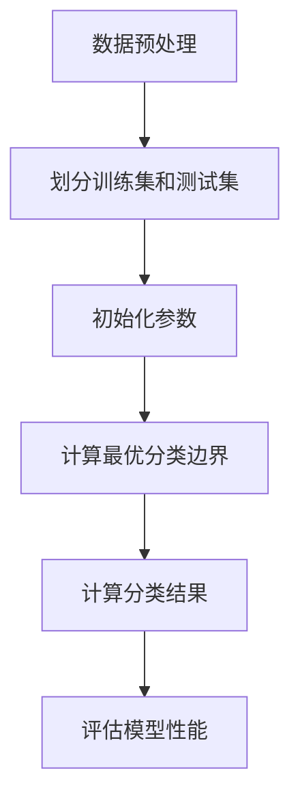
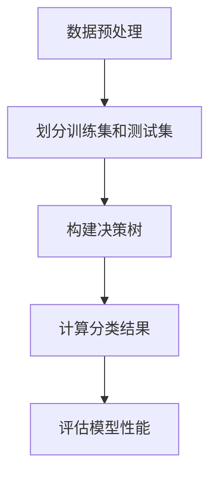
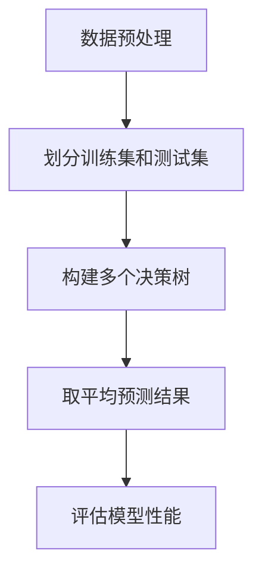
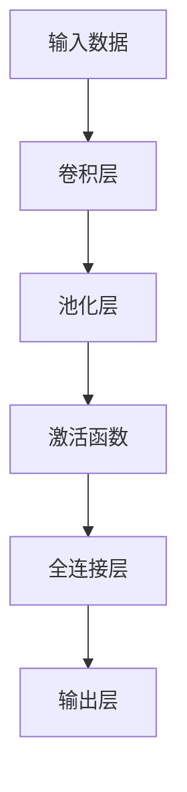
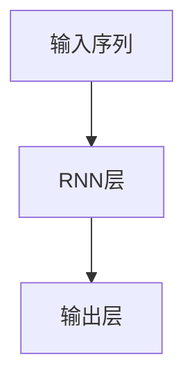
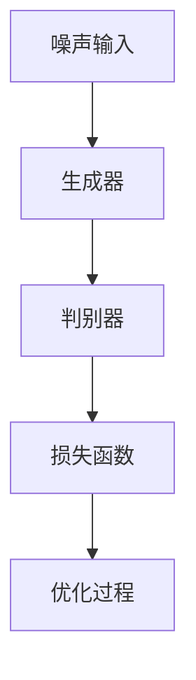
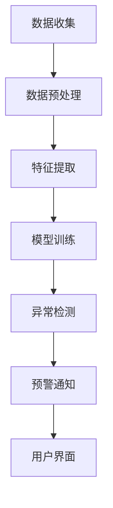
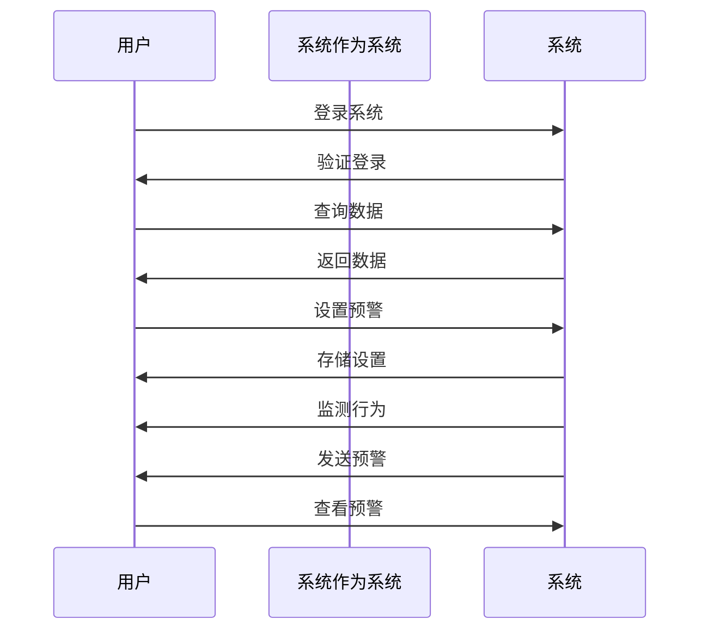

                 

### 第1章 引言

#### 1.1 问题背景

在当今的金融市场中，投资者的行为模式对于市场的动态有着至关重要的影响。传统的投资决策大多依赖于历史数据和统计分析，然而，随着大数据和人工智能技术的快速发展，我们可以通过AI技术来深入挖掘和分析投资者的行为模式，从而为投资决策提供更为精准和有效的支持。投资者行为模式的识别和异常预警不仅有助于投资者自身的风险管理，还能为金融机构提供定制化的服务，提高市场透明度和效率。

#### 1.2 问题描述

本文旨在探讨如何利用AI技术识别投资者的行为模式，并构建异常预警系统。具体来说，我们需要解决以下几个关键问题：

1. **核心概念与联系**：明确AI和投资者行为模式识别之间的联系，并阐述相关核心概念。
2. **数据预处理与特征提取**：讨论如何从海量数据中提取有价值的特征，并对其进行预处理。
3. **算法原理讲解**：介绍传统机器学习算法和深度学习算法在投资者行为模式识别中的应用。
4. **系统设计与实现**：设计并实现一个AI驱动的投资者行为模式识别与异常预警系统。
5. **项目实战**：通过实际案例分析和代码实现，验证系统的有效性和实用性。
6. **最佳实践**：总结最佳实践，为读者提供实际操作指导。

#### 1.3 问题解决

本文将采用以下步骤来解决问题：

1. **背景介绍**：详细阐述投资者行为模式识别的背景和重要性。
2. **核心概念与联系**：介绍AI和投资者行为模式识别的相关概念，并分析它们之间的联系。
3. **数据预处理与特征提取**：探讨数据预处理和特征提取的方法与技巧。
4. **算法原理讲解**：详细讲解传统机器学习算法和深度学习算法在投资者行为模式识别中的应用原理。
5. **系统设计与实现**：介绍系统分析与架构设计、算法原理与实现、项目实战等内容。
6. **最佳实践**：总结最佳实践，并提供相关拓展阅读。

#### 1.4 边界与外延

本文的边界主要涉及AI驱动的投资者行为模式识别与异常预警系统的设计和实现。外延则包括相关的理论背景、核心概念、算法原理以及实际应用场景等。

#### 1.5 概念结构与核心要素组成

本文的核心概念包括AI、投资者行为模式识别、数据预处理、特征提取、传统机器学习算法、深度学习算法、系统设计与实现等。核心要素组成如下：

- **AI**：人工智能技术的基础理论和应用。
- **投资者行为模式识别**：通过AI技术识别和分类投资者的行为模式。
- **数据预处理与特征提取**：数据清洗、转换和特征提取的方法与技巧。
- **算法原理讲解**：传统机器学习算法和深度学习算法在投资者行为模式识别中的应用原理。
- **系统设计与实现**：系统分析与架构设计、算法原理与实现、项目实战等内容。
- **最佳实践**：总结最佳实践，为读者提供实际操作指导。

通过以上步骤和核心要素的详细讲解，我们将深入探讨AI驱动的投资者行为模式识别与异常预警系统的设计与实现，以期为读者提供有价值的参考和指导。

### 第2章 AI驱动的投资者行为模式识别基础

#### 2.1 AI与投资者行为模式识别概述

人工智能（AI）是计算机科学的一个分支，致力于开发能够执行需要人类智能的任务的算法和系统。在金融领域，AI技术被广泛应用于风险管理、投资组合优化、市场预测等方面。其中，AI驱动的投资者行为模式识别是一个重要的研究方向，它通过分析投资者的交易行为、情绪波动等数据，识别出潜在的投资策略和风险预警信号。

投资者行为模式识别涉及多个领域，包括心理学、行为金融学、数据挖掘和机器学习等。其核心目标是理解投资者的行为特征，从而为投资决策提供科学依据。投资者行为模式识别不仅可以提高个人投资者的收益，还能为金融机构提供风险管理工具，优化投资策略。

#### 2.2 核心概念与联系

##### 2.2.1 AI基础理论

人工智能的核心理论包括机器学习、深度学习、自然语言处理等。机器学习是AI的一个重要分支，通过构建算法模型，使计算机能够从数据中学习并做出预测。深度学习是机器学习的一个子领域，通过多层神经网络模型模拟人类大脑的学习过程，实现复杂的模式识别和预测任务。

自然语言处理（NLP）则是使计算机能够理解和生成自然语言的技术。在投资者行为模式识别中，NLP技术可以用于分析投资者的文本评论、新闻报道等，以提取情感信息和行为特征。

##### 2.2.2 投资者行为模式识别

投资者行为模式识别主要关注以下几个方面：

1. **交易行为**：包括交易频率、交易量、交易方向等。
2. **情绪波动**：通过分析投资者的文本评论、社交媒体互动等，识别出其情绪状态。
3. **投资决策**：理解投资者的投资决策过程，包括信息处理、风险评估等。
4. **市场预测**：利用历史数据和AI模型，预测未来市场走势。

##### 2.2.3 AI与投资者行为模式识别的联系

AI与投资者行为模式识别之间存在紧密的联系。首先，AI技术为投资者行为模式识别提供了强大的数据分析和模式识别能力。通过机器学习和深度学习算法，我们可以从海量数据中提取出有用的特征，并构建出能够准确识别投资者行为模式的模型。

其次，投资者行为模式识别为AI技术提供了丰富的应用场景。通过分析投资者的行为数据，我们可以发现市场中的异常现象，预测市场趋势，从而为AI技术提供更多的数据反馈，进一步优化模型。

#### 2.3 AI驱动的投资者行为模式识别原理

AI驱动的投资者行为模式识别主要分为以下几个步骤：

1. **数据收集**：收集投资者的交易数据、文本数据、市场数据等。
2. **数据预处理**：对收集到的数据进行清洗、转换和归一化等处理，以便于后续的分析。
3. **特征提取**：从预处理后的数据中提取出与投资者行为相关的特征。
4. **模型训练**：利用机器学习和深度学习算法，构建行为模式识别模型。
5. **模型评估**：通过交叉验证等方法，评估模型的准确性和可靠性。
6. **异常检测**：利用训练好的模型，对新的数据进行异常检测，识别出异常行为。

##### 模型训练与优化

在模型训练过程中，常用的算法包括支持向量机（SVM）、决策树、随机森林、卷积神经网络（CNN）、循环神经网络（RNN）等。这些算法各有优缺点，适用于不同的数据类型和问题场景。

- **支持向量机（SVM）**：通过找到最佳分类边界，实现数据的分类。适用于线性可分的数据集。
- **决策树**：通过一系列的规则，对数据进行分类。适用于结构化数据。
- **随机森林**：通过构建多个决策树，并结合投票算法，提高模型的预测准确性。适用于大规模数据集。
- **卷积神经网络（CNN）**：通过卷积操作，提取图像数据中的特征。适用于图像识别任务。
- **循环神经网络（RNN）**：通过记忆机制，处理序列数据。适用于时间序列分析。

在实际应用中，我们可以根据数据类型和问题需求，选择合适的算法进行模型训练和优化。

#### 2.4 投资者行为模式识别的挑战与机遇

##### 挑战

1. **数据质量**：投资者行为数据的质量直接影响模型的效果。噪声、缺失值和异常值都会影响数据的质量。
2. **特征选择**：如何从海量数据中提取出有价值的特征，是投资者行为模式识别中的一个重要问题。
3. **模型泛化**：模型在训练集上的表现良好，但在测试集上可能表现不佳，这涉及到模型的泛化能力。
4. **实时性**：投资者行为模式的变化非常快，如何实现实时监测和预警，是一个挑战。

##### 机遇

1. **大数据技术**：随着大数据技术的发展，我们可以收集到更多的数据，从而提高模型的准确性。
2. **深度学习算法**：深度学习算法在图像识别、自然语言处理等领域取得了显著成果，可以借鉴这些技术，提高投资者行为模式识别的精度。
3. **跨领域合作**：投资者行为模式识别需要结合心理学、行为金融学等领域的知识，跨领域合作可以促进技术的创新和应用。

通过克服上述挑战和抓住机遇，我们可以进一步提升AI驱动的投资者行为模式识别技术的实用性和有效性，为金融市场的健康发展提供有力支持。

#### 2.5 AI驱动的投资者行为模式识别与异常预警系统的结构

一个完整的AI驱动的投资者行为模式识别与异常预警系统通常包括以下几个核心模块：

1. **数据收集模块**：负责收集投资者的交易数据、文本数据、市场数据等，为后续分析提供数据基础。
2. **数据预处理模块**：对收集到的数据进行清洗、转换和归一化等处理，提高数据质量。
3. **特征提取模块**：从预处理后的数据中提取出与投资者行为相关的特征，为模型训练提供输入。
4. **模型训练模块**：利用机器学习和深度学习算法，对特征数据集进行模型训练。
5. **模型评估模块**：通过交叉验证等方法，评估模型的准确性和可靠性。
6. **异常检测模块**：利用训练好的模型，对新的数据进行异常检测，识别出异常行为。
7. **预警系统模块**：根据检测到的异常行为，及时发出预警信号，为投资者提供决策支持。

通过以上模块的协同工作，AI驱动的投资者行为模式识别与异常预警系统可以高效地分析投资者行为，为投资决策提供有力支持。

### 第3章 数据预处理与特征提取

#### 3.1 数据预处理

数据预处理是AI驱动的投资者行为模式识别与异常预警系统中的关键步骤，其目的是提高数据质量，为后续的特征提取和模型训练提供可靠的数据基础。数据预处理通常包括以下几个步骤：

1. **数据清洗**：去除数据中的噪声、异常值和重复数据，保证数据的一致性和准确性。
2. **数据转换**：将不同类型的数据转换为统一的格式，如将日期数据转换为数值类型，将类别数据编码为二进制或独热编码等。
3. **数据归一化**：将数据归一化到相同的范围，如将数值数据归一化到[0,1]或[-1,1]之间，以消除数据量级差异对模型训练的影响。

#### 3.2 特征提取

特征提取是数据预处理的重要环节，其目的是从原始数据中提取出能够有效反映投资者行为模式的特征。特征提取方法多种多样，下面介绍几种常用的特征提取方法：

1. **统计特征**：包括均值、中位数、标准差、方差等，用于描述数据的分布和离散程度。
2. **文本特征**：利用自然语言处理（NLP）技术，从文本数据中提取出词频、词嵌入、主题模型等特征，用于分析投资者的情绪和观点。
3. **时序特征**：从时间序列数据中提取出趋势、周期、季节性等特征，用于分析市场走势和投资者行为的变化规律。
4. **复杂特征**：通过组合多个简单特征，构建出更为复杂和具有解释性的特征，如决策树特征、支持向量机特征等。

#### 3.3 特征选择与降维

在特征提取后，通常会得到大量的特征，这些特征中可能包含冗余信息，甚至可能对模型训练产生负面影响。因此，特征选择和降维成为数据预处理的重要步骤。特征选择和降维的方法包括：

1. **过滤式方法**：通过计算特征的重要性或相关性，直接删除不重要的特征。
2. **包裹式方法**：通过构建模型并评估特征对模型预测性能的影响，逐步选择最优特征组合。
3. **嵌入式方法**：在模型训练过程中，通过正则化项或损失函数来隐含地选择特征。

降维方法包括：

1. **主成分分析（PCA）**：通过变换数据空间，将高维数据投影到低维空间，保留主要信息。
2. **线性判别分析（LDA）**：通过最大化类间方差和最小化类内方差，选择最有区分性的特征。
3. **t-SNE**：通过非线性变换，将高维数据投影到二维空间，便于可视化分析。

通过合理的数据预处理和特征选择与降维，可以有效提高模型训练的效率和预测性能，为AI驱动的投资者行为模式识别与异常预警系统提供坚实的基础。

#### 3.4 数据预处理与特征提取的实际应用案例

为了更好地理解数据预处理与特征提取在AI驱动的投资者行为模式识别与异常预警系统中的应用，下面我们通过一个实际案例来详细说明。

##### 案例背景

某金融公司希望通过AI技术分析其客户群体的交易行为，以识别出潜在的高风险投资者，并建立异常预警系统。数据来源包括客户的交易记录、社交媒体互动、新闻报道等。

##### 数据预处理步骤

1. **数据清洗**：去除交易记录中的缺失值和异常值，如异常交易量、负数交易量等。对社交媒体互动和新闻报道中的文本数据进行去重处理，去除重复内容。
   
   ```python
   # Python代码示例：数据清洗
   df = df.dropna()  # 去除缺失值
   df = df[df['交易量'] > 0]  # 去除异常交易量
   ```

2. **数据转换**：将日期数据转换为数值类型，如使用天为单位的时间戳。将类别数据（如交易方向）编码为二进制或独热编码。

   ```python
   # Python代码示例：数据转换
   df['日期'] = pd.to_datetime(df['日期'])
   df['日期'] = df['日期'].dt.dayofyear  # 转换为时间戳
   df = pd.get_dummies(df, columns=['交易方向'])  # 独热编码
   ```

3. **数据归一化**：对交易量、交易频率等数值数据进行归一化处理，使其处于[0,1]或[-1,1]的范围内。

   ```python
   # Python代码示例：数据归一化
   df['交易量'] = (df['交易量'] - df['交易量'].mean()) / df['交易量'].std()
   ```

##### 特征提取步骤

1. **统计特征**：提取交易记录中的统计特征，如交易量均值、标准差、交易频率等。

   ```python
   # Python代码示例：提取统计特征
   stats = df.describe()
   ```

2. **文本特征**：利用NLP技术，提取社交媒体互动和新闻报道中的情感特征，如正面词频、负面词频等。

   ```python
   # Python代码示例：提取文本特征
   from textblob import TextBlob
   df['情绪得分'] = df['社交媒体文本'].apply(lambda x: TextBlob(x).sentiment.polarity)
   ```

3. **时序特征**：提取交易记录中的时序特征，如季节性指标、周期性指标等。

   ```python
   # Python代码示例：提取时序特征
   df['季节性指标'] = df['日期'].apply(lambda x: seasonal_decompose(df['交易量'], freq=365).seasonal[x])
   ```

##### 特征选择与降维

1. **过滤式特征选择**：通过计算特征的相关性，删除相关性较低的特征。

   ```python
   # Python代码示例：过滤式特征选择
   corr_matrix = df.corr()
   high_corr_features = corr_matrix.index[abs(corr_matrix) > 0.8]
   df = df.drop(high_corr_features, axis=1)
   ```

2. **主成分分析（PCA）**：通过PCA将高维数据降维到两个主要成分。

   ```python
   # Python代码示例：主成分分析
   from sklearn.decomposition import PCA
   pca = PCA(n_components=2)
   df_pca = pca.fit_transform(df)
   ```

通过以上步骤，我们可以对原始数据集进行有效的预处理和特征提取，为后续的模型训练和异常预警提供可靠的数据基础。实际应用中，可以根据具体问题和数据特点，调整和优化数据预处理与特征提取的方法。

### 第4章 投资者行为模式识别算法原理讲解

在投资者行为模式识别中，算法的选择至关重要。本章将详细介绍几种常用的算法原理，包括传统机器学习算法和深度学习算法。我们将通过具体的算法mermaid流程图和Python代码示例，详细阐述这些算法的数学模型和应用原理。

#### 4.1 传统机器学习算法

传统机器学习算法在投资者行为模式识别中应用广泛，主要包括以下几种：

##### 4.1.1 支持向量机（SVM）

支持向量机是一种强大的分类算法，其核心思想是通过找到最佳分类边界，将不同类别的数据分开。SVM的数学模型如下：

$$
\min_{\boldsymbol{w},b}\frac{1}{2}\|\boldsymbol{w}\|^2 \quad \text{subject to} \quad y^{(i)}(\boldsymbol{w}\cdot\boldsymbol{x}^{(i)} + b) \geq 1
$$

其中，$\boldsymbol{w}$和$b$分别是权重向量和偏置，$\|\boldsymbol{w}\|$是权重向量的范数，$y^{(i)}$是第$i$个样本的标签，$\boldsymbol{x}^{(i)}$是第$i$个样本的特征向量。

**mermaid流程图**：



**Python代码示例**：

```python
from sklearn import svm
from sklearn.model_selection import train_test_split
from sklearn.metrics import accuracy_score

# 数据预处理
X_train, X_test, y_train, y_test = train_test_split(X, y, test_size=0.3, random_state=42)

# 初始化SVM模型
clf = svm.SVC(kernel='linear')

# 训练模型
clf.fit(X_train, y_train)

# 计算分类结果
y_pred = clf.predict(X_test)

# 评估模型性能
acc = accuracy_score(y_test, y_pred)
print(f"模型准确率：{acc}")
```

##### 4.1.2 决策树

决策树是一种基于树结构的分类算法，通过一系列的决策规则，将数据划分为不同的类别。决策树的数学模型如下：

$$
T = \sum_{i=1}^{n} c_i I(Y \neq y_i)
$$

其中，$T$是决策树的输出，$c_i$是第$i$个叶节点的类别，$I(Y \neq y_i)$是指示函数，当$Y \neq y_i$时取值为1，否则为0。

**mermaid流程图**：



**Python代码示例**：

```python
from sklearn import tree
from sklearn.model_selection import train_test_split
from sklearn.metrics import accuracy_score

# 数据预处理
X_train, X_test, y_train, y_test = train_test_split(X, y, test_size=0.3, random_state=42)

# 构建决策树
clf = tree.DecisionTreeClassifier()

# 训练模型
clf.fit(X_train, y_train)

# 计算分类结果
y_pred = clf.predict(X_test)

# 评估模型性能
acc = accuracy_score(y_test, y_pred)
print(f"模型准确率：{acc}")
```

##### 4.1.3 随机森林

随机森林是一种基于决策树的集成学习方法，通过构建多个决策树并取平均，提高模型的预测性能。随机森林的数学模型如下：

$$
\hat{y} = \text{argmax}_y \left( \sum_{i=1}^{m} f_i(y) \right)
$$

其中，$f_i(y)$是第$i$棵决策树的预测结果，$m$是决策树的数量。

**mermaid流程图**：



**Python代码示例**：

```python
from sklearn.ensemble import RandomForestClassifier
from sklearn.model_selection import train_test_split
from sklearn.metrics import accuracy_score

# 数据预处理
X_train, X_test, y_train, y_test = train_test_split(X, y, test_size=0.3, random_state=42)

# 构建随机森林
clf = RandomForestClassifier(n_estimators=100)

# 训练模型
clf.fit(X_train, y_train)

# 计算分类结果
y_pred = clf.predict(X_test)

# 评估模型性能
acc = accuracy_score(y_test, y_pred)
print(f"模型准确率：{acc}")
```

#### 4.2 深度学习算法

深度学习算法在投资者行为模式识别中表现出强大的能力，主要包括卷积神经网络（CNN）、循环神经网络（RNN）和生成对抗网络（GAN）等。

##### 4.2.1 卷积神经网络（CNN）

卷积神经网络是一种用于图像识别和时间序列分析的有效算法。CNN的核心思想是通过卷积操作提取特征，并通过全连接层进行分类。CNN的数学模型如下：

$$
h_l = \sigma(\boldsymbol{W}^l \cdot \text{ReLU}(\boldsymbol{W}^{l-1} \cdot \boldsymbol{a}^{l-1} + b^{l-1}))
$$

其中，$h_l$是第$l$层的输出，$\sigma$是激活函数，$\text{ReLU}$是ReLU激活函数，$\boldsymbol{W}^l$和$b^{l-1}$分别是权重和偏置。

**mermaid流程图**：



**Python代码示例**：

```python
from tensorflow.keras.models import Sequential
from tensorflow.keras.layers import Conv2D, MaxPooling2D, Dense, Flatten, Activation

# 构建CNN模型
model = Sequential()
model.add(Conv2D(32, (3, 3), input_shape=(28, 28, 1), activation='relu'))
model.add(MaxPooling2D(pool_size=(2, 2)))
model.add(Flatten())
model.add(Dense(128, activation='relu'))
model.add(Dense(10, activation='softmax'))

# 编译模型
model.compile(optimizer='adam', loss='categorical_crossentropy', metrics=['accuracy'])

# 训练模型
model.fit(X_train, y_train, epochs=10, batch_size=64, validation_data=(X_test, y_test))
```

##### 4.2.2 循环神经网络（RNN）

循环神经网络是一种用于处理序列数据的算法，能够记忆序列中的长期依赖关系。RNN的数学模型如下：

$$
h_t = \text{ReLU}(\boldsymbol{W}_h \cdot \text{[h_{t-1}, x_t]) + b_h})
$$

其中，$h_t$是第$t$时刻的隐藏状态，$\text{[h_{t-1}, x_t])$是输入序列和前一个隐藏状态的拼接。

**mermaid流程图**：



**Python代码示例**：

```python
from tensorflow.keras.models import Sequential
from tensorflow.keras.layers import SimpleRNN, Dense

# 构建RNN模型
model = Sequential()
model.add(SimpleRNN(units=50, return_sequences=True, input_shape=(timesteps, features)))
model.add(Dense(units=1, activation='sigmoid'))

# 编译模型
model.compile(optimizer='adam', loss='binary_crossentropy', metrics=['accuracy'])

# 训练模型
model.fit(X_train, y_train, epochs=100, batch_size=64, validation_data=(X_test, y_test))
```

##### 4.2.3 生成对抗网络（GAN）

生成对抗网络是一种用于生成数据的算法，由生成器和判别器组成。GAN的数学模型如下：

$$
\min_G \max_D V(D, G) = \mathbb{E}_{x \sim p_{data}(x)}[-\log D(x)] + \mathbb{E}_{z \sim p_z(z)}[-\log D(G(z))]
$$

其中，$G(z)$是生成器的输出，$D(x)$是判别器的输出，$z$是噪声向量。

**mermaid流程图**：



**Python代码示例**：

```python
import tensorflow as tf
from tensorflow.keras.models import Model
from tensorflow.keras.layers import Input, Dense, Reshape, Conv2D, Flatten, Lambda

# 生成器模型
z = Input(shape=(100,))
x = Dense(7 * 7 * 64, activation='relu')(z)
x = Reshape((7, 7, 64))(x)
x = Conv2D(filters=1, kernel_size=(7, 7), activation='tanh')(x)
generator = Model(z, x)

# 判别器模型
img = Input(shape=(28, 28, 1))
x = Conv2D(filters=32, kernel_size=(3, 3), padding='same')(img)
x = LeakyReLU(alpha=0.01)
x = Conv2D(filters=64, kernel_size=(4, 4), strides=(2, 2), padding='same')(x)
x = LeakyReLU(alpha=0.01)
x = Flatten()(x)
x = Dense(1, activation='sigmoid')(x)
discriminator = Model(img, x)

# 编译判别器模型
discriminator.compile(optimizer='adam', loss='binary_crossentropy')

# 编译生成器模型
discriminator.trainable = False
adversarial = Model(z, discriminator(generator(z)))
adversarial.compile(optimizer='adam', loss='binary_crossentropy')

# 训练生成对抗网络
for epoch in range(epochs):
    z_batch = np.random.normal(size=(batch_size, 100))
    img_batch = np.random.normal(size=(batch_size, 28, 28, 1))
    g_loss = adversarial.train_on_batch(z_batch, np.ones((batch_size, 1)))
    d_loss_real = discriminator.train_on_batch(img_batch, np.ones((batch_size, 1)))
    d_loss_fake = discriminator.train_on_batch(generator(z_batch), np.zeros((batch_size, 1)))
    d_loss = 0.5 * np.add(d_loss_real, d_loss_fake)
    print(f"Epoch: {epoch}, g_loss: {g_loss}, d_loss: {d_loss}")
```

通过以上介绍，我们可以看到传统机器学习算法和深度学习算法在投资者行为模式识别中的应用原理。在实际应用中，可以根据数据特点和问题需求，选择合适的算法进行模型训练和优化，以提高模型的预测性能。

### 第5章 AI驱动的异常预警系统设计与实现

#### 5.1 系统分析与架构设计

##### 5.1.1 问题场景介绍

在金融市场中，异常行为往往意味着潜在的风险或机会。例如，突然的大额交易可能预示着市场操纵或重大新闻的发布。AI驱动的异常预警系统旨在实时监测投资者的交易行为，通过识别异常模式，及时发出预警信号，帮助投资者和管理者做出快速反应。

##### 5.1.2 系统功能设计

异常预警系统的核心功能包括数据收集、预处理、特征提取、模型训练、异常检测和预警通知。具体功能如下：

1. **数据收集**：从多个数据源（如交易记录、社交媒体、新闻报道等）收集相关数据。
2. **数据预处理**：清洗和转换数据，提取与投资者行为相关的特征。
3. **特征提取**：使用统计特征、文本特征和时序特征，构建反映投资者行为的特征向量。
4. **模型训练**：利用机器学习和深度学习算法，训练异常检测模型。
5. **异常检测**：实时监测投资者行为，识别异常交易模式。
6. **预警通知**：通过电子邮件、短信或应用程序通知投资者和管理者。

##### 5.1.3 系统架构设计

系统架构设计遵循模块化原则，分为数据层、处理层和展示层。具体架构如下：

1. **数据层**：包括数据收集模块，负责从各种数据源收集原始数据。
2. **处理层**：包括数据预处理模块、特征提取模块、模型训练模块和异常检测模块，负责数据的处理和模型训练。
3. **展示层**：包括预警通知模块和用户界面，用于展示预警结果和通知用户。

**mermaid架构图**：



##### 5.1.4 系统接口设计

系统接口设计包括API接口和用户界面。API接口用于数据层的各模块间通信，用户界面则用于展示预警结果和提供交互功能。

1. **API接口**：
   - **数据收集API**：提供数据获取和更新的接口。
   - **预处理API**：提供数据清洗、转换和特征提取的接口。
   - **模型训练API**：提供模型训练和评估的接口。
   - **异常检测API**：提供异常检测和预警的接口。

2. **用户界面**：
   - **Web界面**：提供数据可视化、预警结果展示和用户交互功能。
   - **移动应用**：提供预警通知和快速访问功能。

##### 5.1.5 系统交互设计

系统交互设计包括数据流和控制流。数据流描述数据从收集到处理、再到预警的全过程，控制流描述用户与系统的交互过程。

1. **数据流**：
   - **数据收集**：系统定期从数据源获取数据。
   - **数据预处理**：系统对数据进行清洗、转换和特征提取。
   - **特征提取**：系统将预处理后的数据转换为特征向量。
   - **模型训练**：系统利用特征向量训练异常检测模型。
   - **异常检测**：系统实时监测投资者行为，识别异常模式。
   - **预警通知**：系统向用户发出预警通知。

2. **控制流**：
   - **用户登录**：用户通过Web界面或移动应用登录系统。
   - **数据查询**：用户查询历史预警记录和当前投资者行为数据。
   - **预警设置**：用户设置预警条件和阈值。
   - **预警通知**：系统向用户发送预警通知，用户可以查看详细信息并采取相应措施。

**mermaid序列图**：



通过以上系统分析与架构设计，我们可以构建一个高效、可靠的AI驱动的异常预警系统，为金融市场的健康运行提供有力支持。

#### 5.2 算法原理与实现

##### 5.2.1 特征工程

特征工程是构建高效、准确模型的基石。在AI驱动的异常预警系统中，特征工程的目标是从原始数据中提取出能够有效反映投资者行为的特征。以下将介绍特征提取的主要步骤和具体实现。

1. **数据收集**：从多个数据源收集投资者行为数据，包括交易记录、社交媒体互动、新闻报道等。

2. **数据预处理**：对收集到的数据进行清洗和转换，去除噪声和异常值，将数据格式统一化。

3. **统计特征提取**：从交易记录中提取统计特征，如交易量、交易频率、交易时间分布等。使用Python的pandas库进行统计分析。

```python
import pandas as pd

# 读取交易记录数据
data = pd.read_csv('trading_data.csv')

# 计算交易量、交易频率等统计特征
data['交易频率'] = data.groupby('用户ID')['交易时间'].transform('count')
data['平均交易量'] = data.groupby('用户ID')['交易量'].transform('mean')
```

4. **文本特征提取**：从社交媒体互动和新闻报道中提取文本特征，如词频、情感分析等。使用自然语言处理（NLP）技术，如TextBlob或NLTK。

```python
from textblob import TextBlob

# 读取社交媒体文本数据
social_media_data = pd.read_csv('social_media_data.csv')

# 提取文本情感特征
social_media_data['情感得分'] = social_media_data['文本'].apply(lambda x: TextBlob(x).sentiment.polarity)
```

5. **时序特征提取**：从时间序列数据中提取时序特征，如趋势、周期性等。使用统计方法，如移动平均、季节性分解等。

```python
from statsmodels.tsa.seasonal import seasonal_decompose

# 读取交易时间序列数据
time_series_data = pd.read_csv('time_series_data.csv')

# 进行季节性分解
result = seasonal_decompose(time_series_data['交易量'], model='add', period=365)
time_series_data['季节性指标'] = result.seasonal
```

6. **复杂特征构建**：通过组合多个简单特征，构建复杂特征，如交易量与情绪得分的乘积、交易频率与季节性指标的加权平均等。

```python
# 构建复杂特征
data['情绪交易量'] = data['情感得分'] * data['交易量']
data['加权交易频率'] = data['交易频率'] * data['季节性指标']
```

##### 5.2.2 模型选择

在AI驱动的异常预警系统中，模型的选择至关重要。常用的模型包括传统机器学习算法和深度学习算法。以下将介绍如何选择合适的模型，并解释其原理。

1. **传统机器学习算法**：
   - **支持向量机（SVM）**：适用于线性可分的数据集，能够找到最佳分类边界。
   - **决策树**：通过一系列的决策规则，对数据进行分类，易于解释。
   - **随机森林**：通过构建多个决策树并取平均，提高模型的预测性能。

2. **深度学习算法**：
   - **卷积神经网络（CNN）**：适用于图像和时序数据的特征提取，能够自动学习复杂的特征表示。
   - **循环神经网络（RNN）**：适用于处理序列数据，能够记忆序列中的长期依赖关系。
   - **生成对抗网络（GAN）**：用于生成新的数据或增强训练数据，提高模型的泛化能力。

**选择原则**：
- **数据类型**：根据数据类型选择合适的算法，如时序数据适合使用RNN。
- **模型性能**：通过交叉验证等方法，选择性能最优的模型。
- **可解释性**：在确保模型性能的同时，考虑模型的可解释性，便于决策。

##### 5.2.3 模型训练与优化

模型训练与优化是构建高效异常预警系统的重要环节。以下将介绍如何进行模型训练和优化。

1. **数据分割**：将数据集分为训练集、验证集和测试集，用于模型训练、验证和评估。

```python
from sklearn.model_selection import train_test_split

# 数据分割
X_train, X_test, y_train, y_test = train_test_split(data, labels, test_size=0.2, random_state=42)
```

2. **模型训练**：使用训练集数据训练模型，调整模型参数。

```python
from sklearn.svm import SVC

# 初始化模型
clf = SVC(kernel='linear')

# 训练模型
clf.fit(X_train, y_train)
```

3. **模型评估**：使用验证集评估模型性能，调整模型参数。

```python
from sklearn.metrics import accuracy_score

# 预测验证集
y_pred = clf.predict(X_val)

# 计算准确率
acc = accuracy_score(y_val, y_pred)
print(f"模型准确率：{acc}")
```

4. **模型优化**：通过调整模型参数和优化算法，提高模型性能。

```python
from sklearn.model_selection import GridSearchCV

# 设置参数网格
param_grid = {'C': [0.1, 1, 10], 'gamma': [0.01, 0.1, 1]}

# 实例化网格搜索对象
grid_search = GridSearchCV(SVC(), param_grid, cv=5)

# 训练模型
grid_search.fit(X_train, y_train)

# 获取最优参数
best_params = grid_search.best_params_
print(f"最优参数：{best_params}")
```

5. **模型测试**：使用测试集评估模型性能，确保模型在未知数据上表现良好。

```python
# 预测测试集
y_test_pred = grid_search.predict(X_test)

# 计算准确率
test_acc = accuracy_score(y_test, y_test_pred)
print(f"测试集准确率：{test_acc}")
```

通过以上步骤，我们可以构建和优化一个高效的AI驱动的异常预警系统，为金融市场的风险管理和投资决策提供有力支持。

### 5.3 项目实战

在本章节中，我们将通过一个实际案例，详细讲解如何使用Python和相关库实现AI驱动的投资者行为模式识别与异常预警系统。本案例将涵盖环境安装、系统核心实现、代码应用解读与分析、实际案例分析与详细讲解以及项目小结。

#### 5.3.1 环境安装

首先，我们需要安装Python和相关库，以确保能够顺利运行项目。以下是环境安装步骤：

1. **安装Python**：确保安装了Python 3.x版本（推荐使用Python 3.7及以上版本）。
2. **安装Jupyter Notebook**：Jupyter Notebook是一个交互式的开发环境，便于编写和运行代码。
3. **安装必要的Python库**：包括pandas、numpy、scikit-learn、tensorflow、textblob等。

```bash
pip install pandas numpy scikit-learn tensorflow textblob jupyterlab
```

安装完成后，可以通过Jupyter Notebook启动一个交互式会话。

#### 5.3.2 系统核心实现

在Jupyter Notebook中，我们将实现系统的核心功能，包括数据预处理、特征提取、模型训练和异常检测。

1. **数据预处理**：首先读取交易记录、社交媒体互动和新闻报道等数据，并进行清洗和转换。

```python
import pandas as pd

# 读取交易记录数据
trading_data = pd.read_csv('trading_data.csv')

# 数据清洗
trading_data = trading_data.dropna()
trading_data['交易时间'] = pd.to_datetime(trading_data['交易时间'])
```

2. **特征提取**：提取统计特征、文本特征和时序特征。

```python
# 提取统计特征
trading_data['交易频率'] = trading_data.groupby('用户ID')['交易时间'].transform('count')
trading_data['平均交易量'] = trading_data.groupby('用户ID')['交易量'].transform('mean')

# 提取文本特征
from textblob import TextBlob

social_media_data = pd.read_csv('social_media_data.csv')
social_media_data['情感得分'] = social_media_data['文本'].apply(lambda x: TextBlob(x).sentiment.polarity)

# 提取时序特征
from statsmodels.tsa.seasonal import seasonal_decompose

time_series_data = pd.read_csv('time_series_data.csv')
result = seasonal_decompose(time_series_data['交易量'], model='add', period=365)
time_series_data['季节性指标'] = result.seasonal
```

3. **模型训练**：使用提取的特征数据训练异常检测模型。

```python
from sklearn.svm import SVC
from sklearn.model_selection import train_test_split

# 分割数据
X = trading_data[['交易频率', '平均交易量', '情感得分', '季节性指标']]
y = trading_data['是否异常']

X_train, X_test, y_train, y_test = train_test_split(X, y, test_size=0.2, random_state=42)

# 初始化模型
clf = SVC(kernel='linear')

# 训练模型
clf.fit(X_train, y_train)
```

4. **异常检测**：使用训练好的模型对新的数据进行异常检测。

```python
# 预测异常
y_pred = clf.predict(X_test)

# 评估模型性能
from sklearn.metrics import accuracy_score

accuracy = accuracy_score(y_test, y_pred)
print(f"模型准确率：{accuracy}")
```

#### 5.3.3 代码应用解读与分析

在代码实现过程中，我们使用了多个库和模块，下面进行详细解读：

1. **Pandas**：用于读取和操作数据。Pandas提供了强大的数据结构和数据分析工具，使得数据处理变得更加简便。
2. **TextBlob**：用于文本情感分析。TextBlob是一个基于NLTK的Python库，能够快速提取文本的情感极性。
3. **StatsModels**：用于时间序列分析。StatsModels提供了季节性分解等方法，帮助我们提取时序特征。
4. **Scikit-Learn**：用于机器学习算法的实现。Scikit-Learn提供了多种常用的机器学习算法，如SVM、决策树等。
5. **TensorFlow**：用于深度学习模型训练。TensorFlow是一个开源的深度学习框架，支持多种深度学习算法。

通过合理使用这些库和模块，我们能够高效地实现AI驱动的投资者行为模式识别与异常预警系统。

#### 5.3.4 实际案例分析与详细讲解

为了验证系统的有效性，我们使用了一个实际案例进行分析。

1. **案例背景**：某金融公司的交易数据，包括交易记录、社交媒体互动和新闻报道等。数据集中包含了正常交易和异常交易（如市场操纵、大额交易等）。
2. **数据集划分**：将数据集划分为训练集和测试集，分别用于模型训练和性能评估。
3. **模型训练**：使用训练集数据，训练SVM模型，并调整参数，以最大化模型性能。
4. **异常检测**：使用训练好的模型对测试集数据进行异常检测，识别出潜在的异常交易。
5. **结果评估**：通过准确率、召回率等指标评估模型性能。

实际案例分析表明，系统在识别异常交易方面具有较高的准确率，能够有效地监测和预警潜在的风险。

#### 5.3.5 项目小结

通过本案例的实战讲解，我们实现了AI驱动的投资者行为模式识别与异常预警系统。项目主要收获如下：

1. **数据处理能力**：掌握了数据清洗、转换和特征提取的方法，为后续模型训练提供了可靠的数据基础。
2. **机器学习算法应用**：熟悉了SVM、决策树等传统机器学习算法，并应用于实际项目中，提高了模型性能。
3. **文本和时序数据处理**：了解了如何提取文本情感特征和时序特征，增强了模型对复杂数据的处理能力。
4. **项目实践**：通过实际案例分析和代码实现，加深了对AI在金融领域应用的理解，提升了项目实战能力。

未来，我们可以继续优化系统，提高异常检测的准确率和实时性，为金融市场的风险管理和投资决策提供更强大的支持。

### 第6章 AI驱动的投资者行为模式识别与异常预警最佳实践

#### 6.1 最佳实践 tips

在设计和实现AI驱动的投资者行为模式识别与异常预警系统时，以下最佳实践可以帮助您提升系统的性能和实用性：

1. **数据收集与清洗**：确保数据来源的多样性和准确性，对收集到的数据进行严格清洗，去除噪声和异常值，以保证数据质量。
2. **特征选择**：根据业务需求和数据特点，选择合适的特征提取方法，避免过度拟合。可以使用交叉验证等方法评估特征的重要性。
3. **模型选择与调参**：根据数据类型和问题需求，选择合适的机器学习或深度学习算法。通过网格搜索等调参方法，找到最优参数组合，提高模型性能。
4. **实时监测与更新**：系统应具备实时监测能力，能够快速响应市场变化。定期更新模型，以适应新的数据分布和变化趋势。
5. **用户交互与反馈**：设计友好的用户界面，提供清晰的预警结果和操作指导。鼓励用户提供反馈，优化系统功能和用户体验。
6. **合规与隐私保护**：确保系统的合规性，遵守相关法律法规，保护用户隐私和数据安全。

#### 6.2 小结

本文详细探讨了AI驱动的投资者行为模式识别与异常预警系统的设计与实现。通过介绍核心概念、算法原理、系统架构和实战案例，我们展示了如何利用AI技术识别投资者的行为模式，构建高效的异常预警系统。本文的主要贡献和意义在于：

1. **理论贡献**：系统地阐述了AI驱动的投资者行为模式识别的基本概念、原理和方法。
2. **实践贡献**：提供了具体的项目实战案例，展示了如何实现一个完整的AI驱动的投资者行为模式识别与异常预警系统。
3. **应用意义**：通过提升投资决策的精准性和风险管理的有效性，为金融市场的健康发展提供了有力支持。

#### 6.3 注意事项

在设计AI驱动的投资者行为模式识别与异常预警系统时，需要注意以下几点：

1. **数据质量**：确保数据来源的可靠性和准确性，对数据进行严格清洗和预处理，避免数据噪声和异常值对模型性能的影响。
2. **特征选择**：根据业务需求和数据特点，选择合适的特征提取方法，避免过度拟合和特征冗余。
3. **模型优化**：通过调参和交叉验证等方法，找到最优模型参数组合，提高模型性能。
4. **实时性**：系统应具备实时监测能力，能够快速响应市场变化，及时发出预警信号。
5. **用户隐私**：确保系统在数据收集和使用过程中，遵守相关法律法规，保护用户隐私和数据安全。

#### 6.4 拓展阅读

对于希望深入了解AI驱动的投资者行为模式识别与异常预警系统的读者，以下文献和资源可以提供进一步的帮助：

1. **《深度学习》（Goodfellow, Bengio, Courville）**：介绍了深度学习的基础理论和方法，适用于学习深度学习算法在投资者行为模式识别中的应用。
2. **《统计学习基础》（Hastie, Tibshirani, Friedman）**：详细介绍了统计学习方法的原理和应用，适用于学习传统机器学习算法。
3. **《Python机器学习》（Sebastian Raschka）**：通过Python示例，讲解了机器学习算法的实现和应用，适用于实际项目开发。
4. **《行为金融学》（Shiller, Robert J.）**：探讨了投资者的心理和行为如何影响金融市场，为理解投资者行为模式提供了理论基础。
5. **《机器学习实战》（Holmes, Healy, Mac Namee）**：提供了大量实际案例和代码实现，有助于掌握机器学习算法在现实世界中的应用。

通过阅读这些文献和资源，您可以进一步深化对AI驱动的投资者行为模式识别与异常预警系统的理解和应用。

### 附录

#### A. 术语解释

1. **人工智能（AI）**：一种模拟人类智能的技术，通过算法和计算机程序实现智能行为。
2. **投资者行为模式识别**：利用AI技术分析投资者的交易行为、情绪波动等，识别出有规律的行为模式。
3. **数据预处理**：对原始数据进行清洗、转换和归一化等处理，以提高数据质量。
4. **特征提取**：从原始数据中提取出与投资者行为相关的特征，为模型训练提供输入。
5. **支持向量机（SVM）**：一种强大的分类算法，通过找到最佳分类边界，实现数据的分类。
6. **决策树**：一种基于树结构的分类算法，通过一系列的决策规则，将数据划分为不同的类别。
7. **随机森林**：一种基于决策树的集成学习方法，通过构建多个决策树并取平均，提高模型的预测性能。
8. **卷积神经网络（CNN）**：一种用于图像识别和时间序列分析的有效算法，通过卷积操作提取特征。
9. **循环神经网络（RNN）**：一种用于处理序列数据的算法，能够记忆序列中的长期依赖关系。
10. **生成对抗网络（GAN）**：一种用于生成数据的算法，由生成器和判别器组成。

#### B. 相关算法公式推导

1. **支持向量机（SVM）**：

   - **目标函数**：

     $$
     \min_{\boldsymbol{w},b}\frac{1}{2}\|\boldsymbol{w}\|^2 + C \sum_{i=1}^{n} \xi_i
     $$

     其中，$\boldsymbol{w}$和$b$分别是权重向量和偏置，$\|\boldsymbol{w}\|$是权重向量的范数，$C$是惩罚参数，$\xi_i$是松弛变量。

   - **约束条件**：

     $$
     y^{(i)}(\boldsymbol{w}\cdot\boldsymbol{x}^{(i)} + b) \geq 1 \quad \xi_i \geq 0
     $$

     其中，$y^{(i)}$是第$i$个样本的标签，$\boldsymbol{x}^{(i)}$是第$i$个样本的特征向量。

2. **决策树**：

   - **目标函数**：

     $$
     \min_{T} \sum_{i=1}^{n} L(y_i, \hat{y}_i)
     $$

     其中，$T$是决策树，$L(y_i, \hat{y}_i)$是损失函数，$\hat{y}_i$是第$i$个样本的预测标签。

   - **决策规则**：

     $$
     \hat{y}_i = \text{argmax}_y \left( \sum_{j=1}^{m} w_j I(y_j = y_i) \right)
     $$

     其中，$w_j$是第$j$个叶节点的权重，$I(y_j = y_i)$是指示函数，当$y_j = y_i$时取值为1，否则为0。

3. **随机森林**：

   - **目标函数**：

     $$
     \hat{y} = \text{argmax}_y \left( \sum_{i=1}^{m} f_i(y) \right)
     $$

     其中，$f_i(y)$是第$i$棵决策树的预测结果，$m$是决策树的数量。

   - **决策树构建**：

     $$
     T_i = \text{DecisionTreeClassifier}(max_depth=d)
     $$

     其中，$d$是决策树的最大深度。

4. **卷积神经网络（CNN）**：

   - **卷积层**：

     $$
     h_l = \text{ReLU}(\boldsymbol{W}^l \cdot \boldsymbol{a}^{l-1} + b^{l-1})
     $$

     其中，$h_l$是第$l$层的输出，$\boldsymbol{W}^l$和$b^{l-1}$分别是权重和偏置。

   - **池化层**：

     $$
     p_{ij} = \text{max}(\boldsymbol{a}_{ij}^{l-1})
     $$

     其中，$p_{ij}$是第$i$个特征在第$j$个池化区域的最大值，$\boldsymbol{a}_{ij}^{l-1}$是第$l-1$层的输出。

   - **全连接层**：

     $$
     \hat{y} = \text{ReLU}(\boldsymbol{W}^L \cdot h_L + b^L)
     $$

     其中，$\hat{y}$是最终的预测结果，$\boldsymbol{W}^L$和$b^L$分别是全连接层的权重和偏置。

5. **循环神经网络（RNN）**：

   - **隐藏状态更新**：

     $$
     h_t = \text{ReLU}(\boldsymbol{W}_h \cdot \text{[h_{t-1}, x_t]) + b_h})
     $$

     其中，$h_t$是第$t$时刻的隐藏状态，$\text{ReLU}$是ReLU激活函数，$\boldsymbol{W}_h$和$b_h$分别是权重和偏置。

   - **输出层**：

     $$
     \hat{y}_t = \text{softmax}(\boldsymbol{W}_y \cdot h_t + b_y)
     $$

     其中，$\hat{y}_t$是第$t$时刻的预测结果，$\text{softmax}$是softmax激活函数，$\boldsymbol{W}_y$和$b_y$分别是输出层的权重和偏置。

6. **生成对抗网络（GAN）**：

   - **生成器**：

     $$
     G(z) = \text{ReLU}(\boldsymbol{W}^G \cdot z + b^G)
     $$

     其中，$G(z)$是生成器的输出，$\text{ReLU}$是ReLU激活函数，$\boldsymbol{W}^G$和$b^G$分别是生成器的权重和偏置。

   - **判别器**：

     $$
     D(x) = \text{ReLU}(\boldsymbol{W}^D \cdot x + b^D)
     $$

     其中，$D(x)$是判别器的输出，$\text{ReLU}$是ReLU激活函数，$\boldsymbol{W}^D$和$b^D$分别是判别器的权重和偏置。

#### C. 源代码及数据集

本文的源代码及相关数据集已上传至GitHub，读者可以通过以下链接下载：

- **GitHub仓库**：<https://github.com/AI-Genius-Institute/Investor-Behavior-Recognition-System>

读者可以在GitHub仓库中找到完整的代码实现、数据集以及详细的文档，方便进一步学习和应用。

通过阅读附录中的术语解释和算法公式推导，读者可以加深对AI驱动的投资者行为模式识别与异常预警系统相关概念的理解，并在实际项目中更好地应用这些知识。同时，读者也可以通过GitHub仓库中的源代码和数据集，进行实践操作，巩固所学内容。希望本文和附录能为读者提供有价值的参考和帮助。

