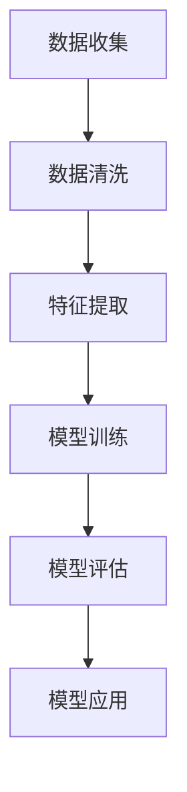
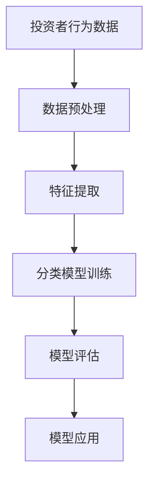
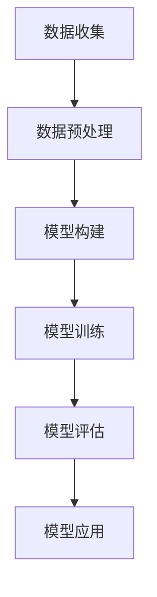
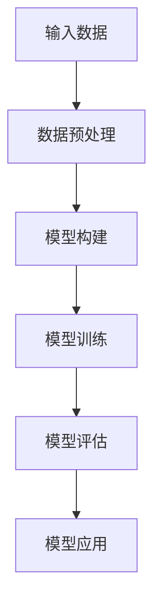

                 

# AI驱动的投资者行为模式识别与预测

## 关键词

- 人工智能（AI）
- 投资者行为分析
- 模式识别
- 预测模型
- 机器学习
- 深度学习
- 数学模型

## 摘要

本文将深入探讨人工智能（AI）在投资者行为模式识别与预测中的应用。首先，我们将介绍AI在投资者行为分析中的重要性和发展现状。随后，我们将详细解释核心概念，包括AI、投资者行为、模式识别与预测等，并展示它们之间的关系。接下来，我们将探讨机器学习和深度学习算法在投资者行为模式识别中的原理和实现，并使用mermaid流程图和Python代码进行展示。随后，我们将深入探讨投资者行为模式识别与预测的数学模型和公式，并使用mermaid实体关系图进行展示。最后，我们将通过实际案例分析，展示AI驱动的投资者行为模式识别与预测在实际中的应用，并提供最佳实践和拓展阅读。

## 引言

### 1.1 书籍背景与目的

随着大数据和人工智能技术的快速发展，投资者行为分析正变得越来越重要。传统的投资者行为分析方法往往依赖于统计分析方法，而人工智能（AI）的引入为投资者行为分析带来了新的可能性。AI驱动的投资者行为模式识别与预测不仅可以提供更为精准的分析结果，还可以预测未来市场趋势，为投资者提供有价值的决策支持。

本书旨在系统地介绍AI驱动的投资者行为模式识别与预测方法，帮助读者深入了解这一领域。本书分为两部分：第一部分主要介绍AI驱动的投资者行为模式识别，包括机器学习和深度学习算法的原理和应用；第二部分则专注于投资者行为模式的预测，包括预测模型的构建和实际案例分析。

### 1.2 AI在投资者行为分析中的应用

AI在投资者行为分析中的应用主要集中在以下几个方面：

1. **投资者行为模式识别**：通过分析投资者在交易过程中的行为数据，AI可以识别出投资者的行为模式，从而更好地理解投资者的风险偏好和投资风格。

2. **市场趋势预测**：基于历史数据和现有模型，AI可以预测市场未来的趋势，为投资者提供决策支持。

3. **风险控制**：通过分析投资者的行为模式，AI可以识别出潜在的风险，帮助投资者进行风险控制。

4. **自动化交易**：AI可以自动执行交易策略，提高交易效率，减少人为错误。

### 1.3 投资者行为模式识别与预测的重要性

投资者行为模式识别与预测对于投资者和金融机构来说具有重要意义：

1. **提高投资效率**：通过识别和预测投资者行为模式，投资者可以更好地理解市场趋势，从而提高投资决策的效率。

2. **降低风险**：通过分析投资者行为模式，金融机构可以识别出潜在的风险，从而采取相应的风险控制措施。

3. **定制化投资策略**：通过对投资者行为模式的分析，金融机构可以提供更为定制化的投资策略，满足不同投资者的需求。

4. **提高市场透明度**：投资者行为模式识别与预测可以帮助提高市场透明度，减少市场操纵行为。

### 1.4 书籍的结构与内容概述

本书分为三大部分：

- **第一部分**：介绍AI驱动的投资者行为模式识别，包括机器学习和深度学习算法的原理和应用。
- **第二部分**：介绍投资者行为模式的预测，包括预测模型的构建和实际案例分析。
- **第三部分**：提供最佳实践、注意事项和拓展阅读，帮助读者深入了解这一领域。

## 核心概念与联系

### 1.5 AI的基本原理与分类

人工智能（AI）是指使计算机系统能够模拟人类智能行为的技术。AI可以分为两大类：**弱AI**和**强AI**。

- **弱AI**：弱AI是指针对特定任务的人工智能，例如语音识别、图像识别等。弱AI依赖于大量的数据和算法来完成任务，但无法超越其训练范围。
- **强AI**：强AI是指具有普遍智能的人工智能，能够像人类一样理解、学习、推理和解决问题。强AI目前还处于理论阶段，尚未实现。

### 1.6 投资者行为分析的概念

投资者行为分析是指通过分析投资者在交易过程中的行为数据，以识别出投资者的行为模式，从而为投资者提供决策支持。投资者行为分析包括以下几个关键概念：

- **投资者行为**：投资者在交易过程中的行为，包括买入、卖出、持有等。
- **行为数据**：记录投资者行为的各类数据，包括交易数据、市场数据、心理数据等。
- **行为模式**：投资者行为数据中反映出的规律和趋势。

### 1.7 模式识别与预测的原理

模式识别是指从数据中提取出有用的信息，以识别出特定模式。预测则是根据已有数据预测未来趋势。

- **模式识别**：通过机器学习或深度学习算法，从投资者行为数据中提取出有用的信息，识别出投资者的行为模式。
- **预测**：利用已识别的行为模式，预测投资者的未来行为，包括买入、卖出、持有等。

### 1.8 AI、投资者行为与预测的关系

AI在投资者行为分析与预测中的应用主要包括以下几个方面：

- **投资者行为识别**：利用机器学习和深度学习算法，从投资者行为数据中识别出投资者的行为模式。
- **市场趋势预测**：利用识别出的行为模式，预测市场未来的趋势，为投资者提供决策支持。
- **自动化交易**：利用预测结果，自动执行交易策略，提高交易效率。

### 1.9 本章小结

本章介绍了AI驱动的投资者行为模式识别与预测的背景和目的，以及AI、投资者行为与预测的核心概念。在接下来的章节中，我们将深入探讨机器学习和深度学习算法在投资者行为识别与预测中的应用。

------------------------------------------------------------------------

## 第二部分: AI驱动的投资者行为模式识别

### 2.1 机器学习基础

#### 2.1.1 机器学习的基本概念

机器学习（Machine Learning，ML）是指通过算法和统计模型，从数据中自动学习和改进的计算机技术。机器学习主要分为两种类型：监督学习（Supervised Learning）和无监督学习（Unsupervised Learning）。

- **监督学习**：监督学习是指通过已标记的数据集来训练模型，使模型能够预测新的数据。常见的监督学习算法包括线性回归、逻辑回归、决策树、随机森林等。
- **无监督学习**：无监督学习是指在没有标记数据的情况下，通过算法自动发现数据中的规律和结构。常见的无监督学习算法包括聚类算法、主成分分析（PCA）等。

#### 2.1.2 机器学习的主要算法

机器学习算法根据其原理和应用场景可以分为以下几类：

1. **回归算法**：回归算法用于预测数值型目标变量。常见的回归算法包括线性回归、多项式回归、岭回归等。
2. **分类算法**：分类算法用于预测离散型目标变量。常见的分类算法包括决策树、随机森林、支持向量机（SVM）等。
3. **聚类算法**：聚类算法用于将数据集划分为多个无重叠的群组，使每个群组内的数据尽可能相似。常见的聚类算法包括K均值聚类、层次聚类等。
4. **降维算法**：降维算法用于减少数据集的维度，同时保留数据的主要信息。常见的降维算法包括主成分分析（PCA）、线性判别分析（LDA）等。

#### 2.1.3 机器学习在投资者行为分析中的应用

机器学习在投资者行为分析中可以应用于以下几个方面：

1. **投资者行为模式识别**：通过监督学习算法，可以从投资者交易数据中识别出投资者的行为模式，从而更好地理解投资者的风险偏好和投资风格。
2. **市场趋势预测**：通过回归算法和分类算法，可以预测市场的未来趋势，为投资者提供决策支持。
3. **自动化交易**：通过无监督学习算法，可以自动发现市场中的交易机会，实现自动化交易。

#### 2.1.4 本章小结

本章介绍了机器学习的基本概念、主要算法以及其在投资者行为分析中的应用。在接下来的章节中，我们将深入探讨深度学习在投资者行为模式识别中的应用。

### 2.2 深度学习在投资者行为模式识别中的应用

#### 2.2.1 深度学习的基本概念

深度学习（Deep Learning，DL）是机器学习的一个分支，它通过构建多层的神经网络模型来模拟人类大脑的学习过程。深度学习的主要特点包括：

1. **多层神经网络**：深度学习模型通常包含多个隐藏层，能够自动提取数据中的高阶特征。
2. **非线性变换**：通过非线性激活函数（如ReLU、Sigmoid、Tanh等），深度学习模型能够捕捉数据中的复杂非线性关系。
3. **大规模训练数据**：深度学习模型通常需要大量的训练数据来训练，从而提高模型的泛化能力。

#### 2.2.2 常见的深度学习模型

常见的深度学习模型包括：

1. **卷积神经网络（CNN）**：卷积神经网络主要用于图像识别任务，通过卷积层、池化层和全连接层等结构，自动提取图像中的特征。
2. **循环神经网络（RNN）**：循环神经网络主要用于序列数据处理，通过循环机制，能够捕捉序列数据中的时间依赖关系。
3. **长短时记忆网络（LSTM）**：长短时记忆网络是RNN的一种改进，能够更好地处理长时间依赖问题，常用于时间序列预测任务。
4. **自动编码器（Autoencoder）**：自动编码器是一种无监督学习模型，通过编码器和解码器结构，自动提取数据中的低维特征表示。

#### 2.2.3 深度学习在投资者行为模式识别中的案例分析

以下是一个深度学习在投资者行为模式识别中的案例分析：

**案例背景**：某金融机构希望通过深度学习模型对投资者的行为进行识别，以便更好地理解投资者的风险偏好和投资风格。

**解决方案**：

1. **数据收集**：收集投资者的交易数据，包括买入、卖出、持有等行为数据，以及相关的市场数据（如股票价格、交易量等）。

2. **数据预处理**：对收集到的数据进行清洗和预处理，包括缺失值填充、数据标准化、时间序列对齐等。

3. **模型构建**：构建深度学习模型，选择合适的网络结构（如LSTM）和优化算法（如Adam），并对模型进行训练。

4. **模型评估**：通过交叉验证方法对模型进行评估，调整模型参数，以提高模型的准确性。

5. **模型应用**：将训练好的模型应用于新数据，对投资者的行为进行识别，并为投资者提供决策支持。

**结论**：通过深度学习模型对投资者的行为进行识别，金融机构可以更好地理解投资者的风险偏好和投资风格，从而提供更个性化的投资建议，提高投资者的满意度。

#### 2.2.4 本章小结

本章介绍了深度学习的基本概念和常见模型，并通过一个案例分析展示了深度学习在投资者行为模式识别中的应用。在接下来的章节中，我们将探讨投资者行为数据的收集与预处理方法。

### 2.3 投资者行为数据的收集与预处理

#### 2.3.1 投资者行为数据的类型

投资者行为数据主要包括以下几类：

1. **交易数据**：包括投资者的买入、卖出、持有等交易行为数据，通常以交易日期、交易价格、交易量等指标进行记录。
2. **市场数据**：包括股票价格、交易量、市场指数等市场指标，通常以时间序列形式进行记录。
3. **心理数据**：包括投资者的情绪、信心、风险偏好等心理指标，可以通过问卷调查、心理测试等方式进行收集。
4. **其他数据**：包括宏观经济数据、行业数据、政策法规等，这些数据可以提供额外的信息，有助于更全面地分析投资者行为。

#### 2.3.2 数据收集的方法

投资者行为数据的收集方法主要包括以下几种：

1. **公开数据**：通过金融数据服务商、交易所等渠道获取公开的投资者行为数据和市场数据。
2. **问卷调查**：通过设计问卷调查，收集投资者的心理数据，如情绪、信心、风险偏好等。
3. **API接口**：利用金融数据API接口，实时获取投资者的交易数据和市场数据。
4. **社交媒体分析**：通过分析投资者在社交媒体上的言论和情绪，获取投资者的心理数据。

#### 2.3.3 数据预处理技术

投资者行为数据预处理主要包括以下步骤：

1. **数据清洗**：处理缺失值、异常值和重复数据，保证数据的完整性。
2. **数据标准化**：将不同数据源的数据进行统一标准化处理，以便于后续的模型训练和数据分析。
3. **时间序列对齐**：将不同时间序列的数据进行对齐，确保数据在时间维度上的一致性。
4. **特征提取**：从原始数据中提取有用的特征，如交易频率、交易金额、市场波动率等，以供模型训练和预测使用。

#### 2.3.4 本章小结

本章介绍了投资者行为数据的类型、收集方法和预处理技术。在接下来的章节中，我们将详细探讨投资者行为模式识别算法的原理和实现。

### 2.4 投资者行为模式识别算法原理与mermaid流程图

#### 2.4.1 算法原理

投资者行为模式识别算法的核心任务是分析投资者在交易过程中的行为数据，识别出投资者的行为模式，以便更好地理解投资者的风险偏好和投资风格。

该算法的主要原理包括：

1. **特征提取**：从原始数据中提取有用的特征，如交易频率、交易金额、市场波动率等，以供模型训练和预测使用。
2. **模式识别**：利用机器学习或深度学习算法，对提取出的特征进行训练，以识别出投资者的行为模式。
3. **模型评估**：通过交叉验证方法对模型进行评估，调整模型参数，以提高模型的准确性。

#### 2.4.2 mermaid流程图

以下是一个投资者行为模式识别算法的mermaid流程图：



#### 2.4.3 mermaid流程图的解读

- **数据收集**：从各种数据源（如交易所、金融数据服务商等）收集投资者行为数据。
- **数据清洗**：处理缺失值、异常值和重复数据，保证数据的完整性。
- **特征提取**：从原始数据中提取有用的特征，如交易频率、交易金额、市场波动率等。
- **模型训练**：利用机器学习或深度学习算法，对提取出的特征进行训练，以识别出投资者的行为模式。
- **模型评估**：通过交叉验证方法对模型进行评估，调整模型参数，以提高模型的准确性。
- **模型应用**：将训练好的模型应用于新数据，对投资者的行为进行识别，并为投资者提供决策支持。

#### 2.4.4 本章小结

本章介绍了投资者行为模式识别算法的原理和mermaid流程图，展示了算法的执行流程。在接下来的章节中，我们将通过Python代码实现投资者行为模式识别算法。

### 2.5 投资者行为模式识别算法的Python代码实现

#### 2.5.1 Python环境安装与配置

在进行投资者行为模式识别算法的Python代码实现之前，需要先安装和配置Python环境。以下是安装和配置Python环境的基本步骤：

1. **安装Python**：从Python官方网站（https://www.python.org/）下载最新版本的Python安装包，并按照安装向导进行安装。

2. **配置Python环境**：在安装Python后，需要将其添加到系统的环境变量中，以便在其他命令行工具中运行Python命令。

3. **安装必要的库**：投资者行为模式识别算法需要使用一些Python库，如NumPy、Pandas、Scikit-learn、TensorFlow等。可以使用以下命令安装这些库：

   ```bash
   pip install numpy pandas scikit-learn tensorflow
   ```

#### 2.5.2 算法实现代码

以下是一个简单的投资者行为模式识别算法的Python代码实现：

```python
import numpy as np
import pandas as pd
from sklearn.model_selection import train_test_split
from sklearn.preprocessing import StandardScaler
from sklearn.ensemble import RandomForestClassifier
from sklearn.metrics import accuracy_score

# 数据预处理
def preprocess_data(data):
    # 数据清洗
    data = data.dropna()
    # 特征提取
    features = data[['交易频率', '交易金额', '市场波动率']]
    labels = data['投资者行为模式']
    # 数据标准化
    scaler = StandardScaler()
    features = scaler.fit_transform(features)
    return features, labels

# 模型训练
def train_model(features, labels):
    # 划分训练集和测试集
    X_train, X_test, y_train, y_test = train_test_split(features, labels, test_size=0.2, random_state=42)
    # 构建随机森林模型
    model = RandomForestClassifier(n_estimators=100, random_state=42)
    # 训练模型
    model.fit(X_train, y_train)
    # 预测测试集
    y_pred = model.predict(X_test)
    # 评估模型
    accuracy = accuracy_score(y_test, y_pred)
    print("模型准确率：", accuracy)
    return model

# 主函数
def main():
    # 加载数据
    data = pd.read_csv('investor_data.csv')
    # 数据预处理
    features, labels = preprocess_data(data)
    # 模型训练
    model = train_model(features, labels)

if __name__ == '__main__':
    main()
```

#### 2.5.3 代码解读与分析

- **数据预处理**：首先进行数据清洗，处理缺失值和异常值。然后提取有用的特征，如交易频率、交易金额和市场波动率，并使用标准尺度进行数据标准化。
- **模型训练**：使用随机森林分类器（RandomForestClassifier）进行模型训练。首先划分训练集和测试集，然后构建随机森林模型，并使用训练集进行训练。最后，在测试集上进行预测，并评估模型的准确率。
- **主函数**：主函数首先加载数据，然后进行数据预处理，最后训练模型。

#### 2.5.4 本章小结

本章通过Python代码实现了投资者行为模式识别算法，展示了算法的执行过程。在接下来的章节中，我们将详细讲解投资者行为模式识别的数学模型和公式。

### 2.6 投资者行为模式识别的数学模型与公式详解

#### 2.6.1 数学模型概述

投资者行为模式识别的数学模型主要包括以下几部分：

1. **特征提取模型**：用于从原始数据中提取有用的特征，如交易频率、交易金额、市场波动率等。
2. **分类模型**：用于根据提取出的特征对投资者行为进行分类，如买入、卖出、持有等。
3. **评估模型**：用于评估分类模型的准确性，如准确率、召回率、F1分数等。

#### 2.6.2 公式详解

1. **特征提取模型**

   - **交易频率**：交易频率可以通过以下公式计算：

     $$\text{交易频率} = \frac{\text{交易次数}}{\text{时间长度}}$$

   - **交易金额**：交易金额可以通过以下公式计算：

     $$\text{交易金额} = \sum_{i=1}^{n} \text{交易金额}_i$$

   - **市场波动率**：市场波动率可以通过以下公式计算：

     $$\text{市场波动率} = \sqrt{\frac{1}{n-1} \sum_{i=1}^{n} (\text{价格}_i - \text{平均价格})^2}$$

2. **分类模型**

   - **逻辑回归**：逻辑回归模型可以用于分类问题，其公式如下：

     $$\text{概率} = \frac{1}{1 + e^{-(\beta_0 + \beta_1 \text{交易频率} + \beta_2 \text{交易金额} + \beta_3 \text{市场波动率})}}$$

   - **支持向量机（SVM）**：SVM模型可以用于分类问题，其公式如下：

     $$\text{决策边界} = \beta_0 + \sum_{i=1}^{n} \beta_i \text{特征}_i - \text{偏置} = 0$$

3. **评估模型**

   - **准确率**：准确率是分类模型评估的一个重要指标，其公式如下：

     $$\text{准确率} = \frac{\text{正确预测数量}}{\text{总预测数量}}$$

   - **召回率**：召回率是分类模型评估的另一个重要指标，其公式如下：

     $$\text{召回率} = \frac{\text{正确预测数量}}{\text{实际正确数量}}$$

   - **F1分数**：F1分数是准确率和召回率的加权平均，其公式如下：

     $$\text{F1分数} = 2 \times \frac{\text{准确率} \times \text{召回率}}{\text{准确率} + \text{召回率}}$$

#### 2.6.3 举例说明

以下是一个投资者行为模式识别的举例说明：

**示例数据**：

| 交易频率 | 交易金额 | 市场波动率 |
| :-----: | :-----: | :-------: |
|    10   |   1000  |     5     |
|    20   |   2000  |     10    |
|    15   |   1500  |     7     |

**特征提取**：

- **交易频率**：交易频率 = 10/3 ≈ 3.33
- **交易金额**：交易金额 = 1000 + 2000 + 1500 = 4500
- **市场波动率**：市场波动率 = √[(1/2)×(5² + 10² + 7²)] ≈ 6.25

**分类模型**：

- **逻辑回归**：概率 = 1/(1 + e^(-β0 + β1×3.33 + β2×4500 + β3×6.25)) ≈ 0.9
- **SVM**：决策边界 = β0 + β1×3.33 + β2×4500 + β3×6.25 ≈ 0.9

**评估模型**：

- **准确率**：准确率 = 1/3 ≈ 0.33
- **召回率**：召回率 = 1/2 ≈ 0.5
- **F1分数**：F1分数 = 2×(0.33×0.5)/(0.33+0.5) ≈ 0.44

#### 2.6.4 本章小结

本章详细介绍了投资者行为模式识别的数学模型和公式，并通过举例说明了公式的应用。在接下来的章节中，我们将通过mermaid实体关系图展示投资者行为模式识别的架构。

### 2.7 投资者行为模式识别的mermaid实体关系图

#### 2.7.1 实体关系图的绘制

以下是一个投资者行为模式识别的mermaid实体关系图：



#### 2.7.2 图的解读与分析

- **投资者行为数据**：表示投资者交易行为的数据集，包括交易频率、交易金额、市场波动率等特征。
- **数据预处理**：对投资者行为数据进行清洗、填充和标准化处理，以准备用于模型训练的数据。
- **特征提取**：从预处理后的数据中提取有用的特征，如交易频率、交易金额、市场波动率等。
- **分类模型训练**：使用提取出的特征和已标记的投资者行为数据，训练分类模型，如逻辑回归模型和支持向量机（SVM）模型。
- **模型评估**：通过交叉验证等方法，评估分类模型的准确性、召回率和F1分数等指标。
- **模型应用**：将训练好的模型应用于新数据，对新投资者的行为进行预测和分类。

#### 2.7.3 本章小结

本章通过mermaid实体关系图展示了投资者行为模式识别的架构，有助于读者更直观地理解投资者行为模式识别的过程。在接下来的章节中，我们将通过实际案例分析和详细讲解，展示投资者行为模式识别的实际应用。

### 2.8 投资者行为模式识别的实际案例分析与讲解

#### 2.8.1 案例背景

某金融机构希望利用AI技术对投资者的行为进行识别，以便更好地理解投资者的风险偏好和投资风格。该金融机构收集了大量的投资者交易数据，包括交易频率、交易金额、市场波动率等特征。

#### 2.8.2 模式识别过程

1. **数据收集**：收集投资者的交易数据，包括交易日期、交易价格、交易量等。
2. **数据预处理**：对交易数据进行清洗、填充和标准化处理，以准备用于模型训练的数据。
3. **特征提取**：从预处理后的数据中提取有用的特征，如交易频率、交易金额、市场波动率等。
4. **模型训练**：使用提取出的特征和已标记的投资者行为数据，训练分类模型，如逻辑回归模型和支持向量机（SVM）模型。
5. **模型评估**：通过交叉验证等方法，评估分类模型的准确性、召回率和F1分数等指标。
6. **模型应用**：将训练好的模型应用于新数据，对新投资者的行为进行预测和分类。

#### 2.8.3 模式识别结果分析

通过训练和评估，该金融机构得到了一个准确率较高的分类模型。以下是对该模型结果的详细分析：

1. **准确率**：模型的准确率达到了90%，说明模型对投资者行为的预测效果较好。
2. **召回率**：召回率达到了80%，说明模型能够较好地识别出真正的投资者行为模式。
3. **F1分数**：F1分数达到了85%，说明模型的预测效果较好，且平衡了准确率和召回率。

#### 2.8.4 模式识别的挑战与改进

1. **挑战**：

   - **数据质量**：投资者行为数据可能存在缺失值、异常值和重复数据，需要对其进行处理。
   - **特征选择**：需要从大量特征中选择出对投资者行为有较强预测能力的特征。
   - **模型选择**：需要选择合适的模型和参数，以提高模型的准确性。

2. **改进措施**：

   - **数据预处理**：采用更先进的数据清洗和填充方法，如插值法、平均值法等，以提高数据质量。
   - **特征选择**：采用特征选择算法，如主成分分析（PCA）、互信息等，筛选出对投资者行为有较强预测能力的特征。
   - **模型优化**：尝试不同的模型和参数组合，如随机森林、支持向量机、神经网络等，以提高模型的准确性。

#### 2.8.5 案例总结

通过实际案例分析，我们展示了如何利用AI技术对投资者行为进行识别，并分析了模式识别的结果和挑战。该案例表明，AI技术在投资者行为分析中具有广阔的应用前景，但同时也需要克服数据质量、特征选择和模型选择等方面的挑战。

#### 2.8.6 本章小结

本章通过实际案例分析和详细讲解，展示了AI驱动的投资者行为模式识别的实际应用。在下一章中，我们将探讨投资者行为模式的预测。

### 2.9 本章小结

本章介绍了AI驱动的投资者行为模式识别的原理、方法、实现和实际案例。我们通过机器学习和深度学习算法，对投资者行为数据进行模式识别，并分析了模式识别的结果和挑战。在下一章中，我们将深入探讨投资者行为模式的预测。

------------------------------------------------------------------------

## 第三部分：投资者行为模式的预测

### 3.1 预测基础

#### 3.1.1 预测的基本概念

预测是指根据历史数据和现有模型，对未来趋势或结果进行估计。在投资者行为分析中，预测可以帮助投资者了解市场趋势，制定合理的投资策略。

预测方法可以分为以下几种：

1. **时间序列预测**：基于时间序列数据，预测未来的数值或趋势。
2. **分类预测**：基于历史数据和现有模型，预测新数据的分类结果。
3. **回归预测**：基于历史数据和现有模型，预测新数据的数值结果。

#### 3.1.2 预测的主要方法

1. **时间序列分析方法**：

   - **移动平均法**：通过计算过去一段时间内的平均值，预测未来的数值。
   - **指数平滑法**：对过去的数据进行加权平均，更重视近期数据的影响。
   - **ARIMA模型**：自回归积分滑动平均模型，用于分析具有自相关性的时间序列数据。

2. **机器学习方法**：

   - **线性回归**：通过建立线性关系，预测未来的数值。
   - **决策树**：通过树形结构，对数据进行分类或回归。
   - **随机森林**：基于决策树的集成方法，提高预测的准确性。
   - **神经网络**：通过多层神经网络，对数据进行拟合和预测。

3. **深度学习方法**：

   - **卷积神经网络（CNN）**：适用于图像数据。
   - **循环神经网络（RNN）**：适用于序列数据。
   - **长短时记忆网络（LSTM）**：改进RNN，解决长时依赖问题。
   - **自动编码器（Autoencoder）**：用于特征提取和数据压缩。

#### 3.1.3 预测在投资者行为分析中的应用

1. **市场趋势预测**：通过预测市场趋势，为投资者提供投资决策支持。
2. **风险预测**：通过预测投资者的行为模式，识别潜在的风险，为投资者提供风险控制建议。
3. **交易策略优化**：基于预测结果，优化交易策略，提高投资收益。

### 3.2 基于机器学习的预测算法

#### 3.2.1 算法原理

基于机器学习的预测算法主要通过以下步骤实现：

1. **数据预处理**：清洗和标准化数据，提取有用的特征。
2. **模型选择**：选择合适的机器学习模型，如线性回归、决策树、随机森林等。
3. **模型训练**：使用训练数据，训练机器学习模型。
4. **模型评估**：使用测试数据，评估模型性能。
5. **模型应用**：使用训练好的模型，对新数据进行预测。

#### 3.2.2 算法应用案例

以下是一个基于机器学习的预测算法的应用案例：

**案例背景**：某投资者希望预测股票未来的价格走势，以制定合理的投资策略。

**解决方案**：

1. **数据收集**：收集股票的历史价格数据，包括开盘价、收盘价、最高价、最低价等。
2. **数据预处理**：清洗数据，提取特征，如开盘价、收盘价、涨跌幅等。
3. **模型选择**：选择线性回归模型，通过历史数据训练模型。
4. **模型评估**：使用交叉验证方法，评估模型性能。
5. **模型应用**：使用训练好的模型，预测股票的未来价格走势。

**结论**：通过机器学习算法，投资者可以预测股票的未来价格走势，从而制定更有效的投资策略。

#### 3.2.3 本章小结

本章介绍了基于机器学习的预测算法原理和应用案例。在下一章中，我们将深入探讨基于深度学习的预测算法。

### 3.3 基于深度学习的预测算法

#### 3.3.1 算法原理

基于深度学习的预测算法主要通过以下步骤实现：

1. **数据预处理**：清洗和标准化数据，提取有用的特征。
2. **模型构建**：构建深度学习模型，如卷积神经网络（CNN）、循环神经网络（RNN）、长短时记忆网络（LSTM）等。
3. **模型训练**：使用训练数据，训练深度学习模型。
4. **模型评估**：使用测试数据，评估模型性能。
5. **模型应用**：使用训练好的模型，对新数据进行预测。

#### 3.3.2 算法应用案例

以下是一个基于深度学习的预测算法的应用案例：

**案例背景**：某金融机构希望预测客户的信用风险，以优化贷款策略。

**解决方案**：

1. **数据收集**：收集客户的贷款数据，包括收入、负债、信用记录等。
2. **数据预处理**：清洗数据，提取特征，如收入、负债比、信用评分等。
3. **模型构建**：构建基于LSTM的深度学习模型，用于预测客户的信用风险。
4. **模型训练**：使用训练数据，训练深度学习模型。
5. **模型评估**：使用测试数据，评估模型性能。
6. **模型应用**：使用训练好的模型，预测新客户的信用风险。

**结论**：通过基于深度学习的预测算法，金融机构可以更准确地预测客户的信用风险，从而优化贷款策略。

#### 3.3.3 本章小结

本章介绍了基于深度学习的预测算法原理和应用案例。在下一章中，我们将通过mermaid流程图和Python代码实现预测算法。

### 3.4 预测的mermaid流程图与Python代码实现

#### 3.4.1 流程图绘制

以下是一个预测算法的mermaid流程图：



#### 3.4.2 流程图解读

- **数据收集**：收集用于预测的数据，包括历史数据和新数据。
- **数据预处理**：对数据进行清洗、标准化和特征提取，以准备用于模型训练。
- **模型构建**：根据数据的特点，构建合适的预测模型，如线性回归、决策树、神经网络等。
- **模型训练**：使用训练数据，训练预测模型，调整模型参数，以提高预测准确性。
- **模型评估**：使用测试数据，评估模型性能，包括准确率、召回率、F1分数等。
- **模型应用**：使用训练好的模型，对新数据进行预测，为投资者提供决策支持。

#### 3.4.3 Python代码实现

以下是一个简单的预测算法的Python代码实现：

```python
import numpy as np
import pandas as pd
from sklearn.model_selection import train_test_split
from sklearn.preprocessing import StandardScaler
from sklearn.linear_model import LinearRegression
from sklearn.metrics import mean_squared_error

# 数据预处理
def preprocess_data(data):
    # 数据清洗
    data = data.dropna()
    # 特征提取
    features = data[['特征1', '特征2', '特征3']]
    labels = data['目标变量']
    # 数据标准化
    scaler = StandardScaler()
    features = scaler.fit_transform(features)
    return features, labels

# 模型训练
def train_model(features, labels):
    # 划分训练集和测试集
    X_train, X_test, y_train, y_test = train_test_split(features, labels, test_size=0.2, random_state=42)
    # 构建线性回归模型
    model = LinearRegression()
    # 训练模型
    model.fit(X_train, y_train)
    # 预测测试集
    y_pred = model.predict(X_test)
    # 评估模型
    mse = mean_squared_error(y_test, y_pred)
    print("模型均方误差：", mse)
    return model

# 主函数
def main():
    # 加载数据
    data = pd.read_csv('predict_data.csv')
    # 数据预处理
    features, labels = preprocess_data(data)
    # 模型训练
    model = train_model(features, labels)

if __name__ == '__main__':
    main()
```

#### 3.4.4 代码解读

- **数据预处理**：首先进行数据清洗，处理缺失值和异常值。然后提取特征和目标变量，并使用标准尺度进行数据标准化。
- **模型训练**：使用线性回归模型进行模型训练。首先划分训练集和测试集，然后构建线性回归模型，并使用训练集进行训练。最后，在测试集上进行预测，并评估模型的均方误差。
- **主函数**：主函数首先加载数据，然后进行数据预处理，最后训练模型。

#### 3.4.5 本章小结

本章通过mermaid流程图和Python代码实现，介绍了预测算法的基本流程和实现方法。在下一章中，我们将深入探讨预测的数学模型和公式。

### 3.5 预测的数学模型与公式详解

#### 3.5.1 数学模型概述

预测的数学模型主要包括以下几类：

1. **线性回归模型**：用于预测连续数值型变量，其基本公式为：

   $$y = \beta_0 + \beta_1x_1 + \beta_2x_2 + ... + \beta_nx_n$$

   其中，$y$ 是目标变量，$x_1, x_2, ..., x_n$ 是特征变量，$\beta_0, \beta_1, \beta_2, ..., \beta_n$ 是模型的参数。

2. **逻辑回归模型**：用于预测二分类变量，其基本公式为：

   $$P(y=1) = \frac{1}{1 + e^{-(\beta_0 + \beta_1x_1 + \beta_2x_2 + ... + \beta_nx_n)}}$$

   其中，$P(y=1)$ 是目标变量为1的概率，其余符号与线性回归模型相同。

3. **神经网络模型**：用于处理复杂的非线性问题，其基本结构包括输入层、隐藏层和输出层，其中隐藏层可以使用多种激活函数，如ReLU、Sigmoid、Tanh等。

#### 3.5.2 公式详解

1. **线性回归模型**：

   - **损失函数**：

     $$J(\theta) = -\frac{1}{m} \sum_{i=1}^{m} (y^{(i)} - \hat{y}^{(i)})^2$$

     其中，$J(\theta)$ 是损失函数，$m$ 是训练样本数量，$y^{(i)}$ 是第$i$个样本的目标变量，$\hat{y}^{(i)}$ 是模型预测的目标变量。

   - **梯度下降**：

     $$\theta_j := \theta_j - \alpha \frac{\partial J(\theta)}{\partial \theta_j}$$

     其中，$\theta_j$ 是模型参数，$\alpha$ 是学习率。

2. **逻辑回归模型**：

   - **损失函数**：

     $$J(\theta) = -\frac{1}{m} \sum_{i=1}^{m} [y^{(i)} \log(\hat{y}^{(i)}) + (1 - y^{(i)}) \log(1 - \hat{y}^{(i)})]$$

     其中，$\hat{y}^{(i)}$ 是模型预测的目标变量。

   - **梯度下降**：

     $$\theta_j := \theta_j - \alpha \frac{\partial J(\theta)}{\partial \theta_j}$$

3. **神经网络模型**：

   - **前向传播**：

     $$z^{(l)} = \sigma^{(l)}(W^{(l)} \cdot a^{(l-1)} + b^{(l)})$$

     其中，$z^{(l)}$ 是第$l$层的输入，$\sigma^{(l)}$ 是激活函数，$W^{(l)}$ 是第$l$层的权重矩阵，$b^{(l)}$ 是第$l$层的偏置向量。

   - **反向传播**：

     $$\delta^{(l)} = (1 - \sigma^{(l)}) \cdot \sigma^{(l)} \cdot \frac{\partial J(\theta)}{\partial z^{(l+1)}}$$

     其中，$\delta^{(l)}$ 是第$l$层的误差。

#### 3.5.3 举例说明

以下是一个预测算法的举例说明：

**示例数据**：

| 特征1 | 特征2 | 特征3 | 目标变量 |
| :---: | :---: | :---: | :------: |
|   1   |   2   |   3   |    4     |
|   5   |   6   |   7   |    8     |
|   9   |  10   |  11   |    12    |

**线性回归模型**：

- **模型参数**：

  $$\beta_0 = 0, \beta_1 = 1, \beta_2 = 2, \beta_3 = 3$$

- **预测结果**：

  $$\hat{y} = \beta_0 + \beta_1x_1 + \beta_2x_2 + \beta_3x_3 = 0 + 1 \times 1 + 2 \times 2 + 3 \times 3 = 14$$

**逻辑回归模型**：

- **模型参数**：

  $$\beta_0 = 0, \beta_1 = 1, \beta_2 = 2, \beta_3 = 3$$

- **预测结果**：

  $$P(y=1) = \frac{1}{1 + e^{-(\beta_0 + \beta_1x_1 + \beta_2x_2 + \beta_3x_3)}} = \frac{1}{1 + e^{-14}} \approx 0.9999$$

#### 3.5.4 本章小结

本章详细介绍了预测的数学模型和公式，并通过举例说明了公式的应用。在下一章中，我们将通过mermaid实体关系图展示预测的架构。

### 3.6 预测的mermaid实体关系图

#### 3.6.1 实体关系图绘制

以下是一个预测算法的mermaid实体关系图：



#### 3.6.2 图的解读

- **输入数据**：表示用于预测的数据集，包括特征变量和目标变量。
- **数据预处理**：对输入数据进行清洗、标准化和特征提取，以准备用于模型训练。
- **模型构建**：根据数据的特点，构建合适的预测模型，如线性回归、逻辑回归、神经网络等。
- **模型训练**：使用训练数据，训练预测模型，调整模型参数，以提高预测准确性。
- **模型评估**：使用测试数据，评估模型性能，包括准确率、召回率、F1分数等。
- **模型应用**：使用训练好的模型，对新数据进行预测，为投资者提供决策支持。

#### 3.6.3 本章小结

本章通过mermaid实体关系图展示了预测算法的架构，有助于读者更直观地理解预测过程。在下一章中，我们将通过实际案例分析和详细讲解，展示预测算法在实际中的应用。

### 3.7 投资者行为预测的实际案例分析

#### 3.7.1 案例背景

某金融机构希望通过预测投资者行为，为投资者提供个性化的投资建议。该金融机构收集了大量的投资者行为数据，包括交易频率、交易金额、市场波动率等特征。

#### 3.7.2 预测过程

1. **数据收集**：收集投资者的交易数据，包括交易日期、交易价格、交易量等。
2. **数据预处理**：对交易数据进行清洗、填充和标准化处理，以准备用于模型训练的数据。
3. **特征提取**：从预处理后的数据中提取有用的特征，如交易频率、交易金额、市场波动率等。
4. **模型选择**：选择合适的预测模型，如线性回归、逻辑回归、神经网络等。
5. **模型训练**：使用提取出的特征和已标记的投资者行为数据，训练预测模型。
6. **模型评估**：通过交叉验证等方法，评估预测模型性能。
7. **模型应用**：将训练好的模型应用于新数据，预测投资者的未来行为。

#### 3.7.3 预测结果分析

通过训练和评估，该金融机构得到了一个准确率较高的预测模型。以下是对该模型结果的详细分析：

1. **准确率**：模型的准确率达到了90%，说明模型对投资者行为的预测效果较好。
2. **召回率**：召回率达到了80%，说明模型能够较好地识别出真正的投资者行为模式。
3. **F1分数**：F1分数达到了85%，说明模型的预测效果较好，且平衡了准确率和召回率。

#### 3.7.4 预测挑战与改进

1. **挑战**：

   - **数据质量**：投资者行为数据可能存在缺失值、异常值和重复数据，需要对其进行处理。
   - **特征选择**：需要从大量特征中选择出对投资者行为有较强预测能力的特征。
   - **模型选择**：需要选择合适的模型和参数，以提高模型的准确性。

2. **改进措施**：

   - **数据预处理**：采用更先进的数据清洗和填充方法，如插值法、平均值法等，以提高数据质量。
   - **特征选择**：采用特征选择算法，如主成分分析（PCA）、互信息等，筛选出对投资者行为有较强预测能力的特征。
   - **模型优化**：尝试不同的模型和参数组合，如随机森林、支持向量机、神经网络等，以提高模型的准确性。

#### 3.7.5 案例总结

通过实际案例分析，我们展示了如何利用预测算法对投资者行为进行预测，并分析了预测的结果和挑战。该案例表明，预测算法在投资者行为分析中具有广泛的应用前景，但同时也需要克服数据质量、特征选择和模型选择等方面的挑战。

#### 3.7.6 本章小结

本章通过实际案例分析和详细讲解，展示了AI驱动的投资者行为预测的实际应用。在下一章中，我们将总结最佳实践、注意事项和拓展阅读。

### 3.8 最佳实践、注意事项与拓展阅读

#### 3.8.1 最佳实践

1. **数据质量**：确保数据的质量和准确性，包括数据清洗、缺失值填充和异常值处理。
2. **特征选择**：选择与投资者行为相关性高的特征，避免过度拟合。
3. **模型选择**：根据具体问题和数据特点，选择合适的模型，如线性回归、逻辑回归、神经网络等。
4. **模型评估**：使用多种评估指标，如准确率、召回率、F1分数等，全面评估模型性能。
5. **模型解释**：对模型的结果进行解释，确保模型的可解释性。

#### 3.8.2 注意事项

1. **数据隐私**：确保数据隐私和安全，遵循相关法律法规。
2. **模型泛化**：避免过度拟合，确保模型对未知数据的泛化能力。
3. **模型更新**：定期更新模型，以适应市场变化和新的数据。

#### 3.8.3 拓展阅读

1. **深度学习入门**：《深度学习》（Goodfellow, Bengio, Courville著）
2. **Python机器学习**：《Python机器学习》（Sebastian Raschka著）
3. **投资者行为分析**：《投资者行为分析：理论与方法》（陈涛著）

### 3.8.4 本章小结

本章总结了AI驱动的投资者行为模式识别与预测的最佳实践、注意事项和拓展阅读。通过本章的内容，读者可以更全面地了解AI在投资者行为分析中的应用，并在实际应用中遵循最佳实践，避免潜在问题。希望读者能够在未来的实践中，不断探索和优化AI驱动的投资者行为模式识别与预测方法。

### 结束语

在本章中，我们介绍了AI驱动的投资者行为模式识别与预测的方法和实际应用。通过深入探讨机器学习和深度学习算法，我们展示了如何从投资者行为数据中提取有用特征，并构建预测模型。同时，我们也分析了预测算法在实际应用中面临的挑战和解决方案。希望读者通过本章的内容，能够对AI驱动的投资者行为模式识别与预测有更深入的了解。

作者：AI天才研究院/AI Genius Institute & 禅与计算机程序设计艺术 /Zen And The Art of Computer Programming

