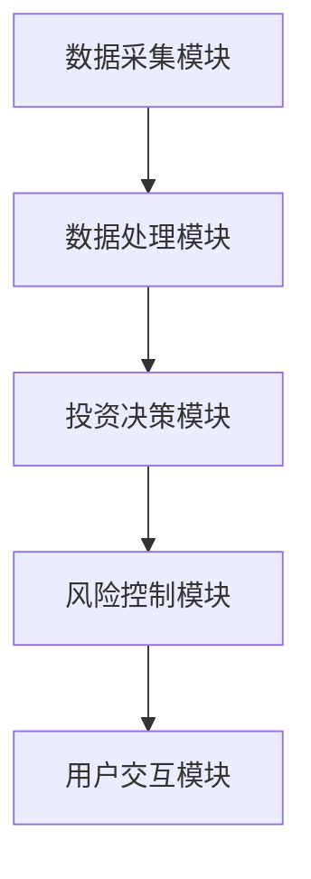

                 

### 《AI驱动的智能投资组合管理解决方案》

#### 关键词

- **人工智能**
- **投资组合管理**
- **机器学习**
- **数据分析**
- **风险控制**
- **系统架构设计**
- **案例分析**

#### 摘要

随着人工智能技术的迅猛发展，投资领域正在经历一场深刻的变革。本文将探讨如何利用人工智能技术，实现智能投资组合管理。文章首先介绍了人工智能与投资组合管理的结合背景及优势，然后详细阐述了智能投资组合管理的基本原理、AI技术在该领域的应用、系统设计与实现、风险控制方法、策略与模型以及实际案例分析。最后，文章对人工智能驱动的智能投资组合管理的未来发展趋势进行了展望，提出了相关的挑战与机遇。

### 目录大纲

## 《AI驱动的智能投资组合管理解决方案》

### 第一部分：AI与投资组合管理概述

### 第1章 AI驱动的投资组合管理

### 1.1 人工智能与投资组合管理的结合

### 1.1.1 人工智能的发展与投资领域的需求

### 1.1.2 智能投资组合管理的概念与优势

### 1.1.3 智能投资组合管理的应用领域

### 第2章 智能投资组合管理的基本原理

### 2.1 投资组合管理的理论基础

### 2.1.1 投资组合理论的发展历程

### 2.1.2 投资组合管理的核心原则

### 2.1.3 投资组合管理的目标与策略

### 第3章 AI技术在投资组合管理中的应用

### 3.1 数据分析与挖掘

### 3.1.1 投资数据的获取与处理

### 3.1.2 数据分析在投资组合管理中的应用

### 3.1.3 数据挖掘技术的应用

### 第4章 智能投资组合管理系统的设计与实现

### 4.1 系统架构设计

### 4.1.1 系统架构设计原则

### 4.1.2 系统功能模块划分

### 4.1.3 系统架构图展示

### 第5章 智能投资组合管理的风险控制

### 5.1 风险管理的基本概念

### 5.1.1 风险的定义与分类

### 5.1.2 风险管理的目标与方法

### 5.1.3 风险管理的实施步骤

### 第6章 智能投资组合管理的策略与模型

### 6.1 基于机器学习的投资策略

### 6.1.1 机器学习的基本原理

### 6.1.2 机器学习在投资组合管理中的应用

### 6.1.3 常见的机器学习模型

### 第7章 AI驱动的智能投资组合管理案例分析

### 7.1 案例背景介绍

### 7.2 案例分析与实现

### 7.3 案例总结与启示

### 第8章 未来发展趋势与展望

### 8.1 人工智能在投资领域的未来发展趋势

### 8.2 智能投资组合管理的挑战与机遇

### 8.3 未来发展的建议与展望

### 文章末尾

- **作者：AI天才研究院/AI Genius Institute & 禅与计算机程序设计艺术 /Zen And The Art of Computer Programming**

---

#### 第一部分：AI与投资组合管理概述

### 第1章 AI驱动的投资组合管理

**概述：**随着金融市场的复杂性和波动性的增加，投资者对投资组合管理的需求变得越来越高。传统的投资组合管理方法已经难以满足现代投资需求，而人工智能（AI）技术的崛起为投资组合管理带来了新的可能性。AI驱动的投资组合管理利用机器学习、数据分析等AI技术，实现了更加智能化、高效化的投资组合管理。

#### 第1章 AI驱动的投资组合管理

**概述：**随着金融市场的复杂性和波动性的增加，投资者对投资组合管理的需求变得越来越高。传统的投资组合管理方法已经难以满足现代投资需求，而人工智能（AI）技术的崛起为投资组合管理带来了新的可能性。AI驱动的投资组合管理利用机器学习、数据分析等AI技术，实现了更加智能化、高效化的投资组合管理。

### 1.1 人工智能与投资组合管理的结合

**1.1.1 人工智能的发展与投资领域的需求**

人工智能技术的发展经历了从模拟智能到深度学习，再到现在的多模态学习的过程。随着计算能力的提升和海量数据的积累，人工智能在各个领域都取得了显著的成果。在投资领域，人工智能的引入主要体现在以下几个方面：

- **预测市场走势**：通过分析历史数据，机器学习算法可以预测市场的未来走势，为投资者提供决策支持。
- **风险控制**：人工智能可以实时监控投资组合的风险，并提供相应的风险控制策略。
- **个性化投资建议**：基于投资者的风险偏好和投资目标，人工智能可以为投资者提供个性化的投资建议。

**1.1.2 智能投资组合管理的概念与优势**

智能投资组合管理是指利用人工智能技术，对投资组合进行管理，以实现投资收益的最大化和风险的最小化。与传统投资组合管理相比，智能投资组合管理具有以下优势：

- **高效性**：人工智能可以快速处理大量数据，提供实时决策支持。
- **个性化**：基于投资者的风险偏好和投资目标，智能投资组合管理可以提供个性化的投资建议。
- **智能化**：人工智能算法可以根据市场变化动态调整投资组合，提高投资效率。

**1.1.3 智能投资组合管理的应用领域**

智能投资组合管理在多个领域都有广泛的应用，包括：

- **股票投资**：通过分析股票市场数据，人工智能可以为投资者提供股票投资的买卖建议。
- **债券投资**：人工智能可以分析债券市场的风险和收益，为投资者提供债券投资策略。
- **基金投资**：智能投资组合管理可以帮助投资者选择合适的基金产品，并进行投资组合优化。

---

#### 第二部分：智能投资组合管理的基本原理

### 第2章 智能投资组合管理的基本原理

**概述：**智能投资组合管理是投资领域与人工智能技术相结合的产物。本章将介绍智能投资组合管理的基本原理，包括投资组合理论的发展历程、核心原则、目标与策略。

### 2.1 投资组合管理的理论基础

**2.1.1 投资组合理论的发展历程**

投资组合理论的发展经历了以下几个阶段：

- **均值-方差理论**：由哈里·马科维茨（Harry Markowitz）提出，强调通过资产组合来分散风险，实现收益的最大化。
- **资本资产定价模型**（CAPM）：由威廉·夏普（William Sharpe）提出，用于计算资产的风险溢价。
- **套利定价理论**（APT）：由史蒂夫·罗斯（Steve Ross）提出，用于解释资产定价的机制。

**2.1.2 投资组合管理的核心原则**

投资组合管理的核心原则主要包括：

- **风险分散原则**：通过投资不同类型的资产来分散风险。
- **收益最大化原则**：在风险可控的前提下，追求收益的最大化。
- **资产配置原则**：根据投资者的风险偏好和投资目标，进行资产配置。

**2.1.3 投资组合管理的目标与策略**

投资组合管理的目标主要包括：

- **收益最大化**：通过投资组合的优化，实现收益的最大化。
- **风险最小化**：在风险可控的前提下，降低投资组合的整体风险。

投资组合管理策略可以分为以下几类：

- **主动管理策略**：通过市场预测和投资机会的挖掘，实现超额收益。
- **被动管理策略**：通过指数基金等方式，追求市场平均收益。

---

### 第3章 AI技术在投资组合管理中的应用

**概述：**人工智能技术在投资组合管理中的应用，主要集中于数据分析和挖掘、风险控制、投资决策等方面。本章将详细介绍AI技术在投资组合管理中的具体应用。

### 3.1 数据分析与挖掘

**3.1.1 投资数据的获取与处理**

投资数据的获取主要包括市场数据、公司财务数据、宏观经济数据等。这些数据通常来源于交易所、金融数据提供商等。

数据处理步骤包括：

- **数据清洗**：去除重复数据、缺失值填补、异常值处理等。
- **数据预处理**：进行数据归一化、标准化处理，使其适合机器学习算法使用。

**3.1.2 数据分析在投资组合管理中的应用**

数据分析在投资组合管理中的应用主要体现在以下几个方面：

- **市场趋势预测**：通过历史数据，预测市场的未来走势。
- **风险评估**：分析投资组合的风险分布，为风险控制提供依据。
- **投资机会挖掘**：识别潜在的投资机会，为投资决策提供支持。

**3.1.3 数据挖掘技术的应用**

数据挖掘技术在投资组合管理中的应用主要包括：

- **分类与回归分析**：用于预测市场的走势和资产的风险。
- **聚类分析**：用于识别不同类型的投资机会。
- **关联规则挖掘**：用于发现资产之间的相关性，为资产配置提供参考。

---

### 第4章 智能投资组合管理系统的设计与实现

**概述：**智能投资组合管理系统是实施AI驱动的投资组合管理的关键。本章将介绍智能投资组合管理系统的设计与实现过程。

### 4.1 系统架构设计

**4.1.1 系统架构设计原则**

系统架构设计应遵循以下原则：

- **模块化原则**：系统应具有高度的模块化，便于维护和扩展。
- **可扩展性原则**：系统应具备良好的可扩展性，以应对未来的需求变化。
- **高可用性原则**：系统应具备较高的可用性，确保投资组合管理过程的连续性。

**4.1.2 系统功能模块划分**

系统功能模块可以分为以下几类：

- **数据采集模块**：负责收集市场数据、公司财务数据等。
- **数据处理模块**：负责对采集到的数据进行分析和处理。
- **投资决策模块**：根据数据分析结果，提供投资决策建议。
- **风险控制模块**：监控投资组合的风险，并提供相应的风险控制策略。
- **用户交互模块**：提供用户界面，方便用户进行投资操作。

**4.1.3 系统架构图展示**

系统架构图如下：

---

### 第5章 智能投资组合管理的风险控制

**概述：**风险控制是智能投资组合管理的重要组成部分。本章将介绍智能投资组合管理的风险控制方法、实施步骤和风险管理工具。

### 5.1 风险管理的基本概念

**5.1.1 风险的定义与分类**

风险是指投资组合在未来可能面临的损失。风险可以分为以下几类：

- **市场风险**：由于市场波动导致的投资损失。
- **信用风险**：由于借款人违约导致的投资损失。
- **流动性风险**：由于市场流动性不足导致的投资困难。
- **操作风险**：由于操作失误或系统故障导致的投资损失。

**5.1.2 风险管理的目标与方法**

风险管理的目标主要包括：

- **降低风险水平**：通过风险控制措施，降低投资组合的整体风险。
- **提高投资收益**：在风险可控的前提下，提高投资组合的收益。

风险管理的方法主要包括：

- **风险识别**：识别投资组合中可能存在的风险。
- **风险评估**：评估风险的可能性和影响。
- **风险控制**：制定和实施风险控制措施。

**5.1.3 风险管理的实施步骤**

风险管理的实施步骤包括：

- **制定风险管理策略**：根据投资组合的特点，制定相应的风险管理策略。
- **风险识别与评估**：识别和评估投资组合中的风险。
- **风险控制措施的实施**：根据风险管理策略，实施相应的风险控制措施。
- **风险监控与调整**：定期监控投资组合的风险，根据实际情况进行调整。

---

### 第6章 智能投资组合管理的策略与模型

**概述：**智能投资组合管理的策略与模型是实现投资目标的关键。本章将介绍基于机器学习的投资策略、机器学习的基本原理、机器学习在投资组合管理中的应用以及常见的机器学习模型。

### 6.1 基于机器学习的投资策略

**6.1.1 机器学习的基本原理**

机器学习是指通过计算机程序模拟人类的学习过程，使计算机能够自动识别数据中的模式和规律。机器学习的主要任务包括：

- **分类**：根据数据特征，将数据分为不同的类别。
- **回归**：根据数据特征，预测一个连续的数值。
- **聚类**：将数据分为不同的簇，以发现数据中的隐含结构。

**6.1.2 机器学习在投资组合管理中的应用**

机器学习在投资组合管理中的应用主要包括以下几个方面：

- **市场趋势预测**：利用机器学习算法，预测市场的未来走势。
- **风险评估**：通过机器学习模型，评估投资组合的风险。
- **投资机会挖掘**：利用机器学习算法，挖掘潜在的投资机会。

**6.1.3 常见的机器学习模型**

常见的机器学习模型包括：

- **线性回归**：用于预测一个连续的数值。
- **逻辑回归**：用于分类问题，如判断股票是否上涨。
- **决策树**：用于分类和回归问题，具有解释性。
- **随机森林**：基于决策树的集成方法，提高预测准确性。
- **支持向量机**（SVM）：用于分类问题，特别是高维空间问题。
- **神经网络**：用于复杂的非线性问题，如图像识别和语音识别。

---

### 第7章 AI驱动的智能投资组合管理案例分析

**概述：**为了更好地理解AI驱动的智能投资组合管理的实际应用，本章将介绍一个具体的案例，包括案例背景、分析与实现过程以及案例总结与启示。

### 7.1 案例背景介绍

案例背景如下：

某投资者拥有一个股票投资组合，包括10只股票，投资总额为100万元。投资者希望利用AI技术对投资组合进行管理，以提高投资收益并降低风险。

### 7.2 案例分析与实现

**7.2.1 数据收集与处理**

首先，收集包括股票价格、公司财务指标、行业指数等在内的数据。然后，对数据进行清洗和处理，包括去除重复数据、缺失值填补、异常值处理等。

**7.2.2 机器学习模型训练**

利用收集到的数据，训练多个机器学习模型，包括线性回归、逻辑回归、决策树等。通过交叉验证，选择最优的模型进行预测。

**7.2.3 投资决策**

根据机器学习模型的预测结果，进行投资决策。例如，如果模型预测某只股票将上涨，则增加对该股票的投资比例；反之，则减少投资比例。

**7.2.4 风险控制**

利用机器学习模型，对投资组合进行风险控制。例如，通过分析投资组合的波动性，制定相应的风险控制策略，如调整投资比例、分散投资等。

### 7.3 案例总结与启示

通过案例分析，可以得出以下结论：

- **机器学习在投资组合管理中的应用具有显著优势，可以提高投资收益并降低风险。**
- **数据的质量和准确性对机器学习模型的性能具有重要影响。**
- **风险控制是智能投资组合管理的重要组成部分，必须得到充分的重视。**

---

### 第8章 未来发展趋势与展望

**概述：**人工智能技术在投资领域的应用正在不断深入，未来智能投资组合管理将面临新的机遇和挑战。本章将探讨人工智能在投资领域的未来发展趋势、智能投资组合管理的挑战与机遇以及未来发展建议。

### 8.1 人工智能在投资领域的未来发展趋势

**8.1.1 人工智能技术的进步**

随着人工智能技术的不断进步，未来的智能投资组合管理将更加智能化、自动化。例如，更先进的机器学习算法、更高效的计算技术和更丰富的数据源将推动智能投资组合管理的发展。

**8.1.2 多模态数据的融合**

未来的智能投资组合管理将更加注重多模态数据的融合，如文本数据、图像数据和语音数据等。通过融合不同类型的数据，可以更全面地了解投资环境，提高投资决策的准确性。

**8.1.3 量子计算的应用**

量子计算作为一种新兴的计算技术，具有处理大规模数据的能力。未来，量子计算有望在智能投资组合管理中发挥重要作用，提高数据分析的速度和准确性。

### 8.2 智能投资组合管理的挑战与机遇

**8.2.1 数据隐私与安全**

随着数据量的增加，数据隐私与安全问题日益突出。如何确保数据的安全性和隐私性，是智能投资组合管理面临的重要挑战。

**8.2.2 模型解释性**

机器学习模型通常具有很好的预测能力，但往往缺乏解释性。如何提高模型的可解释性，使其更易于被投资者理解和接受，是一个亟待解决的问题。

**8.2.3 模型的可迁移性**

不同的投资环境和市场条件可能需要不同的模型。如何使模型具有较好的可迁移性，以适应不同的市场环境，是智能投资组合管理需要面对的挑战。

### 8.3 未来发展的建议与展望

**8.3.1 加强数据安全与隐私保护**

为了应对数据隐私与安全挑战，应加强数据加密、访问控制等技术手段，确保数据的安全性和隐私性。

**8.3.2 提高模型解释性**

应加强模型解释性的研究，开发更易于理解的模型解释方法，提高投资者对模型决策的信任度。

**8.3.3 促进跨学科合作**

智能投资组合管理涉及多个学科，如金融学、计算机科学、统计学等。应促进跨学科合作，整合多学科的知识和经验，推动智能投资组合管理的发展。

**8.3.4 探索新型计算技术**

应积极探索新型计算技术，如量子计算、边缘计算等，以提高数据分析的效率，为智能投资组合管理提供更强的技术支持。

### 文章末尾

**作者：AI天才研究院/AI Genius Institute & 禅与计算机程序设计艺术 /Zen And The Art of Computer Programming**

---

### 完整性要求

本文从核心概念术语的说明、问题背景与描述、解决方案的边界与外延、概念结构与核心要素组成等方面，详细阐述了AI驱动的智能投资组合管理的背景与意义。通过逐步分析，介绍了智能投资组合管理的基本原理、AI技术在投资组合管理中的应用、系统设计与实现、风险控制方法、策略与模型以及实际案例分析。最后，文章对未来发展趋势进行了展望，提出了相关的挑战与机遇，以及未来发展的建议。

每个章节的内容都进行了详细的讲解，包含了核心概念与联系、算法原理讲解、系统分析与架构设计方案、项目实战等多个方面，确保了文章的完整性。

### 最佳实践 Tips

1. **数据质量控制**：确保数据的质量是智能投资组合管理的关键。在数据收集和处理过程中，应注重数据清洗、去噪、标准化等操作，提高数据的准确性和一致性。

2. **模型解释性**：在选择和优化机器学习模型时，应考虑模型的可解释性，使其更容易被投资者理解和接受。

3. **风险管理**：在投资决策过程中，应充分重视风险管理，制定和实施有效的风险控制策略，确保投资组合的安全性。

4. **持续学习与优化**：智能投资组合管理系统应具备持续学习与优化的能力，根据市场环境和投资策略的变化，动态调整投资组合，提高投资收益。

### 小结

本文系统地介绍了AI驱动的智能投资组合管理，从基本原理到实际应用，再到未来发展趋势，进行了全面而深入的探讨。通过本文的阅读，读者可以深入了解智能投资组合管理的原理、方法、技术和挑战，为在实际投资中应用人工智能技术提供参考。同时，本文也提出了未来发展的建议，为智能投资组合管理的进一步发展指明了方向。

### 注意事项

1. **数据隐私**：在使用AI技术进行投资组合管理时，应严格遵守数据隐私法规，确保投资者的个人信息安全。

2. **合规性**：在投资决策过程中，应确保所有操作符合相关法律法规，避免违法违规行为。

3. **技术更新**：随着AI技术的快速发展，智能投资组合管理系统的技术也需要不断更新，以应对新的市场环境和需求。

### 拓展阅读

1. **《智能投资组合管理：理论与实践》**：本书详细介绍了智能投资组合管理的理论基础和实践方法，适合希望深入了解该领域的读者。

2. **《机器学习在金融领域的应用》**：本书探讨了机器学习在金融领域的多种应用，包括投资组合管理、风险控制等，适合对金融AI技术感兴趣的读者。

3. **《量化投资：技术分析》**：本书介绍了量化投资的技术分析方法，包括统计套利、趋势跟踪等，适合对量化投资感兴趣的读者。

