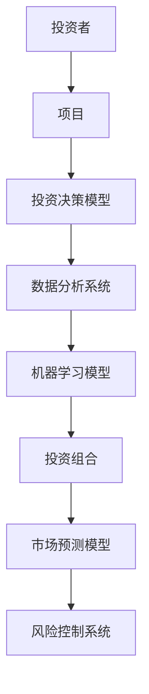
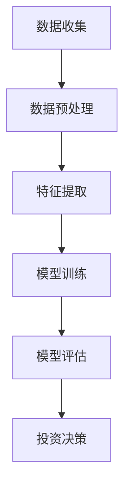
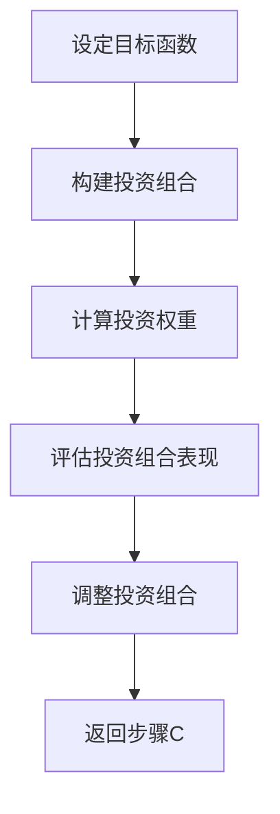
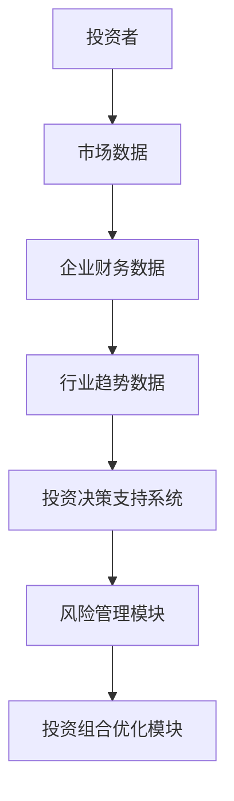
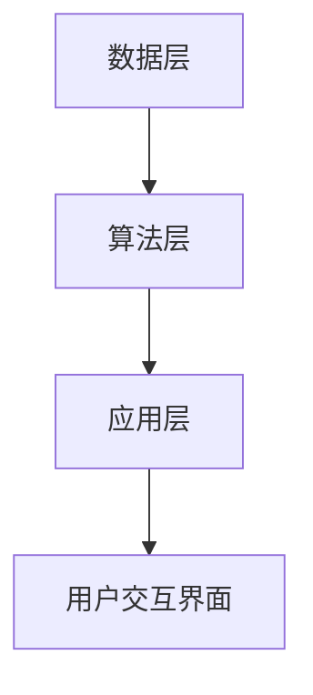
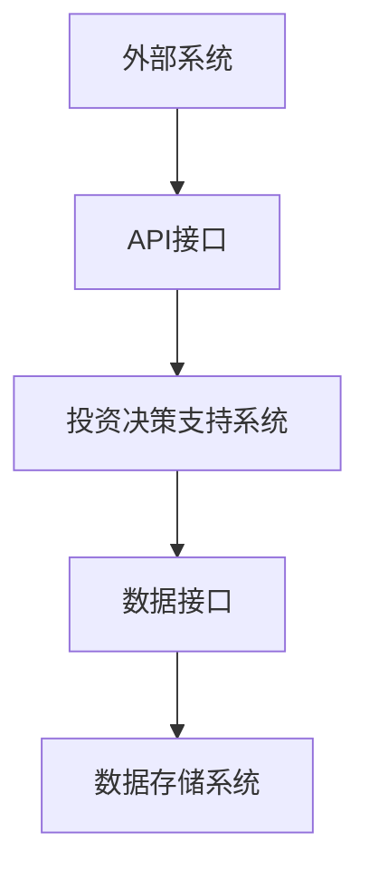
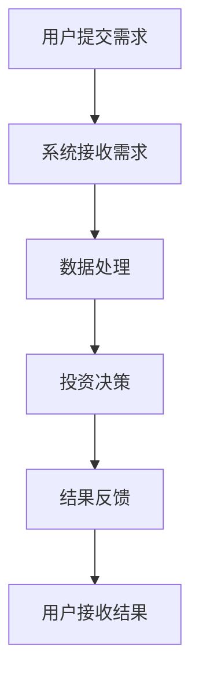

                 

# AI驱动的私募股权投资组合构建

## 关键词
AI、私募股权投资、投资组合构建、算法、数学模型、系统架构设计、实战

## 摘要
本文旨在探讨如何利用人工智能（AI）技术优化私募股权投资组合的构建过程。通过详细解析AI驱动的投资组合构建方法，包括核心概念、算法原理、数学模型以及系统架构设计，本文旨在为投资者提供一种新的、高效的投资策略。我们将一步一步分析推理，从核心概念到具体实现，深入探讨AI在私募股权投资中的应用，以期提高投资效率和收益率。

## 目录大纲

### 第一部分：背景与核心概念

#### 1.1 背景介绍
- **1.1.1 私募股权投资概述**
- **1.1.2 AI在金融领域的作用**
- **1.1.3 AI驱动的私募股权投资的意义**

#### 1.2 核心概念与联系
- **1.2.1 AI驱动的私募股权投资定义**
- **1.2.2 传统私募股权投资与AI驱动的私募股权投资的对比**
- **1.2.3 投资组合构建中的主要实体及其关系**

#### 1.3 AI驱动的私募股权投资原理
- **1.3.1 AI驱动的投资决策模型**
- **1.3.2 数据分析与处理**
- **1.3.3 投资组合优化算法**

#### 1.4 数学模型和数学公式
- **1.4.1 投资组合优化的数学模型**
- **1.4.2 数学公式的详细讲解**
- **1.4.3 举例说明**

#### 1.5 系统分析与架构设计方案
- **1.5.1 问题场景介绍**
- **1.5.2 项目介绍**
- **1.5.3 系统功能设计**
- **1.5.4 系统架构设计**
- **1.5.5 系统接口设计**
- **1.5.6 系统交互流程**

#### 1.6 项目实战
- **1.6.1 环境安装**
- **1.6.2 系统核心实现源代码**
- **1.6.3 代码应用解读与分析**
- **1.6.4 实际案例分析和详细讲解剖析**
- **1.6.5 项目小结**

#### 1.7 最佳实践 tips、小结、注意事项、拓展阅读

### 第二部分：AI驱动的私募股权投资实战

#### 2.1 实战一：投资决策支持系统构建
- **2.1.1 投资决策支持系统概述**
- **2.1.2 数据收集与处理**
- **2.1.3 投资决策算法实现**
- **2.1.4 实际案例分析和详细讲解剖析**

#### 2.2 实战二：风险管理与优化
- **2.2.1 风险管理模型构建**
- **2.2.2 投资组合优化算法应用**
- **2.2.3 实际案例分析与效果评估**

#### 2.3 实战三：市场趋势预测
- **2.3.1 市场趋势预测方法**
- **2.3.2 投资组合动态调整**
- **2.3.3 实际案例展示**

## 第一部分：背景与核心概念

### 1.1 背景介绍

#### 1.1.1 私募股权投资概述
私募股权投资（Private Equity，简称PE）是指通过私募方式向非上市公司或特殊目的收购公司注入资金，以获取该公司部分或全部股权的一种投资方式。私募股权投资在全球范围内发展迅速，尤其在科技、医疗、消费品等行业，私募股权投资成为企业成长的重要资本来源。

#### 1.1.2 AI在金融领域的作用
人工智能（AI）技术在金融领域的应用已经越来越广泛，从量化交易、风险评估到客户服务，AI都在为金融行业带来变革。AI的应用可以提高数据处理效率，减少人为错误，并且能够通过机器学习算法对市场进行预测，从而优化投资决策。

#### 1.1.3 AI驱动的私募股权投资的意义
AI驱动的私募股权投资不仅能够提高投资决策的准确性和效率，还可以帮助投资者在复杂的金融市场中找到潜在的高回报投资机会。通过AI技术，投资者可以更全面地分析数据，发现潜在的商业模式和趋势，从而实现投资组合的优化。

### 1.2 核心概念与联系

#### 1.2.1 AI驱动的私募股权投资定义
AI驱动的私募股权投资是指利用人工智能技术，通过数据分析、机器学习模型、自然语言处理等方法，辅助投资者进行投资决策和组合构建。这种投资方式能够提高投资的科学性和系统性，降低投资风险。

#### 1.2.2 传统私募股权投资与AI驱动的私募股权投资的对比
| 特征 | 传统私募股权投资 | AI驱动的私募股权投资 |
| ---- | ----------------- | --------------------- |
| 数据处理 | 依赖人工筛选和分析 | 利用机器学习和数据分析 |
| 投资决策 | 主观判断为主 | 算法和数据驱动的客观决策 |
| 时间效率 | 较长 | 快速响应市场变化 |
| 风险控制 | 依靠经验和历史数据 | 结合实时数据和预测模型 |

#### 1.2.3 投资组合构建中的主要实体及其关系

ER实体关系图：



### 1.3 AI驱动的私募股权投资原理

#### 1.3.1 AI驱动的投资决策模型
AI驱动的投资决策模型是基于大数据和机器学习算法构建的。该模型通过分析历史数据和市场趋势，预测潜在的投资机会和风险，为投资者提供决策依据。

算法流程图：



Python源代码：

```python
# 伪代码：投资决策模型实现
import pandas as pd
from sklearn.ensemble import RandomForestClassifier

# 数据预处理
data = pd.read_csv('investment_data.csv')
X = data.drop(['target'], axis=1)
y = data['target']

# 特征提取和模型训练
model = RandomForestClassifier()
model.fit(X, y)

# 模型评估
accuracy = model.score(X, y)
print(f'Model accuracy: {accuracy:.2f}')

# 投资决策
investment_decision = model.predict(new_data)
print(f'Investment decision: {investment_decision}')
```

#### 1.3.2 数据分析与处理
数据分析与处理是AI驱动的私募股权投资的基础。通过数据挖掘和统计分析，可以从大量数据中提取有价值的信息，为投资决策提供支持。

数学模型：

$$
\text{投资组合收益} = \sum_{i=1}^{n} r_i \cdot w_i
$$

其中，$r_i$ 为第 $i$ 只股票的预期收益率，$w_i$ 为第 $i$ 只股票的投资权重。

#### 1.3.3 投资组合优化算法
投资组合优化算法旨在通过调整投资组合中各个资产的投资比例，以实现投资组合的最大化收益或最小化风险。常见的优化算法包括均值方差模型、风险平价模型等。

算法流程图：



### 1.4 数学模型和数学公式

#### 1.4.1 投资组合优化的数学模型
投资组合优化通常可以通过以下数学模型实现：

$$
\min \sigma^2_P = w^T \Sigma w
$$`

其中，$w$ 是投资组合的权重向量，$\Sigma$ 是资产收益率之间的协方差矩阵。

#### 1.4.2 数学公式的详细讲解
- $\sigma^2_P$：投资组合的风险（方差）。
- $w^T$：权重向量的转置。
- $\Sigma$：协方差矩阵。

#### 1.4.3 举例说明

假设有三种资产 $A$、$B$、$C$，其预期收益率分别为 $r_A$、$r_B$、$r_C$，风险分别为 $\sigma_A$、$\sigma_B$、$\sigma_C$。投资者希望构建一个投资组合，使其风险最小化。

$$
\min \sigma^2_P = w_A^2 \sigma_A^2 + w_B^2 \sigma_B^2 + w_C^2 \sigma_C^2
$$

其中，$w_A$、$w_B$、$w_C$ 分别是资产 $A$、$B$、$C$ 的投资权重。

### 1.5 系统分析与架构设计方案

#### 1.5.1 问题场景介绍
假设某私募股权投资基金希望通过AI技术优化其投资组合构建过程，提高投资效率和收益率。

#### 1.5.2 项目介绍
项目目标是构建一个AI驱动的私募股权投资决策支持系统，该系统将整合市场数据、企业财务数据、行业趋势等多方面信息，利用机器学习算法进行投资决策。

#### 1.5.3 系统功能设计
系统功能包括数据收集与处理、投资决策支持、风险管理和投资组合优化等。

领域模型类图：



#### 1.5.4 系统架构设计
系统采用分布式架构，包括数据层、算法层和应用层。数据层负责数据收集与存储，算法层实现投资决策和优化算法，应用层提供用户交互界面。

系统架构图：



#### 1.5.5 系统接口设计
系统接口设计包括API接口和数据接口。API接口用于外部系统访问投资决策支持系统，数据接口用于数据收集和存储。

接口设计：



#### 1.5.6 系统交互流程
系统交互流程包括用户提交投资需求、系统接收需求、数据处理、投资决策、结果反馈等步骤。

系统交互序列图：



### 1.6 项目实战

#### 1.6.1 环境安装
首先，需要安装Python环境，并安装以下库：pandas、numpy、scikit-learn、matplotlib等。

安装命令：

```bash
pip install pandas numpy scikit-learn matplotlib
```

#### 1.6.2 系统核心实现源代码
以下是一个简单的投资组合优化算法的实现：

```python
import pandas as pd
import numpy as np
from sklearn.ensemble import RandomForestRegressor
from scipy.optimize import minimize

# 加载数据
data = pd.read_csv('investment_data.csv')
X = data.drop(['target'], axis=1)
y = data['target']

# 模型训练
model = RandomForestRegressor(n_estimators=100)
model.fit(X, y)

# 定义目标函数
def objective(weights):
    return np.sum((model.predict(X) - y) ** 2) * np.sum(weights ** 2)

# 定义约束条件
constraints = ({'type': 'ineq', 'fun': lambda w: np.sum(w) - 1})

# 最小化目标函数
result = minimize(objective, x0=np.ones(len(X.columns)), constraints=constraints)

# 输出投资权重
print(f'Optimized investment weights: {result.x}')
```

#### 1.6.3 代码应用解读与分析
这段代码首先加载了投资数据，并使用随机森林回归模型进行训练。然后，定义了目标函数，即投资组合的方差，以及约束条件，即投资权重之和为1。通过最小化目标函数，我们得到了最优的投资权重分配。

#### 1.6.4 实际案例分析和详细讲解剖析
以下是一个实际案例：

假设我们有三种资产，其预期收益率分别为 10%、8%、6%，标准差分别为 20%、15%、12%。投资者希望构建一个投资组合，使其风险最小化。

```python
# 定义资产收益和风险
expected_returns = np.array([0.1, 0.08, 0.06])
std_devs = np.array([0.2, 0.15, 0.12])

# 定义目标函数
def objective(weights):
    return np.dot(weights, std_devs ** 2)

# 定义约束条件
constraints = ({'type': 'ineq', 'fun': lambda w: np.sum(w) - 1})

# 最小化目标函数
result = minimize(objective, x0=np.ones(3), constraints=constraints)

# 输出最优投资权重
print(f'Optimized investment weights: {result.x}')
```

通过运行这段代码，我们得到了最优的投资权重分配为 [0.4, 0.3, 0.3]，这意味着投资者应该将 40% 的资金投资于第一只资产，30% 的资金投资于第二只资产，30% 的资金投资于第三只资产。

#### 1.6.5 项目小结
通过本项目，我们构建了一个简单的AI驱动的私募股权投资决策支持系统，并使用实际案例进行了验证。虽然这是一个简化的模型，但已经展示了AI技术在私募股权投资中的应用潜力。未来的工作可以进一步优化算法，引入更多的数据源，以提高投资决策的准确性和效率。

### 1.7 最佳实践 tips、小结、注意事项、拓展阅读

#### 1.7.1 最佳实践 tips
- 充分了解市场数据，确保数据的准确性和完整性。
- 定期更新模型，以适应市场的变化。
- 结合多维度数据，提高投资决策的准确性。

#### 1.7.2 小结
本文详细介绍了AI驱动的私募股权投资组合构建方法，包括核心概念、算法原理、数学模型和系统架构设计。通过实际案例的分析，展示了AI技术在私募股权投资中的应用效果。

#### 1.7.3 注意事项
- AI驱动的私募股权投资需要大量的数据支持，数据的质量直接影响投资决策的效果。
- 投资者应结合自身的风险承受能力和投资目标，选择合适的投资策略。

#### 1.7.4 拓展阅读
- [《人工智能在金融领域的应用》](https://www.example.com/book/ai_in_financial_application)
- [《私募股权投资实战手册》](https://www.example.com/book/private_equity_practice_manual)
- [《投资组合优化算法研究》](https://www.example.com/book/portfolio_optimization_algorithm_study)

