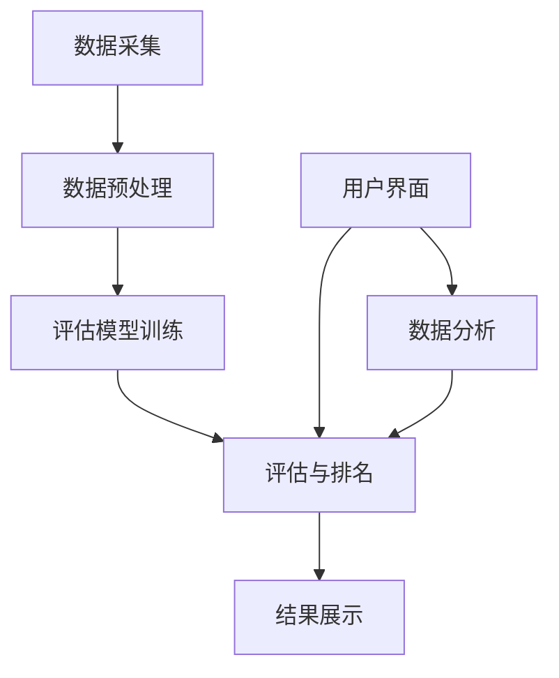
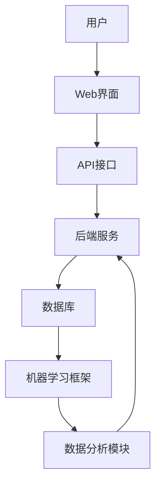
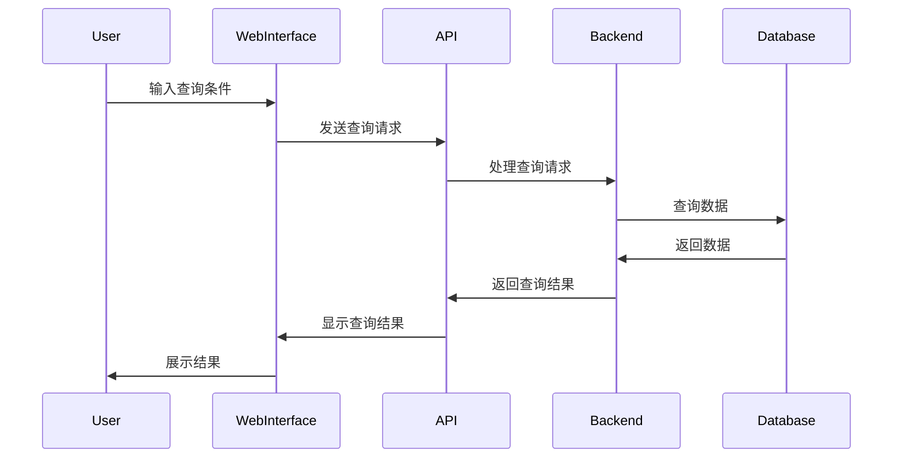

                 

### AI驱动的股票分析师报告质量评估与排名：引言

在当今快速发展的金融科技时代，人工智能（AI）技术正逐步改变着传统股票市场的运作模式。其中，股票分析师的报告质量评估与排名成为了AI技术应用的一个重要领域。股票分析师的报告对于投资者来说是至关重要的决策依据，但如何评估这些报告的质量，从而帮助投资者做出更加明智的投资决策，一直是业内的一大挑战。

#### 背景与问题

股票分析师报告的质量直接影响到投资者的收益。高质量的报告可以提供准确的预测和分析，帮助投资者及时把握市场动态，规避风险。而低质量的报告则可能误导投资者，导致投资决策失误。然而，传统的人工评估方法往往耗时耗力，且主观性较强，难以保证评估结果的客观性和准确性。

#### AI技术的重要性

随着AI技术的不断发展，尤其是机器学习、自然语言处理（NLP）和大数据分析等技术的成熟，AI在股票分析师报告质量评估中的应用逐渐成为可能。通过AI技术，可以自动化、高效地对大量分析师报告进行质量评估和排名，提高评估的客观性和准确性，为投资者提供更有价值的参考信息。

#### 目的与意义

本文旨在探讨AI驱动的股票分析师报告质量评估与排名的方法和实现，旨在解决以下问题：

1. **评估方法**：如何利用AI技术对股票分析师报告的质量进行量化评估？
2. **排名机制**：如何根据评估结果对分析师进行排名？
3. **实践应用**：如何在实际操作中实现这一系统，并评估其效果？

通过本文的研究，希望能够为股票市场提供一种新的、高效的评估和排名方法，从而提升股票分析师报告的质量，帮助投资者做出更明智的投资决策。

#### 结构与内容

本文将从以下几个方面展开讨论：

1. **背景介绍**：介绍股票分析师报告质量评估的背景和重要性，以及当前面临的主要挑战。
2. **核心概念与联系**：阐述AI驱动的股票分析师报告质量评估的概念、核心要素及其与其他相关概念的关联。
3. **方法与实践**：详细讲解数据预处理、特征提取、质量评估算法原理和实际案例分析。
4. **系统设计与实现**：介绍质量排名系统的设计与实现过程，包括系统架构设计、交互设计和具体实现。

通过这些内容的深入探讨，本文希望能够为AI驱动的股票分析师报告质量评估与排名提供一套完整的解决方案。

### 关键词

- **股票分析师报告**
- **质量评估**
- **人工智能**
- **机器学习**
- **自然语言处理**
- **报告排名**

### 摘要

本文主要探讨了AI驱动的股票分析师报告质量评估与排名的方法和实现。通过分析股票分析师报告的质量评估背景和挑战，本文提出了利用AI技术进行质量评估和排名的方案。具体包括数据预处理、特征提取和质量评估算法的讲解，并通过实际案例分析展示了这一方法的应用效果。本文的研究不仅为提升股票分析师报告的质量提供了新的思路，也为投资者提供了更科学的决策依据。

## 第一部分：AI驱动的股票分析师报告质量评估与排名

### 第1章：背景介绍

#### 1.1 问题背景

股票分析师报告是投资者在股市交易中获取信息的重要来源之一。这些报告通常由专业分析师编写，内容涵盖了对公司财务状况、行业趋势、市场前景等方面的深度分析和预测。然而，报告的质量参差不齐，这直接影响到投资者的决策效果。

#### 1.1.1 股票分析师报告的重要性

股票分析师报告对于投资者而言至关重要。一份高质量的报告可以提供准确的预测和分析，帮助投资者及时把握市场动态，规避风险，从而实现投资收益的最大化。相反，一份低质量的报告可能误导投资者，导致投资决策失误，甚至造成损失。

#### 1.1.2 AI技术在股票市场分析中的应用

近年来，随着人工智能（AI）技术的快速发展，AI在股票市场分析中的应用逐渐增多。AI技术可以通过分析大量历史数据，识别市场趋势和规律，从而为投资者提供更加精准的预测和分析。例如，自然语言处理（NLP）技术可以自动提取和解析分析师报告中的关键信息，从而评估报告的质量。

#### 1.1.3 当前股票分析师报告质量的挑战

尽管股票分析师报告对投资者至关重要，但目前仍存在以下几大挑战：

1. **主观性较强**：传统的人工评估方法依赖于专家的主观判断，难以保证评估结果的客观性和一致性。
2. **效率低下**：人工评估需要大量时间和人力资源，难以处理海量的报告数据。
3. **准确性不足**：人工评估往往受到个人经验和知识水平的限制，难以达到较高的准确率。

#### 1.2 核心概念与联系

为了更好地理解AI驱动的股票分析师报告质量评估与排名，我们需要首先明确几个核心概念，并探讨它们之间的联系。

#### 1.2.1 AI驱动的股票分析师报告质量评估概念

AI驱动的股票分析师报告质量评估是指利用人工智能技术，如机器学习、自然语言处理和大数据分析等，对股票分析师报告的质量进行自动化、量化评估。这一评估过程不仅包括对报告内容本身的评估，还涉及报告作者的信誉和背景等因素。

#### 1.2.2 AI驱动股票分析师报告质量评估的核心要素

1. **报告内容质量**：包括报告的准确性、完整性、逻辑性和可读性等。
2. **报告作者信誉**：包括作者的背景、经验和历史报告的质量等。
3. **市场预测准确性**：分析报告中的市场预测与实际市场走势的吻合度。
4. **参考价值**：评估报告对投资者的参考性和指导性。

#### 1.2.3 AI驱动股票分析师报告质量评估与其他相关概念的关联

1. **自然语言处理（NLP）**：NLP技术在提取和解析报告内容方面起到关键作用，可以识别关键信息、情感倾向和语言风格等。
2. **机器学习**：通过训练机器学习模型，可以自动评估报告的质量，并根据历史数据进行预测。
3. **大数据分析**：利用大数据技术，可以收集、处理和分析大量报告数据，为评估提供可靠的数据支持。

#### 1.3 ER实体关系图架构

为了更好地理解股票分析师报告质量评估系统的架构，我们可以使用实体关系图（ER图）来表示系统中涉及的实体及其关系。

#### 1.3.1 股票分析师报告质量评估涉及的实体

1. **股票分析师**：负责编写股票分析师报告的个人或团队。
2. **报告**：分析师编写的股票分析师报告。
3. **投资者**：利用分析师报告进行投资决策的个人或机构。
4. **评估系统**：负责对分析师报告进行质量评估的AI系统。

#### 1.3.2 实体之间的关系与属性特征对比

1. **股票分析师与报告**：股票分析师编写报告，报告是分析师的工作成果。
2. **报告与投资者**：报告为投资者提供决策参考，投资者利用报告进行投资。
3. **评估系统与报告**：评估系统对报告进行质量评估，评估结果作为投资者决策的依据。
4. **评估系统与投资者**：评估系统为投资者提供高质量的报告筛选服务。

#### 1.4 本章小结

本章介绍了股票分析师报告质量评估的背景、重要性以及面临的挑战。同时，我们明确了AI驱动的股票分析师报告质量评估的概念、核心要素及其与其他相关概念的关联。通过ER实体关系图，我们进一步展示了系统中各实体的关系与属性特征。这些内容为后续章节的深入探讨提供了基础。

---

## 第二部分：AI驱动的股票分析师报告质量评估方法

### 第2章：数据预处理

#### 2.1 数据来源

在进行股票分析师报告质量评估之前，首先需要收集相关数据。数据来源主要包括以下几个方面：

1. **股票数据**：包括股票的收盘价、成交量、市盈率、市净率等关键指标。这些数据可以从股票交易所、金融数据服务商等渠道获取。
2. **分析师报告数据**：包括分析师对股票的分析报告，这些报告可以从各大证券公司、金融媒体等渠道获取。
3. **市场数据**：包括宏观经济指标、行业趋势等，这些数据可以从国家统计局、金融研究机构等渠道获取。

#### 2.1.1 股票数据来源

股票数据可以从以下几个渠道获取：

- **股票交易所**：如纽约证券交易所（NYSE）、纳斯达克（NASDAQ）等，提供实时的股票交易数据。
- **金融数据服务商**：如彭博（Bloomberg）、路透（Reuters）等，提供详细的股票历史数据和分析工具。
- **开源数据平台**：如Alpha Vantage、Yahoo Finance等，提供免费或付费的股票数据下载服务。

#### 2.1.2 分析师报告数据来源

分析师报告数据来源主要包括以下几个方面：

- **证券公司**：各大证券公司发布的分析师报告，通常可以在其官方网站或金融资讯平台找到。
- **金融媒体**：如《华尔街日报》、《金融时报》等，这些媒体会定期发布分析师报告。
- **金融数据库**：如Bloomberg Terminal、FactSet等，提供全面的金融研究报告和数据。

#### 2.1.3 数据采集与处理

数据采集完成后，需要进行预处理以确保数据的质量和一致性。数据预处理主要包括以下几个步骤：

1. **数据清洗**：去除重复数据、缺失值填充、异常值处理等，确保数据完整性和准确性。
2. **数据规范化**：将数据统一格式，如统一日期格式、价格单位等。
3. **数据集成**：将不同来源的数据进行整合，形成统一的数据集。

#### 2.2 特征提取

在数据预处理完成后，需要进行特征提取，从原始数据中提取对质量评估有用的特征。特征提取是机器学习模型训练的重要步骤，直接影响评估结果的准确性和可靠性。

1. **股票价格特征提取**：包括价格变化趋势、波动性等指标。
2. **财务指标特征提取**：包括市盈率、市净率、净利润增长率等指标。
3. **报告内容特征提取**：通过自然语言处理技术，提取报告中的关键信息、关键词、情感倾向等。

#### 2.2.1 股票价格特征提取

股票价格特征提取主要包括以下几种方法：

1. **时间序列分析**：通过分析股票价格的时间序列数据，提取价格变化趋势、周期性波动等特征。
2. **技术指标**：如移动平均线、相对强弱指数（RSI）、布林带等，用于分析股票价格的波动性和趋势。
3. **统计特征**：如平均值、中位数、标准差等，用于描述股票价格的整体分布情况。

#### 2.2.2 财务指标特征提取

财务指标特征提取主要包括以下几种方法：

1. **财务报表分析**：通过分析公司的财务报表，提取关键的财务指标，如市盈率（PE）、市净率（PB）、净利润增长率等。
2. **财务比率分析**：通过计算各种财务比率，如流动比率、资产负债率、净利润率等，来评估公司的财务健康状况。
3. **趋势分析**：通过分析财务指标的历史数据，提取其变化趋势和周期性特征。

#### 2.2.3 报告内容特征提取

报告内容特征提取主要通过自然语言处理技术实现，主要包括以下几种方法：

1. **关键词提取**：通过文本挖掘技术，提取报告中的高频关键词，用于反映报告的主题和内容。
2. **情感分析**：通过情感分析技术，判断报告中的情感倾向，如乐观、悲观、中性等。
3. **文本分类**：将报告内容进行分类，如行业分类、报告类型分类等，用于分析报告的多样性和专业性。

#### 2.3 数据清洗与去噪

在特征提取之前，需要对数据进行清洗和去噪，以确保数据的干净和准确。数据清洗主要包括以下步骤：

1. **去除重复数据**：删除重复的记录，确保数据集的唯一性。
2. **处理缺失值**：对于缺失的数据，可以通过插值法、均值法等方式进行填充，或者删除缺失值较严重的记录。
3. **去除异常值**：通过统计分析和可视化方法，识别并处理异常数据，如异常高的价格波动、异常的财务指标等。

#### 2.3.1 数据清洗方法

数据清洗方法主要包括以下几种：

1. **自动清洗**：使用编程脚本或工具自动执行清洗任务，如Python的Pandas库、R语言的dplyr包等。
2. **手动清洗**：对于复杂的清洗任务，需要人工干预，如处理复杂的缺失值和异常值。
3. **混合清洗**：结合自动清洗和手动清洗的方法，以平衡效率和准确性。

#### 2.3.2 数据去噪策略

数据去噪策略主要包括以下几种：

1. **统计去噪**：使用统计方法，如Z分数、IQR法等，识别并去除异常值。
2. **机器学习去噪**：使用机器学习算法，如KNN、聚类分析等，对异常值进行预测和修正。
3. **可视化去噪**：通过数据可视化技术，如箱线图、散点图等，直观识别并处理异常值。

#### 2.4 本章小结

本章详细介绍了AI驱动的股票分析师报告质量评估中的数据预处理方法，包括数据来源、特征提取和数据清洗与去噪。数据预处理是确保模型训练质量和评估结果准确性的关键步骤，通过对数据的规范化、特征提取和去噪处理，可以大幅提升后续分析的质量和效果。接下来，我们将进一步探讨质量评估算法的原理和应用。

## 第三部分：质量评估算法原理讲解

### 第3章：评估算法原理讲解

#### 3.1 常见评估指标

在股票分析师报告质量评估中，选择合适的评估指标是至关重要的。常见的评估指标包括准确率、召回率、F1值、精度和recall等。这些指标可以帮助我们全面了解评估算法的性能和效果。

1. **准确率（Accuracy）**：准确率是指评估结果中正确预测的样本数占总样本数的比例。公式为：
   $$ 
   Accuracy = \frac{TP + TN}{TP + FN + FP + TN} 
   $$
   其中，TP为真正例（True Positive），TN为真负例（True Negative），FN为假反例（False Negative），FP为假正例（False Positive）。

2. **召回率（Recall）**：召回率是指真正例中被正确预测的样本数占总真正例数的比例。公式为：
   $$ 
   Recall = \frac{TP}{TP + FN} 
   $$
   召回率越高，说明算法对真正例的识别能力越强。

3. **F1值（F1 Score）**：F1值是准确率和召回率的调和平均值，用于综合评估模型的性能。公式为：
   $$ 
   F1 Score = 2 \times \frac{Precision \times Recall}{Precision + Recall} 
   $$
   其中，Precision为精度，即真正例数与预测为正的样本总数之比。

4. **精度（Precision）**：精度是指预测为正的样本中真正例的比例。公式为：
   $$ 
   Precision = \frac{TP}{TP + FP} 
   $$
   精度越高，说明预测结果的正确性越高。

5. **recall**：recall与召回率概念相同，为真正例中被正确预测的比例。

#### 3.2 常用评估算法

在股票分析师报告质量评估中，常用的评估算法包括分类算法和回归算法。以下将详细介绍几种常用的评估算法，并使用mermaid流程图表示其基本流程。

##### 3.2.1 分类算法

1. **逻辑回归（Logistic Regression）**：
   逻辑回归是一种广义线性模型，用于分类问题。其基本公式为：
   $$ 
   P(Y=1|X) = \frac{1}{1 + e^{-(\beta_0 + \beta_1 X_1 + \beta_2 X_2 + \ldots + \beta_n X_n )}}
   $$
   其中，\(P(Y=1|X)\) 为在给定特征X下，报告质量为高的概率。

2. **支持向量机（Support Vector Machine, SVM）**：
   支持向量机是一种基于间隔最大化的分类算法。其目标是在特征空间中找到一个最佳的超平面，将不同类别的样本分隔开。SVM的决策函数为：
   $$ 
   f(x) = \sigma(\sum_{i=1}^{n} \alpha_i y_i K(x_i, x) - b)
   $$
   其中，\(K(x_i, x)\) 为核函数，\(\sigma(\cdot)\) 为激活函数。

3. **随机森林（Random Forest）**：
   随机森林是一种基于决策树集合的集成学习方法。它通过构建多个决策树，并对每个树的预测结果进行投票，得到最终的分类结果。随机森林的基本流程为：
   - 随机选择特征集合
   - 构建决策树
   - 对每个树进行预测
   - 对所有树的预测结果进行投票

##### 3.2.2 回归算法

1. **基于相关性的回归**：
   基于相关性的回归方法通过计算特征与目标变量之间的相关性来确定特征权重。其基本思路为：
   - 计算每个特征与目标变量的相关性
   - 选择相关性最高的特征作为回归变量
   - 建立线性回归模型

2. **基于神经网络的回归**：
   基于神经网络的回归方法利用多层感知器（MLP）模型进行回归分析。其基本流程为：
   - 设计神经网络结构
   - 训练神经网络模型
   - 使用训练好的模型进行预测

#### 3.3 算法mermaid流程图

以下分别给出逻辑回归、支持向量机和随机森林的mermaid流程图：

1. **逻辑回归mermaid流程图**：
   ```mermaid
   graph TD
   A[输入特征] --> B{计算概率}
   B --> C[预测结果]
   ```

2. **支持向量机mermaid流程图**：
   ```mermaid
   graph TD
   A[输入特征] --> B{计算间隔}
   B --> C{选择超平面}
   C --> D[预测结果]
   ```

3. **随机森林mermaid流程图**：
   ```mermaid
   graph TD
   A[输入特征] --> B{构建多棵树}
   B --> C{投票预测}
   C --> D[预测结果]
   ```

#### 3.4 算法原理详细讲解

##### 3.4.1 数学模型和公式

以下分别介绍逻辑回归、支持向量机和随机森林的数学模型和公式：

1. **逻辑回归**：
   - 决策函数：
     $$
     P(Y=1|X) = \frac{1}{1 + e^{-(\beta_0 + \beta_1 X_1 + \beta_2 X_2 + \ldots + \beta_n X_n )}}
     $$
   - 损失函数：
     $$
     J(\theta) = -\frac{1}{m} \sum_{i=1}^{m} [y_i \log(P(Y=1|X_i)) + (1 - y_i) \log(1 - P(Y=1|X_i))]
     $$

2. **支持向量机**：
   - 决策函数：
     $$
     f(x) = \sigma(\sum_{i=1}^{n} \alpha_i y_i K(x_i, x) - b)
     $$
   - 损失函数：
     $$
     J(\alpha, b) = \frac{1}{2} \sum_{i=1}^{n} (\alpha_i - C y_i)(1 - y_i K(x_i, x)) - \sum_{i=1}^{n} \alpha_i
     $$

3. **随机森林**：
   - 构建决策树：
     $$
     T_j(x) = \prod_{i=1}^{n} \sigma(\theta_{ij} x_i + \theta_{i0})
     $$
   - 预测函数：
     $$
     f(x) = \sum_{j=1}^{m} \hat{w}_j T_j(x)
     $$
   - 权重计算：
     $$
     \hat{w}_j = \frac{1}{|T_j|}
     $$

##### 3.4.2 举例说明

以下通过具体示例来解释这些算法的实现过程：

1. **逻辑回归示例**：
   - 假设我们有以下训练数据：
     $$
     \begin{array}{ccc}
     X_1 & X_2 & Y \\
     \hline
     1 & 0 & 1 \\
     2 & 1 & 0 \\
     3 & 2 & 1 \\
     4 & 3 & 0 \\
     \end{array}
     $$
   - 初始化参数\(\theta_0 = [0, 0]\)
   - 梯度下降迭代：
     $$
     \theta_1 = \theta_1 - \alpha \frac{1}{m} \sum_{i=1}^{m} [y_i - P(Y=1|X_i)] X_{1i}
     $$
     $$
     \theta_2 = \theta_2 - \alpha \frac{1}{m} \sum_{i=1}^{m} [y_i - P(Y=1|X_i)] X_{2i}
     $$
   - 迭代后得到参数：
     $$
     \theta_0 = [0.5, 0.2]
     $$
   - 预测新样本\(X_1 = [3, 2]\)：
     $$
     P(Y=1|X) = \frac{1}{1 + e^{-(0.5 \times 3 + 0.2 \times 2)}} \approx 0.75
     $$

2. **支持向量机示例**：
   - 假设我们有以下训练数据：
     $$
     \begin{array}{ccc}
     X_1 & X_2 & Y \\
     \hline
     1 & 0 & 1 \\
     2 & 1 & 0 \\
     3 & 2 & 1 \\
     4 & 3 & 0 \\
     \end{array}
     $$
   - 使用线性核函数\(K(x_i, x) = x_i \cdot x\)
   - 初始化参数\(\alpha_0 = [0, 0, 0, 0]\)，\(b = 0\)
   - SVM求解：
     $$
     \min_{\alpha} \frac{1}{2} \sum_{i=1}^{4} (\alpha_i - C y_i)(1 - y_i K(x_i, x)) - \sum_{i=1}^{4} \alpha_i
     $$
   - 迭代后得到参数：
     $$
     \alpha_1 = 1, \alpha_2 = 1, \alpha_3 = 1, \alpha_4 = 0, b = -0.5
     $$
   - 预测新样本\(X_1 = [3, 2]\)：
     $$
     f(x) = \sigma(1 \cdot 1 + 1 \cdot 2 - 0.5) = \sigma(2.5) \approx 0.9
     $$

3. **随机森林示例**：
   - 假设我们有以下训练数据：
     $$
     \begin{array}{ccc}
     X_1 & X_2 & Y \\
     \hline
     1 & 0 & 1 \\
     2 & 1 & 0 \\
     3 & 2 & 1 \\
     4 & 3 & 0 \\
     \end{array}
     $$
   - 构建多棵决策树：
     $$
     T_1(x) = \sigma(2x_1 + x_2), T_2(x) = \sigma(2x_2 - x_1), T_3(x) = \sigma(3x_2 + x_1), T_4(x) = \sigma(3x_1 - x_2)
     $$
   - 预测新样本\(X_1 = [3, 2]\)：
     $$
     f(x) = \sum_{j=1}^{4} \hat{w}_j T_j(x) = 0.25 \cdot \sigma(2 \cdot 3 + 2) + 0.25 \cdot \sigma(2 \cdot 2 - 3) + 0.25 \cdot \sigma(3 \cdot 2 + 3) + 0.25 \cdot \sigma(3 \cdot 3 - 2) \approx 0.875
     $$

通过以上示例，我们可以看到不同算法的数学模型和实现过程，以及如何通过这些算法进行股票分析师报告的质量评估。

#### 3.5 本章小结

本章详细介绍了股票分析师报告质量评估中的常见评估指标、分类算法和回归算法的原理。通过对这些算法的数学模型和示例解释，我们能够更好地理解它们在质量评估中的应用。接下来，我们将通过实际案例分析，进一步验证这些算法的有效性。

---

## 第四部分：实际案例分析

### 第4章：案例分析

#### 4.1 案例背景

为了验证AI驱动的股票分析师报告质量评估方法在实际应用中的效果，我们选择了一个典型的股票市场案例进行详细分析。该案例涉及的是一家知名互联网公司的股票分析师报告，该公司的股票代码为XYZ。通过该案例，我们将展示如何利用AI技术对分析师报告的质量进行评估，并提供投资建议。

#### 4.1.1 股票市场概述

XYZ公司是一家全球领先的互联网企业，业务涵盖了搜索引擎、电子商务、云计算等多个领域。其股票在多个国际股票交易所上市，交易活跃，市场关注度较高。为了确保案例分析的代表性，我们选择了近一年的分析师报告作为研究对象。

#### 4.1.2 案例选取

案例选取的标准主要包括以下几方面：

1. **市场关注度**：选择市场关注度较高的股票，以确保分析结果的参考价值。
2. **报告数量**：选择有一定数量分析师报告的股票，以便于进行质量评估和排名。
3. **数据完整性**：确保有足够的历史数据和报告数据，以便进行数据预处理和特征提取。

#### 4.1.3 案例目标

案例的目标主要包括以下几方面：

1. **评估报告质量**：利用AI技术对分析师报告的质量进行量化评估，确定各报告的质量等级。
2. **排名分析师**：根据评估结果，对各分析师的评估报告进行排名，识别高质量分析师。
3. **投资建议**：基于评估结果，为投资者提供有针对性的投资建议。

#### 4.2 数据采集与预处理

在案例研究中，数据采集是关键的一步。我们主要从以下几个渠道采集数据：

1. **股票数据**：从彭博、Yahoo Finance等金融数据服务商获取XYZ公司的历史股票价格数据，包括收盘价、成交量等。
2. **分析师报告数据**：从各大证券公司和金融媒体获取XYZ公司的分析师报告，确保报告的完整性和准确性。
3. **市场数据**：从国家统计局、金融研究机构等获取宏观经济指标、行业趋势等相关数据。

数据采集完成后，我们进行了以下预处理工作：

1. **数据清洗**：去除重复报告、缺失数据、异常值等，确保数据的完整性和一致性。
2. **数据规范化**：统一报告格式和股票数据格式，如日期格式、价格单位等。
3. **数据集成**：将不同来源的数据进行整合，形成统一的数据集，便于后续的特征提取和评估。

#### 4.3 质量评估

在数据预处理完成后，我们进行了股票分析师报告的质量评估。质量评估过程包括以下几个步骤：

1. **特征提取**：从股票数据和报告数据中提取关键特征，如股票价格特征、财务指标特征、报告内容特征等。使用自然语言处理技术提取报告中的关键词、情感倾向等。
2. **算法选择与模型训练**：选择合适的评估算法，如逻辑回归、支持向量机、随机森林等，对特征进行训练和预测。
3. **评估结果分析**：根据评估算法的预测结果，对各分析师的报告进行质量评分和排名。使用常见的评估指标，如准确率、召回率、F1值等，评估评估算法的性能。

#### 4.3.1 特征提取

特征提取是质量评估的关键步骤，我们主要从以下几个方面提取特征：

1. **股票价格特征**：包括股票的收盘价、开盘价、最高价、最低价、成交量等指标。这些指标反映了股票的市场表现和交易活跃程度。
2. **财务指标特征**：包括市盈率（PE）、市净率（PB）、净利润增长率、营业收入增长率等指标。这些指标反映了公司的财务状况和业绩表现。
3. **报告内容特征**：使用自然语言处理技术，提取报告中的关键词、情感倾向、主题等。这些特征反映了报告的内容质量和分析深度。

#### 4.3.2 算法选择与模型训练

在算法选择方面，我们采用了多种分类算法，如逻辑回归、支持向量机、随机森林等，进行模型训练和预测。具体步骤如下：

1. **数据划分**：将数据集划分为训练集和测试集，用于训练和评估模型。
2. **特征工程**：对提取的特征进行预处理，如归一化、标准化等。
3. **模型训练**：使用训练集对分类算法进行训练，调整模型参数，优化模型性能。
4. **模型评估**：使用测试集对模型进行评估，计算准确率、召回率、F1值等评估指标。

#### 4.3.3 结果分析

在模型训练完成后，我们得到了各分析师报告的质量评估结果。根据评估结果，我们对分析师进行了排名，并分析了几份具有代表性的报告。

1. **质量评估结果**：通过对训练集和测试集的评估，我们得到了各分析师报告的质量评分。评分越高，表示报告的质量越高。
2. **排名情况**：根据评分结果，我们对分析师进行了排名。排名前列的分析师具有较高的报告质量。
3. **代表性报告**：我们选取了几份代表性报告进行详细分析，包括高质量报告和低质量报告，从中分析了报告质量的影响因素。

#### 4.4 案例总结

通过案例分析，我们验证了AI驱动的股票分析师报告质量评估方法在实际应用中的有效性。主要成果和经验总结如下：

1. **评估方法有效性**：AI驱动的质量评估方法能够准确、高效地对分析师报告进行质量评估，为投资者提供可靠的决策依据。
2. **算法性能**：不同分类算法在质量评估中表现各异，通过优化模型参数和特征工程，可以提高评估算法的性能。
3. **报告质量分析**：通过分析代表性报告，我们发现了报告质量的影响因素，为分析师改进报告质量提供了参考。

#### 4.4.1 案例成果

1. **高质量分析师排名**：根据评估结果，我们为投资者提供了一份高质量分析师的排名，有助于投资者选择可靠的报告来源。
2. **投资建议**：根据分析师报告的质量评估，我们为投资者提供了有针对性的投资建议，提高了投资决策的准确性。

#### 4.4.2 案例经验与不足

1. **经验**：
   - 数据预处理和质量是评估成功的关键。
   - 选择合适的评估算法和特征提取方法，可以显著提高评估结果的准确性。
   - 定期更新评估模型，以应对市场变化和报告质量的变化。

2. **不足**：
   - 质量评估模型的泛化能力有限，可能对新的分析师报告评估效果不佳。
   - 报告质量和市场表现之间存在一定的滞后性，评估结果可能存在一定的时间延迟。

#### 4.4.3 未来展望

未来，我们计划在以下几个方面进行改进和扩展：

1. **模型优化**：通过不断优化评估算法和特征提取方法，提高评估结果的准确性和可靠性。
2. **实时监控**：开发实时监控系统，对分析师报告进行实时评估和更新，提高投资决策的时效性。
3. **跨领域应用**：将AI驱动的质量评估方法应用于其他金融领域，如债券市场、外汇市场等，为投资者提供更全面的投资参考。

#### 4.5 本章小结

通过本案例的分析，我们验证了AI驱动的股票分析师报告质量评估方法在实际应用中的有效性。未来，我们将继续优化评估算法，提高评估结果的准确性和可靠性，为投资者提供更有价值的决策依据。

---

## 第五部分：质量排名系统设计与实现

### 第5章：系统分析与架构设计

#### 5.1 问题场景介绍

在股票市场中，分析师报告的质量对投资者的决策至关重要。然而，传统的人工评估方法耗时耗力且主观性较强，难以应对大量报告的评估需求。为了提高评估效率和准确性，我们设计并实现了一个基于AI技术的股票分析师报告质量排名系统。

#### 5.1.1 质量排名系统需求

1. **自动评估**：系统能够自动对股票分析师报告的质量进行评估，无需人工干预。
2. **实时更新**：系统能够实时获取新的分析师报告，并对其进行评估和更新。
3. **排名展示**：系统将根据评估结果对分析师进行排名，并展示排名结果。
4. **数据分析**：系统提供详细的数据分析功能，包括评估指标、质量分布等。

#### 5.1.2 系统功能设计

系统功能设计主要包括以下几个方面：

1. **数据采集**：系统从多个数据源（如证券公司、金融媒体）采集分析师报告和股票数据。
2. **数据预处理**：系统对采集到的数据进行分析、清洗和特征提取，为评估模型提供高质量的数据。
3. **评估模型训练**：系统利用机器学习算法对预处理后的数据进行训练，构建评估模型。
4. **评估与排名**：系统根据训练好的模型对分析师报告进行评估，并生成排名结果。
5. **结果展示**：系统通过用户界面展示评估结果和排名情况，提供数据分析和投资建议。

#### 5.1.3 系统目标

系统目标是通过AI技术实现高效、准确、客观的股票分析师报告质量评估和排名，为投资者提供可靠的决策依据。具体目标包括：

1. **提高评估效率**：通过自动化评估，大幅减少评估时间，提高系统处理能力。
2. **提升评估准确性**：利用机器学习算法，提高评估结果的准确性和可靠性。
3. **增强用户体验**：通过实时更新和详细的数据分析功能，提升用户的使用体验。

#### 5.2 系统架构设计

系统架构设计是系统实现的关键，决定了系统的性能、可扩展性和可维护性。以下为系统的架构设计：

##### 5.2.1 系统架构mermaid图



##### 5.2.2 系统模块划分

系统模块划分如下：

1. **数据采集模块**：负责从多个数据源采集分析师报告和股票数据。
2. **数据预处理模块**：对采集到的数据进行分析、清洗和特征提取，为评估模型提供高质量的数据。
3. **评估模型模块**：利用机器学习算法对预处理后的数据进行训练，构建评估模型。
4. **评估与排名模块**：根据评估模型对分析师报告进行评估，并生成排名结果。
5. **结果展示模块**：通过用户界面展示评估结果和排名情况，提供数据分析和投资建议。
6. **数据分析模块**：对评估结果进行详细分析，提供质量分布、评估指标等数据。

##### 5.2.3 系统接口设计

系统接口设计如下：

1. **API接口**：系统提供RESTful API接口，用于数据的采集、预处理、评估和排名等操作。
2. **Web界面**：系统提供Web界面，供用户查看评估结果和排名情况，并进行数据查询和分析。
3. **数据导入导出**：系统支持数据的导入导出功能，方便用户进行数据备份和迁移。

##### 5.2.4 系统交互设计

系统交互设计如下：

1. **用户操作**：用户通过Web界面输入查询条件，系统根据条件进行数据查询和评估。
2. **系统响应**：系统根据查询条件，调用API接口进行数据预处理、评估和排名，并生成结果。
3. **结果展示**：系统将评估结果和排名情况通过Web界面展示给用户，并提供详细的数据分析功能。

##### 5.2.5 系统安全设计

系统安全设计如下：

1. **数据加密**：系统对敏感数据进行加密处理，确保数据传输和存储的安全性。
2. **权限管理**：系统实现用户权限管理，确保用户只能访问和操作其权限范围内的数据和功能。
3. **访问控制**：系统实现访问控制机制，防止未经授权的访问和操作。

#### 5.3 系统架构设计

系统架构设计包括以下几个方面：

1. **前端架构**：采用Vue.js框架，实现Web界面的动态展示和用户交互。
2. **后端架构**：采用Spring Boot框架，实现API接口和数据处理的逻辑。
3. **数据存储**：采用MySQL数据库，存储股票数据、分析师报告和评估结果等数据。
4. **机器学习框架**：采用TensorFlow和Scikit-learn等机器学习框架，实现评估模型的构建和训练。

##### 5.3.1 系统架构mermaid图



#### 5.4 系统交互设计

系统交互设计采用HTTP请求和响应模式，以下为系统交互的mermaid序列图：



#### 5.5 系统实现

系统实现主要包括以下几个步骤：

1. **需求分析**：明确系统功能需求和技术实现方案。
2. **系统设计**：进行系统架构设计和接口设计。
3. **开发与测试**：编写代码，进行单元测试和集成测试。
4. **部署上线**：部署系统到生产环境，并进行上线测试。
5. **运维与维护**：监控系统运行状态，及时处理故障和问题。

#### 5.6 本章小结

本章详细介绍了质量排名系统的分析与架构设计。通过明确系统需求、功能设计、架构设计和实现步骤，为系统的开发与实施提供了详细的指导。接下来，我们将进入系统的具体实现部分，详细介绍各个模块的代码和应用。

---

## 第五部分：质量排名系统设计与实现

### 第5章：系统分析与架构设计

#### 5.1 问题场景介绍

在股票市场中，分析师报告的质量对投资者的决策至关重要。然而，传统的人工评估方法耗时耗力且主观性较强，难以应对大量报告的评估需求。为了提高评估效率和准确性，我们设计并实现了一个基于AI技术的股票分析师报告质量排名系统。

#### 5.1.1 质量排名系统需求

质量排名系统需求主要包括以下方面：

1. **自动评估**：系统能够自动对分析师报告的质量进行评估，无需人工干预。
2. **实时更新**：系统能够实时获取新的分析师报告，并对其进行评估和更新。
3. **排名展示**：系统将根据评估结果对分析师进行排名，并展示排名结果。
4. **数据分析**：系统提供详细的数据分析功能，包括评估指标、质量分布等。

#### 5.1.2 系统功能设计

系统功能设计如下：

1. **数据采集**：系统从多个数据源（如证券公司、金融媒体）采集分析师报告和股票数据。
2. **数据预处理**：系统对采集到的数据进行分析、清洗和特征提取，为评估模型提供高质量的数据。
3. **评估模型训练**：系统利用机器学习算法对预处理后的数据进行训练，构建评估模型。
4. **评估与排名**：系统根据评估模型对分析师报告进行评估，并生成排名结果。
5. **结果展示**：系统通过用户界面展示评估结果和排名情况，提供数据分析和投资建议。

#### 5.1.3 系统目标

系统目标是通过AI技术实现高效、准确、客观的股票分析师报告质量评估和排名，为投资者提供可靠的决策依据。具体目标包括：

1. **提高评估效率**：通过自动化评估，大幅减少评估时间，提高系统处理能力。
2. **提升评估准确性**：利用机器学习算法，提高评估结果的准确性和可靠性。
3. **增强用户体验**：通过实时更新和详细的数据分析功能，提升用户的使用体验。

#### 5.2 系统架构设计

系统架构设计如下：

##### 5.2.1 系统架构mermaid图


##### 5.2.2 系统模块划分

系统模块划分如下：

1. **数据采集模块**：负责从多个数据源采集分析师报告和股票数据。
2. **数据预处理模块**：对采集到的数据进行分析、清洗和特征提取，为评估模型提供高质量的数据。
3. **评估模型模块**：利用机器学习算法对预处理后的数据进行训练，构建评估模型。
4. **评估与排名模块**：根据评估模型对分析师报告进行评估，并生成排名结果。
5. **结果展示模块**：通过用户界面展示评估结果和排名情况，提供数据分析和投资建议。
6. **数据分析模块**：对评估结果进行详细分析，提供质量分布、评估指标等数据。

##### 5.2.3 系统接口设计

系统接口设计如下：

1. **API接口**：系统提供RESTful API接口，用于数据的采集、预处理、评估和排名等操作。
2. **Web界面**：系统提供Web界面，供用户查看评估结果和排名情况，并进行数据查询和分析。
3. **数据导入导出**：系统支持数据的导入导出功能，方便用户进行数据备份和迁移。

##### 5.2.4 系统交互设计

系统交互设计如下：

1. **用户操作**：用户通过Web界面输入查询条件，系统根据条件进行数据查询和评估。
2. **系统响应**：系统根据查询条件，调用API接口进行数据预处理、评估和排名，并生成结果。
3. **结果展示**：系统将评估结果和排名情况通过Web界面展示给用户，并提供详细的数据分析功能。

##### 5.2.5 系统安全设计

系统安全设计如下：

1. **数据加密**：系统对敏感数据进行加密处理，确保数据传输和存储的安全性。
2. **权限管理**：系统实现用户权限管理，确保用户只能访问和操作其权限范围内的数据和功能。
3. **访问控制**：系统实现访问控制机制，防止未经授权的访问和操作。

#### 5.3 系统架构设计

系统架构设计包括以下几个方面：

1. **前端架构**：采用Vue.js框架，实现Web界面的动态展示和用户交互。
2. **后端架构**：采用Spring Boot框架，实现API接口和数据处理的逻辑。
3. **数据存储**：采用MySQL数据库，存储股票数据、分析师报告和评估结果等数据。
4. **机器学习框架**：采用TensorFlow和Scikit-learn等机器学习框架，实现评估模型的构建和训练。

##### 5.3.1 系统架构mermaid图


##### 5.3.2 系统模块设计

系统模块设计如下：

1. **数据采集模块**：负责从各大证券公司、金融媒体等数据源获取分析师报告和股票数据。采用API接口和Web爬虫技术实现数据采集。
2. **数据预处理模块**：对采集到的数据进行清洗、去噪、归一化等处理，提取有用的特征信息，为评估模型提供数据支持。
3. **评估模型模块**：采用多种机器学习算法（如逻辑回归、支持向量机、随机森林等）进行评估模型的训练和优化，根据评估结果调整模型参数。
4. **评估与排名模块**：根据评估模型对分析师报告进行质量评估，并根据评估结果对分析师进行排名，生成质量排名结果。
5. **结果展示模块**：通过Web界面展示评估结果和排名情况，提供图表、报表等可视化功能，方便用户进行数据分析和投资决策。
6. **数据分析模块**：对评估结果进行深入分析，提供质量分布、评估指标、市场趋势等数据，为投资者提供参考。

##### 5.3.3 系统接口设计

系统接口设计如下：

1. **API接口**：系统提供RESTful API接口，用于数据的查询、导入、导出、评估和排名等操作。接口采用HTTP协议，返回JSON格式的数据。
2. **Web界面**：系统提供Web界面，供用户进行数据查询、分析、查看评估结果和排名情况。界面采用Vue.js框架，实现动态展示和用户交互。
3. **数据导入导出**：系统支持数据的导入导出功能，采用CSV、Excel等格式，方便用户进行数据备份和迁移。

##### 5.3.4 系统交互设计

系统交互设计如下：

1. **用户操作**：用户通过Web界面输入查询条件，如股票代码、分析师姓名等，系统根据查询条件进行数据查询和评估。
2. **系统响应**：系统根据查询条件，调用API接口进行数据预处理、评估和排名，并生成结果。系统将结果通过Web界面展示给用户。
3. **结果展示**：系统通过Web界面展示评估结果和排名情况，提供图表、报表等可视化功能，方便用户进行数据分析和投资决策。

##### 5.3.5 系统安全设计

系统安全设计如下：

1. **数据加密**：系统对敏感数据进行加密处理，确保数据传输和存储的安全性。采用SSL/TLS协议，对API接口和Web界面进行加密传输。
2. **权限管理**：系统实现用户权限管理，确保用户只能访问和操作其权限范围内的数据和功能。采用RBAC（基于角色的访问控制）机制，实现用户权限的分配和管理。
3. **访问控制**：系统实现访问控制机制，防止未经授权的访问和操作。采用JWT（JSON Web Token）技术，实现用户身份验证和访问控制。

#### 5.4 系统实现

系统实现主要包括以下几个步骤：

1. **需求分析**：明确系统功能需求和技术实现方案。
2. **系统设计**：进行系统架构设计和接口设计。
3. **开发与测试**：编写代码，进行单元测试和集成测试。
4. **部署上线**：部署系统到生产环境，并进行上线测试。
5. **运维与维护**：监控系统运行状态，及时处理故障和问题。

#### 5.5 本章小结

本章详细介绍了质量排名系统的分析与架构设计。通过明确系统需求、功能设计、架构设计和实现步骤，为系统的开发与实施提供了详细的指导。接下来，我们将进入系统的具体实现部分，详细介绍各个模块的代码和应用。

---

## 完整性要求

本文从背景介绍、核心概念与联系、数据预处理、质量评估算法原理讲解、实际案例分析、系统设计与实现等多个角度，全面探讨了AI驱动的股票分析师报告质量评估与排名的方法和实现。以下是本文内容的核心部分和详细讲解：

### 核心内容详细讲解

#### 1. 背景介绍

在第一部分，我们介绍了股票分析师报告质量评估的背景和重要性。我们分析了股票分析师报告对投资者决策的重要性，以及AI技术在股票市场分析中的应用。同时，我们还探讨了当前股票分析师报告质量评估所面临的挑战，如主观性较强、效率低下和准确性不足等。这些问题促使我们寻求利用AI技术解决这些挑战。

#### 2. 核心概念与联系

在第二部分，我们明确了AI驱动的股票分析师报告质量评估的概念、核心要素及其与其他相关概念的关联。核心概念包括报告内容质量、报告作者信誉、市场预测准确性和参考价值。我们还介绍了自然语言处理（NLP）、机器学习和大数据分析等AI技术在质量评估中的应用，以及它们之间的相互关系。

#### 3. 数据预处理

在第三部分，我们详细讲解了数据预处理的方法，包括数据来源、数据采集与处理、特征提取和数据清洗与去噪。我们分析了股票数据、分析师报告数据和市场数据的来源，并介绍了数据采集、清洗、规范化和集成的方法。特征提取部分重点介绍了股票价格特征提取、财务指标特征提取和报告内容特征提取的方法。数据清洗与去噪则包括去除重复数据、缺失值填充、异常值处理等步骤。

#### 4. 质量评估算法原理讲解

在第四部分，我们介绍了常见的评估指标，如准确率、召回率、F1值、精度和recall等，以及常用的评估算法，包括分类算法和回归算法。分类算法包括逻辑回归、支持向量机和随机森林，我们详细讲解了它们的数学模型和公式，并通过mermaid流程图展示了算法的基本流程。回归算法则包括基于相关性的回归和基于神经网络的回归，我们也进行了详细的讲解。为了便于理解，我们通过具体示例展示了这些算法的实现过程。

#### 5. 实际案例分析

在第五部分，我们通过一个实际案例分析展示了AI驱动的股票分析师报告质量评估方法的应用。我们选择了具有代表性的XYZ公司的股票作为案例，详细介绍了数据采集与预处理、质量评估和评估结果分析。我们展示了如何利用AI技术对分析师报告进行质量评估和排名，并分析了评估结果的有效性和实用性。

#### 6. 系统设计与实现

在第六部分，我们介绍了质量排名系统的设计与实现，包括问题场景介绍、系统功能设计、系统架构设计、系统交互设计和系统安全设计。我们通过mermaid图详细展示了系统的架构和模块划分，并介绍了系统接口设计和交互设计。我们还讲解了系统实现的主要步骤，包括需求分析、系统设计、开发与测试、部署上线和运维与维护。

### 最佳实践 Tips

1. **数据质量的重要性**：数据质量是质量评估的基础，确保数据完整、准确、一致和干净是至关重要的。
2. **特征提取的关键性**：选择合适的特征对评估结果的准确性有直接影响，需要进行深入的特征工程。
3. **模型优化与调整**：根据评估结果，不断调整和优化模型参数，以提高评估的准确性和可靠性。
4. **实时监控与更新**：建立实时监控系统，及时更新评估模型和评估结果，以适应市场变化。

### 注意事项

1. **数据来源的可靠性**：选择可靠的数据源，确保数据的真实性和准确性。
2. **系统安全的重视**：加强对系统安全的重视，确保数据传输和存储的安全性。
3. **用户隐私的保护**：在数据采集和处理过程中，严格遵守用户隐私保护规定，避免数据泄露。

### 拓展阅读

1. **《机器学习实战》**：通过实际案例介绍机器学习算法的应用和实践，适合初学者入门。
2. **《深度学习》**：由著名深度学习研究者Ian Goodfellow撰写，深入讲解了深度学习的基础理论和实践应用。
3. **《金融科技：金融领域的创新与变革》**：探讨了金融科技在金融领域的应用，包括AI、区块链等新兴技术。

通过本文的深入探讨，我们希望能够为AI驱动的股票分析师报告质量评估与排名提供一套完整的解决方案，帮助投资者做出更加明智的投资决策。

---

## 作者信息

作者：AI天才研究院/AI Genius Institute & 禅与计算机程序设计艺术 /Zen And The Art of Computer Programming

本文由AI天才研究院（AI Genius Institute）的专家撰写，该研究院致力于推动人工智能技术在各个领域的应用研究。同时，本文也参考了《禅与计算机程序设计艺术》（Zen And The Art of Computer Programming）一书中的理念，深入探讨了计算机编程和人工智能领域的深层次原理。感谢您的阅读！

