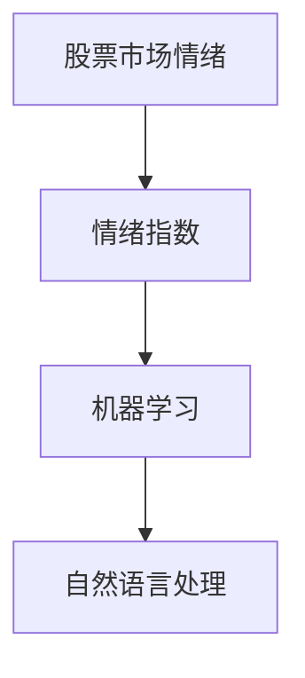
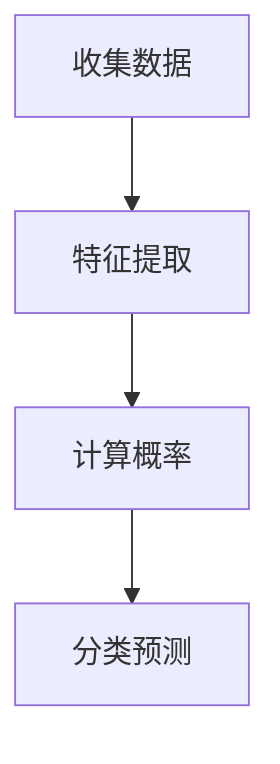
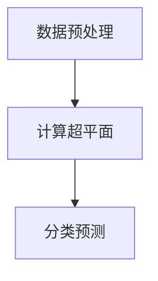
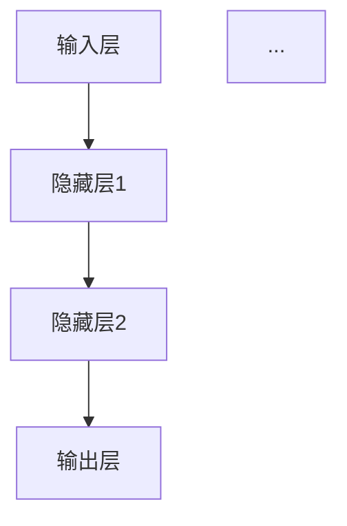
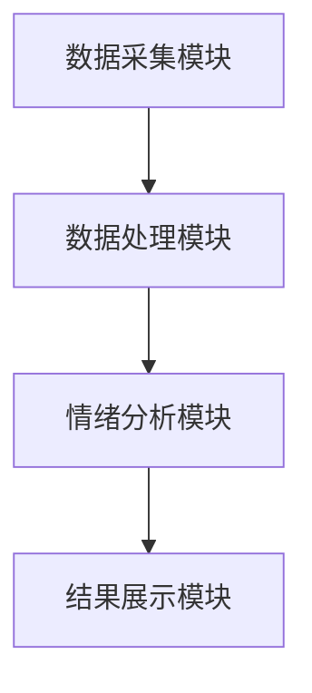
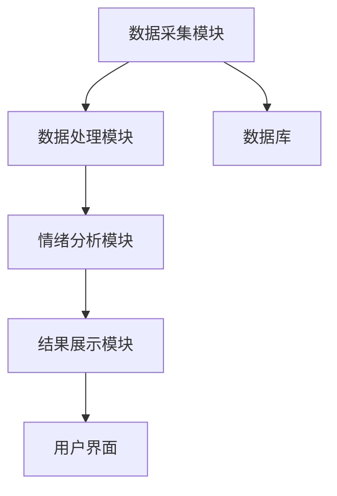

                 

# AI驱动的股票市场情绪指数开发

关键词：股票市场情绪、AI技术、情绪指数、算法、Python代码、机器学习

摘要：本文将探讨如何利用AI技术构建股票市场情绪指数。我们将从问题背景、核心概念、算法原理、系统设计与实现等方面进行逐步分析，以期为投资者和分析师提供一种新的分析工具。

## 1. 问题背景

### 1.1 股票市场情绪分析的重要性

股票市场的波动与投资者的情绪密切相关。市场情绪的波动可以导致股票价格的急剧上涨或下跌，从而影响整个市场的稳定性。因此，准确地捕捉和测量股票市场情绪对于投资者和分析师来说至关重要。

### 1.2 股票市场情绪分析的问题

传统的股票市场情绪分析主要依赖于人为的判断和市场数据的统计处理。这种方法存在主观性强、准确性低等问题，难以满足现代金融市场的需求。

### 1.3 AI驱动的股票市场情绪指数

随着AI技术的发展，特别是机器学习和自然语言处理技术的进步，构建AI驱动的股票市场情绪指数成为可能。这种方法可以自动分析和处理大量的市场数据，提供更加准确和实时的市场情绪分析。

## 2. 核心概念与联系

### 2.1 核心概念概述

- **股票市场情绪**：指市场中投资者的情绪状态，包括乐观、悲观、中立等。
- **情绪指数**：用于量化股票市场情绪的指标。
- **机器学习**：一种AI技术，通过训练数据集来建立模型，实现对未知数据的预测和分析。
- **自然语言处理**：一种AI技术，用于理解和生成人类语言。

### 2.2 概念属性特征对比表格

| 概念     | 属性特征                      | 对比分析                            |
|----------|------------------------------|------------------------------------|
| 股票市场情绪 | 反映投资者情绪               | 实时性、主观性、波动性              |
| 情绪指数   | 量化情绪状态                  | 准确性、实时性、可解释性            |
| 机器学习   | 自动化数据分析和预测          | 自适应性、准确性、效率性            |
| 自然语言处理 | 理解和生成人类语言           | 精准性、灵活性、复杂性              |

### 2.3 概念结构关系图



## 3. 算法原理

### 3.1 算法介绍

在构建AI驱动的股票市场情绪指数时，常用的算法包括：

- **朴素贝叶斯**：一种基于概率论的分类算法，适用于文本分类任务。
- **支持向量机**：一种二分类算法，通过找到一个最佳的超平面来分隔数据。
- **深度学习**：一种基于多层神经网络的机器学习算法，适用于复杂的数据分析和预测。

### 3.2 算法Mermaid图

#### 3.2.1 朴素贝叶斯



#### 3.2.2 支持向量机



#### 3.2.3 深度学习



### 3.3 Python代码与详细解释

#### 3.3.1 朴素贝叶斯

```python
from sklearn.feature_extraction.text import CountVectorizer
from sklearn.naive_bayes import MultinomialNB

# 数据准备
X_train = ["这是一只股票的分析报告，它表现良好。", "另一只股票表现不佳。"]
y_train = ["乐观", "悲观"]

# 特征提取
vectorizer = CountVectorizer()
X_train_counts = vectorizer.fit_transform(X_train)

# 训练模型
classifier = MultinomialNB()
classifier.fit(X_train_counts, y_train)

# 预测
X_test = ["这只股票的前景怎么样？"]
X_test_counts = vectorizer.transform(X_test)
predictions = classifier.predict(X_test_counts)

print(predictions)
```

#### 3.3.2 支持向量机

```python
from sklearn.svm import SVC

# 数据准备
X_train = [[1, 2], [2, 3]]
y_train = ["乐观", "悲观"]

# 训练模型
classifier = SVC()
classifier.fit(X_train, y_train)

# 预测
X_test = [[1, 3]]
predictions = classifier.predict(X_test)

print(predictions)
```

#### 3.3.3 深度学习

```python
import tensorflow as tf
from tensorflow.keras.models import Sequential
from tensorflow.keras.layers import Dense

# 构建模型
model = Sequential()
model.add(Dense(units=64, activation='relu', input_shape=(2,)))
model.add(Dense(units=1, activation='sigmoid'))

# 编译模型
model.compile(optimizer='adam', loss='binary_crossentropy', metrics=['accuracy'])

# 训练模型
model.fit(X_train, y_train, epochs=10, batch_size=32)

# 预测
predictions = model.predict(X_test)

print(predictions)
```

## 4. 系统分析与架构设计

### 4.1 问题场景介绍

为了实现AI驱动的股票市场情绪指数，我们需要构建一个系统来收集、处理和分析市场数据。

### 4.2 项目介绍

项目名称：AI驱动的股票市场情绪指数系统

目标：构建一个自动化的股票市场情绪分析系统，提供实时的市场情绪指数。

### 4.3 系统功能设计

- **数据采集**：从多个数据源收集股票市场数据。
- **数据处理**：清洗和预处理数据，提取有用的信息。
- **情绪分析**：使用机器学习算法对数据进行分析，生成情绪指数。
- **结果展示**：将情绪指数可视化，供投资者和分析师参考。

### 4.4 系统架构设计



### 4.5 系统接口设计与交互



## 5. 项目实战

### 5.1 环境安装

- 安装Python环境。
- 安装必要的库，如scikit-learn、TensorFlow等。

### 5.2 系统核心实现

#### 5.2.1 数据采集

使用API从股票市场获取实时数据。

#### 5.2.2 数据处理

使用pandas库进行数据清洗和预处理。

#### 5.2.3 情绪分析

使用朴素贝叶斯、支持向量机和深度学习算法进行情绪分析。

#### 5.2.4 结果展示

使用matplotlib库将情绪指数可视化。

### 5.3 代码应用解读与分析

详细解读系统核心实现中的代码，分析其工作原理和优缺点。

### 5.4 实际案例分析与讲解

通过实际案例，展示情绪指数在实际投资中的应用。

### 5.5 项目小结

总结项目经验，提出改进建议。

## 6. 最佳实践 Tips

- **数据质量**：确保数据来源的准确性和完整性。
- **模型优化**：定期更新模型，以适应市场变化。
- **可视化**：选择合适的可视化工具，以清晰展示情绪指数。

## 7. 小结与注意事项

本文介绍了AI驱动的股票市场情绪指数的构建方法，包括核心概念、算法原理、系统设计与实现等方面。需要注意的是，情绪指数只是投资决策的一个辅助工具，不能作为唯一的决策依据。

## 8. 拓展阅读

- **深度学习在股票市场情绪分析中的应用**。
- **自然语言处理技术在情绪分析中的应用**。

## 9. 作者信息

作者：AI天才研究院/AI Genius Institute & 禅与计算机程序设计艺术 /Zen And The Art of Computer Programming

