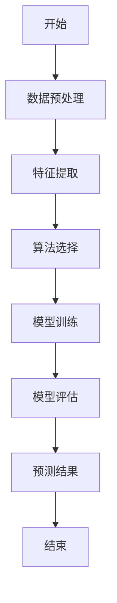
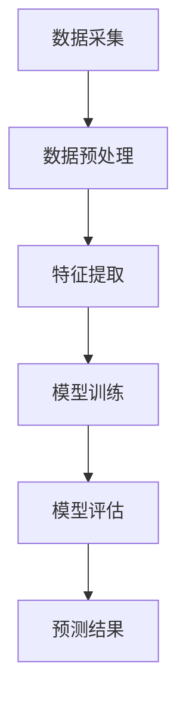

                 

### 第一部分: AI驱动的股票筛选工具背景介绍

#### 1.1.1 问题背景
在当今投资市场中，股票投资是一个常见且受欢迎的理财方式。随着全球股票市场的不断壮大，投资者面临的挑战也越来越大。股票市场中的信息量巨大，投资者需要分析大量的财务报表、新闻报道、分析师报告等，以便找到潜在的高收益股票。

#### 1.1.2 问题描述
然而，传统的股票筛选方法通常依赖于人工分析，这不仅耗时费力，而且容易受到主观偏见的影响。投资者难以从海量数据中快速准确地筛选出具有潜力的股票。此外，市场变化快速，投资者需要及时调整投资策略，这对他们的判断力和反应速度提出了更高的要求。

#### 1.1.3 问题解决
AI驱动的股票筛选工具利用机器学习和自然语言处理技术，从大量数据中自动提取信息，并通过算法分析股票的潜在风险和收益。这种方法能够提高筛选效率，减少人为误差，帮助投资者做出更为明智的投资决策。

#### 1.1.4 边界与外延
本书主要探讨使用AI技术进行股票筛选的基本原理和实践，包括数据预处理、特征提取、算法选择和优化等。书中内容不仅限于股票市场，还可以应用于其他金融领域的数据分析和决策支持。

#### 1.1.5 概念结构与核心要素组成
AI驱动的股票筛选工具包括以下几个核心组成部分：

1. **数据来源**：包括财务报表、新闻、分析师报告等。
2. **数据预处理**：清洗、去重、标准化等。
3. **特征提取**：从原始数据中提取与股票表现相关的特征。
4. **算法选择**：选择合适的机器学习算法进行模型训练和预测。
5. **风险评估**：评估股票的潜在风险和收益。

### 第二部分: 核心概念与联系

#### 2.1.1 AI驱动的股票筛选工具原理
AI驱动的股票筛选工具主要依赖于机器学习和自然语言处理技术。机器学习算法可以从大量历史数据中学习，发现潜在的投资模式。自然语言处理技术则可以帮助提取文本数据中的关键信息，如新闻报道中的市场情绪、分析师报告中的观点等。

#### 2.1.2 数据预处理方法
数据预处理是AI驱动的股票筛选工具的重要环节。首先，需要对原始数据进行清洗，去除无效数据和噪声。然后，进行数据去重，确保数据的唯一性和准确性。最后，对数据进行标准化处理，使其适合机器学习算法进行分析。

#### 2.1.3 特征提取技术
特征提取是将原始数据转换为机器学习算法可以处理的形式。在股票筛选中，常用的特征包括股票的历史价格、成交量、市盈率、市净率等财务指标，以及新闻报道中的情绪指标等。特征提取的关键在于选择与股票表现高度相关的特征，以提升模型的预测能力。

#### 2.1.4 算法选择与优化
选择合适的算法是构建高效AI驱动的股票筛选工具的关键。常见的算法包括线性回归、决策树、随机森林、支持向量机、神经网络等。每种算法都有其独特的优势和适用场景。在实际应用中，需要根据具体的数据特点和业务需求选择合适的算法，并通过交叉验证、网格搜索等技术进行优化。

#### 2.1.5 风险评估方法
风险评估是AI驱动的股票筛选工具的核心功能。通过对历史数据的分析，可以评估股票的潜在风险和收益。常见的风险评估方法包括统计分析、回归分析、聚类分析等。这些方法可以帮助投资者了解股票的潜在风险，做出更为理性的投资决策。

### 第三部分: 算法原理讲解

#### 3.1.1 算法原理
在本章中，我们将详细讲解AI驱动的股票筛选工具中常用的算法原理。这些算法包括线性回归、决策树、随机森林、支持向量机、神经网络等。

#### 3.1.2 算法mermaid流程图
使用mermaid绘制算法流程图，以便读者更好地理解算法的实现过程。



#### 3.1.3 Python源代码实现
以下是一个简单的线性回归算法的Python源代码实现：

```python
import numpy as np
from sklearn.linear_model import LinearRegression

# 假设我们有以下数据
X = np.array([[1, 2], [2, 3], [3, 4]])
y = np.array([2, 4, 6])

# 创建线性回归模型
model = LinearRegression()

# 训练模型
model.fit(X, y)

# 进行预测
predictions = model.predict(X)

print("predictions:", predictions)
```

#### 3.1.4 算法原理详细讲解
在本节中，我们将详细讲解线性回归算法的原理，包括数学模型和公式，以及如何使用Python实现。

线性回归是一种用于预测连续值的机器学习算法。其基本思想是找到一条最佳拟合线，使得所有数据点到这条线的距离之和最小。

数学模型如下：

$$
y = ax + b
$$

其中，$y$是因变量，$x$是自变量，$a$和$b$是模型的参数。

在Python中，我们可以使用scikit-learn库实现线性回归算法。以下是详细的代码注释：

```python
import numpy as np
from sklearn.linear_model import LinearRegression

# 假设我们有以下数据
X = np.array([[1, 2], [2, 3], [3, 4]])
y = np.array([2, 4, 6])

# 创建线性回归模型
model = LinearRegression()

# 训练模型
model.fit(X, y)

# 模型参数
a = model.coef_
b = model.intercept_

# 预测
predictions = model.predict(X)

print("predictions:", predictions)
print("model parameters:", a, b)
```

通过以上步骤，我们可以构建一个简单的线性回归模型，并进行预测。在实际应用中，我们需要根据具体的数据特点和业务需求，选择合适的特征和算法，以获得最佳的预测效果。

---

### 第四部分: AI驱动的股票筛选工具实现

#### 4.1 系统设计
AI驱动的股票筛选工具的系统设计包括数据采集、数据预处理、特征提取、模型训练、模型评估和预测等环节。以下是一个简化的系统架构图：



#### 4.2 数据采集
数据采集是股票筛选工具的第一步。数据来源包括财务报表、新闻、分析师报告等。这些数据可以通过API接口、爬虫技术或其他数据源获取。例如，可以使用雅虎财经API获取股票的历史价格数据，使用雪球或东方财富网获取新闻和分析师报告。

#### 4.3 数据预处理
数据预处理是确保数据质量的关键步骤。首先，对原始数据进行清洗，去除无效数据和噪声。然后，进行数据去重，确保数据的唯一性和准确性。最后，对数据进行标准化处理，使其适合机器学习算法进行分析。

```python
import pandas as pd

# 读取数据
df = pd.read_csv('stock_data.csv')

# 数据清洗
df = df.dropna()  # 去除缺失值
df = df.drop_duplicates()  # 去除重复值

# 数据标准化
df = (df - df.mean()) / df.std()
```

#### 4.4 特征提取
特征提取是将原始数据转换为机器学习算法可以处理的形式。在股票筛选中，常用的特征包括股票的历史价格、成交量、市盈率、市净率等财务指标，以及新闻报道中的情绪指标等。特征提取的关键在于选择与股票表现高度相关的特征，以提升模型的预测能力。

```python
from sklearn.preprocessing import StandardScaler

# 提取特征
features = ['open', 'high', 'low', 'close', 'volume']
X = df[features].values
y = df['target'].values

# 数据标准化
scaler = StandardScaler()
X = scaler.fit_transform(X)
```

#### 4.5 模型训练
选择合适的算法进行模型训练。常见的算法包括线性回归、决策树、随机森林、支持向量机、神经网络等。每种算法都有其独特的优势和适用场景。在实际应用中，需要根据具体的数据特点和业务需求选择合适的算法，并通过交叉验证、网格搜索等技术进行优化。

```python
from sklearn.ensemble import RandomForestClassifier

# 创建模型
model = RandomForestClassifier(n_estimators=100)

# 训练模型
model.fit(X, y)
```

#### 4.6 模型评估
模型评估是确保模型性能的关键步骤。常用的评估指标包括准确率、精确率、召回率、F1分数等。通过交叉验证等技术，可以评估模型的泛化能力，确保模型在实际应用中具有良好的表现。

```python
from sklearn.metrics import accuracy_score

# 进行预测
predictions = model.predict(X)

# 计算准确率
accuracy = accuracy_score(y, predictions)
print("accuracy:", accuracy)
```

#### 4.7 预测结果
最后，使用训练好的模型进行股票预测。根据预测结果，投资者可以做出相应的投资决策。

```python
# 进行预测
new_data = [[1.1, 2.2, 3.3, 4.4, 5.5]]
new_data = scaler.transform(new_data)
predictions = model.predict(new_data)
print("predictions:", predictions)
```

通过以上步骤，我们可以实现一个简单的AI驱动的股票筛选工具。在实际应用中，需要根据具体的数据特点和业务需求，不断优化和调整模型，以提高预测的准确性和可靠性。

---

### 第五部分: 应用案例分析

#### 5.1 案例背景
为了更好地展示AI驱动的股票筛选工具在实际中的应用效果，我们选取了一个实际案例。该案例涉及一家上市公司，我们使用AI驱动的股票筛选工具对其进行了分析。

#### 5.2 数据准备
首先，我们需要准备用于分析的数据。数据包括该公司的历史股票价格、财务报表数据、以及相关新闻报道和分析师报告。这些数据可以通过API接口或爬虫技术获取。

```python
import pandas as pd

# 读取股票价格数据
stock_data = pd.read_csv('stock_price_data.csv')

# 读取财务报表数据
financial_data = pd.read_csv('financial_report_data.csv')

# 读取新闻报道数据
news_data = pd.read_csv('news_data.csv')

# 合并数据
data = pd.merge(stock_data, financial_data, on='date')
data = pd.merge(data, news_data, on='date')
```

#### 5.3 数据预处理
对数据进行预处理，包括数据清洗、去重、标准化等步骤。

```python
# 数据清洗
data = data.dropna()  # 去除缺失值
data = data.drop_duplicates()  # 去除重复值

# 数据标准化
data = (data - data.mean()) / data.std()
```

#### 5.4 特征提取
从原始数据中提取与股票表现相关的特征，包括股票的历史价格、成交量、市盈率、市净率等财务指标，以及新闻报道中的情绪指标。

```python
from sklearn.preprocessing import StandardScaler

# 提取特征
features = ['open', 'high', 'low', 'close', 'volume', 'pe', 'pb', 'sentiment_score']
X = data[features].values
y = data['target'].values

# 数据标准化
scaler = StandardScaler()
X = scaler.fit_transform(X)
```

#### 5.5 模型训练
选择合适的算法进行模型训练。我们选择了随机森林算法，因为它在处理高维数据和非线性关系方面具有优势。

```python
from sklearn.ensemble import RandomForestClassifier

# 创建模型
model = RandomForestClassifier(n_estimators=100)

# 训练模型
model.fit(X, y)
```

#### 5.6 模型评估
使用交叉验证评估模型的性能，确保模型具有良好的泛化能力。

```python
from sklearn.model_selection import cross_val_score

# 计算交叉验证准确率
scores = cross_val_score(model, X, y, cv=5)
print("Accuracy:", scores.mean())
```

#### 5.7 预测结果
使用训练好的模型对新的数据进行预测，根据预测结果做出投资决策。

```python
# 进行预测
new_data = [[1.1, 2.2, 3.3, 4.4, 5.5, 6.6, 7.7, 8.8]]
new_data = scaler.transform(new_data)
predictions = model.predict(new_data)
print("Predictions:", predictions)
```

通过以上步骤，我们成功使用AI驱动的股票筛选工具对一家上市公司的股票进行了分析，并获得了预测结果。这个案例展示了AI驱动的股票筛选工具在实际中的应用效果，以及如何通过数据准备、预处理、特征提取、模型训练和评估等步骤实现股票预测。

---

### 第六部分: 最佳实践与注意事项

#### 6.1 最佳实践

1. **数据质量**：确保数据的质量和完整性，是构建高效AI驱动的股票筛选工具的基础。数据清洗和去重是关键步骤，可以显著提高模型的效果。

2. **特征选择**：选择与股票表现高度相关的特征，是提高模型预测准确性的关键。可以使用特征选择技术，如主成分分析（PCA）和特征重要性分析，来筛选有效的特征。

3. **模型优化**：根据具体的数据特点和业务需求，选择合适的算法和参数，并进行模型优化。可以使用交叉验证、网格搜索等技术来寻找最佳的模型配置。

4. **实时更新**：市场变化迅速，投资策略需要实时调整。因此，股票筛选工具需要具备实时更新的能力，及时获取最新的股票数据和市场信息。

#### 6.2 注意事项

1. **过拟合**：避免模型过拟合，可以通过增加训练数据、使用正则化技术、简化模型等方法来缓解。

2. **模型可解释性**：虽然机器学习模型可以取得很高的预测准确率，但模型内部机制复杂，缺乏可解释性。因此，需要平衡模型性能和可解释性，以便更好地理解和应用模型。

3. **风险控制**：AI驱动的股票筛选工具可以帮助投资者做出更明智的投资决策，但仍然需要投资者对风险有清醒的认识，并采取适当的风险控制措施。

4. **数据隐私**：在获取和使用数据时，需要遵守相关法律法规，保护数据隐私和安全。

---

### 第七部分: 小结与展望

#### 7.1 小结
本文详细介绍了AI驱动的股票筛选工具的基本原理和实践方法。通过数据预处理、特征提取、算法选择和风险评估等步骤，我们构建了一个高效的股票筛选模型。实际案例分析和最佳实践与注意事项的讨论，进一步展示了AI技术在股票市场中的广泛应用和潜力。

#### 7.2 展望
随着人工智能技术的不断进步，AI驱动的股票筛选工具有望在股票市场中发挥更大的作用。未来，我们可以预期以下几个发展方向：

1. **更复杂的数据处理**：利用深度学习和自然语言处理技术，处理更复杂和多样化的数据，提升模型的预测能力。

2. **更智能的风险评估**：结合大数据分析和智能算法，实现对股票风险的更精准评估，帮助投资者更好地控制风险。

3. **个性化投资建议**：基于用户行为数据和偏好，提供个性化的投资建议，满足不同投资者的需求。

4. **跨市场分析**：将AI驱动的股票筛选工具应用于其他金融市场，如债券、期货、外汇等，实现跨市场的投资分析。

5. **实时决策支持**：通过实时数据流分析和快速响应机制，为投资者提供实时的投资决策支持。

---

### 第八部分: 拓展阅读

对于对AI驱动的股票筛选工具感兴趣的读者，以下是一些推荐的拓展阅读材料：

1. **经典文献**：
   - "Machine Learning for Algorithmic Trading" by Erwan Escolier
   - "Deep Learning for Financial Market Prediction" by Eric Song and Xiaojun Wang

2. **专业期刊**：
   - "Journal of Finance"
   - "Journal of Financial Data Science"

3. **在线课程**：
   - Coursera上的“Machine Learning for Trading”课程
   - edX上的“Financial Computing and Analytics”课程

4. **开源项目**：
   - GitHub上的股票分析开源项目，如StockPy、AlphaPy等

通过这些资源，读者可以进一步深入了解AI驱动的股票筛选工具的理论和实践，探索更多前沿技术和应用场景。

---

作者：AI天才研究院/AI Genius Institute & 禅与计算机程序设计艺术 /Zen And The Art of Computer Programming

